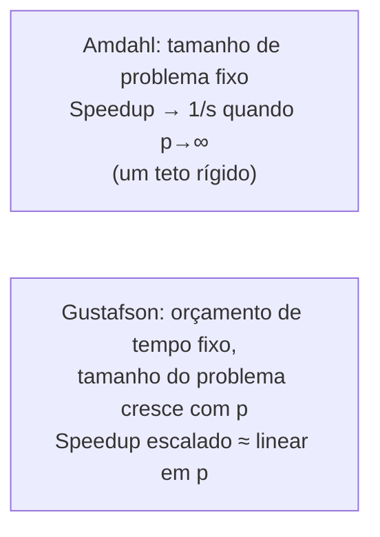

## Objetivos de Aprendizagem

- Enunciar a Lei de Gustafson e explicar como ela difere da Lei de Amdahl na sua suposição central sobre o tamanho do problema.
- Calcular o speedup escalado sob o modelo de Gustafson e contrastá-lo com o speedup de tamanho fixo de Amdahl para a mesma fração sequencial.
- Explicar, usando o enquadramento de cientistas e engenheiros querendo respostas maiores em vez da mesma resposta mais rápido, por que a Lei de Gustafson não é uma refutação da Lei de Amdahl, mas uma mudança de pergunta.
- Identificar qual das duas leis se aplica a um dado cenário de escalabilidade do mundo real.

## Contexto e Motivação

A Lei de Amdahl entregou um resultado genuinamente pessimista: mesmo uma pequena fração sequencial impõe um teto de speedup que nenhuma quantidade de hardware adicional consegue superar. Isso foi, historicamente, levado a sério como um argumento contra investir em máquinas massivamente paralelas: se uma fração sequencial de 5% limita o speedup a 20× de qualquer jeito, por que construir uma máquina com 10.000 processadores?

A resposta de John Gustafson em 1988, publicada enquanto ele trabalhava em máquinas massivamente paralelas reais no Sandia National Laboratories que estavam, na prática, alcançando speedups muito além do que a Lei de Amdahl parecia permitir, identificou a resolução: a Lei de Amdahl implicitamente assume que o tamanho do problema é fixo enquanto o número de processadores cresce. Mas o tutorial do LLNL enuncia a observação prática diretamente: na prática científica e de engenharia real, quando mais processadores ficam disponíveis, os usuários normalmente não continuam resolvendo exatamente o mesmo problema de tamanho fixo mais rápido; eles resolvem um problema maior, mais detalhado e mais ambicioso na mesma quantidade de tempo. A Lei de Gustafson rederiva a fórmula de speedup sob esta suposição diferente, e frequentemente mais realista.

## Teoria Central

### A suposição que muda: tempo fixo, não tamanho fixo

A Lei de Amdahl pergunta: "dado um problema fixo, quanto mais rápido mais processadores conseguem deixá-lo?" A Lei de Gustafson faz uma pergunta diferente: "dada uma quantidade fixa de *tempo* que o usuário está disposto a esperar, quão *maior* um problema pode ser resolvido conforme processadores são adicionados?" Isto não é um truque matemático; reflete como muitos usuários reais de HPC de fato se comportam: um cientista do clima com acesso a um cluster maior normalmente não roda o mesmo modelo climático mais rápido só para terminar mais cedo; ele roda um modelo de resolução mais fina, ou simula um período de tempo mais longo, no mesmo tempo de relógio que já estava orçando.

### Derivando o speedup escalado

No enquadramento de Gustafson, o tempo da execução *paralela* é o que fica fixo, dividido numa fração sequencial `s` e numa fração paralela `(1-s)`, medidas como de fato acontecem em p processadores, e não reescaladas para uma execução hipotética de um processador. A pergunta se torna: se esta mesma quantidade de trabalho paralelo fosse rodada num único processador, sequencialmente, quanto tempo a mais levaria?

```text
Scaled Speedup(p) = s + (1 - s) · p
                   = p - s·(p - 1)
```

Esta é a Lei de Gustafson (às vezes chamada de Lei de Gustafson-Barsis). Note o seu formato: ela é linear em `p`, e não assintoticamente limitada por um teto fixo como o `1/s` de Amdahl. Conforme `p` cresce, o speedup escalado cresce essencialmente em proporção a `p`, reduzido apenas pela contribuição da fração sequencial (tipicamente pequena, e frequentemente encolhendo conforme o tamanho do problema cresce).



### Por que as duas leis estão corretas: elas respondem perguntas diferentes

A Lei de Gustafson não refuta nem contradiz a Lei de Amdahl matematicamente; as duas fórmulas estão corretas sob a sua própria suposição declarada. A Lei de Amdahl descreve corretamente o que acontece se o tamanho do problema de um programa é mantido fixo enquanto processadores são adicionados, um cenário real e importante (escalabilidade forte, coberta a seguir). A Lei de Gustafson descreve corretamente o que acontece se o tamanho do problema cresce para preencher um orçamento de tempo fixo conforme processadores são adicionados, um cenário igualmente real e, para boa parte da computação científica, mais representativo (escalabilidade fraca, também coberta a seguir). Reconhecer qual suposição de fato corresponde a uma dada situação real é mais útil do que tratar uma lei como universalmente "correta" e a outra como uma mera réplica.

### Por que a fração sequencial frequentemente encolhe conforme os problemas crescem

Uma razão adicional, frequentemente ignorada, pela qual a Lei de Gustafson tende a ser otimista na prática: as frações sequenciais de muitos algoritmos reais não escalam proporcionalmente ao tamanho do problema. Um custo fixo de setup sequencial ou de E/S (ler um arquivo de configuração, digamos) se torna uma fração *menor* do tempo total conforme a porção paralela do trabalho cresce para preencher um problema maior, o que favorece ainda mais o enquadramento de speedup escalado em relação ao de tamanho fixo para computação científica em grande escala.

## Exemplos Resolvidos

### Exemplo 1: Comparando o speedup de Amdahl e de Gustafson para a mesma fração sequencial

Usando `s = 0.05` (5% sequencial) com `p = 20` processadores:

```text
Lei de Amdahl (tamanho de problema fixo):
  Speedup(20) = 1 / (0.05 + 0.95/20) = 1 / 0.0975 ≈ 10.26×
  (bem abaixo do teto teórico de 1/0.05 = 20×, e subindo
   só lentamente em direção a ele conforme p cresce mais)

Lei de Gustafson (tempo fixo, tamanho do problema cresce com p):
  Scaled Speedup(20) = 0.05 + 0.95 × 20 = 0.05 + 19 = 19.05×
  (quase linear em p, e não limitado por nenhum teto fixo)
```

Os dois números, 10,26× e 19,05×, não são medições contraditórias da mesma coisa: eles respondem duas perguntas diferentes sobre a mesma fração sequencial de 5%: "quão mais rápido o problema do mesmo tamanho roda?" (Amdahl, 10,26×) versus "quão maior um problema, resolvido no mesmo tempo, esta quantidade de processadores conseguiria tratar?" (Gustafson, 19,05×).

### Exemplo 2: Classificando um cenário real por qual lei se aplica

```text
Cenário                                               Lei aplicável
-----------------------------------------------------  -----------------
Rodar de novo exatamente a simulação do ano passado    Lei de Amdahl
  mais rápido, usando mais processadores, para obter
  o resultado idêntico mais cedo
Usar um cluster maior para rodar uma versão de         Lei de Gustafson
  resolução mais alta da mesma simulação, na mesma
  janela de batch noturna de antes
Renderizar o mesmo vídeo de resolução fixa mais        Lei de Amdahl
  rápido jogando mais nós de renderização nele
Usar nós de GPU adicionais para simular uma proteína   Lei de Gustafson
  maior, no mesmo prazo da reunião do laboratório em
  que uma menor era simulada antes
```

A pergunta que distingue, em todos os casos: o tamanho do problema é mantido fixo enquanto os processadores crescem (Amdahl), ou espera-se que o tamanho do problema cresça para aproveitar o orçamento de tempo disponível conforme os processadores crescem (Gustafson)?

## Equívocos Comuns e Armadilhas

- **"A Lei de Gustafson prova que a Lei de Amdahl está errada."** As duas são matematicamente corretas; elas respondem perguntas diferentes sob suposições diferentes sobre se o tamanho do problema é mantido fixo (Amdahl) ou se pode crescer com os processadores disponíveis (Gustafson). A Lei de Gustafson é um reenquadramento, não uma refutação.
- **"O speedup escalado é 'melhor' ou 'mais real' que o speedup de Amdahl."** Nenhum dos números é inerentemente mais correto. Qual deles é a pergunta relevante depende inteiramente de como o problema vai de fato ser usado: rodar de novo o mesmo problema fixo mais rápido (Amdahl) ou resolver um problema maior no mesmo tempo (Gustafson) são ambos objetivos legítimos do mundo real, só que diferentes.
- **"A Lei de Gustafson significa que o speedup é ilimitado."** O speedup escalado cresce aproximadamente de forma linear com `p` sob a suposição de Gustafson, mas ainda é reduzido pela contribuição da fração sequencial, e limites do mundo real (capacidade de memória, largura de banda de rede, desequilíbrio de carga em escala) ainda se aplicam. A Lei de Gustafson remove o teto específico de *tamanho de problema fixo* de Amdahl, não todo limite possível de escalabilidade.
- **"Você deveria sempre projetar para escalabilidade no estilo Gustafson em vez do estilo Amdahl."** O enquadramento certo depende da necessidade real do usuário. Alguns problemas (compilar um programa fixo, renderizar um vídeo fixo) genuinamente têm um tamanho fixo que os usuários querem que termine mais rápido, o que é território de Amdahl, não de Gustafson.

## Resumo

A Lei de Gustafson reenquadra a suposição central da Lei de Amdahl: em vez de manter o tamanho do problema fixo enquanto os processadores crescem (Amdahl), ela mantém o *orçamento de tempo* fixo e deixa o tamanho do problema crescer com o número de processadores, o padrão realista para boa parte da computação científica, onde mais hardware é usado para resolver problemas maiores e mais detalhados em vez do mesmo problema mais rápido. Sob esta suposição, o speedup escalado, `s + (1-s)·p`, cresce aproximadamente de forma linear com `p` em vez de bater no teto `1/s` de Amdahl. As duas leis não se contradizem; elas descrevem dois cenários reais genuinamente diferentes, formalizados no próximo conceito como escalabilidade forte (o regime de Amdahl) e escalabilidade fraca (o regime de Gustafson).

## Documentation Links

- [LLNL: Introduction to Parallel Computing Tutorial](https://hpc.llnl.gov/documentation/tutorials/introduction-parallel-computing-tutorial): cobre as leis de Amdahl e de Gustafson como conceitos de desempenho complementares.
- [UC Berkeley CS267: Applications of Parallel Computers](https://sites.google.com/lbl.gov/cs267-spr2024): contexto de curso real sobre como o speedup escalado é usado na prática para grandes cargas de trabalho de computação científica.
