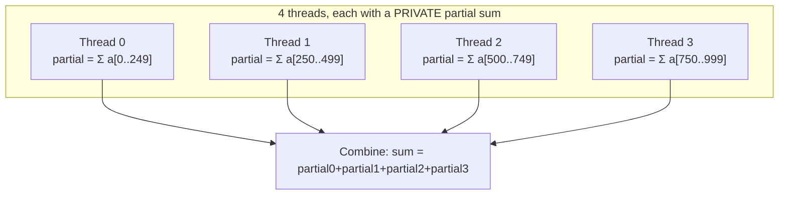

## Learning Objectives

- Write a correct `#pragma omp parallel for` loop, and explain how OpenMP splits iterations across the team's threads.
- Explain why a naive parallelized sum loop produces a wrong, non-deterministic result, and how the `reduction` clause fixes it.
- Distinguish `private` and `shared` variable scope in an OpenMP region, and identify which a given loop variable needs.
- Relate `#pragma omp parallel for` directly to the data-parallel decomposition and domain-decomposition concepts from earlier in this discipline.

## Context & Motivation

The previous concept showed how `#pragma omp parallel` forks a team of threads that all execute the same code — but by itself, that only produces threads doing *redundant* work, each running the identical loop over the identical full range. Turning that into genuine data parallelism — each thread handling a different slice of the work, exactly as domain decomposition described earlier in this discipline — requires OpenMP's **work-sharing constructs**, the most common and most immediately useful part of the whole API. This concept covers `#pragma omp parallel for`, by far the most frequently used OpenMP directive in real code, and the `reduction` clause that makes accumulation patterns (sums, maxes, counts) safe to parallelize.

## Core Theory

### `parallel for`: splitting loop iterations across the team

`#pragma omp parallel for` combines forking a team of threads with automatically dividing a loop's iterations among them — each thread executes only its own assigned subset of iterations, not the whole loop:

```c
#pragma omp parallel for
for (int i = 0; i < n; i++) {
    result[i] = a[i] * a[i];
}
```

With 4 threads and `n = 1000`, OpenMP's default (static) scheduling assigns roughly 250 contiguous iterations to each thread — thread 0 handles `i = 0..249`, thread 1 handles `i = 250..499`, and so on. This is exactly the domain decomposition already covered earlier in this discipline, applied automatically by the compiler and runtime rather than by hand: the "domain" here is the iteration space itself, split into contiguous chunks, one per thread, each running identical code on its own chunk.

Crucially, this loop is safe to parallelize as written because each iteration writes to a different, independent element of `result` — there is no data dependency (in the sense already covered earlier in this discipline) between iterations, so their relative order genuinely does not matter.

### Why a naive parallel sum is wrong

Contrast the previous safe example with an accumulation pattern:

```c
double sum = 0.0;
#pragma omp parallel for
for (int i = 0; i < n; i++) {
    sum += a[i];   // WRONG: a race condition on the shared variable `sum`
}
```

Every thread reads and writes the *same* shared variable `sum`. Two threads can both read `sum`'s current value, both compute `sum + a[i]` for their own `i`, and both write back — with one thread's update silently overwritten by the other's, exactly the shared-state race condition `programming-paradigms` already introduced as a hazard of shared-memory concurrency. Running this code will typically produce a different, wrong, and non-reproducible total on every run, depending on the exact timing of the threads.

### `reduction`: giving every thread its own private accumulator

OpenMP's `reduction` clause solves this pattern directly, without requiring an explicit lock:

```c
double sum = 0.0;
#pragma omp parallel for reduction(+:sum)
for (int i = 0; i < n; i++) {
    sum += a[i];   // Correct: each thread gets its own private `sum`
}
```

`reduction(+:sum)` tells OpenMP to give each thread its own private copy of `sum`, initialized to the operator's identity value (0 for `+`), let each thread accumulate its own partial sum over its own share of the loop with no interference from other threads, and then combine all the threads' private partial sums into the original shared `sum` variable using the `+` operator once every thread has finished — automatically and correctly, with no manual locking required. OpenMP supports reduction with several operators (`+`, `*`, `max`, `min`, and others), each combining threads' private results the appropriate way.



### `private` and `shared` variable scope

By default, a variable declared *outside* an OpenMP parallel region is `shared` — every thread sees and can modify the same memory location (which is what made the naive sum example dangerous). A variable can be explicitly marked `private`, giving each thread its own independent, uninitialized copy for the duration of the region — necessary for any per-thread scratch variable (like a loop index used inside a nested computation) that should not be accidentally shared and raced on between threads. `reduction` is, in effect, a specialized, safe combination of private-per-thread accumulation with an automatic combine step at the end.

## Worked Examples

### Example 1: Tracing static scheduling across 4 threads

For `#pragma omp parallel for` with `n = 12` and 4 threads, OpenMP's default static scheduling assigns:

```text
Thread 0: iterations 0, 1, 2
Thread 1: iterations 3, 4, 5
Thread 2: iterations 6, 7, 8
Thread 3: iterations 9, 10, 11
```

Each thread's 3 contiguous iterations run independently and concurrently with no dependency between threads (assuming, as in the safe `result[i] = a[i]*a[i]` example, that each iteration writes to a distinct array element) — this is data-parallel domain decomposition of the loop's iteration space, applied automatically.

### Example 2: A correct parallel reduction, traced numerically

Summing `a = [1, 2, 3, 4, 5, 6, 7, 8]` with `reduction(+:sum)` across 2 threads, static scheduling:

```text
Thread 0 (iterations 0-3): private sum = 1+2+3+4 = 10
Thread 1 (iterations 4-7): private sum = 5+6+7+8 = 26

Combine step: final sum = 10 + 26 = 36

(Sequential check: 1+2+3+4+5+6+7+8 = 36 — matches exactly)
```

Every run of this reduction, with any number of threads and any scheduling, produces exactly 36 — deterministic and correct, unlike the naive shared-variable version, which would produce a different (and typically smaller, due to lost updates) result on different runs, and possibly a different result on the very same run repeated twice.

## Common Misconceptions & Pitfalls

- **"`#pragma omp parallel for` automatically detects and fixes data dependencies."** It does not — it blindly splits iterations across threads as instructed; if the loop body has a genuine dependency between iterations (like the naive sum, or one iteration reading a value another iteration writes), the programmer must either restructure the loop or use a construct like `reduction` explicitly. OpenMP does not analyze the loop body for correctness.
- **"Any variable modified inside a parallel loop needs `reduction`."** Only accumulation-style patterns need `reduction` — a loop writing to a distinct output array element per iteration (the safe `result[i] = ...` example) needs no special clause at all, because there's no shared write to protect.
- **"More threads always finish a `parallel for` loop faster."** Only up to the point where communication/overhead (or a workload with uneven per-iteration cost, an instance of the load-balancing problem covered earlier in this discipline) starts to dominate — the granularity and Amdahl's Law reasoning already covered earlier in this discipline apply directly here too.
- **"`private` variables are initialized to zero or to their value before the region."** They are not — a `private` copy starts *uninitialized* inside the region (its value from before the region is not carried in); a variable that needs a defined starting value inside each thread's private copy must be explicitly initialized inside the region, or use `firstprivate` instead, which does copy in the pre-region value.

## Summary

`#pragma omp parallel for` automatically splits a loop's iterations across the already-forked team of threads — a direct, automatic realization of the domain decomposition already covered earlier in this discipline, applied to the loop's iteration space. This is safe when iterations have no data dependency on each other, but a naive accumulation loop (like a running sum) creates a genuine race condition on a shared variable; the `reduction` clause fixes this correctly and efficiently by giving each thread its own private accumulator and combining all threads' results automatically at the end. Recognizing `shared` (default) versus `private` variable scope, and recognizing which loops are safe as-is versus which need a `reduction`, is the core skill for writing correct OpenMP work-sharing code — a skill the next concept extends to cases `reduction` alone cannot cover.

## Documentation Links

- [LLNL HPC Tutorials — OpenMP](https://hpc-tutorials.llnl.gov/openmp/) — source for the work-sharing constructs, the `reduction` clause, and data-scope attribute clauses (`private`/`shared`) covered in this concept.
