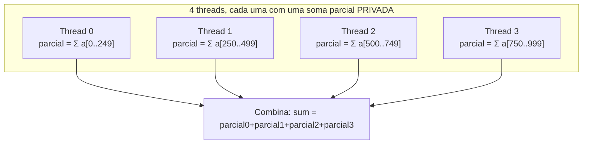

## Objetivos de Aprendizagem

- Escrever um loop `#pragma omp parallel for` correto, e explicar como o OpenMP divide as iterações entre as threads do time.
- Explicar por que um loop de soma paralelizado de forma ingênua produz um resultado errado e não determinístico, e como a cláusula `reduction` corrige isso.
- Distinguir o escopo de variável `private` e `shared` numa região OpenMP, e identificar qual deles uma dada variável de loop precisa.
- Relacionar `#pragma omp parallel for` diretamente aos conceitos de decomposição paralela de dados e decomposição de domínio vistos antes nesta disciplina.

## Contexto e Motivação

O conceito anterior mostrou como `#pragma omp parallel` faz fork de um time de threads que executam todas o mesmo código, mas por si só isso só produz threads fazendo trabalho *redundante*, cada uma rodando o loop idêntico sobre o mesmo intervalo completo. Transformar isso em paralelismo de dados genuíno (cada thread tratando uma fatia diferente do trabalho, exatamente como a decomposição de domínio descrita antes nesta disciplina) exige os **construtos de work-sharing** do OpenMP, a parte mais comum e de utilidade mais imediata de toda a API. Este conceito cobre `#pragma omp parallel for`, de longe a diretiva OpenMP mais usada em código real, e a cláusula `reduction`, que torna seguros de paralelizar os padrões de acumulação (somas, máximos, contagens).

## Teoria Central

### `parallel for`: dividindo as iterações do loop entre o time

`#pragma omp parallel for` combina o fork de um time de threads com a divisão automática das iterações de um loop entre elas. Cada thread executa apenas o seu próprio subconjunto atribuído de iterações, não o loop inteiro:

```c
#pragma omp parallel for
for (int i = 0; i < n; i++) {
    result[i] = a[i] * a[i];
}
```

Com 4 threads e `n = 1000`, o escalonamento padrão (estático) do OpenMP atribui aproximadamente 250 iterações contíguas a cada thread: a thread 0 trata `i = 0..249`, a thread 1 trata `i = 250..499`, e assim por diante. Esta é exatamente a decomposição de domínio já coberta antes nesta disciplina, aplicada automaticamente pelo compilador e pelo runtime em vez de à mão: o "domínio" aqui é o próprio espaço de iterações, dividido em pedaços contíguos, um por thread, cada uma rodando código idêntico no seu próprio pedaço.

Crucialmente, este loop é seguro de paralelizar como está escrito porque cada iteração escreve num elemento diferente e independente de `result`. Não há dependência de dados (no sentido já coberto antes nesta disciplina) entre iterações, então a ordem relativa delas genuinamente não importa.

### Por que uma soma paralela ingênua está errada

Contraste o exemplo seguro anterior com um padrão de acumulação:

```c
double sum = 0.0;
#pragma omp parallel for
for (int i = 0; i < n; i++) {
    sum += a[i];   // ERRADO: uma condição de corrida na variável compartilhada `sum`
}
```

Toda thread lê e escreve a *mesma* variável compartilhada `sum`. Duas threads podem ambas ler o valor atual de `sum`, ambas calcular `sum + a[i]` para o seu próprio `i`, e ambas escrever de volta, com a atualização de uma thread silenciosamente sobrescrita pela da outra, exatamente a condição de corrida de estado compartilhado que `programming-paradigms` já introduziu como um risco da concorrência em memória compartilhada. Rodar este código tipicamente produzirá um total diferente, errado e não reproduzível a cada execução, dependendo do timing exato das threads.

### `reduction`: dando a cada thread o seu próprio acumulador privado

A cláusula `reduction` do OpenMP resolve este padrão diretamente, sem exigir um lock explícito:

```c
double sum = 0.0;
#pragma omp parallel for reduction(+:sum)
for (int i = 0; i < n; i++) {
    sum += a[i];   // Correto: cada thread recebe o seu próprio `sum` privado
}
```

`reduction(+:sum)` diz ao OpenMP para dar a cada thread a sua própria cópia privada de `sum`, inicializada com o valor identidade do operador (0 para `+`), deixar cada thread acumular a sua própria soma parcial sobre a sua própria fatia do loop sem interferência de outras threads, e então combinar todas as somas parciais privadas das threads na variável compartilhada original `sum` usando o operador `+` assim que toda thread terminar, de forma automática e correta, sem nenhum lock manual. O OpenMP suporta redução com vários operadores (`+`, `*`, `max`, `min` e outros), cada um combinando os resultados privados das threads da forma apropriada.



### Escopo de variável `private` e `shared`

Por padrão, uma variável declarada *fora* de uma região paralela OpenMP é `shared`: toda thread vê e pode modificar a mesma posição de memória (que é o que tornava perigoso o exemplo da soma ingênua). Uma variável pode ser explicitamente marcada como `private`, dando a cada thread a sua própria cópia independente e não inicializada durante a região, o que é necessário para qualquer variável de rascunho por thread (como um índice de loop usado dentro de uma computação aninhada) que não deveria ser acidentalmente compartilhada e disputada entre threads. A `reduction` é, na prática, uma combinação especializada e segura de acumulação privada por thread com um passo automático de combinação no final.

## Exemplos Resolvidos

### Exemplo 1: Rastreando o escalonamento estático entre 4 threads

Para `#pragma omp parallel for` com `n = 12` e 4 threads, o escalonamento estático padrão do OpenMP atribui:

```text
Thread 0: iterações 0, 1, 2
Thread 1: iterações 3, 4, 5
Thread 2: iterações 6, 7, 8
Thread 3: iterações 9, 10, 11
```

As 3 iterações contíguas de cada thread rodam independente e concorrentemente, sem dependência entre threads (supondo, como no exemplo seguro `result[i] = a[i]*a[i]`, que cada iteração escreve num elemento distinto do array). Isto é decomposição de domínio paralela de dados do espaço de iterações do loop, aplicada automaticamente.

### Exemplo 2: Uma redução paralela correta, rastreada numericamente

Somando `a = [1, 2, 3, 4, 5, 6, 7, 8]` com `reduction(+:sum)` entre 2 threads, escalonamento estático:

```text
Thread 0 (iterações 0-3): soma privada = 1+2+3+4 = 10
Thread 1 (iterações 4-7): soma privada = 5+6+7+8 = 26

Passo de combinação: soma final = 10 + 26 = 36

(Conferência sequencial: 1+2+3+4+5+6+7+8 = 36, bate exatamente)
```

Toda execução desta redução, com qualquer número de threads e qualquer escalonamento, produz exatamente 36: determinística e correta, ao contrário da versão ingênua com variável compartilhada, que produziria um resultado diferente (e tipicamente menor, devido a atualizações perdidas) em execuções diferentes, e possivelmente um resultado diferente até na mesmíssima execução repetida duas vezes.

## Equívocos Comuns e Armadilhas

- **"`#pragma omp parallel for` detecta e corrige dependências de dados automaticamente."** Não detecta. Ele divide cegamente as iterações entre as threads conforme instruído; se o corpo do loop tem uma dependência genuína entre iterações (como a soma ingênua, ou uma iteração lendo um valor que outra iteração escreve), o programador precisa ou reestruturar o loop ou usar explicitamente um construto como `reduction`. O OpenMP não analisa o corpo do loop quanto à corretude.
- **"Toda variável modificada dentro de um loop paralelo precisa de `reduction`."** Só padrões de acumulação precisam de `reduction`. Um loop que escreve num elemento distinto do array de saída por iteração (o exemplo seguro `result[i] = ...`) não precisa de nenhuma cláusula especial, porque não há escrita compartilhada a proteger.
- **"Mais threads sempre terminam um loop `parallel for` mais rápido."** Só até o ponto em que a comunicação/overhead (ou uma carga de trabalho com custo por iteração desigual, uma instância do problema de balanceamento de carga visto antes nesta disciplina) começa a dominar. O raciocínio de granularidade e da Lei de Amdahl já visto antes nesta disciplina se aplica diretamente aqui também.
- **"Variáveis `private` são inicializadas com zero ou com o valor que tinham antes da região."** Não são. Uma cópia `private` começa *não inicializada* dentro da região (o seu valor de antes da região não é trazido para dentro); uma variável que precisa de um valor inicial definido dentro da cópia privada de cada thread precisa ser explicitamente inicializada dentro da região, ou usar `firstprivate`, que copia para dentro o valor de antes da região.

## Resumo

`#pragma omp parallel for` divide automaticamente as iterações de um loop entre o time de threads já criado pelo fork, uma realização direta e automática da decomposição de domínio vista antes nesta disciplina, aplicada ao espaço de iterações do loop. Isso é seguro quando as iterações não têm dependência de dados entre si, mas um loop de acumulação ingênuo (como uma soma corrente) cria uma condição de corrida genuína numa variável compartilhada; a cláusula `reduction` corrige isso de forma correta e eficiente, dando a cada thread o seu próprio acumulador privado e combinando automaticamente os resultados de todas as threads no final. Reconhecer o escopo de variável `shared` (padrão) versus `private`, e reconhecer quais loops são seguros como estão versus quais precisam de uma `reduction`, é a habilidade central para escrever código de work-sharing OpenMP correto, uma habilidade que o próximo conceito estende a casos que a `reduction` sozinha não consegue cobrir.

## Documentation Links

- [LLNL HPC Tutorials: OpenMP](https://hpc-tutorials.llnl.gov/openmp/): fonte para os construtos de work-sharing, a cláusula `reduction` e as cláusulas de atributo de escopo de dados (`private`/`shared`) cobertas neste conceito.
