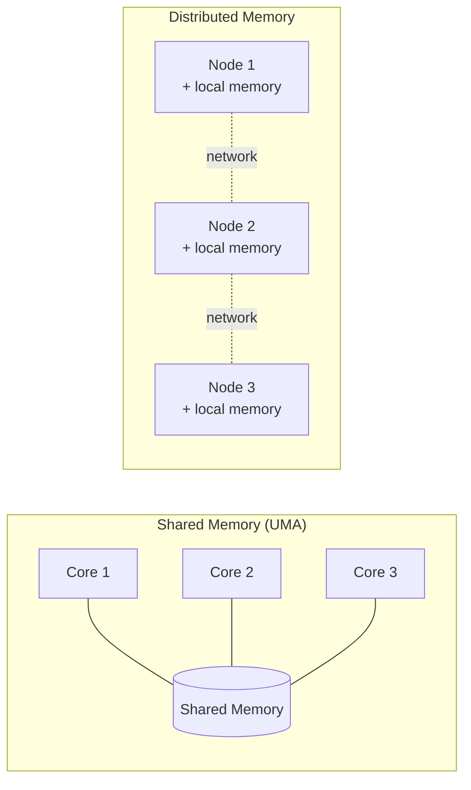

## Learning Objectives

- Describe shared memory, distributed memory, and hybrid distributed-shared memory architectures, and identify a realistic example machine for each.
- Distinguish Uniform Memory Access (UMA) from Non-Uniform Memory Access (NUMA), and explain why NUMA exists at all.
- List the real advantages and disadvantages LLNL's tutorial attributes to shared and distributed memory, without treating either as unconditionally better.
- Explain why a modern supercomputer's actual architecture is usually hybrid, not purely one or the other.

## Context & Motivation

The previous concept drew a line between shared memory and distributed memory as the two hardware worlds this discipline programs against. That line deserves more precision before any programming model is introduced, because the exact shape of the memory architecture — not just "shared" or "distributed" as a label — determines which optimizations matter and which bugs are even possible. LLNL's Introduction to Parallel Computing tutorial, one of the most widely used practical references for exactly this material, organizes its own memory-architecture material around three categories: shared memory (further split into UMA and NUMA), distributed memory, and hybrid distributed-shared memory — the same three-way split this concept follows.

Getting this right matters concretely: a program tuned for a UMA shared-memory machine, where every core reaches every byte of memory in the same time, can perform badly on a NUMA machine, where some memory is "close" to a given core and some is "far," unless the programmer is aware of the difference. And a program designed only for pure shared memory won't run at all on a cluster with no shared address space — the memory architecture is not a background detail, it is the first design constraint a parallel program has to be written against.

## Core Theory

### Shared memory: UMA and NUMA

In a shared-memory architecture, every processor has direct, uniform access to a single, unified memory space — any processor can read or write any address, and changes made by one processor are (eventually, and subject to cache coherence, already covered in Computer Architecture) visible to every other processor. LLNL's tutorial distinguishes two variants:

- **Uniform Memory Access (UMA)**: every processor has equal access time to every memory location. This is the simpler, easier-to-reason-about case, historically realized by symmetric multiprocessors (SMP) with all processors on a single memory bus.
- **Non-Uniform Memory Access (NUMA)**: memory access time depends on which processor is making the request and which memory bank is being accessed — typically because the machine is physically built from multiple processor-memory pairs connected together, and a processor can access its own "local" memory faster than another processor's "remote" memory. Most real modern multi-socket servers are NUMA machines, not UMA.

LLNL's tutorial lists shared memory's real advantages honestly: a global address space is convenient to program (data sharing is fast and uniform, conceptually), and it is relatively easy for a programmer to reason about compared to explicit messaging. Its real disadvantages are just as concrete: adding more processors increases traffic on the shared memory-CPU path, and the programmer remains fully responsible for correct synchronization to prevent races — shared memory does not remove the coordination problem, it just makes uncoordinated access dangerously easy to write.

### Distributed memory

In a distributed-memory architecture, each processor has its own private, local memory that no other processor can access directly. If one processor needs data another processor holds, it must explicitly request it through the network, and the other processor must explicitly send it — a real message, not a memory read. There is no shared address space at all, and no way to accidentally race on a shared variable, because there is no shared variable.

LLNL's tutorial names the real tradeoffs: memory scales directly with the number of processors added (each new machine brings its own memory), and there is no cache-coherence overhead to manage. The disadvantage is that the programmer bears full responsibility for all the data communication needed between processors, and that communication is measurably slower and more complex to reason about than a plain memory access — sending a message across a network takes orders of magnitude longer than reading a byte from local RAM.



### Hybrid distributed-shared memory

Real large-scale machines today are almost never purely one or the other. A typical modern cluster is a hybrid: many nodes, each with its own private memory (distributed, at the cluster level), but each node internally is itself a shared-memory multicore machine (shared, within the node). This is precisely why the two programming models this discipline covers — OpenMP and MPI — are so often used together in practice: MPI handles communication between nodes, while OpenMP parallelizes the work within each node's shared-memory cores. The discipline's capstone will return to this hybrid pattern directly.

### Why this distinction drives everything that follows

Every design decision the rest of this discipline covers traces back to which of these architectures a program targets. Decomposition strategy, communication cost, and which of OpenMP or MPI even applies are all downstream of this one hardware fact. A programmer who mismatches their programming model to the hardware — writing shared-memory code for a distributed cluster, or vice versa — produces code that either does not run at all, or runs but never actually uses more than one machine's worth of processors.

## Worked Examples

### Example 1: Estimating relative access costs

Suppose accessing local memory takes 100 nanoseconds on a NUMA machine, remote (another socket's) memory takes 300 nanoseconds, and sending a small message across a cluster network takes 10,000 nanoseconds (10 microseconds) — realistic orders of magnitude for real hardware.

```text
Access type                   Approx. latency   Relative to local memory
-----------------------------  ----------------  -------------------------
Local NUMA memory access       100 ns            1×
Remote NUMA memory access      300 ns            3×
Network message (small)        10,000 ns         100×
```

The pattern to notice: even the "slow" case within shared memory (remote NUMA access) is roughly two orders of magnitude faster than the "fast" case of distributed-memory communication. This is precisely why, when both are available (the hybrid case), a design that keeps communication inside a node (shared memory) whenever possible, and only crosses nodes (distributed memory, paying the network cost) when it must, will always be the better-performing choice — a principle later concepts on granularity and load balancing build on directly.

### Example 2: Classifying a machine from its description

Given the description "a supercomputer built from 1,000 identical server nodes connected by a high-speed network, where each node itself contains two 32-core processors sharing one bank of memory," classify its architecture:

```text
Property                              Classification
-------------------------------------  ----------------
Across the 1,000 nodes                 Distributed memory
Within a single node's 64 cores        Shared memory (NUMA,
                                         since 2 processor sockets)
Overall machine architecture           Hybrid distributed-shared
```

This is a realistic description of an actual modern HPC cluster, and it is exactly the hybrid case the previous section described — which is why real large-scale scientific computing code is very often written using both MPI (across nodes) and OpenMP (within a node) at once.

## Common Misconceptions & Pitfalls

- **"Shared memory means there's no coordination cost."** Shared memory removes the need for explicit message-passing, but the programmer is still fully responsible for correct synchronization — races are, if anything, easier to accidentally introduce in shared memory than in distributed memory, where there's no shared variable to race on at all.
- **"NUMA is a programming model."** NUMA is a hardware property of how memory is physically attached to processors; it doesn't change the address space (which is still uniformly addressable) — it changes the *cost* of accessing different parts of it, a distinction that matters for performance tuning, not correctness.
- **"Real supercomputers are either shared or distributed memory, not both."** Nearly every large real machine today is a hybrid — distributed across nodes, shared within each node — which is exactly why both OpenMP and MPI remain relevant, often in the same program.
- **"Distributed memory is strictly worse because messages are slow."** Distributed memory trades speed of individual accesses for the ability to scale memory capacity linearly by simply adding more nodes — a tradeoff that is the right one whenever a problem's data no longer fits in any single machine's memory, no matter how fast that machine's shared memory is.

## Summary

Parallel hardware comes in three real shapes: shared memory (UMA, where every processor's access time is equal, or NUMA, where it depends on locality), distributed memory (private per-processor memory, coordinated only through explicit messages), and hybrid distributed-shared memory (the realistic case for most modern large machines — distributed across nodes, shared within each node). Each shape has real, honestly-stated tradeoffs: shared memory is easier to program but leaves synchronization entirely on the programmer's shoulders and doesn't scale memory capacity for free; distributed memory scales memory and avoids coherence overhead but pays a communication cost roughly two orders of magnitude higher than even the slowest shared-memory access. This hardware distinction is the reason this discipline covers two separate programming models later — OpenMP for the shared-memory case, MPI for the distributed-memory case — and the reason real HPC code frequently uses both together.

## Documentation Links

- [LLNL — Introduction to Parallel Computing Tutorial](https://hpc.llnl.gov/documentation/tutorials/introduction-parallel-computing-tutorial) — source for the shared/distributed/hybrid classification, UMA/NUMA distinction, and the advantages/disadvantages of each.
