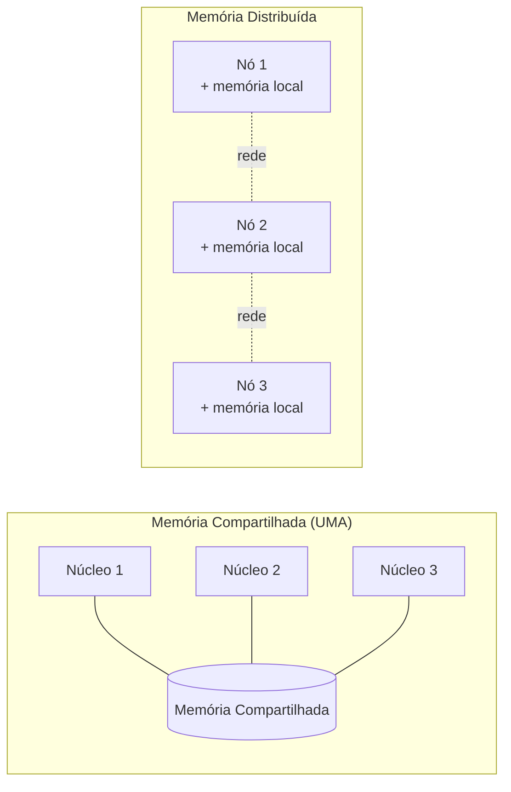

## Objetivos de Aprendizagem

- Descrever as arquiteturas de memória compartilhada, memória distribuída e memória distribuída-compartilhada híbrida, e identificar uma máquina de exemplo realista para cada uma.
- Distinguir Uniform Memory Access (UMA) de Non-Uniform Memory Access (NUMA), e explicar por que o NUMA sequer existe.
- Listar as vantagens e desvantagens reais que o tutorial do LLNL atribui à memória compartilhada e à memória distribuída, sem tratar nenhuma das duas como incondicionalmente melhor.
- Explicar por que a arquitetura real de um supercomputador moderno é geralmente híbrida, e não puramente uma ou outra.

## Contexto e Motivação

O conceito anterior traçou uma linha entre memória compartilhada e memória distribuída como os dois mundos de hardware contra os quais esta disciplina programa. Essa linha merece mais precisão antes que qualquer modelo de programação seja introduzido, porque o formato exato da arquitetura de memória (não apenas "compartilhada" ou "distribuída" como rótulo) determina quais otimizações importam e quais bugs são sequer possíveis. O tutorial Introduction to Parallel Computing do LLNL, uma das referências práticas mais usadas para exatamente este material, organiza o seu próprio material sobre arquitetura de memória em três categorias: memória compartilhada (subdividida em UMA e NUMA), memória distribuída e memória distribuída-compartilhada híbrida, a mesma divisão em três que este conceito segue.

Acertar isso importa concretamente: um programa ajustado para uma máquina de memória compartilhada UMA, onde todo núcleo alcança todo byte de memória no mesmo tempo, pode ter um desempenho ruim numa máquina NUMA, onde parte da memória está "perto" de um dado núcleo e parte está "longe", a menos que o programador esteja ciente da diferença. E um programa projetado apenas para memória compartilhada pura simplesmente não rodará num cluster sem espaço de endereçamento compartilhado. A arquitetura de memória não é um detalhe de fundo; ela é a primeira restrição de projeto contra a qual um programa paralelo tem que ser escrito.

## Teoria Central

### Memória compartilhada: UMA e NUMA

Numa arquitetura de memória compartilhada, todo processador tem acesso direto e uniforme a um único espaço de memória unificado: qualquer processador pode ler ou escrever qualquer endereço, e as mudanças feitas por um processador ficam (eventualmente, e sujeitas à coerência de cache, já coberta em Arquitetura de Computadores) visíveis para todos os outros processadores. O tutorial do LLNL distingue duas variantes:

- **Uniform Memory Access (UMA)**: todo processador tem tempo de acesso igual a toda posição de memória. Este é o caso mais simples e mais fácil de raciocinar, historicamente realizado por multiprocessadores simétricos (SMP) com todos os processadores num único barramento de memória.
- **Non-Uniform Memory Access (NUMA)**: o tempo de acesso à memória depende de qual processador está fazendo a requisição e de qual banco de memória está sendo acessado, tipicamente porque a máquina é fisicamente construída a partir de múltiplos pares processador-memória conectados entre si, e um processador consegue acessar a sua própria memória "local" mais rápido do que a memória "remota" de outro processador. A maioria dos servidores modernos reais com múltiplos sockets são máquinas NUMA, não UMA.

O tutorial do LLNL lista honestamente as vantagens reais da memória compartilhada: um espaço de endereçamento global é conveniente de programar (o compartilhamento de dados é rápido e uniforme, conceitualmente), e é relativamente fácil para um programador raciocinar sobre ele em comparação com troca de mensagens explícita. As suas desvantagens reais são igualmente concretas: adicionar mais processadores aumenta o tráfego no caminho memória-CPU compartilhado, e o programador continua inteiramente responsável pela sincronização correta para evitar corridas. A memória compartilhada não remove o problema da coordenação; ela apenas torna o acesso não coordenado perigosamente fácil de escrever.

### Memória distribuída

Numa arquitetura de memória distribuída, cada processador tem a sua própria memória local e privada, que nenhum outro processador pode acessar diretamente. Se um processador precisa de dados que outro processador mantém, ele precisa requisitá-los explicitamente pela rede, e o outro processador precisa enviá-los explicitamente: uma mensagem real, não uma leitura de memória. Não existe espaço de endereçamento compartilhado algum, e não há como disputar acidentalmente uma variável compartilhada, porque não existe variável compartilhada.

O tutorial do LLNL nomeia os trade-offs reais: a memória escala diretamente com o número de processadores adicionados (cada nova máquina traz a sua própria memória), e não há overhead de coerência de cache para gerenciar. A desvantagem é que o programador carrega toda a responsabilidade por toda a comunicação de dados necessária entre processadores, e essa comunicação é mensuravelmente mais lenta e mais complexa de raciocinar do que um acesso simples à memória: enviar uma mensagem por uma rede leva ordens de grandeza mais tempo do que ler um byte da RAM local.



### Memória distribuída-compartilhada híbrida

As máquinas reais de grande escala de hoje quase nunca são puramente uma ou outra. Um cluster moderno típico é híbrido: muitos nós, cada um com a sua própria memória privada (distribuída, no nível do cluster), mas cada nó é internamente ele mesmo uma máquina multicore de memória compartilhada (compartilhada, dentro do nó). É exatamente por isso que os dois modelos de programação que esta disciplina cobre, OpenMP e MPI, são tão frequentemente usados juntos na prática: o MPI cuida da comunicação entre nós, enquanto o OpenMP paraleliza o trabalho dentro dos núcleos de memória compartilhada de cada nó. O capstone da disciplina voltará diretamente a este padrão híbrido.

### Por que esta distinção dirige tudo o que vem depois

Toda decisão de projeto que o restante desta disciplina cobre remete a qual destas arquiteturas um programa mira. A estratégia de decomposição, o custo de comunicação e qual de OpenMP ou MPI sequer se aplica são todos consequências deste único fato de hardware. Um programador que descasa o seu modelo de programação do hardware (escrevendo código de memória compartilhada para um cluster distribuído, ou vice-versa) produz código que ou não roda de forma alguma, ou roda mas nunca de fato usa mais do que os processadores de uma única máquina.

## Exemplos Resolvidos

### Exemplo 1: Estimando custos relativos de acesso

Suponha que acessar a memória local leva 100 nanossegundos numa máquina NUMA, a memória remota (de outro socket) leva 300 nanossegundos, e enviar uma mensagem pequena por uma rede de cluster leva 10.000 nanossegundos (10 microssegundos), ordens de grandeza realistas para hardware real.

```text
Tipo de acesso                Latência aprox.   Relativa à memória local
-----------------------------  ----------------  -------------------------
Acesso à memória NUMA local    100 ns            1×
Acesso à memória NUMA remota   300 ns            3×
Mensagem de rede (pequena)     10.000 ns         100×
```

O padrão a notar: mesmo o caso "lento" dentro da memória compartilhada (acesso NUMA remoto) é cerca de duas ordens de grandeza mais rápido do que o caso "rápido" da comunicação em memória distribuída. É exatamente por isso que, quando ambos estão disponíveis (o caso híbrido), um projeto que mantém a comunicação dentro de um nó (memória compartilhada) sempre que possível, e só cruza nós (memória distribuída, pagando o custo da rede) quando precisa, será sempre a escolha de melhor desempenho, um princípio sobre o qual conceitos posteriores de granularidade e balanceamento de carga constroem diretamente.

### Exemplo 2: Classificando uma máquina a partir da sua descrição

Dada a descrição "um supercomputador construído a partir de 1.000 nós de servidor idênticos conectados por uma rede de alta velocidade, onde cada nó contém dois processadores de 32 núcleos compartilhando um banco de memória", classifique a sua arquitetura:

```text
Propriedade                           Classificação
-------------------------------------  ----------------
Entre os 1.000 nós                     Memória distribuída
Dentro dos 64 núcleos de um único nó   Memória compartilhada (NUMA,
                                         já que são 2 sockets de processador)
Arquitetura geral da máquina           Distribuída-compartilhada híbrida
```

Esta é uma descrição realista de um cluster HPC moderno de verdade, e é exatamente o caso híbrido que a seção anterior descreveu, e é por isso que código real de computação científica em grande escala é muito frequentemente escrito usando MPI (entre nós) e OpenMP (dentro de um nó) ao mesmo tempo.

## Equívocos Comuns e Armadilhas

- **"Memória compartilhada significa que não há custo de coordenação."** A memória compartilhada remove a necessidade de troca de mensagens explícita, mas o programador continua inteiramente responsável pela sincronização correta. As corridas são, se algo, mais fáceis de introduzir acidentalmente em memória compartilhada do que em memória distribuída, onde não há nenhuma variável compartilhada para disputar.
- **"NUMA é um modelo de programação."** NUMA é uma propriedade de hardware de como a memória está fisicamente ligada aos processadores; ela não muda o espaço de endereçamento (que continua uniformemente endereçável), ela muda o *custo* de acessar diferentes partes dele, uma distinção que importa para ajuste de desempenho, não para corretude.
- **"Supercomputadores reais são ou de memória compartilhada ou distribuída, não ambos."** Quase toda grande máquina real hoje é híbrida (distribuída entre nós, compartilhada dentro de cada nó), e é exatamente por isso que tanto OpenMP quanto MPI continuam relevantes, frequentemente no mesmo programa.
- **"Memória distribuída é estritamente pior porque mensagens são lentas."** A memória distribuída troca a velocidade dos acessos individuais pela capacidade de escalar a capacidade de memória linearmente simplesmente adicionando mais nós, um trade-off que é o correto sempre que os dados de um problema não cabem mais na memória de nenhuma máquina individual, não importa quão rápida seja a memória compartilhada dessa máquina.

## Resumo

O hardware paralelo vem em três formatos reais: memória compartilhada (UMA, onde o tempo de acesso de todo processador é igual, ou NUMA, onde ele depende da localidade), memória distribuída (memória privada por processador, coordenada apenas por mensagens explícitas) e memória distribuída-compartilhada híbrida (o caso realista para a maioria das grandes máquinas modernas: distribuída entre nós, compartilhada dentro de cada nó). Cada formato tem trade-offs reais e honestamente enunciados: a memória compartilhada é mais fácil de programar, mas deixa a sincronização inteiramente nos ombros do programador e não escala a capacidade de memória de graça; a memória distribuída escala a memória e evita o overhead de coerência, mas paga um custo de comunicação cerca de duas ordens de grandeza maior do que até o acesso mais lento em memória compartilhada. Esta distinção de hardware é a razão pela qual esta disciplina cobre mais adiante dois modelos de programação separados (OpenMP para o caso de memória compartilhada, MPI para o caso de memória distribuída) e a razão pela qual código HPC real frequentemente usa os dois juntos.

## Documentation Links

- [LLNL: Introduction to Parallel Computing Tutorial](https://hpc.llnl.gov/documentation/tutorials/introduction-parallel-computing-tutorial): fonte para a classificação compartilhada/distribuída/híbrida, a distinção UMA/NUMA e as vantagens/desvantagens de cada uma.
