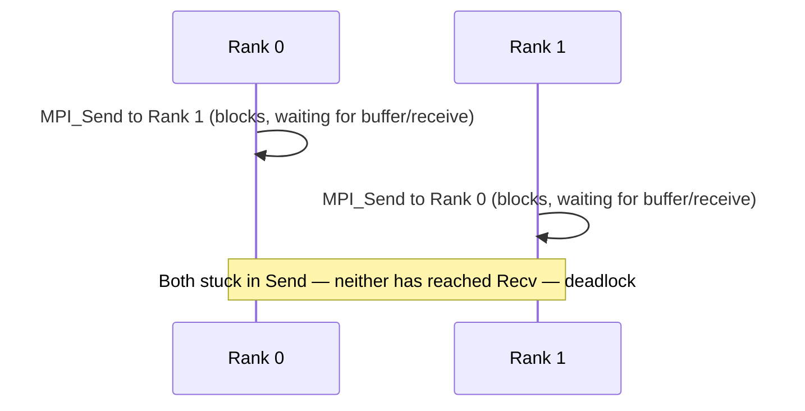

## Learning Objectives

- Write a correct pair of `MPI_Send`/`MPI_Recv` calls between two ranks, and explain what "blocking" means for each.
- Trace a real deadlock caused by two ranks both calling a blocking send to each other in the wrong order, and explain why it happens.
- Use `MPI_Isend`/`MPI_Irecv` with `MPI_Wait` to avoid that deadlock, and explain the real cost non-blocking calls trade for that safety.
- Relate blocking send/receive directly to the synchronization concept from earlier in this discipline.

## Context & Motivation

The previous concept established that MPI processes communicate through explicit messages rather than shared memory. This concept covers the most fundamental form that communication takes: **point-to-point** communication, where exactly one process sends and exactly one other process receives. Nearly every more advanced MPI pattern — including the collective operations covered next — is either built from point-to-point communication internally, or exists specifically to avoid its most common pitfalls, so understanding it precisely (including its real, well-known deadlock hazard) is essential before moving on.

## Core Theory

### `MPI_Send` and `MPI_Recv`: the basic blocking pair

The simplest MPI communication is a single message from one rank to another:

```c
if (rank == 0) {
    int value = 42;
    MPI_Send(&value, 1, MPI_INT, 1, 0, MPI_COMM_WORLD);
    //        ^buf    ^count ^type  ^dest ^tag  ^communicator
} else if (rank == 1) {
    int received;
    MPI_Recv(&received, 1, MPI_INT, 0, 0, MPI_COMM_WORLD, MPI_STATUS_IGNORE);
    //        ^buf       ^count ^type ^source ^tag ^communicator ^status
    printf("Rank 1 received: %d\n", received);
}
```

`MPI_Send` sends `count` elements of type `MPI_INT` from `&value` to destination rank 1, tagged with message tag `0` (an integer label letting a receiver distinguish between different kinds of expected messages). `MPI_Recv` on rank 1 waits to receive a matching message (same source rank, same tag, same communicator) into its own buffer.

Both calls are **blocking**: `MPI_Send` does not return control to the calling code until the message buffer is safe to reuse (which, depending on the MPI implementation and message size, may mean the message has actually been delivered, or merely that it has been copied into an internal system buffer); `MPI_Recv` does not return until a matching message has actually arrived and been copied into the receive buffer. This blocking behavior is itself a form of synchronization — closely related to the barrier and boundary-exchange synchronization already covered earlier in this discipline — since a rank calling `MPI_Recv` genuinely waits (makes no further progress) until the expected message is available.

### The classic deadlock: two sends waiting on each other

Blocking communication creates a real, well-known deadlock hazard when two ranks each need to both send to and receive from each other, if the order is wrong:

```c
// WRONG — can deadlock:
if (rank == 0) {
    MPI_Send(&my_data, 1, MPI_INT, 1, 0, MPI_COMM_WORLD);  // send first
    MPI_Recv(&their_data, 1, MPI_INT, 1, 0, MPI_COMM_WORLD, MPI_STATUS_IGNORE);
} else if (rank == 1) {
    MPI_Send(&my_data, 1, MPI_INT, 0, 0, MPI_COMM_WORLD);  // send first, too
    MPI_Recv(&their_data, 1, MPI_INT, 0, 0, MPI_COMM_WORLD, MPI_STATUS_IGNORE);
}
```

If the MPI implementation's internal buffering is too small to hold both messages without an actual matching receive already posted, both ranks can block forever inside their own `MPI_Send` call, each waiting for the *other* rank to call `MPI_Recv` — but neither rank ever reaches its own `MPI_Recv` call, because both are still stuck inside `MPI_Send`. This is exactly the same circular-wait structure as the lock-ordering deadlock already covered in the OpenMP synchronization concept, just realized through blocking message calls instead of locks.



The standard fix, mirroring consistent lock ordering from OpenMP, is consistent *communication* ordering: have one rank send-then-receive while the other receives-then-sends:

```c
// CORRECT — consistent ordering avoids the deadlock:
if (rank == 0) {
    MPI_Send(&my_data, 1, MPI_INT, 1, 0, MPI_COMM_WORLD);
    MPI_Recv(&their_data, 1, MPI_INT, 1, 0, MPI_COMM_WORLD, MPI_STATUS_IGNORE);
} else if (rank == 1) {
    MPI_Recv(&their_data, 1, MPI_INT, 0, 0, MPI_COMM_WORLD, MPI_STATUS_IGNORE);  // receive first
    MPI_Send(&my_data, 1, MPI_INT, 0, 0, MPI_COMM_WORLD);                        // then send
}
```

### `MPI_Isend`/`MPI_Irecv`: non-blocking communication

MPI also provides non-blocking variants: `MPI_Isend` and `MPI_Irecv` return control to the calling code *immediately*, without waiting for the operation to complete, handing back a request handle instead:

```c
MPI_Request send_req, recv_req;
MPI_Isend(&my_data, 1, MPI_INT, other_rank, 0, MPI_COMM_WORLD, &send_req);
MPI_Irecv(&their_data, 1, MPI_INT, other_rank, 0, MPI_COMM_WORLD, &recv_req);

// ... the process can do other useful work here while the
//     send/receive complete in the background ...

MPI_Wait(&send_req, MPI_STATUS_IGNORE);   // now actually wait for send to finish
MPI_Wait(&recv_req, MPI_STATUS_IGNORE);   // and for receive to finish
```

Both ranks can post their non-blocking send and receive in whichever order they like, without risking the blocking deadlock above — since neither call actually waits, there is no possibility of both ranks being simultaneously stuck. The real cost traded for this safety and flexibility is complexity: the programmer must never touch the send or receive buffer again until the corresponding `MPI_Wait` (or a related completion check) confirms the operation is actually done, or the data can be silently corrupted — a discipline analogous to, but distinct from, the OpenMP lock-acquisition discipline covered earlier.

## Worked Examples

### Example 1: Diagnosing the deadlock scenario

Given this fragment running on 2 ranks:

```c
MPI_Send(&data, 1, MPI_INT, 1 - rank, 0, MPI_COMM_WORLD);
MPI_Recv(&data, 1, MPI_INT, 1 - rank, 0, MPI_COMM_WORLD, MPI_STATUS_IGNORE);
```

(`1 - rank` sends rank 0's message to rank 1, and rank 1's message to rank 0.) Both rank 0 and rank 1 execute the identical send-then-receive order — exactly the "both send first" pattern this concept identified as unsafe. For small messages many real MPI implementations use internal buffering that happens to avoid the deadlock in practice, which is precisely what makes this bug dangerous: it can appear to work correctly for small test messages and only manifest as a real hang once message sizes grow past the implementation's internal buffer limit, in production.

### Example 2: Fixing it with non-blocking calls

```c
MPI_Request reqs[2];
MPI_Isend(&my_data, 1, MPI_INT, 1 - rank, 0, MPI_COMM_WORLD, &reqs[0]);
MPI_Irecv(&their_data, 1, MPI_INT, 1 - rank, 0, MPI_COMM_WORLD, &reqs[1]);
MPI_Waitall(2, reqs, MPI_STATUSES_IGNORE);
```

Both ranks post their non-blocking send and receive in identical order, with no possibility of deadlock, since `MPI_Isend`/`MPI_Irecv` never block waiting for the operation to complete — the actual waiting happens explicitly and safely at `MPI_Waitall`, by which point both ranks have already posted both halves of the exchange.

## Common Misconceptions & Pitfalls

- **"`MPI_Send` returning means the message has definitely been received."** It only guarantees the send buffer is safe to reuse — depending on the implementation and message size, this can happen well before the receiving rank has actually called `MPI_Recv`, due to internal system buffering; assuming synchronized delivery timing from a returned `MPI_Send` is a common source of subtle bugs.
- **"The two-rank send-first deadlock only happens with large messages."** It can happen with any message size once the implementation's internal buffer is exhausted — smaller messages are simply more likely to be buffered without issue, which is exactly why the bug so often surfaces only at production scale, not in small test cases.
- **"Non-blocking calls (`Isend`/`Irecv`) complete the communication immediately."** They only *initiate* the communication and return immediately — the actual data transfer may still be in progress when the call returns, and the buffer must not be touched again until a matching `MPI_Wait` confirms completion.
- **"Non-blocking communication is strictly better and should always be used."** It adds real complexity (tracking request handles, remembering to wait before reusing buffers) that blocking calls avoid — for code where the deadlock risk is genuinely absent (a single rank talking to a fixed, non-cyclic set of others) or performance is not communication-bound, the simpler blocking calls, used with correct consistent ordering, are often the better engineering choice.

## Summary

MPI's point-to-point communication comes in blocking (`MPI_Send`/`MPI_Recv`, which wait for their operation to be safe/complete before returning) and non-blocking (`MPI_Isend`/`MPI_Irecv`, which return immediately and require an explicit `MPI_Wait` before the buffer can be reused) forms. Blocking calls carry a real, well-documented deadlock risk when two ranks both attempt to send to each other before either receives — fixed either by enforcing a consistent send/receive ordering (mirroring the lock-ordering fix from OpenMP) or by switching to non-blocking calls, which trade that risk for the added complexity of tracking request completion explicitly. The next concept moves beyond one-to-one messaging to collective operations, which express far more common communication patterns — broadcast, reduce, scatter, gather — far more efficiently than a hand-written loop of point-to-point calls ever could.

## Documentation Links

- [LLNL HPC Tutorials — MPI](https://hpc-tutorials.llnl.gov/mpi/) — source for blocking and non-blocking point-to-point communication routines covered in this concept.
