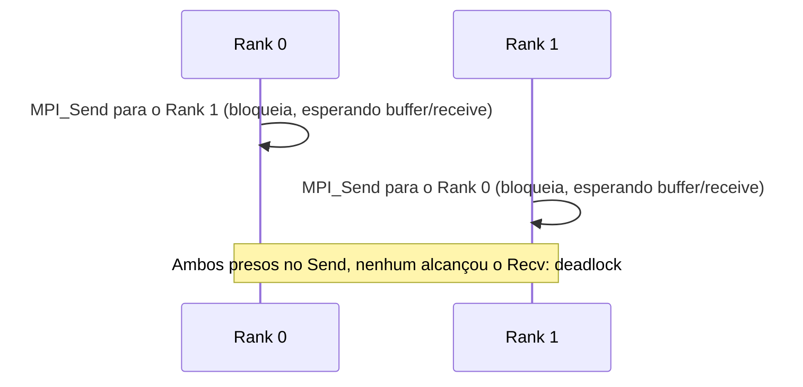

## Objetivos de Aprendizagem

- Escrever um par correto de chamadas `MPI_Send`/`MPI_Recv` entre dois ranks, e explicar o que "bloqueante" significa para cada uma.
- Rastrear um deadlock real causado por dois ranks chamando ambos um send bloqueante um para o outro na ordem errada, e explicar por que ele acontece.
- Usar `MPI_Isend`/`MPI_Irecv` com `MPI_Wait` para evitar esse deadlock, e explicar o custo real que as chamadas não bloqueantes trocam por essa segurança.
- Relacionar o send/receive bloqueante diretamente ao conceito de sincronização visto antes nesta disciplina.

## Contexto e Motivação

O conceito anterior estabeleceu que os processos MPI se comunicam por meio de mensagens explícitas em vez de memória compartilhada. Este conceito cobre a forma mais fundamental que essa comunicação assume: a comunicação **ponto a ponto**, onde exatamente um processo envia e exatamente um outro processo recebe. Quase todo padrão MPI mais avançado, incluindo as operações coletivas cobertas a seguir, ou é construído internamente a partir de comunicação ponto a ponto, ou existe especificamente para evitar as suas armadilhas mais comuns, então entendê-la com precisão (incluindo o seu risco real e bem conhecido de deadlock) é essencial antes de seguir em frente.

## Teoria Central

### `MPI_Send` e `MPI_Recv`: o par bloqueante básico

A comunicação MPI mais simples é uma única mensagem de um rank para outro:

```c
if (rank == 0) {
    int value = 42;
    MPI_Send(&value, 1, MPI_INT, 1, 0, MPI_COMM_WORLD);
    //        ^buf    ^count ^tipo ^dest ^tag  ^comunicador
} else if (rank == 1) {
    int received;
    MPI_Recv(&received, 1, MPI_INT, 0, 0, MPI_COMM_WORLD, MPI_STATUS_IGNORE);
    //        ^buf       ^count ^tipo ^origem ^tag ^comunicador ^status
    printf("Rank 1 received: %d\n", received);
}
```

`MPI_Send` envia `count` elementos do tipo `MPI_INT` a partir de `&value` para o rank de destino 1, marcados com a tag de mensagem `0` (um rótulo inteiro que permite a um receptor distinguir entre diferentes tipos de mensagens esperadas). `MPI_Recv` no rank 1 espera para receber uma mensagem correspondente (mesmo rank de origem, mesma tag, mesmo comunicador) no seu próprio buffer.

As duas chamadas são **bloqueantes**: `MPI_Send` não devolve o controle ao código chamador até que o buffer da mensagem possa ser reusado com segurança (o que, dependendo da implementação do MPI e do tamanho da mensagem, pode significar que a mensagem foi de fato entregue, ou apenas que foi copiada para um buffer interno do sistema); `MPI_Recv` não retorna até que uma mensagem correspondente tenha de fato chegado e sido copiada para o buffer de recebimento. Esse comportamento bloqueante é em si uma forma de sincronização, intimamente relacionada à sincronização de barreira e de troca de fronteiras já coberta antes nesta disciplina, já que um rank chamando `MPI_Recv` genuinamente espera (não faz mais nenhum progresso) até que a mensagem esperada esteja disponível.

### O deadlock clássico: dois sends esperando um pelo outro

A comunicação bloqueante cria um risco de deadlock real e bem conhecido quando dois ranks precisam cada um tanto enviar para quanto receber do outro, se a ordem estiver errada:

```c
// ERRADO: pode causar deadlock:
if (rank == 0) {
    MPI_Send(&my_data, 1, MPI_INT, 1, 0, MPI_COMM_WORLD);  // envia primeiro
    MPI_Recv(&their_data, 1, MPI_INT, 1, 0, MPI_COMM_WORLD, MPI_STATUS_IGNORE);
} else if (rank == 1) {
    MPI_Send(&my_data, 1, MPI_INT, 0, 0, MPI_COMM_WORLD);  // envia primeiro também
    MPI_Recv(&their_data, 1, MPI_INT, 0, 0, MPI_COMM_WORLD, MPI_STATUS_IGNORE);
}
```

Se o buffer interno da implementação do MPI for pequeno demais para guardar as duas mensagens sem que um receive correspondente já tenha sido postado, os dois ranks podem ficar bloqueados para sempre dentro da sua própria chamada `MPI_Send`, cada um esperando que o *outro* rank chame `MPI_Recv`, mas nenhum rank jamais alcança a sua própria chamada `MPI_Recv`, porque os dois ainda estão presos dentro de `MPI_Send`. Esta é exatamente a mesma estrutura de espera circular do deadlock por ordem de locks já coberto no conceito de sincronização do OpenMP, só que realizada por meio de chamadas de mensagem bloqueantes em vez de locks.



A correção padrão, espelhando a ordem de locks consistente do OpenMP, é uma ordem de *comunicação* consistente: fazer um rank enviar-e-depois-receber enquanto o outro recebe-e-depois-envia:

```c
// CORRETO: a ordem consistente evita o deadlock:
if (rank == 0) {
    MPI_Send(&my_data, 1, MPI_INT, 1, 0, MPI_COMM_WORLD);
    MPI_Recv(&their_data, 1, MPI_INT, 1, 0, MPI_COMM_WORLD, MPI_STATUS_IGNORE);
} else if (rank == 1) {
    MPI_Recv(&their_data, 1, MPI_INT, 0, 0, MPI_COMM_WORLD, MPI_STATUS_IGNORE);  // recebe primeiro
    MPI_Send(&my_data, 1, MPI_INT, 0, 0, MPI_COMM_WORLD);                        // depois envia
}
```

### `MPI_Isend`/`MPI_Irecv`: comunicação não bloqueante

O MPI também fornece variantes não bloqueantes: `MPI_Isend` e `MPI_Irecv` devolvem o controle ao código chamador *imediatamente*, sem esperar a operação completar, entregando em vez disso um handle de requisição:

```c
MPI_Request send_req, recv_req;
MPI_Isend(&my_data, 1, MPI_INT, other_rank, 0, MPI_COMM_WORLD, &send_req);
MPI_Irecv(&their_data, 1, MPI_INT, other_rank, 0, MPI_COMM_WORLD, &recv_req);

// ... o processo pode fazer outro trabalho útil aqui enquanto o
//     send/receive completam em segundo plano ...

MPI_Wait(&send_req, MPI_STATUS_IGNORE);   // agora espera de fato o send terminar
MPI_Wait(&recv_req, MPI_STATUS_IGNORE);   // e o receive terminar
```

Os dois ranks podem postar o seu send e receive não bloqueantes na ordem que quiserem, sem arriscar o deadlock bloqueante acima: como nenhuma chamada de fato espera, não há possibilidade de os dois ranks ficarem presos simultaneamente. O custo real trocado por essa segurança e flexibilidade é complexidade: o programador nunca pode tocar o buffer de send ou de receive de novo até que o `MPI_Wait` correspondente (ou uma verificação de conclusão relacionada) confirme que a operação de fato terminou, ou os dados podem ser corrompidos silenciosamente, uma disciplina análoga, mas distinta, à disciplina de aquisição de locks do OpenMP coberta antes.

## Exemplos Resolvidos

### Exemplo 1: Diagnosticando o cenário de deadlock

Dado este trecho rodando em 2 ranks:

```c
MPI_Send(&data, 1, MPI_INT, 1 - rank, 0, MPI_COMM_WORLD);
MPI_Recv(&data, 1, MPI_INT, 1 - rank, 0, MPI_COMM_WORLD, MPI_STATUS_IGNORE);
```

(`1 - rank` envia a mensagem do rank 0 para o rank 1, e a mensagem do rank 1 para o rank 0.) Tanto o rank 0 quanto o rank 1 executam a ordem idêntica de enviar-e-depois-receber, exatamente o padrão "ambos enviam primeiro" que este conceito identificou como inseguro. Para mensagens pequenas, muitas implementações reais do MPI usam buffering interno que calha de evitar o deadlock na prática, e é justamente isso que torna este bug perigoso: ele pode parecer funcionar corretamente para mensagens de teste pequenas e só se manifestar como um travamento real quando os tamanhos das mensagens crescem além do limite do buffer interno da implementação, em produção.

### Exemplo 2: Corrigindo com chamadas não bloqueantes

```c
MPI_Request reqs[2];
MPI_Isend(&my_data, 1, MPI_INT, 1 - rank, 0, MPI_COMM_WORLD, &reqs[0]);
MPI_Irecv(&their_data, 1, MPI_INT, 1 - rank, 0, MPI_COMM_WORLD, &reqs[1]);
MPI_Waitall(2, reqs, MPI_STATUSES_IGNORE);
```

Os dois ranks postam o seu send e receive não bloqueantes em ordem idêntica, sem possibilidade de deadlock, já que `MPI_Isend`/`MPI_Irecv` nunca bloqueiam esperando a operação completar. A espera de fato acontece explícita e seguramente em `MPI_Waitall`, ponto em que os dois ranks já postaram as duas metades da troca.

## Equívocos Comuns e Armadilhas

- **"O retorno de `MPI_Send` significa que a mensagem foi definitivamente recebida."** Ele só garante que o buffer de envio pode ser reusado com segurança. Dependendo da implementação e do tamanho da mensagem, isso pode acontecer bem antes de o rank receptor ter de fato chamado `MPI_Recv`, devido ao buffering interno do sistema; presumir um timing de entrega sincronizado a partir de um `MPI_Send` que retornou é uma fonte comum de bugs sutis.
- **"O deadlock de dois ranks enviando primeiro só acontece com mensagens grandes."** Pode acontecer com qualquer tamanho de mensagem assim que o buffer interno da implementação se esgota. Mensagens menores simplesmente têm mais chance de serem bufferizadas sem problema, e é exatamente por isso que o bug tão frequentemente só aparece em escala de produção, e não em casos de teste pequenos.
- **"Chamadas não bloqueantes (`Isend`/`Irecv`) completam a comunicação imediatamente."** Elas só *iniciam* a comunicação e retornam imediatamente. A transferência de dados de fato pode ainda estar em andamento quando a chamada retorna, e o buffer não pode ser tocado de novo até que um `MPI_Wait` correspondente confirme a conclusão.
- **"Comunicação não bloqueante é estritamente melhor e deveria sempre ser usada."** Ela adiciona complexidade real (rastrear handles de requisição, lembrar de esperar antes de reusar buffers) que as chamadas bloqueantes evitam. Para código onde o risco de deadlock genuinamente não existe (um único rank falando com um conjunto fixo e não cíclico de outros) ou cujo desempenho não é limitado por comunicação, as chamadas bloqueantes mais simples, usadas com uma ordem consistente correta, são frequentemente a melhor escolha de engenharia.

## Resumo

A comunicação ponto a ponto do MPI vem nas formas bloqueante (`MPI_Send`/`MPI_Recv`, que esperam a sua operação estar segura/completa antes de retornar) e não bloqueante (`MPI_Isend`/`MPI_Irecv`, que retornam imediatamente e exigem um `MPI_Wait` explícito antes que o buffer possa ser reusado). As chamadas bloqueantes carregam um risco de deadlock real e bem documentado quando dois ranks tentam ambos enviar um para o outro antes que qualquer um receba, corrigido ou impondo uma ordem consistente de send/receive (espelhando a correção por ordem de locks do OpenMP) ou trocando para chamadas não bloqueantes, que trocam esse risco pela complexidade adicional de rastrear explicitamente a conclusão das requisições. O próximo conceito vai além da troca de mensagens um para um, para as operações coletivas, que expressam padrões de comunicação muito mais comuns (broadcast, reduce, scatter, gather) de forma muito mais eficiente do que um loop escrito à mão de chamadas ponto a ponto jamais conseguiria.

## Documentation Links

- [LLNL HPC Tutorials: MPI](https://hpc-tutorials.llnl.gov/mpi/): fonte para as rotinas de comunicação ponto a ponto bloqueantes e não bloqueantes cobertas neste conceito.
