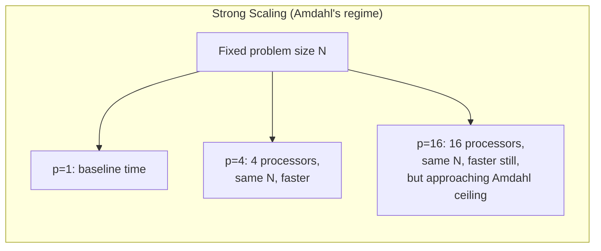
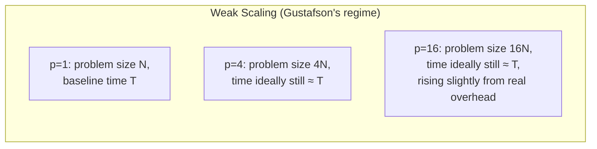

## Learning Objectives

- Define strong scaling and weak scaling, and identify which law (Amdahl's or Gustafson's) governs each.
- Read and interpret a strong-scaling plot and a weak-scaling plot, including what an ideal curve looks like for each.
- Design a weak-scaling experiment for a given domain-decomposed problem (how the problem size should grow with processor count).
- Explain why real HPC performance reports specify which kind of scaling they measured, and why the two cannot be compared directly.

## Context & Motivation

Amdahl's Law and Gustafson's Law each made a claim about speedup under a specific assumption about problem size. Strong scaling and weak scaling are the standard names LLNL's tutorial and the broader HPC community use for these two assumptions as *experimental protocols* — precise recipes for how to actually measure a parallel program's scalability, and precise labels for reporting the result honestly. Understanding this pair of terms is essential for reading (or producing) any credible performance report about a parallel program, because a speedup or efficiency number reported without specifying which kind of scaling it measures is close to meaningless — the two protocols answer genuinely different questions and cannot be compared to each other directly.

## Core Theory

### Strong scaling: fixed problem size, growing processor count

**Strong scaling** measures speedup while holding the total problem size exactly fixed and increasing only the number of processors. This is precisely the experimental setup Amdahl's Law describes and bounds: as `p` grows with the problem size fixed, the *per-processor* share of work shrinks, communication and synchronization overhead becomes proportionally larger, and speedup approaches — but, per Amdahl's Law, never exceeds — the ceiling `1/s`.

An ideal strong-scaling result would show speedup exactly matching `p` (linear); a realistic result flattens out as `p` grows, exactly matching the shape of the earlier Amdahl's Law worked examples, where speedup at 64 processors fell well short of 64× even for a small sequential fraction.



### Weak scaling: fixed problem size per processor, growing both together

**Weak scaling** measures speedup (or, more often, elapsed time directly) while increasing the problem size *in proportion to* the number of processors, so that the amount of work assigned to *each individual processor* stays roughly constant. This is precisely the experimental setup Gustafson's Law describes: instead of asking "how much faster does the same problem run?", weak scaling asks "does the same-size chunk per processor keep finishing in roughly the same time as more processors and proportionally more total problem are added?"

An ideal weak-scaling result shows elapsed time staying flat (or scaled speedup growing linearly, matching Gustafson's Law) as both problem size and processor count grow together; a realistic result shows elapsed time slowly increasing, reflecting growing communication overhead (more processors typically means more boundary exchanges or more collective-communication participants, even if each processor's own workload is unchanged) as the whole system scales up.



### Why the two cannot be compared directly

A strong-scaling curve and a weak-scaling curve for the same program are measuring genuinely different experiments, and reporting one number without saying which kind it is invites a serious misreading — a strong-scaling efficiency of 60% at 64 processors and a weak-scaling efficiency of 95% at 64 processors are not competing claims about the same program; they answer "how much faster does this fixed-size problem get?" and "how well does this program's per-processor cost stay flat as the problem grows to match the hardware?" respectively, and a program can legitimately have very different-looking answers to each.

### Choosing which protocol to measure

The right protocol to report depends on the real question a program's users actually care about — exactly the same distinction Gustafson's Law drew between "the same answer, faster" and "a bigger answer, in the same time." A program whose users always have a fixed-size problem (compiling one codebase, rendering one fixed video) should be evaluated with strong scaling. A program whose users scale their problem size with the hardware available (a climate model run at higher resolution as more nodes become available) should be evaluated with weak scaling — and many serious HPC papers report both, precisely because each answers a question the other cannot.

## Worked Examples

### Example 1: Designing a weak-scaling experiment

A domain-decomposed 2D grid simulation currently runs a 1,000×1,000 grid on 1 processor in 40 seconds. Design a weak-scaling experiment across 1, 4, and 16 processors:

```text
Processors (p)   Total grid size (grows with p)   Grid size per processor
---------------  --------------------------------  -------------------------
1                 1,000 × 1,000  (1,000,000 cells)  1,000,000 cells
4                 2,000 × 2,000  (4,000,000 cells)  1,000,000 cells
16                4,000 × 4,000 (16,000,000 cells)  1,000,000 cells
```

Each processor is given the same 1,000,000-cell share throughout, exactly matching the fixed-per-processor-work definition of weak scaling. Measuring elapsed time at each of these three points — ideally close to the same 40 seconds each time — reveals how well the program's communication and synchronization overhead holds up as the system scales, independent of any question about strong-scaling speedup on a single fixed grid size.

### Example 2: Reading a strong-scaling result table

```text
Processors (p)   Time (s)   Speedup   Efficiency   Scaling regime
---------------  ---------  --------  -----------  ------------------------
1                 80         1.0×      100%         Strong (fixed N=1M cells)
4                 24         3.33×      83%         Strong (same fixed N)
16                12         6.67×      42%          Strong (same fixed N)
```

This is the same strong-scaling table style already seen in the speedup-and-efficiency concept — every row uses the identical problem size N, only the processor count changes, which is exactly the hallmark that identifies this as a strong-scaling report, governed by Amdahl's Law, not a weak-scaling one. Recognizing this label is what tells a reader that the declining efficiency shown is expected under Amdahl's Law, not a sign of something being unusually wrong with this particular program.

## Common Misconceptions & Pitfalls

- **"Strong scaling and weak scaling are just two names for speedup and efficiency."** Speedup and efficiency are the *metrics*; strong and weak scaling are the *experimental protocols* that determine how the problem size is (or isn't) changed as processors are varied — the same metric (speedup) can be reported under either protocol, and the protocol used changes what the number means.
- **"A program with poor strong-scaling efficiency is a poorly-written program."** It may simply reflect an unavoidable Amdahl's Law ceiling from a genuine sequential fraction — a program can have poor strong-scaling efficiency and excellent weak-scaling efficiency at the same time, and both facts can be true and expected simultaneously.
- **"Weak scaling numbers can be directly compared to strong scaling numbers for the same efficiency percentage."** They cannot — an 80% strong-scaling efficiency and an 80% weak-scaling efficiency reflect different experiments with different governing laws (Amdahl vs. Gustafson) and are not measuring the same underlying phenomenon.
- **"You should always report whichever scaling result looks better."** Reporting only the more flattering number without stating which protocol was used is misleading; credible HPC performance reports state explicitly which scaling regime each number reflects, and often report both.

## Summary

Strong scaling holds problem size fixed while processors grow — the experimental protocol Amdahl's Law governs and bounds, with an ideal (never achieved) result of exactly linear speedup. Weak scaling grows the problem size in proportion to processors, keeping each processor's own share of work constant — the protocol Gustafson's Law describes, with an ideal result of flat elapsed time as the whole system scales up. The two protocols measure genuinely different questions and cannot be compared to each other directly; a credible performance report always states which one it used, and often reports both, since real users may care about either "the same answer, faster" or "a bigger answer, in the same time." This closes this discipline's Performance & Scalability cluster; the next cluster puts these ideas into practice with a real, concrete shared-memory programming model — OpenMP.

## Documentation Links

- [LLNL — Introduction to Parallel Computing Tutorial](https://hpc.llnl.gov/documentation/tutorials/introduction-parallel-computing-tutorial) — source for the strong/weak scaling terminology and its connection to Amdahl's and Gustafson's laws.
