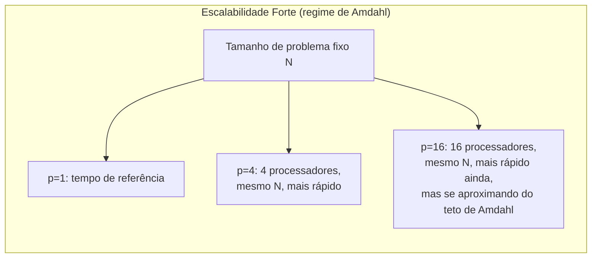
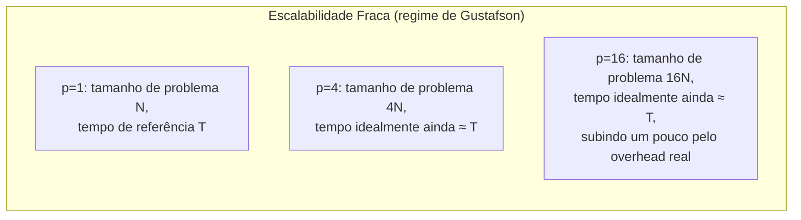

## Objetivos de Aprendizagem

- Definir escalabilidade forte e escalabilidade fraca, e identificar qual lei (de Amdahl ou de Gustafson) governa cada uma.
- Ler e interpretar um gráfico de escalabilidade forte e um de escalabilidade fraca, incluindo como é a curva ideal para cada um.
- Projetar um experimento de escalabilidade fraca para um dado problema decomposto por domínio (como o tamanho do problema deve crescer com a quantidade de processadores).
- Explicar por que relatórios reais de desempenho em HPC especificam qual tipo de escalabilidade mediram, e por que as duas não podem ser comparadas diretamente.

## Contexto e Motivação

A Lei de Amdahl e a Lei de Gustafson fizeram cada uma uma afirmação sobre speedup sob uma suposição específica sobre o tamanho do problema. Escalabilidade forte e escalabilidade fraca são os nomes padrão que o tutorial do LLNL e a comunidade de HPC em geral usam para estas duas suposições como *protocolos experimentais*: receitas precisas de como de fato medir a escalabilidade de um programa paralelo, e rótulos precisos para reportar o resultado honestamente. Entender este par de termos é essencial para ler (ou produzir) qualquer relatório de desempenho confiável sobre um programa paralelo, porque um número de speedup ou eficiência reportado sem especificar que tipo de escalabilidade ele mede é quase sem sentido: os dois protocolos respondem perguntas genuinamente diferentes e não podem ser comparados diretamente um com o outro.

## Teoria Central

### Escalabilidade forte: tamanho de problema fixo, quantidade de processadores crescente

A **escalabilidade forte** mede o speedup mantendo o tamanho total do problema exatamente fixo e aumentando apenas o número de processadores. Este é precisamente o arranjo experimental que a Lei de Amdahl descreve e limita: conforme `p` cresce com o tamanho do problema fixo, a fatia de trabalho *por processador* encolhe, o overhead de comunicação e sincronização se torna proporcionalmente maior, e o speedup se aproxima do teto `1/s`, mas, pela Lei de Amdahl, nunca o ultrapassa.

Um resultado ideal de escalabilidade forte mostraria o speedup batendo exatamente com `p` (linear); um resultado realista se achata conforme `p` cresce, batendo exatamente com o formato dos exemplos resolvidos anteriores da Lei de Amdahl, onde o speedup em 64 processadores ficou bem abaixo de 64× mesmo para uma fração sequencial pequena.



### Escalabilidade fraca: tamanho de problema por processador fixo, crescendo os dois juntos

A **escalabilidade fraca** mede o speedup (ou, mais frequentemente, o tempo decorrido diretamente) enquanto aumenta o tamanho do problema *em proporção ao* número de processadores, de forma que a quantidade de trabalho atribuída a *cada processador individual* fique aproximadamente constante. Este é precisamente o arranjo experimental que a Lei de Gustafson descreve: em vez de perguntar "quão mais rápido o mesmo problema roda?", a escalabilidade fraca pergunta "o pedaço do mesmo tamanho por processador continua terminando aproximadamente no mesmo tempo conforme mais processadores e proporcionalmente mais problema total são adicionados?"

Um resultado ideal de escalabilidade fraca mostra o tempo decorrido ficando plano (ou o speedup escalado crescendo linearmente, batendo com a Lei de Gustafson) conforme o tamanho do problema e a quantidade de processadores crescem juntos; um resultado realista mostra o tempo decorrido aumentando lentamente, refletindo o overhead de comunicação crescente (mais processadores tipicamente significam mais trocas de fronteira ou mais participantes em comunicação coletiva, mesmo que a carga de trabalho de cada processador não mude) conforme o sistema inteiro escala.



### Por que as duas não podem ser comparadas diretamente

Uma curva de escalabilidade forte e uma curva de escalabilidade fraca para o mesmo programa estão medindo experimentos genuinamente diferentes, e reportar um número sem dizer de que tipo ele é convida a uma leitura seriamente errada. Uma eficiência de escalabilidade forte de 60% em 64 processadores e uma eficiência de escalabilidade fraca de 95% em 64 processadores não são afirmações concorrentes sobre o mesmo programa; elas respondem, respectivamente, "quão mais rápido este problema de tamanho fixo fica?" e "quão bem o custo por processador deste programa se mantém plano conforme o problema cresce para acompanhar o hardware?", e um programa pode legitimamente ter respostas bem diferentes para cada uma.

### Escolhendo qual protocolo medir

O protocolo certo a reportar depende da pergunta real com a qual os usuários de um programa de fato se importam, exatamente a mesma distinção que a Lei de Gustafson traçou entre "a mesma resposta, mais rápido" e "uma resposta maior, no mesmo tempo". Um programa cujos usuários sempre têm um problema de tamanho fixo (compilar uma base de código, renderizar um vídeo fixo) deveria ser avaliado com escalabilidade forte. Um programa cujos usuários escalam o tamanho do seu problema com o hardware disponível (um modelo climático rodado em resolução mais alta conforme mais nós ficam disponíveis) deveria ser avaliado com escalabilidade fraca, e muitos artigos sérios de HPC reportam as duas, justamente porque cada uma responde uma pergunta que a outra não consegue.

## Exemplos Resolvidos

### Exemplo 1: Projetando um experimento de escalabilidade fraca

Uma simulação em grade 2D decomposta por domínio atualmente roda uma grade de 1.000×1.000 em 1 processador em 40 segundos. Projete um experimento de escalabilidade fraca com 1, 4 e 16 processadores:

```text
Processadores (p) Tamanho total da grade (cresce com p) Grade por processador
---------------  -------------------------------------  ----------------------
1                 1.000 × 1.000  (1.000.000 células)     1.000.000 células
4                 2.000 × 2.000  (4.000.000 células)     1.000.000 células
16                4.000 × 4.000 (16.000.000 células)     1.000.000 células
```

Cada processador recebe a mesma fatia de 1.000.000 de células do começo ao fim, batendo exatamente com a definição de trabalho fixo por processador da escalabilidade fraca. Medir o tempo decorrido em cada um destes três pontos (idealmente perto dos mesmos 40 segundos em cada vez) revela quão bem o overhead de comunicação e sincronização do programa se sustenta conforme o sistema escala, independentemente de qualquer pergunta sobre o speedup de escalabilidade forte num único tamanho de grade fixo.

### Exemplo 2: Lendo uma tabela de resultados de escalabilidade forte

```text
Processadores (p) Tempo (s)  Speedup   Eficiência   Regime de escalabilidade
---------------  ---------  --------  -----------  ------------------------
1                 80         1,0×      100%         Forte (N fixo=1M células)
4                 24         3,33×      83%         Forte (mesmo N fixo)
16                12         6,67×      42%         Forte (mesmo N fixo)
```

Este é o mesmo estilo de tabela de escalabilidade forte já visto no conceito de speedup e eficiência: toda linha usa o tamanho de problema idêntico N, e só a quantidade de processadores muda, que é exatamente a marca que identifica isto como um relatório de escalabilidade forte, governado pela Lei de Amdahl, e não um de escalabilidade fraca. Reconhecer este rótulo é o que diz ao leitor que a eficiência declinante mostrada é esperada sob a Lei de Amdahl, e não um sinal de algo incomumente errado com este programa em particular.

## Equívocos Comuns e Armadilhas

- **"Escalabilidade forte e escalabilidade fraca são só dois nomes para speedup e eficiência."** Speedup e eficiência são as *métricas*; escalabilidade forte e fraca são os *protocolos experimentais* que determinam como o tamanho do problema é (ou não é) alterado conforme os processadores variam. A mesma métrica (speedup) pode ser reportada sob qualquer um dos protocolos, e o protocolo usado muda o que o número significa.
- **"Um programa com eficiência de escalabilidade forte ruim é um programa mal escrito."** Pode simplesmente refletir um teto inevitável da Lei de Amdahl vindo de uma fração sequencial genuína. Um programa pode ter eficiência de escalabilidade forte ruim e eficiência de escalabilidade fraca excelente ao mesmo tempo, e os dois fatos podem ser verdadeiros e esperados simultaneamente.
- **"Números de escalabilidade fraca podem ser comparados diretamente com números de escalabilidade forte para a mesma porcentagem de eficiência."** Não podem: uma eficiência de escalabilidade forte de 80% e uma eficiência de escalabilidade fraca de 80% refletem experimentos diferentes com leis governantes diferentes (Amdahl vs. Gustafson) e não estão medindo o mesmo fenômeno subjacente.
- **"Você deveria sempre reportar o resultado de escalabilidade que parecer melhor."** Reportar só o número mais lisonjeiro sem declarar qual protocolo foi usado é enganoso; relatórios confiáveis de desempenho em HPC declaram explicitamente qual regime de escalabilidade cada número reflete, e frequentemente reportam os dois.

## Resumo

A escalabilidade forte mantém o tamanho do problema fixo enquanto os processadores crescem, o protocolo experimental que a Lei de Amdahl governa e limita, com um resultado ideal (nunca alcançado) de speedup exatamente linear. A escalabilidade fraca aumenta o tamanho do problema em proporção aos processadores, mantendo constante a fatia de trabalho de cada processador, o protocolo que a Lei de Gustafson descreve, com um resultado ideal de tempo decorrido plano conforme o sistema inteiro escala. Os dois protocolos medem perguntas genuinamente diferentes e não podem ser comparados diretamente um com o outro; um relatório de desempenho confiável sempre declara qual usou, e frequentemente reporta os dois, já que usuários reais podem se importar tanto com "a mesma resposta, mais rápido" quanto com "uma resposta maior, no mesmo tempo". Isto fecha o bloco de Desempenho e Escalabilidade desta disciplina; o próximo bloco coloca estas ideias em prática com um modelo de programação de memória compartilhada real e concreto: o OpenMP.

## Documentation Links

- [LLNL: Introduction to Parallel Computing Tutorial](https://hpc.llnl.gov/documentation/tutorials/introduction-parallel-computing-tutorial): fonte para a terminologia de escalabilidade forte/fraca e a sua conexão com as leis de Amdahl e de Gustafson.
