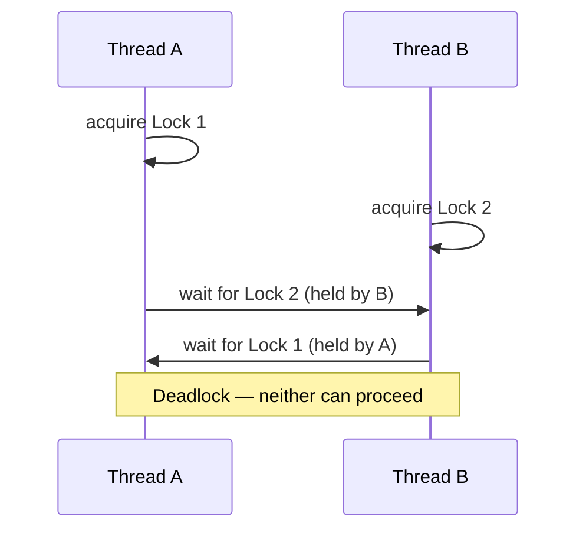

## Learning Objectives

- Write a correct OpenMP program using `#pragma omp critical` to protect a shared update that `reduction` cannot express.
- Use `#pragma omp atomic` for a simple single-statement update, and explain when it's a better fit than `critical`.
- Explain what an explicit OpenMP lock (`omp_lock_t`) is, and when it's needed beyond `critical`/`atomic`.
- Identify a potential deadlock in OpenMP code that acquires more than one lock, and explain how consistent lock ordering avoids it.

## Context & Motivation

The `reduction` clause, covered in the previous concept, handles one very common but specific pattern: combining every thread's independent partial result with a simple associative operator like `+` or `max`. Many real shared-memory programs need something `reduction` cannot express — an update to shared state that is more complex than a single accumulation, or an update to a shared data structure (not just a scalar), or a critical section of several statements that must execute as one indivisible unit relative to other threads. OpenMP provides three progressively more general tools for exactly this: `critical`, `atomic`, and explicit locks — the mechanism-level synchronization tools this cluster's earlier fork-join and work-sharing concepts deliberately deferred.

This is also the direct, concrete continuation of a handoff `programming-paradigms` explicitly left open: that discipline introduced race conditions and shared-state hazards at the concept level, without lock mechanics, naming a "more advanced discipline" as the place those mechanics would be taught. This concept, and the mutex/condition-variable material `operating-systems-i` covers at the OS level, are exactly that follow-through — this concept from the application-programmer's side, using OpenMP's own synchronization directives.

## Core Theory

### `critical`: mutual exclusion for a block of code

`#pragma omp critical` marks a block of code that only one thread may execute at a time — if one thread is inside the critical section, every other thread that reaches it must wait until the first thread exits:

```c
int max_value = INT_MIN;
#pragma omp parallel for
for (int i = 0; i < n; i++) {
    if (a[i] > threshold_function(a[i])) {   // an update too complex
        #pragma omp critical                  // for `reduction` to express
        {
            if (a[i] > max_value) {
                max_value = a[i];
                record_index(i);               // a second, related update
            }
        }
    }
}
```

This is more general than `reduction` — the protected block can be arbitrarily complex, updating multiple related shared variables together as one atomic unit — but it is also more expensive: every thread that wants to enter a critical section with the same (unnamed, or same-named) identifier must fully serialize with every other thread wanting to enter that same section, which can become a real performance bottleneck if the critical section is large or entered frequently.

### `atomic`: a cheaper option for one simple statement

`#pragma omp atomic` protects a single, simple statement — typically an update of the form `x = x <op> expr` — and can often be compiled directly to a single hardware atomic instruction, avoiding the fuller locking overhead `critical` requires:

```c
int counter = 0;
#pragma omp parallel for
for (int i = 0; i < n; i++) {
    if (is_prime(a[i])) {
        #pragma omp atomic
        counter++;                             // simple update: atomic suffices
    }
}
```

`atomic` is restricted to a narrow set of simple update forms specifically because that restriction is what makes the cheap hardware-instruction implementation possible — it is not a general substitute for `critical`, but the right choice whenever the shared update genuinely is that simple.

### Explicit locks: when critical/atomic aren't flexible enough

For synchronization patterns that don't fit the block-scoped `critical` or the single-statement `atomic` — for example, holding a lock across a function call boundary, or needing multiple independent named locks protecting different data structures — OpenMP provides explicit lock variables and functions:

```c
omp_lock_t my_lock;
omp_init_lock(&my_lock);

#pragma omp parallel for
for (int i = 0; i < n; i++) {
    omp_set_lock(&my_lock);      // acquire — blocks if another thread holds it
    shared_update(i);
    omp_unset_lock(&my_lock);    // release
}

omp_destroy_lock(&my_lock);
```

This is the most general and most manual of the three tools, giving explicit acquire/release control matching the mutex concept `operating-systems-i` covers at the OS-primitive level — `omp_lock_t` is, in effect, OpenMP's own portable wrapper around exactly that same underlying idea.

### Deadlock: the real risk of acquiring more than one lock

Whenever a program can hold more than one lock at once, it becomes possible for two threads to deadlock: Thread A acquires lock 1, then tries to acquire lock 2 (held by Thread B); Thread B has already acquired lock 2, and tries to acquire lock 1 (held by Thread A). Neither thread can proceed, and neither will ever release the lock it holds — a permanent standstill. The standard, effective prevention technique is **consistent lock ordering**: if every thread that needs both locks always acquires them in the same fixed order (say, always lock 1 before lock 2), the circular-wait pattern that causes deadlock cannot arise, because no thread ever holds a "later" lock while waiting for an "earlier" one.



## Worked Examples

### Example 1: Choosing between `atomic` and `critical`

```text
Update needed                                    Right tool
------------------------------------------------  --------------------
counter++;                                        atomic (single simple
                                                    increment)
if (x > best) { best = x; best_index = i; }        critical (two related
                                                    variables updated
                                                    together, atomically
                                                    as a unit)
hash_table_insert(shared_table, key, value);       critical (or an
                                                    explicit lock,
                                                    since this is an
                                                    arbitrary function
                                                    call, not a simple
                                                    statement)
```

The deciding question: is the update a single, simple `x = x <op> expr` form (favoring `atomic`, for its lower overhead), or does it involve multiple statements, a conditional, or a function call that must all complete as one unit relative to other threads (requiring `critical` or an explicit lock)?

### Example 2: Preventing deadlock with consistent lock ordering

Two threads both need to update two shared accounts during a transfer, each holding a lock:

```c
// WRONG — inconsistent ordering can deadlock:
// Thread A: transfer(account1, account2, amount)  → locks account1, then account2
// Thread B: transfer(account2, account1, amount)  → locks account2, then account1
// If both run at once: A holds lock1 waiting for lock2,
//                       B holds lock2 waiting for lock1 → deadlock

// CORRECT — always acquire locks in a fixed, consistent order
// (e.g., by increasing account ID), regardless of transfer direction:
void transfer(Account *from, Account *to, double amount) {
    Account *first  = (from->id < to->id) ? from : to;
    Account *second = (from->id < to->id) ? to   : from;

    omp_set_lock(&first->lock);
    omp_set_lock(&second->lock);
    // ... perform the actual transfer between `from` and `to` ...
    omp_unset_lock(&second->lock);
    omp_unset_lock(&first->lock);
}
```

By always locking the lower-ID account first regardless of transfer direction, both Thread A's and Thread B's calls acquire the two locks in the identical order, making the circular-wait pattern from the deadlock diagram structurally impossible — a small discipline that eliminates an entire class of bugs.

## Common Misconceptions & Pitfalls

- **"`atomic` and `critical` are interchangeable — just use whichever."** `atomic` is restricted to simple single-statement updates and is typically much cheaper; `critical` is more general but more expensive — using `critical` everywhere works correctly but sacrifices real performance where `atomic` would have sufficed.
- **"A critical section slows down only the threads inside it."** Every thread that *wants* to enter a critical section with the same identifier must wait for the current occupant to leave, even if that waiting thread's own work is otherwise completely independent — a large or frequently-entered critical section can serialize a program far more than its apparent size suggests.
- **"Deadlock only happens with many locks in complex systems."** It can happen with just two locks and two threads, as Example 2 shows — the necessary and sufficient condition is simply that two threads acquire the same two locks in opposite orders.
- **"Explicit locks are always the right tool once `reduction` doesn't fit."** `atomic` and `critical` are usually simpler, less error-prone choices when they apply (no risk of forgetting to release, or of holding a lock across an exception/early-return path) — explicit locks are the right tool specifically when the synchronization scope doesn't map cleanly onto either directive.

## Summary

OpenMP provides three levels of shared-update synchronization beyond `reduction`: `atomic` for cheap, single-statement updates that map to a hardware instruction; `critical` for larger or more complex blocks that must execute as one mutually-exclusive unit, at a higher cost; and explicit locks (`omp_lock_t`) for the most flexible, manual acquire/release control, matching the mutex concept `operating-systems-i` covers at the OS level. Any of these tools, used with more than one lock at a time, risks deadlock if two threads can acquire the same locks in opposite orders — a risk eliminated by enforcing a single, consistent lock-acquisition order throughout the program. This closes this discipline's OpenMP cluster; the next cluster moves to the distributed-memory world, where there is no shared memory to synchronize at all, and coordination must happen entirely through explicit messages.

## Documentation Links

- [LLNL HPC Tutorials — OpenMP](https://hpc-tutorials.llnl.gov/openmp/) — source for the synchronization constructs (`critical`, `atomic`, and lock routines) covered in this concept.
