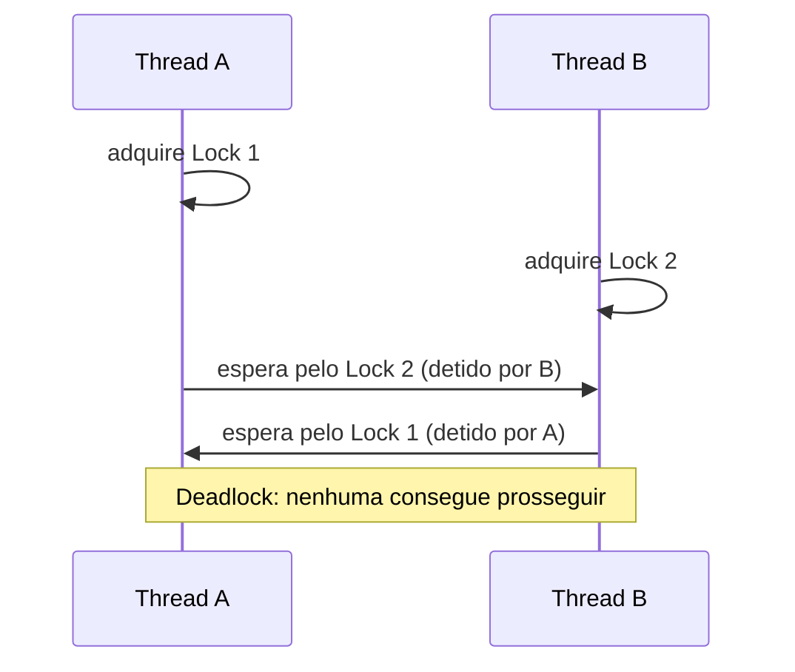

## Objetivos de Aprendizagem

- Escrever um programa OpenMP correto usando `#pragma omp critical` para proteger uma atualização compartilhada que `reduction` não consegue expressar.
- Usar `#pragma omp atomic` para uma atualização simples de uma única instrução, e explicar quando ele é um encaixe melhor do que `critical`.
- Explicar o que é um lock explícito do OpenMP (`omp_lock_t`), e quando ele é necessário além de `critical`/`atomic`.
- Identificar um deadlock potencial em código OpenMP que adquire mais de um lock, e explicar como uma ordem de locks consistente o evita.

## Contexto e Motivação

A cláusula `reduction`, coberta no conceito anterior, trata um padrão muito comum, mas específico: combinar o resultado parcial independente de cada thread com um operador associativo simples como `+` ou `max`. Muitos programas reais de memória compartilhada precisam de algo que `reduction` não consegue expressar: uma atualização de estado compartilhado mais complexa do que uma única acumulação, ou uma atualização de uma estrutura de dados compartilhada (não apenas um escalar), ou uma seção crítica de várias instruções que precisa executar como uma unidade indivisível em relação às outras threads. O OpenMP fornece três ferramentas progressivamente mais gerais para exatamente isso: `critical`, `atomic` e locks explícitos, as ferramentas de sincronização no nível de mecanismo que os conceitos anteriores de fork-join e work-sharing deste bloco deliberadamente adiaram.

Esta é também a continuação direta e concreta de uma passagem de bastão que `programming-paradigms` deixou explicitamente em aberto: aquela disciplina introduziu condições de corrida e riscos de estado compartilhado no nível conceitual, sem a mecânica de locks, nomeando uma "disciplina mais avançada" como o lugar onde essa mecânica seria ensinada. Este conceito, e o material de mutex/variável de condição que `operating-systems-i` cobre no nível do SO, são exatamente esse acompanhamento: este conceito pelo lado do programador de aplicação, usando as próprias diretivas de sincronização do OpenMP.

## Teoria Central

### `critical`: exclusão mútua para um bloco de código

`#pragma omp critical` marca um bloco de código que só uma thread pode executar por vez: se uma thread está dentro da seção crítica, toda outra thread que a alcançar precisa esperar até que a primeira saia:

```c
int max_value = INT_MIN;
#pragma omp parallel for
for (int i = 0; i < n; i++) {
    if (a[i] > threshold_function(a[i])) {   // uma atualização complexa demais
        #pragma omp critical                  // para `reduction` expressar
        {
            if (a[i] > max_value) {
                max_value = a[i];
                record_index(i);               // uma segunda atualização, relacionada
            }
        }
    }
}
```

Isto é mais geral do que `reduction` (o bloco protegido pode ser arbitrariamente complexo, atualizando múltiplas variáveis compartilhadas relacionadas juntas como uma unidade atômica), mas também é mais caro: toda thread que quer entrar numa seção crítica com o mesmo identificador (sem nome, ou com o mesmo nome) precisa se serializar completamente com toda outra thread querendo entrar naquela mesma seção, o que pode se tornar um gargalo de desempenho real se a seção crítica for grande ou acessada com frequência.

### `atomic`: uma opção mais barata para uma instrução simples

`#pragma omp atomic` protege uma única instrução simples, tipicamente uma atualização da forma `x = x <op> expr`, e frequentemente pode ser compilado diretamente para uma única instrução atômica de hardware, evitando o overhead de lock mais completo que `critical` exige:

```c
int counter = 0;
#pragma omp parallel for
for (int i = 0; i < n; i++) {
    if (is_prime(a[i])) {
        #pragma omp atomic
        counter++;                             // atualização simples: atomic basta
    }
}
```

`atomic` é restrito a um conjunto estreito de formas de atualização simples justamente porque essa restrição é o que torna possível a implementação barata via instrução de hardware. Ele não é um substituto geral para `critical`, mas é a escolha certa sempre que a atualização compartilhada genuinamente for simples assim.

### Locks explícitos: quando critical/atomic não são flexíveis o suficiente

Para padrões de sincronização que não se encaixam no `critical` com escopo de bloco nem no `atomic` de uma instrução (por exemplo, segurar um lock através da fronteira de uma chamada de função, ou precisar de múltiplos locks nomeados independentes protegendo estruturas de dados diferentes), o OpenMP fornece variáveis e funções de lock explícitas:

```c
omp_lock_t my_lock;
omp_init_lock(&my_lock);

#pragma omp parallel for
for (int i = 0; i < n; i++) {
    omp_set_lock(&my_lock);      // adquire: bloqueia se outra thread o detém
    shared_update(i);
    omp_unset_lock(&my_lock);    // libera
}

omp_destroy_lock(&my_lock);
```

Esta é a mais geral e mais manual das três ferramentas, dando controle explícito de aquisição/liberação, correspondendo ao conceito de mutex que `operating-systems-i` cobre no nível de primitiva do SO. O `omp_lock_t` é, na prática, o próprio wrapper portável do OpenMP em torno exatamente dessa mesma ideia subjacente.

### Deadlock: o risco real de adquirir mais de um lock

Sempre que um programa pode segurar mais de um lock ao mesmo tempo, torna-se possível que duas threads entrem em deadlock: a Thread A adquire o lock 1, depois tenta adquirir o lock 2 (detido pela Thread B); a Thread B já adquiriu o lock 2, e tenta adquirir o lock 1 (detido pela Thread A). Nenhuma das threads consegue prosseguir, e nenhuma jamais liberará o lock que detém: uma paralisação permanente. A técnica de prevenção padrão e eficaz é a **ordem de locks consistente**: se toda thread que precisa dos dois locks sempre os adquire na mesma ordem fixa (digamos, sempre o lock 1 antes do lock 2), o padrão de espera circular que causa o deadlock não pode surgir, porque nenhuma thread jamais segura um lock "posterior" enquanto espera por um "anterior".



## Exemplos Resolvidos

### Exemplo 1: Escolhendo entre `atomic` e `critical`

```text
Atualização necessária                            Ferramenta certa
------------------------------------------------  --------------------
counter++;                                        atomic (um único
                                                    incremento simples)
if (x > best) { best = x; best_index = i; }        critical (duas variáveis
                                                    relacionadas atualizadas
                                                    juntas, atomicamente,
                                                    como uma unidade)
hash_table_insert(shared_table, key, value);       critical (ou um lock
                                                    explícito, já que isto
                                                    é uma chamada de função
                                                    arbitrária, não uma
                                                    instrução simples)
```

A pergunta decisiva: a atualização é uma única forma simples `x = x <op> expr` (favorecendo `atomic`, pelo seu overhead menor), ou envolve múltiplas instruções, uma condicional ou uma chamada de função que precisam todas completar como uma unidade em relação às outras threads (exigindo `critical` ou um lock explícito)?

### Exemplo 2: Prevenindo deadlock com ordem de locks consistente

Duas threads precisam ambas atualizar duas contas compartilhadas durante uma transferência, cada uma segurando um lock:

```c
// ERRADO: uma ordem inconsistente pode causar deadlock:
// Thread A: transfer(account1, account2, amount)  → trava account1, depois account2
// Thread B: transfer(account2, account1, amount)  → trava account2, depois account1
// Se ambas rodarem ao mesmo tempo: A segura lock1 esperando lock2,
//                                   B segura lock2 esperando lock1 → deadlock

// CORRETO: sempre adquirir os locks numa ordem fixa e consistente
// (por exemplo, por ID de conta crescente), independente da direção da transferência:
void transfer(Account *from, Account *to, double amount) {
    Account *first  = (from->id < to->id) ? from : to;
    Account *second = (from->id < to->id) ? to   : from;

    omp_set_lock(&first->lock);
    omp_set_lock(&second->lock);
    // ... realiza a transferência de fato entre `from` e `to` ...
    omp_unset_lock(&second->lock);
    omp_unset_lock(&first->lock);
}
```

Ao sempre travar primeiro a conta de ID menor, independentemente da direção da transferência, as chamadas da Thread A e da Thread B adquirem os dois locks na ordem idêntica, tornando estruturalmente impossível o padrão de espera circular do diagrama de deadlock, uma pequena disciplina que elimina uma classe inteira de bugs.

## Equívocos Comuns e Armadilhas

- **"`atomic` e `critical` são intercambiáveis, é só usar qualquer um."** `atomic` é restrito a atualizações simples de uma instrução e é tipicamente muito mais barato; `critical` é mais geral, mas mais caro. Usar `critical` em todo lugar funciona corretamente, mas sacrifica desempenho real onde `atomic` teria bastado.
- **"Uma seção crítica só deixa mais lentas as threads dentro dela."** Toda thread que *quer* entrar numa seção crítica com o mesmo identificador precisa esperar o ocupante atual sair, mesmo que o trabalho da própria thread que espera seja de resto completamente independente. Uma seção crítica grande ou acessada com frequência pode serializar um programa muito mais do que o seu tamanho aparente sugere.
- **"Deadlock só acontece com muitos locks em sistemas complexos."** Pode acontecer com apenas dois locks e duas threads, como o Exemplo 2 mostra. A condição necessária e suficiente é simplesmente que duas threads adquiram os mesmos dois locks em ordens opostas.
- **"Locks explícitos são sempre a ferramenta certa quando `reduction` não serve."** `atomic` e `critical` são geralmente escolhas mais simples e menos propensas a erro quando se aplicam (sem risco de esquecer de liberar, ou de segurar um lock através de um caminho de exceção/retorno antecipado). Locks explícitos são a ferramenta certa especificamente quando o escopo da sincronização não mapeia de forma limpa em nenhuma das duas diretivas.

## Resumo

O OpenMP fornece três níveis de sincronização de atualizações compartilhadas além de `reduction`: `atomic` para atualizações baratas de uma instrução que mapeiam para uma instrução de hardware; `critical` para blocos maiores ou mais complexos que precisam executar como uma unidade mutuamente exclusiva, a um custo maior; e locks explícitos (`omp_lock_t`) para o controle de aquisição/liberação mais flexível e manual, correspondendo ao conceito de mutex que `operating-systems-i` cobre no nível do SO. Qualquer uma destas ferramentas, usada com mais de um lock ao mesmo tempo, arrisca deadlock se duas threads puderem adquirir os mesmos locks em ordens opostas, um risco eliminado impondo uma ordem única e consistente de aquisição de locks em todo o programa. Isto fecha o bloco de OpenMP desta disciplina; o próximo bloco passa para o mundo da memória distribuída, onde não há memória compartilhada alguma para sincronizar, e a coordenação precisa acontecer inteiramente por meio de mensagens explícitas.

## Documentation Links

- [LLNL HPC Tutorials: OpenMP](https://hpc-tutorials.llnl.gov/openmp/): fonte para os construtos de sincronização (`critical`, `atomic` e as rotinas de lock) cobertos neste conceito.
