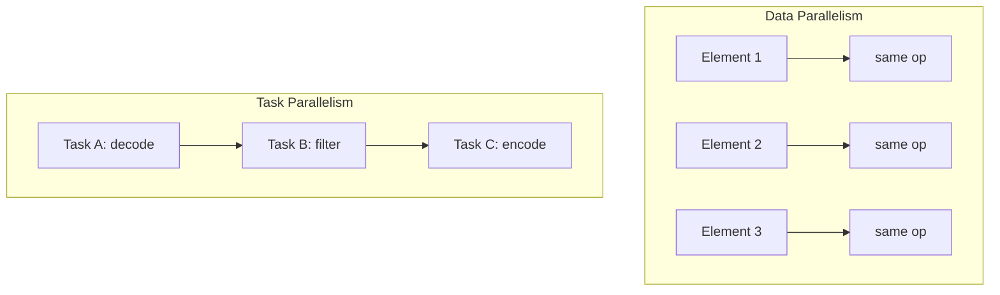

## Learning Objectives

- Define task parallelism and data parallelism, and classify a given piece of parallel work as one, the other, or a mix of both.
- Explain why CS2013 names these as the two core decomposition strategies for parallel and distributed computing.
- Relate data parallelism to the SIMD/GPU hardware model already covered in Computer Architecture, and task parallelism to the MIMD model.
- Recognize that most real parallel programs combine both strategies rather than using one exclusively.

## Context & Motivation

Before any concrete decomposition technique or programming model is introduced, this discipline needs a vocabulary for describing what "splitting up work" actually means, because there is more than one way to do it. The ACM/IEEE CS2013 Parallel and Distributed Computing Knowledge Area names two fundamental decomposition strategies as core material: task-based decomposition, typically realized with threads, and data-parallel decomposition, typically realized with SIMD hardware or MapReduce-style frameworks. These two strategies are not competing alternatives to be chosen between once and for all — they are two different axes along which any given problem can be analyzed, and most real, substantial parallel programs use both at different points.

This distinction connects directly back to Computer Architecture's own vocabulary. Flynn's taxonomy, already covered there, classified machines as SISD, SIMD, MISD, or MIMD based on how many instruction streams and data streams they operate on simultaneously. Data parallelism is the software-level analogue of the SIMD idea (one operation, many data elements); task parallelism is the software-level analogue of MIMD (many independent instruction streams, each potentially doing something different). Recognizing which kind of parallelism a piece of work naturally has is often the first and most important design decision in writing a correct, efficient parallel program.

## Core Theory

### Data parallelism: same operation, many data elements

Data parallelism applies the identical operation to many different pieces of data at the same time. The canonical example is applying a function to every element of a large array: squaring every element, adding two arrays element-by-element, or adjusting the brightness of every pixel in an image. Because every unit of work is structurally identical — same instructions, different data — data parallelism maps extremely naturally onto SIMD hardware lanes or GPU cores (both already covered in Computer Architecture), and onto OpenMP's `parallel for` construct (covered later in this discipline).

The defining property of data parallelism is that the work items are, in the simplest case, independent of each other: squaring element 5 of an array does not need to know anything about the result of squaring element 3. This independence is exactly what makes data-parallel decomposition safe and straightforward — there is no ordering constraint between the individual operations, so they can run in any order, or all at once, without changing the result.

### Task parallelism: different operations, running concurrently

Task parallelism instead splits a problem into distinct operations — different tasks — that can execute concurrently, each potentially doing genuinely different work. A realistic example: a video-processing pipeline where one thread decodes incoming frames, a second thread applies a filter to already-decoded frames, and a third thread encodes filtered frames for output — three structurally different jobs, running at the same time, each working on a different stage of the pipeline.

Unlike data parallelism's typically-independent work items, task parallelism very often has real dependencies between the tasks (the filter thread needs a frame the decode thread already produced), which is exactly why communication and synchronization — the subject of an upcoming concept — become unavoidable design concerns the moment task parallelism is in play.

### The same problem, decomposed two different ways

Many real problems can legitimately be decomposed using either strategy, or a mix, and recognizing this flexibility is itself a useful skill. Consider computing the total brightness of every frame in a video:

- **Data-parallel view**: treat "compute the brightness of one frame" as the identical operation applied independently to every frame — a natural fit for splitting frames across threads or machines, each running the same code.
- **Task-parallel view**: treat "decode a frame," "compute its brightness," and "accumulate the running total" as three distinct roles running as a pipeline, each frame flowing through all three stages while different frames occupy different stages at once.

Neither view is more "correct" than the other; they are different lenses for finding parallelism in the same problem, and the choice depends on which one maps more naturally onto the available hardware and programming model.



### Why real programs mix both

A large, realistic parallel application almost never uses exclusively one strategy. A weather simulation might use task parallelism at a coarse level (one set of processes handles atmospheric modeling, another handles ocean modeling, communicating periodically) while each of those uses data parallelism internally (updating every grid cell of its own simulation domain with the same physics equations). Recognizing both levels — and choosing the right decomposition at each level — is precisely the design skill this discipline's remaining "Decomposition & Design" concepts build toward.

## Worked Examples

### Example 1: Classifying real workloads

```text
Workload                                          Classification
-------------------------------------------------  -------------------------
Convert every pixel of an image from RGB to        Data parallelism
  grayscale using the same formula
A web server: one thread accepts connections,      Task parallelism
  another thread pool handles requests, a third
  writes logs
Multiply two large matrices, splitting the output  Data parallelism
  matrix into independent blocks, one per thread
A compiler pipeline: lexing, parsing, and code      Task parallelism
  generation running as overlapping stages on
  different files
```

The classifying question to ask: are the parallel units running the *same* code on *different* data (data parallelism), or are they running *different* code, potentially on related data (task parallelism)?

### Example 2: Finding both levels in one problem

Consider simulating heat diffusion across a large 2D grid, split across 4 machines, where each machine's local grid is further split across its own 8 CPU cores:

```text
Level                          Decomposition strategy
------------------------------  --------------------------------------------
Across the 4 machines           Task-ish at first glance, but actually
                                  data-parallel: each machine runs the exact
                                  same simulation code on its own quarter
                                  of the grid
Within one machine's 8 cores    Data-parallel: each core updates the same
                                  physics equation on its own slice of the
                                  local grid
```

Here, both levels turn out to be data-parallel — the same simulation code applied to different spatial regions — which is a common and often the simplest case for scientific computing. A more heterogeneous application (like the video pipeline example) would show task parallelism at one or both levels instead.

## Common Misconceptions & Pitfalls

- **"Task parallelism and data parallelism are mutually exclusive design choices."** They are two different ways of looking at the same problem, and a single large program often uses both — coarse task parallelism at a high level, data parallelism within each task.
- **"Data parallelism always means the work items are fully independent."** Independence is common (and makes data parallelism especially easy), but not guaranteed — a data-parallel update where each grid cell's new value depends on its neighbors' old values (common in simulations) still counts as data parallelism, and still needs careful synchronization to avoid reading a neighbor's value after it's already been updated for the new timestep.
- **"SIMD hardware can only run data-parallel code."** SIMD hardware is *best suited* to data parallelism because every lane executes the same instruction, but it cannot efficiently express task parallelism (different lanes doing genuinely different operations) at all — this is exactly the limitation GPU SIMT execution, covered in Computer Architecture, partially works around by letting divergent branches serialize.
- **"Choosing the wrong decomposition strategy is a correctness bug."** It's usually a performance issue, not a correctness one — task-parallelizing a data-parallel problem (or vice versa) will typically still produce a correct result, just not as efficiently as the better-matched strategy would.

## Summary

Task parallelism runs different operations concurrently (the software analogue of Flynn's MIMD); data parallelism runs the identical operation over many data elements at once (the software analogue of SIMD). CS2013 names both as core decomposition strategies, and most substantial real parallel programs use both at different levels — data parallelism for the bulk, uniform computation, task parallelism for the coarser pipeline or role structure around it. Neither is "correct" in isolation; recognizing which kind of parallelism a given piece of work actually has is the necessary first step before choosing a concrete decomposition technique, the subject of the next concept.

## Documentation Links

- [ACM/IEEE CS2013 — Parallel and Distributed Computing Knowledge Area](https://csed.acm.org/knowledge-areas-parallel-and-distributed-computing-pd-cs2013-version/) — names task-based and data-parallel decomposition as the two core strategies.
- [LLNL — Introduction to Parallel Computing Tutorial](https://hpc.llnl.gov/documentation/tutorials/introduction-parallel-computing-tutorial) — covers the data parallel model and SPMD/MPMD programming models this concept builds toward.
