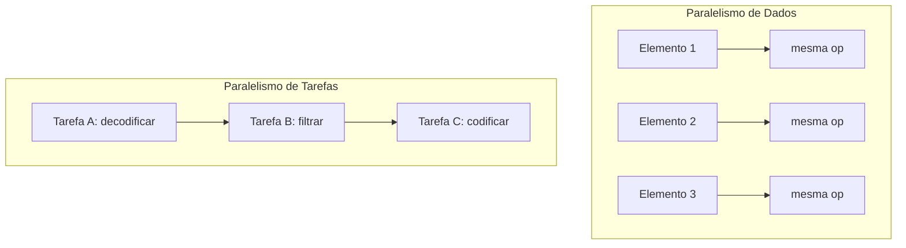

## Objetivos de Aprendizagem

- Definir paralelismo de tarefas e paralelismo de dados, e classificar um dado trabalho paralelo como um, o outro, ou uma mistura dos dois.
- Explicar por que o CS2013 nomeia estas como as duas estratégias centrais de decomposição para computação paralela e distribuída.
- Relacionar o paralelismo de dados ao modelo de hardware SIMD/GPU já coberto em Arquitetura de Computadores, e o paralelismo de tarefas ao modelo MIMD.
- Reconhecer que a maioria dos programas paralelos reais combina as duas estratégias em vez de usar exclusivamente uma.

## Contexto e Motivação

Antes que qualquer técnica concreta de decomposição ou modelo de programação seja introduzido, esta disciplina precisa de um vocabulário para descrever o que "dividir o trabalho" de fato significa, porque há mais de uma forma de fazer isso. A Knowledge Area de Parallel and Distributed Computing do ACM/IEEE CS2013 nomeia duas estratégias fundamentais de decomposição como material central: a decomposição baseada em tarefas, tipicamente realizada com threads, e a decomposição paralela de dados, tipicamente realizada com hardware SIMD ou frameworks no estilo MapReduce. Estas duas estratégias não são alternativas concorrentes a serem escolhidas de uma vez por todas; são dois eixos diferentes ao longo dos quais qualquer problema dado pode ser analisado, e a maioria dos programas paralelos reais e substanciais usa as duas em pontos diferentes.

Esta distinção se conecta diretamente ao próprio vocabulário de Arquitetura de Computadores. A taxonomia de Flynn, já coberta ali, classificava máquinas como SISD, SIMD, MISD ou MIMD com base em quantos fluxos de instruções e fluxos de dados elas operam simultaneamente. O paralelismo de dados é o análogo em software da ideia SIMD (uma operação, muitos elementos de dados); o paralelismo de tarefas é o análogo em software do MIMD (muitos fluxos de instruções independentes, cada um potencialmente fazendo algo diferente). Reconhecer que tipo de paralelismo um trabalho naturalmente tem é frequentemente a primeira e mais importante decisão de projeto ao escrever um programa paralelo correto e eficiente.

## Teoria Central

### Paralelismo de dados: mesma operação, muitos elementos de dados

O paralelismo de dados aplica a operação idêntica a muitos pedaços diferentes de dados ao mesmo tempo. O exemplo canônico é aplicar uma função a cada elemento de um array grande: elevar ao quadrado cada elemento, somar dois arrays elemento a elemento, ou ajustar o brilho de cada pixel de uma imagem. Como toda unidade de trabalho é estruturalmente idêntica (mesmas instruções, dados diferentes), o paralelismo de dados mapeia de forma extremamente natural em lanes de hardware SIMD ou núcleos de GPU (ambos já cobertos em Arquitetura de Computadores), e no construto `parallel for` do OpenMP (coberto mais adiante nesta disciplina).

A propriedade definidora do paralelismo de dados é que os itens de trabalho são, no caso mais simples, independentes entre si: elevar ao quadrado o elemento 5 de um array não precisa saber nada sobre o resultado de elevar ao quadrado o elemento 3. Essa independência é exatamente o que torna a decomposição paralela de dados segura e direta: não há restrição de ordem entre as operações individuais, então elas podem rodar em qualquer ordem, ou todas de uma vez, sem mudar o resultado.

### Paralelismo de tarefas: operações diferentes, rodando concorrentemente

O paralelismo de tarefas, em vez disso, divide um problema em operações distintas (tarefas diferentes) que podem executar concorrentemente, cada uma potencialmente fazendo um trabalho genuinamente diferente. Um exemplo realista: um pipeline de processamento de vídeo onde uma thread decodifica frames recebidos, uma segunda thread aplica um filtro a frames já decodificados, e uma terceira thread codifica frames filtrados para saída. São três trabalhos estruturalmente diferentes, rodando ao mesmo tempo, cada um trabalhando num estágio diferente do pipeline.

Diferente dos itens de trabalho tipicamente independentes do paralelismo de dados, o paralelismo de tarefas muito frequentemente tem dependências reais entre as tarefas (a thread de filtro precisa de um frame que a thread de decodificação já produziu), e é exatamente por isso que comunicação e sincronização, o assunto de um conceito próximo, se tornam preocupações de projeto inevitáveis no momento em que o paralelismo de tarefas entra em jogo.

### O mesmo problema, decomposto de duas formas diferentes

Muitos problemas reais podem legitimamente ser decompostos usando qualquer uma das estratégias, ou uma mistura, e reconhecer essa flexibilidade é em si uma habilidade útil. Considere calcular o brilho total de cada frame de um vídeo:

- **Visão de paralelismo de dados**: tratar "calcular o brilho de um frame" como a operação idêntica aplicada independentemente a cada frame, um encaixe natural para dividir os frames entre threads ou máquinas, cada uma rodando o mesmo código.
- **Visão de paralelismo de tarefas**: tratar "decodificar um frame", "calcular o seu brilho" e "acumular o total corrente" como três papéis distintos rodando como um pipeline, com cada frame fluindo pelos três estágios enquanto frames diferentes ocupam estágios diferentes ao mesmo tempo.

Nenhuma das visões é mais "correta" do que a outra; são lentes diferentes para encontrar paralelismo no mesmo problema, e a escolha depende de qual delas mapeia mais naturalmente no hardware e no modelo de programação disponíveis.



### Por que programas reais misturam os dois

Uma aplicação paralela grande e realista quase nunca usa exclusivamente uma estratégia. Uma simulação meteorológica pode usar paralelismo de tarefas num nível grosso (um conjunto de processos cuida da modelagem atmosférica, outro cuida da modelagem oceânica, comunicando-se periodicamente) enquanto cada um deles usa paralelismo de dados internamente (atualizando cada célula de grade do seu próprio domínio de simulação com as mesmas equações físicas). Reconhecer os dois níveis, e escolher a decomposição certa em cada nível, é precisamente a habilidade de projeto que os conceitos restantes de "Decomposição e Projeto" desta disciplina constroem.

## Exemplos Resolvidos

### Exemplo 1: Classificando cargas de trabalho reais

```text
Carga de trabalho                                 Classificação
-------------------------------------------------  -------------------------
Converter cada pixel de uma imagem de RGB para     Paralelismo de dados
  tons de cinza usando a mesma fórmula
Um servidor web: uma thread aceita conexões, outro Paralelismo de tarefas
  pool de threads trata requisições, uma terceira
  escreve logs
Multiplicar duas matrizes grandes, dividindo a     Paralelismo de dados
  matriz de saída em blocos independentes, um por
  thread
Um pipeline de compilador: análise léxica, análise Paralelismo de tarefas
  sintática e geração de código rodando como
  estágios sobrepostos em arquivos diferentes
```

A pergunta de classificação a fazer: as unidades paralelas estão rodando o *mesmo* código sobre dados *diferentes* (paralelismo de dados), ou estão rodando código *diferente*, potencialmente sobre dados relacionados (paralelismo de tarefas)?

### Exemplo 2: Encontrando os dois níveis num problema

Considere simular a difusão de calor numa grade 2D grande, dividida entre 4 máquinas, onde a grade local de cada máquina é ainda dividida entre os seus próprios 8 núcleos de CPU:

```text
Nível                           Estratégia de decomposição
------------------------------  --------------------------------------------
Entre as 4 máquinas             Parece de tarefas à primeira vista, mas é
                                  na verdade paralelismo de dados: cada
                                  máquina roda exatamente o mesmo código de
                                  simulação no seu próprio quarto da grade
Dentro dos 8 núcleos de uma     Paralelismo de dados: cada núcleo atualiza
  máquina                         a mesma equação física na sua própria fatia
                                  da grade local
```

Aqui, os dois níveis acabam sendo de paralelismo de dados (o mesmo código de simulação aplicado a regiões espaciais diferentes), o que é um caso comum e frequentemente o mais simples para computação científica. Uma aplicação mais heterogênea (como o exemplo do pipeline de vídeo) mostraria paralelismo de tarefas em um ou nos dois níveis.

## Equívocos Comuns e Armadilhas

- **"Paralelismo de tarefas e paralelismo de dados são escolhas de projeto mutuamente exclusivas."** São duas formas diferentes de olhar para o mesmo problema, e um único programa grande frequentemente usa as duas: paralelismo de tarefas grosso num nível alto, paralelismo de dados dentro de cada tarefa.
- **"Paralelismo de dados sempre significa que os itens de trabalho são totalmente independentes."** A independência é comum (e torna o paralelismo de dados especialmente fácil), mas não garantida. Uma atualização paralela de dados onde o novo valor de cada célula da grade depende dos valores antigos dos vizinhos (comum em simulações) ainda conta como paralelismo de dados, e ainda precisa de sincronização cuidadosa para evitar ler o valor de um vizinho depois que ele já foi atualizado para o novo passo de tempo.
- **"Hardware SIMD só consegue rodar código paralelo de dados."** Hardware SIMD é *mais adequado* ao paralelismo de dados porque toda lane executa a mesma instrução, mas ele não consegue expressar de forma eficiente o paralelismo de tarefas (lanes diferentes fazendo operações genuinamente diferentes) de forma alguma. Esta é exatamente a limitação que a execução SIMT de GPU, coberta em Arquitetura de Computadores, contorna parcialmente ao deixar ramos divergentes se serializarem.
- **"Escolher a estratégia de decomposição errada é um bug de corretude."** Geralmente é um problema de desempenho, não de corretude: paralelizar por tarefas um problema paralelo de dados (ou vice-versa) tipicamente ainda produz um resultado correto, apenas não tão eficientemente quanto a estratégia mais adequada produziria.

## Resumo

O paralelismo de tarefas roda operações diferentes concorrentemente (o análogo em software do MIMD de Flynn); o paralelismo de dados roda a operação idêntica sobre muitos elementos de dados de uma vez (o análogo em software do SIMD). O CS2013 nomeia ambos como estratégias centrais de decomposição, e a maioria dos programas paralelos reais e substanciais usa os dois em níveis diferentes: paralelismo de dados para a computação volumosa e uniforme, paralelismo de tarefas para a estrutura mais grossa de pipeline ou de papéis ao redor dela. Nenhum é "correto" isoladamente; reconhecer que tipo de paralelismo um dado trabalho de fato tem é o primeiro passo necessário antes de escolher uma técnica de decomposição concreta, o assunto do próximo conceito.

## Documentation Links

- [ACM/IEEE CS2013: Parallel and Distributed Computing Knowledge Area](https://csed.acm.org/knowledge-areas-parallel-and-distributed-computing-pd-cs2013-version/): nomeia a decomposição baseada em tarefas e a decomposição paralela de dados como as duas estratégias centrais.
- [LLNL: Introduction to Parallel Computing Tutorial](https://hpc.llnl.gov/documentation/tutorials/introduction-parallel-computing-tutorial): cobre o modelo paralelo de dados e os modelos de programação SPMD/MPMD em direção aos quais este conceito avança.
