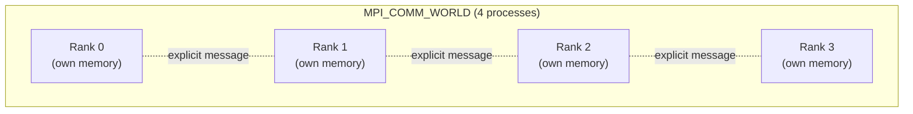

## Learning Objectives

- Explain why MPI has no shared address space to fork threads into, and why that forces a fundamentally different programming model than OpenMP.
- Define SPMD, and write a minimal MPI "hello from each process" program in C, identifying each process by its rank.
- Explain what a communicator is, and what `MPI_COMM_WORLD` specifically represents.
- Relate MPI's process-and-rank model directly to the distributed-memory architecture covered earlier in this discipline.

## Context & Motivation

OpenMP, just covered, is a shared-memory model: all its threads live inside one process's single address space, forked from one master thread, communicating implicitly through ordinary reads and writes to shared variables. That model has no meaning at all on a distributed-memory cluster, where separate machines have no shared address space — there is nothing to "fork" a thread into on a different physical machine. MPI (Message Passing Interface) is the real, standard answer to exactly this gap: rather than forking threads within one process, MPI launches a fixed number of independent, separate operating-system processes — potentially on entirely different physical machines — and gives them a well-defined way to communicate: explicit messages, sent and received over the network, matching the distributed-memory architecture already covered earlier in this discipline precisely.

MPI is not a single vendor's product but an open specification (implemented by libraries like OpenMPI and MPICH), and Lawrence Livermore National Laboratory's official MPI tutorial, used throughout this cluster, is one of the most widely used practical references for learning it. Cornell, Argonne National Laboratory, and virtually every real HPC center provide near-identical training material, because MPI is the de facto standard for distributed-memory parallel programming in scientific computing.

## Core Theory

### No shared memory, so no fork-join — processes are launched, not forked

MPI's execution model has no analogue of OpenMP's fork-join: there is no single master process that "forks" the others mid-execution. Instead, a fixed number of MPI processes are all launched together, at the same time, typically via a launcher command (`mpirun` or `mpiexec`), and every one of them begins running the *exact same program* from its very first line:

```c
#include <mpi.h>
#include <stdio.h>

int main(int argc, char** argv) {
    MPI_Init(&argc, &argv);

    int rank, size;
    MPI_Comm_rank(MPI_COMM_WORLD, &rank);
    MPI_Comm_size(MPI_COMM_WORLD, &size);

    printf("Hello from rank %d of %d\n", rank, size);

    MPI_Finalize();
    return 0;
}
```

Run with `mpirun -np 4 ./hello`, this launches 4 separate processes, each executing this identical program independently, each producing one line of output (in a non-deterministic interleaved order, exactly as OpenMP's threads did):

```text
Hello from rank 2 of 4
Hello from rank 0 of 4
Hello from rank 3 of 4
Hello from rank 1 of 4
```

### SPMD: same program, different rank, different behavior

This "same program, launched N times, each instance behaving differently based on its own identity" pattern is precisely **SPMD** (Single Program, Multiple Data) — already named in the parallel-programming-models material this discipline's early concepts drew on, and the dominant pattern in real MPI programs. `MPI_Comm_rank` gives each process its unique integer identity — its **rank**, from 0 to (size - 1) — and virtually every interesting MPI program branches its behavior based on that rank:

```c
if (rank == 0) {
    // Rank 0 acts as a coordinator: gathers results, writes output, etc.
} else {
    // Every other rank does the actual distributed computation.
}
```

This is the MPI analogue of `omp_get_thread_num()` from OpenMP — but where OpenMP's thread ID identifies one of several threads *within one shared-memory process*, MPI's rank identifies one of several entirely separate *processes*, which may be running on entirely different physical machines with no memory in common at all.

### Communicators: the group a rank's number is relative to

A rank is only meaningful relative to a specific **communicator** — a named group of processes that can communicate with each other. `MPI_COMM_WORLD` is the default, predefined communicator containing every process launched in the MPI program; a rank obtained via `MPI_Comm_rank(MPI_COMM_WORLD, &rank)` is that process's identity *within the whole program*. MPI also supports creating smaller, custom communicators (a subset of all processes, useful for organizing communication among a logical group, like all processes in one row of a 2D process grid) — a topic this discipline touches only at the concept level, since the full mechanics belong to a more advanced course, but worth naming here because "the rank" is always implicitly "the rank within a specific communicator," most commonly `MPI_COMM_WORLD`.



### Why this matches distributed memory exactly

Every process launched by MPI has its own completely private memory — a variable declared in one process's code is invisible to every other process, exactly matching the distributed-memory architecture described earlier in this discipline. There is no possibility of the kind of shared-variable race condition OpenMP's synchronization concept addressed, precisely because there is no shared variable at all — but the corresponding cost is that *any* data one process needs from another must be sent as an explicit message, the subject of the next two concepts.

## Worked Examples

### Example 1: Tracing rank-based branching

```c
MPI_Comm_rank(MPI_COMM_WORLD, &rank);

if (rank == 0) {
    printf("Rank 0: I am the coordinator.\n");
} else if (rank % 2 == 0) {
    printf("Rank %d: I am an even worker.\n", rank);
} else {
    printf("Rank %d: I am an odd worker.\n", rank);
}
```

Launched with `mpirun -np 6`, the six processes (ranks 0-5) each execute this identical source file, but rank 0 prints the coordinator message, ranks 2 and 4 print the even-worker message, and ranks 1, 3, and 5 print the odd-worker message — a single program, producing three genuinely different behaviors, purely as a function of each process's own rank. This is the essence of SPMD: no process runs different *code*, but every process can run different *paths through* that same code.

### Example 2: Classifying which model (OpenMP or MPI) fits a scenario

```text
Scenario                                            Model
---------------------------------------------------  --------------------
16 cores on one workstation, one large shared array   OpenMP
  to process together
64 separate cluster nodes, no shared memory, each     MPI
  simulating its own region of a large physical
  domain
```

The deciding question, matching the memory-architecture concept from earlier in this discipline directly: is there one shared address space multiple threads can fork into (OpenMP), or are there multiple independent machines/processes with no shared memory, requiring explicit message passing (MPI)?

## Common Misconceptions & Pitfalls

- **"MPI processes are the same thing as OpenMP threads, just with a different name."** They are fundamentally different: OpenMP threads share one process's address space and are forked mid-execution from a master; MPI processes each have entirely private memory, are all launched together from the very start of the program, and can run on entirely separate physical machines.
- **"An MPI program has one 'main' process and several 'worker' processes running different code."** By default, every rank runs the *exact same compiled program* (SPMD) — different behavior per rank comes from branching on the rank value inside that shared code, not from different processes running genuinely different programs (MPMD, a less common variant this discipline does not cover in depth).
- **"Rank numbers are globally meaningful across any MPI program."** A rank is only meaningful relative to a specific communicator — the same physical process could have a different rank number within a different (smaller) communicator than it has within `MPI_COMM_WORLD`.
- **"MPI can only run on physically separate machines, never on one machine."** MPI processes can (and very commonly do, for testing) all run on a single machine, in which case communication happens through fast local mechanisms rather than a real network — the programming model is identical either way, only the communication cost differs.

## Summary

MPI launches a fixed number of independent processes together via SPMD (Single Program, Multiple Data) — every process runs the identical compiled program, each identified by a unique integer rank obtained from `MPI_Comm_rank`, most commonly within the default `MPI_COMM_WORLD` communicator that includes every launched process. Unlike OpenMP's threads, MPI processes share no memory at all, matching the distributed-memory architecture covered earlier in this discipline exactly — any coordination between processes must happen through explicit messages, which the next two concepts cover: point-to-point send/receive, and the collective communication patterns real MPI programs use far more often.

## Documentation Links

- [LLNL HPC Tutorials — MPI](https://hpc-tutorials.llnl.gov/mpi/) — source for the MPI execution model, `MPI_Init`/`MPI_Comm_rank`/`MPI_Comm_size`, and the communicator concept covered in this concept.
- [LLNL — Introduction to Parallel Computing Tutorial](https://hpc.llnl.gov/documentation/tutorials/introduction-parallel-computing-tutorial) — source for the SPMD programming model this concept's worked examples rely on.
