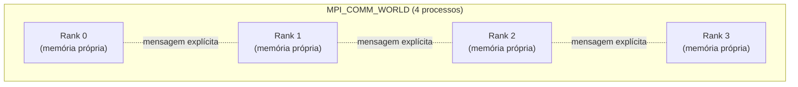

## Objetivos de Aprendizagem

- Explicar por que o MPI não tem um espaço de endereçamento compartilhado no qual fazer fork de threads, e por que isso força um modelo de programação fundamentalmente diferente do OpenMP.
- Definir SPMD, e escrever um programa MPI mínimo de "olá de cada processo" em C, identificando cada processo pelo seu rank.
- Explicar o que é um comunicador, e o que `MPI_COMM_WORLD` especificamente representa.
- Relacionar o modelo de processos e ranks do MPI diretamente à arquitetura de memória distribuída vista antes nesta disciplina.

## Contexto e Motivação

O OpenMP, recém-coberto, é um modelo de memória compartilhada: todas as suas threads vivem dentro do único espaço de endereçamento de um processo, criadas por fork a partir de uma thread mestre, comunicando-se implicitamente por meio de leituras e escritas comuns em variáveis compartilhadas. Esse modelo não tem significado algum num cluster de memória distribuída, onde máquinas separadas não têm espaço de endereçamento compartilhado: não há nada no qual "fazer fork" de uma thread numa máquina física diferente. O MPI (Message Passing Interface) é a resposta real e padrão para exatamente essa lacuna: em vez de fazer fork de threads dentro de um processo, o MPI lança um número fixo de processos de sistema operacional independentes e separados (potencialmente em máquinas físicas totalmente diferentes) e lhes dá uma forma bem definida de se comunicar: mensagens explícitas, enviadas e recebidas pela rede, correspondendo precisamente à arquitetura de memória distribuída já coberta antes nesta disciplina.

O MPI não é o produto de um único fornecedor, mas uma especificação aberta (implementada por bibliotecas como OpenMPI e MPICH), e o tutorial oficial de MPI do Lawrence Livermore National Laboratory, usado ao longo deste bloco, é uma das referências práticas mais usadas para aprendê-lo. Cornell, o Argonne National Laboratory e praticamente todo centro de HPC real fornecem material de treinamento quase idêntico, porque o MPI é o padrão de fato para programação paralela em memória distribuída na computação científica.

## Teoria Central

### Sem memória compartilhada, sem fork-join: processos são lançados, não criados por fork

O modelo de execução do MPI não tem análogo ao fork-join do OpenMP: não existe um único processo mestre que "faz fork" dos outros no meio da execução. Em vez disso, um número fixo de processos MPI é lançado todo junto, ao mesmo tempo, tipicamente via um comando lançador (`mpirun` ou `mpiexec`), e cada um deles começa a rodar *exatamente o mesmo programa* desde a sua primeira linha:

```c
#include <mpi.h>
#include <stdio.h>

int main(int argc, char** argv) {
    MPI_Init(&argc, &argv);

    int rank, size;
    MPI_Comm_rank(MPI_COMM_WORLD, &rank);
    MPI_Comm_size(MPI_COMM_WORLD, &size);

    printf("Hello from rank %d of %d\n", rank, size);

    MPI_Finalize();
    return 0;
}
```

Rodado com `mpirun -np 4 ./hello`, isto lança 4 processos separados, cada um executando este programa idêntico de forma independente, cada um produzindo uma linha de saída (numa ordem intercalada não determinística, exatamente como as threads do OpenMP faziam):

```text
Hello from rank 2 of 4
Hello from rank 0 of 4
Hello from rank 3 of 4
Hello from rank 1 of 4
```

### SPMD: mesmo programa, rank diferente, comportamento diferente

Este padrão de "mesmo programa, lançado N vezes, cada instância se comportando de forma diferente com base na sua própria identidade" é precisamente o **SPMD** (Single Program, Multiple Data), já nomeado no material de modelos de programação paralela no qual os conceitos iniciais desta disciplina se apoiaram, e o padrão dominante em programas MPI reais. `MPI_Comm_rank` dá a cada processo a sua identidade inteira única, o seu **rank**, de 0 a (size - 1), e praticamente todo programa MPI interessante ramifica o seu comportamento com base nesse rank:

```c
if (rank == 0) {
    // O rank 0 atua como coordenador: reúne resultados, escreve a saída, etc.
} else {
    // Todo outro rank faz a computação distribuída de fato.
}
```

Este é o análogo em MPI do `omp_get_thread_num()` do OpenMP, mas onde o ID de thread do OpenMP identifica uma de várias threads *dentro de um processo de memória compartilhada*, o rank do MPI identifica um de vários *processos* totalmente separados, que podem estar rodando em máquinas físicas totalmente diferentes sem nenhuma memória em comum.

### Comunicadores: o grupo em relação ao qual o número de um rank vale

Um rank só tem significado em relação a um **comunicador** específico: um grupo nomeado de processos que podem se comunicar entre si. `MPI_COMM_WORLD` é o comunicador padrão e predefinido que contém todo processo lançado no programa MPI; um rank obtido via `MPI_Comm_rank(MPI_COMM_WORLD, &rank)` é a identidade desse processo *dentro do programa inteiro*. O MPI também suporta criar comunicadores menores e personalizados (um subconjunto de todos os processos, útil para organizar a comunicação dentro de um grupo lógico, como todos os processos numa linha de uma grade 2D de processos), um tópico que esta disciplina toca apenas no nível conceitual, já que a mecânica completa pertence a um curso mais avançado, mas que vale nomear aqui porque "o rank" é sempre implicitamente "o rank dentro de um comunicador específico", mais comumente `MPI_COMM_WORLD`.



### Por que isto corresponde exatamente à memória distribuída

Todo processo lançado pelo MPI tem a sua própria memória completamente privada: uma variável declarada no código de um processo é invisível para todo outro processo, correspondendo exatamente à arquitetura de memória distribuída descrita antes nesta disciplina. Não há possibilidade do tipo de condição de corrida em variável compartilhada que o conceito de sincronização do OpenMP tratou, justamente porque não existe variável compartilhada alguma. O custo correspondente é que *qualquer* dado que um processo precise de outro tem que ser enviado como uma mensagem explícita, o assunto dos próximos dois conceitos.

## Exemplos Resolvidos

### Exemplo 1: Rastreando a ramificação baseada em rank

```c
MPI_Comm_rank(MPI_COMM_WORLD, &rank);

if (rank == 0) {
    printf("Rank 0: I am the coordinator.\n");
} else if (rank % 2 == 0) {
    printf("Rank %d: I am an even worker.\n", rank);
} else {
    printf("Rank %d: I am an odd worker.\n", rank);
}
```

Lançados com `mpirun -np 6`, os seis processos (ranks 0-5) executam cada um este arquivo-fonte idêntico, mas o rank 0 imprime a mensagem de coordenador, os ranks 2 e 4 imprimem a mensagem de trabalhador par, e os ranks 1, 3 e 5 imprimem a mensagem de trabalhador ímpar. Um único programa, produzindo três comportamentos genuinamente diferentes, puramente em função do próprio rank de cada processo. Esta é a essência do SPMD: nenhum processo roda *código* diferente, mas todo processo pode percorrer *caminhos* diferentes por esse mesmo código.

### Exemplo 2: Classificando qual modelo (OpenMP ou MPI) se encaixa num cenário

```text
Cenário                                             Modelo
---------------------------------------------------  --------------------
16 núcleos numa estação de trabalho, um grande array  OpenMP
  compartilhado para processar junto
64 nós de cluster separados, sem memória              MPI
  compartilhada, cada um simulando a sua própria
  região de um grande domínio físico
```

A pergunta decisiva, correspondendo diretamente ao conceito de arquitetura de memória visto antes nesta disciplina: existe um espaço de endereçamento compartilhado no qual múltiplas threads podem ser criadas por fork (OpenMP), ou existem múltiplas máquinas/processos independentes sem memória compartilhada, exigindo troca de mensagens explícita (MPI)?

## Equívocos Comuns e Armadilhas

- **"Processos MPI são a mesma coisa que threads OpenMP, só com outro nome."** São fundamentalmente diferentes: as threads do OpenMP compartilham o espaço de endereçamento de um processo e são criadas por fork no meio da execução a partir de uma mestre; os processos MPI têm cada um memória inteiramente privada, são todos lançados juntos desde o comecinho do programa, e podem rodar em máquinas físicas totalmente separadas.
- **"Um programa MPI tem um processo 'principal' e vários processos 'trabalhadores' rodando código diferente."** Por padrão, todo rank roda *exatamente o mesmo programa compilado* (SPMD). Comportamento diferente por rank vem de ramificar no valor do rank dentro desse código compartilhado, não de processos diferentes rodando programas genuinamente diferentes (MPMD, uma variante menos comum que esta disciplina não cobre em profundidade).
- **"Números de rank têm significado global em qualquer programa MPI."** Um rank só tem significado em relação a um comunicador específico: o mesmo processo físico pode ter um número de rank diferente dentro de um comunicador diferente (menor) do que tem dentro de `MPI_COMM_WORLD`.
- **"MPI só consegue rodar em máquinas fisicamente separadas, nunca numa máquina só."** Processos MPI podem (e muito comumente fazem, para testes) rodar todos numa única máquina, caso em que a comunicação acontece por mecanismos locais rápidos em vez de uma rede real. O modelo de programação é idêntico nos dois casos, só o custo de comunicação difere.

## Resumo

O MPI lança um número fixo de processos independentes juntos via SPMD (Single Program, Multiple Data): todo processo roda o programa compilado idêntico, cada um identificado por um rank inteiro único obtido de `MPI_Comm_rank`, mais comumente dentro do comunicador padrão `MPI_COMM_WORLD`, que inclui todo processo lançado. Diferente das threads do OpenMP, os processos MPI não compartilham memória alguma, correspondendo exatamente à arquitetura de memória distribuída vista antes nesta disciplina: qualquer coordenação entre processos tem que acontecer por meio de mensagens explícitas, que os próximos dois conceitos cobrem: send/receive ponto a ponto, e os padrões de comunicação coletiva que programas MPI reais usam com muito mais frequência.

## Documentation Links

- [LLNL HPC Tutorials: MPI](https://hpc-tutorials.llnl.gov/mpi/): fonte para o modelo de execução do MPI, `MPI_Init`/`MPI_Comm_rank`/`MPI_Comm_size` e o conceito de comunicador cobertos neste conceito.
- [LLNL: Introduction to Parallel Computing Tutorial](https://hpc.llnl.gov/documentation/tutorials/introduction-parallel-computing-tutorial): fonte para o modelo de programação SPMD no qual os exemplos resolvidos deste conceito se apoiam.
