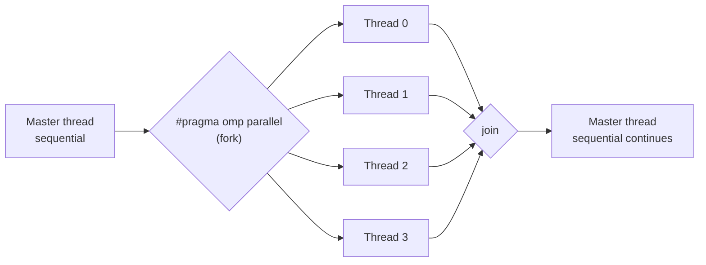

## Learning Objectives

- Describe the fork-join execution model OpenMP uses, and trace it through a real `#pragma omp parallel` region.
- Write a minimal, correct OpenMP "hello from each thread" program in C, and explain what `omp_get_thread_num()` and `omp_get_num_threads()` report.
- Explain what OpenMP directives are, and why they let a program remain valid, sequential C even when OpenMP support is disabled at compile time.
- Identify which parallel computer memory architecture (from earlier in this discipline) OpenMP targets, and why.

## Context & Motivation

Every concept so far in this discipline has built design vocabulary — decomposition, granularity, load balancing, speedup, scalability — without writing a single line of actual parallel code. This concept begins the discipline's most concrete, practical section: OpenMP, a real, extremely widely-used API for shared-memory parallel programming in C, C++, and Fortran, standardized by the OpenMP Architecture Review Board and covered in detail by Lawrence Livermore National Laboratory's own official training tutorial, one of the most-used practical references for this exact material.

OpenMP was chosen as this discipline's shared-memory programming model specifically because it directly targets the shared-memory architecture already covered earlier in this discipline (UMA and NUMA machines) — it has no mechanism for distributed memory, deliberately, which is exactly the gap MPI, the next cluster's subject, fills.

## Core Theory

### Directives: parallel hints layered onto ordinary sequential code

OpenMP's defining design choice is that it works through **compiler directives** — `#pragma omp ...` lines added to otherwise-ordinary, valid C code — rather than requiring a separate parallel language or a library of function calls for every parallel operation. This has a genuinely useful practical consequence: a program written with OpenMP directives remains valid, correct sequential C even if compiled *without* OpenMP support enabled (the compiler simply ignores directives it doesn't recognize) — the same source file can be built as a sequential program or a parallel one, with the directives doing nothing in the former case and creating real parallelism in the latter.

### The fork-join model

LLNL's tutorial describes OpenMP's execution model precisely as **fork-join**: a program begins execution as a single thread (the **master thread**). When execution reaches a `#pragma omp parallel` region, the master thread **forks** — it creates a team of additional worker threads, and all of them (including the master) execute the code inside that region together. When every thread in the team finishes the parallel region, they **join** back into a single thread, which continues executing the rest of the program sequentially, until the next parallel region (if any) forks again.



This model directly matches the shared-memory architecture from earlier in this discipline: all threads in a parallel region share the same address space (the same process's memory), so they can all read the same global and stack variables without any explicit message-passing — the same convenience, and the same synchronization responsibility, already discussed when shared memory's advantages and disadvantages were introduced.

### A minimal OpenMP program

```c
#include <stdio.h>
#include <omp.h>

int main() {
    #pragma omp parallel
    {
        int thread_id = omp_get_thread_num();
        int num_threads = omp_get_num_threads();
        printf("Hello from thread %d of %d\n", thread_id, num_threads);
    }
    return 0;
}
```

Compiled with OpenMP enabled (`gcc -fopenmp hello.c -o hello`), running this program with 4 threads available produces four lines of output, one per thread, in a non-deterministic interleaved order (since the threads run genuinely concurrently and their print statements race for the terminal) — for example:

```text
Hello from thread 2 of 4
Hello from thread 0 of 4
Hello from thread 3 of 4
Hello from thread 1 of 4
```

`omp_get_thread_num()` returns the calling thread's index within its team (0 through `num_threads - 1`); `omp_get_num_threads()` returns the total size of the current team. The non-deterministic ordering here is expected and harmless for this example (a print statement), but the same non-determinism, applied to a shared variable *write* instead of a print, is exactly the race-condition hazard `programming-paradigms` already introduced conceptually — and exactly what the synchronization concept later in this cluster addresses directly.

### Compiling and controlling the number of threads

The number of threads OpenMP creates for a parallel region is controlled at runtime, most commonly via the `OMP_NUM_THREADS` environment variable (`OMP_NUM_THREADS=8 ./hello`) or the `omp_set_num_threads()` function called before the parallel region — the same source code runs correctly (just with a different degree of parallelism) regardless of how many threads are requested, including as few as one, which reduces the parallel region to behaving like ordinary sequential code.

## Worked Examples

### Example 1: Tracing fork-join through a program with two parallel regions

```c
#include <stdio.h>
#include <omp.h>

int main() {
    printf("Before region 1 (sequential)\n");          // master only

    #pragma omp parallel num_threads(3)
    {
        printf("In region 1, thread %d\n", omp_get_thread_num());
    }                                                    // join

    printf("Between regions (sequential)\n");            // master only

    #pragma omp parallel num_threads(2)
    {
        printf("In region 2, thread %d\n", omp_get_thread_num());
    }                                                    // join

    printf("After region 2 (sequential)\n");             // master only
    return 0;
}
```

Tracing execution: "Before region 1" prints exactly once (only the master thread is running). At the first `#pragma omp parallel`, the master forks into 3 threads, each printing "In region 1" (in some interleaved order); they join back to 1 thread. "Between regions" prints exactly once. At the second parallel region, the master forks into a *different* team size (2 threads this time — `num_threads` can vary per region); they join again. "After region 2" prints exactly once. This trace is exactly the fork-join pattern: alternating between single-threaded sequential sections and multi-threaded parallel sections, with the team size chosen independently for each fork.

### Example 2: Why directive-based design keeps sequential builds valid

```c
#pragma omp parallel for
for (int i = 0; i < n; i++) {
    result[i] = expensive_computation(a[i]);
}
```

Compiled with `gcc -fopenmp`, this loop's iterations are split across a team of threads (the mechanism the next concept, work-sharing, covers precisely). Compiled instead with plain `gcc` (no `-fopenmp` flag), the compiler simply does not recognize `#pragma omp parallel for` as meaningful — by the C standard, an unrecognized pragma is ignored — and the loop executes exactly as an ordinary sequential `for` loop, with identical results. This is precisely the practical benefit of directive-based design highlighted earlier: the same source file is simultaneously a valid sequential program and a valid parallel program, and a team can develop and debug the sequential logic first before ever worrying about the parallel behavior.

## Common Misconceptions & Pitfalls

- **"OpenMP requires rewriting a program from scratch in a different language."** OpenMP directives are added to ordinary C, C++, or Fortran — a sequential program is very often incrementally parallelized by adding directives to its existing loops and blocks, not rewritten wholesale.
- **"Every thread in a parallel region executes different code."** By default, every thread executes the *same* code inside the parallel region (the classic SPMD pattern already introduced) — different behavior per thread (like the `thread_id`-based branching in Example 1) has to be written explicitly using each thread's own ID.
- **"OpenMP works on distributed-memory clusters."** It does not — OpenMP's threads all live within one process's shared address space on one machine; distributed-memory parallelism across separate machines requires MPI, the next cluster's subject, and the two are often combined (MPI across nodes, OpenMP within each node) in real HPC code.
- **"The order threads execute in, or print in, is predictable."** It is not, by design — OpenMP threads run concurrently and the OS scheduler determines their exact interleaving, which is why Example 1's print order is only shown as "some interleaved order," never a fixed sequence.

## Summary

OpenMP is a directive-based shared-memory parallel programming API: `#pragma omp` lines added to ordinary C code, ignored harmlessly by a compiler without OpenMP support, and interpreted by one with it to create parallelism via the fork-join model — a master thread forks a team of worker threads at each `#pragma omp parallel` region, all sharing the same address space (matching the shared-memory architecture covered earlier in this discipline), and joins back into a single thread when the region ends. This directive-based approach lets a single source file remain both a valid sequential program and a valid parallel one. The next concept builds on this fork-join foundation with OpenMP's most commonly used feature: automatically splitting loop iterations across an already-forked team of threads.

## Documentation Links

- [LLNL HPC Tutorials — OpenMP](https://hpc-tutorials.llnl.gov/openmp/) — source for the fork-join model, directive syntax, and runtime API functions covered in this concept.
