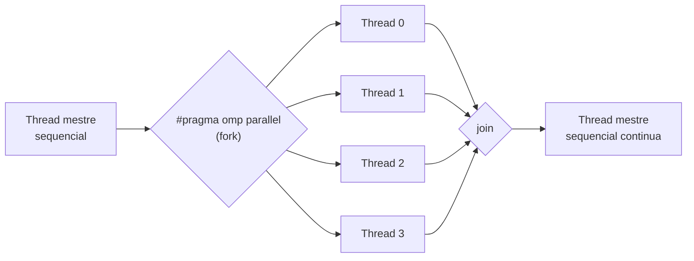

## Objetivos de Aprendizagem

- Descrever o modelo de execução fork-join que o OpenMP usa, e rastreá-lo através de uma região `#pragma omp parallel` real.
- Escrever um programa OpenMP mínimo e correto de "olá de cada thread" em C, e explicar o que `omp_get_thread_num()` e `omp_get_num_threads()` reportam.
- Explicar o que são as diretivas do OpenMP, e por que elas permitem que um programa continue sendo C sequencial válido mesmo quando o suporte a OpenMP está desabilitado na compilação.
- Identificar qual arquitetura de memória de computador paralelo (vista antes nesta disciplina) o OpenMP mira, e por quê.

## Contexto e Motivação

Todo conceito até agora nesta disciplina construiu vocabulário de projeto (decomposição, granularidade, balanceamento de carga, speedup, escalabilidade) sem escrever uma única linha de código paralelo de verdade. Este conceito inicia a seção mais concreta e prática da disciplina: o OpenMP, uma API real e extremamente usada para programação paralela em memória compartilhada em C, C++ e Fortran, padronizada pelo OpenMP Architecture Review Board e coberta em detalhe pelo tutorial oficial de treinamento do próprio Lawrence Livermore National Laboratory, uma das referências práticas mais usadas para exatamente este material.

O OpenMP foi escolhido como o modelo de programação de memória compartilhada desta disciplina especificamente porque ele mira diretamente a arquitetura de memória compartilhada já coberta antes nesta disciplina (máquinas UMA e NUMA). Ele não tem nenhum mecanismo para memória distribuída, deliberadamente, e é exatamente essa lacuna que o MPI, o assunto do próximo bloco, preenche.

## Teoria Central

### Diretivas: dicas de paralelismo sobrepostas a código sequencial comum

A escolha de projeto definidora do OpenMP é que ele funciona por meio de **diretivas de compilador** (linhas `#pragma omp ...` adicionadas a código C comum e válido) em vez de exigir uma linguagem paralela separada ou uma biblioteca de chamadas de função para cada operação paralela. Isso tem uma consequência prática genuinamente útil: um programa escrito com diretivas OpenMP continua sendo C sequencial válido e correto mesmo se compilado *sem* o suporte a OpenMP habilitado (o compilador simplesmente ignora diretivas que não reconhece). O mesmo arquivo-fonte pode ser compilado como um programa sequencial ou como um paralelo, com as diretivas não fazendo nada no primeiro caso e criando paralelismo real no segundo.

### O modelo fork-join

O tutorial do LLNL descreve o modelo de execução do OpenMP precisamente como **fork-join**: um programa começa a execução como uma única thread (a **thread mestre**). Quando a execução alcança uma região `#pragma omp parallel`, a thread mestre faz **fork**: ela cria um time de threads trabalhadoras adicionais, e todas elas (incluindo a mestre) executam juntas o código dentro daquela região. Quando toda thread do time termina a região paralela, elas fazem **join** de volta numa única thread, que continua executando o restante do programa sequencialmente, até que a próxima região paralela (se houver) faça fork de novo.



Este modelo corresponde diretamente à arquitetura de memória compartilhada vista antes nesta disciplina: todas as threads numa região paralela compartilham o mesmo espaço de endereçamento (a memória do mesmo processo), então todas elas podem ler as mesmas variáveis globais e de pilha sem nenhuma troca de mensagens explícita. É a mesma conveniência, e a mesma responsabilidade de sincronização, já discutidas quando as vantagens e desvantagens da memória compartilhada foram introduzidas.

### Um programa OpenMP mínimo

```c
#include <stdio.h>
#include <omp.h>

int main() {
    #pragma omp parallel
    {
        int thread_id = omp_get_thread_num();
        int num_threads = omp_get_num_threads();
        printf("Hello from thread %d of %d\n", thread_id, num_threads);
    }
    return 0;
}
```

Compilado com OpenMP habilitado (`gcc -fopenmp hello.c -o hello`), rodar este programa com 4 threads disponíveis produz quatro linhas de saída, uma por thread, numa ordem intercalada não determinística (já que as threads rodam genuinamente em concorrência e os seus prints disputam o terminal), por exemplo:

```text
Hello from thread 2 of 4
Hello from thread 0 of 4
Hello from thread 3 of 4
Hello from thread 1 of 4
```

`omp_get_thread_num()` retorna o índice da thread chamadora dentro do seu time (de 0 até `num_threads - 1`); `omp_get_num_threads()` retorna o tamanho total do time atual. A ordem não determinística aqui é esperada e inofensiva para este exemplo (um print), mas o mesmo não determinismo, aplicado a uma *escrita* numa variável compartilhada em vez de um print, é exatamente o risco de condição de corrida que `programming-paradigms` já introduziu conceitualmente, e exatamente o que o conceito de sincronização mais adiante neste bloco trata diretamente.

### Compilando e controlando o número de threads

O número de threads que o OpenMP cria para uma região paralela é controlado em tempo de execução, mais comumente via a variável de ambiente `OMP_NUM_THREADS` (`OMP_NUM_THREADS=8 ./hello`) ou a função `omp_set_num_threads()` chamada antes da região paralela. O mesmo código-fonte roda corretamente (apenas com um grau de paralelismo diferente) independentemente de quantas threads sejam pedidas, inclusive apenas uma, o que reduz a região paralela a se comportar como código sequencial comum.

## Exemplos Resolvidos

### Exemplo 1: Rastreando o fork-join num programa com duas regiões paralelas

```c
#include <stdio.h>
#include <omp.h>

int main() {
    printf("Before region 1 (sequential)\n");          // só a mestre

    #pragma omp parallel num_threads(3)
    {
        printf("In region 1, thread %d\n", omp_get_thread_num());
    }                                                    // join

    printf("Between regions (sequential)\n");            // só a mestre

    #pragma omp parallel num_threads(2)
    {
        printf("In region 2, thread %d\n", omp_get_thread_num());
    }                                                    // join

    printf("After region 2 (sequential)\n");             // só a mestre
    return 0;
}
```

Rastreando a execução: "Before region 1" é impresso exatamente uma vez (só a thread mestre está rodando). No primeiro `#pragma omp parallel`, a mestre faz fork em 3 threads, cada uma imprimindo "In region 1" (em alguma ordem intercalada); elas fazem join de volta para 1 thread. "Between regions" é impresso exatamente uma vez. Na segunda região paralela, a mestre faz fork num time de tamanho *diferente* (2 threads desta vez: `num_threads` pode variar por região); elas fazem join de novo. "After region 2" é impresso exatamente uma vez. Este rastro é exatamente o padrão fork-join: alternando entre seções sequenciais de uma thread e seções paralelas de múltiplas threads, com o tamanho do time escolhido independentemente para cada fork.

### Exemplo 2: Por que o projeto baseado em diretivas mantém válidas as compilações sequenciais

```c
#pragma omp parallel for
for (int i = 0; i < n; i++) {
    result[i] = expensive_computation(a[i]);
}
```

Compilado com `gcc -fopenmp`, as iterações deste loop são divididas entre um time de threads (o mecanismo que o próximo conceito, work-sharing, cobre com precisão). Compilado em vez disso com `gcc` puro (sem a flag `-fopenmp`), o compilador simplesmente não reconhece `#pragma omp parallel for` como algo significativo (pelo padrão C, um pragma não reconhecido é ignorado) e o loop executa exatamente como um `for` sequencial comum, com resultados idênticos. Este é precisamente o benefício prático do projeto baseado em diretivas destacado antes: o mesmo arquivo-fonte é simultaneamente um programa sequencial válido e um programa paralelo válido, e um time pode desenvolver e depurar a lógica sequencial primeiro antes de sequer se preocupar com o comportamento paralelo.

## Equívocos Comuns e Armadilhas

- **"OpenMP exige reescrever um programa do zero numa linguagem diferente."** As diretivas OpenMP são adicionadas a C, C++ ou Fortran comuns. Um programa sequencial é muito frequentemente paralelizado de forma incremental adicionando diretivas aos seus loops e blocos existentes, e não reescrito por inteiro.
- **"Toda thread numa região paralela executa código diferente."** Por padrão, toda thread executa o *mesmo* código dentro da região paralela (o padrão SPMD clássico já introduzido). Comportamento diferente por thread (como a ramificação baseada em `thread_id` do Exemplo 1) precisa ser escrito explicitamente usando o próprio ID de cada thread.
- **"OpenMP funciona em clusters de memória distribuída."** Não funciona. As threads do OpenMP vivem todas dentro do espaço de endereçamento compartilhado de um processo numa máquina; o paralelismo de memória distribuída entre máquinas separadas exige MPI, o assunto do próximo bloco, e os dois são frequentemente combinados (MPI entre nós, OpenMP dentro de cada nó) em código HPC real.
- **"A ordem em que as threads executam, ou imprimem, é previsível."** Não é, por projeto. As threads do OpenMP rodam em concorrência e o escalonador do SO determina a sua intercalação exata, e é por isso que a ordem de impressão do Exemplo 1 só é mostrada como "alguma ordem intercalada", nunca uma sequência fixa.

## Resumo

O OpenMP é uma API de programação paralela em memória compartilhada baseada em diretivas: linhas `#pragma omp` adicionadas a código C comum, ignoradas sem problemas por um compilador sem suporte a OpenMP, e interpretadas por um com suporte para criar paralelismo via o modelo fork-join. Uma thread mestre faz fork de um time de threads trabalhadoras em cada região `#pragma omp parallel`, todas compartilhando o mesmo espaço de endereçamento (correspondendo à arquitetura de memória compartilhada vista antes nesta disciplina), e faz join de volta numa única thread quando a região termina. Essa abordagem baseada em diretivas permite que um único arquivo-fonte continue sendo tanto um programa sequencial válido quanto um paralelo válido. O próximo conceito constrói sobre esta base de fork-join com o recurso mais usado do OpenMP: dividir automaticamente as iterações de um loop entre um time de threads já criado pelo fork.

## Documentation Links

- [LLNL HPC Tutorials: OpenMP](https://hpc-tutorials.llnl.gov/openmp/): fonte para o modelo fork-join, a sintaxe das diretivas e as funções da API de runtime cobertas neste conceito.
