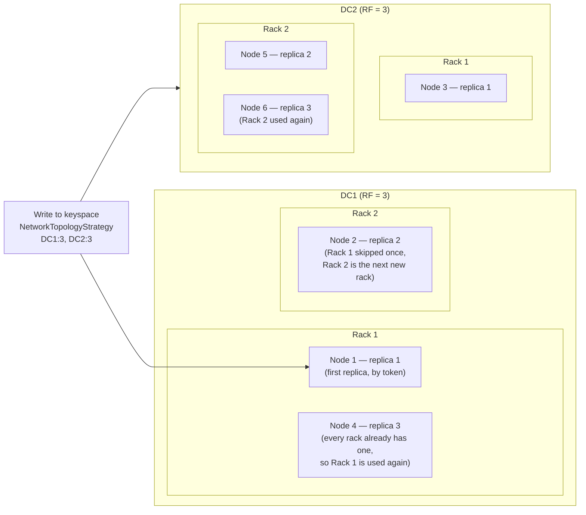

## Objective

Understand the planning decision that sits one layer above the token ring itself: not *how* Cassandra's peer-to-peer machinery works (covered in the sibling concept on gossip, snitches, tokens, and vnodes), but *how many* nodes to actually deploy, arranged across *which* data centers and racks, running on *what* hardware. The book frames this directly: "A successful deployment of Cassandra starts with good planning. You'll want to consider the topology of the cluster in data centers and racks, the amount of data that the cluster will hold, the network environment in which the cluster will be deployed, and the computing resources... on which the instances will run." This concept works through each of those four inputs — topology, capacity math, hardware, and network — as a single planning exercise, not four disconnected checklists.

## Use Cases

- Justifying a specific node count to stakeholders using the book's storage formula (`Tt = St × RFk × CSFt`) instead of an arbitrary round number.
- Deciding between `SimpleStrategy` and `NetworkTopologyStrategy` for a keyspace's replication — and recognizing that this choice is really a decision about which racks and data centers you're willing to lose without losing data.
- Explaining why a cluster that "has three racks" still loses availability on a rack failure if the replication factor and rack count don't line up correctly.
- Picking hardware for a new cluster: how many cores and how much RAM for dev versus production, and whether to use HDDs, SSDs, JBOD, or RAID.
- Reviewing a proposed architecture that puts a load balancer in front of Cassandra nodes, and explaining why that's specifically discouraged.
- Sizing seed nodes per data center before a real rollout — the book's "at least two seed nodes in each data center" best practice.
- Estimating disk headroom for compaction before a cluster hits its first major compaction under real load and starts running out of space.

## Deep Dive

### From "how the ring works" to "how many nodes should be on it"

The sibling concept on gossip, snitches, tokens, and vnodes explains the mechanism that makes a leaderless cluster function: consistent hashing assigns each partition key a deterministic owner via the token ring, snitches teach nodes their physical topology, and vnodes spread ownership across many small ranges per physical node. None of that machinery tells you how many physical nodes to actually buy or provision, or how to arrange them across racks and data centers. That's this concept: given a topology, a replication factor, and a data volume, how many nodes does the math actually require — and where should they physically sit?

### Data centers, racks, and the two replication strategies

The book's vocabulary for physical layout — "a rack is a logical set of nodes in close proximity to each other... a data center is a logical set of racks" — is the same vocabulary introduced in the sibling concept. What changes here is what that vocabulary is *for*: choosing a replication strategy that places replicas correctly across it.

**`SimpleStrategy`** ignores topology entirely: "the next N nodes on the ring are chosen to hold replicas, and the strategy has no notion of data centers." It's designed to place replicas in a single data center, "in a manner that is not aware of their placement on a data center rack." It works, and it's the fastest way to stand up a test cluster, but a rack failure can silently take out multiple replicas of the same data if the walk around the ring happens to land several replicas in the same rack.

**`NetworkTopologyStrategy`** is rack- and DC-aware by design. Its placement algorithm is precise: "the first replica is placed according to the selected partitioner. Subsequent replicas are placed by traversing the nodes in the ring, skipping nodes in the same rack until a node in another rack is found... Once a replica has been placed in each rack, the skipped nodes are used to place replicas until the replication factor has been met." That's the mechanism behind rack-awareness — it isn't a vague guarantee, it's a specific ring-walk rule that actively spreads replicas across racks first, and only doubles up on a rack once every rack already has at least one copy. The reasoning behind bothering with this at all: "nodes in the same rack (or similar physical grouping) often fail at the same time due to power, cooling, or network issues" — rack-awareness exists because rack failures are correlated failures, not independent ones.

`NetworkTopologyStrategy` also lets you set replication factor *per data center*, which is what enables genuinely multi-region durability:

```
cqlsh> ALTER KEYSPACE reservation
  WITH REPLICATION = {'class' : 'NetworkTopologyStrategy',
    'DC1' : '3', 'DC2' : '3'};
```

"The total number of replicas that will be stored is equal to the sum of the replication factors for each data center" — here, six total copies of every partition, three fully replicated in each of two regions, so losing an entire data center still leaves a fully quorum-capable copy of the data in the other.

### Rack-awareness as fault tolerance, made concrete

The diagram below traces the DC1:3, DC2:3 example above through the placement algorithm quoted earlier. Within DC1, the ring walk skips Rack 1 → Rack 2 → back to Rack 1 to satisfy RF=3 across only two racks; within DC2, the same rule plays out independently for its own RF=3.



The fault-tolerance payoff: because Rack 1 and Rack 2 in DC1 each hold at least one of the three DC1 replicas, losing either single rack in DC1 still leaves at least one live DC1 replica — and DC2's independent three replicas are untouched regardless. Losing all of DC1 (a full-site outage) still leaves a fully replicated, quorum-capable copy in DC2. This is the direct payoff of the ring-walk rule from the previous section — it isn't just "spread replicas around," it's specifically "never let one rack, or one data center, hold every copy."

### Sizing your cluster: turning data volume and RF into a node count

The book gives an explicit formula for the physical disk size a keyspace's tables actually require across the cluster:

> `Tt = St × RFk × CSFt`

Where `St` is the size of one copy of a table (computed from its column and row-count estimates), `RFk` is the keyspace's replication factor, and `CSFt` is a compaction-strategy factor: "2 for the `SizeTieredCompactionStrategy`. The worst-case scenario for this strategy is that there is a second copy of all the data required for a major compaction," versus "1.25 for other compaction strategies, which have been estimated to require 20% overhead during a major compaction."

Summing `Tt` across every table and keyspace gives the cluster's total required physical disk size. Two more guidelines turn that total into an actual node count: usable space per disk is roughly "90% of the disk size," and "historically, Cassandra operators have recommended 1 TB as a maximum data size per node" as "a good balance between compute costs and time to complete operations such as compaction or streaming data to a new or replaced node."

Worked illustration (numbers chosen for the example, not quoted from the book): a table holds 2 TB per copy, the keyspace's replication factor is 3, and it uses `LeveledCompactionStrategy` (`CSFt = 1.25`):

```
Tt = 2 TB × 3 × 1.25 = 7.5 TB   (total physical disk needed for this table, cluster-wide)
```

At the book's ~1 TB/node ceiling and 90% usable-space guideline, each node offers roughly 0.9 TB of usable capacity for this purpose, so:

```
7.5 TB ÷ 0.9 TB/node ≈ 8.3 → round up to 9 nodes
```

— before accounting for any other tables in the keyspace, other keyspaces sharing the cluster, or growth headroom over the cluster's planned lifetime. The replication factor is doing real multiplicative work here: this is exactly why "how many nodes do I need" cannot be answered from raw data volume alone — the same 2 TB table costs a cluster three times that in physical disk at RF=3, before compaction overhead is even applied.

### Hardware selection: the book's own guidance

With a node count in hand, the book gives concrete per-node hardware guidance that differs for development versus production:

- **Development**: "CPUs with at least two cores and 8 GB of memory." (Cassandra can run on much less — even a Raspberry Pi with 512 MB — "but this does require a significant performance-tuning effort.")
- **Production**: "CPUs with at least eight cores and at least 32 GB of memory. Having additional cores and memory tends to increase the throughput of both reads and writes."

Storage guidance follows the same production-first bias:

- **SSD vs. HDD**: "SSDs provide higher performance overall because of their support for low-latency random reads," even though Cassandra's append-only write pattern already suits spinning disks well for sequential writes.
- **Disk layout**: on spinning disks, keep data and commit log files on *separate* disks; on SSDs, they "can be stored on the same disk."
- **JBOD vs. RAID**: "Because Cassandra uses replication to achieve redundancy across multiple nodes, the RAID 0... configuration is considered sufficient. The JBOD approach provides the best overall performance and is a good choice if you have the ability to replace individual disks" — Cassandra's own replication is already doing the redundancy job RAID 1/5/6 would otherwise provide, so paying for it twice is wasted cost.
- **Avoid shared storage**: "avoid using storage area networks (SAN) and network-attached storage (NAS)... they consume additional network bandwidth in order to access the physical storage over the network, and they require additional I/O wait time."

### Network and firewall considerations

A few network-layer decisions round out the plan:

- **Throughput**: "make sure your network is sufficiently robust to handle the traffic associated with distributing data across multiple nodes. The recommended network bandwidth is 1 Gbps or higher."
- **Firewall rules**: correctly open the CQL native transport port, the internode `listen_address` port, and JMX, across every data center the cluster spans — and "it's recommended to run internode and client-to-node traffic on different interfaces."
- **Clock sync**: "the clocks on all nodes and clients should be synchronized using the Network Time Protocol (NTP)... Without synchronized clocks, writes from nodes or clients that lag behind can be lost" — Cassandra's last-write-wins conflict resolution depends on timestamps being trustworthy across the whole cluster.
- **Avoid load balancers**: "it's not recommended to use load balancers with Cassandra. Cassandra already provides its own mechanisms to balance network traffic between nodes, and the [drivers] spread client queries across replicas... putting a load balancer in front of your Cassandra nodes potentially introduces a single point of failure."
- **Cross-DC timeouts**: for a multi-datacenter cluster, "measure the latency between data centers and tune timeout values in the `cassandra.yaml` file accordingly" — a timeout tuned for same-rack latency will misfire constantly once quorum reads start crossing regions.
- **Seed nodes**: every node needs at least one seed as a bootstrapping contact point, and "it is considered a best practice to have at least two seed nodes in each data center" specifically so bootstrapping still works if one local seed is down during a network partition between data centers.

### Book vs today

> **The book's dev/production hardware split still matches current official guidance almost line for line.** Current Apache Cassandra hardware documentation confirms "a minimal production server requires at least 2 cores" and "at least 8GB of RAM," while "typical production servers have 8 or more cores" and "at least 32GB of RAM" — essentially unchanged from the book's numbers.
> **The book's ~1 TB/node ceiling is still the current baseline guideline, with an explicit SSD/CPU/RAM escape hatch.** Current DataStax capacity-planning documentation states: "Unless you are using SSDs with many CPUs and significant RAM, [we don't] recommend more than 1 TB per node" — the same number the book gives, now stated with the same caveat the book's own hardware section implies (better hardware, more headroom). The same documentation adds a disk-utilization target the book doesn't spell out explicitly: run at "50% to 80% capacity," reserving the rest for compaction and repair.
> **Cassandra 5.0's trie-based memtables improve memory efficiency, but don't rewrite the sizing formula.** Cassandra 5.0 (after this book's edition) introduced trie-indexed memtables and SSTables. The project's own announcement states they are "accepting up to 30% more data for the same memory allocation" and reduce garbage-collection overhead — a real efficiency gain for how much a memtable can hold before flushing, and for GC-driven latency spikes. But nothing in current official documentation ties this to a revised per-node disk-capacity number: the `Tt = St × RFk × CSFt` math and the ~1 TB/node (or higher, with better hardware) guideline are about steady-state disk usage and compaction overhead, which trie memtables don't change. Treat the 30%-more-per-memtable figure as a memory/GC efficiency improvement layered on top of the same disk-sizing math, not a replacement for it.

## Trade-offs

- **`SimpleStrategy` is faster to stand up and topology-blind by design.** It requires no rack or DC configuration at all, which is exactly right for a disposable test cluster and exactly wrong for production: a single rack outage can silently remove more than one replica of the same partition, because the strategy has no concept of "don't put two copies in the same failure domain."
- **`NetworkTopologyStrategy` buys fault isolation at the cost of a real topology-design decision up front.** Per-DC replication factors and rack-aware placement are what make multi-region durability meaningful, but they only work correctly if racks and data centers are configured accurately in the snitch — get that wrong, and the "fault tolerance" the strategy promises never actually materializes.
- **The 1 TB/node guideline trades operational agility for storage density.** A smaller per-node data footprint means faster compaction, faster streaming when bootstrapping or replacing a node, and shorter repair windows — all genuinely cheaper in *time*. Pushing well past 1 TB per node (even on strong SSD/CPU/RAM hardware) buys lower per-GB infrastructure cost but extends every one of those operational windows, often painfully, the day something actually needs to be repaired or replaced.
- **JBOD is the higher-performance choice precisely because it gives up RAID's redundancy — and that's fine, because replication already provides it.** Choosing RAID 0/JBOD only makes sense once you trust Cassandra's cross-node replication to be the actual redundancy layer; if replication factor or topology is misconfigured, JBOD's lack of per-node redundancy stops being a reasonable trade and starts being a real risk.
- **More replicas for cross-region latency and more nodes for replication-factor durability solve different problems, even though both add nodes.** Adding a replica in a customer's region to cut read latency is a performance investment; adding replicas to satisfy a keyspace's RF for durability is a durability investment. Conflating the two either under-provisions durability (assuming a latency replica "counts" toward RF safety it wasn't sized for) or over-provisions cost (treating every durability replica as if it also needs to be geographically close to end users).
- **Avoiding a load balancer in front of Cassandra removes a single point of failure — but only if the client-side driver is actually configured to spread load itself.** The recommendation assumes the DataStax/Apache driver's own load-balancing policy is doing the job a hardware load balancer would otherwise do; skipping the load balancer without confirming the driver's policy is properly configured just moves the single-point-of-failure risk instead of eliminating it.

## Documentation Links

- [Jeff Carpenter and Eben Hewitt, "Cassandra: The Definitive Guide", Revised 3rd Edition (O'Reilly, 2022) — Chapter 10, "Configuring and Deploying Cassandra" (Planning a Cluster Deployment through Network)](https://www.oreilly.com/library/view/cassandra-the-definitive/9781492097143/) — doc
- [Apache Cassandra Documentation — Hardware Choices](https://cassandra.apache.org/doc/latest/cassandra/managing/operating/hardware.html) — doc
- [DataStax Documentation — Capacity Planning and Hardware Selection](https://docs.datastax.com/en/planning/oss/capacity-planning.html) — doc
- [Apache Cassandra Documentation — Data Replication (SimpleStrategy and NetworkTopologyStrategy)](https://cassandra.apache.org/doc/latest/cassandra/architecture/dynamo.html) — doc
- [Apache Cassandra 5.0 — Trie Memtables and Trie-Indexed SSTables](https://cassandra.apache.org/_/blog/Apache-Cassandra-5.0-Features-Trie-Memtables-and-Trie-Indexed-SSTables.html) — doc
- [CASSANDRA-13701 — Lower default num_tokens](https://issues.apache.org/jira/browse/CASSANDRA-13701) — doc
