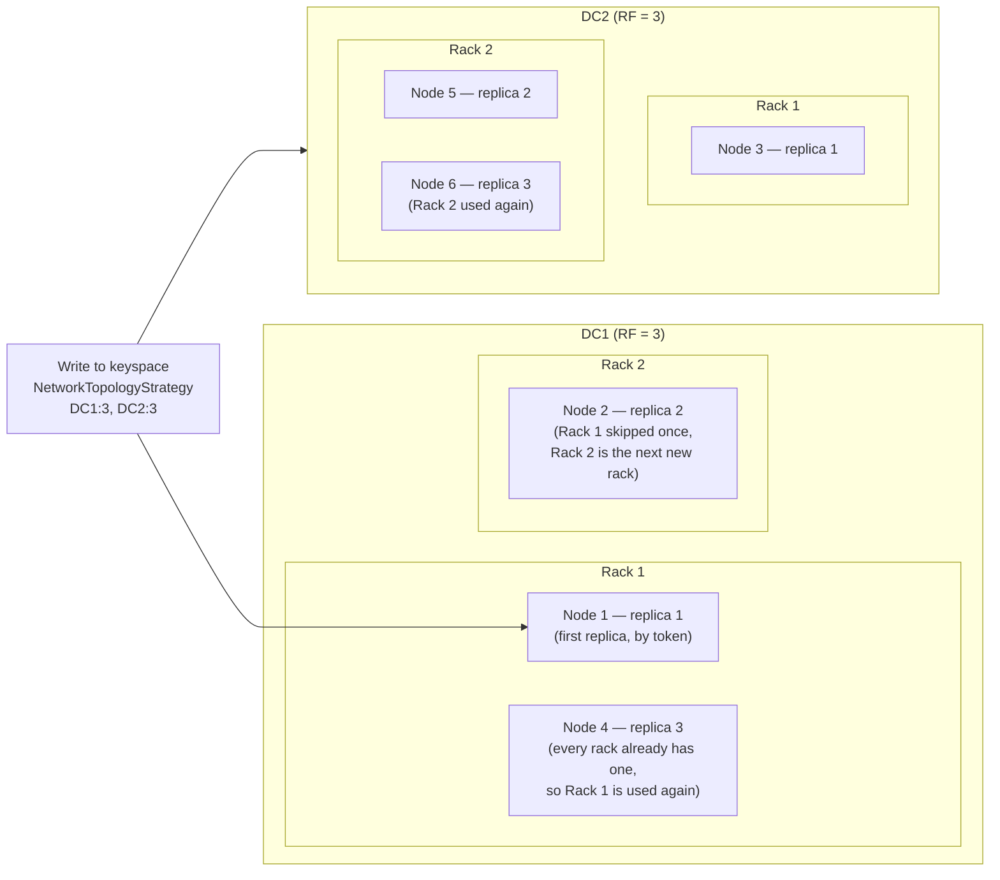

## Objective

Entender a decisão de planejamento que fica uma camada acima do próprio token ring: não *como* a maquinaria peer-to-peer do Cassandra funciona (coberto no conceito irmão sobre gossip, snitches, tokens e vnodes), mas *quantos* nós de fato implantar, organizados em *quais* data centers e racks, rodando em *que* hardware. O livro enquadra isso diretamente: "Uma implantação bem-sucedida do Cassandra começa com um bom planejamento. Você vai querer considerar a topologia do cluster em data centers e racks, a quantidade de dados que o cluster vai guardar, o ambiente de rede em que o cluster será implantado, e os recursos computacionais... nos quais as instâncias vão rodar." Este conceito percorre cada uma dessas quatro entradas (topologia, matemática de capacidade, hardware e rede) como um único exercício de planejamento, não quatro checklists desconectados.

## Use Cases

- Justificar um número específico de nós para stakeholders usando a fórmula de armazenamento do livro (`Tt = St × RFk × CSFt`) em vez de um número redondo arbitrário.
- Decidir entre `SimpleStrategy` e `NetworkTopologyStrategy` para a replicação de um keyspace, reconhecendo que essa escolha é, na verdade, uma decisão sobre quais racks e data centers você está disposto a perder sem perder dados.
- Explicar por que um cluster que "tem três racks" ainda perde disponibilidade em uma falha de rack se o fator de replicação e o número de racks não estiverem alinhados corretamente.
- Escolher hardware para um cluster novo: quantos núcleos e quanta RAM para desenvolvimento versus produção, e se usar HDDs, SSDs, JBOD ou RAID.
- Revisar uma arquitetura proposta que coloca um load balancer na frente dos nós Cassandra, e explicar por que isso é especificamente desaconselhado.
- Dimensionar seed nodes por data center antes de um rollout real, seguindo a boa prática do livro de "pelo menos dois seed nodes em cada data center".
- Estimar folga de disco para compaction antes de um cluster atingir sua primeira compaction grande sob carga real e começar a ficar sem espaço.

## Deep Dive

### De "como o anel funciona" para "quantos nós devem estar nele"

O conceito irmão sobre gossip, snitches, tokens e vnodes explica o mecanismo que faz um cluster sem líder funcionar: hashing consistente atribui a cada partition key um dono determinístico via o token ring, snitches ensinam aos nós sua topologia física, e vnodes espalham a posse entre muitos intervalos pequenos por nó físico. Nada disso diz quantos nós físicos de fato comprar ou provisionar, ou como organizá-los entre racks e data centers. Este conceito é exatamente isso: dada uma topologia, um fator de replicação e um volume de dados, quantos nós a matemática de fato exige, e onde eles devem ficar fisicamente?

### Data centers, racks e as duas estratégias de replicação

O vocabulário do livro para layout físico ("um rack é um conjunto lógico de nós próximos uns dos outros... um data center é um conjunto lógico de racks") é o mesmo vocabulário apresentado no conceito irmão. O que muda aqui é para *que* esse vocabulário serve: escolher uma estratégia de replicação que posiciona réplicas corretamente através dele.

**`SimpleStrategy`** ignora topologia completamente: "os próximos N nós no anel são escolhidos para guardar réplicas, e a estratégia não tem noção de data centers." Ela é projetada para posicionar réplicas em um único data center, "de uma forma que não tem consciência de seu posicionamento em um rack de data center." Ela funciona, e é a forma mais rápida de subir um cluster de teste, mas uma falha de rack pode silenciosamente derrubar múltiplas réplicas do mesmo dado se a caminhada pelo anel acabar colocando várias réplicas no mesmo rack.

**`NetworkTopologyStrategy`** tem consciência de rack e de data center por design. Seu algoritmo de posicionamento é preciso: "a primeira réplica é posicionada de acordo com o partitioner selecionado. As réplicas subsequentes são posicionadas percorrendo os nós no anel, pulando nós no mesmo rack até que um nó em outro rack seja encontrado... Uma vez que uma réplica tenha sido posicionada em cada rack, os nós pulados são usados para posicionar réplicas até que o fator de replicação seja atingido." Esse é o mecanismo por trás da consciência de rack: não é uma garantia vaga, é uma regra específica de caminhada pelo anel que ativamente espalha réplicas entre racks primeiro, e só duplica em um rack depois que todo rack já tem pelo menos uma cópia. O raciocínio por trás de se preocupar com isso: "nós no mesmo rack (ou agrupamento físico semelhante) frequentemente falham ao mesmo tempo devido a problemas de energia, refrigeração ou rede". A consciência de rack existe porque falhas de rack são falhas correlacionadas, não independentes.

`NetworkTopologyStrategy` também permite definir o fator de replicação *por data center*, o que é o que possibilita durabilidade genuinamente multirregional:

```
cqlsh> ALTER KEYSPACE reservation
  WITH REPLICATION = {'class' : 'NetworkTopologyStrategy',
    'DC1' : '3', 'DC2' : '3'};
```

"O número total de réplicas armazenadas é igual à soma dos fatores de replicação de cada data center": aqui, seis cópias totais de cada partição, três totalmente replicadas em cada uma de duas regiões, então perder um data center inteiro ainda deixa uma cópia dos dados totalmente capaz de quorum na outra.

### Consciência de rack como tolerância a falhas, de forma concreta

O diagrama abaixo percorre o exemplo DC1:3, DC2:3 acima através do algoritmo de posicionamento citado anteriormente. Dentro do DC1, a caminhada pelo anel pula Rack 1 → Rack 2 → volta para o Rack 1 para satisfazer RF=3 usando apenas dois racks; dentro do DC2, a mesma regra se desenrola de forma independente para seu próprio RF=3.



O ganho de tolerância a falhas: como o Rack 1 e o Rack 2 no DC1 guardam, cada um, pelo menos uma das três réplicas do DC1, perder qualquer um dos dois racks no DC1 ainda deixa pelo menos uma réplica do DC1 viva, e as três réplicas independentes do DC2 permanecem intocadas de qualquer forma. Perder o DC1 inteiro (uma interrupção completa do site) ainda deixa uma cópia totalmente replicada e capaz de quorum no DC2. Esse é o ganho direto da regra de caminhada pelo anel da seção anterior: não é apenas "espalhar réplicas por aí", é especificamente "nunca deixar um rack, ou um data center, guardar todas as cópias".

### Dimensionando seu cluster: transformando volume de dados e RF em número de nós

O livro dá uma fórmula explícita para o tamanho físico de disco que as tabelas de um keyspace de fato exigem em todo o cluster:

> `Tt = St × RFk × CSFt`

Onde `St` é o tamanho de uma cópia de uma tabela (calculado a partir de suas estimativas de coluna e número de linhas), `RFk` é o fator de replicação do keyspace, e `CSFt` é um fator de estratégia de compaction: "2 para o `SizeTieredCompactionStrategy`. O pior cenário para essa estratégia é ter uma segunda cópia de todos os dados necessários para uma compaction principal", contra "1,25 para outras estratégias de compaction, que foram estimadas em exigir 20% de overhead durante uma compaction principal."

Somar `Tt` em todas as tabelas e keyspaces dá o tamanho físico de disco total exigido pelo cluster. Mais duas diretrizes transformam esse total em um número real de nós: o espaço utilizável por disco é aproximadamente "90% do tamanho do disco", e "historicamente, operadores do Cassandra têm recomendado 1 TB como tamanho máximo de dados por nó" como "um bom equilíbrio entre custo computacional e tempo para completar operações como compaction ou streaming de dados para um nó novo ou substituído."

Ilustração trabalhada (números escolhidos para o exemplo, não citados do livro): uma tabela guarda 2 TB por cópia, o fator de replicação do keyspace é 3, e ela usa `LeveledCompactionStrategy` (`CSFt = 1.25`):

```
Tt = 2 TB × 3 × 1.25 = 7.5 TB   (total physical disk needed for this table, cluster-wide)
```

No teto de aproximadamente 1 TB/nó do livro e na diretriz de 90% de espaço utilizável, cada nó oferece aproximadamente 0,9 TB de capacidade utilizável para esse fim, então:

```
7.5 TB ÷ 0.9 TB/node ≈ 8.3 → round up to 9 nodes
```

Isso é antes de contabilizar quaisquer outras tabelas no keyspace, outros keyspaces compartilhando o cluster, ou folga de crescimento durante a vida planejada do cluster. O fator de replicação está fazendo um trabalho multiplicativo real aqui: é exatamente por isso que "quantos nós eu preciso" não pode ser respondido a partir do volume de dados bruto sozinho. A mesma tabela de 2 TB custa ao cluster três vezes isso em disco físico com RF=3, antes mesmo de aplicar o overhead de compaction.

### Seleção de hardware: a orientação do próprio livro

Com um número de nós em mãos, o livro dá orientação concreta de hardware por nó, que difere para desenvolvimento versus produção:

- **Desenvolvimento**: "CPUs com pelo menos dois núcleos e 8 GB de memória." (O Cassandra pode rodar com muito menos, até um Raspberry Pi com 512 MB, "mas isso exige um esforço significativo de ajuste de performance.")
- **Produção**: "CPUs com pelo menos oito núcleos e pelo menos 32 GB de memória. Ter núcleos e memória adicionais tende a aumentar o throughput tanto de leituras quanto de escritas."

A orientação de armazenamento segue o mesmo viés voltado para produção:

- **SSD vs. HDD**: "SSDs oferecem performance geral mais alta por causa do suporte a leituras aleatórias de baixa latência", ainda que o padrão de escrita append-only do Cassandra já se adapte bem a discos giratórios para escritas sequenciais.
- **Layout de disco**: em discos giratórios, mantenha os arquivos de dados e de commit log em discos *separados*; em SSDs, eles "podem ser armazenados no mesmo disco."
- **JBOD vs. RAID**: "como o Cassandra usa replicação para obter redundância entre múltiplos nós, a configuração RAID 0... é considerada suficiente. A abordagem JBOD oferece a melhor performance geral e é uma boa escolha se você tem a capacidade de substituir discos individuais". A própria replicação do Cassandra já está fazendo o trabalho de redundância que RAID 1/5/6 forneceria de outra forma, então pagar por isso duas vezes é custo desperdiçado.
- **Evite armazenamento compartilhado**: "evite usar storage area networks (SAN) e network-attached storage (NAS)... eles consomem largura de banda de rede adicional para acessar o armazenamento físico pela rede, e exigem tempo de espera de I/O adicional."

### Considerações de rede e firewall

Algumas decisões de camada de rede completam o plano:

- **Throughput**: "certifique-se de que sua rede é robusta o suficiente para lidar com o tráfego associado à distribuição de dados entre múltiplos nós. A largura de banda de rede recomendada é 1 Gbps ou mais."
- **Regras de firewall**: abra corretamente a porta de transporte nativo do CQL, a porta `listen_address` entre nós, e o JMX, em todo data center que o cluster abrange, e "é recomendado rodar o tráfego entre nós e o tráfego de cliente para nó em interfaces diferentes."
- **Sincronização de relógio**: "os relógios em todos os nós e clientes devem ser sincronizados usando o Network Time Protocol (NTP)... Sem relógios sincronizados, escritas de nós ou clientes atrasados podem ser perdidas". A resolução de conflito por last-write-wins do Cassandra depende de timestamps confiáveis em todo o cluster.
- **Evite load balancers**: "não é recomendado usar load balancers com o Cassandra. O Cassandra já fornece seus próprios mecanismos para balancear tráfego de rede entre nós, e os [drivers] espalham queries de cliente entre réplicas... colocar um load balancer na frente dos seus nós Cassandra potencialmente introduz um ponto único de falha."
- **Timeouts entre data centers**: para um cluster multi-datacenter, "meça a latência entre data centers e ajuste os valores de timeout no arquivo `cassandra.yaml` de acordo". Um timeout ajustado para latência dentro do mesmo rack vai falhar constantemente assim que leituras de quorum começarem a cruzar regiões.
- **Seed nodes**: todo nó precisa de pelo menos um seed como ponto de contato de inicialização, e "é considerada boa prática ter pelo menos dois seed nodes em cada data center", especificamente para que a inicialização ainda funcione se um seed local estiver fora do ar durante uma partição de rede entre data centers.

### Book vs today

> **A divisão de hardware desenvolvimento/produção do livro ainda corresponde à orientação oficial atual, quase linha por linha.** A documentação atual de hardware do Apache Cassandra confirma "um servidor de produção mínimo exige pelo menos 2 núcleos" e "pelo menos 8GB de RAM", enquanto "servidores de produção típicos têm 8 ou mais núcleos" e "pelo menos 32GB de RAM": essencialmente inalterado em relação aos números do livro.
> **O teto de aproximadamente 1 TB/nó do livro ainda é a diretriz base atual, com uma válvula de escape explícita para SSD/CPU/RAM.** A documentação atual de planejamento de capacidade da DataStax afirma: "a menos que você esteja usando SSDs com muitas CPUs e RAM significativa, [não recomendamos] mais de 1 TB por nó": o mesmo número que o livro dá, agora enunciado com a mesma ressalva que a própria seção de hardware do livro insinua (hardware melhor, mais folga). A mesma documentação acrescenta um alvo de utilização de disco que o livro não explicita: rodar entre "50% e 80% de capacidade", reservando o resto para compaction e repair.
> **As memtables baseadas em trie do Cassandra 5.0 melhoram a eficiência de memória, mas não reescrevem a fórmula de dimensionamento.** O Cassandra 5.0 (depois da edição deste livro) introduziu memtables e SSTables indexadas por trie. O próprio anúncio do projeto afirma que elas estão "aceitando até 30% mais dados para a mesma alocação de memória" e reduzem o overhead de garbage collection: um ganho real de eficiência para quanto uma memtable pode reter antes de descarregar (flush), e para picos de latência causados por GC. Mas nada na documentação oficial atual liga isso a um número revisado de capacidade de disco por nó: a matemática `Tt = St × RFk × CSFt` e a diretriz de aproximadamente 1 TB/nó (ou mais, com hardware melhor) são sobre uso de disco em regime permanente e overhead de compaction, que memtables trie não mudam. Trate o número de 30% a mais por memtable como uma melhoria de eficiência de memória/GC sobreposta à mesma matemática de dimensionamento de disco, não como um substituto dela.

## Trade-offs

- **`SimpleStrategy` é mais rápida de configurar e cega em relação à topologia por design.** Não exige nenhuma configuração de rack ou data center, o que é exatamente certo para um cluster de teste descartável e exatamente errado para produção: uma única interrupção de rack pode silenciosamente remover mais de uma réplica da mesma partição, porque a estratégia não tem conceito de "não coloque duas cópias no mesmo domínio de falha."
- **`NetworkTopologyStrategy` compra isolamento de falhas ao custo de uma decisão real de design de topologia feita antecipadamente.** Fatores de replicação por data center e posicionamento com reconhecimento de rack são o que torna a durabilidade multirregional significativa, mas só funcionam corretamente se racks e data centers estiverem configurados com precisão no snitch; erre isso, e a "tolerância a falhas" que a estratégia promete nunca se materializa de fato.
- **A diretriz de 1 TB/nó troca agilidade operacional por densidade de armazenamento.** Um espaço de dados menor por nó significa compaction mais rápida, streaming mais rápido ao inicializar ou substituir um nó, e janelas de repair mais curtas, tudo genuinamente mais barato em *tempo*. Ultrapassar bastante 1 TB por nó (mesmo em hardware forte de SSD/CPU/RAM) compra custo de infraestrutura por GB mais baixo, mas estende cada uma dessas janelas operacionais, muitas vezes dolorosamente, no dia em que algo realmente precisa ser reparado ou substituído.
- **JBOD é a escolha de maior performance justamente porque abre mão da redundância do RAID, e tudo bem, porque a replicação já a fornece.** Escolher RAID 0/JBOD só faz sentido depois que você confia que a replicação entre nós do Cassandra é a camada real de redundância; se o fator de replicação ou a topologia estiver mal configurado, a falta de redundância por nó do JBOD deixa de ser uma troca razoável e passa a ser um risco real.
- **Mais réplicas para latência entre regiões e mais nós para durabilidade do fator de replicação resolvem problemas diferentes, mesmo que ambos adicionem nós.** Adicionar uma réplica na região de um cliente para reduzir latência de leitura é um investimento de performance; adicionar réplicas para satisfazer o RF de um keyspace por durabilidade é um investimento de durabilidade. Confundir os dois ou subprovisiona durabilidade (assumindo que uma réplica de latência "conta" para a segurança do RF para a qual não foi dimensionada) ou superprovisiona custo (tratando toda réplica de durabilidade como se também precisasse estar geograficamente perto dos usuários finais).
- **Evitar um load balancer na frente do Cassandra remove um ponto único de falha, mas só se o driver do lado do cliente estiver de fato configurado para espalhar a carga sozinho.** A recomendação assume que a própria política de balanceamento de carga do driver DataStax/Apache está fazendo o trabalho que um load balancer de hardware faria de outra forma; pular o load balancer sem confirmar que a política do driver está configurada corretamente apenas move o risco de ponto único de falha, em vez de eliminá-lo.

## Documentation Links

- [Jeff Carpenter and Eben Hewitt, "Cassandra: The Definitive Guide", Revised 3rd Edition (O'Reilly, 2022), Chapter 10, "Configuring and Deploying Cassandra" (Planning a Cluster Deployment through Network)](https://www.oreilly.com/library/view/cassandra-the-definitive/9781492097143/) - doc
- [Apache Cassandra Documentation, Hardware Choices](https://cassandra.apache.org/doc/latest/cassandra/managing/operating/hardware.html) - doc
- [DataStax Documentation, Capacity Planning and Hardware Selection](https://docs.datastax.com/en/planning/oss/capacity-planning.html) - doc
- [Apache Cassandra Documentation, Data Replication (SimpleStrategy and NetworkTopologyStrategy)](https://cassandra.apache.org/doc/latest/cassandra/architecture/dynamo.html) - doc
- [Apache Cassandra 5.0, Trie Memtables and Trie-Indexed SSTables](https://cassandra.apache.org/_/blog/Apache-Cassandra-5.0-Features-Trie-Memtables-and-Trie-Indexed-SSTables.html) - doc
- [CASSANDRA-13701, Lower default num_tokens](https://issues.apache.org/jira/browse/CASSANDRA-13701) - doc
