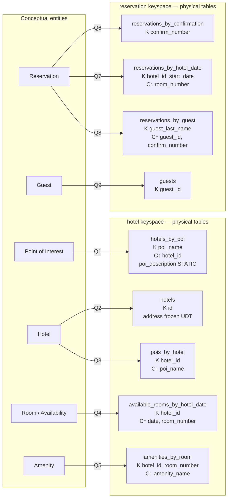

## Objective

Learn the data modeling methodology Cassandra actually requires — conceptual model, then the *queries*, then a logical model with one table per query, then a physical model with types and keys, then a sizing pass that can send you back to revise — and understand why that order is inverted from relational design. The chapter's opening quote from Patrick McFadin sets the stakes: "The data model you use is the most important factor in your success with Cassandra." More than any configuration or tuning, the data model is what determines application performance and cluster maintenance.

## Use Cases

- Designing a greenfield Cassandra schema and needing a defensible sequence rather than porting a normalized relational schema table-for-table — the failure mode the chapter exists to prevent.
- Explaining to a SQL-trained team why `hotels_by_poi` and `pois_by_hotel` are *two tables holding overlapping data*, not a normalization bug someone forgot to clean up.
- Running the requirements conversation from UI wireframes: the chapter's own advice is that "the user interface design for the application is often a great artifact to use to begin identifying queries."
- Reviewing an existing table that is trending toward a too-wide partition and deciding between adding a column to the partition key, bucketing, or restructuring — with an actual arithmetic estimate rather than a hunch.
- Estimating disk capacity for a new table before it ships, so cluster sizing is a calculation instead of a surprise.
- Auditing a design for the well-known anti-pattern of using Cassandra as a queue.

## Deep Dive

### Step 0 — the conceptual model still exists

The chapter does not skip the entity–relationship step; it just refuses to let the ERD become the schema. The worked domain is hotel reservations, chosen deliberately because it is "complex enough to show the various data structures and design patterns, but not something that will bog you down with details."

The conceptual domain includes:

- **Hotels**, each with a collection of **rooms**
- **Rates** and **availability** for those rooms
- **Guests** who stay in the hotels
- **Reservations** booked for guests
- **Points of interest** near a hotel — "parks, museums, shopping galleries, monuments, or other places near the hotel that guests might want to visit during their stay"

Both hotels and points of interest carry geolocation data so they can be placed on maps and used for distance calculations. The book draws this with the entity–relationship notation popularized by Peter Chen: rectangles for entities, ovals for attributes, underlined attributes for unique identifiers, diamonds for relationships, with connector multiplicity.

The relational rendering of that same domain (Figure 5-2 in the book) needs several **join tables** to realize the many-to-many relationships: hotels-to-points-of-interest, rooms-to-amenities, rooms-to-availability, and guests-to-rooms via a reservation. Those join tables are the tell — the book's line is that they "don't exist in the real world, and are a necessary side effect of the way relational models work."

### The six design differences the book names explicitly

Before any Cassandra table gets drawn, the chapter lists what changes relative to an RDBMS. Each one is a constraint that shapes the process that follows.

**No joins.** "You cannot perform joins in Cassandra. If you have designed a data model and find that you need something like a join, you'll have to either do the work on the client side, or create a denormalized second table that represents the join results for you." The second option is the preferred one. Client-side joins should be "a very rare case; you really want to duplicate (denormalize) the data instead."

**No referential integrity.** Cassandra has lightweight transactions and batches, but no concept of referential integrity across tables. Storing IDs that reference other entities is still a normal design requirement — but nothing enforces them, and operations like cascading deletes simply do not exist.

**Denormalization is the default, not the exception.** "In Cassandra, denormalization is, well, perfectly normal. It's not required if your data model is simple. But don't be afraid of it." The book grounds this by pointing out that relational shops denormalize too, for two reasons. One is performance — companies "simply can't get the performance they need when they have to do so many joins on years' worth of data, so they denormalize along the lines of known queries," which works but "goes against the grain of how relational databases are intended to be designed." The other is document retention: an invoice must preserve the customer and price data *as of the invoice date*, so pointing it at live customer and product tables would destroy the historical integrity of the document and "could violate audits, reports, or laws."

**Query-first design.** This is the center of the chapter. In relational modeling you represent the nouns as tables, assign primary and foreign keys, add join tables for many-to-many, and only then write queries — "the queries in the relational world are very much secondary. It is assumed that you can always get the data you want as long as you have your tables modeled properly." Cassandra inverts it: "you don't start with the data model; you start with the query model. Instead of modeling the data first and then writing queries, with Cassandra you model the queries and let the data be organized around them."

The book also answers the standard objection head-on rather than pretending it isn't one: detractors call query-first design "overly constraining," and the response is that thinking hard about your queries is no more unreasonable than thinking hard about your relational domain — "You may get it wrong, and then you'll have problems in either world. Or your query needs might change over time, and then you'll have to work to update your data set. But this is no different from defining the wrong tables, or needing additional tables, in an RDBMS."

**Designing for optimal storage.** In an RDBMS, on-disk layout is usually transparent to the modeler. Not here: Cassandra tables are each stored in separate files on disk, so related columns must be defined together in the same table. The governing goal is stated plainly — "minimize the number of partitions that must be searched in order to satisfy a given query. Because the partition is a unit of storage that does not get divided across nodes, a query that searches a single partition will typically yield the best performance."

**Sorting is a design decision, not a query option.** In SQL you change result order by editing `ORDER BY`, sorting on any list of columns. In Cassandra "the sort order available on queries is fixed, and is determined entirely by the selection of clustering columns you supply in the `CREATE TABLE` command." CQL's `ORDER BY` exists, but only to pick ascending or descending along the order the clustering columns already define. A new sort order is a schema change, not a query change.

### Step 1 — define the application queries

The chapter derives the query list from UI wireframes and stakeholder conversations, then numbers them so they can be referenced in diagrams (the book's own "NUMBER YOUR QUERIES" tip). The shopping queries:

| # | Query |
|---|---|
| Q1 | Find hotels near a given point of interest. |
| Q2 | Find information about a given hotel, such as its name and location. |
| Q3 | Find points of interest near a given hotel. |
| Q4 | Find an available room in a given date range. |
| Q5 | Find the rate and amenities for a room. |

Then the reservation queries — and the book is explicit that this second batch exists to fight a specific instinct: "Our natural tendency as data modelers would be to focus first on designing the tables to store reservation and guest records, and only then start thinking about the queries that would access them."

| # | Query |
|---|---|
| Q6 | Look up a reservation by confirmation number. |
| Q7 | Look up a reservation by hotel, date, and guest name. |
| Q8 | Look up all reservations by guest name. |
| Q9 | View guest details. |

Two points the chapter makes about this list are easy to skim past and shouldn't be. First, the queries are arranged into an application *workflow* (Figure 5-3), where "each step of the workflow accomplishes a task that 'unlocks' subsequent steps" — the hotels-near-POI screen teaches the application the hotel keys, which is exactly what Q2 needs as input. Query-first design only works if you also know what the client will *have in hand* at read time. Second, under "DESIGN QUERIES FOR ALL STAKEHOLDERS": Q8 and Q9 exist because hotel staff and analytics teams are users too, not just customers.

### Step 2 — logical data model

The rule is mechanical: **one table per query**. Naming convention: "identify the primary entity type for which you are querying, and use that to start the entity name. If you are querying by attributes of other related entities, you append those to the table name, separated with `_by_`" — hence `hotels_by_poi`. Then add partition key columns from the query's required attributes, and clustering columns "in order to guarantee uniqueness and support desired sort ordering." Finally, add the remaining attributes the query needs, and mark a column `static` if it is the same for every row in the partition.

The book uses **Chebotko diagrams** (a notation popularized by Artem Chebotko) for this: each table shown with its columns, `K` marking partition key columns, `C↑` / `C↓` marking clustering columns and their direction, and lines connecting each table to the query it serves.

Walking the hotel tables, with the reasoning the book gives for each:

- **`hotels_by_poi` (Q1)** — searching by a named point of interest is "a clue that the point of interest should be a part of the primary key." But more than one hotel can be near a POI, so `hotel_id` is added as a clustering column to make each row unique. `poi_description` is included because the user benefits from seeing it next to the hotel results, and it is marked **static** since the description is identical for all rows in the partition.
- **`hotels` (Q2)** — one option was to jam every hotel attribute into `hotels_by_poi`, but the model adds "only those attributes required by your application workflow." Because Q1 already handed the application the `hotel_id`, Q2 can look up by that key alone. The book notes an equally valid alternative: store a set of `poi_names` on the `hotels` table — "You'll learn through experience which approach is best for your application."
- **`pois_by_hotel` (Q3)** — "just a reverse of Q1." Same relationship, opposite access direction, therefore a second table. This is the single clearest illustration of the whole methodology.
- **`available_rooms_by_hotel_date` (Q4)** — the query spans a start and end date, so date must be a **clustering** column (range queries need clustering columns). `hotel_id` is the partition key so all of a hotel's room data lands on one partition. The book flags this as the **wide partition pattern**: "group multiple related rows in a partition in order to support fast access to multiple rows within the partition in a single query."
- **`amenities_by_room` (Q5)** — rounds out shopping, letting the user see amenities for a room that is available on the desired dates.

Notice what is *absent*: there are no dedicated `rooms` or `amenities` tables the way the relational design had, "because your workflow didn't identify any queries requiring this direct access."

The reservation side is where denormalization becomes unmistakable — "the same data appears in multiple tables, with differing keys." `reservations_by_confirmation` serves the confirmation-number lookup; `reservations_by_guest` covers the guest who has lost their confirmation number (with `guest_id` added as a clustering column "because the guest name might not be unique"); `reservations_by_hotel_date` lets hotel staff see upcoming reservations by date to spot sold-out and undersold nights; and a `guests` table provides one place to store guest data, with its own unique identifier "as it is not uncommon for guests to have the same name."

> One small inconsistency in the source worth knowing about if you read the chapter: the numbered query list assigns Q7 to "look up a reservation by hotel, date, and guest name" and Q8 to "look up all reservations by guest name," but the prose walkthrough and the `WITH comment` strings in the final CQL swap them — `reservations_by_hotel_date` is commented `'Q7. Find reservations by hotel and date'` and `reservations_by_guest` is commented `'Q8. Find reservations by guest name'`. The tables are right either way; only the labels drift. The Apache Cassandra documentation, which reproduces this same chapter, carries the same drift.

### Step 3 — physical data model

"Once you have a logical data model defined, creating the physical model is a relatively simple process." You walk each logical table and assign a CQL type to every column, including collections and user-defined types, and you may discover additional UDTs worth extracting.

The concrete decisions in the hotel model:

- Two keyspaces, `hotel` (hotel and availability data) and `reservation` (reservation and guest data), to separate concerns. "In a real system, you might divide the tables across even more keyspaces."
- `hotel_id` is `text`, not `uuid` — a deliberate readability choice for the book, justified by a real industry convention of short property codes like "AZ123" or "NY229," while acknowledging those "are not necessarily globally unique."
- Phone number is `text`, "as there is considerable variance in the formatting of numbers between countries."
- An `address` user-defined type groups the non-key address columns. UDTs are "frequently used to create logical groupings of nonprimary key columns," and can be nested in collections. Critically: **a UDT's scope is the keyspace it is defined in**, so `address` has to be declared *again* in the `reservation` keyspace to be usable there.
- `guest_id` is modeled as a `uuid` in every reservation table.

Chebotko *physical* diagrams extend the logical notation with a type per column, the containing keyspace, and visual cues for collections, UDTs, static columns, and secondary index columns.

### The logical-to-physical picture



The arrows are the whole point: one entity fans out into several tables, one per access direction, and the arrow label — the query — is what justifies each table's existence. `hotels_by_poi` and `pois_by_hotel` hold overlapping data about the same relationship; `reservations_by_confirmation`, `reservations_by_hotel_date`, and `reservations_by_guest` are three copies of the same reservation, keyed three ways.

### Step 4 — evaluate and refine (the arithmetic)

**Calculating partition size.** Partition size is measured in *cells* (values), not rows. "Cassandra's hard limit is two billion cells per partition, but you'll likely run into performance issues before reaching that limit. The recommended size of a partition is not more than 100,000 cells."

The formula:

```
Nv = Nr (Nc − Npk − Ns) + Ns
```

Where `Nv` is cells in the partition, `Nr` rows, `Nc` total columns, `Npk` primary key columns, and `Ns` static columns. Applied to `available_rooms_by_hotel_date`: four columns total, three of them primary key columns, no static columns, so `Nv = Nr(4 − 3 − 0) + 0 = Nr` — cells equal rows for this table.

Now the row estimate, driven by application assumptions: two years of inventory, 5,000 hotels, an average of 100 rooms each. Since there is one partition per hotel:

```
Nr = 100 rooms/hotel × 730 days = 73,000 rows
```

The verdict is a qualified pass: "This relatively small number of rows per partition is not an issue, but the number of cells may be. If you start storing more dates of inventory, or don't manage the size of your inventory well using TTL, you could start having issues." And the sidebar warning — **estimate for the worst case**, not the average, because "these sorts of predictions have a way of coming true in successful systems."

**Calculating size on disk.** The second formula sums four terms: partition key column sizes, static column sizes, the per-row cost of clustering plus regular columns multiplied by row count, and per-cell metadata (timestamps and such) estimated at **8 bytes per cell**. Worked on the same table:

| Term | Contents | Result |
|---|---|---|
| Partition key columns | `hotel_id` as `text`, 5-character codes | 5 bytes (book's total: 16 bytes) |
| Static columns | none | 0 bytes |
| Rows × (clustering + regular) | `date` 4 B + `room_number` `smallint` 2 B + `is_available` `boolean` 1 B = 7 B, × 73,000 rows | 511,000 bytes (0.51 MB) |
| Cell metadata | 73,000 cells × 8 bytes | 0.58 MB |
| **Total** | | **≈ 1.1 MB** |

"Remembering that the partition must be able to fit on a single node, it looks like your table design will not put a lot of strain on your disk storage." Two caveats the book attaches: SSTable compression reduces this, and the estimate counts a **single replica** — multiply by partition count and by the keyspace's replication factor to get real capacity.

**Breaking up large partitions.** When sizing reveals a partition that is too large in cells, on disk, or both, "the technique for splitting a large partition is straightforward: add an additional column to the partition key. In most cases, moving one of the existing columns into the partition key will be sufficient." Three concrete options for the availability table, with the book's own assessment of each:

1. **Move `date` into the partition key.** Each partition becomes one hotel on one date. Partitions get much smaller — "perhaps too small, as the data for consecutive days will likely be on separate nodes," and multi-day queries now have to hit multiple partitions.
2. **Bucketing** — add a `month` column (as an integer) to the partition key. "While the `month` column is partially duplicative of the date, it provides a nice way of grouping related data in a partition that will not get too large." This is the recommended middle ground.
3. **Move `room_id` into the partition key**, keeping a wide design where each partition is one room across all dates. Rejected here, because no identified query searches availability of a specific room.

The third option being rejected *on the basis of the query list* is the methodology closing its own loop.

### Step 5 — define the database schema

The final CQL, with each table carrying a `comment` documenting the query it exists to serve:

```sql
CREATE KEYSPACE hotel
    WITH replication = {'class': 'SimpleStrategy', 'replication_factor' : 3};

CREATE TYPE hotel.address (
    street text,
    city text,
    state_or_province text,
    postal_code text,
    country text
);

CREATE TABLE hotel.hotels_by_poi (
    poi_name text,
    poi_description text STATIC,
    hotel_id text,
    name text,
    phone text,
    address frozen<address>,
    PRIMARY KEY ((poi_name), hotel_id)
) WITH comment = 'Q1. Find hotels near given poi'
AND CLUSTERING ORDER BY (hotel_id ASC);

CREATE TABLE hotel.hotels (
    id text PRIMARY KEY,
    name text,
    phone text,
    address frozen<address>,
    pois set<text>
) WITH comment = 'Q2. Find information about a hotel';

CREATE TABLE hotel.pois_by_hotel (
    poi_name text,
    hotel_id text,
    description text,
    PRIMARY KEY ((hotel_id), poi_name)
) WITH comment = 'Q3. Find pois near a hotel';

CREATE TABLE hotel.available_rooms_by_hotel_date (
    hotel_id text,
    date date,
    room_number smallint,
    is_available boolean,
    PRIMARY KEY ((hotel_id), date, room_number)
) WITH comment = 'Q4. Find available rooms by hotel / date';

CREATE TABLE hotel.amenities_by_room (
    hotel_id text,
    room_number smallint,
    amenity_name text,
    description text,
    PRIMARY KEY ((hotel_id, room_number), amenity_name)
) WITH comment = 'Q5. Find amenities for a room';
```

And the reservation keyspace, which is where the denormalization is visible in code — the same reservation attributes appearing three times under three different `PRIMARY KEY` shapes:

```sql
CREATE KEYSPACE reservation
    WITH replication = {'class': 'SimpleStrategy', 'replication_factor' : 3};

CREATE TYPE reservation.address (
    street text, city text,
    state_or_province text,
    postal_code text,
    country text
);

CREATE TABLE reservation.reservations_by_confirmation (
    confirm_number text,
    hotel_id text,
    start_date date,
    end_date date,
    room_number smallint,
    guest_id uuid,
    PRIMARY KEY (confirm_number)
) WITH comment = 'Q6. Find reservations by confirmation number';

CREATE TABLE reservation.reservations_by_hotel_date (
    hotel_id text,
    start_date date,
    room_number smallint,
    end_date date,
    confirm_number text,
    guest_id uuid,
    PRIMARY KEY ((hotel_id, start_date), room_number)
) WITH comment = 'Q7. Find reservations by hotel and date';

CREATE TABLE reservation.reservations_by_guest (
    guest_last_name text,
    guest_id uuid,
    confirm_number text,
    hotel_id text,
    start_date date,
    end_date date,
    room_number smallint,
    PRIMARY KEY ((guest_last_name), guest_id, confirm_number)
) WITH comment = 'Q8. Find reservations by guest name';

CREATE TABLE reservation.guests (
    guest_id uuid PRIMARY KEY,
    first_name text,
    last_name text,
    title text,
    emails set<text>,
    phone_numbers list<text>,
    addresses map<text, frozen<address>>
) WITH comment = 'Q9. Find guest by ID';
```

Two style rules the book attaches to this schema. **Identify partition keys explicitly** — write `PRIMARY KEY ((poi_name), hotel_id)` with the inner parentheses even when the partition key is a single column, because "it makes your selection of partition key more explicit to others reading your CQL." And **make your primary keys unique**, or "you run the risk of accidentally overwriting data" — there is no unique constraint and no insert-versus-update distinction to save you.

### Patterns and anti-patterns

- **Wide partition pattern** — already used in `available_rooms_by_hotel_date`: group multiple related rows in a partition for fast multi-row access in one query.
- **Time series pattern** — an extension of the wide partition pattern where measurements at specific time intervals are stored in a wide partition with measurement time as part of the partition key. Common in business analysis, sensor data, and scientific experiments. The book extends it beyond measurements with a banking example: storing each customer's balance in a row invites read/write contention and tempts you to wrap writes in a transaction; a time-series design instead "would store each transaction as a timestamped row and leave the work of calculating the current balance to the application."
- **Queue anti-pattern** — items timestamped in a wide partition, appended at the end, read from the front, deleted after reading. It looks like the time series pattern, but "the deleted items are now tombstones that Cassandra must scan past in order to read from the front of the queue. Over time, a growing number of tombstones begins to degrade read performance." The generalization is the useful part: "any design that relies on the deletion of data is potentially a poorly performing design."

### Tooling

The book names four options: **Hackolade** (supports CQL's partition keys, clustering columns, collections and UDTs, and can draw Chebotko diagrams), the **Kashlev Data Modeler** (automates this exact methodology end to end — access-pattern identification, conceptual/logical/physical modeling, and schema generation, with reusable model patterns), **DataStax DevCenter** (schema management, query execution, CQL syntax highlighting and completion, query tracing — already noted in the book as "no longer actively supported"), and **CQL plug-ins** for IntelliJ IDEA and Apache NetBeans. The attached warning is still the sharpest advice in the section: some tools claim Cassandra support but reach it through a JDBC/ODBC driver and "interact with Cassandra as if it were a relational database with SQL support" — which will quietly push you back toward exactly the design habits this chapter is trying to break.

### Book vs. today

> **The methodology is not just current — it *is* the official documentation.** The Apache Cassandra docs' "Data Modeling" section reproduces this chapter almost verbatim, hotel example and all: the same Q1–Q9 list (including the same Q7/Q8 label drift), the same `Nv = Nr(Nc − Npk − Ns) + Ns` formula, the same two-billion-cell hard limit, the same 73,000-row calculation, and the same bucketing advice. This is a case of "nothing changed" — treat the chapter as the canonical process, not as a dated snapshot.

> **Materialized views are still experimental, five-plus years on.** The chapter mentions materialized views (Cassandra 3.0) as the server-side alternative to hand-managing denormalized tables, and defers examples to Chapter 7. What has happened since is *not* graduation: MVs remain marked experimental and are **disabled by default** in Cassandra 4.0 and later, behind a `cassandra.yaml` flag (`enable_materialized_views` in 4.0, renamed `materialized_views_enabled` in 4.1's YAML naming cleanup), with a warning logged on creation. The book's decision to model reservations with manual denormalization first was the conservative call, and it aged well — plan on owning the denormalization yourself.

> **Cassandra 5.0's Storage Attached Indexes soften "one table per query" — but do not repeal it.** SAI (`CREATE CUSTOM INDEX ... USING 'StorageAttachedIndex'`) postdates the revised 3rd edition, which targets Cassandra 4.0. It is a genuinely better secondary index — tighter storage-engine integration, faster writes and far less disk than the older secondary index or DSE Search implementations, and support for multiple indexed columns on one table — and it means some *secondary* access patterns can now be served by an index on the base table rather than by a whole new denormalized table. The important caveat: it changes the cost/benefit at the margin, not the philosophy. A query that doesn't restrict the partition key still fans out across the cluster, and if you need single-digit-millisecond response times under load, the query-shaped table is still the answer. Use SAI to trim the tail of low-traffic query variants, not to skip steps 1 and 2.

> **`SimpleStrategy` in the book's `CREATE KEYSPACE` is a teaching simplification.** The book uses `{'class': 'SimpleStrategy', 'replication_factor': 3}` to keep the example readable. It is still valid CQL, but it ignores datacenter and rack topology, and current guidance is `NetworkTopologyStrategy` for anything beyond a single-DC development cluster. Nothing about the data model changes; only the keyspace's replication clause does.

> **The tool list has thinned.** Hackolade and the Kashlev Data Modeler are still around. DataStax DevCenter was already unsupported when the book shipped and is effectively gone now — the Apache docs still list it, which is worth knowing before you go hunting for a download. `cqlsh` plus a CQL script under version control remains the boring, durable answer.

## Trade-offs

- **A genuinely new access pattern discovered later is usually a new table, not a new index — and that means a backfill.** This is the exact same cost profile as DynamoDB's, and worth naming as the parallel it is: in SQL, "we now need to look reservations up by email" is one `CREATE INDEX` over a column that already exists. In Cassandra it is a new query-shaped table plus a migration that replays or re-derives every existing reservation into it, written and run by you, against live data. Cassandra 5.0's SAI narrows this gap for some cases, but the book's own framing is the honest one — it is "no different from defining the wrong tables, or needing additional tables, in an RDBMS," except that in an RDBMS the fix is frequently a DDL statement and here it is frequently a data migration. Budget for it as a migration.
- **Denormalizing into several query-shaped tables makes consistency *your* problem, permanently.** Three tables hold the same reservation keyed three ways. There is no foreign key, no cascading delete, and no cross-table transaction that keeps them in step — batches give you atomicity within a partition and logged batches give you eventual atomicity across partitions at a real latency cost, but neither is the multi-table ACID transaction the relational instinct expects. Every write path that touches a reservation must touch all three tables, every deletion must find all three, and any bug that updates two of three leaves a silent divergence with nothing to detect it. Materialized views were supposed to be the answer to this and are still experimental and off by default, so this stays a hand-written, hand-tested application concern.
- **Partition size has operational ceilings you must estimate before shipping, and the estimate is only as good as your assumptions.** Two billion cells is the hard limit; 100,000 cells is the recommendation; the interesting region is everything in between, where things degrade rather than fail. The availability table is fine at 73,000 rows *given the stated assumptions* — 5,000 hotels, 100 rooms, two years of inventory — and the book immediately warns that storing more dates, or failing to manage inventory with TTL, breaks that. The worst-case advice matters because a successful system is precisely the one whose optimistic assumptions get exceeded, and a partition cannot be split after the fact without a schema change and a migration.
- **Fixing an over-wide partition trades one problem for another.** Adding `date` to the partition key shrinks partitions but scatters consecutive days across nodes, so a multi-day availability query now touches many partitions — directly contradicting the "minimize partitions searched" goal. Bucketing by month is the compromise, and it is a compromise: you carry a partially-redundant column, you have to compute it correctly on every write, and a query spanning a month boundary still touches two partitions. There is no setting that makes this go away; the partition key is the trade-off knob and it always costs something on the other side.
- **Sorting being a design decision means every new sort order is a schema change.** Clustering columns fix the order at `CREATE TABLE` time. A product request as small as "sort the guest's reservations by check-in date instead of confirmation number" is not a query edit — it is a new table with different clustering columns, plus the backfill and the consistency obligation that comes with it.
- **Query-first design presumes you know the queries, and in discovery-phase work you often don't.** The book's defense — that you'd have to think hard about the domain in a relational design too — is fair but not symmetric: a normalized relational schema genuinely lets you defer query decisions and answer unanticipated questions with ad-hoc SQL, at the price of joins that don't scale horizontally. Cassandra makes you pay that decision at design time and gives you the horizontal scale in return. When the access patterns truly aren't knowable yet, that's a reason to question whether Cassandra fits *this* service yet, not a reason to skip steps 1 and 2 and hope.
- **The `_by_` naming convention and per-table `comment` strings are the only documentation of intent, so they're load-bearing.** `pois_by_hotel` versus `hotels_by_poi` is the entire explanation for why two tables hold the same relationship. Drop the `WITH comment = 'Q3...'` strings, or let the query list drift out of sync with the schema, and the next engineer sees redundant tables with no record of which query justified which — and the most likely reaction is a well-meaning attempt to consolidate them. The book's own numbered-query artifact isn't a nice-to-have; it's the map.
- **Modeling only for identified queries produces tables that look incomplete, and sometimes are.** There is no `rooms` table and no `amenities` table because no query needed one. That is correct by the methodology, and it is also genuinely fragile: the moment someone needs a room record for its own sake, the data exists only as rows scattered across `available_rooms_by_hotel_date` and `amenities_by_room`. The `guests` table is the counterexample the book gives — a general entity table kept because guest data is likely owned by a separate customer management application. Knowing which of your entities deserve that treatment is judgment the process doesn't supply.

## Documentation Links

- [Jeff Carpenter and Eben Hewitt, "Cassandra: The Definitive Guide", Revised 3rd Edition (O'Reilly, 2022) — Chapter 5, "Data Modeling", p. 130-162](https://www.oreilly.com/library/view/cassandra-the-definitive/9781492097143/) — doc
- [Apache Cassandra Documentation — Data Modeling](https://cassandra.apache.org/doc/latest/cassandra/data_modeling/index.html) — doc
- [Apache Cassandra Documentation — Evaluating and Refining Data Models (partition size and disk size formulas)](https://cassandra.apache.org/doc/latest/cassandra/developing/data-modeling/data-modeling_refining.html) — doc
- [Apache Cassandra Documentation — Defining Application Queries](https://cassandra.apache.org/doc/latest/cassandra/developing/data-modeling/data-modeling_queries.html) — doc
- [Apache Cassandra Documentation — Cassandra Data Modeling Tools](https://cassandra.apache.org/doc/latest/cassandra/developing/data-modeling/data-modeling_tools.html) — doc
- [Apache Cassandra Documentation — Partitions](https://cassandra.apache.org/doc/latest/cassandra/architecture/dynamo.html#partitioning) — doc
- [Apache Cassandra Documentation — CREATE TABLE (primary keys, clustering order, static columns)](https://cassandra.apache.org/doc/latest/cassandra/developing/cql/ddl.html#create-table) — doc
- [Apache Cassandra Blog — Apache Cassandra 5.0 Features: Storage Attached Indexes](https://cassandra.apache.org/_/blog/Apache-Cassandra-5.0-Features-Storage-Attached-Indexes.html) — doc
