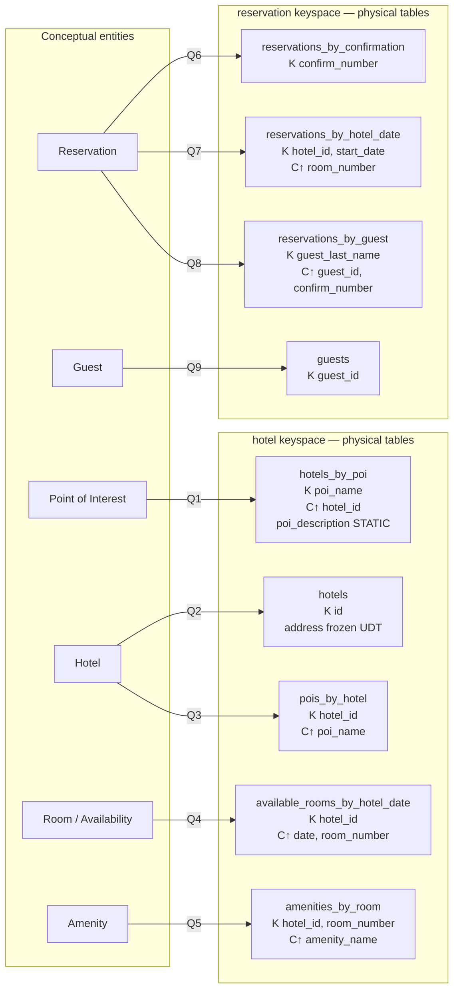

## Objective

Aprender a metodologia de modelagem de dados que o Cassandra de fato exige (modelo conceitual, depois as *queries*, depois um modelo lógico com uma tabela por query, depois um modelo físico com tipos e chaves, depois uma passagem de dimensionamento que pode te mandar de volta para revisar) e entender por que essa ordem é invertida em relação ao design relacional. A citação de abertura do capítulo, de Patrick McFadin, define o que está em jogo: "O modelo de dados que você usa é o fator mais importante para seu sucesso com o Cassandra." Mais do que qualquer configuração ou ajuste fino, o modelo de dados é o que determina a performance da aplicação e a manutenção do cluster.

## Use Cases

- Desenhar um schema Cassandra do zero e precisar de uma sequência defensável, em vez de portar um schema relacional normalizado tabela por tabela: o modo de falha que este capítulo existe para prevenir.
- Explicar a um time treinado em SQL por que `hotels_by_poi` e `pois_by_hotel` são *duas tabelas guardando dados sobrepostos*, não um bug de normalização que alguém esqueceu de limpar.
- Conduzir a conversa de requisitos a partir de wireframes de UI: o próprio conselho do livro é que "o design da interface do usuário da aplicação é frequentemente um ótimo artefato para começar a identificar queries."
- Revisar uma tabela existente que está tendendo a uma partição excessivamente larga, e decidir entre adicionar uma coluna à partition key, bucketing, ou reestruturar, com uma estimativa aritmética real, em vez de um palpite.
- Estimar capacidade de disco para uma tabela nova antes de ela ir para produção, para que o dimensionamento do cluster seja um cálculo, não uma surpresa.
- Auditar um design em busca do antipadrão conhecido de usar o Cassandra como uma fila.

## Deep Dive

### Passo 0: o modelo conceitual ainda existe

O capítulo não pula a etapa entidade-relacionamento; ele só se recusa a deixar o DER se tornar o schema. O domínio trabalhado é reservas de hotel, escolhido deliberadamente por ser "complexo o suficiente para mostrar as várias estruturas de dados e padrões de design, mas não algo que vá te atolar em detalhes."

O domínio conceitual inclui:

- **Hotéis**, cada um com uma coleção de **quartos**
- **Tarifas** e **disponibilidade** para esses quartos
- **Hóspedes** que ficam nos hotéis
- **Reservas** feitas para hóspedes
- **Pontos de interesse** próximos a um hotel, "parques, museus, galerias de compras, monumentos, ou outros lugares perto do hotel que os hóspedes possam querer visitar durante a estadia"

Tanto hotéis quanto pontos de interesse carregam dados de geolocalização, para que possam ser colocados em mapas e usados em cálculos de distância. O livro desenha isso com a notação entidade-relacionamento popularizada por Peter Chen: retângulos para entidades, ovais para atributos, atributos sublinhados para identificadores únicos, losangos para relacionamentos, com multiplicidade nos conectores.

A representação relacional desse mesmo domínio (Figura 5-2 no livro) precisa de várias **tabelas de junção** para viabilizar os relacionamentos muitos-para-muitos: hotéis-para-pontos-de-interesse, quartos-para-comodidades, quartos-para-disponibilidade, e hóspedes-para-quartos via uma reserva. Essas tabelas de junção são o sinal revelador: a frase do livro é que elas "não existem no mundo real, e são um efeito colateral necessário da forma como modelos relacionais funcionam."

### As seis diferenças de design que o livro nomeia explicitamente

Antes de qualquer tabela Cassandra ser desenhada, o capítulo lista o que muda em relação a um RDBMS. Cada uma é uma restrição que molda o processo que se segue.

**Sem joins.** "Você não pode fazer joins no Cassandra. Se você desenhou um modelo de dados e percebe que precisa de algo como um join, você vai ter que fazer o trabalho do lado do cliente, ou criar uma segunda tabela desnormalizada que representa os resultados do join para você." A segunda opção é a preferida. Joins do lado do cliente devem ser "um caso muito raro; você realmente quer duplicar (desnormalizar) os dados em vez disso."

**Sem integridade referencial.** O Cassandra tem transações leves e batches, mas nenhum conceito de integridade referencial entre tabelas. Armazenar IDs que referenciam outras entidades ainda é um requisito de design normal, mas nada os reforça, e operações como deleções em cascata simplesmente não existem.

**Desnormalização é o padrão, não a exceção.** "No Cassandra, desnormalização é, bem, perfeitamente normal. Não é obrigatória se seu modelo de dados é simples. Mas não tenha medo dela." O livro fundamenta isso apontando que empresas do mundo relacional também desnormalizam, por duas razões. Uma é performance: empresas "simplesmente não conseguem a performance de que precisam quando têm que fazer tantos joins em anos de dados, então elas desnormalizam seguindo as linhas de queries conhecidas", o que funciona, mas "vai contra a corrente de como bancos de dados relacionais são pensados para serem projetados." A outra é retenção de documento: uma fatura precisa preservar os dados do cliente e do preço *na data da fatura*, então apontá-la para tabelas de cliente e produto ao vivo destruiria a integridade histórica do documento e "poderia violar auditorias, relatórios, ou leis."

**Design orientado a query.** Este é o centro do capítulo. Na modelagem relacional você representa os substantivos como tabelas, atribui chaves primárias e estrangeiras, adiciona tabelas de junção para muitos-para-muitos, e só então escreve queries: "as queries no mundo relacional são muito secundárias. Assume-se que você sempre pode obter os dados que quer, desde que tenha suas tabelas modeladas corretamente." O Cassandra inverte isso: "você não começa com o modelo de dados; você começa com o modelo de query. Em vez de modelar os dados primeiro e depois escrever queries, com o Cassandra você modela as queries e deixa os dados serem organizados em torno delas."

O livro também responde diretamente à objeção padrão, em vez de fingir que ela não existe: críticos chamam o design orientado a query de "excessivamente restritivo", e a resposta é que pensar bastante sobre suas queries não é mais absurdo do que pensar bastante sobre seu domínio relacional: "você pode errar, e então vai ter problemas em qualquer um dos dois mundos. Ou suas necessidades de query podem mudar com o tempo, e então você vai ter que trabalhar para atualizar seu conjunto de dados. Mas isso não é diferente de definir as tabelas erradas, ou precisar de tabelas adicionais, em um RDBMS."

**Projetando para armazenamento ótimo.** Em um RDBMS, o layout em disco geralmente é transparente para quem modela. Não aqui: cada tabela do Cassandra é armazenada em arquivos separados em disco, então colunas relacionadas precisam ser definidas juntas na mesma tabela. O objetivo condutor é dito claramente: "minimizar o número de partições que precisam ser buscadas para satisfazer uma determinada query. Como a partição é uma unidade de armazenamento que não é dividida entre nós, uma query que busca em uma única partição tipicamente vai render a melhor performance."

**Ordenação é uma decisão de design, não uma opção de query.** Em SQL você muda a ordem do resultado editando `ORDER BY`, ordenando por qualquer lista de colunas. No Cassandra "a ordem de classificação disponível nas queries é fixa, e é determinada inteiramente pela seleção de clustering columns que você fornece no comando `CREATE TABLE`." O `ORDER BY` do CQL existe, mas apenas para escolher ascendente ou descendente ao longo da ordem que as clustering columns já definem. Uma nova ordem de classificação é uma mudança de schema, não uma mudança de query.

### Passo 1: definir as queries da aplicação

O capítulo deriva a lista de queries a partir de wireframes de UI e conversas com stakeholders, e então as numera para que possam ser referenciadas em diagramas (a própria dica do livro, "NUMERE SUAS QUERIES"). As queries de shopping:

| # | Query |
|---|---|
| Q1 | Encontrar hotéis perto de um dado ponto de interesse. |
| Q2 | Encontrar informações sobre um dado hotel, como nome e localização. |
| Q3 | Encontrar pontos de interesse perto de um dado hotel. |
| Q4 | Encontrar um quarto disponível em um dado intervalo de datas. |
| Q5 | Encontrar a tarifa e as comodidades de um quarto. |

Depois as queries de reserva, e o livro é explícito ao dizer que este segundo lote existe para combater um instinto específico: "nossa tendência natural como modeladores de dados seria focar primeiro em projetar as tabelas para armazenar registros de reserva e hóspede, e só então começar a pensar nas queries que os acessariam."

| # | Query |
|---|---|
| Q6 | Buscar uma reserva pelo número de confirmação. |
| Q7 | Buscar uma reserva por hotel, data e nome do hóspede. |
| Q8 | Buscar todas as reservas pelo nome do hóspede. |
| Q9 | Ver detalhes do hóspede. |

Dois pontos que o capítulo faz sobre essa lista são fáceis de passar batido e não deveriam ser. Primeiro, as queries são organizadas em um *fluxo de trabalho* da aplicação (Figura 5-3), onde "cada etapa do fluxo de trabalho realiza uma tarefa que 'desbloqueia' as etapas seguintes": a tela de hotéis perto de POI ensina à aplicação as chaves de hotel, que é exatamente o que Q2 precisa como entrada. O design orientado a query só funciona se você também souber o que o cliente vai *ter em mãos* no momento da leitura. Segundo, em "PROJETE QUERIES PARA TODOS OS STAKEHOLDERS": Q8 e Q9 existem porque a equipe do hotel e os times de analytics também são usuários, não apenas os clientes.

### Passo 2: modelo lógico de dados

A regra é mecânica: **uma tabela por query**. Convenção de nomenclatura: "identifique o tipo de entidade primária para o qual você está consultando, e use isso para começar o nome da entidade. Se você está consultando por atributos de outras entidades relacionadas, anexe-os ao nome da tabela, separados por `_by_`", daí `hotels_by_poi`. Depois adicione colunas de partition key a partir dos atributos exigidos pela query, e clustering columns "para garantir unicidade e suportar a ordenação de classificação desejada." Por fim, adicione os atributos restantes que a query precisa, e marque uma coluna como `static` se ela for a mesma para toda linha na partição.

O livro usa **diagramas de Chebotko** (uma notação popularizada por Artem Chebotko) para isso: cada tabela mostrada com suas colunas, `K` marcando colunas de partition key, `C↑` / `C↓` marcando clustering columns e sua direção, e linhas conectando cada tabela à query que ela atende.

Percorrendo as tabelas de hotel, com o raciocínio que o livro dá para cada uma:

- **`hotels_by_poi` (Q1)**: buscar por um ponto de interesse nomeado é "uma pista de que o ponto de interesse deveria fazer parte da chave primária." Mas mais de um hotel pode estar perto de um POI, então `hotel_id` é adicionado como uma clustering column para tornar cada linha única. `poi_description` é incluído porque o usuário se beneficia de ver isso ao lado dos resultados de hotel, e é marcado **static**, já que a descrição é idêntica para todas as linhas na partição.
- **`hotels` (Q2)**: uma opção era enfiar todo atributo de hotel dentro de `hotels_by_poi`, mas o modelo adiciona "apenas os atributos exigidos pelo fluxo de trabalho da sua aplicação." Como Q1 já entregou à aplicação o `hotel_id`, Q2 pode buscar apenas por essa chave. O livro observa uma alternativa igualmente válida: armazenar um conjunto de `poi_names` na tabela `hotels`. "Você vai aprender pela experiência qual abordagem é melhor para sua aplicação."
- **`pois_by_hotel` (Q3)**: "apenas um reverso de Q1." Mesmo relacionamento, direção de acesso oposta, portanto uma segunda tabela. Esta é a ilustração mais clara de toda a metodologia.
- **`available_rooms_by_hotel_date` (Q4)**: a query abrange uma data de início e uma de fim, então data precisa ser uma coluna de **clustering** (queries de intervalo exigem clustering columns). `hotel_id` é a partition key, para que todos os dados de quarto de um hotel aterrissem em uma única partição. O livro sinaliza isso como o **padrão de partição larga**: "agrupar múltiplas linhas relacionadas em uma partição para suportar acesso rápido a múltiplas linhas dentro da partição em uma única query."
- **`amenities_by_room` (Q5)**: completa o shopping, permitindo que o usuário veja comodidades de um quarto que está disponível nas datas desejadas.

Repare no que está *ausente*: não há tabelas dedicadas de `rooms` ou `amenities` da forma que o design relacional tinha, "porque seu fluxo de trabalho não identificou nenhuma query exigindo esse acesso direto."

O lado das reservas é onde a desnormalização se torna inconfundível: "o mesmo dado aparece em múltiplas tabelas, com chaves diferentes." `reservations_by_confirmation` atende a busca por número de confirmação; `reservations_by_guest` cobre o hóspede que perdeu o número de confirmação (com `guest_id` adicionado como clustering column "porque o nome do hóspede pode não ser único"); `reservations_by_hotel_date` permite que a equipe do hotel veja próximas reservas por data para identificar noites lotadas e subvendidas; e uma tabela `guests` fornece um único lugar para armazenar dados de hóspede, com seu próprio identificador único, "já que não é incomum que hóspedes tenham o mesmo nome."

> Uma pequena inconsistência na fonte que vale a pena conhecer se você ler o capítulo: a lista numerada de queries atribui Q7 a "buscar uma reserva por hotel, data e nome do hóspede" e Q8 a "buscar todas as reservas pelo nome do hóspede", mas o percurso em prosa e as strings `WITH comment` no CQL final trocam os dois: `reservations_by_hotel_date` traz o comentário `'Q7. Find reservations by hotel and date'` e `reservations_by_guest` traz `'Q8. Find reservations by guest name'`. As tabelas estão certas de qualquer forma; só os rótulos derivam. A documentação do Apache Cassandra, que reproduz este mesmo capítulo, carrega o mesmo desvio.

### Passo 3: modelo físico de dados

"Uma vez que você tenha um modelo lógico de dados definido, criar o modelo físico é um processo relativamente simples." Você percorre cada tabela lógica e atribui um tipo CQL a toda coluna, incluindo coleções e tipos definidos pelo usuário, e pode descobrir UDTs adicionais que vale a pena extrair.

As decisões concretas no modelo de hotel:

- Dois keyspaces, `hotel` (dados de hotel e disponibilidade) e `reservation` (dados de reserva e hóspede), para separar responsabilidades. "Em um sistema real, você poderia dividir as tabelas em ainda mais keyspaces."
- `hotel_id` é `text`, não `uuid`: uma escolha deliberada de legibilidade para o livro, justificada por uma convenção real da indústria de códigos curtos de propriedade como "AZ123" ou "NY229", reconhecendo ao mesmo tempo que eles "não são necessariamente globalmente únicos."
- Número de telefone é `text`, "já que há considerável variação na formatação de números entre países."
- Um tipo definido pelo usuário `address` agrupa as colunas de endereço que não são chave. UDTs são "frequentemente usados para criar agrupamentos lógicos de colunas que não são chave primária", e podem ser aninhados em coleções. Criticamente: **o escopo de um UDT é o keyspace em que ele é definido**, então `address` precisa ser declarado *novamente* no keyspace `reservation` para ser utilizável ali.
- `guest_id` é modelado como um `uuid` em toda tabela de reserva.

Diagramas *físicos* de Chebotko estendem a notação lógica com um tipo por coluna, o keyspace de contenção, e pistas visuais para coleções, UDTs, colunas estáticas e colunas de índice secundário.

### O quadro lógico-para-físico



As setas são o ponto central: uma entidade se ramifica em várias tabelas, uma por direção de acesso, e o rótulo da seta (a query) é o que justifica a existência de cada tabela. `hotels_by_poi` e `pois_by_hotel` guardam dados sobrepostos sobre o mesmo relacionamento; `reservations_by_confirmation`, `reservations_by_hotel_date` e `reservations_by_guest` são três cópias da mesma reserva, com chave de três formas.

### Passo 4: avaliar e refinar (a aritmética)

**Calculando o tamanho da partição.** O tamanho da partição é medido em *células* (valores), não linhas. "O limite rígido do Cassandra é dois bilhões de células por partição, mas você provavelmente vai encontrar problemas de performance antes de atingir esse limite. O tamanho recomendado de uma partição não é mais do que 100.000 células."

A fórmula:

```
Nv = Nr (Nc − Npk − Ns) + Ns
```

Onde `Nv` são as células na partição, `Nr` as linhas, `Nc` o total de colunas, `Npk` colunas de chave primária, e `Ns` colunas estáticas. Aplicado a `available_rooms_by_hotel_date`: quatro colunas no total, três delas colunas de chave primária, nenhuma coluna estática, então `Nv = Nr(4 − 3 − 0) + 0 = Nr`: células equivalem a linhas para essa tabela.

Agora a estimativa de linhas, guiada por suposições da aplicação: dois anos de inventário, 5.000 hotéis, uma média de 100 quartos cada. Como há uma partição por hotel:

```
Nr = 100 rooms/hotel × 730 days = 73,000 rows
```

O veredito é uma aprovação qualificada: "esse número relativamente pequeno de linhas por partição não é um problema, mas o número de células pode ser. Se você começar a armazenar mais datas de inventário, ou não gerenciar bem o tamanho do seu inventário usando TTL, você pode começar a ter problemas." E o aviso do box: **estime para o pior caso**, não para a média, porque "esse tipo de previsão tem o costume de se concretizar em sistemas bem-sucedidos."

**Calculando o tamanho em disco.** A segunda fórmula soma quatro termos: tamanhos das colunas de partition key, tamanhos das colunas estáticas, o custo por linha das clustering columns mais colunas regulares multiplicado pelo número de linhas, e metadado por célula (timestamps e afins) estimado em **8 bytes por célula**. Trabalhado na mesma tabela:

| Termo | Conteúdo | Resultado |
|---|---|---|
| Colunas de partition key | `hotel_id` como `text`, códigos de 5 caracteres | 5 bytes (total do livro: 16 bytes) |
| Colunas estáticas | nenhuma | 0 bytes |
| Linhas × (clustering + regulares) | `date` 4 B + `room_number` `smallint` 2 B + `is_available` `boolean` 1 B = 7 B, × 73.000 linhas | 511.000 bytes (0,51 MB) |
| Metadado de célula | 73.000 células × 8 bytes | 0,58 MB |
| **Total** | | **≈ 1,1 MB** |

"Lembrando que a partição precisa caber em um único nó, parece que o design da sua tabela não vai colocar muita pressão sobre seu armazenamento em disco." Duas ressalvas que o livro anexa: a compressão de SSTable reduz isso, e a estimativa considera **uma única réplica**: multiplique pelo número de partições e pelo fator de replicação do keyspace para obter a capacidade real.

**Dividindo partições grandes.** Quando o dimensionamento revela uma partição grande demais em células, em disco, ou ambos, "a técnica para dividir uma partição grande é direta: adicionar uma coluna adicional à partition key. Na maioria dos casos, mover uma das colunas existentes para a partition key vai ser suficiente." Três opções concretas para a tabela de disponibilidade, com a avaliação do próprio livro para cada uma:

1. **Mover `date` para a partition key.** Cada partição se torna um hotel em uma data. As partições ficam muito menores, "talvez pequenas demais, já que os dados de dias consecutivos provavelmente vão estar em nós separados", e queries de vários dias agora precisam atingir múltiplas partições.
2. **Bucketing**: adicionar uma coluna `month` (como um inteiro) à partition key. "Embora a coluna `month` seja parcialmente duplicativa da data, ela fornece uma forma agradável de agrupar dados relacionados em uma partição que não vai ficar grande demais." Este é o meio-termo recomendado.
3. **Mover `room_id` para a partition key**, mantendo um design largo onde cada partição é um quarto ao longo de todas as datas. Rejeitado aqui, porque nenhuma query identificada busca disponibilidade de um quarto específico.

A terceira opção sendo rejeitada *com base na lista de queries* é a metodologia fechando seu próprio ciclo.

### Passo 5: definir o schema do banco de dados

O CQL final, com cada tabela carregando um `comment` documentando a query que ela existe para atender:

```sql
CREATE KEYSPACE hotel
    WITH replication = {'class': 'SimpleStrategy', 'replication_factor' : 3};

CREATE TYPE hotel.address (
    street text,
    city text,
    state_or_province text,
    postal_code text,
    country text
);

CREATE TABLE hotel.hotels_by_poi (
    poi_name text,
    poi_description text STATIC,
    hotel_id text,
    name text,
    phone text,
    address frozen<address>,
    PRIMARY KEY ((poi_name), hotel_id)
) WITH comment = 'Q1. Find hotels near given poi'
AND CLUSTERING ORDER BY (hotel_id ASC);

CREATE TABLE hotel.hotels (
    id text PRIMARY KEY,
    name text,
    phone text,
    address frozen<address>,
    pois set<text>
) WITH comment = 'Q2. Find information about a hotel';

CREATE TABLE hotel.pois_by_hotel (
    poi_name text,
    hotel_id text,
    description text,
    PRIMARY KEY ((hotel_id), poi_name)
) WITH comment = 'Q3. Find pois near a hotel';

CREATE TABLE hotel.available_rooms_by_hotel_date (
    hotel_id text,
    date date,
    room_number smallint,
    is_available boolean,
    PRIMARY KEY ((hotel_id), date, room_number)
) WITH comment = 'Q4. Find available rooms by hotel / date';

CREATE TABLE hotel.amenities_by_room (
    hotel_id text,
    room_number smallint,
    amenity_name text,
    description text,
    PRIMARY KEY ((hotel_id, room_number), amenity_name)
) WITH comment = 'Q5. Find amenities for a room';
```

E o keyspace de reserva, onde a desnormalização fica visível em código: os mesmos atributos de reserva aparecendo três vezes sob três formas diferentes de `PRIMARY KEY`:

```sql
CREATE KEYSPACE reservation
    WITH replication = {'class': 'SimpleStrategy', 'replication_factor' : 3};

CREATE TYPE reservation.address (
    street text, city text,
    state_or_province text,
    postal_code text,
    country text
);

CREATE TABLE reservation.reservations_by_confirmation (
    confirm_number text,
    hotel_id text,
    start_date date,
    end_date date,
    room_number smallint,
    guest_id uuid,
    PRIMARY KEY (confirm_number)
) WITH comment = 'Q6. Find reservations by confirmation number';

CREATE TABLE reservation.reservations_by_hotel_date (
    hotel_id text,
    start_date date,
    room_number smallint,
    end_date date,
    confirm_number text,
    guest_id uuid,
    PRIMARY KEY ((hotel_id, start_date), room_number)
) WITH comment = 'Q7. Find reservations by hotel and date';

CREATE TABLE reservation.reservations_by_guest (
    guest_last_name text,
    guest_id uuid,
    confirm_number text,
    hotel_id text,
    start_date date,
    end_date date,
    room_number smallint,
    PRIMARY KEY ((guest_last_name), guest_id, confirm_number)
) WITH comment = 'Q8. Find reservations by guest name';

CREATE TABLE reservation.guests (
    guest_id uuid PRIMARY KEY,
    first_name text,
    last_name text,
    title text,
    emails set<text>,
    phone_numbers list<text>,
    addresses map<text, frozen<address>>
) WITH comment = 'Q9. Find guest by ID';
```

Duas regras de estilo que o livro anexa a esse schema. **Identifique partition keys explicitamente**: escreva `PRIMARY KEY ((poi_name), hotel_id)` com os parênteses internos mesmo quando a partition key é uma única coluna, porque "isso torna sua seleção de partition key mais explícita para outras pessoas lendo seu CQL." E **torne suas chaves primárias únicas**, ou "você corre o risco de sobrescrever dados acidentalmente": não há restrição de unicidade nem distinção entre insert e update para te salvar.

### Padrões e antipadrões

- **Padrão de partição larga**: já usado em `available_rooms_by_hotel_date`: agrupar múltiplas linhas relacionadas em uma partição para acesso rápido a múltiplas linhas em uma única query.
- **Padrão de série temporal**: uma extensão do padrão de partição larga onde medições em intervalos de tempo específicos são armazenadas em uma partição larga com o tempo da medição fazendo parte da partition key. Comum em análise de negócios, dados de sensor e experimentos científicos. O livro o estende além de medições com um exemplo bancário: armazenar o saldo de cada cliente em uma linha convida a disputa de leitura/escrita e tenta você a envolver escritas em uma transação; um design de série temporal, em vez disso, "armazenaria cada transação como uma linha com timestamp e deixaria o trabalho de calcular o saldo atual para a aplicação."
- **Antipadrão de fila**: itens com timestamp em uma partição larga, anexados no fim, lidos do início, deletados depois de lidos. Parece o padrão de série temporal, mas "os itens deletados agora são tombstones que o Cassandra precisa varrer para ler do início da fila. Com o tempo, um número crescente de tombstones começa a degradar a performance de leitura." A generalização é a parte útil: "qualquer design que dependa da deleção de dados é potencialmente um design de baixa performance."

### Ferramental

O livro nomeia quatro opções: **Hackolade** (suporta partition keys, clustering columns, coleções e UDTs do CQL, e pode desenhar diagramas de Chebotko), o **Kashlev Data Modeler** (automatiza exatamente esta metodologia do início ao fim: identificação de padrão de acesso, modelagem conceitual/lógica/física, e geração de schema, com padrões de modelo reutilizáveis), o **DataStax DevCenter** (gerenciamento de schema, execução de query, realce de sintaxe CQL e autocompletar, rastreamento de query, já observado no livro como "não mais ativamente suportado"), e **plug-ins de CQL** para IntelliJ IDEA e Apache NetBeans. O aviso anexado ainda é o conselho mais afiado da seção: algumas ferramentas alegam suporte ao Cassandra, mas o alcançam através de um driver JDBC/ODBC e "interagem com o Cassandra como se fosse um banco de dados relacional com suporte a SQL", o que vai silenciosamente te empurrar de volta exatamente para os hábitos de design que este capítulo está tentando quebrar.

### Book vs. today

> **A metodologia não é apenas atual, ela *é* a documentação oficial.** A seção "Data Modeling" da documentação do Apache Cassandra reproduz este capítulo quase textualmente, exemplo de hotel e tudo: a mesma lista Q1-Q9 (incluindo o mesmo desvio de rótulo Q7/Q8), a mesma fórmula `Nv = Nr(Nc − Npk − Ns) + Ns`, o mesmo limite rígido de dois bilhões de células, o mesmo cálculo de 73.000 linhas, e o mesmo conselho de bucketing. Este é um caso de "nada mudou": trate o capítulo como o processo canônico, não como um instantâneo datado.

> **Materialized views ainda são experimentais, cinco anos e meio depois.** O capítulo menciona materialized views (Cassandra 3.0) como a alternativa do lado do servidor a gerenciar manualmente tabelas desnormalizadas, e adia exemplos para o Capítulo 7. O que aconteceu desde então *não* é uma formatura: MVs continuam marcadas como experimentais e **desabilitadas por padrão** no Cassandra 4.0 e posteriores, atrás de uma flag do `cassandra.yaml` (`enable_materialized_views` na 4.0, renomeada para `materialized_views_enabled` na limpeza de nomenclatura YAML da 4.1), com um aviso registrado na criação. A decisão do livro de modelar reservas com desnormalização manual primeiro foi a escolha conservadora, e envelheceu bem: planeje ser dono da desnormalização você mesmo.

> **Os Storage Attached Indexes do Cassandra 5.0 suavizam "uma tabela por query", mas não a revogam.** SAI (`CREATE CUSTOM INDEX ... USING 'StorageAttachedIndex'`) é posterior à 3ª edição revisada, que tem como alvo o Cassandra 4.0. É um índice secundário genuinamente melhor (integração mais estreita com o motor de armazenamento, escritas mais rápidas e muito menos disco do que o índice secundário antigo ou as implementações de DSE Search, e suporte a múltiplas colunas indexadas em uma tabela), e significa que alguns padrões de acesso *secundários* agora podem ser atendidos por um índice na tabela base, em vez de uma tabela desnormalizada inteiramente nova. A ressalva importante: isso muda o custo/benefício na margem, não a filosofia. Uma query que não restringe a partition key ainda se espalha pelo cluster, e se você precisa de tempos de resposta de milissegundos de um dígito sob carga, a tabela moldada pela query ainda é a resposta. Use SAI para aparar a cauda de variantes de query de baixo tráfego, não para pular os passos 1 e 2.

> **O `SimpleStrategy` no `CREATE KEYSPACE` do livro é uma simplificação didática.** O livro usa `{'class': 'SimpleStrategy', 'replication_factor': 3}` para manter o exemplo legível. Ainda é CQL válido, mas ignora topologia de data center e rack, e a orientação atual é `NetworkTopologyStrategy` para qualquer coisa além de um cluster de desenvolvimento de um único data center. Nada no modelo de dados muda; só a cláusula de replicação do keyspace.

> **A lista de ferramentas encolheu.** Hackolade e o Kashlev Data Modeler ainda existem. O DataStax DevCenter já não tinha suporte quando o livro foi lançado e hoje está efetivamente extinto; a documentação da Apache ainda o lista, o que vale a pena saber antes de sair procurando um download. `cqlsh` mais um script CQL sob controle de versão continua sendo a resposta chata e durável.

## Trade-offs

- **Um padrão de acesso genuinamente novo, descoberto depois, geralmente é uma tabela nova, não um índice novo, e isso significa um backfill.** Esse é exatamente o mesmo perfil de custo do DynamoDB, e vale a pena nomear como o paralelo que é: em SQL, "agora precisamos buscar reservas por email" é um único `CREATE INDEX` sobre uma coluna que já existe. No Cassandra é uma tabela nova moldada pela query mais uma migração que reproduz ou rederiva toda reserva existente para dentro dela, escrita e rodada por você, contra dados em produção. O SAI do Cassandra 5.0 estreita essa lacuna em alguns casos, mas o próprio enquadramento do livro é o honesto: "não é diferente de definir as tabelas erradas, ou precisar de tabelas adicionais, em um RDBMS", exceto que em um RDBMS a correção frequentemente é uma declaração DDL e aqui é frequentemente uma migração de dados. Orce isso como uma migração.
- **Desnormalizar em várias tabelas moldadas por query torna a consistência problema *seu*, permanentemente.** Três tabelas guardam a mesma reserva com chave de três formas. Não há chave estrangeira, não há deleção em cascata, e não há transação entre tabelas que as mantenha em sincronia; batches dão atomicidade dentro de uma partição e batches logados dão atomicidade eventual entre partições a um custo real de latência, mas nenhum dos dois é a transação ACID multitabela que o instinto relacional espera. Todo caminho de escrita que toca uma reserva precisa tocar as três tabelas, toda deleção precisa encontrar as três, e qualquer bug que atualize duas das três deixa uma divergência silenciosa sem nada para detectá-la. Materialized views deveriam ser a resposta para isso e continuam experimentais e desligadas por padrão, então isso permanece uma preocupação de aplicação escrita e testada à mão.
- **O tamanho de partição tem tetos operacionais que você precisa estimar antes de ir para produção, e a estimativa só é tão boa quanto suas suposições.** Dois bilhões de células é o limite rígido; 100.000 células é a recomendação; a região interessante é tudo o que está entre os dois, onde as coisas degradam em vez de falhar. A tabela de disponibilidade está bem com 73.000 linhas *dadas as suposições declaradas* (5.000 hotéis, 100 quartos, dois anos de inventário), e o livro imediatamente avisa que armazenar mais datas, ou falhar em gerenciar o inventário com TTL, quebra isso. O conselho de pior caso importa porque um sistema bem-sucedido é precisamente aquele cujas suposições otimistas são superadas, e uma partição não pode ser dividida depois do fato sem uma mudança de schema e uma migração.
- **Consertar uma partição excessivamente larga troca um problema por outro.** Adicionar `date` à partition key encolhe as partições, mas espalha dias consecutivos entre nós, então uma query de disponibilidade de vários dias agora toca muitas partições, contradizendo diretamente o objetivo de "minimizar partições buscadas." Fazer bucketing por mês é o meio-termo, e é um meio-termo: você carrega uma coluna parcialmente redundante, precisa computá-la corretamente em toda escrita, e uma query que atravessa a fronteira de um mês ainda toca duas partições. Não existe configuração que faça isso desaparecer; a partition key é o botão de trade-off e sempre custa algo do outro lado.
- **Ordenação ser uma decisão de design significa que toda nova ordem de classificação é uma mudança de schema.** Clustering columns fixam a ordem no momento do `CREATE TABLE`. Um pedido de produto tão pequeno quanto "ordene as reservas do hóspede por data de check-in em vez de número de confirmação" não é uma edição de query: é uma tabela nova com clustering columns diferentes, mais o backfill e a obrigação de consistência que vêm junto.
- **Design orientado a query presume que você conhece as queries, e em trabalho de fase de descoberta, muitas vezes você não conhece.** A defesa do livro, de que você também teria que pensar bastante sobre o domínio em um design relacional, é justa mas não simétrica: um schema relacional normalizado genuinamente permite adiar decisões de query e responder perguntas não antecipadas com SQL ad-hoc, ao preço de joins que não escalam horizontalmente. O Cassandra faz você pagar essa decisão no momento do design e te dá a escala horizontal em troca. Quando os padrões de acesso verdadeiramente ainda não são conhecíveis, isso é uma razão para questionar se o Cassandra já se encaixa *neste* serviço, não uma razão para pular os passos 1 e 2 e torcer.
- **A convenção de nomenclatura `_by_` e as strings de `comment` por tabela são a única documentação de intenção, então são essenciais.** `pois_by_hotel` versus `hotels_by_poi` é a explicação inteira de por que duas tabelas guardam o mesmo relacionamento. Descarte as strings `WITH comment = 'Q3...'`, ou deixe a lista de queries dessincronizar do schema, e o próximo engenheiro vê tabelas redundantes sem nenhum registro de qual query justificou qual, e a reação mais provável é uma tentativa bem-intencionada de consolidá-las. O próprio artefato de queries numeradas do livro não é um luxo; é o mapa.
- **Modelar apenas para queries identificadas produz tabelas que parecem incompletas, e às vezes são.** Não há tabela `rooms` nem tabela `amenities` porque nenhuma query precisou de uma. Isso está correto pela metodologia, e também é genuinamente frágil: no momento em que alguém precisar de um registro de quarto por si só, o dado existe apenas como linhas espalhadas entre `available_rooms_by_hotel_date` e `amenities_by_room`. A tabela `guests` é o contraexemplo que o livro dá: uma tabela de entidade geral mantida porque dados de hóspede provavelmente são de propriedade de uma aplicação separada de gerenciamento de clientes. Saber quais das suas entidades merecem esse tratamento é julgamento que o processo não fornece.

## Documentation Links

- [Jeff Carpenter and Eben Hewitt, "Cassandra: The Definitive Guide", Revised 3rd Edition (O'Reilly, 2022), Chapter 5, "Data Modeling", p. 130-162](https://www.oreilly.com/library/view/cassandra-the-definitive/9781492097143/) - doc
- [Apache Cassandra Documentation, Data Modeling](https://cassandra.apache.org/doc/latest/cassandra/data_modeling/index.html) - doc
- [Apache Cassandra Documentation, Evaluating and Refining Data Models (partition size and disk size formulas)](https://cassandra.apache.org/doc/latest/cassandra/developing/data-modeling/data-modeling_refining.html) - doc
- [Apache Cassandra Documentation, Defining Application Queries](https://cassandra.apache.org/doc/latest/cassandra/developing/data-modeling/data-modeling_queries.html) - doc
- [Apache Cassandra Documentation, Cassandra Data Modeling Tools](https://cassandra.apache.org/doc/latest/cassandra/developing/data-modeling/data-modeling_tools.html) - doc
- [Apache Cassandra Documentation, Partitions](https://cassandra.apache.org/doc/latest/cassandra/architecture/dynamo.html#partitioning) - doc
- [Apache Cassandra Documentation, CREATE TABLE (primary keys, clustering order, static columns)](https://cassandra.apache.org/doc/latest/cassandra/developing/cql/ddl.html#create-table) - doc
- [Apache Cassandra Blog, Apache Cassandra 5.0 Features: Storage Attached Indexes](https://cassandra.apache.org/_/blog/Apache-Cassandra-5.0-Features-Storage-Attached-Indexes.html) - doc
