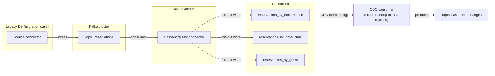

## Objective

Learn what it actually takes to bring Cassandra into an existing enterprise architecture rather than treating it as a drop-in replacement for a relational database. That means three things: migrating an existing relational schema and application by *re-modeling*, not mechanically translating, table for table; streaming data into Cassandra from Kafka (and, more awkwardly, back out again); and running analytics over data that already lives in Cassandra with Spark. None of these are separate skills from the rest of the book — they are the query-first modeling discipline and the CAP-theorem trade-offs applied at the boundary where Cassandra meets the rest of your stack.

## Use Cases

- Migrating a legacy relational application (the book's running example is a hotel reservation system) to Cassandra when you're hitting the classic RDBMS ceilings: query volume/complexity, single-node scaling limits, availability risk, licensing cost, or the need for multicloud deployment.
- Running a zero-downtime cutover from an existing database, either via dual writes from the application or by capturing change data capture (CDC) events and replaying them into Cassandra.
- Streaming write-side events (orders, reservations, inventory changes) from a microservice into Kafka and having a downstream sink connector land them in Cassandra tables, decoupling producer and consumer services.
- Streaming Cassandra's own mutations out to Kafka so other systems can react to changes without polling Cassandra directly.
- Running ad hoc or scheduled analytics — revenue trends, demographic rollups, aggregate reports — over data that's shaped for fast transactional access, without buying a separate data warehouse or hand-writing ETL.
- Doing large, distributed bulk data movement (schema migrations, cluster-to-cluster copies, cross-validation of a migration) at a scale where `cqlsh COPY` is too slow and DSBulk isn't the right tool for the job.

## Deep Dive

### Migration mindset: re-model, don't translate

The chapter's central argument is that migrating *to* Cassandra is not a porting exercise. You can technically do a **direct translation** — map each relational entity to a Cassandra table using its existing key, then build denormalized lookup tables for each secondary access path the old SQL indexes supported — and the book walks through exactly this for a `Hotels` table: the base `hotels` table keeps `hotel_id` as the partition key, and a `hotels_by_name` table exists purely because the legacy app had `CREATE INDEX idx_name ON Hotels (Name)`. But direct translation is presented as a stepping stone, not the goal. The recommended path is the same **query-first methodology** taught in the data modeling chapter — reverse-engineer the relational model into a conceptual model, identify the application's real access patterns, and run that conceptual model plus those patterns through the normal conceptual → logical → physical pipeline described in `cassandra-data-modeling-methodology`. "Whether you choose a direct or indirect translation approach, the resulting models should be largely the same, especially if you are evaluating your proposed designs against the queries needed by your application." In other words: migration doesn't get you out of doing steps 1 and 2 of that process — if anything, it's the same discipline under time pressure, because a legacy system's existing indexes are a *record of past access patterns*, not a substitute for asking what the application needs today.

Three translation patterns the book names explicitly, each a direct echo of ideas from the sibling data-modeling concept:

- **Entities become tables**, and each secondary index the legacy system carried becomes a denormalized, purpose-built table (`hotels_by_name`) — the same "one table per query" rule, just discovered by reading old `CREATE INDEX` statements instead of writing new UI wireframes.
- **Relationships (join tables) become either a mapped table or a collapsed UDT.** A relational `RoomToAmenity` join table can become an `amenities_by_room` table, or the amenity data can be collapsed into a `set<amenity>` UDT inside `rooms_by_hotel` — trading normalized join-table cleanliness for single-query retrieval, exactly the denormalization trade-off the modeling chapter treats as normal rather than a mistake to be corrected.
- **Complex types become UDTs.** An untyped or loosely-typed `Address` column in SQL becomes a proper Cassandra user-defined type, reusable across tables in a keyspace — with the same caveat the modeling concept documents: a UDT's scope is the keyspace it's declared in, so it has to be redeclared per keyspace.

Two migration-specific habits deserve their own note because they're easy to get wrong:

**Consistency expectations have to be re-taught, not re-implemented.** Developers coming from a relational background bring assumptions — read-after-write consistency, race-free updates, joins across tables — that Cassandra doesn't grant for free. The book's answer is a checklist of what Cassandra *does* offer as a substitute: tunable consistency levels (`QUORUM`/`LOCAL_QUORUM` for strong consistency, `ONE`/`LOCAL_ONE` for throughput), `BATCH` to coordinate writes across denormalized tables (with the caveat to watch `batch_size_warn_threshold_in_kb`), lightweight transactions (`IF NOT EXISTS` / `IF <condition>`) scoped to a single partition for uniqueness and check-and-set semantics, and denormalization itself as the standing answer to "how do I read from multiple tables without a join." None of these are ACID transactions, and the book is explicit that pretending otherwise is the mistake: "it does not support transactions with ACID semantics due to the challenges of implementing the required locking in a distributed system."

**Stored procedures don't map to a clean equivalent, and shouldn't be force-fit into one.** Cassandra's user-defined functions (UDFs) and user-defined aggregates (UDAs) look tempting as a stored-procedure replacement, but the book's own sidebar warns against the obvious move: "a good rule of thumb is to avoid using stored procedures to implement business processes, data transformation, or validation... confine their usage to very basic analytical and statistical tasks." UDFs run per-row on the coordinator (e.g., `CREATE FUNCTION count_if_true(...)`); UDAs chain a state function across rows into a running aggregate (e.g., a hand-rolled running count, on top of the built-in `COUNT`/`MIN`/`MAX`/`SUM`/`AVG`). Business logic that lived in a stored procedure belongs in the application or service layer during a migration, not in a UDF.

The application-layer counterpart to this data-model work is architectural: the book recommends the **strangler pattern** — stand up an API layer in front of the legacy system, peel off one use case at a time into a new microservice backed by its own Cassandra-based data store, and decommission the legacy application only once every capability has been replaced. Each new service gets its own DAO layer (often built on the object mapper from `cassandra-application-development-with-the-java-driver`) so the database detail is isolated behind an interface, which is what makes the next use case's migration cheaper than the last.

### Migrating the data itself

Separately from adapting the model and the application, there's the mechanical problem of moving rows. The book lists a spectrum from lightweight to heavyweight:

- **`cqlsh COPY`** — good for small CSV loads/unloads, built into `cqlsh`, no separate tooling.
- **DataStax Bulk Loader (DSBulk)** — a faster, dedicated CLI for JSON/CSV bulk load and unload, with per-line error logging (bad rows go to a log file instead of aborting or failing silently) and a configurable failure threshold.
- **Apache Spark** — for genuinely large or ongoing data movement, including cluster-to-cluster or table-to-table copies within the same cluster, which the book flags as "a popular approach for schema migration" — this is the same Spark integration covered below, repurposed as a migration tool rather than an analytics tool.

For zero-downtime cutovers specifically, the book describes **dual writes** (the application writes to both the legacy database and Cassandra during a transition window, backed by an initial bulk load, with the legacy database as a rollback safety net) and **CDC-driven replication** (capture change events from the legacy database and replay them into Cassandra) as the two standard patterns — and CDC is the natural bridge into the Kafka integration below.

### Kafka integration: streaming data in and out

Cassandra and Kafka show up together constantly in microservice architectures, and the book is careful to describe the *usual* relationship as complementary rather than tightly coupled: a service persists a change to Cassandra, then publishes an event describing that change to a Kafka topic; other services consume the topic and react (update their own tables, send a notification) without touching Cassandra directly. Kafka's own storage is topic-oriented, partitioned and replicated by key the same way Cassandra partitions by partition key, but it's meant for short-to-medium retention and stream processing, not as a system of record — "it does not provide all of the features of a database and is primarily suitable for short-term storage."

The concrete integration point is **Kafka Connect**, a pluggable connector framework for wiring Kafka topics to external systems without hand-writing producer/consumer code:

- **Sink direction (Kafka → Cassandra):** the DataStax Apache Kafka Connector is a sink connector that maps messages from Kafka topics onto one or more Cassandra tables via a configuration file, supports Avro and JSON payloads, can set CQL `writetime`/`TTL` on the resulting writes, and — because it's built on the Java driver — inherits every driver configuration option. This is the piece the book uses for a *live migration*: a source connector reads the legacy database, writes to Kafka, and the Cassandra sink connector drains those topics into Cassandra, giving you a decoupled, replayable migration pipeline instead of a direct point-to-point copy.
- **Source direction (Cassandra → Kafka):** this is the harder half. Cassandra's own change data capture (CDC) feature (introduced in 3.8, improved in 4.0) captures mutations by archiving commit log segments for tables you enable with `ALTER TABLE ... WITH cdc=true`, but streaming those out to Kafka is complicated by the distributed architecture itself: each write lands on as many nodes as the replication factor, so a consumer has to order and deduplicate CDC records across nodes before they're usable as a single event stream. At the time the book was written, DataStax's own CDC-to-Kafka connector was early access and required DataStax Enterprise's Advanced Replication feature for deduplication — it explicitly did not work against open source Cassandra clusters.

The sink connector's fan-out into `reservations_by_confirmation`, `reservations_by_hotel_date`, and `reservations_by_guest` in the diagram is the Kafka integration meeting denormalization head-on: one Kafka message becomes three Cassandra writes, because the query-first model from `cassandra-data-modeling-methodology` put the same reservation under three different keys. A connector config that writes to only one of those tables silently breaks the other two query paths — the fan-out has to be configured deliberately, not discovered later.

If your own stack already leans on Spring for Apache Kafka (see `spring-kafka-messaging` in the Spring Concepts feature) for producing and consuming — `KafkaTemplate` for sends, `@KafkaListener` for receives — that code doesn't disappear when Cassandra is the eventual sink. The Kafka Connect sink connector is an *alternative* to writing your own `@KafkaListener` that calls the Java driver directly: Connect buys you configuration-driven mapping and built-in error handling, hand-written Spring Kafka consumers buy you the ability to embed business logic, validation, or fan-out decisions in code rather than connector config. Many teams use both — Spring Kafka for anything with real logic, Connect for straight pass-through replication.

### Spark integration: analytics without ETL

Where Kafka moves individual events, **Apache Spark** is for asking questions across the whole dataset at once — revenue trend reports, demographic rollups, pre-computed aggregations to feed back into a frontend table — the kind of query CQL was never meant to answer efficiently, because CQL has no joins and its filters are built around partition-key access, not table scans.

The book is direct about scope: "Apache Cassandra is a great choice for transactional workloads that require high scale and maximum availability. Apache Spark is a great choice for analyzing large volumes of data at scale... One use case to avoid is using Spark-Cassandra integration as an alternative to a Hadoop workload." Spark augments a Cassandra-shaped solution; it isn't a replacement data warehouse, and reaching for it just because a report is hard to write in CQL is a sign the underlying use case may not be a Cassandra-first problem at all.

The mechanics: the **spark-cassandra-connector** exposes Cassandra tables to Spark as RDDs, Datasets, and DataFrames, and — critically for performance — a Spark Worker co-located on each Cassandra node can source data from that node's local token range, so a job's read work is data-local instead of shuffled entirely across the network. A common deployment pattern the book calls out is running analytics in a **separate (often virtual) data center** within the same cluster, with a lower replication factor there, so analytics load doesn't compete with the transactional data center's latency budget. Once you have a DataFrame — `spark.read.cassandraFormat("reservations_by_hotel_date", "reservation").load()` — you can filter on non-partition-key columns (something native CQL won't let you do efficiently), run Spark SQL joins across Cassandra-backed temporary views, and write results straight back to a new or existing Cassandra table, closing the loop without ever standing up a separate ETL pipeline: "you can extract data, transform in place, and save it directly back to a Cassandra table, eliminating the costly and error-prone ETL process."

### Book vs. today

> **The Kafka sink connector is still DataStax's own, and still actively maintained — under a new name.** The project the book calls the "DataStax Apache Kafka Connector" now lives at [github.com/datastax/kafka-sink](https://github.com/datastax/kafka-sink), currently on the 1.7.x line (1.7.4+ adds Java 8/11/17/21 support), and is Confluent-certified. It remains a sink connector only — writes Kafka → Cassandra. Verified via the project's GitHub README as of August 2026.

> **The Spark connector has moved from DataStax to the Apache Software Foundation — the same governance shift the Java driver already went through.** What the book documents as `com.datastax.spark:spark-cassandra-connector` now lives at [github.com/apache/cassandra-spark-connector](https://github.com/apache/cassandra-spark-connector) under the Apache Cassandra umbrella, currently at 3.5.1, supporting Spark 3.5, Cassandra 2.1.5 through 5.0, and Scala 2.12/2.13 — and it picked up support for Cassandra 5.0's vector type along the way. This mirrors exactly the `org.apache.cassandra` migration already documented for the Java driver in `cassandra-application-development-with-the-java-driver`: DataStax open-sourced the connector's stewardship to Apache rather than the project going stale. The book's `spark-shell --packages com.datastax.spark:spark-cassandra-connector_2.11:2.4.3` example is now a museum piece in both group coordinates and Scala version, but the API shape it teaches (`spark.read.cassandraFormat(...)`, `.write.cassandraFormat(...).save()`) is unchanged.

> **The book's biggest gap — no open source way to stream changes out of Cassandra into Kafka — has been substantially closed by Debezium.** At the time of the revised 3rd edition, the only CDC-to-Kafka path required DataStax Enterprise's Advanced Replication and didn't work against open source clusters at all. Debezium now ships a Cassandra connector that reads the commit log directly and produces change events to Kafka against open source Cassandra, which is the practical answer to the source-direction gap the book leaves open. The underlying hard problem the book names — ordering and deduplicating CDC records across as many replicas as your replication factor — doesn't go away just because a connector exists for it; it's still the reason CDC-out is a fundamentally harder integration than CDC-in.

> **DSBulk is still the recommended bulk-load tool and still free from DataStax**, unchanged from the book's coverage — no material replacement has displaced it for CSV/JSON bulk load/unload against Cassandra.

## Trade-offs

- **A Kafka sink writing to a denormalized schema means one event becomes N writes, and the connector configuration is now load-bearing schema documentation.** The moment a reservation is modeled as three tables (`reservations_by_confirmation`, `reservations_by_hotel_date`, `reservations_by_guest`), a sink connector has to know to fan out to all three. Miss one in the connector config and you get a silent, partial write — the same "consistency is your problem" trade-off from `cassandra-data-modeling-methodology`'s denormalization discussion, just relocated from application code into connector YAML where it's easier to forget.
- **Streaming data out of Cassandra is structurally harder than streaming it in, and that asymmetry doesn't disappear with better tooling.** CDC-in via Kafka Connect is a mature, off-the-shelf integration. CDC-out requires reconciling per-replica commit logs — ordering and deduplicating across as many copies as the replication factor — which is a distributed-systems problem inherent to Cassandra's architecture, not a tooling gap that any one connector (DataStax's early-access offering, or Debezium today) fully makes disappear; it just gets absorbed into the connector's own complexity.
- **Direct translation from a relational schema is fast and dangerous in exactly the way indirect (query-first) translation is slow and safe.** Mapping each old table and its indexes straight into Cassandra tables gets you running quickly, but it inherits every implicit assumption the old schema had about joins, transactions, and referential integrity — the same trap `cassandra-data-modeling-methodology` warns about when it says the relational instinct is to model data before queries. Migration doesn't buy you an exemption from that discipline; it just makes it tempting to skip because "the model already exists."
- **The strangler pattern buys incremental migration safety at the cost of running two data stores and a synchronization boundary for an extended period.** Dual writes or CDC replication during the transition mean the legacy database and Cassandra can drift, and every capability moved to a microservice adds one more service that has to be kept consistent with whatever the legacy system still owns, until the whole thing is finally decommissioned.
- **Spark analytics on Cassandra is genuinely free of a separate ETL pipeline, but it isn't free of operational cost.** Co-locating Spark Workers on Cassandra nodes gets you data locality, but it also means an analytics job now competes for CPU, memory, and disk I/O with the transactional workload on the same hardware — which is exactly why the book recommends a separate (often virtual) analytics data center with its own, lower replication factor. Skipping that isolation trades a clean architecture story for an availability risk on the transactional path.
- **UDFs/UDAs look like a stored-procedure escape hatch during migration, and the book's own guidance is to resist that pull.** Confining them to simple aggregation-style tasks, rather than business logic or validation, keeps the coordinator lightweight and keeps business rules in code that's testable and portable — the opposite of why teams reached for stored procedures in the first place.

## Documentation Links

- [Jeff Carpenter and Eben Hewitt, "Cassandra: The Definitive Guide", Revised 3rd Edition (O'Reilly, 2022) — Chapter 15, "Migrating and Integrating"](https://www.oreilly.com/library/view/cassandra-the-definitive/9781492097143/) — doc
- [DataStax Kafka Sink Connector — GitHub repository (datastax/kafka-sink)](https://github.com/datastax/kafka-sink) — doc
- [DataStax Apache Kafka Connector — Confluent Hub listing](https://www.confluent.io/hub/datastax/kafka-connect-cassandra-sink) — doc
- [Apache Cassandra Spark Connector — GitHub repository (apache/cassandra-spark-connector)](https://github.com/apache/cassandra-spark-connector) — doc
- [Debezium Connector for Cassandra — documentation](https://debezium.io/documentation/reference/stable/connectors/cassandra.html) — doc
- [Apache Cassandra Documentation — Change Data Capture (CDC)](https://cassandra.apache.org/doc/latest/cassandra/managing/operating/cdc.html) — doc
- [Apache Kafka Documentation — Kafka Connect](https://kafka.apache.org/documentation/#connect) — doc
