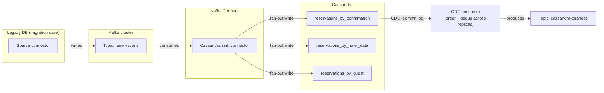

## Objective

Aprender o que de fato é preciso para trazer o Cassandra para uma arquitetura corporativa existente, em vez de tratá-lo como um substituto plug-and-play para um banco de dados relacional. Isso significa três coisas: migrar um schema relacional e uma aplicação existentes por *remodelagem*, não por tradução mecânica, tabela por tabela; transmitir dados para o Cassandra a partir do Kafka (e, de forma mais complicada, de volta para fora); e rodar analytics sobre dados que já vivem no Cassandra com o Spark. Nenhuma dessas é uma habilidade separada do resto do livro: são a disciplina de modelagem orientada a query e os trade-offs do teorema CAP aplicados na fronteira onde o Cassandra encontra o resto do seu stack.

## Use Cases

- Migrar uma aplicação relacional legada (o exemplo condutor do livro é um sistema de reserva de hotel) para o Cassandra quando você está batendo nos tetos clássicos de RDBMS: volume/complexidade de query, limites de escalonamento de nó único, risco de disponibilidade, custo de licenciamento, ou a necessidade de implantação multicloud.
- Rodar um corte sem downtime a partir de um banco de dados existente, seja via escritas duplas (dual write) da aplicação, seja capturando eventos de change data capture (CDC) e reproduzindo-os no Cassandra.
- Transmitir eventos do lado da escrita (pedidos, reservas, mudanças de inventário) de um microsserviço para o Kafka e ter um conector sink downstream depositando-os em tabelas Cassandra, desacoplando serviços produtores e consumidores.
- Transmitir as próprias mutações do Cassandra para o Kafka, para que outros sistemas possam reagir a mudanças sem consultar o Cassandra diretamente por polling.
- Rodar analytics ad hoc ou agendados (tendências de receita, agregações demográficas, relatórios agregados) sobre dados moldados para acesso transacional rápido, sem comprar um data warehouse separado ou escrever ETL manualmente.
- Fazer movimentação de dados em massa, grande e distribuída (migrações de schema, cópias de cluster para cluster, validação cruzada de uma migração) em uma escala onde `cqlsh COPY` é lento demais e o DSBulk não é a ferramenta certa para o trabalho.

## Deep Dive

### Mentalidade de migração: remodelar, não traduzir

O argumento central do capítulo é que migrar *para* o Cassandra não é um exercício de porte. Você pode tecnicamente fazer uma **tradução direta**: mapear cada entidade relacional para uma tabela Cassandra usando sua chave existente, depois construir tabelas de busca desnormalizadas para cada caminho de acesso secundário que os índices SQL antigos suportavam, e o livro percorre exatamente isso para uma tabela `Hotels`: a tabela base `hotels` mantém `hotel_id` como partition key, e uma tabela `hotels_by_name` existe puramente porque a aplicação legada tinha `CREATE INDEX idx_name ON Hotels (Name)`. Mas a tradução direta é apresentada como um degrau, não o objetivo. O caminho recomendado é a mesma **metodologia orientada a query** ensinada no capítulo de modelagem de dados: fazer engenharia reversa do modelo relacional para um modelo conceitual, identificar os padrões de acesso reais da aplicação, e rodar esse modelo conceitual mais esses padrões pelo pipeline normal conceitual → lógico → físico descrito em `cassandra-data-modeling-methodology`. "Seja qual for a abordagem de tradução escolhida, direta ou indireta, os modelos resultantes devem ser em grande parte os mesmos, especialmente se você está avaliando seus designs propostos contra as queries exigidas pela sua aplicação." Em outras palavras: migração não te tira de fazer os passos 1 e 2 desse processo; se algo, é a mesma disciplina sob pressão de tempo, porque os índices existentes de um sistema legado são um *registro de padrões de acesso passados*, não um substituto para perguntar o que a aplicação precisa hoje.

Três padrões de tradução que o livro nomeia explicitamente, cada um um eco direto de ideias do conceito irmão de modelagem de dados:

- **Entidades se tornam tabelas**, e todo índice secundário que o sistema legado carregava se torna uma tabela desnormalizada, feita sob medida (`hotels_by_name`): a mesma regra "uma tabela por query", só que descoberta lendo declarações antigas de `CREATE INDEX` em vez de escrever novos wireframes de UI.
- **Relacionamentos (tabelas de junção) se tornam ou uma tabela mapeada ou um UDT colapsado.** Uma tabela de junção relacional `RoomToAmenity` pode se tornar uma tabela `amenities_by_room`, ou os dados de comodidade podem ser colapsados em um `set<amenity>` UDT dentro de `rooms_by_hotel`: trocando a limpeza de uma tabela de junção normalizada por recuperação em uma única query, exatamente o trade-off de desnormalização que o capítulo de modelagem trata como normal, em vez de um erro a ser corrigido.
- **Tipos complexos se tornam UDTs.** Uma coluna `Address` não tipada ou fracamente tipada em SQL se torna um tipo definido pelo usuário Cassandra propriamente dito, reutilizável entre tabelas em um keyspace, com a mesma ressalva que o conceito de modelagem documenta: o escopo de um UDT é o keyspace em que é declarado, então precisa ser redeclarado por keyspace.

Dois hábitos específicos de migração merecem sua própria nota, porque são fáceis de errar:

**Expectativas de consistência precisam ser reensinadas, não reimplementadas.** Desenvolvedores vindos de um background relacional trazem suposições (consistência de leitura após escrita, atualizações livres de disputa, joins entre tabelas) que o Cassandra não concede de graça. A resposta do livro é um checklist do que o Cassandra *de fato* oferece como substituto: níveis de consistência ajustáveis (`QUORUM`/`LOCAL_QUORUM` para consistência forte, `ONE`/`LOCAL_ONE` para throughput), `BATCH` para coordenar escritas entre tabelas desnormalizadas (com a ressalva de observar `batch_size_warn_threshold_in_kb`), transações leves (`IF NOT EXISTS` / `IF <condition>`) restritas a uma única partição para semântica de unicidade e check-and-set, e a própria desnormalização como a resposta padrão para "como eu leio de múltiplas tabelas sem um join." Nenhuma dessas é uma transação ACID, e o livro é explícito ao dizer que fingir o contrário é o erro: "ele não suporta transações com semântica ACID devido aos desafios de implementar o locking exigido em um sistema distribuído."

**Stored procedures não têm um equivalente limpo, e não deveriam ser forçadas em um.** As funções definidas pelo usuário (UDFs) e agregações definidas pelo usuário (UDAs) do Cassandra parecem tentadoras como substituto de stored procedure, mas o próprio box do livro avisa contra o movimento óbvio: "uma boa regra prática é evitar usar stored procedures para implementar processos de negócio, transformação de dados, ou validação... restrinja seu uso a tarefas analíticas e estatísticas bem básicas." UDFs rodam por linha no coordenador (por exemplo, `CREATE FUNCTION count_if_true(...)`); UDAs encadeiam uma função de estado através das linhas em uma agregação corrente (por exemplo, uma contagem corrente feita à mão, além dos nativos `COUNT`/`MIN`/`MAX`/`SUM`/`AVG`). Lógica de negócio que vivia em uma stored procedure pertence à camada de aplicação ou serviço durante uma migração, não a uma UDF.

A contraparte da camada de aplicação para esse trabalho de modelo de dados é arquitetural: o livro recomenda o **padrão strangler**: erguer uma camada de API na frente do sistema legado, descascar um caso de uso de cada vez em um microsserviço novo apoiado em seu próprio armazenamento de dados baseado em Cassandra, e desativar a aplicação legada só depois que toda capacidade tiver sido substituída. Cada novo serviço ganha sua própria camada DAO (frequentemente construída sobre o mapper de objetos de `cassandra-application-development-with-the-java-driver`), para que o detalhe do banco de dados fique isolado atrás de uma interface, o que é o que torna a migração do próximo caso de uso mais barata do que a anterior.

### Migrando os próprios dados

Separadamente de adaptar o modelo e a aplicação, existe o problema mecânico de mover linhas. O livro lista um espectro do leve ao pesado:

- **`cqlsh COPY`**: bom para cargas/descargas pequenas de CSV, embutido no `cqlsh`, sem ferramental separado.
- **DataStax Bulk Loader (DSBulk)**: uma CLI dedicada e mais rápida para carga e descarga em massa de JSON/CSV, com registro de erro por linha (linhas ruins vão para um arquivo de log, em vez de abortar ou falhar silenciosamente) e um limiar de falha configurável.
- **Apache Spark**: para movimentação de dados genuinamente grande ou contínua, incluindo cópias de cluster para cluster ou de tabela para tabela dentro do mesmo cluster, que o livro sinaliza como "uma abordagem popular para migração de schema": esta é a mesma integração Spark coberta abaixo, reaproveitada como ferramenta de migração em vez de ferramenta de analytics.

Para cortes sem downtime especificamente, o livro descreve **escritas duplas** (a aplicação escreve tanto no banco de dados legado quanto no Cassandra durante uma janela de transição, apoiada em uma carga em massa inicial, com o banco de dados legado como uma rede de segurança para rollback) e **replicação orientada a CDC** (capturar eventos de mudança do banco de dados legado e reproduzi-los no Cassandra) como os dois padrões padrão, e o CDC é a ponte natural para a integração com Kafka abaixo.

### Integração com Kafka: transmitindo dados para dentro e para fora

Cassandra e Kafka aparecem juntos constantemente em arquiteturas de microsserviço, e o livro tem o cuidado de descrever a relação *usual* como complementar, em vez de fortemente acoplada: um serviço persiste uma mudança no Cassandra, depois publica um evento descrevendo essa mudança em um tópico Kafka; outros serviços consomem o tópico e reagem (atualizam suas próprias tabelas, enviam uma notificação) sem tocar no Cassandra diretamente. O próprio armazenamento do Kafka é orientado a tópico, particionado e replicado por chave da mesma forma que o Cassandra particiona por partition key, mas é pensado para retenção de curto a médio prazo e processamento de stream, não como um sistema de registro: "ele não fornece todos os recursos de um banco de dados e é adequado principalmente para armazenamento de curto prazo."

O ponto de integração concreto é o **Kafka Connect**, um framework de conectores plugável para conectar tópicos Kafka a sistemas externos sem escrever código de produtor/consumidor à mão:

- **Direção sink (Kafka → Cassandra):** o DataStax Apache Kafka Connector é um conector sink que mapeia mensagens de tópicos Kafka para uma ou mais tabelas Cassandra via um arquivo de configuração, suporta payloads Avro e JSON, pode definir `writetime`/`TTL` de CQL nas escritas resultantes, e, por ser construído sobre o driver Java, herda toda opção de configuração do driver. Essa é a peça que o livro usa para uma *migração ao vivo*: um conector source lê o banco de dados legado, escreve no Kafka, e o conector sink Cassandra drena esses tópicos para o Cassandra, dando a você um pipeline de migração desacoplado e reproduzível, em vez de uma cópia ponto a ponto direta.
- **Direção source (Cassandra → Kafka):** essa é a metade mais difícil. O próprio recurso de change data capture (CDC) do Cassandra (introduzido na 3.8, melhorado na 4.0) captura mutações arquivando segmentos de commit log para tabelas que você habilita com `ALTER TABLE ... WITH cdc=true`, mas transmitir isso para o Kafka é complicado pela própria arquitetura distribuída: toda escrita aterrissa em tantos nós quanto o fator de replicação, então um consumidor precisa ordenar e deduplicar registros de CDC entre nós antes de eles serem utilizáveis como um único stream de eventos. Na época em que o livro foi escrito, o próprio conector de CDC-para-Kafka da DataStax estava em acesso antecipado e exigia o recurso Advanced Replication do DataStax Enterprise para deduplicação: ele explicitamente não funcionava contra clusters Cassandra open source.

O fan-out do conector sink em `reservations_by_confirmation`, `reservations_by_hotel_date`, e `reservations_by_guest` no diagrama é a integração Kafka encontrando a desnormalização de frente: uma mensagem Kafka se torna três escritas Cassandra, porque o modelo orientado a query de `cassandra-data-modeling-methodology` colocou a mesma reserva sob três chaves diferentes. Uma configuração de conector que escreve para apenas uma dessas tabelas silenciosamente quebra os outros dois caminhos de query: o fan-out precisa ser configurado deliberadamente, não descoberto depois.

Se seu próprio stack já se apoia no Spring for Apache Kafka (veja `spring-kafka-messaging` na feature Spring Concepts) para produzir e consumir (`KafkaTemplate` para envios, `@KafkaListener` para recebimentos), esse código não desaparece quando o Cassandra é o sink final. O conector sink do Kafka Connect é uma *alternativa* a escrever seu próprio `@KafkaListener` que chama o driver Java diretamente: o Connect te dá mapeamento orientado a configuração e tratamento de erro embutido; consumidores Spring Kafka escritos à mão te dão a capacidade de embutir lógica de negócio, validação, ou decisões de fan-out em código, em vez de configuração de conector. Muitos times usam os dois: Spring Kafka para qualquer coisa com lógica real, Connect para replicação de passagem direta.

### Integração com Spark: analytics sem ETL

Onde o Kafka move eventos individuais, o **Apache Spark** é para fazer perguntas sobre o conjunto de dados inteiro de uma vez: relatórios de tendência de receita, agregações demográficas, agregações pré-computadas para alimentar de volta uma tabela de frontend, o tipo de query que o CQL nunca foi pensado para responder eficientemente, porque o CQL não tem joins e seus filtros são construídos em torno de acesso por partition key, não varreduras de tabela.

O livro é direto sobre o escopo: "o Apache Cassandra é uma ótima escolha para cargas de trabalho transacionais que exigem alta escala e disponibilidade máxima. O Apache Spark é uma ótima escolha para analisar grandes volumes de dados em escala... um caso de uso a evitar é usar a integração Spark-Cassandra como alternativa a uma carga de trabalho Hadoop." O Spark aumenta uma solução moldada pelo Cassandra; não é um data warehouse substituto, e recorrer a ele só porque um relatório é difícil de escrever em CQL é um sinal de que o caso de uso subjacente talvez não seja um problema Cassandra-primeiro de forma alguma.

A mecânica: o **spark-cassandra-connector** expõe tabelas Cassandra ao Spark como RDDs, Datasets e DataFrames, e, crucialmente para performance, um Spark Worker colocalizado em cada nó Cassandra pode obter dados do intervalo de token local desse nó, então o trabalho de leitura de um job é local aos dados, em vez de embaralhado inteiramente pela rede. Um padrão de implantação comum que o livro destaca é rodar analytics em um **data center separado (frequentemente virtual)** dentro do mesmo cluster, com um fator de replicação mais baixo ali, para que a carga de analytics não compita com o orçamento de latência do data center transacional. Uma vez que você tem um DataFrame (`spark.read.cassandraFormat("reservations_by_hotel_date", "reservation").load()`), você pode filtrar por colunas que não são chave de partição (algo que o CQL nativo não permite eficientemente), rodar joins Spark SQL entre views temporárias apoiadas no Cassandra, e escrever resultados de volta diretamente para uma tabela Cassandra nova ou existente, fechando o ciclo sem nunca erguer um pipeline de ETL separado: "você pode extrair dados, transformar no lugar, e salvar diretamente de volta em uma tabela Cassandra, eliminando o processo de ETL caro e propenso a erros."

### Book vs. today

> **O conector sink Kafka ainda é o próprio da DataStax, e ainda ativamente mantido, sob um novo nome.** O projeto que o livro chama de "DataStax Apache Kafka Connector" hoje vive em [github.com/datastax/kafka-sink](https://github.com/datastax/kafka-sink), atualmente na linha 1.7.x (1.7.4+ adiciona suporte a Java 8/11/17/21), e é certificado pela Confluent. Continua sendo apenas um conector sink: escreve Kafka → Cassandra. Verificado via o README do GitHub do projeto em agosto de 2026.

> **O conector Spark se moveu da DataStax para a Apache Software Foundation, a mesma mudança de governança pela qual o driver Java já passou.** O que o livro documenta como `com.datastax.spark:spark-cassandra-connector` hoje vive em [github.com/apache/cassandra-spark-connector](https://github.com/apache/cassandra-spark-connector) sob o guarda-chuva do Apache Cassandra, atualmente na 3.5.1, suportando Spark 3.5, Cassandra 2.1.5 até a 5.0, e Scala 2.12/2.13, e ganhou suporte para o tipo vector do Cassandra 5.0 pelo caminho. Isso espelha exatamente a migração para `org.apache.cassandra` já documentada para o driver Java em `cassandra-application-development-with-the-java-driver`: a DataStax abriu a curadoria do conector para a Apache, em vez de o projeto ficar obsoleto. O exemplo do livro `spark-shell --packages com.datastax.spark:spark-cassandra-connector_2.11:2.4.3` hoje é uma peça de museu tanto em coordenadas de grupo quanto em versão do Scala, mas a forma da API que ele ensina (`spark.read.cassandraFormat(...)`, `.write.cassandraFormat(...).save()`) permanece inalterada.

> **A maior lacuna do livro (nenhuma forma open source de transmitir mudanças para fora do Cassandra em direção ao Kafka) foi substancialmente fechada pelo Debezium.** Na época da 3ª edição revisada, o único caminho de CDC-para-Kafka exigia o Advanced Replication do DataStax Enterprise e não funcionava contra clusters open source de forma alguma. O Debezium agora traz um conector Cassandra que lê o commit log diretamente e produz eventos de mudança para o Kafka contra Cassandra open source, que é a resposta prática para a lacuna na direção source que o livro deixa aberta. O problema difícil subjacente que o livro nomeia (ordenar e deduplicar registros de CDC entre tantas réplicas quanto seu fator de replicação) não desaparece só porque um conector existe para ele; continua sendo a razão pela qual CDC de saída é uma integração fundamentalmente mais difícil do que CDC de entrada.

> **O DSBulk continua sendo a ferramenta recomendada para carga em massa e ainda é gratuito pela DataStax**, inalterado em relação à cobertura do livro: nenhum substituto material o deslocou para carga/descarga em massa de CSV/JSON contra o Cassandra.

## Trade-offs

- **Um sink Kafka escrevendo para um schema desnormalizado significa que um evento se torna N escritas, e a configuração do conector agora é documentação de schema essencial.** No momento em que uma reserva é modelada como três tabelas (`reservations_by_confirmation`, `reservations_by_hotel_date`, `reservations_by_guest`), um conector sink precisa saber fazer fan-out para as três. Perca uma na configuração do conector e você tem uma escrita silenciosa e parcial: o mesmo trade-off "consistência é problema seu" da discussão de desnormalização de `cassandra-data-modeling-methodology`, só que realocado do código da aplicação para o YAML do conector, onde é mais fácil de esquecer.
- **Transmitir dados para fora do Cassandra é estruturalmente mais difícil do que transmiti-los para dentro, e essa assimetria não desaparece com ferramental melhor.** CDC de entrada via Kafka Connect é uma integração madura, pronta para uso. CDC de saída exige reconciliar commit logs por réplica: ordenar e deduplicar entre tantas cópias quanto o fator de replicação, que é um problema de sistemas distribuídos inerente à arquitetura do Cassandra, não uma lacuna de ferramental que qualquer conector (a oferta de acesso antecipado da DataStax, ou o Debezium hoje) faça desaparecer completamente; ele só é absorvido pela complexidade do próprio conector.
- **Tradução direta a partir de um schema relacional é rápida e perigosa exatamente da mesma forma que a tradução indireta (orientada a query) é lenta e segura.** Mapear cada tabela antiga e seus índices diretamente para tabelas Cassandra te faz rodar rapidamente, mas herda toda suposição implícita que o schema antigo tinha sobre joins, transações, e integridade referencial: a mesma armadilha sobre a qual `cassandra-data-modeling-methodology` avisa quando diz que o instinto relacional é modelar dados antes das queries. Migração não te compra uma isenção dessa disciplina; só torna tentador pular porque "o modelo já existe."
- **O padrão strangler compra segurança de migração incremental ao custo de rodar duas bases de dados e uma fronteira de sincronização por um período estendido.** Escritas duplas ou replicação por CDC durante a transição significam que o banco de dados legado e o Cassandra podem divergir, e toda capacidade movida para um microsserviço adiciona mais um serviço que precisa ser mantido consistente com o que quer que o sistema legado ainda seja dono, até que a coisa toda seja finalmente desativada.
- **Analytics com Spark sobre o Cassandra é genuinamente livre de um pipeline de ETL separado, mas não é livre de custo operacional.** Colocalizar Spark Workers em nós Cassandra te dá localidade de dados, mas também significa que um job de analytics agora compete por CPU, memória e I/O de disco com a carga transacional no mesmo hardware, que é exatamente por que o livro recomenda um data center de analytics separado (frequentemente virtual) com seu próprio fator de replicação mais baixo. Pular esse isolamento troca uma história de arquitetura limpa por um risco de disponibilidade no caminho transacional.
- **UDFs/UDAs parecem uma válvula de escape de stored procedure durante a migração, e a própria orientação do livro é resistir a esse impulso.** Restringi-las a tarefas simples de estilo agregação, em vez de lógica de negócio ou validação, mantém o coordenador leve e mantém as regras de negócio em código testável e portável: o oposto do motivo pelo qual times recorriam a stored procedures em primeiro lugar.

## Documentation Links

- [Jeff Carpenter and Eben Hewitt, "Cassandra: The Definitive Guide", Revised 3rd Edition (O'Reilly, 2022), Chapter 15, "Migrating and Integrating"](https://www.oreilly.com/library/view/cassandra-the-definitive/9781492097143/) - doc
- [DataStax Kafka Sink Connector, GitHub repository (datastax/kafka-sink)](https://github.com/datastax/kafka-sink) - doc
- [DataStax Apache Kafka Connector, Confluent Hub listing](https://www.confluent.io/hub/datastax/kafka-connect-cassandra-sink) - doc
- [Apache Cassandra Spark Connector, GitHub repository (apache/cassandra-spark-connector)](https://github.com/apache/cassandra-spark-connector) - doc
- [Debezium Connector for Cassandra, documentation](https://debezium.io/documentation/reference/stable/connectors/cassandra.html) - doc
- [Apache Cassandra Documentation, Change Data Capture (CDC)](https://cassandra.apache.org/doc/latest/cassandra/managing/operating/cdc.html) - doc
- [Apache Kafka Documentation, Kafka Connect](https://kafka.apache.org/documentation/#connect) - doc
