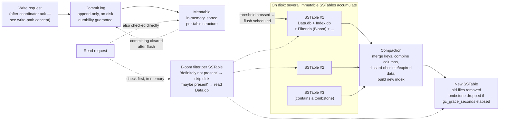

## Objective

Go one layer below the write path and understand the actual on-disk machinery that makes Cassandra's speed and durability claims true: how a memtable accumulates writes in memory, how it becomes an immutable SSTable, why SSTables must then be merged back together through compaction, and how a Bloom filter lets a read skip an SSTable entirely without touching disk. The companion concept on the write path already traced *when* the commit log and memtable are touched during a write; this concept explains *what those structures are*, what happens to them after the client has already been told "success," and what it costs to keep them fast to read from over time.

## Use Cases

- Explaining, to someone reading a `system.compaction_history` table or a `nodetool compactionstats` output for the first time, why compaction is running at all and why it is not optional maintenance.
- Diagnosing a node with degrading read latency and high disk usage — the classic symptom of a compaction strategy that no longer matches the table's write/read pattern, or of compaction falling behind under sustained write pressure.
- Deciding whether a table needs `SizeTieredCompactionStrategy`, `LeveledCompactionStrategy`, or `TimeWindowCompactionStrategy` based on whether it is write-heavy, read-heavy, or time-series data — and knowing what trade-off each choice makes.
- Reading a node's data directory during an incident and recognizing that many small `Data.db` files for one table is not corruption, it is exactly what an LSM-tree storage engine is supposed to look like between compaction runs.
- Explaining to a relational-database engineer why a Cassandra read has to check multiple SSTables and a memtable for a single partition, and why Bloom filters exist specifically to make most of those checks free.
- Deciding whether `gc_grace_seconds` needs to change for a table with a lot of deletes, and understanding why tombstones cannot simply be deleted from the memtable the instant a `DELETE` runs.

## Deep Dive

### Memtables: the in-memory write buffer

The companion write-path concept already established the sequence from the coordinator's point of view: commit log first, then memtable, then a reply to the client with the flush deliberately deferred. This concept is about what "then the memtable" actually means as a data structure.

"After it's written to the commit log, the value is written to a memory-resident data structure called the memtable. Each memtable contains data for a specific table." Early Cassandra kept memtables entirely on the JVM heap; "improvements starting with the 2.1 release have moved some memtable data to native memory, with configuration options to specify the amount of on-heap and native memory available. This makes Cassandra less susceptible to fluctuations in performance due to Java garbage collection." Memtables are implemented by `org.apache.cassandra.db.Memtable`.

A memtable is not a single object per table at any given moment: "When the number of objects stored in the memtable reaches a threshold, the contents of the memtable are flushed to disk in a file called an SSTable. A new memtable is then created. This flushing is a nonblocking operation; multiple memtables may exist for a single table, one current and the rest waiting to be flushed." That matters for reads: "On reads, Cassandra will read both SSTables and memtables to find data values, as the memtable may contain values that have not yet been flushed to disk." A read for a recently written row may need to check the live memtable, any memtable still queued for flush, and every relevant SSTable on disk — which is precisely the cost that Bloom filters exist to cut down.

### The commit log's bit flag, and durable_writes

The write-path concept covers the commit-log-then-memtable sequence and the crash-recovery guarantee in detail. One mechanical piece worth adding here: "Each commit log maintains an internal bit flag to indicate whether it needs flushing... There is only one bit flag per table, because only one commit log is ever being written to across the entire server. All writes to all tables will go into the same commit log, so the bit flag indicates whether a particular commit log contains anything that hasn't been flushed for a particular table. Once the memtable has been properly flushed to disk, the corresponding commit log's bit flag is set to 0."

This is also where the keyspace property first seen when running `DESCRIBE KEYSPACE` actually does something: "The `durable_writes` property controls whether Cassandra will use the commit log for writes to the tables in the keyspace. This value defaults to `true`... Setting the value to `false` increases the speed of writes, but also risks losing data if the node goes down before the data is flushed from memtables into SSTables." Turning it off trades away exactly the crash-recovery guarantee the commit log exists to provide.

### SSTables: immutable, sorted, append-only

"Once a memtable is flushed to disk as an SSTable, it is immutable and cannot be changed by the application." The name is a Bigtable inheritance: "The term 'SSTable' originated in Google Bigtable as a compaction of 'Sorted String Table.' Cassandra borrows this term even though it does not store data as strings on disk."

Immutability is the whole reason Cassandra writes are fast — the same fact the write-path concept states from the write side ("writing data is very fast in Cassandra, because its design does not require performing disk reads or seeks"). Here is the mechanical reason why: "All writes are sequential, which is the primary reason that writes perform so well in Cassandra. No reads or seeks of any kind are required for writing a value to Cassandra because all writes are append operations. This makes the speed of your disk one key limitation on performance." An SSTable is never edited in place; updates and deletes are new appended values that get reconciled later, at read time and at compaction time — never at write time. "If Cassandra naively inserted values where they ultimately belonged, writing clients would pay for seeks up front."

Each SSTable is a set of files, not one file. The write-path concept documents the component files in full (`Data.db`, `Index.db`, `Summary.db`, `Filter.db`, `CompressionInfo.db`, `Digest.crc32`, `Statistics.db`, `TOC.txt`) and the `<version>-<generation>-<implementation>-<component>.db` naming scheme — worth a quick cross-reference rather than repeating here, except for the one line that matters most for this concept: `Filter.db` is the Bloom filter, and it is loaded into memory, not read from disk on every query.

### Bloom filters: fast, nondeterministic "definitely not here" checks

"Bloom filters are used to boost the performance of reads. They are named for their inventor, Burton Bloom. Bloom filters are very fast, nondeterministic algorithms for testing whether an element is a member of a set. They are nondeterministic because it is possible to get a false-positive read from a Bloom filter, but not a false-negative." That asymmetry is the entire value proposition: a Bloom filter can wrongly say "maybe present," but it can never wrongly say "not present."

Mechanically, "Bloom filters work by mapping the values in a data set into a bit array and condensing a larger data set into a digest string using a hash function. The digest, by definition, uses a much smaller amount of memory than the original data would. The filters are stored in memory and are used to improve performance by reducing the need for disk access on key lookups. Disk access is typically much slower than memory access. So, in a way, a Bloom filter is a special kind of key cache."

The read-time payoff: "Cassandra maintains a Bloom filter for each SSTable. When a query is performed, the Bloom filter is checked first before accessing disk. Because false-negatives are not possible, if the filter indicates that the element does not exist in the set, it certainly doesn't; but if the filter thinks that the element is in the set, the disk is accessed to make sure." For a partition key that exists in only 2 of a table's 40 SSTables, the Bloom filter check is what turns "scan 40 files" into "scan roughly 2 files, skip 38 in memory." Accuracy is tunable per table: "Cassandra provides the ability to increase Bloom filter accuracy (reducing the number of false-positives) by increasing the filter size, at the cost of more memory. This false-positive chance is tuneable per table." Bloom filters are implemented by `org.apache.cassandra.utils.BloomFilter`, and the technique is not Cassandra-specific — "Bloom filters are used in other distributed database and caching technologies, including Apache Hadoop, Google Bigtable, and the Squid proxy cache."

### Compaction: merging immutable files back together

Immutable, append-only SSTables solve the write problem and create the read problem: over time, a partition's data spreads across more and more files, and stale or overwritten values pile up. Compaction is the counterweight. "As we already discussed, SSTables are immutable, which helps Cassandra achieve such high write speeds. However, periodic compaction of these SSTables is important in order to support fast read performance and clean out stale data values. A compaction operation in Cassandra is performed in order to merge SSTables. During compaction, the data in SSTables is merged: the keys are merged, columns are combined, obsolete values are discarded, and a new index is created."

The book is careful to describe this as a splitting of concerns rather than a tax on writes: "Compaction is intended to amortize the reorganization of data, but it uses sequential I/O to do so. So the performance benefit is gained by splitting; the write operation is just an immediate append, and then compaction helps to organize for better future read performance." The result is written as one new SSTable: "the merged data is sorted, a new index is created over the sorted data, and the freshly merged, sorted, and indexed data is written to a single new SSTable... This process is managed by the class `org.apache.cassandra.db.compaction.CompactionManager`." It is also what keeps reads bounded: "Another important function of compaction is to improve performance by reducing the number of required seeks. There is a bounded number of SSTables to inspect to find the column data for a given key. If a key is frequently mutated, it's very likely that the mutations will all end up in flushed SSTables. Compacting them prevents the database from having to perform a seek to pull the data from each SSTable."

None of this is free while it runs: "When compaction is performed, there is a temporary spike in disk I/O and the size of data on disk while old SSTables are read and new SSTables are being written."

**Choosing a strategy.** "Cassandra supports multiple algorithms for compaction via the strategy pattern. The compaction strategy is an option that is set for each table," and each extends `AbstractCompactionStrategy`:

- **`SizeTieredCompactionStrategy` (STCS)** — "the default compaction strategy and is recommended for write-intensive tables."
- **`LeveledCompactionStrategy` (LCS)** — "recommended for read-intensive tables."
- **`TimeWindowCompactionStrategy` (TWCS)** — "intended for time series or otherwise date-based data."

Repair complicates this picture slightly: "anticompaction was added in 2.1. As the name implies, anticompaction is somewhat of an opposite operation to regular compaction in that the result is the division of an SSTable into two SSTables, one containing repaired data, and the other containing unrepaired data." The trade-off, in the book's own words: "more complexity is introduced into the compaction strategies, which must handle repaired and unrepaired SSTables separately so that they are not merged together."

There is also a manual, discouraged option: "`nodetool` exposes an administrative operation called major compaction (also known as full compaction) that consolidates multiple SSTables into a single SSTable. While this feature is still available... usage is actually discouraged in production environments, as it tends to limit Cassandra's ability to remove stale data."

### Tombstones: why deletes cannot just delete

Deletion interacts with both the storage engine and Cassandra's distributed repair model. "Because a node could be down or unreachable when data is deleted, that node could miss a delete. When that node comes back online later and a repair occurs, the node could 'resurrect' the data that had been previously deleted by re-sharing it with other nodes." To prevent that, "Cassandra uses a concept called a tombstone. A tombstone is a marker that is kept to indicate data that has been deleted. When you execute a delete operation, the data is not immediately deleted. Instead, it's treated as an update operation that places a tombstone on the value" — mechanically indistinguishable from any other write: it goes through the same commit-log-then-memtable path as an `INSERT` or `UPDATE`.

Tombstones expire on a per-table clock: "There is a setting per table called `gc_grace_seconds`... which represents the amount of time that nodes will wait to garbage collect (or compact) tombstones. By default, it's set to 864,000 seconds, the equivalent of 10 days... The purpose of this delay is to give a node that is unavailable time to recover; if a node is down longer than this value, then it should be treated as failed and replaced." Tombstones are only actually removed as a side effect of compaction — they are ordinary data until then, and they get read, merged, and rewritten along with everything else until `gc_grace_seconds` has passed.

### The pattern this all belongs to: LSM-trees

Memtable, commit log, SSTable, compaction, and Bloom filter are not five unrelated Cassandra features — they are the standard vocabulary of one well-known data structure. "The basic design of Cassandra's storage engine that we've described in this chapter is shared with several other databases modeled after the Google Bigtable paper, which itself draws inspiration from the 1996 paper by Patrick O'Neil et al., 'The Log-Structured Merge-Tree (LSM-Tree).' ... The basic idea of the design is that data is stored first in memory and then over time is cascaded, or merged into one or more stages of files on disk using a merge-sort algorithm. The design was originally intended to take advantage of the fact that sequential writes to spinning disk are faster than random access, although it works equally well on modern SSD-based storage."

"The Bigtable paper introduced the terms memtable and SSTable for the in-memory and on-disk components of the pattern, and established common design elements, including the initial storage of data in memtables, the use of a write-ahead log for durability, periodic storage of sorted data on disk in immutable SSTables, the use of memtables and Bloom filters to index into SSTables for fast reads, and compaction as a background process to consolidate SSTables. Databases that conform to this pattern are commonly referred to as LSM-Tree databases and include both simple storage engines such as RocksDB and LevelDB, as well as distributed databases such as Cassandra and HBase. LSM-Tree databases are known for their high write throughput due to the append-only storage model. Reads are not quite as fast but are aided by the use of Bloom filters and SSTable indexes." That last sentence is the trade-off this entire concept is really about, stated in one line: writes are cheap because nothing is ever edited in place; reads pay for that with extra machinery — Bloom filters, indexes, and compaction — whose entire job is to make the cost of "data scattered across many immutable files" tolerable.

The diagram below traces one write through the full storage-engine lifecycle: commit log append, memtable insert, the scheduled flush that produces an SSTable, and a later compaction that merges several SSTables (including one carrying a tombstone) into one.

### Book vs today

The core mechanics — memtable, commit log, SSTable immutability, Bloom filters, and compaction as an amortized background merge — are unchanged in current Apache Cassandra and are not going anywhere; they are the definition of the LSM-tree design the book explicitly names. One piece of the compaction story has moved since the Revised 3rd Edition (which targets 4.0):

> **Cassandra 5.0 added a fourth compaction option, `UnifiedCompactionStrategy` (UCS), but it is opt-in, not a replacement.** The book presents STCS, LCS, and TWCS as three separate strategies you choose between per table, each with its own tuning knobs and its own trade-off profile. According to the [Apache Cassandra project's own 5.0 feature announcement](https://cassandra.apache.org/_/blog/Apache-Cassandra-5.0-Features-Unified-Compaction-Strategy.html), UCS "blends the benefits of tiered and leveled compaction strategies while adding sharding capabilities," letting a single strategy span the STCS-like and LCS-like ends of the spectrum through one `scaling_parameters` setting (for example, `T8, T4, N, L4` mixes tiered and leveled behavior per level) instead of requiring a manual strategy swap when a table's workload shifts. It is enabled per table with `ALTER TABLE ... WITH compaction = {'class': 'UnifiedCompactionStrategy', ...}`; `SizeTieredCompactionStrategy` remains the out-of-the-box default. In other words: the book's three-strategies-plus-anticompaction mental model is still exactly how an unmodified 5.0 cluster behaves, but a team fighting the classic "wrong strategy for this workload" problem now has a fourth, more flexible option instead of a hard migration between STCS/LCS/TWCS.

## Trade-offs

- **The entire write-speed story is paid for by read-side complexity, and that trade is explicit, not incidental.** Append-only, immutable SSTables are what let Cassandra skip disk seeks on every write; the price is that a single partition's current value may be scattered across a memtable and several SSTables, and a read has to reconcile all of them. Bloom filters, compaction, and (per the write-path concept) the whole hinted-handoff/read-repair machinery exist specifically to make that reconciliation cheap. Judge Cassandra's read latency against this design, not against a B-tree database's single-seek read.
- **Bloom filters trade memory for disk I/O, and the false-positive rate is a real dial.** A larger filter shrinks false positives — cases where the filter says "maybe" and Cassandra pays a disk read for nothing — but every byte of filter is memory held per SSTable, permanently, whether or not the table is under load. A table with many small SSTables from a lagging compaction schedule pays this cost in duplicate: more filters in memory, and worse, more of them individually consulted per read.
- **Picking the wrong compaction strategy is a workload mismatch that shows up as steadily degrading reads, not a crash.** STCS on a read-heavy table lets partitions spread across a wide, unpredictable number of SSTables since it only merges similarly-sized files together; LCS on a write-heavy table causes far more compaction I/O than STCS because it constantly reorganizes into non-overlapping levels. TWCS is correct for time-series data specifically because time-bucketed writes rarely need to be merged with old buckets at all — using it on non-time-series data loses that benefit entirely. There is no universally correct default; `SizeTieredCompactionStrategy` being the out-of-the-box default is a write-optimized bias, not an endorsement for every table.
- **Compaction itself is a resource spike you must plan capacity for, not a background non-event.** "A temporary spike in disk I/O and the size of data on disk" is the book's own description — a node needs enough free disk headroom to hold old and new SSTables simultaneously mid-compaction, and enough spare I/O bandwidth that compaction does not starve concurrent client reads. A cluster provisioned to exactly its steady-state disk usage, with no compaction headroom, is a cluster that will eventually be unable to compact at all.
- **Tombstones convert deletes into a slow-motion problem if `gc_grace_seconds` and delete volume are mismatched.** A tombstone is ordinary data until it ages out and gets compacted away — it is read, merged, and rewritten just like any other value for up to 10 days by default. A workload with heavy, frequent deletes on the same partitions (the classic Cassandra-as-a-queue anti-pattern) accumulates tombstones faster than compaction clears them, and reads on those partitions slow down scanning past deleted data that has not yet aged out. Lowering `gc_grace_seconds` shrinks that window but also shrinks the time an unreachable node has to recover before a delete can resurrect on it — the trade-off is explicit in the setting's own purpose.
- **Anticompaction buys correct incremental repair at the cost of doubling the SSTable bookkeeping compaction strategies must do.** Splitting each SSTable into repaired and unrepaired halves keeps repaired data from being needlessly re-verified, but every compaction strategy now has to reason about two populations of SSTables instead of one, and cannot merge across that boundary. This is a case where a feature that improves one operational concern (repair cost) adds structural complexity to a different one (compaction).

## Documentation Links

- [Jeff Carpenter and Eben Hewitt, "Cassandra: The Definitive Guide", Revised 3rd Edition (O'Reilly, 2022) — Chapter 6, "The Cassandra Architecture" ("Memtables, SSTables, and Commit Logs" through "Storage Engine")](https://www.oreilly.com/library/view/cassandra-the-definitive/9781492097143/) — doc
- [Apache Cassandra Documentation — Storage Engine (commit log, memtables, SSTables)](https://cassandra.apache.org/doc/latest/cassandra/architecture/storage-engine.html) — doc
- [Apache Cassandra Documentation — Compaction](https://cassandra.apache.org/doc/latest/cassandra/operating/compaction/index.html) — doc
- [Apache Cassandra Blog — Apache Cassandra 5.0 Features: Unified Compaction Strategy](https://cassandra.apache.org/_/blog/Apache-Cassandra-5.0-Features-Unified-Compaction-Strategy.html) — doc
- [Apache Cassandra Documentation — Bloom Filters](https://cassandra.apache.org/doc/latest/cassandra/operating/bloom_filters.html) — doc
- [Apache Cassandra Documentation — Compaction: Tombstones and gc_grace_seconds](https://cassandra.apache.org/doc/latest/cassandra/operating/compaction/index.html#tombstones-and-compaction) — doc
