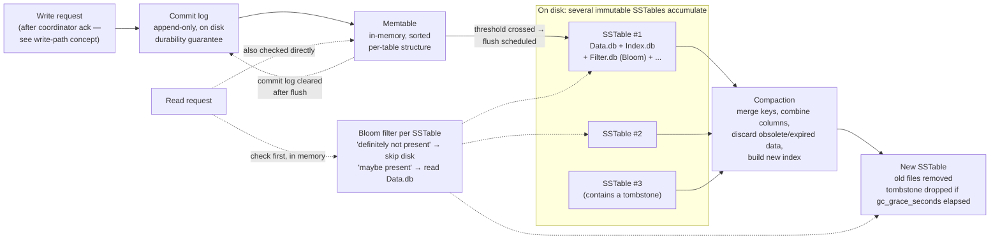

## Objective

Descer uma camada abaixo do caminho de escrita e entender a maquinaria real em disco que torna verdadeiras as promessas de velocidade e durabilidade do Cassandra: como uma memtable acumula escritas em memória, como ela se torna uma SSTable imutável, por que SSTables então precisam ser mescladas de volta através de compaction, e como um Bloom filter permite que uma leitura pule uma SSTable completamente, sem tocar disco. O conceito companheiro sobre o caminho de escrita já traçou *quando* o commit log e a memtable são tocados durante uma escrita; este conceito explica *o que essas estruturas são*, o que acontece com elas depois que o cliente já foi informado do "sucesso", e o que custa mantê-las rápidas de ler ao longo do tempo.

## Use Cases

- Explicar, a alguém lendo uma tabela `system.compaction_history` ou uma saída de `nodetool compactionstats` pela primeira vez, por que a compaction está rodando de forma alguma e por que não é manutenção opcional.
- Diagnosticar um nó com latência de leitura degradando e alto uso de disco: o sintoma clássico de uma estratégia de compaction que não combina mais com o padrão de escrita/leitura da tabela, ou de compaction ficando atrasada sob pressão sustentada de escrita.
- Decidir se uma tabela precisa de `SizeTieredCompactionStrategy`, `LeveledCompactionStrategy`, ou `TimeWindowCompactionStrategy`, baseado em se é intensiva em escrita, intensiva em leitura, ou dados de série temporal, e saber que trade-off cada escolha faz.
- Ler o diretório de dados de um nó durante um incidente e reconhecer que muitos arquivos `Data.db` pequenos para uma tabela não é corrupção, é exatamente como um motor de armazenamento LSM-tree deveria parecer entre execuções de compaction.
- Explicar a um engenheiro de banco de dados relacional por que uma leitura no Cassandra precisa checar múltiplas SSTables e uma memtable para uma única partição, e por que Bloom filters existem especificamente para tornar a maioria dessas checagens de graça.
- Decidir se `gc_grace_seconds` precisa mudar para uma tabela com muitas deleções, e entender por que tombstones não podem simplesmente ser deletadas da memtable no instante em que um `DELETE` roda.

## Deep Dive

### Memtables: o buffer de escrita em memória

O conceito companheiro do caminho de escrita já estabeleceu a sequência do ponto de vista do coordenador: commit log primeiro, depois memtable, depois uma resposta ao cliente com o flush deliberadamente adiado. Este conceito é sobre o que "depois a memtable" de fato significa como uma estrutura de dados.

"Depois de ser escrito no commit log, o valor é escrito em uma estrutura de dados residente em memória chamada memtable. Cada memtable contém dados para uma tabela específica." O Cassandra antigo mantinha memtables inteiramente no heap da JVM; "melhorias a partir da versão 2.1 moveram parte do dado de memtable para memória nativa, com opções de configuração para especificar a quantidade de memória on-heap e nativa disponível. Isso torna o Cassandra menos suscetível a flutuações de performance devido ao garbage collection do Java." Memtables são implementadas por `org.apache.cassandra.db.Memtable`.

Uma memtable não é um único objeto por tabela em um dado momento: "quando o número de objetos armazenados na memtable atinge um limiar, o conteúdo da memtable é descarregado em disco em um arquivo chamado SSTable. Uma nova memtable é então criada. Esse descarregamento é uma operação não bloqueante; múltiplas memtables podem existir para uma única tabela, uma atual e o resto esperando para ser descarregado." Isso importa para leituras: "em leituras, o Cassandra vai ler tanto SSTables quanto memtables para encontrar valores de dado, já que a memtable pode conter valores que ainda não foram descarregados para disco." Uma leitura para uma linha escrita recentemente pode precisar checar a memtable ativa, qualquer memtable ainda na fila para descarregar, e toda SSTable relevante em disco, que é precisamente o custo que Bloom filters existem para reduzir.

### O flag de bit do commit log, e durable_writes

O conceito de caminho de escrita cobre a sequência commit-log-depois-memtable e a garantia de recuperação de falha em detalhe. Uma peça mecânica que vale a pena adicionar aqui: "cada commit log mantém um flag de bit interno para indicar se precisa de flush... Existe apenas um flag de bit por tabela, porque apenas um commit log está sendo escrito em todo o servidor a qualquer momento. Todas as escritas para todas as tabelas vão para o mesmo commit log, então o flag de bit indica se um commit log em particular contém algo que não foi descarregado para uma tabela em particular. Uma vez que a memtable foi adequadamente descarregada para disco, o flag de bit do commit log correspondente é definido como 0."

Esse também é onde a propriedade de keyspace vista pela primeira vez ao rodar `DESCRIBE KEYSPACE` de fato faz algo: "a propriedade `durable_writes` controla se o Cassandra vai usar o commit log para escritas nas tabelas do keyspace. Esse valor tem padrão `true`... definir o valor como `false` aumenta a velocidade das escritas, mas também arrisca perder dados se o nó cair antes de o dado ser descarregado das memtables para as SSTables." Desligá-lo troca exatamente a garantia de recuperação de falha que o commit log existe para fornecer.

### SSTables: imutáveis, ordenadas, apenas de anexação

"Uma vez que uma memtable é descarregada para disco como uma SSTable, ela é imutável e não pode ser alterada pela aplicação." O nome é uma herança do Bigtable: "o termo 'SSTable' originou no Google Bigtable como uma compactação de 'Sorted String Table.' O Cassandra toma emprestado esse termo, mesmo não armazenando dados como strings em disco."

Imutabilidade é toda a razão pela qual escritas no Cassandra são rápidas, o mesmo fato que o conceito de caminho de escrita afirma do lado da escrita ("escrever dados é muito rápido no Cassandra, porque seu design não exige realizar leituras ou seeks de disco"). Aqui está a razão mecânica de por que: "todas as escritas são sequenciais, que é a principal razão pela qual escritas performam tão bem no Cassandra. Nenhuma leitura ou seek de qualquer tipo é exigida para escrever um valor no Cassandra, porque todas as escritas são operações de anexação (append). Isso torna a velocidade do seu disco uma limitação chave de performance." Uma SSTable nunca é editada no lugar; atualizações e deleções são novos valores anexados que são reconciliados depois, no momento da leitura e no momento da compaction, nunca no momento da escrita. "Se o Cassandra ingenuamente inserisse valores onde eles em última análise pertenciam, clientes escrevendo pagariam por seeks antecipadamente."

Cada SSTable é um conjunto de arquivos, não um arquivo. O conceito de caminho de escrita documenta os arquivos componentes na íntegra (`Data.db`, `Index.db`, `Summary.db`, `Filter.db`, `CompressionInfo.db`, `Digest.crc32`, `Statistics.db`, `TOC.txt`) e o esquema de nomenclatura `<version>-<generation>-<implementation>-<component>.db`: vale uma referência cruzada rápida em vez de repetir aqui, exceto pela única linha que mais importa para este conceito: `Filter.db` é o Bloom filter, e ele é carregado em memória, não lido do disco a cada query.

### Bloom filters: checagens rápidas, não determinísticas, de "definitivamente não está aqui"

"Bloom filters são usados para impulsionar a performance de leituras. Recebem o nome de seu inventor, Burton Bloom. Bloom filters são algoritmos muito rápidos, não determinísticos, para testar se um elemento é membro de um conjunto. São não determinísticos porque é possível obter uma leitura de falso-positivo de um Bloom filter, mas não um falso-negativo." Essa assimetria é toda a proposta de valor: um Bloom filter pode dizer errado "talvez presente", mas nunca pode dizer errado "não presente".

Mecanicamente, "Bloom filters funcionam mapeando os valores em um conjunto de dados em um array de bits e condensando um conjunto de dados maior em uma string digest usando uma função de hash. O digest, por definição, usa uma quantidade muito menor de memória do que o dado original usaria. Os filtros são armazenados em memória e são usados para melhorar performance reduzindo a necessidade de acesso a disco em buscas de chave. Acesso a disco é tipicamente muito mais lento do que acesso a memória. Então, de certa forma, um Bloom filter é um tipo especial de key cache."

O ganho no momento da leitura: "o Cassandra mantém um Bloom filter para cada SSTable. Quando uma query é realizada, o Bloom filter é checado primeiro, antes de acessar disco. Como falsos-negativos não são possíveis, se o filtro indica que o elemento não existe no conjunto, ele certamente não existe; mas se o filtro acha que o elemento está no conjunto, o disco é acessado para ter certeza." Para uma partition key que existe em apenas 2 das 40 SSTables de uma tabela, a checagem do Bloom filter é o que transforma "varrer 40 arquivos" em "varrer aproximadamente 2 arquivos, pular 38 em memória." A precisão é ajustável por tabela: "o Cassandra fornece a capacidade de aumentar a precisão do Bloom filter (reduzindo o número de falsos-positivos) aumentando o tamanho do filtro, ao custo de mais memória. Essa chance de falso-positivo é ajustável por tabela." Bloom filters são implementados por `org.apache.cassandra.utils.BloomFilter`, e a técnica não é específica do Cassandra: "Bloom filters são usados em outras tecnologias de banco de dados distribuído e cache, incluindo Apache Hadoop, Google Bigtable, e o Squid proxy cache."

### Compaction: mesclando arquivos imutáveis de volta juntos

SSTables imutáveis e apenas de anexação resolvem o problema de escrita e criam o problema de leitura: com o tempo, o dado de uma partição se espalha por mais e mais arquivos, e valores obsoletos ou sobrescritos se acumulam. Compaction é o contrapeso. "Como já discutimos, SSTables são imutáveis, o que ajuda o Cassandra a atingir velocidades de escrita tão altas. No entanto, compaction periódica dessas SSTables é importante para suportar performance rápida de leitura e limpar valores de dado obsoletos. Uma operação de compaction no Cassandra é realizada para mesclar SSTables. Durante a compaction, o dado nas SSTables é mesclado: as chaves são mescladas, colunas são combinadas, valores obsoletos são descartados, e um novo índice é criado."

O livro tem o cuidado de descrever isso como uma separação de responsabilidades, em vez de um imposto sobre escritas: "compaction pretende amortizar a reorganização de dados, mas usa I/O sequencial para fazer isso. Então o benefício de performance é obtido pela separação; a operação de escrita é apenas uma anexação imediata, e então a compaction ajuda a organizar para melhor performance de leitura futura." O resultado é escrito como uma única SSTable nova: "o dado mesclado é ordenado, um novo índice é criado sobre o dado ordenado, e o dado recém-mesclado, ordenado e indexado é escrito em uma única nova SSTable... esse processo é gerenciado pela classe `org.apache.cassandra.db.compaction.CompactionManager`." Também é o que mantém leituras limitadas: "outra função importante da compaction é melhorar a performance reduzindo o número de seeks necessários. Existe um número limitado de SSTables para inspecionar para encontrar o dado de coluna para uma dada chave. Se uma chave é frequentemente mutada, é muito provável que as mutações vão acabar todas em SSTables descarregadas. Compactá-las evita que o banco de dados precise realizar um seek para puxar o dado de cada SSTable."

Nada disso é grátis enquanto roda: "quando a compaction é realizada, há um pico temporário de I/O de disco e do tamanho do dado em disco, enquanto SSTables antigas são lidas e novas SSTables estão sendo escritas."

**Escolhendo uma estratégia.** "O Cassandra suporta múltiplos algoritmos para compaction via o padrão strategy. A estratégia de compaction é uma opção que é definida para cada tabela", e cada uma estende `AbstractCompactionStrategy`:

- **`SizeTieredCompactionStrategy` (STCS)**: "a estratégia de compaction padrão e é recomendada para tabelas intensivas em escrita."
- **`LeveledCompactionStrategy` (LCS)**: "recomendada para tabelas intensivas em leitura."
- **`TimeWindowCompactionStrategy` (TWCS)**: "pensada para dados de série temporal ou de outra forma baseados em data."

O repair complica um pouco esse quadro: "a anticompaction foi adicionada na 2.1. Como o nome sugere, anticompaction é de certa forma uma operação oposta à compaction regular, no sentido de que o resultado é a divisão de uma SSTable em duas SSTables, uma contendo dado reparado, e a outra contendo dado não reparado." O trade-off, nas próprias palavras do livro: "mais complexidade é introduzida nas estratégias de compaction, que precisam lidar com SSTables reparadas e não reparadas separadamente, para que não sejam mescladas juntas."

Existe também uma opção manual, desencorajada: "o `nodetool` expõe uma operação administrativa chamada major compaction (também conhecida como compaction completa) que consolida múltiplas SSTables em uma única SSTable. Embora esse recurso ainda esteja disponível... seu uso é na verdade desencorajado em ambientes de produção, já que tende a limitar a capacidade do Cassandra de remover dado obsoleto."

### Tombstones: por que deleções não podem simplesmente deletar

Deleção interage tanto com o motor de armazenamento quanto com o modelo de repair distribuído do Cassandra. "Como um nó pode estar fora do ar ou inacessível quando um dado é deletado, esse nó pode perder uma deleção. Quando esse nó volta a ficar online depois e ocorre um repair, o nó pode 'ressuscitar' o dado que tinha sido previamente deletado, compartilhando-o novamente com outros nós." Para prevenir isso, "o Cassandra usa um conceito chamado tombstone. Um tombstone é um marcador mantido para indicar dado que foi deletado. Quando você executa uma operação de deleção, o dado não é imediatamente deletado. Em vez disso, é tratado como uma operação de atualização que coloca um tombstone no valor": mecanicamente indistinguível de qualquer outra escrita, ele passa pelo mesmo caminho commit-log-depois-memtable de um `INSERT` ou `UPDATE`.

Tombstones expiram em um relógio por tabela: "existe uma configuração por tabela chamada `gc_grace_seconds`... que representa a quantidade de tempo que os nós vão esperar para coletar (ou compactar) tombstones. Por padrão, é definida como 864.000 segundos, o equivalente a 10 dias... o propósito desse atraso é dar a um nó que está indisponível tempo para se recuperar; se um nó fica fora do ar mais tempo do que esse valor, então deveria ser tratado como falho e substituído." Tombstones só são de fato removidos como efeito colateral da compaction: são dado comum até então, e são lidos, mesclados, e reescritos junto com tudo o mais até que `gc_grace_seconds` tenha passado.

### O padrão a que tudo isso pertence: LSM-trees

Memtable, commit log, SSTable, compaction, e Bloom filter não são cinco recursos não relacionados do Cassandra: são o vocabulário padrão de uma estrutura de dados bem conhecida. "O design básico do motor de armazenamento do Cassandra que descrevemos neste capítulo é compartilhado com vários outros bancos de dados modelados a partir do paper do Google Bigtable, que ele mesmo se inspira no paper de 1996 de Patrick O'Neil et al., 'The Log-Structured Merge-Tree (LSM-Tree).' ... A ideia básica do design é que o dado é armazenado primeiro em memória e depois, com o tempo, é cascateado, ou mesclado em um ou mais estágios de arquivos em disco usando um algoritmo de merge-sort. O design originalmente pretendia aproveitar o fato de que escritas sequenciais em disco giratório são mais rápidas do que acesso aleatório, embora funcione igualmente bem em armazenamento moderno baseado em SSD."

"O paper do Bigtable introduziu os termos memtable e SSTable para os componentes em memória e em disco do padrão, e estabeleceu elementos de design comuns, incluindo o armazenamento inicial de dado em memtables, o uso de um write-ahead log para durabilidade, o armazenamento periódico de dado ordenado em disco em SSTables imutáveis, o uso de memtables e Bloom filters para indexar em SSTables para leituras rápidas, e compaction como um processo em segundo plano para consolidar SSTables. Bancos de dados que se conformam a esse padrão são comumente chamados de bancos de dados LSM-Tree e incluem tanto motores de armazenamento simples como RocksDB e LevelDB, quanto bancos de dados distribuídos como Cassandra e HBase. Bancos de dados LSM-Tree são conhecidos por seu alto throughput de escrita devido ao modelo de armazenamento apenas de anexação. Leituras não são tão rápidas, mas são ajudadas pelo uso de Bloom filters e índices de SSTable." Essa última frase é o trade-off sobre o qual este conceito inteiro realmente trata, dito em uma linha: escritas são baratas porque nada nunca é editado no lugar; leituras pagam por isso com maquinaria extra (Bloom filters, índices, e compaction) cujo trabalho inteiro é tornar o custo de "dado espalhado por muitos arquivos imutáveis" tolerável.

O diagrama abaixo traça uma escrita através do ciclo de vida completo do motor de armazenamento: anexação ao commit log, inserção na memtable, o flush agendado que produz uma SSTable, e uma compaction posterior que mescla várias SSTables (incluindo uma carregando um tombstone) em uma.

### Book vs today

A mecânica central (memtable, commit log, imutabilidade de SSTable, Bloom filters, e compaction como uma mescla amortizada em segundo plano) permanece inalterada no Apache Cassandra atual e não vai a lugar nenhum; são a definição do design LSM-tree que o livro nomeia explicitamente. Uma peça da história de compaction mudou desde a 3ª edição revisada (que visa a 4.0):

> **O Cassandra 5.0 adicionou uma quarta opção de compaction, `UnifiedCompactionStrategy` (UCS), mas é opt-in, não um substituto.** O livro apresenta STCS, LCS, e TWCS como três estratégias separadas entre as quais você escolhe por tabela, cada uma com seus próprios botões de ajuste e seu próprio perfil de trade-off. Segundo o [próprio anúncio de recurso da 5.0 do projeto Apache Cassandra](https://cassandra.apache.org/_/blog/Apache-Cassandra-5.0-Features-Unified-Compaction-Strategy.html), o UCS "combina os benefícios das estratégias de compaction em camadas e em níveis, ao mesmo tempo em que adiciona capacidades de sharding", permitindo que uma única estratégia abranja tanto o extremo estilo STCS quanto o estilo LCS do espectro através de uma configuração `scaling_parameters` (por exemplo, `T8, T4, N, L4` mistura comportamento em camadas e em níveis por nível), em vez de exigir uma troca manual de estratégia quando a carga de trabalho de uma tabela muda. É habilitado por tabela com `ALTER TABLE ... WITH compaction = {'class': 'UnifiedCompactionStrategy', ...}`; `SizeTieredCompactionStrategy` permanece o padrão de fábrica. Em outras palavras: o modelo mental de três estratégias mais anticompaction do livro ainda é exatamente como um cluster 5.0 não modificado se comporta, mas um time lutando contra o clássico problema de "estratégia errada para esta carga de trabalho" agora tem uma quarta opção, mais flexível, em vez de uma migração forçada entre STCS/LCS/TWCS.

## Trade-offs

- **A história inteira de velocidade de escrita é paga por complexidade do lado da leitura, e essa troca é explícita, não incidental.** SSTables imutáveis, apenas de anexação, são o que permite ao Cassandra pular seeks de disco em toda escrita; o preço é que o valor atual de uma única partição pode estar espalhado por uma memtable e várias SSTables, e uma leitura precisa reconciliar todas elas. Bloom filters, compaction, e (segundo o conceito de caminho de escrita) toda a maquinaria de hinted-handoff/read-repair existem especificamente para tornar essa reconciliação barata. Julgue a latência de leitura do Cassandra contra esse design, não contra a leitura de seek único de um banco de dados B-tree.
- **Bloom filters trocam memória por I/O de disco, e a taxa de falso-positivo é um botão real.** Um filtro maior encolhe falsos-positivos (casos onde o filtro diz "talvez" e o Cassandra paga uma leitura de disco à toa), mas todo byte de filtro é memória retida por SSTable, permanentemente, esteja a tabela sob carga ou não. Uma tabela com muitas SSTables pequenas por uma agenda de compaction atrasada paga esse custo em duplicidade: mais filtros em memória, e pior, mais deles individualmente consultados por leitura.
- **Escolher a estratégia de compaction errada é um descompasso de carga de trabalho que aparece como leituras degradando de forma constante, não uma queda.** STCS em uma tabela intensiva em leitura permite que partições se espalhem por um número amplo e imprevisível de SSTables, já que só mescla arquivos de tamanho semelhante entre si; LCS em uma tabela intensiva em escrita causa muito mais I/O de compaction do que STCS, porque reorganiza constantemente em níveis sem sobreposição. TWCS é correta para dados de série temporal especificamente porque escritas em buckets de tempo raramente precisam ser mescladas com buckets antigos de forma alguma; usá-la em dados que não são de série temporal perde esse benefício completamente. Não existe um padrão universalmente correto; `SizeTieredCompactionStrategy` ser o padrão de fábrica é um viés otimizado para escrita, não um endosso para toda tabela.
- **A própria compaction é um pico de recurso para o qual você precisa planejar capacidade, não um não evento em segundo plano.** "Um pico temporário de I/O de disco e do tamanho do dado em disco" é a própria descrição do livro: um nó precisa de folga de disco livre suficiente para segurar SSTables antigas e novas simultaneamente no meio da compaction, e largura de banda de I/O de sobra suficiente para que a compaction não esfome leituras concorrentes de cliente. Um cluster provisionado exatamente para seu uso de disco em regime permanente, sem folga de compaction, é um cluster que eventualmente não vai conseguir compactar de forma alguma.
- **Tombstones convertem deleções em um problema em câmera lenta se `gc_grace_seconds` e o volume de deleção estiverem desalinhados.** Um tombstone é dado comum até envelhecer o suficiente e ser compactado para fora: é lido, mesclado, e reescrito como qualquer outro valor por até 10 dias por padrão. Uma carga de trabalho com deleções pesadas e frequentes nas mesmas partições (o antipadrão clássico de Cassandra-como-fila) acumula tombstones mais rápido do que a compaction os limpa, e leituras nessas partições ficam mais lentas varrendo além do dado deletado que ainda não envelheceu o suficiente. Reduzir `gc_grace_seconds` encolhe essa janela, mas também encolhe o tempo que um nó inacessível tem para se recuperar antes que uma deleção possa ressuscitar nele: o trade-off é explícito no próprio propósito da configuração.
- **Anticompaction compra repair incremental correto ao custo de dobrar a contabilidade de SSTable que as estratégias de compaction precisam fazer.** Dividir cada SSTable em metades reparada e não reparada evita que dado reparado seja desnecessariamente reverificado, mas toda estratégia de compaction agora precisa raciocinar sobre duas populações de SSTables, em vez de uma, e não pode mesclar através dessa fronteira. Este é um caso em que um recurso que melhora uma preocupação operacional (custo de repair) adiciona complexidade estrutural a outra (compaction).

## Documentation Links

- [Jeff Carpenter and Eben Hewitt, "Cassandra: The Definitive Guide", Revised 3rd Edition (O'Reilly, 2022), Chapter 6, "The Cassandra Architecture" ("Memtables, SSTables, and Commit Logs" through "Storage Engine")](https://www.oreilly.com/library/view/cassandra-the-definitive/9781492097143/) - doc
- [Apache Cassandra Documentation, Storage Engine (commit log, memtables, SSTables)](https://cassandra.apache.org/doc/latest/cassandra/architecture/storage-engine.html) - doc
- [Apache Cassandra Documentation, Compaction](https://cassandra.apache.org/doc/latest/cassandra/operating/compaction/index.html) - doc
- [Apache Cassandra Blog, Apache Cassandra 5.0 Features: Unified Compaction Strategy](https://cassandra.apache.org/_/blog/Apache-Cassandra-5.0-Features-Unified-Compaction-Strategy.html) - doc
- [Apache Cassandra Documentation, Bloom Filters](https://cassandra.apache.org/doc/latest/cassandra/operating/bloom_filters.html) - doc
- [Apache Cassandra Documentation, Compaction: Tombstones and gc_grace_seconds](https://cassandra.apache.org/doc/latest/cassandra/operating/compaction/index.html#tombstones-and-compaction) - doc
