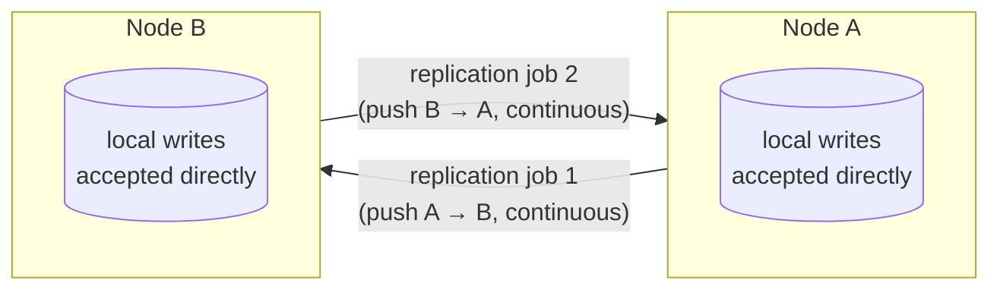

## Objective

Understand the two features that make CouchDB behave less like a single database and more like a node in a fleet of independent, eventually-consistent peers: **replication** and the **Changes API**. As the book puts it, "some other databases we've looked at maintain a single master node to guarantee consistency. Still others ensure it with a quorum of agreeing nodes. CouchDB does neither of these; instead, it supports something called multi-master or master-master replication," where "each CouchDB server is equally able to receive updates, respond to requests, and delete data, regardless of whether it's able to connect to any other server." That's a genuinely different HA model from the primary/replica setups this database-concepts track already covers elsewhere (MongoDB's replica sets, Redis Sentinel's failover) — there is no designated primary to fail over from, and no node has to ask permission from any other node before accepting a write. Layered on top of that is the **Changes API** — an HTTP feed (`_changes`) of every document mutation in a database, offered as polling, long-polling, or a truly continuous stream — which is both the mechanism replication itself is built on internally and a general-purpose tool applications can tap directly to stay in sync with a CouchDB database in near real time. This concept covers how replication is actually wired up (one-shot vs. continuous, ad hoc vs. persisted via the `_replicator` database), what "multi-master" precisely does and doesn't guarantee, how the resulting conflicts get surfaced for an application to resolve, and the three flavors of the Changes API. It builds directly on the sibling `couchdb-document-model-and-mvcc` concept's `_rev`/MVCC mechanics — that concept explains how a document's revision tree works; this one explains what happens when two independently-edited revision trees collide during replication.

## Use Cases

- **Offline-first and mobile/edge applications** — a phone, browser tab, or field device keeps a local CouchDB-protocol database, accepts writes even while completely disconnected, and replicates in both directions once connectivity returns. This is precisely the workflow PouchDB (see Deep Dive) exists to make trivial for JavaScript apps, and it is CouchDB's most distinctive real-world niche.
- **Multi-datacenter deployments with no single point of write failure** — because "each CouchDB server is equally able to receive updates... regardless of whether it's able to connect to any other server," a write in one datacenter never has to wait for, or be rejected by, a remote node's approval. Contrast this with a primary-based system where writes to a downed primary simply fail until a new primary is elected.
- **Feeding a search index or cache from a live change stream** — the book's own framing: "Imagine a multidatabase system where data is streaming in from several directions and other systems need to be kept up-to-date. Examples might include a search engine backed by Lucene or ElasticSearch or a caching layer implemented using memcached or Redis." The Changes API is the CouchDB-native way to drive exactly that kind of downstream synchronization, without polling application tables for "what changed."
- **Selective, filtered replication or sync** — replicating (or watching changes for) only documents matching a filter function or a Mango-style `_selector`, such as "only this user's documents" or "only documents tagged for offline caching on this device" — the mechanism a mobile sync architecture uses to avoid shipping an entire database to every client.
- **Triggering downstream workflows on data changes** — compaction jobs, remote backup scripts, or webhook-style notifications kicked off in response to the same change feed, since (per the book) "this simple API opens up a world of possibilities."

## Deep Dive

### What "multi-master" actually means — and what a single replication job actually does

It's worth being precise here, because the book's "multi-master" framing describes the *deployment model*, not the mechanics of one replication job. According to the current Apache CouchDB replication protocol documentation, an individual replication is **unidirectional**: it names a Source and a Target, and copies changes one way — "push" sends local-to-remote, "pull" pulls remote-to-local. There is no single API call that makes two databases bidirectionally sync as one operation.

What makes the *system* multi-master is that (a) any node can independently accept writes at any time, replication or no replication, and (b) true two-way sync is achieved simply by running two one-shot or continuous replication jobs in opposite directions — pointing A's replicator at B and B's replicator at A. Nothing about that requires a designated primary, and nothing prevents either side from being written to directly while disconnected. The book's own walkthrough demonstrates this without ever running a job in both directions at once: it replicates `music` → `music-repl`, then edits *both* databases directly and independently, and only the next `music` → `music-repl` run has to reconcile the resulting divergence. The conflict isn't a replication bug — it's the expected, designed-for consequence of every node being writable.

### Setting up replication: ad hoc vs. continuous, and the `_replicator` database

The simplest way to replicate is a single HTTP call (or the equivalent Fauxton "Replicate" button): `POST /_replicate` with a JSON body naming `source`, `target`, and optionally `"continuous": true`. Leaving `continuous` unset — what the book calls triggering it from the Replication page with the Continuous checkbox unchecked — performs a one-shot sync of everything currently different between the two databases, then stops. Checking `continuous` instead keeps the replication job running indefinitely, picking up new changes as they land on the source, functionally subscribing the target to the source's Changes feed forever.

Ad hoc replication like this doesn't survive a server restart or get automatically retried — it's fire-and-forget. For anything production-grade, CouchDB offers the `_replicator` database: any document written into (a database named) `_replicator` is interpreted as a replication job description (same `source`/`target`/`continuous` fields as the ad hoc API), and CouchDB manages its lifecycle from there — starting it, restarting it after a server restart unless it already completed or failed, and stopping it the moment the triggering document is deleted. In a cluster, the current documentation notes that "replication jobs are balanced evenly among all the nodes such that a replication job runs on only one node at a time," which is how persistent replication topologies (including full bidirectional multi-master meshes made of several one-way jobs) are actually operated rather than kicked off by hand from Fauxton every time.

### How conflicts are detected and surfaced

This is where replication meets the `_rev`/MVCC mechanics the sibling `couchdb-document-model-and-mvcc` concept covers in depth — that concept is the place to look for how revision trees, `_rev` strings, and deleted/leaf revisions work generally; here we only cover what happens when two of those revision trees, built independently on different nodes, meet during a sync.

The book's demonstration: a document is replicated to both `music` and `music-repl` at revision `1-e007...`. Each database is then updated *independently* from that same base revision — `music-repl` adds one album, `music` adds a different one — producing two different revision-2 documents that both legitimately descend from the same parent. Replicating again does not fail or block: "It turns out that CouchDB basically just picks one and calls that one the winner. Using a deterministic algorithm, all CouchDB nodes will pick the same winner when a conflict is detected." Critically, the losing revision is not discarded — "CouchDB stores the unselected 'loser' documents as well so that a client application can review the situation and resolve it at a later date."

A plain `GET` on the document returns only the winner. Adding `?conflicts=true` reveals the rest: the winning document's `_conflicts` array lists the losing revision IDs, which can then be fetched individually with `?rev=<id>`. And the book is explicit that CouchDB will never attempt this resolution for you: "CouchDB does not try to intelligently merge conflicting changes. How you should merge two documents is highly application specific, and a general solution isn't practical." Its calendar-event example makes the point concretely — two independently updated venue fields for the same event, replicated together, and CouchDB can only make the two copies *consistent* (same winner picked everywhere), never tell you which venue is actually correct. That decision is left entirely to application code inspecting `_conflicts`.

### The Changes API: three ways to watch a database

`GET /{db}/_changes` is the endpoint. With no parameters it dumps every change since the database's creation, each entry naming the document `id`, the resulting `rev`, and a `seq` (sequence token) marking that change's position in the database's change history. Passing `since=<seq>` resumes from a known point instead of replaying everything — "you're more likely to want the changes that have occurred since you last checked" — and `include_docs=true` inlines the full document body alongside each change record instead of just its id/rev.

The book covers three feed modes, and a fourth exists today:

| Feed | Behavior |
|---|---|
| `feed=normal` (default, "polling") | Returns everything currently available as one JSON object, then closes the connection. Client re-polls periodically. Fine when "updates are relatively rare" — the book's example is polling blog entries every five minutes. |
| `feed=longpoll` | Leaves the HTTP connection open, waiting, until at least one new change occurs — then delivers the same JSON shape as `normal` and closes. Better latency than polling without needing an unbounded open stream; works fine for browser clients. |
| `feed=continuous` | Never closes the connection at all — instead of one JSON array, each change is written as its own line-delimited JSON object the instant it happens, and the stream just keeps going. Lowest latency and no reconnect overhead, but "the output isn't straight JSON," and per the book "it's not a good fit if your client is a web browser" (a browser's fetch/XHR often won't surface partial streamed data until the connection ends). |
| `feed=eventsource` | Not in the book (added since), formats the same continuous stream per the W3C Server-Sent Events spec specifically so browsers *can* consume it incrementally via the native `EventSource` API — effectively closing the "continuous doesn't suit browsers" gap the book calls out. |

Each mode is exactly the delivery-mechanics choice it looks like: `normal`/`longpoll` produce parseable JSON and close, `continuous`/`eventsource` stay open and stream line-by-line — the tradeoff is connection overhead versus parsing convenience, not different data.

### Filtering the feed

By default `_changes` reports every mutation in the database. A filter narrows that down. The book's mechanism is a JavaScript filter function stored in a design document — `function(doc, req) { return doc.country === req.query.country; }` — invoked with `?filter=<design-doc>/<filter-name>&country=RUS`. This still works today, but current CouchDB documentation recommends `_selector` filters (Mango-style query objects, the same JSON query syntax `_find` uses) as "significantly more efficient than using a JavaScript filter function," since a JS filter function has to actually execute per-document in the CouchDB JS engine, while a selector is evaluated by the query engine directly. `_doc_ids` (filter to an explicit id list) and `_design`/`_view` filters (repurposing existing design docs or map functions) round out the built-in options.

### Book vs. today

- **The core replication protocol is unchanged in spirit.** Per the current (CouchDB 3.5) replication protocol docs, one-shot vs. continuous, push vs. pull, and Source/Target framing all still describe replication accurately in 2026. What's evolved is mostly efficiency: a `seq_interval` parameter was added to reduce checkpoint overhead on heavily-sharded clusters, and the `_selector` filter (Mango syntax) is now the recommended way to filter both `_changes` and replication jobs, ahead of writing a JS filter function.
- **CouchDB's own clustering has matured well past the book's aside.** The book flags CouchDB 2.0's then-new native clustering (choosing a replication factor per write, storing documents on only some cluster nodes rather than every node holding everything) as out of scope. That model is now the default, long-stable clustering architecture in CouchDB 3.x, with quorum-style read/write settings (`r`/`w` parameters) sitting *underneath* — and orthogonal to — the inter-database replication this concept describes.
- **`feed=eventsource` exists now and specifically targets the book's own stated weakness.** The book calls out that continuous feeds are awkward for browser clients; `eventsource` (a W3C Server-Sent Events–formatted variant of the continuous feed) closes exactly that gap.
- **PouchDB — the most common real-world Changes API consumer — is not just alive, it moved to the Apache Software Foundation.** PouchDB is a JavaScript, CouchDB-protocol-compatible database that runs in browsers, Node.js, and mobile apps and syncs directly against CouchDB (or any CouchDB-compatible server) using exactly the replication protocol and Changes API described above. As of 2026 it is **Apache PouchDB**, undergoing ASF Incubation, with an active 9.0.0 release line (200+ merged PRs) and ongoing feature work (e.g., a `nodesqlite` storage adapter). It remains the de facto standard building block for offline-first web and mobile apps that need exactly the sync model this concept covers.

Two independent, unidirectional replication jobs running in opposite directions — this is what "multi-master" looks like in practice. Neither node is a designated primary; each keeps accepting direct writes regardless of whether the other is reachable, and each job is just an ordinary replication using the Changes feed under the hood.

## Trade-offs

- **Multi-master buys availability at the cost of automatic consistency.** No node ever has to reject or delay a write waiting for another node's approval, which is exactly what makes CouchDB tolerant of partitions and offline clients — but it also means conflicting writes are a normal, expected occurrence rather than an edge case, and CouchDB deliberately refuses to guess how to merge them. Any application built on CouchDB replication has to budget real engineering effort for conflict handling; there's no configuration flag that makes this someone else's problem.
- **Ad hoc replication (`POST /_replicate` or the Fauxton button) is simple but not durable.** It's the right tool for one-off migrations or manual testing. Anything meant to run continuously in production belongs in the `_replicator` database instead, where CouchDB tracks the job's lifecycle and restarts it automatically — the operational difference between "a script someone has to remember to rerun" and "a managed, cluster-balanced job."
- **`continuous`/`eventsource` feeds minimize latency and reconnect overhead but complicate parsing** — the payload is a stream of independent JSON lines rather than one parseable document, so a client has to buffer and split on newlines itself. `normal`/`longpoll` trade a bit of latency for a response that's just... JSON.
- **JavaScript filter functions are flexible but comparatively expensive; `_selector` is fast but declarative-only.** A filter function can express arbitrary logic (including `req.userCtx`-based access checks), at the cost of running actual JS per document. A `_selector` filter is limited to Mango query expressiveness but is evaluated far more efficiently — prefer it whenever the filtering logic is a straightforward field match rather than genuinely custom logic.
- **Winner-takes-one conflict resolution is deterministic but not "correct."** Every node picking the same winner keeps the *cluster* consistent with itself, which is the guarantee CouchDB actually makes. It says nothing about which value is semantically right — that's an application-level decision every conflict-prone schema needs a real UI or workflow for, not an afterthought.

## Documentation Links

- Luc Perkins, Eric Redmond, and Jim R. Wilson, "Seven Databases in Seven Weeks," 2nd Edition (Pragmatic Bookshelf, 2018) — Chapter 5, "CouchDB," Day 3
- [Apache CouchDB Documentation — Introduction to Replication](https://docs.couchdb.org/en/stable/replication/intro.html) — doc
- [Apache CouchDB Documentation — Replication Protocol](https://docs.couchdb.org/en/stable/replication/protocol.html) — doc
- [Apache CouchDB Documentation — Replicator Database](https://docs.couchdb.org/en/stable/replication/replicator.html) — doc
- [Apache CouchDB Documentation — Changes Feed (`_changes`)](https://docs.couchdb.org/en/stable/api/database/changes.html) — doc
- [Apache PouchDB — the JavaScript Database that Syncs](https://pouchdb.apache.org/) — doc
