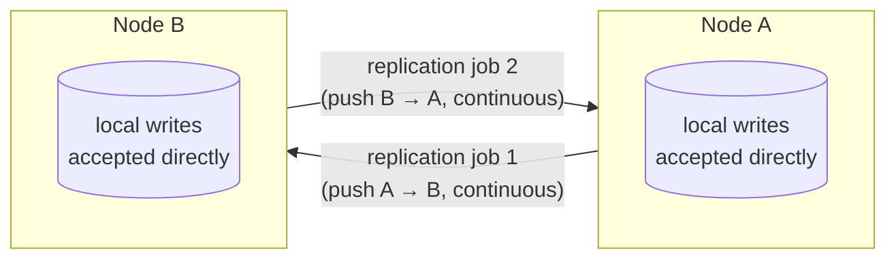

## Objective

Entender os dois recursos que fazem o CouchDB se comportar menos como um único banco de dados e mais como um nó em uma frota de pares independentes, eventualmente consistentes: **replicação** e a **Changes API**. Como o livro coloca, "alguns outros bancos de dados que vimos mantêm um único nó mestre para garantir consistência. Outros ainda a garantem com um quorum de nós concordando. O CouchDB não faz nenhuma dessas duas coisas; em vez disso, ele suporta algo chamado replicação multi-master ou master-master", onde "todo servidor CouchDB é igualmente capaz de receber atualizações, responder a requisições, e deletar dados, independentemente de conseguir se conectar a qualquer outro servidor." Esse é um modelo de alta disponibilidade genuinamente diferente das configurações primário/réplica que esta trilha de conceitos de banco de dados já cobre em outro lugar (replica sets do MongoDB, failover do Redis Sentinel): não há um primário designado do qual fazer failover, e nenhum nó precisa pedir permissão a nenhum outro nó antes de aceitar uma escrita. Sobreposta a isso está a **Changes API**: um feed HTTP (`_changes`) de toda mutação de documento em um banco de dados, oferecido como polling, long-polling, ou um stream verdadeiramente contínuo, que é tanto o mecanismo sobre o qual a própria replicação é construída internamente quanto uma ferramenta de propósito geral que aplicações podem acessar diretamente para se manterem sincronizadas com um banco de dados CouchDB em quase tempo real. Este conceito cobre como a replicação é de fato conectada (única versus contínua, ad hoc versus persistida via o banco `_replicator`), o que "multi-master" precisamente garante e não garante, como os conflitos resultantes são expostos para uma aplicação resolver, e as três variantes da Changes API. Ele se constrói diretamente sobre a mecânica de `_rev`/MVCC do conceito irmão `couchdb-document-model-and-mvcc`: aquele conceito explica como a árvore de revisão de um documento funciona; este explica o que acontece quando duas árvores de revisão editadas independentemente colidem durante a replicação.

## Use Cases

- **Aplicações offline-first e mobile/edge**: um telefone, aba de navegador, ou dispositivo de campo mantém um banco de dados local no protocolo CouchDB, aceita escritas mesmo enquanto completamente desconectado, e replica em ambas as direções assim que a conectividade retorna. Este é precisamente o fluxo de trabalho que o PouchDB (veja Deep Dive) existe para tornar trivial para aplicações JavaScript, e é o nicho mais distintivo do CouchDB no mundo real.
- **Implantações multi-datacenter sem ponto único de falha de escrita**: porque "todo servidor CouchDB é igualmente capaz de receber atualizações... independentemente de conseguir se conectar a qualquer outro servidor", uma escrita em um data center nunca precisa esperar por, ou ser rejeitada pela, aprovação de um nó remoto. Compare com um sistema baseado em primário, onde escritas para um primário fora do ar simplesmente falham até que um novo primário seja eleito.
- **Alimentar um índice de busca ou cache a partir de um stream de mudança ao vivo**: o próprio enquadramento do livro: "imagine um sistema multi-banco de dados onde dado está fluindo de várias direções e outros sistemas precisam ser mantidos atualizados. Exemplos poderiam incluir um motor de busca apoiado em Lucene ou ElasticSearch, ou uma camada de cache implementada usando memcached ou Redis." A Changes API é a forma nativa do CouchDB de conduzir exatamente esse tipo de sincronização downstream, sem fazer polling em tabelas de aplicação por "o que mudou."
- **Replicação ou sincronização seletiva, filtrada**: replicar (ou observar mudanças de) apenas documentos correspondentes a uma filter function ou um `_selector` estilo Mango, como "só os documentos deste usuário" ou "só documentos marcados para cache offline neste dispositivo": o mecanismo que uma arquitetura de sincronização mobile usa para evitar enviar um banco de dados inteiro para todo cliente.
- **Disparar fluxos de trabalho downstream em mudanças de dado**: jobs de compaction, scripts remotos de backup, ou notificações estilo webhook disparadas em resposta ao mesmo feed de mudança, já que (segundo o livro) "essa API simples abre um mundo de possibilidades."

## Deep Dive

### O que "multi-master" de fato significa, e o que um job de replicação de fato faz

Vale a pena ser preciso aqui, porque o enquadramento "multi-master" do livro descreve o *modelo de implantação*, não a mecânica de um job de replicação. Segundo a documentação atual do protocolo de replicação do Apache CouchDB, uma replicação individual é **unidirecional**: ela nomeia um Source e um Target, e copia mudanças em uma direção: "push" envia local-para-remoto, "pull" puxa remoto-para-local. Não existe uma única chamada de API que faz dois bancos de dados sincronizarem bidirecionalmente como uma operação.

O que torna o *sistema* multi-master é que (a) qualquer nó pode aceitar escritas de forma independente a qualquer momento, com ou sem replicação, e (b) sincronização bidirecional real é obtida simplesmente rodando dois jobs de replicação (únicos ou contínuos) em direções opostas: apontando o replicador de A para B e o replicador de B para A. Nada nisso exige um primário designado, e nada impede que qualquer um dos lados seja escrito diretamente enquanto desconectado. O próprio percurso do livro demonstra isso sem nunca rodar um job em ambas as direções ao mesmo tempo: ele replica `music` → `music-repl`, então edita *ambos* os bancos de dados diretamente e independentemente, e só a próxima execução de `music` → `music-repl` precisa reconciliar a divergência resultante. O conflito não é um bug de replicação: é a consequência esperada, projetada, de todo nó ser gravável.

### Configurando replicação: ad hoc versus contínua, e o banco `_replicator`

A forma mais simples de replicar é uma única chamada HTTP (ou o botão equivalente "Replicate" do Fauxton): `POST /_replicate` com um corpo JSON nomeando `source`, `target`, e opcionalmente `"continuous": true`. Deixar `continuous` sem definir (o que o livro chama de disparar isso a partir da página de Replicação com a caixa Continuous desmarcada) realiza uma sincronização única de tudo que atualmente é diferente entre os dois bancos de dados, e então para. Marcar `continuous`, em vez disso, mantém o job de replicação rodando indefinidamente, pegando novas mudanças assim que aterrissam na source, funcionalmente inscrevendo o target no feed de Changes da source para sempre.

Replicação ad hoc como essa não sobrevive a um reinício de servidor nem é tentada novamente automaticamente: é dispare-e-esqueça. Para qualquer coisa de nível de produção, o CouchDB oferece o banco de dados `_replicator`: qualquer documento escrito dentro de (um banco de dados chamado) `_replicator` é interpretado como uma descrição de job de replicação (os mesmos campos `source`/`target`/`continuous` da API ad hoc), e o CouchDB gerencia seu ciclo de vida a partir daí: iniciando-o, reiniciando-o depois de um reinício de servidor, a menos que já tenha completado ou falhado, e parando-o no momento em que o documento disparador é deletado. Em um cluster, a documentação atual observa que "jobs de replicação são balanceados igualmente entre todos os nós, de forma que um job de replicação roda em apenas um nó de cada vez", que é como topologias de replicação persistentes (incluindo malhas multi-master bidirecionais completas feitas de vários jobs unidirecionais) são de fato operadas, em vez de disparadas manualmente do Fauxton toda vez.

### Como conflitos são detectados e expostos

É aqui que a replicação encontra a mecânica de `_rev`/MVCC que o conceito irmão `couchdb-document-model-and-mvcc` cobre em profundidade: aquele conceito é o lugar para ver como árvores de revisão, strings `_rev`, e revisões deletadas/folha funcionam de forma geral; aqui cobrimos apenas o que acontece quando duas dessas árvores de revisão, construídas independentemente em nós diferentes, se encontram durante uma sincronização.

A demonstração do livro: um documento é replicado tanto para `music` quanto para `music-repl` na revisão `1-e007...`. Cada banco de dados é então atualizado *independentemente* a partir dessa mesma revisão base: `music-repl` adiciona um álbum, `music` adiciona um diferente, produzindo dois documentos de revisão-2 diferentes que ambos legitimamente descendem do mesmo pai. Replicar novamente não falha nem bloqueia: "acontece que o CouchDB basicamente só escolhe um e o chama de vencedor. Usando um algoritmo determinístico, todos os nós CouchDB vão escolher o mesmo vencedor quando um conflito é detectado." Criticamente, a revisão perdedora não é descartada: "o CouchDB armazena os documentos 'perdedores' não selecionados também, para que uma aplicação cliente possa revisar a situação e resolvê-la em uma data posterior."

Um `GET` simples no documento retorna apenas o vencedor. Adicionar `?conflicts=true` revela o resto: o array `_conflicts` do documento vencedor lista os IDs de revisão perdedores, que então podem ser buscados individualmente com `?rev=<id>`. E o livro é explícito ao dizer que o CouchDB nunca vai tentar essa resolução por você: "o CouchDB não tenta mesclar inteligentemente mudanças conflitantes. Como você deveria mesclar dois documentos é altamente específico da aplicação, e uma solução geral não é prática." Seu exemplo de evento de calendário deixa o ponto concreto: dois campos de local atualizados independentemente para o mesmo evento, replicados juntos, e o CouchDB só consegue tornar as duas cópias *consistentes* (mesmo vencedor escolhido em todo lugar), nunca te dizer qual local está de fato correto. Essa decisão é deixada inteiramente para o código de aplicação inspecionando `_conflicts`.

### A Changes API: três formas de observar um banco de dados

`GET /{db}/_changes` é o endpoint. Sem parâmetros, ele despeja toda mudança desde a criação do banco de dados, cada entrada nomeando o `id` do documento, o `rev` resultante, e um `seq` (token de sequência) marcando a posição dessa mudança no histórico de mudança do banco de dados. Passar `since=<seq>` retoma de um ponto conhecido, em vez de reproduzir tudo: "você provavelmente vai querer as mudanças que ocorreram desde a última vez que você checou", e `include_docs=true` embute o corpo completo do documento junto com cada registro de mudança, em vez de apenas seu id/rev.

O livro cobre três modos de feed, e um quarto existe hoje:

| Feed | Comportamento |
|---|---|
| `feed=normal` (padrão, "polling") | Retorna tudo atualmente disponível como um único objeto JSON, então fecha a conexão. O cliente faz polling novamente periodicamente. Bom quando "atualizações são relativamente raras": o exemplo do livro é fazer polling em entradas de blog a cada cinco minutos. |
| `feed=longpoll` | Deixa a conexão HTTP aberta, esperando, até que pelo menos uma mudança nova ocorra, então entrega a mesma forma JSON que `normal` e fecha. Latência melhor do que polling, sem precisar de um stream aberto ilimitado; funciona bem para clientes de navegador. |
| `feed=continuous` | Nunca fecha a conexão de forma alguma: em vez de um array JSON único, cada mudança é escrita como seu próprio objeto JSON delimitado por linha no instante em que acontece, e o stream simplesmente continua. Menor latência e sem overhead de reconexão, mas "a saída não é JSON direto", e segundo o livro "não é um bom encaixe se seu cliente é um navegador web" (o fetch/XHR de um navegador frequentemente não expõe dado parcial em stream até que a conexão termine). |
| `feed=eventsource` | Não está no livro (adicionado desde então), formata o mesmo stream contínuo segundo a especificação W3C Server-Sent Events, especificamente para que navegadores *consigam* consumi-lo incrementalmente via a API nativa `EventSource`: efetivamente fechando a lacuna de "contínuo não serve para navegadores" que o livro sinaliza. |

Cada modo é exatamente a escolha de mecânica de entrega que parece: `normal`/`longpoll` produzem JSON analisável e fecham, `continuous`/`eventsource` permanecem abertos e transmitem linha por linha: a troca é overhead de conexão versus conveniência de análise, não dados diferentes.

### Filtrando o feed

Por padrão, `_changes` reporta toda mutação no banco de dados. Um filtro estreita isso. O mecanismo do livro é uma filter function JavaScript armazenada em um design document: `function(doc, req) { return doc.country === req.query.country; }`, invocada com `?filter=<design-doc>/<filter-name>&country=RUS`. Isso ainda funciona hoje, mas a documentação atual do CouchDB recomenda filtros `_selector` (objetos de query estilo Mango, a mesma sintaxe de query JSON que `_find` usa) como "significativamente mais eficientes do que usar uma filter function JavaScript", já que uma filter function JS precisa de fato executar por documento no motor JS do CouchDB, enquanto um selector é avaliado diretamente pelo motor de query. Filtros `_doc_ids` (filtrar para uma lista explícita de id) e `_design`/`_view` (reaproveitando design docs ou map functions existentes) completam as opções embutidas.

### Book vs. today

- **O protocolo de replicação central permanece inalterado em espírito.** Segundo a documentação atual (CouchDB 3.5) do protocolo de replicação, único versus contínuo, push versus pull, e o enquadramento Source/Target ainda descrevem replicação com precisão em 2026. O que evoluiu foi principalmente eficiência: um parâmetro `seq_interval` foi adicionado para reduzir overhead de checkpoint em clusters fortemente fragmentados, e o filtro `_selector` (sintaxe Mango) agora é a forma recomendada de filtrar tanto `_changes` quanto jobs de replicação, à frente de escrever uma filter function JS.
- **O próprio clustering do CouchDB amadureceu bem além do aparte do livro.** O livro sinaliza o clustering nativo então-novo do CouchDB 2.0 (escolher um fator de replicação por escrita, armazenar documentos em apenas alguns nós do cluster, em vez de todo nó guardando tudo) como fora de escopo. Esse modelo agora é a arquitetura de clustering padrão, longamente estável, no CouchDB 3.x, com configurações de leitura/escrita estilo quorum (parâmetros `r`/`w`) sentando *por baixo* de, e ortogonalmente a, a replicação entre bancos de dados que este conceito descreve.
- **`feed=eventsource` existe agora e mira especificamente na própria fraqueza declarada do livro.** O livro sinaliza que feeds contínuos são desajeitados para clientes de navegador; `eventsource` (uma variante do feed contínuo formatada como W3C Server-Sent Events) fecha exatamente essa lacuna.
- **O PouchDB, o consumidor mais comum da Changes API no mundo real, não só está vivo, se mudou para a Apache Software Foundation.** O PouchDB é um banco de dados JavaScript, compatível com o protocolo CouchDB, que roda em navegadores, Node.js, e aplicações móveis, e sincroniza diretamente contra o CouchDB (ou qualquer servidor compatível com CouchDB) usando exatamente o protocolo de replicação e a Changes API descritos acima. Em 2026 é **Apache PouchDB**, passando por incubação na ASF, com uma linha de lançamento 9.0.0 ativa (200+ PRs mesclados) e trabalho contínuo de recurso (por exemplo, um adaptador de armazenamento `nodesqlite`). Continua sendo o bloco de construção padrão de fato para aplicações web e mobile offline-first que precisam exatamente do modelo de sincronização que este conceito cobre.

Dois jobs de replicação independentes, unidirecionais, rodando em direções opostas: é assim que "multi-master" parece na prática. Nenhum nó é um primário designado; cada um continua aceitando escritas diretas independentemente de o outro estar alcançável, e cada job é apenas uma replicação comum usando o feed de Changes por baixo dos panos.

## Trade-offs

- **Multi-master compra disponibilidade ao custo de consistência automática.** Nenhum nó nunca precisa rejeitar ou atrasar uma escrita esperando pela aprovação de outro nó, que é exatamente o que torna o CouchDB tolerante a partições e clientes offline, mas também significa que escritas conflitantes são uma ocorrência normal, esperada, em vez de um caso extremo, e o CouchDB deliberadamente se recusa a adivinhar como mesclá-las. Qualquer aplicação construída sobre a replicação do CouchDB precisa orçar esforço de engenharia real para tratamento de conflito; não existe uma flag de configuração que torne isso problema de outra pessoa.
- **Replicação ad hoc (`POST /_replicate` ou o botão do Fauxton) é simples, mas não durável.** É a ferramenta certa para migrações pontuais ou testes manuais. Qualquer coisa destinada a rodar continuamente em produção pertence ao banco de dados `_replicator` em vez disso, onde o CouchDB rastreia o ciclo de vida do job e o reinicia automaticamente: a diferença operacional entre "um script que alguém precisa lembrar de rodar de novo" e "um job gerenciado, balanceado pelo cluster."
- **Feeds `continuous`/`eventsource` minimizam latência e overhead de reconexão, mas complicam a análise**: o payload é um stream de linhas JSON independentes, em vez de um documento analisável único, então um cliente precisa fazer buffer e dividir por quebras de linha ele mesmo. `normal`/`longpoll` trocam um pouco de latência por uma resposta que é só... JSON.
- **Filter functions JavaScript são flexíveis, mas comparativamente caras; `_selector` é rápido, mas apenas declarativo.** Uma filter function pode expressar lógica arbitrária (incluindo checagens de acesso baseadas em `req.userCtx`), ao custo de rodar JS de verdade por documento. Um filtro `_selector` é limitado à expressividade de query Mango, mas é avaliado com muito mais eficiência: prefira-o sempre que a lógica de filtragem for uma correspondência direta de campo, em vez de lógica genuinamente customizada.
- **Resolução de conflito por vencedor-único é determinística, mas não "correta".** Todo nó escolhendo o mesmo vencedor mantém o *cluster* consistente consigo mesmo, que é a garantia que o CouchDB de fato faz. Isso não diz nada sobre qual valor está semanticamente certo: essa é uma decisão no nível da aplicação, para a qual todo schema propenso a conflito precisa de uma UI ou fluxo de trabalho real, não uma reflexão tardia.

## Documentation Links

- Luc Perkins, Eric Redmond, and Jim R. Wilson, "Seven Databases in Seven Weeks," 2nd Edition (Pragmatic Bookshelf, 2018), Chapter 5, "CouchDB," Day 3
- [Apache CouchDB Documentation, Introduction to Replication](https://docs.couchdb.org/en/stable/replication/intro.html) - doc
- [Apache CouchDB Documentation, Replication Protocol](https://docs.couchdb.org/en/stable/replication/protocol.html) - doc
- [Apache CouchDB Documentation, Replicator Database](https://docs.couchdb.org/en/stable/replication/replicator.html) - doc
- [Apache CouchDB Documentation, Changes Feed (`_changes`)](https://docs.couchdb.org/en/stable/api/database/changes.html) - doc
- [Apache PouchDB, the JavaScript Database that Syncs](https://pouchdb.apache.org/) - doc
