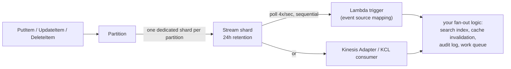

## Objective

Go one layer below the vocabulary from the previous chapter — table, item, primary key, item collection — into the mechanics that explain *why* DynamoDB behaves the way it does. The book frames the split cleanly: "A few of these concepts, like DynamoDB streams and time-to-live (TTL) will allow you to handle more advanced use cases with DynamoDB. Other concepts, like partitions [and] consistency... will give you a better understanding of proper data modeling with DynamoDB." Streams and TTL are features you turn on; partitions and consistency are physics you design around. Both halves matter because they answer the same underlying question in different registers: what does DynamoDB actually do between the moment you call an API and the moment the effect is visible somewhere else — another service, another read, another node.

## Use Cases

- Wiring a search index, cache invalidation, or audit log off table writes without a dual-write from application code — DynamoDB Streams plus a Lambda trigger, the book's own framing of "using DynamoDB as a work queue" or "broadcasting event updates across microservices."
- Building a session store or an access-keys table where machine-generated tokens should self-destruct (the book's own example: "user-generated tokens are active until intentionally deactivated, while machine-generated tokens are expired after ten minutes") without a cron job doing manual `DeleteItem` sweeps.
- Debugging "I wrote the item and immediately read it back, and it's not there" — the default eventually-consistent read landed on a secondary node that hadn't caught up yet, and the fix is `ConsistentRead=True`, not a retry loop.
- Deciding whether a secondary index can be trusted for a read-your-own-writes flow — LSIs can opt into strong consistency, GSIs never can, full stop.
- Explaining to a team why a table that's provisioned for high throughput is still throttling on one access pattern — the per-partition ceiling, not the table-level number, is what's binding.
- Sizing a Lambda-based stream consumer and deciding what happens when one bad record keeps failing — the 24-hour stream retention window is the deadline for that decision, not a suggestion.

## Deep Dive

### DynamoDB Streams: change data capture as a first-class feature

The book calls streams out as a personal favorite and ties them to DynamoDB's origin: "the inclusion of streams in DynamoDB reflects the microservice-friendly, event-driven environment in which DynamoDB was created." Mechanically: "Whenever an item is written, updated, or deleted, a record containing the details of that record will be written to your DynamoDB stream. You can then process this stream with AWS Lambda or other compute infrastructure." No dual-write, no outbox table you maintain by hand — the change log is a side effect of the write DynamoDB was already doing.

Current AWS documentation fills in the structure the book leaves implicit. A stream is organized into **shards** — "each shard acts as a container for multiple stream records" — and shards map to partitions: "a given partition writes its stream records to a single dedicated shard, and no other partition writes to that shard." As DynamoDB adds partitions to scale the table, it adds shards to match. Ordering is guaranteed **per item** (all changes to one primary key arrive in order), not per item collection — an item collection spanning multiple partitions writes to multiple shards, and a consumer that needs collection-wide ordering has to reassemble it itself.

The consumption model matters as much as the plumbing. AWS Lambda "polls the stream for new records four times per second," invoking your function synchronously with a batch, in sequence-number order, one shard per function instance by default (`ParallelizationFactor` can raise that to up to 10 concurrent instances per shard while still preserving per-item order). The failure mode worth knowing before you need it: "If your function returns an error, Lambda retries the batch until it processes successfully or the data expires" — a record your handler can't process blocks everything behind it on that shard until you configure a retry limit, a smaller batch, or a destination for discarded records, or until the 24-hour retention window ages the record out on its own.

### TTL: expiration is a background sweep, not a delete-on-schedule

TTL is the answer to "clean up your database rather than handling it manually via a scheduled job." The mechanism: store a Unix timestamp (seconds, `Number` type) on a per-item attribute you designate; "DynamoDB will periodically review your table and delete items that have your TTL attribute set to a time before the current time." It's opt-in per item — items without the attribute are never touched, which is exactly what makes the mixed-lifetime access-keys example work.

The detail that catches people is the gap between "the timestamp passed" and "the item is gone." The book's own caution: "your application should be safe around how it handles items with TTLs. Items are generally deleted in a timely manner, but AWS only states that items will usually be deleted within 48 hours after the time indicated by the attribute." Its prescription follows directly: "Rather than relying on the TTL for data accuracy in your application, you should confirm an item is not expired when you retrieve it from DynamoDB" — a filter expression on `Query`/`Scan`, or an application-level timestamp check on `GetItem`.

> **Book vs. today: the deletion window widened, not tightened.** Current AWS documentation no longer commits to a 48-hour figure; it now says expired items are deleted "typically within a few days after their expiration," and explicitly notes an expired-but-undeleted item "might be deleted by the system at any time" — you can still update it, including removing the TTL attribute to un-expire it, until that happens. The book's core instruction — don't trust the timestamp alone, check at read time — is if anything more true today than in 2020, not less.

One mechanical fact worth carrying forward that the book doesn't cover (TTL predates streams integration being documented this precisely): a TTL-driven delete is not silent if you have a stream enabled. Per current AWS docs, "after deletion, items go into DynamoDB Streams as service deletions instead of user deletes" — a consumer that distinguishes the two can tell "a user deleted this" from "this simply expired," without an extra flag anywhere in your schema.

### Partitions: the physical layer three nodes deep

The book restates the routing mechanism from the previous chapter and then goes one level further: "The primary node for a partition holds the canonical, correct data for the items in that node. When a write request comes in, the primary node will commit the write and commit the write to one of two secondary nodes for the partition... After the primary node responds to the client to indicate that the write was successful, it then asynchronously replicates the write to a third storage node." Three nodes per partition — one primary, two secondary — for two reasons: fault tolerance (survive one node loss without data loss) and read scaling (secondaries can serve reads so they don't all hit the primary).

That architecture is also where eventually-consistent reads come from, mechanically: "because writes are asynchronously replicated from the primary to secondary nodes, the secondary might be a little behind the primary node. And because you can read from the secondary nodes, it's possible you could read a value from a secondary node that does not reflect the latest value written to the primary." Consistency isn't a policy layered on top — it's a direct consequence of which of the three nodes answered your read.

On throughput, the book notes a real historical improvement: "In earlier versions of DynamoDB, you needed to be more aware of partitions... you could run into issues when unbalanced access meant you were getting throttled without using your full throughput" — and credits **adaptive capacity** for largely closing that gap by spreading throughput toward the items that need it. It doesn't eliminate the per-partition ceiling; it just means you no longer have to manually rebalance around it in the common case.

### Consistency: eventual vs. strong, and where you get to choose

The book's plain-language definitions: "With strong consistency, any item you read from DynamoDB will reflect all writes that occurred prior to the read being executed. In contrast, with eventual consistency, it's possible the item(s) you read will not reflect all prior writes." Two separate places you make this choice:

1. **Base table reads.** Default is eventually consistent. Pass `ConsistentRead=True` on `GetItem`, `Query`, or `Scan` to opt into strong consistency for that call. The trade is throughput: "An eventually-consistent read consumes half the write capacity of a strongly-consistent read" — read capacity, precisely, but the book's point stands: eventual is cheaper, strong is more expensive, and the default favors cheap.
2. **Secondary index type.** "A local secondary index will allow you to make strongly-consistent reads against it, just like the underlying table... a global secondary index will only allow you to make eventually-consistent reads." This is not a knob GSIs are missing for now — it follows from replication being asynchronous by construction, the same mechanism that makes GSI data lag the base table.

> **Book vs. today: unchanged at the core, extended at the edges.** Current AWS documentation states this identically — eventually consistent is still the default and the cheaper option, `ConsistentRead` still means what it meant in 2020, GSIs and stream reads are still eventually consistent only, with no strong-read option. What's new since the book is scoped above the table: global tables (multi-Region replication) now offer a second axis called **multi-Region strong consistency (MRSC)**, where a write synchronously replicates to a second Region before returning and a strongly-consistent read on either replica sees it — layered on top of, not a replacement for, the single-Region model described here.

## Trade-offs

- **Streams cost nothing on the write path but shift real operational risk onto your consumer.** "DynamoDB Streams operates asynchronously, so there is no performance impact on a table if you enable a stream" — but a Lambda trigger that keeps erroring retries the same batch until it succeeds or the record ages out at 24 hours, stalling every record behind it on that shard. Ordering is per-item, not per-collection, so a consumer that needs "process all of this user's changes, and all of their orders' changes, in one coherent order" has to do that reassembly itself — the stream will not hand it to you pre-sorted across partitions.
- **TTL deletion is free but not prompt, and the gap is now explicitly open-ended.** The initial delete doesn't consume write capacity, which makes TTL strictly cheaper than a scheduled batch-delete job — but "within a few days" is not a promise you can build correctness on, and an item can sit expired-but-readable indefinitely if the sweep hasn't reached it. Every access path that matters has to filter or check at read time; TTL is a cost optimization for eventual cleanup, not a deletion guarantee with a deadline.
- **Adaptive capacity narrowed the partition-throughput problem without removing the underlying limit.** You get to stop thinking about manual rebalancing in the common case, but a single partition key that concentrates enough traffic can still throttle in isolation from the table's overall provisioned or on-demand capacity — the fix is still a key-design change (sharding a hot key), not a setting to raise.
- **Eventual consistency is half the read cost, and that discount is a correctness trade, not a rounding error.** Defaulting every read to eventual is the cheap path, but it means "read immediately after write" is not safe unless you explicitly opt into `ConsistentRead=True` for that call — and for anything routed through a GSI, that opt-in doesn't exist at all. The three-node replication model (one primary, two secondary, one of the two secondaries updated async) is why: a strongly-consistent read has to reach the primary, and a GSI's "primary" is itself an async replication target, so there's no strongly-consistent path to offer.
- **Choosing an LSI to get strongly-consistent index reads reopens the item-collection-size trade from the previous chapter.** An LSI is the only index type that can serve `ConsistentRead=True`, but it must be declared at table creation and it caps every item collection on that table (base table plus all LSIs) at 10GB. Strong consistency on an index and unbounded item-collection growth are mutually exclusive on the same table — pick the one the access pattern actually needs.

## Documentation Links

- [Alex DeBrie, "The DynamoDB Book", v1.0.1 (2020) — Chapter 3, "Advanced Concepts", p. 45-61](https://www.dynamodbbook.com/) — doc
- [AWS Documentation — Change Data Capture for DynamoDB Streams](https://docs.aws.amazon.com/amazondynamodb/latest/developerguide/Streams.html) — doc
- [AWS Documentation — DynamoDB Streams and AWS Lambda Triggers](https://docs.aws.amazon.com/amazondynamodb/latest/developerguide/Streams.Lambda.html) — doc
- [AWS Documentation — Using Time to Live (TTL) in DynamoDB](https://docs.aws.amazon.com/amazondynamodb/latest/developerguide/TTL.html) — doc
- [AWS Documentation — Partitions and Data Distribution](https://docs.aws.amazon.com/amazondynamodb/latest/developerguide/HowItWorks.Partitions.html) — doc
- [AWS Documentation — DynamoDB Read Consistency](https://docs.aws.amazon.com/amazondynamodb/latest/developerguide/HowItWorks.ReadConsistency.html) — doc
- [AWS Documentation — Global Tables: Consistency Modes](https://docs.aws.amazon.com/amazondynamodb/latest/developerguide/V2globaltables_HowItWorks.html#V2globaltables_HowItWorks.consistency-modes) — doc
