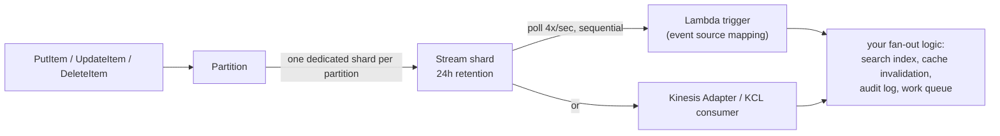

## Objective

Descer uma camada abaixo do vocabulário do capítulo anterior (tabela, item, chave primária, item collection) para a mecânica que explica *por que* o DynamoDB se comporta da forma que se comporta. O livro enquadra a divisão de forma limpa: "alguns desses conceitos, como DynamoDB streams e time-to-live (TTL), vão permitir que você lide com casos de uso mais avançados com o DynamoDB. Outros conceitos, como partições [e] consistência... vão te dar um melhor entendimento de modelagem de dados adequada com o DynamoDB." Streams e TTL são recursos que você liga; partições e consistência são física em torno da qual você desenha. Ambas as metades importam porque respondem à mesma pergunta subjacente em registros diferentes: o que o DynamoDB de fato faz entre o momento em que você chama uma API e o momento em que o efeito é visível em outro lugar (outro serviço, outra leitura, outro nó).

## Use Cases

- Conectar um índice de busca, invalidação de cache, ou log de auditoria a partir de escritas de tabela, sem uma escrita dupla a partir do código de aplicação: DynamoDB Streams mais um gatilho Lambda, o próprio enquadramento do livro de "usar o DynamoDB como uma fila de trabalho" ou "transmitir atualizações de evento através de microsserviços."
- Construir um armazenamento de sessão ou uma tabela de chaves de acesso onde tokens gerados por máquina deveriam se autodestruir (o próprio exemplo do livro: "tokens gerados por usuário ficam ativos até serem desativados intencionalmente, enquanto tokens gerados por máquina expiram depois de dez minutos"), sem um job cron fazendo varreduras manuais de `DeleteItem`.
- Depurar "eu escrevi o item e imediatamente li de volta, e não está lá": a leitura eventualmente consistente padrão aterrissou em um nó secundário que ainda não tinha se atualizado, e o conserto é `ConsistentRead=True`, não um loop de retry.
- Decidir se um índice secundário pode ser confiável para um fluxo de ler-suas-próprias-escritas: LSIs podem optar por consistência forte, GSIs nunca podem, ponto final.
- Explicar a um time por que uma tabela provisionada para alto throughput ainda está estrangulando em um padrão de acesso: o teto por partição, não o número no nível da tabela, é o que está limitando.
- Dimensionar um consumidor de stream baseado em Lambda e decidir o que acontece quando um registro ruim continua falhando: a janela de retenção de 24 horas do stream é o prazo para essa decisão, não uma sugestão.

## Deep Dive

### DynamoDB Streams: change data capture como um recurso de primeira classe

O livro nomeia streams como um favorito pessoal e o liga à origem do DynamoDB: "a inclusão de streams no DynamoDB reflete o ambiente amigável a microsserviços, orientado a evento, no qual o DynamoDB foi criado." Mecanicamente: "sempre que um item é escrito, atualizado, ou deletado, um registro contendo os detalhes daquele registro vai ser escrito no seu stream do DynamoDB. Você então pode processar esse stream com o AWS Lambda ou outra infraestrutura de computação." Sem escrita dupla, sem uma tabela outbox que você mantém à mão: o log de mudança é um efeito colateral da escrita que o DynamoDB já estava fazendo.

A documentação atual da AWS preenche a estrutura que o livro deixa implícita. Um stream é organizado em **shards**: "cada shard age como um container para múltiplos registros de stream", e shards mapeiam para partições: "uma dada partição escreve seus registros de stream para um único shard dedicado, e nenhuma outra partição escreve para aquele shard." Conforme o DynamoDB adiciona partições para escalar a tabela, ele adiciona shards para combinar. Ordenação é garantida **por item** (todas as mudanças em uma chave primária chegam em ordem), não por item collection: uma item collection que abrange múltiplas partições escreve para múltiplos shards, e um consumidor que precisa de ordenação em toda a collection precisa remontá-la ele mesmo.

O modelo de consumo importa tanto quanto a encanação. O AWS Lambda "faz polling no stream por registros novos quatro vezes por segundo", invocando sua função sincronamente com um lote, em ordem de número de sequência, um shard por instância de função por padrão (`ParallelizationFactor` pode aumentar isso para até 10 instâncias concorrentes por shard, ainda preservando ordem por item). O modo de falha que vale a pena conhecer antes de precisar dele: "se sua função retornar um erro, o Lambda tenta o lote de novo até processar com sucesso ou o dado expirar": um registro que seu handler não consegue processar bloqueia tudo atrás dele naquele shard, até que você configure um limite de retry, um lote menor, ou um destino para registros descartados, ou até que a janela de retenção de 24 horas envelheça o registro por conta própria.

### TTL: expiração é uma varredura em segundo plano, não um delete agendado

TTL é a resposta a "limpe seu banco de dados, em vez de lidar com isso manualmente via um job agendado." O mecanismo: armazene um timestamp Unix (segundos, tipo `Number`) em um atributo por item que você designa; "o DynamoDB vai periodicamente revisar sua tabela e deletar itens que têm seu atributo TTL definido para um horário anterior ao horário atual." É opt-in por item: itens sem o atributo nunca são tocados, que é exatamente o que faz o exemplo de chaves de acesso de vida mista funcionar.

O detalhe que pega as pessoas é a lacuna entre "o timestamp passou" e "o item se foi." A própria cautela do livro: "sua aplicação deveria ser segura em como lida com itens com TTLs. Itens geralmente são deletados de forma pontual, mas a AWS só afirma que itens geralmente vão ser deletados dentro de 48 horas depois do horário indicado pelo atributo." Sua prescrição decorre diretamente disso: "em vez de depender do TTL para precisão de dado na sua aplicação, você deveria confirmar que um item não está expirado quando o recuperar do DynamoDB": uma expressão de filtro em `Query`/`Scan`, ou uma checagem de timestamp no nível de aplicação em `GetItem`.

> **Book vs. today: a janela de deleção se alargou, não se estreitou.** A documentação atual da AWS não mais se compromete com um número de 48 horas; agora diz que itens expirados são deletados "tipicamente dentro de alguns dias depois de sua expiração", e observa explicitamente que um item expirado, mas ainda não deletado, "pode ser deletado pelo sistema a qualquer momento": você ainda pode atualizá-lo, incluindo remover o atributo TTL para desexpirá-lo, até que isso aconteça. A instrução central do livro (não confie no timestamp sozinho, checque no momento da leitura) é, se algo, mais verdadeira hoje do que em 2020, não menos.

Um fato mecânico que vale a pena carregar adiante, que o livro não cobre (TTL antecede a integração com streams sendo documentada com essa precisão): uma deleção conduzida por TTL não é silenciosa se você tem um stream habilitado. Segundo a documentação atual da AWS, "depois da deleção, itens entram no DynamoDB Streams como deleções de serviço, em vez de deleções de usuário": um consumidor que distingue os dois consegue dizer "um usuário deletou isso" de "isso simplesmente expirou", sem uma flag extra em lugar nenhum do seu schema.

### Partições: a camada física, três nós de profundidade

O livro reafirma o mecanismo de roteamento do capítulo anterior e então vai um nível mais fundo: "o nó primário de uma partição guarda o dado canônico, correto, para os itens naquele nó. Quando uma requisição de escrita chega, o nó primário vai confirmar a escrita e confirmar a escrita em um de dois nós secundários da partição... depois que o nó primário responde ao cliente para indicar que a escrita foi bem-sucedida, ele então replica assincronamente a escrita para um terceiro nó de armazenamento." Três nós por partição, um primário, dois secundários, por duas razões: tolerância a falhas (sobreviver à perda de um nó sem perda de dado) e escalonamento de leitura (secundários podem servir leituras, para que não recaiam todas no primário).

Essa arquitetura também é de onde vêm leituras eventualmente consistentes, mecanicamente: "porque escritas são replicadas assincronamente do primário para nós secundários, o secundário pode estar um pouco atrás do nó primário. E como você pode ler dos nós secundários, é possível que você leia um valor de um nó secundário que não reflete o último valor escrito no primário." Consistência não é uma política sobreposta por cima: é uma consequência direta de qual dos três nós respondeu sua leitura.

Sobre throughput, o livro observa uma melhoria histórica real: "em versões anteriores do DynamoDB, você precisava estar mais ciente de partições... você poderia encontrar problemas quando acesso desbalanceado significava que você estava sendo estrangulado sem usar seu throughput completo", e credita a **capacidade adaptativa** por em grande parte fechar essa lacuna, espalhando throughput em direção aos itens que precisam dele. Não elimina o teto por partição; só significa que você não precisa mais rebalancear manualmente em torno dele no caso comum.

### Consistência: eventual versus forte, e onde você tem a escolha

As definições em linguagem simples do livro: "com consistência forte, qualquer item que você lê do DynamoDB vai refletir todas as escritas que ocorreram antes de a leitura ser executada. Em contraste, com consistência eventual, é possível que o(s) item(ns) que você lê não reflitam todas as escritas anteriores." Dois lugares separados onde você faz essa escolha:

1. **Leituras da tabela base.** O padrão é eventualmente consistente. Passe `ConsistentRead=True` em `GetItem`, `Query`, ou `Scan` para optar por consistência forte naquela chamada. A troca é throughput: "uma leitura eventualmente consistente consome metade da capacidade de escrita de uma leitura fortemente consistente": capacidade de leitura, precisamente, mas o ponto do livro se sustenta: eventual é mais barato, forte é mais caro, e o padrão favorece barato.
2. **Tipo de índice secundário.** "Um índice secundário local vai permitir que você faça leituras fortemente consistentes contra ele, assim como a tabela subjacente... um índice secundário global só vai permitir que você faça leituras eventualmente consistentes." Isso não é um botão que GSIs estão faltando por enquanto: decorre da replicação ser assíncrona por construção, o mesmo mecanismo que faz o dado de GSI ficar atrasado em relação à tabela base.

> **Book vs. today: inalterado no núcleo, estendido nas bordas.** A documentação atual da AWS afirma isso de forma idêntica: eventualmente consistente ainda é o padrão e a opção mais barata, `ConsistentRead` ainda significa o que significava em 2020, GSIs e leituras de stream ainda são apenas eventualmente consistentes, sem opção de leitura forte. O que é novo desde o livro tem escopo acima da tabela: global tables (replicação multi-região) agora oferecem um segundo eixo chamado **consistência forte multi-região (MRSC)**, onde uma escrita replica sincronamente para uma segunda região antes de retornar e uma leitura fortemente consistente em qualquer réplica a vê, sobreposta a, não um substituto de, o modelo de região única descrito aqui.

## Trade-offs

- **Streams não custam nada no caminho de escrita, mas transferem risco operacional real para seu consumidor.** "O DynamoDB Streams opera assincronamente, então não há impacto de performance em uma tabela se você habilitar um stream", mas um gatilho Lambda que continua dando erro tenta o mesmo lote de novo até ter sucesso ou o registro envelhecer em 24 horas, travando todo registro atrás dele naquele shard. Ordenação é por item, não por collection, então um consumidor que precisa de "processar todas as mudanças deste usuário, e todas as mudanças de seus pedidos, em uma ordem coerente" precisa fazer essa remontagem ele mesmo: o stream não vai entregá-la pré-ordenada através de partições.
- **Deleção por TTL é grátis, mas não pontual, e a lacuna agora é explicitamente aberta.** A deleção inicial não consome capacidade de escrita, o que torna o TTL estritamente mais barato do que um job agendado de delete em lote, mas "dentro de alguns dias" não é uma promessa sobre a qual você pode construir corretude, e um item pode ficar expirado, mas legível, indefinidamente, se a varredura ainda não o alcançou. Todo caminho de acesso que importa precisa filtrar ou checar no momento da leitura; TTL é uma otimização de custo para limpeza eventual, não uma garantia de deleção com prazo.
- **Capacidade adaptativa estreitou o problema de throughput de partição sem remover o limite subjacente.** Você para de pensar em rebalanceamento manual no caso comum, mas uma única partition key que concentra tráfego suficiente ainda pode estrangular isoladamente da capacidade provisionada ou on-demand geral da tabela: o conserto ainda é uma mudança de design de chave (fragmentar uma chave quente), não uma configuração para aumentar.
- **Consistência eventual é metade do custo de leitura, e esse desconto é uma troca de corretude, não um erro de arredondamento.** Fazer toda leitura ter padrão eventual é o caminho barato, mas significa que "ler imediatamente depois de escrever" não é seguro, a menos que você explicitamente opte por `ConsistentRead=True` naquela chamada, e para qualquer coisa roteada através de um GSI, essa opção não existe de forma alguma. O modelo de replicação de três nós (um primário, dois secundários, um dos dois secundários atualizado assincronamente) é por quê: uma leitura fortemente consistente precisa alcançar o primário, e o "primário" de um GSI é ele mesmo um alvo de replicação assíncrona, então não há um caminho fortemente consistente para oferecer.
- **Escolher um LSI para obter leituras de índice fortemente consistentes reabre a troca de tamanho de item collection do capítulo anterior.** Um LSI é o único tipo de índice que consegue servir `ConsistentRead=True`, mas precisa ser declarado na criação da tabela e limita toda item collection naquela tabela (tabela base mais todos os LSIs) a 10GB. Consistência forte em um índice e crescimento ilimitado de item collection são mutuamente exclusivos na mesma tabela: escolha o que o padrão de acesso de fato precisa.

## Documentation Links

- [Alex DeBrie, "The DynamoDB Book", v1.0.1 (2020), Chapter 3, "Advanced Concepts", p. 45-61](https://www.dynamodbbook.com/) - doc
- [AWS Documentation, Change Data Capture for DynamoDB Streams](https://docs.aws.amazon.com/amazondynamodb/latest/developerguide/Streams.html) - doc
- [AWS Documentation, DynamoDB Streams and AWS Lambda Triggers](https://docs.aws.amazon.com/amazondynamodb/latest/developerguide/Streams.Lambda.html) - doc
- [AWS Documentation, Using Time to Live (TTL) in DynamoDB](https://docs.aws.amazon.com/amazondynamodb/latest/developerguide/TTL.html) - doc
- [AWS Documentation, Partitions and Data Distribution](https://docs.aws.amazon.com/amazondynamodb/latest/developerguide/HowItWorks.Partitions.html) - doc
- [AWS Documentation, DynamoDB Read Consistency](https://docs.aws.amazon.com/amazondynamodb/latest/developerguide/HowItWorks.ReadConsistency.html) - doc
- [AWS Documentation, Global Tables: Consistency Modes](https://docs.aws.amazon.com/amazondynamodb/latest/developerguide/V2globaltables_HowItWorks.html#V2globaltables_HowItWorks.consistency-modes) - doc
