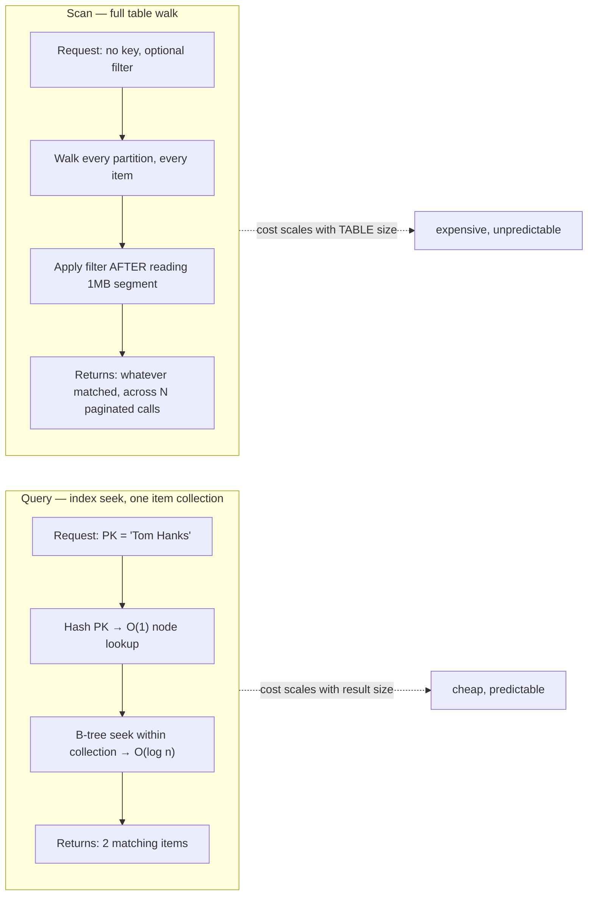

## Objective

Learn the three-way split the book imposes on the entire DynamoDB API — "I like to split the API actions into three categories: 1. Item-based actions 2. Queries 3. Scans" — and the one rule that picks between them: "Operating on specific items? Use the item-based actions. Operating on an item collection? Use a Query. Operating on the whole table? Use a Scan." The point of the chapter isn't API trivia; it's that this grouping *is* the efficiency model. Item-based actions are O(1), Query is O(log n) bounded to one item collection, and Scan is the deliberately-blunt escape hatch that the book closes with three words: "In sum, don't use Scans."

## Use Cases

- Reading or writing exactly one record you already have the key for — a user profile, an order by its order ID — where `GetItem`/`PutItem`/`UpdateItem`/`DeleteItem` are the entire access pattern and reaching for anything else is over-engineering.
- Fetching a bounded, related set of items in one request — "all of Tom Hanks' movie roles," "the last 20 orders for this user" — which is exactly the "fetch many" job `Query` exists for, and the reason a composite primary key was chosen in the first place.
- Narrowing a `Query` further with a sort-key condition (`begins_with`, `between`, `>`) instead of pulling the whole item collection and filtering in application code.
- Querying by a second attribute (movies by title instead of by actor) via a global secondary index — same `Query` operation, different key schema, no join.
- Grouping several single-item reads or writes into one round trip with a batch action, accepting that each item succeeds or fails independently.
- Requiring several writes to succeed or fail atomically as one unit — the transactional item-based actions, not a Query or Scan.
- The rare, deliberate `Scan`: exporting an entire small table to another system, or reading a sparse secondary index designed to be scanned — never as the response path for a latency-sensitive request.
- Recognizing when a proposed access pattern ("find all users where status = active") can't be served by a Query at all, which is the signal to go back and redesign the item collection rather than reach for Scan or add a `FilterExpression`.

## Deep Dive

### Item-based actions: the tweezers

The first bucket operates on one item at a time, identified by its full primary key. Four core actions:

1. **GetItem** — "used for reading a single item from a table."
2. **PutItem** — "used for writing an item to a table. This can completely overwrite an existing item with the same key, if any."
3. **UpdateItem** — "used for updating an item in a table. This can create a new item if it doesn't previously exist, or it can add, remove, or alter properties on an existing item."
4. **DeleteItem** — "used for deleting an item from a table."

Three rules govern the whole category, and DynamoDB enforces all three: "First, the full primary key must be specified in your request. Second all actions to alter data—writes, updates, or deletes—must use an item-based action. Finally, all item-based actions must be performed on your main table, not a secondary index." The first two rules combine into a constraint that surprises people coming from SQL: "you can't make a write operation to DynamoDB that says, 'Update the attribute X for all items with a partition key of Y'... You would need to specify the full key of each of the items you'd like to update." There is no `UPDATE ... WHERE` in DynamoDB — every write names its item explicitly.

Two sub-categories layer on top, both still classified as item-based because "you must specify the exact items on which you want to operate":

- **Batch actions** (`BatchGetItem`, `BatchWriteItem`) bundle multiple single-item requests into one round trip. Each read or write "can succeed or fail independently" — the batch just saves network trips; DynamoDB splits it back into individual operations internally.
- **Transactional actions** (`TransactWriteItems`, `TransactGetItems`) make the opposite guarantee: "all of your reads or writes will succeed or fail together. The failure of a single write in your transaction will cause the other writes to be rolled back."

### Query: the operation single-table design is built around

`Query` is the second category, and the book is explicit about why it matters more than the other two combined: "The Query API action lets you retrieve multiple items with the same partition key. This is a powerful operation, particularly when modeling and retrieving data that includes relations. You can use the Query API to easily fetch all related objects in a one-to-many relationship or a many-to-many relationship."

Working example — a table of actors and the movies they played in, partition key `Actor`, sort key `Movie`:

```python
items = client.query(
    TableName='MoviesAndActors',
    KeyConditionExpression='#actor = :actor',
    ExpressionAttributeNames={'#actor': 'Actor'},
    ExpressionAttributeValues={':actor': {'S': 'Tom Hanks'}}
)
```

This returns every item with partition key `Tom Hanks` — "Tom Hanks in Cast Away and Tom Hanks in Toy Story" — in one request. "Remember that all items with the same partition key are in the same item collection. Thus, the Query operation is how you efficiently read items in an item collection. This is why you carefully structure your item collections to handle your access patterns."

A partition key is required on every `Query`, but the sort key accepts a *condition*, not just an exact match — narrowing to Tom Hanks' movies alphabetically between A and M adds one clause to the same request. And `Query` isn't limited to the base table: pointing it at a global secondary index that flips partition and sort key answers "which actors were in Toy Story?" with the identical operation, just a different `IndexName`. Same API, same cost model, different key schema — this is the mechanism the book leans on for the rest of the book's single-table-design methodology: model your item collections (base table plus GSIs) around your access patterns, and every access pattern becomes one `Query`.

### Scan: the last resort

The third category is `Scan`, and the book reaches for an analogy to make the size difference visceral: "item-based actions are like a pair of tweezers, deftly operating on the exact item you want. The Query call is like a shovel—grabbing a larger amount of items but still small enough to avoid grabbing everything. The Scan operation is like a payloader, grabbing everything in its path." A `Scan` walks the *entire table*, paginating via `LastEvaluatedKey` when the data doesn't fit in one response.

The book allows exactly three situations for it:

- "When you have a very small table"
- "When you're exporting all data from your table to a different system"
- "In exceptional situations, where you have specifically modeled a sparse secondary index in a way that expects a scan"

Otherwise: "you should seldom use it during a latency-sensitive job, such as an HTTP request in your web application... In sum, don't use Scans."



### How DynamoDB enforces efficiency

This grouping isn't arbitrary — it's how the service guarantees "it won't let you write a bad query," meaning "a query that will degrade in performance as it scales." The mechanics, step by step:

1. **Finding the partition key's node is a hash-table lookup — O(1).** The request router hashes the partition key to locate the exact storage node, "no matter how large your table becomes." This is why every single-item action and every `Query` *requires* a partition key.
2. **Finding the sort-key starting point within that item collection is a B-tree search — O(log n).** "n" is the size of one item collection, not the table — "likely a few GB at most," never the full dataset. This is also why `Query`'s sort-key conditions are restricted to `>=`, `<=`, `begins_with()`, and `between` but not `contains()` or `ends_with()`: "an item collection is ordered and stored as a B-tree... it's trivial to find all words between 'hippopotamus' and 'igloo'. It's much harder to find all words that end in '-ing'."
3. **Reading the matching range is a bounded sequential read — capped at 1MB per request**, for *both* `Query` and `Scan`. Even a huge item collection can't blow a single request's latency; the caller must page explicitly with `LastEvaluatedKey`, which "makes it much more apparent to you when you're writing an access pattern that won't scale."

| Step | Data structure | Complexity |
|---|---|---|
| Find node for partition key | Hash table | O(1) |
| Find starting value for sort key | B-tree | O(log n), n = item collection size |
| Read values until end of match | — | Sequential, capped at 1MB |

`Scan` skips step 1 and 2 entirely — it has no key to hash or seek with, so it walks every node and every item, applying any `FilterExpression` only *after* the 1MB segment is already read off disk. The filter reduces what you receive; it does not reduce what DynamoDB had to read, which is the real reason a "selective" Scan is still expensive.

### Book vs today: PartiQL as a fourth surface, not a fourth category

AWS added a SQL-compatible query language, PartiQL, to DynamoDB via the `ExecuteStatement`/`ExecuteTransaction`/`BatchExecuteStatement` APIs (announced at re:Invent, rolled out broadly by December 2020) — after this chapter's core content was written. It's worth a note because it changes *how you write* an access pattern without changing *what's fast*, which is precisely the guardrail this chapter describes:

- A PartiQL `SELECT ... WHERE pk = ? AND sk BETWEEN ? AND ?` compiles to the same underlying `Query` operation — hash the partition key, B-tree-seek the sort key, same O(1)/O(log n) cost.
- A PartiQL `SELECT` whose `WHERE` clause omits the full primary key compiles to a `Scan`, silently. The SQL-shaped syntax makes it easy to write something that *looks* like a targeted lookup but is a full-table walk underneath — the exact "bad query" this chapter says DynamoDB is designed to prevent you from writing by accident. PartiQL doesn't remove that guardrail; it just makes it easier to bypass it by habit if you're used to relational `WHERE` clauses.
- `INSERT`/`UPDATE`/`DELETE` statements in PartiQL still require the full primary key, same as item-based actions — the three rules from section 4.1 hold. Batch and transactional PartiQL statements exist too, mapping onto the same batch/transaction distinction (independent success/failure vs. all-or-nothing).

Net effect: PartiQL is a second syntax over the same three-category model, not a new tier. The book's core lesson — a `Query` needs a partition key to stay cheap, and anything without one is a `Scan` no matter how it's spelled — is unchanged by it.

## Trade-offs

- **Item-based actions are the cheapest and least flexible.** One request, one item, O(1) — but you must already know the full primary key, and there's no way to update or delete "everything matching X" in a single call. Reaching for a batch action doesn't change this; it's still N independent single-item operations, just fewer round trips.
- **Batch vs. transactional item actions trade atomicity for resilience.** Batch operations let one failure fail alone, which is usually what you want for bulk loads or fan-out reads. Transactional operations guarantee all-or-nothing at the cost of higher latency and stricter limits (fewer items per call, no partial progress) — reserve them for genuine multi-item invariants (e.g., decrementing inventory and creating an order together), not as a default.
- **`Query`'s power is bounded by how well the item collection was designed.** A `Query` is only as efficient as the underlying grouping: if the partition key doesn't already group exactly the items an access pattern needs, no clever `KeyConditionExpression` fixes it — the fix is a different key or a new secondary index, decided at design time, not query time. This is why the book calls item-collection design "one of the most important yet underdiscussed concepts in DynamoDB" — Query is only cheap because someone did that work upstream.
- **A `FilterExpression` on Query or Scan feels like a `WHERE` clause but isn't one.** It's applied *after* the 1MB read, so it reduces what's returned to the client without reducing what DynamoDB reads or what you pay for. A Query with a highly selective filter and a broad key condition can still read (and bill) far more than it returns — the fix is narrowing the key condition or the item collection itself, not layering on filters.
- **Scan's few legitimate uses are narrow and easy to talk yourself out of.** "Small table," "one-time export," and "specifically modeled sparse-index scan" are the only three the book endorses. Every other justification — "it's just an internal admin tool," "the table's small *for now*," "we'll add pagination later" — is the same anti-pattern with a deadline attached; table growth turns a fine Scan into a production incident with no code change required to trigger it.
- **PartiQL trades explicitness for familiarity, and that trade can hide a Scan in plain sight.** The item-based/Query/Scan API forces you to *choose* an operation, which is a moment where the cost becomes visible. A PartiQL `SELECT` hides that choice inside a `WHERE` clause that looks identical whether it compiles to a `Query` or a `Scan` — worth an explicit check (does this statement's `WHERE` pin the full partition key?) before trusting SQL-shaped code the way you'd trust an explicit `query()` call.

## Documentation Links

- [Alex DeBrie, "The DynamoDB Book", v1.0.1 (2020) — Chapter 4, "The API", p. 62-76](https://www.dynamodbbook.com/) — doc
- [AWS Documentation — Working with Items: GetItem, PutItem, UpdateItem, DeleteItem](https://docs.aws.amazon.com/amazondynamodb/latest/developerguide/WorkingWithItems.html) — doc
- [AWS Documentation — Query API Reference (KeyConditionExpression)](https://docs.aws.amazon.com/amazondynamodb/latest/APIReference/API_Query.html) — doc
- [AWS Documentation — Scan API Reference](https://docs.aws.amazon.com/amazondynamodb/latest/APIReference/API_Scan.html) — doc
- [AWS Documentation — Batch Operations and Transactions](https://docs.aws.amazon.com/amazondynamodb/latest/developerguide/transaction-apis.html) — doc
- [AWS Documentation — PartiQL for DynamoDB](https://docs.aws.amazon.com/amazondynamodb/latest/developerguide/ql-reference.html) — doc
- [AWS Documentation — Best Practices for Querying and Scanning Data](https://docs.aws.amazon.com/amazondynamodb/latest/developerguide/bp-query-scan.html) — doc
