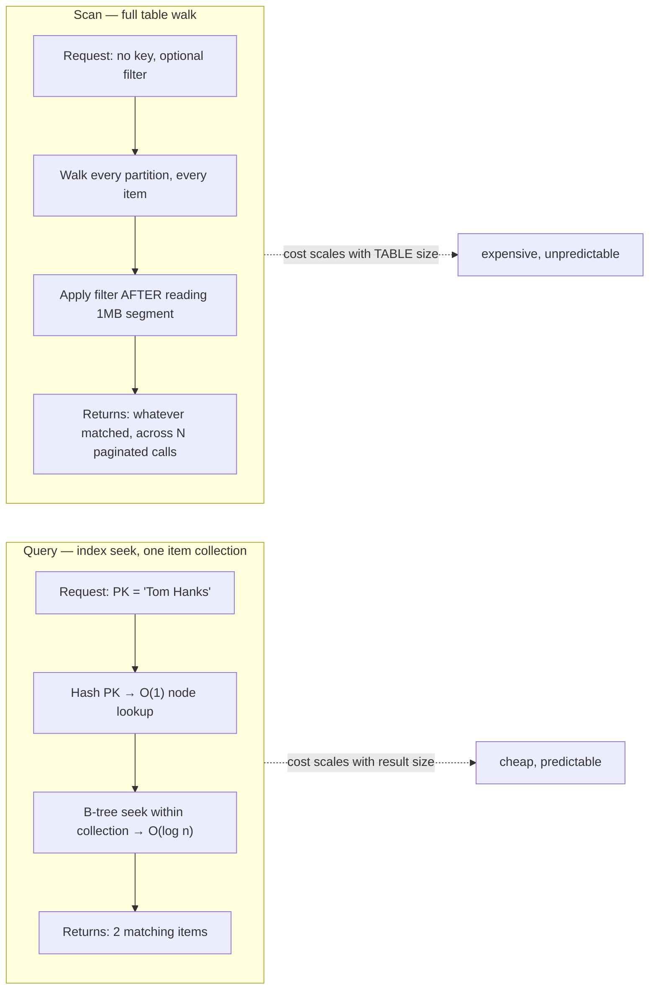

## Objective

Aprender a divisão em três vias que o livro impõe sobre a API inteira do DynamoDB: "eu gosto de dividir as ações da API em três categorias: 1. Ações baseadas em item 2. Queries 3. Scans", e a única regra que escolhe entre elas: "operando em itens específicos? Use as ações baseadas em item. Operando em uma item collection? Use um Query. Operando na tabela inteira? Use um Scan." O ponto do capítulo não é trivialidade de API; é que esse agrupamento *é* o modelo de eficiência. Ações baseadas em item são O(1), Query é O(log n) restrito a uma item collection, e Scan é a válvula de escape deliberadamente contundente, que o livro encerra em três palavras: "em suma, não use Scans."

## Use Cases

- Ler ou escrever exatamente um registro para o qual você já tem a chave: um perfil de usuário, um pedido pelo seu order ID, onde `GetItem`/`PutItem`/`UpdateItem`/`DeleteItem` são o padrão de acesso inteiro, e recorrer a qualquer outra coisa é over-engineering.
- Buscar um conjunto relacionado e limitado de itens em uma requisição: "todos os papéis de filme de Tom Hanks", "os últimos 20 pedidos deste usuário", que é exatamente o trabalho de "buscar muitos" para o qual o `Query` existe, e a razão pela qual uma chave primária composta foi escolhida em primeiro lugar.
- Restringir um `Query` ainda mais com uma condição de sort key (`begins_with`, `between`, `>`), em vez de puxar a item collection inteira e filtrar no código de aplicação.
- Consultar por um segundo atributo (filmes por título, em vez de por ator) via um índice secundário global: a mesma operação `Query`, um esquema de chave diferente, sem join.
- Agrupar várias leituras ou escritas de item único em uma ida e volta com uma ação de batch, aceitando que cada item tem sucesso ou falha independentemente.
- Exigir que várias escritas tenham sucesso ou falhem atomicamente como uma unidade: as ações transacionais baseadas em item, não um Query ou Scan.
- O raro, deliberado `Scan`: exportar uma tabela pequena inteira para outro sistema, ou ler um índice secundário esparso desenhado para ser varrido: nunca como o caminho de resposta para uma requisição sensível a latência.
- Reconhecer quando um padrão de acesso proposto ("encontre todos os usuários onde status = active") não pode ser atendido por um Query de forma alguma, que é o sinal para voltar e redesenhar a item collection, em vez de recorrer a Scan ou adicionar uma `FilterExpression`.

## Deep Dive

### Ações baseadas em item: a pinça

O primeiro balde opera em um item de cada vez, identificado por sua chave primária completa. Quatro ações centrais:

1. **GetItem**: "usada para ler um único item de uma tabela."
2. **PutItem**: "usada para escrever um item em uma tabela. Isso pode sobrescrever completamente um item existente com a mesma chave, se houver."
3. **UpdateItem**: "usada para atualizar um item em uma tabela. Isso pode criar um item novo se ele não existia antes, ou pode adicionar, remover, ou alterar propriedades em um item existente."
4. **DeleteItem**: "usada para deletar um item de uma tabela."

Três regras governam a categoria inteira, e o DynamoDB reforça todas as três: "primeiro, a chave primária completa precisa ser especificada na sua requisição. Segundo, todas as ações para alterar dado (escritas, atualizações, ou deleções) precisam usar uma ação baseada em item. Por fim, todas as ações baseadas em item precisam ser realizadas na sua tabela principal, não em um índice secundário." As duas primeiras regras se combinam em uma restrição que surpreende quem vem de SQL: "você não consegue fazer uma operação de escrita no DynamoDB que diga, 'Atualize o atributo X para todos os itens com uma partition key de Y'... você precisaria especificar a chave completa de cada um dos itens que gostaria de atualizar." Não existe `UPDATE ... WHERE` no DynamoDB: toda escrita nomeia seu item explicitamente.

Duas subcategorias se sobrepõem, ambas ainda classificadas como baseadas em item, porque "você precisa especificar os itens exatos nos quais quer operar":

- **Ações de batch** (`BatchGetItem`, `BatchWriteItem`) agrupam múltiplas requisições de item único em uma ida e volta. Toda leitura ou escrita "pode ter sucesso ou falhar independentemente": o batch só economiza idas e voltas de rede; o DynamoDB o divide de volta em operações individuais internamente.
- **Ações transacionais** (`TransactWriteItems`, `TransactGetItems`) fazem a garantia oposta: "todas as suas leituras ou escritas vão ter sucesso ou falhar juntas. A falha de uma única escrita na sua transação vai fazer as outras escritas serem revertidas."

### Query: a operação em torno da qual o single-table design é construído

`Query` é a segunda categoria, e o livro é explícito sobre por que importa mais do que as outras duas juntas: "a ação de API Query permite que você recupere múltiplos itens com a mesma partition key. Essa é uma operação poderosa, particularmente ao modelar e recuperar dado que inclui relações. Você pode usar a API Query para facilmente buscar todos os objetos relacionados em um relacionamento um-para-muitos ou muitos-para-muitos."

Exemplo trabalhado: uma tabela de atores e os filmes em que atuaram, partition key `Actor`, sort key `Movie`:

```python
items = client.query(
    TableName='MoviesAndActors',
    KeyConditionExpression='#actor = :actor',
    ExpressionAttributeNames={'#actor': 'Actor'},
    ExpressionAttributeValues={':actor': {'S': 'Tom Hanks'}}
)
```

Isso retorna todo item com partition key `Tom Hanks`: "Tom Hanks em Cast Away e Tom Hanks em Toy Story", em uma requisição. "Lembre que todos os itens com a mesma partition key estão na mesma item collection. Assim, a operação Query é como você lê eficientemente itens em uma item collection. É por isso que você estrutura cuidadosamente suas item collections para lidar com seus padrões de acesso."

Uma partition key é exigida em todo `Query`, mas a sort key aceita uma *condição*, não apenas uma correspondência exata: restringir aos filmes de Tom Hanks alfabeticamente entre A e M adiciona uma cláusula à mesma requisição. E o `Query` não se limita à tabela base: apontá-lo para um índice secundário global que inverte partition e sort key responde "quais atores estiveram em Toy Story?" com a operação idêntica, só um `IndexName` diferente. Mesma API, mesmo modelo de custo, esquema de chave diferente: esse é o mecanismo sobre o qual o livro se apoia para o resto de sua metodologia de single-table design: modele suas item collections (tabela base mais GSIs) em torno dos seus padrões de acesso, e todo padrão de acesso se torna um `Query`.

### Scan: o último recurso

A terceira categoria é `Scan`, e o livro recorre a uma analogia para tornar a diferença de tamanho visceral: "ações baseadas em item são como um par de pinças, habilmente operando no item exato que você quer. A chamada Query é como uma pá, pegando uma quantidade maior de itens, mas ainda pequena o suficiente para evitar pegar tudo. A operação Scan é como uma pá carregadeira, pegando tudo no seu caminho." Um `Scan` percorre a *tabela inteira*, paginando via `LastEvaluatedKey` quando o dado não cabe em uma resposta.

O livro permite exatamente três situações para isso:

- "Quando você tem uma tabela muito pequena"
- "Quando você está exportando todo o dado da sua tabela para um sistema diferente"
- "Em situações excepcionais, onde você especificamente modelou um índice secundário esparso de uma forma que espera um scan"

Fora isso: "você deveria raramente usá-lo durante um job sensível a latência, como uma requisição HTTP na sua aplicação web... em suma, não use Scans."



### Como o DynamoDB reforça eficiência

Esse agrupamento não é arbitrário: é como o serviço garante "que não vai deixar você escrever uma query ruim", significando "uma query que vai degradar em performance conforme escala." A mecânica, passo a passo:

1. **Encontrar o nó da partition key é uma busca de tabela de hash: O(1).** O roteador de requisição faz hash da partition key para localizar o nó de armazenamento exato, "não importa o quão grande sua tabela se torne." É por isso que toda ação de item único e todo `Query` *exige* uma partition key.
2. **Encontrar o ponto de partida da sort key dentro dessa item collection é uma busca em árvore B: O(log n).** "n" é o tamanho de uma item collection, não da tabela: "provavelmente alguns GB no máximo", nunca o conjunto de dados completo. É também por isso que as condições de sort key do `Query` são restritas a `>=`, `<=`, `begins_with()`, e `between`, mas não `contains()` nem `ends_with()`: "uma item collection é ordenada e armazenada como uma árvore B... é trivial encontrar todas as palavras entre 'hippopotamus' e 'igloo'. É muito mais difícil encontrar todas as palavras que terminam em '-ing'."
3. **Ler o intervalo correspondente é uma leitura sequencial limitada, com teto de 1MB por requisição**, tanto para `Query` quanto para `Scan`. Mesmo uma item collection enorme não consegue estourar a latência de uma única requisição; quem chama precisa paginar explicitamente com `LastEvaluatedKey`, o que "torna muito mais aparente para você quando está escrevendo um padrão de acesso que não vai escalar."

| Passo | Estrutura de dados | Complexidade |
|---|---|---|
| Encontrar nó para partition key | Tabela de hash | O(1) |
| Encontrar valor de partida para sort key | Árvore B | O(log n), n = tamanho da item collection |
| Ler valores até o fim da correspondência | — | Sequencial, com teto de 1MB |

`Scan` pula os passos 1 e 2 completamente: não tem chave para hash ou buscar, então percorre todo nó e todo item, aplicando qualquer `FilterExpression` só *depois* de o segmento de 1MB já ter sido lido do disco. O filtro reduz o que você recebe; não reduz o que o DynamoDB precisou ler, que é a razão real de um Scan "seletivo" ainda ser caro.

### Book vs today: PartiQL como uma quarta superfície, não uma quarta categoria

A AWS adicionou uma linguagem de query compatível com SQL, o PartiQL, ao DynamoDB via as APIs `ExecuteStatement`/`ExecuteTransaction`/`BatchExecuteStatement` (anunciado no re:Invent, lançado amplamente em dezembro de 2020), depois que o conteúdo central deste capítulo foi escrito. Vale a pena uma nota porque muda *como você escreve* um padrão de acesso sem mudar *o que é rápido*, que é precisamente o guardrail que este capítulo descreve:

- Um `SELECT ... WHERE pk = ? AND sk BETWEEN ? AND ?` do PartiQL compila para a mesma operação `Query` subjacente: hash da partition key, busca em árvore B da sort key, mesmo custo O(1)/O(log n).
- Um `SELECT` do PartiQL cuja cláusula `WHERE` omite a chave primária completa compila para um `Scan`, silenciosamente. A sintaxe em forma de SQL torna fácil escrever algo que *parece* uma busca direcionada, mas por baixo é uma varredura de tabela completa: exatamente a "query ruim" que este capítulo diz que o DynamoDB é desenhado para te impedir de escrever por acidente. O PartiQL não remove esse guardrail; só torna mais fácil contorná-lo por hábito, se você está acostumado a cláusulas `WHERE` relacionais.
- Declarações `INSERT`/`UPDATE`/`DELETE` no PartiQL ainda exigem a chave primária completa, assim como ações baseadas em item: as três regras da seção 4.1 se sustentam. Declarações PartiQL de batch e transacionais também existem, mapeando para a mesma distinção batch/transação (sucesso/falha independente versus tudo-ou-nada).

Efeito líquido: o PartiQL é uma segunda sintaxe sobre o mesmo modelo de três categorias, não um novo nível. A lição central do livro (um `Query` precisa de uma partition key para permanecer barato, e qualquer coisa sem uma é um `Scan`, não importa como seja escrito) permanece inalterada por ele.

## Trade-offs

- **Ações baseadas em item são as mais baratas e menos flexíveis.** Uma requisição, um item, O(1), mas você já precisa saber a chave primária completa, e não há forma de atualizar ou deletar "tudo que corresponde a X" em uma única chamada. Recorrer a uma ação de batch não muda isso; ainda são N operações independentes de item único, só com menos idas e voltas.
- **Ações de item batch versus transacionais trocam atomicidade por resiliência.** Operações de batch permitem que uma falha falhe sozinha, que geralmente é o que você quer para cargas em massa ou leituras de fan-out. Operações transacionais garantem tudo-ou-nada ao custo de latência mais alta e limites mais rígidos (menos itens por chamada, sem progresso parcial): reserve-as para invariantes multi-item genuínos (por exemplo, decrementar inventário e criar um pedido juntos), não como padrão.
- **O poder do `Query` é limitado por quão bem a item collection foi desenhada.** Um `Query` só é tão eficiente quanto o agrupamento subjacente: se a partition key não agrupa exatamente os itens que um padrão de acesso precisa, nenhuma `KeyConditionExpression` esperta conserta isso: o conserto é uma chave diferente ou um novo índice secundário, decidido no momento do design, não no momento da query. É por isso que o livro chama o design de item collection de "um dos conceitos mais importantes, mas menos discutidos, do DynamoDB": o Query só é barato porque alguém fez esse trabalho antes.
- **Uma `FilterExpression` em Query ou Scan parece uma cláusula `WHERE`, mas não é.** É aplicada *depois* da leitura de 1MB, então reduz o que é retornado ao cliente sem reduzir o que o DynamoDB lê ou o que você paga. Um Query com um filtro altamente seletivo e uma condição de chave ampla ainda pode ler (e cobrar) muito mais do que retorna: o conserto é restringir a condição de chave ou a própria item collection, não empilhar filtros.
- **Os poucos usos legítimos do Scan são estreitos e fáceis de se convencer a ignorar.** "Tabela pequena", "exportação única", e "scan de índice esparso especificamente modelado" são os únicos três que o livro endossa. Toda outra justificativa (é só uma ferramenta administrativa interna", "a tabela é pequena *por enquanto*", "vamos adicionar paginação depois") é o mesmo antipadrão com um prazo anexado; crescimento de tabela transforma um Scan fino em um incidente de produção sem nenhuma mudança de código necessária para disparar.
- **O PartiQL troca explicitude por familiaridade, e essa troca pode esconder um Scan à vista de todos.** A API baseada em item/Query/Scan te força a *escolher* uma operação, que é um momento em que o custo se torna visível. Um `SELECT` do PartiQL esconde essa escolha dentro de uma cláusula `WHERE` que parece idêntica, seja compilando para um `Query` ou um `Scan`: vale a pena uma checagem explícita (essa declaração `WHERE` fixa a partition key completa?) antes de confiar em código com forma de SQL da forma que você confiaria em uma chamada `query()` explícita.

## Documentation Links

- [Alex DeBrie, "The DynamoDB Book", v1.0.1 (2020), Chapter 4, "The API", p. 62-76](https://www.dynamodbbook.com/) - doc
- [AWS Documentation, Working with Items: GetItem, PutItem, UpdateItem, DeleteItem](https://docs.aws.amazon.com/amazondynamodb/latest/developerguide/WorkingWithItems.html) - doc
- [AWS Documentation, Query API Reference (KeyConditionExpression)](https://docs.aws.amazon.com/amazondynamodb/latest/APIReference/API_Query.html) - doc
- [AWS Documentation, Scan API Reference](https://docs.aws.amazon.com/amazondynamodb/latest/APIReference/API_Scan.html) - doc
- [AWS Documentation, Batch Operations and Transactions](https://docs.aws.amazon.com/amazondynamodb/latest/developerguide/transaction-apis.html) - doc
- [AWS Documentation, PartiQL for DynamoDB](https://docs.aws.amazon.com/amazondynamodb/latest/developerguide/ql-reference.html) - doc
- [AWS Documentation, Best Practices for Querying and Scanning Data](https://docs.aws.amazon.com/amazondynamodb/latest/developerguide/bp-query-scan.html) - doc
