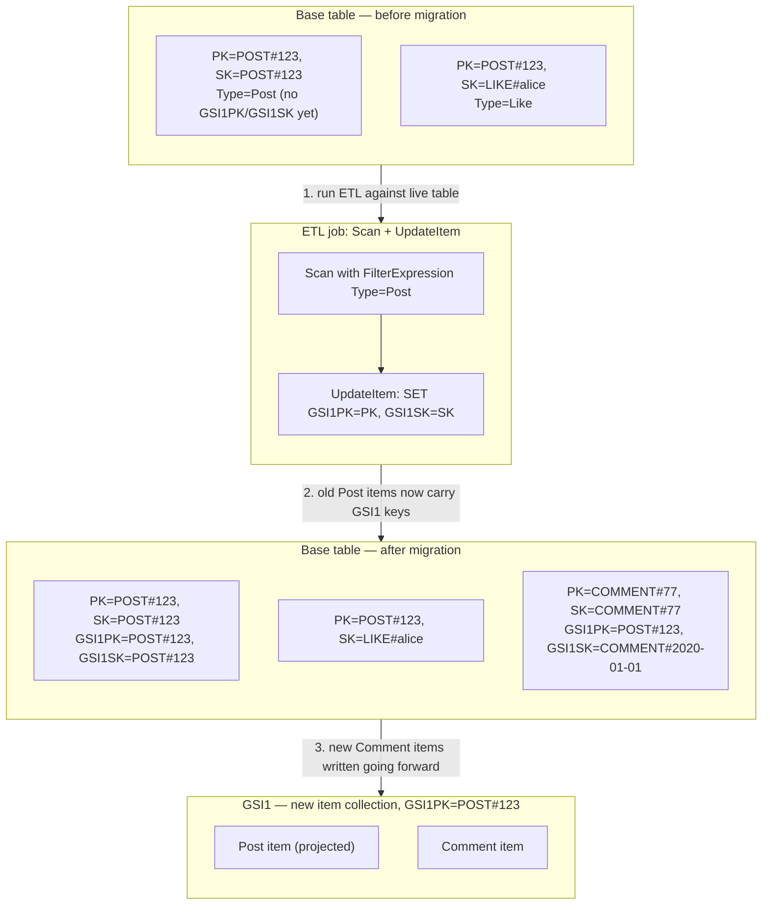

## Objective

Understand how to evolve a *live* single-table design's access patterns without downtime — the book's own answer to the second of the three downsides it names for single-table design (see the sibling concept, "Single-Table Design in DynamoDB"): that the table is "narrowly tailored for the exact purpose for which it has been designed." Learn the one question that determines how hard a migration is (is the change purely additive, or does it require editing existing items?), the five concrete migration scenarios the book walks through, and why single-table design's core strength — denormalizing and pre-joining data into item collections ahead of time — is exactly what makes schema evolution here structurally harder than adding a column or an index in a relational database.

## Use Cases

- Adding a new optional field to an existing entity (a `Birthdate` on `User`, a `FaxNumber` on a business contact) without touching a single existing item.
- Shipping a brand-new feature that introduces a new entity type — deciding whether it needs its own item collection, can ride along in an existing one, or requires a new secondary index.
- Adding the DynamoDB equivalent of a "Like" button to an existing "Post" feature, where the new entity (`Like`) needs to be fetched *together with* its parent in one request.
- Introducing a relational access pattern (`Fetch Post and its Comments`) between two entity types that were never modeled to be queried together — the case that forces a table scan and a backfill job.
- Planning the operational rollout of that backfill job: how to scan safely, how to speed it up with parallel segments, and how to decide the blast radius before running an `UpdateItem` loop against a live production table.
- Reviewing a migration PR and knowing which of the five named scenarios it maps to, so the review can focus on the right risk (is this really additive, or does it quietly require an ETL job the PR doesn't mention?).

## Deep Dive

### The one question that decides everything

DeBrie frames every migration around a single diagnostic question:

> "The fundamental question to ask yourself about a migration is whether it is purely additive or whether you need to edit existing items. A purely additive change means you can start writing the new attributes or items without changes to existing items. A purely additive change is much easier, while editing existing items usually requires a batch job to scan existing items and decorate them with new attributes."

The scope of "additive" is narrower than it first sounds, and the book is precise about where the line sits: it recalls the Chapter 9 distinction between **indexing attributes** (the ones used in a key — `PK`, `SK`, and any GSI keys) and **application attributes** (everything else, read by the application but never used to route a request to DynamoDB). *"When considering whether a change is additive, you only need to consider indexing attributes, not application attributes."* An application attribute can always be added lazily, in application code, no matter how many items already exist without it — because DynamoDB never looks at it to decide which items to return. An indexing attribute is different: if an access pattern needs to `Query` on it, every item that should show up in that query has to actually carry that attribute's value, and old items don't have it until something writes it there.

That is the entire reason migrations in a single-table design can require a batch job at all: not because DynamoDB is schemaless in some limiting way (it is genuinely schemaless for application attributes), but because the primary key and secondary index key values are the mechanism single-table design uses to pre-join data, and a pre-join computed at write time has to be computed for the old writes too before a new read pattern can see them.

### Reading existing items forward: defaults at the boundary

For the purely additive case — new application attribute on an existing entity — the fix lives entirely in application code, at the boundary where DynamoDB items get turned into application objects:

```python
def get_user(username):
    resp = client.get_item(
        TableName='ApplicationTable',
        Key={'PK': f"USER#{username}"}
    )
    return User(
        username=item['Username']['S'],
        name=item['Name']['S'],
        birthdate=item.get('Birthdate', {}).get('S')  # Handles missing values
    )
```

The `.get(...)` with a default is the whole migration. No ETL, no downtime, no table scan. The book notes this even covers one-to-many relationships modeled by denormalization — *"because this strategy models a relationship as an attribute on the parent entity, you can add these relationships lazily in your application rather than worrying about changes to your DynamoDB items."*

### The five scenarios for a new entity type

Adding a whole new entity type is the more common case in practice, and the book grades five scenarios from easiest to hardest by asking two questions in sequence: does the new entity need a relational access pattern with an existing entity at all, and if so, is there already an item collection that can hold both?

| Scenario | Question | What you do | Cost |
|---|---|---|---|
| New entity, no relation | Does an access pattern need "fetch parent + this"? No. | Write the new entity type into a brand-new item collection. | Purely additive — ship it. |
| New entity, existing item collection has room | Yes, and the parent's item collection isn't already used for another relationship. | Give the new items a key that lands them in the parent's existing item collection (e.g. `PK: POST#<PostId>`, `SK: LIKE#<Username>`). | Purely additive — no existing item is touched. |
| New entity, no item collection available | Yes, but the parent's item collection is already spoken for. | Add new key attributes (typically `GSI1PK`/`GSI1SK`) to the **existing** parent items, and give the new entity matching GSI key values, so the pair meets in a new item collection *inside a GSI*. | Requires an ETL scan + update over existing items. |
| Joining two existing entities into a new access pattern | You already have two entity types, but never needed to fetch them together — now you do. | Same as the previous row: add new secondary-index key attributes to the existing items on both sides so they land in a shared item collection in a new or existing index. | Requires an ETL scan + update over existing items — this is the case that most resembles a relational `ALTER TABLE` + backfill. |
| Adding an unrelated new entity type is trivial | — | — | — |

The book's own worked example for the hard case is Post/Like/Comment on a social app. Likes fit into the existing `POST#<PostId>` item collection for free (scenario 2). Comments don't — the Post item collection on the base table is already in use — so Comments need a new item collection built in a GSI, which means writing `GSI1PK`/`GSI1SK` onto every existing Post item that didn't have them:



Read this as three sequential facts, not one diagram. First, the base table before migration has no `GSI1PK`/`GSI1SK` on the Post item — the new access pattern ("fetch Post and recent Comments") is not yet possible for any existing Post. Second, the ETL job is a `Scan`, filtered by the `Type` attribute to only touch Post items, feeding an `UpdateItem` call per item that sets the two new attributes to the values the item's own primary key already holds. Third, once an item carries `GSI1PK`, it automatically shows up in `GSI1`'s item collection alongside any Comment item that references the same `GSI1PK` value — and from that point forward, new Comments simply get written with the right GSI keys, no different from any other write.

The actual scan-and-update code the book gives is close to this shape:

```python
last_evaluated = ''
params = {
    "TableName": "SocialNetwork",
    "FilterExpression": "#type = :type",
    "ExpressionAttributeNames": {"#type": "Type"},
    "ExpressionAttributeValues": {":type": {"S": "Post"}}
}

while True:
    if last_evaluated:
        params['ExclusiveStartKey'] = last_evaluated
    results = client.scan(**params)

    for item in results['Items']:
        client.update_item(
            TableName='SocialNetwork',
            Key={'PK': item['PK'], 'SK': item['SK']},
            UpdateExpression="SET #gsi1pk = :gsi1pk, #gsi1sk = :gsi1sk",
            ExpressionAttributeNames={'#gsi1pk': 'GSI1PK', '#gsi1sk': 'GSI1SK'},
            ExpressionAttributeValues={':gsi1pk': item['PK'], ':gsi1sk': item['SK']}
        )

    if not results['LastEvaluatedKey']:
        break
    last_evaluated = results['LastEvaluatedKey']
```

DeBrie is candid about the shape of this work: *"This is the hardest part of a migration, and you'll want to test your code thoroughly and monitor the job carefully to ensure all goes well. However, there's really not that much going on."* It reduces to two parameters — which items do I want, and what attributes do I add to them — and then "you just need to take the time for the whole update operation to run." He also flags the two production hardening steps this simplified script skips: batching updates via `BatchWriteItem`, and adding real error handling.

### Parallel scans

The book closes the chapter with the throughput lever for large-table backfills: `Scan` accepts `TotalSegments` and `Segment` parameters, letting you split one scan across N independent workers:

```python
params = {
    "TableName": "SocialNetwork",
    "FilterExpression": "#type = :type",
    "ExpressionAttributeNames": {"#type": "Type"},
    "ExpressionAttributeValues": {":type": "Post"},
    "TotalSegments": 10,
    "Segment": 0
}
```

*"DynamoDB will handle all of the state management for you to ensure every item is handled"* — each worker only needs its own `Segment` number; there's no shared cursor to coordinate.

### Why single-table design makes this harder than a relational `ALTER TABLE`

This chapter is the book's direct answer to its own second downside from the single-table design discussion. A relational schema stores each entity type in its own table and expresses relationships as foreign keys resolved at read time via joins — so a new access pattern is frequently just a new index on a column that already exists, or a new `JOIN` in a query, touching zero existing rows. Single-table design instead pre-computes the join by placing related items in the same item collection *at write time*, keyed by attributes chosen specifically for the access patterns known when the table was designed. When a new access pattern arrives that the original key design didn't anticipate, there is no equivalent of "just add an index over the existing column" — the column (the GSI key attribute) doesn't exist on the old items yet, and nothing but a scan-and-write job can put it there. The efficiency the design buys at read time (one `Query`, no joins) is paid for at migration time (a table-wide ETL job instead of a metadata-only DDL statement).

### Book vs. today: the managed part of this hasn't gotten easier — because it was never the manual part

It's worth being precise about what has and hasn't changed since 2020, because it's easy to conflate two different things this chapter's Scan-and-`UpdateItem` code is doing.

> **DynamoDB has automatically backfilled new GSIs since long before this book was written.** "Online Indexing" — the ability to add a GSI to a live table and have DynamoDB scan the table and populate the index without taking it offline — shipped in 2015. Current AWS documentation (Managing Global Secondary Indexes in DynamoDB) confirms the mechanism is unchanged today: creating a GSI via `UpdateTable` moves the index through `CREATING` (with a `Backfilling` flag you can watch via `DescribeTable`) to `ACTIVE`, during which *"the table continues to be available"* and reads used to populate the index aren't billed against your read capacity. So the claim "adding a GSI to an existing table requires a backfill" is true today exactly as it was in 2020 — but that backfill was never the code in section 15.4. AWS's backfill only *projects existing attributes into the index*; it has no way to invent a `GSI1PK` value your application logic hasn't written yet. The book's Scan-and-`UpdateItem` job is solving a different problem — decorating old items with new **key attribute values** — and that part is still entirely your own code to write, in 2020 and today. Nothing in AWS's roadmap changes this, because only your application knows how to derive `GSI1PK` from a Post item; DynamoDB has no way to guess it.
> - One real addition since 2020: the **key-violation detector** (documented alongside GSI.OnlineOps) — a standalone tool for finding items that got silently excluded from a new index because of a type mismatch, an oversized value, or an empty-string key. It doesn't remove the need for your migration script, but it catches the items your script missed, which the book's chapter doesn't have an equivalent for.
> - **Import from S3** (added in 2022, well after the book) offers a different escape hatch worth knowing for the heaviest migrations: rather than scanning and patching a live table item-by-item, you can export the table (or a point-in-time snapshot) to S3, transform it offline with Spark/Glue/EMR into whatever new key shape you need, and bulk-import the result into a brand-new table — then cut traffic over. This is the "rebuild in a new table" alternative to the book's "patch items in place" strategy, and it's most attractive for a redesign so large that scanning the live table under production load isn't acceptable.
> - **Dual-writing and shadow reads**, while not named that way in this chapter, are the practical technique for zero-downtime cutover the book's "purely additive" pattern already implies: ship the code that writes the new key attributes on every *new* write first (so the item is correct going forward, additive from that point on), backfill the *old* items with the ETL job described above, and only flip reads over to the new access pattern once `DescribeTable` shows the index `ACTIVE` and a spot-check confirms the backfill is complete. DynamoDB Streams + Lambda is the common way teams build the "keep two representations in sync" step for anything fancier than a flat key-attribute copy (e.g., a computed aggregate that needs to be dual-maintained during a longer transition).
> - The one-GSI-per-`UpdateTable`-call limit the book doesn't mention explicitly is still current: *"You can only create one global secondary index per `UpdateTable` operation."* Planning a migration that needs two new GSIs still means two sequential deploys, not one.

## Trade-offs

- **"Purely additive" is a narrower category than it sounds, and misjudging it is the actual risk in a migration PR.** The book's own dividing line — indexing attributes vs. application attributes — means a change can *look* additive (a new field on an existing entity) while secretly needing a new GSI key underneath it, if the new field is also meant to be queryable. Reviewing "is this additive?" means checking whether any access pattern needs to filter or sort on the new attribute, not just whether the item shape grew.
- **The ETL job is genuinely simple in shape and genuinely risky in execution.** DeBrie is right that it reduces to two parameters (which items, which new attributes) — but running an `UpdateItem` loop over every row of a live production table is a real production change with a real blast radius, unlike a relational `CREATE INDEX CONCURRENTLY` that a database engine manages transactionally on your behalf. The asymmetry called out in the single-table-design concept's own trade-offs — "on a hundred million items it is a project with a rollback plan" — is this chapter, concretely.
- **Parallel scans trade blast radius for speed, and the book undersells the trade-off.** Splitting into 10 segments finishes the backfill 10x faster, but it also multiplies the write pressure hitting the base table at once — AWS's own current guidance on adding a GSI to a large table specifically warns that backfill writes and application writes can compete for capacity and throttle each other. Faster is not free; size the segment count to the table's spare write capacity, not to how impatient the migration deadline is.
- **The "new table via Import from S3" alternative (not in the book) is the right call more often than teams default to.** For a redesign large enough that patching the live table item-by-item would take hours or days, rebuilding into a fresh table offline and cutting over is frequently safer than a long-running in-place ETL job racing live traffic — at the cost of needing a real cutover plan (dual-write or replay window) instead of a purely incremental one.
- **A missing key-attribute is invisible until someone queries for it.** Because DynamoDB simply omits an item from a GSI's item collection when it lacks that GSI's key attribute (rather than erroring), an incomplete backfill doesn't fail loudly — it silently under-returns results. The key-violation detector tool closes part of this gap, but the safest practice is still the one implied by the book's own `Type`-attribute convention: filter your backfill scan precisely, and verify item counts (`Scan` with `Select: COUNT`, filtered the same way) match between the source query and the new index before treating a migration as done.
- **None of this friction is a reason to avoid single-table design — it's the priced-in cost of the benefit.** This chapter exists because migrations happen, not because they're rare; the book's framing ("migrations aren't to be feared") is aimed at exactly the anxiety that leads teams to over-generalize a schema up front "just in case," which reintroduces the flexibility-over-performance trade the sibling concept's Section 8.3 already covers on its own terms.

## Documentation Links

- [Alex DeBrie, "The DynamoDB Book", v1.0.1 (2020) — Chapter 15, "Strategies for Migrations", p. 254-268](https://www.dynamodbbook.com/) — doc
- [AWS Documentation — Managing Global Secondary Indexes in DynamoDB (online index creation, backfilling phases)](https://docs.aws.amazon.com/amazondynamodb/latest/developerguide/GSI.OnlineOps.html) — doc
- [AWS Documentation — Detecting and Correcting Index Key Violations in DynamoDB](https://docs.aws.amazon.com/amazondynamodb/latest/developerguide/GSI.OnlineOps.ViolationDetection.html) — doc
- [AWS Documentation — Importing Amazon S3 Data into a New DynamoDB Table](https://docs.aws.amazon.com/amazondynamodb/latest/developerguide/S3DataImport.HowItWorks.html) — doc
- [AWS Documentation — Working with Scans (Parallel Scan, TotalSegments/Segment)](https://docs.aws.amazon.com/amazondynamodb/latest/developerguide/Scan.html#Scan.ParallelScan) — doc
- [AWS Documentation — Capturing Table Activity with DynamoDB Streams](https://docs.aws.amazon.com/amazondynamodb/latest/developerguide/Streams.html) — doc
