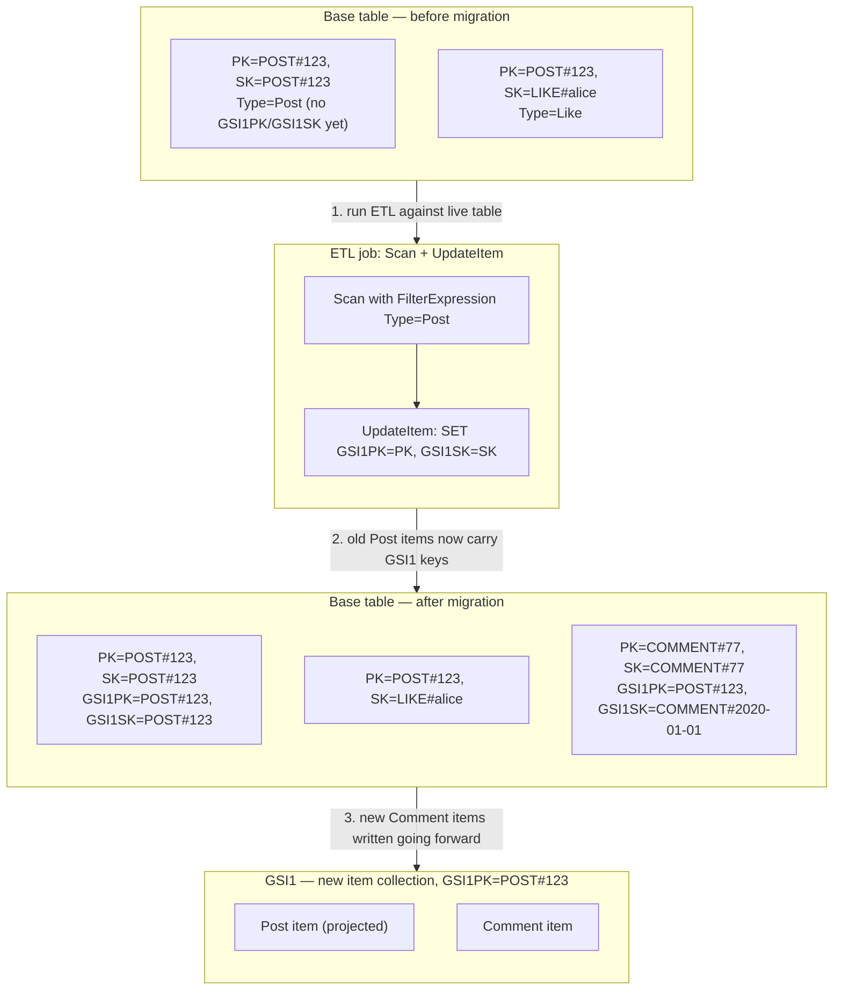

## Objective

Entender como evoluir os padrões de acesso de um single-table design *vivo* sem downtime: a própria resposta do livro à segunda das três desvantagens que nomeia para single-table design (veja o conceito irmão, "Single-Table Design no DynamoDB"): que a tabela é "estreitamente talhada para o propósito exato para o qual foi desenhada." Aprender a única pergunta que determina o quão difícil uma migração é (a mudança é puramente aditiva, ou exige editar itens existentes?), os cinco cenários concretos de migração que o livro percorre, e por que a força central do single-table design (desnormalizar e pré-juntar dado em item collections antecipadamente) é exatamente o que torna evolução de schema aqui estruturalmente mais difícil do que adicionar uma coluna ou um índice em um banco de dados relacional.

## Use Cases

- Adicionar um novo campo opcional a uma entidade existente (um `Birthdate` em `User`, um `FaxNumber` em um contato de negócio) sem tocar em um único item existente.
- Lançar um recurso novo que introduz um novo tipo de entidade: decidir se precisa de sua própria item collection, pode viajar junto em uma existente, ou exige um novo índice secundário.
- Adicionar o equivalente DynamoDB de um botão "Curtir" a um recurso "Post" existente, onde a nova entidade (`Like`) precisa ser buscada *junto com* seu pai em uma requisição.
- Introduzir um padrão de acesso relacional (`Fetch Post and its Comments`) entre dois tipos de entidade que nunca foram modelados para serem consultados juntos: o caso que força uma varredura de tabela e um job de backfill.
- Planejar o lançamento operacional daquele job de backfill: como varrer com segurança, como acelerá-lo com segmentos paralelos, e como decidir o raio de impacto antes de rodar um loop `UpdateItem` contra uma tabela de produção viva.
- Revisar um PR de migração e saber a qual dos cinco cenários nomeados ele mapeia, para que a revisão possa focar no risco certo (isso é realmente aditivo, ou silenciosamente exige um job de ETL que o PR não menciona?).

## Deep Dive

### A única pergunta que decide tudo

DeBrie enquadra toda migração em torno de uma única pergunta diagnóstica:

> "a pergunta fundamental a se fazer sobre uma migração é se ela é puramente aditiva ou se você precisa editar itens existentes. Uma mudança puramente aditiva significa que você pode começar a escrever os novos atributos ou itens sem mudanças nos itens existentes. Uma mudança puramente aditiva é muito mais fácil, enquanto editar itens existentes geralmente exige um job em lote para varrer itens existentes e decorá-los com novos atributos."

O escopo de "aditivo" é mais estreito do que soa à primeira vista, e o livro é preciso sobre onde a linha fica: ele relembra a distinção do Capítulo 9 entre **atributos de indexação** (os usados em uma chave: `PK`, `SK`, e quaisquer chaves de GSI) e **atributos de aplicação** (tudo o mais, lido pela aplicação, mas nunca usado para rotear uma requisição ao DynamoDB). *"Ao considerar se uma mudança é aditiva, você só precisa considerar atributos de indexação, não atributos de aplicação."* Um atributo de aplicação sempre pode ser adicionado preguiçosamente, em código de aplicação, não importa quantos itens já existam sem ele, porque o DynamoDB nunca o olha para decidir quais itens retornar. Um atributo de indexação é diferente: se um padrão de acesso precisa fazer `Query` nele, todo item que deveria aparecer naquela query precisa de fato carregar o valor daquele atributo, e itens antigos não o têm até que algo o escreva ali.

Essa é toda a razão pela qual migrações em um single-table design podem exigir um job em lote de forma alguma: não porque o DynamoDB é sem schema de alguma forma limitante (ele é genuinamente sem schema para atributos de aplicação), mas porque os valores de chave primária e de chave de índice secundário são o mecanismo que single-table design usa para pré-juntar dado, e uma pré-junção calculada no momento da escrita precisa ser calculada para as escritas antigas também, antes que um novo padrão de leitura consiga vê-las.

### Lendo itens existentes adiante: padrões na fronteira

Para o caso puramente aditivo (novo atributo de aplicação em uma entidade existente), o conserto vive inteiramente em código de aplicação, na fronteira onde itens do DynamoDB se tornam objetos de aplicação:

```python
def get_user(username):
    resp = client.get_item(
        TableName='ApplicationTable',
        Key={'PK': f"USER#{username}"}
    )
    return User(
        username=item['Username']['S'],
        name=item['Name']['S'],
        birthdate=item.get('Birthdate', {}).get('S')  # Handles missing values
    )
```

O `.get(...)` com um padrão é a migração inteira. Nenhum ETL, nenhum downtime, nenhuma varredura de tabela. O livro observa que isso até cobre relacionamentos um-para-muitos modelados por desnormalização: *"como essa estratégia modela um relacionamento como um atributo na entidade pai, você pode adicionar esses relacionamentos preguiçosamente na sua aplicação, em vez de se preocupar com mudanças nos seus itens do DynamoDB."*

### Os cinco cenários para um novo tipo de entidade

Adicionar um tipo de entidade inteiramente novo é o caso mais comum na prática, e o livro classifica cinco cenários do mais fácil ao mais difícil, fazendo duas perguntas em sequência: a nova entidade precisa de um padrão de acesso relacional com uma entidade existente de forma alguma, e se sim, já existe uma item collection que consegue guardar ambas?

| Cenário | Pergunta | O que você faz | Custo |
|---|---|---|---|
| Nova entidade, sem relação | Um padrão de acesso precisa de "buscar pai + esta"? Não. | Escreva o novo tipo de entidade em uma item collection totalmente nova. | Puramente aditivo, lance. |
| Nova entidade, item collection existente tem espaço | Sim, e a item collection do pai não está já sendo usada para outro relacionamento. | Dê aos novos itens uma chave que os coloque na item collection existente do pai (por exemplo, `PK: POST#<PostId>`, `SK: LIKE#<Username>`). | Puramente aditivo, nenhum item existente é tocado. |
| Nova entidade, nenhuma item collection disponível | Sim, mas a item collection do pai já está comprometida. | Adicione novos atributos de chave (tipicamente `GSI1PK`/`GSI1SK`) aos itens pai **existentes**, e dê à nova entidade valores de chave de GSI correspondentes, para que o par se encontre em uma nova item collection *dentro de um GSI*. | Exige uma varredura de ETL + atualização sobre itens existentes. |
| Juntar duas entidades existentes em um novo padrão de acesso | Você já tem dois tipos de entidade, mas nunca precisou buscá-los juntos: agora precisa. | Igual à linha anterior: adicione novos atributos de chave de índice secundário aos itens existentes de ambos os lados, para que aterrissem em uma item collection compartilhada em um índice novo ou existente. | Exige uma varredura de ETL + atualização sobre itens existentes: este é o caso que mais se assemelha a um `ALTER TABLE` relacional mais backfill. |
| Adicionar um tipo de entidade novo, sem relação, é trivial | — | — | — |

O próprio exemplo trabalhado do livro para o caso difícil é Post/Like/Comment em uma aplicação social. Likes se encaixam na item collection `POST#<PostId>` existente de graça (cenário 2). Comments não: a item collection Post na tabela base já está em uso, então Comments precisam de uma nova item collection construída em um GSI, o que significa escrever `GSI1PK`/`GSI1SK` em todo item Post existente que não os tinha:



Leia isso como três fatos sequenciais, não um diagrama. Primeiro, a tabela base antes da migração não tem `GSI1PK`/`GSI1SK` no item Post: o novo padrão de acesso ("buscar Post e Comments recentes") ainda não é possível para nenhum Post existente. Segundo, o job de ETL é um `Scan`, filtrado pelo atributo `Type` para só tocar itens Post, alimentando uma chamada `UpdateItem` por item, que define os dois novos atributos com os valores que a própria chave primária do item já guarda. Terceiro, uma vez que um item carrega `GSI1PK`, ele automaticamente aparece na item collection de `GSI1` ao lado de qualquer item Comment que referencie o mesmo valor de `GSI1PK`, e a partir desse ponto, novos Comments simplesmente são escritos com as chaves de GSI corretas, não diferente de qualquer outra escrita.

O código real de scan-e-atualização que o livro dá é próximo desta forma:

```python
last_evaluated = ''
params = {
    "TableName": "SocialNetwork",
    "FilterExpression": "#type = :type",
    "ExpressionAttributeNames": {"#type": "Type"},
    "ExpressionAttributeValues": {":type": {"S": "Post"}}
}

while True:
    if last_evaluated:
        params['ExclusiveStartKey'] = last_evaluated
    results = client.scan(**params)

    for item in results['Items']:
        client.update_item(
            TableName='SocialNetwork',
            Key={'PK': item['PK'], 'SK': item['SK']},
            UpdateExpression="SET #gsi1pk = :gsi1pk, #gsi1sk = :gsi1sk",
            ExpressionAttributeNames={'#gsi1pk': 'GSI1PK', '#gsi1sk': 'GSI1SK'},
            ExpressionAttributeValues={':gsi1pk': item['PK'], ':gsi1sk': item['SK']}
        )

    if not results['LastEvaluatedKey']:
        break
    last_evaluated = results['LastEvaluatedKey']
```

DeBrie é franco sobre a forma desse trabalho: *"essa é a parte mais difícil de uma migração, e você vai querer testar seu código minuciosamente e monitorar o job cuidadosamente para garantir que tudo corra bem. No entanto, na verdade não há tanta coisa acontecendo."* Se reduz a dois parâmetros (quais itens eu quero, e quais atributos eu adiciono a eles) e então "você só precisa dar o tempo para a operação de atualização inteira rodar." Ele também sinaliza os dois passos de fortalecimento de produção que esse script simplificado pula: fazer batch de atualizações via `BatchWriteItem`, e adicionar tratamento de erro de verdade.

### Scans paralelos

O livro encerra o capítulo com a alavanca de throughput para backfills de tabela grande: `Scan` aceita parâmetros `TotalSegments` e `Segment`, permitindo dividir um scan entre N workers independentes:

```python
params = {
    "TableName": "SocialNetwork",
    "FilterExpression": "#type = :type",
    "ExpressionAttributeNames": {"#type": "Type"},
    "ExpressionAttributeValues": {":type": "Post"},
    "TotalSegments": 10,
    "Segment": 0
}
```

*"O DynamoDB vai lidar com todo o gerenciamento de estado para você, para garantir que todo item seja tratado"*: cada worker só precisa de seu próprio número de `Segment`; não há um cursor compartilhado para coordenar.

### Por que single-table design torna isso mais difícil do que um `ALTER TABLE` relacional

Este capítulo é a resposta direta do livro à sua própria segunda desvantagem da discussão de single-table design. Um schema relacional armazena cada tipo de entidade em sua própria tabela e expressa relacionamentos como chaves estrangeiras resolvidas no momento da leitura via joins, então um novo padrão de acesso frequentemente é só um novo índice em uma coluna que já existe, ou um novo `JOIN` em uma query, tocando zero linhas existentes. Single-table design, em vez disso, pré-calcula o join colocando itens relacionados na mesma item collection *no momento da escrita*, com chave por atributos escolhidos especificamente para os padrões de acesso conhecidos quando a tabela foi desenhada. Quando um novo padrão de acesso chega, que o design de chave original não antecipou, não há equivalente de "só adicione um índice sobre a coluna existente": a coluna (o atributo de chave de GSI) ainda não existe nos itens antigos, e nada além de um job de scan-e-escrita consegue colocá-la ali. A eficiência que o design compra no momento da leitura (um `Query`, sem joins) é paga no momento da migração (um job de ETL de tabela inteira, em vez de uma declaração DDL apenas de metadado).

### Book vs. today: a parte gerenciada disso não ficou mais fácil, porque nunca foi a parte manual

Vale a pena ser preciso sobre o que mudou e o que não mudou desde 2020, porque é fácil confundir duas coisas diferentes que o código Scan-e-`UpdateItem` deste capítulo está fazendo.

> **O DynamoDB faz backfill automático de novos GSIs desde bem antes deste livro ser escrito.** "Online Indexing" (a capacidade de adicionar um GSI a uma tabela viva e fazer o DynamoDB varrer a tabela e popular o índice sem tirá-la do ar) foi lançado em 2015. A documentação atual da AWS (Managing Global Secondary Indexes in DynamoDB) confirma que o mecanismo permanece inalterado hoje: criar um GSI via `UpdateTable` move o índice através de `CREATING` (com uma flag `Backfilling` que você pode observar via `DescribeTable`) para `ACTIVE`, durante o qual *"a tabela continua disponível"* e leituras usadas para popular o índice não são cobradas contra sua capacidade de leitura. Então a afirmação "adicionar um GSI a uma tabela existente exige um backfill" é verdadeira hoje exatamente como era em 2020, mas esse backfill nunca foi o código da seção 15.4. O backfill da AWS só *projeta atributos existentes para dentro do índice*; não tem forma de inventar um valor de `GSI1PK` que a lógica da sua aplicação ainda não escreveu. O job Scan-e-`UpdateItem` do livro está resolvendo um problema diferente (decorar itens antigos com novos **valores de atributo de chave**), e essa parte continua sendo inteiramente seu próprio código para escrever, em 2020 e hoje. Nada no roadmap da AWS muda isso, porque só sua aplicação sabe como derivar `GSI1PK` de um item Post; o DynamoDB não tem como adivinhar.
> - Uma adição real desde 2020: o **detector de violação de chave** (documentado ao lado do GSI.OnlineOps): uma ferramenta autônoma para encontrar itens que foram silenciosamente excluídos de um novo índice por causa de uma incompatibilidade de tipo, um valor de tamanho excessivo, ou uma chave de string vazia. Não remove a necessidade do seu script de migração, mas captura os itens que seu script perdeu, para o qual o capítulo do livro não tem equivalente.
> - **Import from S3** (adicionado em 2022, bem depois do livro) oferece uma válvula de escape diferente que vale a pena conhecer para as migrações mais pesadas: em vez de varrer e corrigir uma tabela viva item por item, você pode exportar a tabela (ou um snapshot de ponto no tempo) para o S3, transformá-la offline com Spark/Glue/EMR na nova forma de chave de que precisa, e importar em massa o resultado para uma tabela totalmente nova, depois cortar o tráfego para ela. Esta é a alternativa "reconstruir em uma nova tabela" à estratégia "corrigir itens no lugar" do livro, e é mais atraente para uma remodelagem grande o suficiente para que varrer a tabela viva sob carga de produção não seja aceitável.
> - **Escrita dupla e leituras sombra**, embora não nomeadas assim neste capítulo, são a técnica prática para corte sem downtime que o padrão "puramente aditivo" do livro já implica: lance primeiro o código que escreve os novos atributos de chave em toda escrita *nova* (para que o item esteja correto adiante, aditivo a partir desse ponto), faça backfill dos itens *antigos* com o job de ETL descrito acima, e só vire as leituras para o novo padrão de acesso uma vez que `DescribeTable` mostre o índice `ACTIVE` e uma checagem pontual confirme que o backfill está completo. DynamoDB Streams + Lambda é a forma comum de times construírem o passo de "manter duas representações sincronizadas" para qualquer coisa mais sofisticada do que uma cópia plana de atributo de chave (por exemplo, um agregado calculado que precisa ser mantido em dobro durante uma transição mais longa).
> - O limite de um-GSI-por-chamada-`UpdateTable`, que o livro não menciona explicitamente, ainda é atual: *"você só pode criar um índice secundário global por operação `UpdateTable`."* Planejar uma migração que precisa de dois GSIs novos ainda significa dois deploys sequenciais, não um.

## Trade-offs

- **"Puramente aditivo" é uma categoria mais estreita do que soa, e julgá-la mal é o risco real em um PR de migração.** A própria linha divisória do livro (atributos de indexação versus atributos de aplicação) significa que uma mudança pode *parecer* aditiva (um campo novo em uma entidade existente) enquanto secretamente precisa de uma nova chave de GSI por baixo, se o novo campo também for pensado para ser consultável. Revisar "isso é aditivo?" significa checar se algum padrão de acesso precisa filtrar ou ordenar pelo novo atributo, não apenas se a forma do item cresceu.
- **O job de ETL é genuinamente simples na forma e genuinamente arriscado na execução.** DeBrie está certo ao dizer que se reduz a dois parâmetros (quais itens, quais novos atributos), mas rodar um loop `UpdateItem` sobre toda linha de uma tabela de produção viva é uma mudança de produção real, com um raio de impacto real, ao contrário de um `CREATE INDEX CONCURRENTLY` relacional que um motor de banco de dados gerencia transacionalmente por você. A assimetria sinalizada nos próprios trade-offs do conceito de single-table design ("em cem milhões de itens é um projeto com um plano de rollback") é este capítulo, concretamente.
- **Scans paralelos trocam raio de impacto por velocidade, e o livro subestima essa troca.** Dividir em 10 segmentos termina o backfill 10x mais rápido, mas também multiplica a pressão de escrita atingindo a tabela base de uma vez; a própria orientação atual da AWS sobre adicionar um GSI a uma tabela grande avisa especificamente que escritas de backfill e escritas de aplicação podem competir por capacidade e se estrangular mutuamente. Mais rápido não é de graça; dimensione a contagem de segmentos pela capacidade de escrita de sobra da tabela, não por quão impaciente é o prazo da migração.
- **A alternativa "nova tabela via Import from S3" (não no livro) é a escolha certa com mais frequência do que times assumem por padrão.** Para uma remodelagem grande o suficiente que corrigir a tabela viva item por item levaria horas ou dias, reconstruir em uma tabela nova offline e fazer o corte frequentemente é mais seguro do que um job de ETL de longa duração em execução competindo com tráfego ao vivo, ao custo de precisar de um plano de corte real (escrita dupla ou janela de replay), em vez de um puramente incremental.
- **Um atributo de chave faltando é invisível até que alguém consulte por ele.** Como o DynamoDB simplesmente omite um item da item collection de um GSI quando ele não tem o atributo de chave daquele GSI (em vez de dar erro), um backfill incompleto não falha ruidosamente: ele silenciosamente sub-retorna resultados. A ferramenta detectora de violação de chave fecha parte dessa lacuna, mas a prática mais segura ainda é a implícita na própria convenção de atributo `Type` do livro: filtre sua varredura de backfill com precisão, e verifique se as contagens de item (`Scan` com `Select: COUNT`, filtrado da mesma forma) combinam entre a query de origem e o novo índice, antes de tratar uma migração como concluída.
- **Nada disso é uma razão para evitar single-table design: é o custo já embutido no preço do benefício.** Este capítulo existe porque migrações acontecem, não porque são raras; o enquadramento do livro ("migrações não devem ser temidas") mira exatamente na ansiedade que leva times a generalizar demais um schema antecipadamente "só por precaução", o que reintroduz a troca de flexibilidade-sobre-performance que a Seção 8.3 do conceito irmão já cobre em seus próprios termos.

## Documentation Links

- [Alex DeBrie, "The DynamoDB Book", v1.0.1 (2020), Chapter 15, "Strategies for Migrations", p. 254-268](https://www.dynamodbbook.com/) - doc
- [AWS Documentation, Managing Global Secondary Indexes in DynamoDB (online index creation, backfilling phases)](https://docs.aws.amazon.com/amazondynamodb/latest/developerguide/GSI.OnlineOps.html) - doc
- [AWS Documentation, Detecting and Correcting Index Key Violations in DynamoDB](https://docs.aws.amazon.com/amazondynamodb/latest/developerguide/GSI.OnlineOps.ViolationDetection.html) - doc
- [AWS Documentation, Importing Amazon S3 Data into a New DynamoDB Table](https://docs.aws.amazon.com/amazondynamodb/latest/developerguide/S3DataImport.HowItWorks.html) - doc
- [AWS Documentation, Working with Scans (Parallel Scan, TotalSegments/Segment)](https://docs.aws.amazon.com/amazondynamodb/latest/developerguide/Scan.html#Scan.ParallelScan) - doc
- [AWS Documentation, Capturing Table Activity with DynamoDB Streams](https://docs.aws.amazon.com/amazondynamodb/latest/developerguide/Streams.html) - doc
