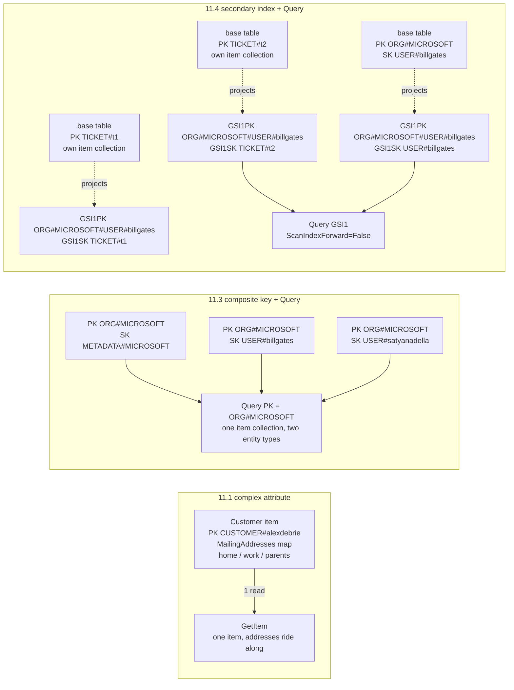

## Objective

Learn the five concrete strategies the book gives for modeling a one-to-many (parent/child) relationship in DynamoDB — denormalization with a complex attribute, denormalization by duplicating data, composite primary key plus the `Query` API action, secondary index plus `Query`, and composite sort keys for hierarchical data — and, more importantly, the specific questions that decide between them. This is deliberately a menu, not a recommendation: "DynamoDB modeling is more art than science—two people modeling the same application can have vastly different table designs."

## Use Cases

- Modeling an entity that owns a small, bounded, never-independently-queried set of sub-objects (a Customer and their saved mailing addresses) and deciding whether it deserves its own items at all.
- Modeling an entity that owns an *unbounded* set of sub-objects (an Order and its Order Items — "you don't want to tell your customers there's a maximum number of items they can order!") where embedding is off the table.
- Serving "fetch the parent and all its children in one request" — an Organization and every User in it — without a join and without a read waterfall in application code.
- Deciding whether to copy a parent's attributes onto every child item (an Author's biography onto each Book) to save a second read, and having a defensible answer for what happens when that copied data changes.
- Adding a third level to a hierarchy (Organization → User → Ticket) when the base table's primary key is already committed to the first two levels.
- Supporting queries at several levels of a deep hierarchy — all Starbucks locations by country, state, city, or zip code — without adding one GSI per level.
- Reviewing an existing table where a new entity type was interleaved into an existing item collection and quietly ruined an older access pattern.

## Deep Dive

### The one core problem

A one-to-many relationship is when "a particular object is the owner or source for a number of sub-objects." The book's examples are deliberately mundane: an office with many employees and a manager with many direct reports; a customer with many orders and an order with many items; a SaaS organization with many users belonging to it.

From that comes a single question that every strategy in the chapter is an answer to: **"how do I fetch information about the parent entity when retrieving one or more of the related entities?"** In a relational database "there's essentially one way to do this—using a foreign key in one table to refer to a record in another table and using a SQL join at query time to combine the two tables." Here there is no such thing: "There are no joins in DynamoDB. Instead, there are a number of strategies for one-to-many relationships, and the approach you take will depend on your needs."

The chapter's own framing is that you will mix them. As the GitHub model in Chapter 21 shows, "we will often use more than one of these strategies in the same table" — you attack the model "one access pattern at a time, searching for the right strategy to solve the immediate problem."

### 11.1. Denormalization by using a complex attribute

The first strategy is to hold the "many" side inside the parent item as a complex data type — a list or a map. The book is explicit about what rule this breaks: "This violates the first tenet of database normalization: to get into first normal form, each attribute value must be atomic. They cannot be broken down any further."

The worked example is a `Customer` from the e-commerce model, with a `MailingAddresses` attribute of type map holding every address for that customer — home, workplace, parents. In a relational database that would be an `Addresses` table with a `CustomerId` foreign key pointing back at `Customers`; here it is one attribute on one item, and "because `MailingAddresses` contains multiple values, it is no longer atomic and, thus, violates the principles of first normal form."

Two questions decide whether this is allowed:

**1. Do you have any access patterns based on the values in the complex attribute?** "All data access in DynamoDB is done via primary keys and secondary indexes. You cannot use a complex attribute like a list or a map in a primary key. Thus, you won't be able to make queries based on the values in a complex attribute." In the example there is no *Fetch a Customer by his or her mailing address* pattern — every use of the addresses happens in the context of an already-fetched Customer, such as rendering saved addresses on the checkout page. That makes embedding fine.

**2. Is the amount of data in the complex attribute unbounded?** "A single DynamoDB item cannot exceed 400KB of data. If the amount of data that is contained in your complex attribute is potentially unbounded, it won't be a good fit for denormalizing and keeping together on a single item." Mailing addresses can be capped by product decision — "A maximum of 20 addresses should satisfy almost all use cases and avoid issues with the 400KB limit." Order Items cannot, which is exactly why the e-commerce model splits Order Items out from Orders as separate items.

The rule is a hard gate, not a preference: **"If the answer to either of the questions above is 'Yes', then denormalization with a complex attribute is not a good fit to model that one-to-many relationship."**

### 11.2. Denormalization by duplicating data

Strategy two "continue[s] our crusade against normalization" by breaking *second* normal form instead: copying the parent's data onto each child item. Second normal form says "each non-key attribute must depend on the whole key," which the book translates as "data should not be duplicated across multiple records. If data is duplicated, it should be pulled out into a separate table."

The example is Books and Authors — each Book has one Author (simplified from reality on purpose), and each Author has biographical data like name and birth year. Relationally you join. In DynamoDB, "we can ignore the rules of second normal form and include the Author's biographical information on each Book item." Multiple Stephen King Book items each carry his biography, so "whenever we retreive the Book, we will also get information about the parent Author item" — one read instead of two.

Two questions again:

- **Is the duplicated information immutable?** Biographical data "won't change," so "it's essentially immutable, it's OK to duplicate it without worrying about consistency issues when that data changes."
- **If the data does change, how often does it change and how many items include the duplicated information?** Mutable data doesn't automatically disqualify the strategy. "If the data changes fairly infrequently and the denormalized items are read a lot, it may be OK to duplicate to save money on all of those subsequent reads. When the duplicated data does change, you'll need to work to ensure it's changed in all those items." The fan-out size is the other half: "If you've only duplicated the data across three items, it can be easy to find and update those items when the data changes. If that data is copied across thousands of items, it can be a real chore to discover and update each of those items, and you run a greater risk of data inconsistency."

The decision rule is a cost comparison, stated plainly: "you're balancing the benefit of duplication (in the form of faster reads) against the costs of updating the data. … If the costs of either of the factors above are low, then almost any benefit is worth it. If the costs are high, the opposite is true."

### 11.3. Composite primary key plus the `Query` API action — the workhorse

The third strategy is "probably the most common way": a composite primary key plus `Query` to fetch a parent and its children together. It rests on **item collections** — "all the items in a table or secondary index that share the same partition key." A single `Query` fetches multiple items from one item collection, and crucially "this can include items of different types, which can give you join-like behavior with much better performance characteristics."

The SaaS example has Organizations and Users in one table. Because two entity types share the key attributes, they can't have meaningful names — hence generic `PK` and `SK`:

| Entity | PK | SK |
|---|---|---|
| Organizations | `ORG#<OrgName>` | `METADATA#<OrgName>` |
| Users | `ORG#<OrgName>` | `USER#<UserName>` |

With five items — Organization items for Microsoft and Amazon, User items for Bill Gates, Satya Nadella, and Jeff Bezos — the item collection for `ORG#MICROSOFT` contains two different item types. That one key design solves four access patterns:

1. **Retrieve an Organization** — `GetItem` with `PK = ORG#<OrgName>` and `SK = METADATA#<OrgName>`.
2. **Retrieve an Organization and all Users within it** — `Query` with a key condition expression of `PK = ORG#<OrgName>`. Both types come back because they share the partition key.
3. **Retrieve only the Users** — `Query` with `PK = ORG#<OrgName> AND begins_with(SK, "USER#")`. "The use of the `begins_with()` function allows us to retrieve only the Users without fetching the Organization object as well."
4. **Retrieve a specific User** — `GetItem` with `PK = ORG#<OrgName>` and `SK = USER#<Username>`, if the client knows both names.

Pattern 2 is the one that matters here: "Notice how we're emulating a join operation in SQL by locating the parent object (the Organization) in the same item collection as the related objects (the Users). **We are pre-joining our data by arranging them together at write time.**"

### 11.4. Secondary index plus the `Query` API action

Strategy four "is almost the same as the previous pattern, but it uses a secondary index rather than the primary keys on the main table." You reach for it when "the primary keys in your table are reserved for another purpose. It could be some write-specific purpose, such as to ensure uniqueness on a particular property, or it could be because you have hierarchical data with a number of levels."

The hierarchical case is the example: each User in the SaaS app creates Tickets (Zendesk's noun; Google Drive's would be Documents, Typeform's would be Forms), each identified by a timestamp plus a random hash suffix. The naive move is to intersperse Ticket items into the existing `ORG#<OrgName>` collections — and the book shows why that fails: "it really jams up my prior use cases. If I want to retrieve an Organization and all its Users, I'm also retrieving a bunch of Tickets. And since Tickets are likely to vastly exceed the number of Users, I'll be fetching a lot of useless data and making multiple pagination requests to handle our original use case."

The fix is three steps:

1. Put Ticket items in **their own item collection** in the base table, using `TICKET#<TicketId>` for both `PK` and `SK`, which still allows direct lookups.
2. Create a global secondary index `GSI1` with keys `GSI1PK` and `GSI1SK`.
3. On **both** Ticket and User items, set `GSI1PK = ORG#<OrgName>#USER#<UserName>`. Set `GSI1SK = USER#<UserName>` on the User item and `GSI1SK = TICKET#<TicketId>` on the Ticket item.

Now the base table keeps Tickets out of the Organization collections, while `GSI1` has "an item collection with both the User item and all of the user's Ticket items," enabling the same parent-plus-children patterns as strategy 3.

One detail worth copying: the `GSI1SK` values are chosen so the **User item sorts last** in the partition. "This is because the Tickets are sorted by timestamp. It's likely that I'll want to fetch a User and the User's most recent Tickets, rather than the oldest tickets. As such, I order it so that the User is at the end of the item collection, and I can use the `ScanIndexForward=False` property to indicate that DynamoDB should start at the end of the item collection and read backwards."

### Three of the strategies, side by side

The left panel is one item and one `GetItem`; the middle is many items sharing a partition key, sort-key-prefixed by type and fetched in one `Query`; the right keeps the base table's collections clean and rebuilds the parent-plus-children collection inside `GSI1` instead — with the User item deliberately placed last so a reverse read returns the newest Tickets first.

### 11.5. Composite sort keys with hierarchical data

The previous two strategies handled "a couple levels of hierarchy—an Organization has Users, which create Tickets." Strategy five is for going deeper: "what if you have more than two levels of hierarchy? You don't want to keep adding secondary indexes to enable arbitrary levels of fetching throughout your hierarchy."

The example is location data: every Starbucks in the world, filterable "on arbitrary geographic levels—by country, by state, by city, or by zip code." The partition key is the country. The sort key is State, City, and ZipCode "smashed" together with `#` separators — that is all "composite sort key" means here: "we'll be smashing a bunch of properties together in our sort key to allow for different search granularity." (The name is admittedly confusing, since the *primary* key is also composite.)

"With this pattern, we can search at four levels of granularity using just our primary key!"

1. All locations in a country — `Query` with `PK = <Country>`.
2. Country and state — `PK = <Country> AND begins_with(SK, '<State>#')`.
3. Country, state, city — `PK = <Country> AND begins_with(SK, '<State>#<City>')`.
4. Country, state, city, zip — `PK = <Country> AND begins_with(SK, '<State>#<City>#<ZipCode>')`.

The book is careful to bound it. "This composite sort key pattern won't work for all scenarios, but it can be great in the right situation. It works best when: you have many levels of hierarchy (>2), and you have access patterns for different levels within the hierarchy" **and** "when searching at a particular level in the hierarchy, you want all subitems in that level rather than just the items in that level."

That second condition is the one people miss, and the counter-example is the SaaS model from strategies 3 and 4: "When searching at one level of the hierarchy—find all Users—we didn't want to dip deeper into the hierarchy to find all Tickets for each User. In that case, a composite sort key will return a lot of extraneous items." Starbucks works because "every location in California" genuinely means every leaf under California; "all Users in an Organization" does not mean "and all their Tickets."

### 11.6. The chapter's own summary

| Strategy | Notes |
|---|---|
| Denormalize + complex attribute | Good when nested objects are bounded and are not accessed directly |
| Denormalize + duplicate | Good when duplicated data is immutable or infrequently changing |
| Primary key + `Query` API | **Most common.** Good for multiple access patterns both the parent and related entities |
| Secondary index + `Query` API | Similar to primary key strategy. Good when primary key is needed for something else |
| Composite sort key | Good for deeply nested hierarchies where you need to search through multiple levels of the hierarchy |

### Book vs. today: the constraints are unchanged, the plumbing for strategy 2 got better

Almost nothing in this chapter has aged. The 400KB item size limit that gates strategy 1 is still exactly 400KB in 2026 — it has never been raised — so the bounded-vs-unbounded question is as load-bearing now as it was in 2020, and `begins_with()` key conditions, `ScanIndexForward`, and item collections all work identically. AWS's own developer guide has since caught up to the book's framing, documenting the same patterns under *Best practices for modeling relational data* and *Best practices for using sort keys to organize data* (the hierarchical composite sort key), so these are official guidance now rather than one author's field notes. Two things are genuinely worth updating:

> **The consistency story for duplicated data is easier to build than the book implies.** When strategy 2's duplicated attribute does change, the book leaves you with "you'll need to work to ensure it's changed in all those items" and no mechanism. Today the standard answer is a DynamoDB Streams trigger fanning the update out via Lambda, plus `TransactWriteItems` for the cases that must be all-or-nothing — and that transaction now covers up to **100 items** per call, raised from the original limit of 25 in September 2022. That doesn't remove the write amplification, but it turns "a real chore to discover and update each of those items" into an ordinary, testable piece of infrastructure.

> **PartiQL, added months after the book shipped, is not an escape hatch from this chapter.** A PartiQL `SELECT` looks like SQL but adds no join, so it cannot substitute for any of these five strategies; a statement that doesn't constrain the partition key is a full table scan in SQL clothing. The pre-join-at-write-time reasoning is untouched.

## Trade-offs

- **The complex attribute is the cheapest strategy and the one with the hardest ceiling.** One item, one `GetItem`, no extra writes, no consistency story — and in exchange the "many" side is completely unqueryable on its own, because "you cannot use a complex attribute like a list or a map in a primary key." There is no adding an index later to recover that; a new *Fetch a Customer by mailing address* requirement means promoting every embedded address to its own item, i.e. a full remodel plus a data migration. And the 400KB wall is not a soft limit you can tune — it's the item, so the parent's other attributes compete for the same budget. The book's mitigation is a *product* decision ("A maximum of 20 addresses"), which is worth noticing: the strategy is only safe when someone is willing to cap the relationship in the domain, not just in the schema.
- **Duplication buys read simplicity with storage, write amplification, and an integrity obligation that never expires.** The Stephen King biography on every Book item is free only because it is immutable. The moment the duplicated data is mutable, you own a fan-out write for every change, and the cost scales with a number you may not control — "if that data is copied across thousands of items, it can be a real chore to discover and update each of those items, and you run a greater risk of data inconsistency." Worse, the *discovery* problem is separate from the update problem: nothing in DynamoDB tells you which items carry a copy, so you need either a query path that finds them or a stream-driven process that maintains them. Treat "is this immutable?" as a claim to be tested, not assumed — "close to immutable" attributes (a display name, an email) have a way of becoming editable one sprint later.
- **The composite key plus `Query` is the right default, and it permanently ties the children to one parent partition.** This is the strategy the book calls "probably the most common," and correctly so: it is the cheapest way to get join-like reads, needs no GSI throughput, and supports strongly consistent reads. The cost is that the children *only* exist inside their parent's item collection. You cannot list all Users across all Organizations, or fetch a User knowing only their username, without adding an index or a second copy — the child is reachable only through the parent it was filed under. It also concentrates traffic: all reads and writes for one parent and all its children hit a single partition key, so a tenant far larger than the others becomes a hot partition, and (in a table that has an LSI) that item collection is additionally capped at 10GB.
- **Interleaving a new entity type into an existing item collection is the failure mode this chapter is warning you about.** The Tickets example is worth internalizing as a general rule, not a Zendesk quirk: adding a high-cardinality child type into a collection sized for a low-cardinality one silently degrades the *older* access pattern into a paginated scan of mostly-unwanted items. Nothing errors; the query just gets slower and more expensive as the new entity grows. The failure surfaces in production, at the scale where it hurts most.
- **The secondary index strategy costs a second copy of your data and eventual consistency, and buys back the primary key.** It exists precisely because the base table's primary key is committed to something else — uniqueness enforcement, or the first two levels of a hierarchy. That is a real capability, but a GSI is a replicated projection with its own provisioned throughput, its own storage bill, and a replication lag: GSI reads are never strongly consistent, so a read-after-write on a freshly created Ticket may not see it. Also, `GSI1PK` values like `ORG#MICROSOFT#USER#billgates` bake the parent chain into the child's index key, so *moving* a User to another Organization means rewriting that attribute on every one of their Tickets.
- **Composite sort keys scale to arbitrary hierarchy depth but only for strictly containment-shaped queries.** `Country#State#City#ZipCode` gets four granularities out of one key with no extra index, which is a genuinely excellent trade — as long as every query at a level wants *all* the leaves under it. The book's own second condition rules out the far more common shape where you want just one level's items: a composite sort key there "will return a lot of extraneous items," and there is no `begins_with` variant that skips deeper levels. The other cost is rigidity: the hierarchy's order is frozen into the string. Querying "all locations in a zip code" regardless of state, or reordering the levels, is not a `begins_with` away — it is a new key attribute and a backfill.
- **Picking a strategy is per-access-pattern, which means the model is a blend and the blend has to be documented.** "We will often use more than one of these strategies in the same table" is accurate and is also the maintenance bill: one table can hold an embedded map, a duplicated immutable attribute, a pre-joined item collection, an overloaded GSI, and a hierarchical sort key at once, with no schema anywhere stating which is which. The entity chart and access-pattern chart from the modeling process stop being documentation and become the only map. Combined with the book's own admission that this is "more art than science," expect two competent engineers to disagree on the same table — and expect a reviewer with no access to those charts to be unable to tell a deliberate choice from an accident.

## Documentation Links

- [Alex DeBrie, "The DynamoDB Book", v1.0.1 (2020) — Chapter 11, "Strategies for one-to-many relationships", p. 182-198](https://www.dynamodbbook.com/) — doc
- [AWS Documentation — Best Practices for Modeling Relational Data in DynamoDB](https://docs.aws.amazon.com/amazondynamodb/latest/developerguide/bp-relational-modeling.html) — doc
- [AWS Documentation — Query](https://docs.aws.amazon.com/amazondynamodb/latest/developerguide/Query.html) — doc
- [AWS Documentation — Best Practices for Using Sort Keys to Organize Data](https://docs.aws.amazon.com/amazondynamodb/latest/developerguide/bp-sort-keys.html) — doc
- [AWS Documentation — Service, Account, and Table Quotas in Amazon DynamoDB](https://docs.aws.amazon.com/amazondynamodb/latest/developerguide/ServiceQuotas.html) — doc
- [AWS Documentation — Managing Complex Workflows with DynamoDB Transactions](https://docs.aws.amazon.com/amazondynamodb/latest/developerguide/transaction-apis.html) — doc
