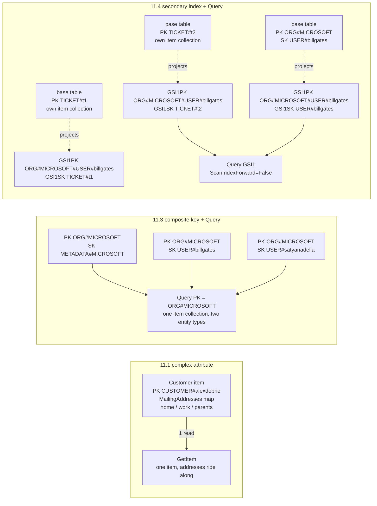

## Objective

Aprender as cinco estratégias concretas que o livro dá para modelar um relacionamento um-para-muitos (pai/filho) no DynamoDB (desnormalização com um atributo complexo, desnormalização duplicando dado, chave primária composta mais a ação de API `Query`, índice secundário mais `Query`, e sort keys compostas para dado hierárquico) e, mais importante, as perguntas específicas que decidem entre elas. Isso é deliberadamente um menu, não uma recomendação: "modelagem no DynamoDB é mais arte do que ciência: duas pessoas modelando a mesma aplicação podem ter designs de tabela vastamente diferentes."

## Use Cases

- Modelar uma entidade que possui um conjunto pequeno, limitado, nunca consultado independentemente, de subobjetos (um Customer e seus endereços de correspondência salvos) e decidir se ele merece seus próprios itens de forma alguma.
- Modelar uma entidade que possui um conjunto *ilimitado* de subobjetos (um Order e seus Order Items, "você não quer dizer aos seus clientes que existe um número máximo de itens que eles podem pedir!"), onde embutir está fora de cogitação.
- Atender "buscar o pai e todos os seus filhos em uma requisição": uma Organization e todo User nela, sem um join e sem uma cascata de leitura em código de aplicação.
- Decidir se copia os atributos de um pai para todo item filho (a biografia de um Author em cada Book) para economizar uma segunda leitura, e ter uma resposta defensável para o que acontece quando aquele dado copiado muda.
- Adicionar um terceiro nível a uma hierarquia (Organization → User → Ticket), quando a chave primária da tabela base já está comprometida com os primeiros dois níveis.
- Suportar queries em vários níveis de uma hierarquia profunda: todas as localizações Starbucks por país, estado, cidade, ou CEP, sem adicionar um GSI por nível.
- Revisar uma tabela existente onde um novo tipo de entidade foi intercalado em uma item collection existente e silenciosamente arruinou um padrão de acesso mais antigo.

## Deep Dive

### O único problema central

Um relacionamento um-para-muitos é quando "um objeto em particular é o dono ou a fonte de vários subobjetos." Os exemplos do livro são deliberadamente mundanos: um escritório com muitos funcionários e um gerente com muitos subordinados diretos; um cliente com muitos pedidos e um pedido com muitos itens; uma organização SaaS com muitos usuários pertencendo a ela.

Disso vem uma única pergunta para a qual toda estratégia no capítulo é uma resposta: **"como eu busco informação sobre a entidade pai ao recuperar uma ou mais das entidades relacionadas?"** Em um banco de dados relacional "essencialmente existe uma forma de fazer isso: usando uma chave estrangeira em uma tabela para se referir a um registro em outra tabela e usando um join SQL no momento da query para combinar as duas tabelas." Aqui não existe tal coisa: "não há joins no DynamoDB. Em vez disso, existem várias estratégias para relacionamentos um-para-muitos, e a abordagem que você adota vai depender das suas necessidades."

O próprio enquadramento do capítulo é que você vai misturá-las. Como o modelo GitHub no Capítulo 21 mostra, "frequentemente vamos usar mais de uma dessas estratégias na mesma tabela": você ataca o modelo "um padrão de acesso de cada vez, buscando a estratégia certa para resolver o problema imediato."

### 11.1. Desnormalização usando um atributo complexo

A primeira estratégia é guardar o lado "muitos" dentro do item pai como um tipo de dado complexo (uma list ou um map). O livro é explícito sobre qual regra isso quebra: "isso viola o primeiro princípio de normalização de banco de dados: para entrar na primeira forma normal, todo valor de atributo precisa ser atômico. Eles não podem ser decompostos mais."

O exemplo trabalhado é um `Customer` do modelo de e-commerce, com um atributo `MailingAddresses` do tipo map guardando todo endereço daquele cliente: casa, trabalho, pais. Em um banco de dados relacional isso seria uma tabela `Addresses` com uma chave estrangeira `CustomerId` apontando de volta para `Customers`; aqui é um atributo em um item, e "como `MailingAddresses` contém múltiplos valores, não é mais atômico e, portanto, viola os princípios da primeira forma normal."

Duas perguntas decidem se isso é permitido:

**1. Você tem algum padrão de acesso baseado nos valores dentro do atributo complexo?** "Todo acesso a dado no DynamoDB é feito via chaves primárias e índices secundários. Você não pode usar um atributo complexo como uma list ou um map em uma chave primária. Assim, você não vai conseguir fazer queries baseadas nos valores dentro de um atributo complexo." No exemplo não existe um padrão de *Buscar um Customer pelo seu endereço de correspondência*: todo uso dos endereços acontece no contexto de um Customer já buscado, como renderizar endereços salvos na página de checkout. Isso torna embutir aceitável.

**2. A quantidade de dado no atributo complexo é ilimitada?** "Um único item do DynamoDB não pode exceder 400KB de dado. Se a quantidade de dado contida no seu atributo complexo é potencialmente ilimitada, não vai ser um bom encaixe para desnormalizar e manter junto em um único item." Endereços de correspondência podem ser limitados por decisão de produto: "um máximo de 20 endereços deveria satisfazer quase todos os casos de uso e evitar problemas com o limite de 400KB." Order Items não podem, que é exatamente por que o modelo de e-commerce separa Order Items de Orders como itens separados.

A regra é um portão rígido, não uma preferência: **"se a resposta a qualquer uma das perguntas acima é 'Sim', então desnormalização com um atributo complexo não é um bom encaixe para modelar aquele relacionamento um-para-muitos."**

### 11.2. Desnormalização duplicando dado

A estratégia dois "continua nossa cruzada contra a normalização" quebrando a *segunda* forma normal em vez disso: copiando o dado do pai para cada item filho. A segunda forma normal diz "todo atributo que não é chave precisa depender da chave inteira", que o livro traduz como "dado não deveria ser duplicado entre múltiplos registros. Se o dado é duplicado, deveria ser retirado para uma tabela separada."

O exemplo é Books e Authors: cada Book tem um Author (simplificado da realidade de propósito), e cada Author tem dado biográfico como nome e ano de nascimento. Relacionalmente você faz join. No DynamoDB, "podemos ignorar as regras da segunda forma normal e incluir a informação biográfica do Author em cada item Book." Múltiplos itens Book de Stephen King cada um carrega sua biografia, então "sempre que recuperamos o Book, também vamos obter informação sobre o item Author pai": uma leitura em vez de duas.

Duas perguntas de novo:

- **A informação duplicada é imutável?** Dado biográfico "não vai mudar", então "é essencialmente imutável, tudo bem duplicá-lo sem se preocupar com problemas de consistência quando aquele dado muda."
- **Se o dado muda, com que frequência muda e quantos itens incluem a informação duplicada?** Dado mutável não desqualifica automaticamente a estratégia. "Se o dado muda com pouca frequência e os itens desnormalizados são lidos bastante, pode estar tudo bem duplicar para economizar dinheiro em todas aquelas leituras subsequentes. Quando o dado duplicado de fato muda, você vai precisar trabalhar para garantir que ele mude em todos aqueles itens." O tamanho do fan-out é a outra metade: "se você só duplicou o dado em três itens, pode ser fácil encontrar e atualizar aqueles itens quando o dado muda. Se aquele dado é copiado em milhares de itens, pode ser uma tarefa real descobrir e atualizar cada um deles, e você corre um risco maior de inconsistência de dado."

A regra de decisão é uma comparação de custo, dita claramente: "você está balanceando o benefício da duplicação (na forma de leituras mais rápidas) contra os custos de atualizar o dado. … Se os custos de qualquer um dos fatores acima são baixos, então quase qualquer benefício vale a pena. Se os custos são altos, o oposto é verdade."

### 11.3. Chave primária composta mais a ação de API `Query`: o cavalo de batalha

A terceira estratégia é "provavelmente a forma mais comum": uma chave primária composta mais `Query` para buscar um pai e seus filhos juntos. Ela se apoia em **item collections**: "todos os itens em uma tabela ou índice secundário que compartilham a mesma partition key." Um único `Query` busca múltiplos itens de uma item collection, e crucialmente "isso pode incluir itens de tipos diferentes, o que pode te dar comportamento parecido com join, com características de performance muito melhores."

O exemplo SaaS tem Organizations e Users em uma tabela. Como dois tipos de entidade compartilham os atributos de chave, não podem ter nomes significativos, daí `PK` e `SK` genéricos:

| Entidade | PK | SK |
|---|---|---|
| Organizations | `ORG#<OrgName>` | `METADATA#<OrgName>` |
| Users | `ORG#<OrgName>` | `USER#<UserName>` |

Com cinco itens (itens Organization para Microsoft e Amazon, itens User para Bill Gates, Satya Nadella, e Jeff Bezos), a item collection para `ORG#MICROSOFT` contém dois tipos de item diferentes. Esse único design de chave resolve quatro padrões de acesso:

1. **Recuperar uma Organization**: `GetItem` com `PK = ORG#<OrgName>` e `SK = METADATA#<OrgName>`.
2. **Recuperar uma Organization e todos os Users dentro dela**: `Query` com uma expressão de condição de chave de `PK = ORG#<OrgName>`. Ambos os tipos voltam porque compartilham a partition key.
3. **Recuperar só os Users**: `Query` com `PK = ORG#<OrgName> AND begins_with(SK, "USER#")`. "O uso da função `begins_with()` nos permite recuperar apenas os Users sem buscar o objeto Organization também."
4. **Recuperar um User específico**: `GetItem` com `PK = ORG#<OrgName>` e `SK = USER#<Username>`, se o cliente conhece ambos os nomes.

O padrão 2 é o que importa aqui: "repare como estamos emulando uma operação de join em SQL localizando o objeto pai (a Organization) na mesma item collection que os objetos relacionados (os Users). **Estamos pré-juntando nosso dado ao organizá-lo junto no momento da escrita.**"

### 11.4. Índice secundário mais a ação de API `Query`

A estratégia quatro "é quase a mesma coisa que o padrão anterior, mas usa um índice secundário, em vez das chaves primárias na tabela principal." Você recorre a ela quando "as chaves primárias na sua tabela estão reservadas para outro propósito. Poderia ser algum propósito específico de escrita, como garantir unicidade em uma propriedade em particular, ou poderia ser porque você tem dado hierárquico com vários níveis."

O caso hierárquico é o exemplo: cada User na aplicação SaaS cria Tickets (o substantivo do Zendesk; do Google Drive seriam Documents, do Typeform seriam Forms), cada um identificado por um timestamp mais um sufixo de hash aleatório. O movimento ingênuo é intercalar itens Ticket nas collections `ORG#<OrgName>` existentes, e o livro mostra por que isso falha: "isso realmente atrapalha meus casos de uso anteriores. Se eu quero recuperar uma Organization e todos os seus Users, eu também estou recuperando um monte de Tickets. E como Tickets provavelmente vão superar em muito o número de Users, eu vou estar buscando muito dado inútil e fazendo múltiplas requisições de paginação para lidar com nosso caso de uso original."

O conserto é três passos:

1. Coloque itens Ticket em **sua própria item collection** na tabela base, usando `TICKET#<TicketId>` tanto para `PK` quanto para `SK`, o que ainda permite buscas diretas.
2. Crie um índice secundário global `GSI1` com chaves `GSI1PK` e `GSI1SK`.
3. Tanto em itens Ticket quanto User, defina `GSI1PK = ORG#<OrgName>#USER#<UserName>`. Defina `GSI1SK = USER#<UserName>` no item User e `GSI1SK = TICKET#<TicketId>` no item Ticket.

Agora a tabela base mantém Tickets fora das collections de Organization, enquanto `GSI1` tem "uma item collection com tanto o item User quanto todos os itens Ticket do usuário", habilitando os mesmos padrões pai-mais-filhos da estratégia 3.

Um detalhe que vale a pena copiar: os valores de `GSI1SK` são escolhidos de forma que o **item User classifica por último** na partição. "Isso é porque os Tickets são ordenados por timestamp. É provável que eu queira buscar um User e os Tickets mais recentes do User, em vez dos tickets mais antigos. Assim, eu o ordeno de forma que o User fique no fim da item collection, e posso usar a propriedade `ScanIndexForward=False` para indicar que o DynamoDB deveria começar no fim da item collection e ler para trás."

### Três das estratégias, lado a lado

O painel esquerdo é um item e um `GetItem`; o do meio é muitos itens compartilhando uma partition key, prefixados por tipo na sort key e buscados em um `Query`; o direito mantém as collections da tabela base limpas e reconstrói a collection pai-mais-filhos dentro do `GSI1` em vez disso, com o item User deliberadamente colocado por último, de forma que uma leitura reversa retorne os Tickets mais novos primeiro.

### 11.5. Sort keys compostas com dado hierárquico

As duas estratégias anteriores lidaram com "alguns níveis de hierarquia: uma Organization tem Users, que criam Tickets." A estratégia cinco é para ir mais fundo: "e se você tem mais de dois níveis de hierarquia? Você não quer ficar adicionando índices secundários para habilitar níveis arbitrários de busca ao longo da sua hierarquia."

O exemplo é dado de localização: toda Starbucks no mundo, filtrável "em níveis geográficos arbitrários: por país, por estado, por cidade, ou por CEP." A partition key é o país. A sort key é State, City, e ZipCode "esmagados" juntos com separadores `#`: isso é tudo que "sort key composta" significa aqui: "vamos esmagar várias propriedades juntas na nossa sort key para permitir granularidade de busca diferente." (O nome é admitidamente confuso, já que a chave *primária* também é composta.)

"Com esse padrão, podemos buscar em quatro níveis de granularidade usando só nossa chave primária!"

1. Todas as localizações em um país: `Query` com `PK = <Country>`.
2. País e estado: `PK = <Country> AND begins_with(SK, '<State>#')`.
3. País, estado, cidade: `PK = <Country> AND begins_with(SK, '<State>#<City>')`.
4. País, estado, cidade, CEP: `PK = <Country> AND begins_with(SK, '<State>#<City>#<ZipCode>')`.

O livro tem o cuidado de delimitar isso. "Esse padrão de sort key composta não vai funcionar para todos os cenários, mas pode ser ótimo na situação certa. Funciona melhor quando: você tem muitos níveis de hierarquia (>2), e você tem padrões de acesso para níveis diferentes dentro da hierarquia" **e** "ao buscar em um nível particular da hierarquia, você quer todos os subitens naquele nível, em vez de apenas os itens naquele nível."

Essa segunda condição é a que as pessoas perdem, e o contraexemplo é o modelo SaaS das estratégias 3 e 4: "ao buscar em um nível da hierarquia, encontrar todos os Users, não queríamos mergulhar mais fundo na hierarquia para encontrar todos os Tickets de cada User. Nesse caso, uma sort key composta vai retornar muitos itens extras." A Starbucks funciona porque "toda localização na Califórnia" genuinamente significa toda folha sob a Califórnia; "todos os Users em uma Organization" não significa "e todos os seus Tickets."

### 11.6. O próprio resumo do capítulo

| Estratégia | Notas |
|---|---|
| Desnormalizar + atributo complexo | Bom quando objetos aninhados são limitados e não são acessados diretamente |
| Desnormalizar + duplicar | Bom quando dado duplicado é imutável ou muda com pouca frequência |
| Chave primária + API `Query` | **Mais comum.** Bom para múltiplos padrões de acesso, tanto do pai quanto das entidades relacionadas |
| Índice secundário + API `Query` | Similar à estratégia de chave primária. Bom quando a chave primária é necessária para outra coisa |
| Sort key composta | Bom para hierarquias profundamente aninhadas, onde você precisa buscar através de múltiplos níveis da hierarquia |

### Book vs. today: as restrições permanecem inalteradas, a encanação para a estratégia 2 melhorou

Quase nada neste capítulo envelheceu. O limite de tamanho de item de 400KB que restringe a estratégia 1 ainda é exatamente 400KB em 2026: nunca foi aumentado, então a pergunta limitado-versus-ilimitado é tão essencial agora quanto era em 2020, e condições de chave `begins_with()`, `ScanIndexForward`, e item collections todos funcionam de forma idêntica. O próprio guia de desenvolvedor da AWS desde então alcançou o enquadramento do livro, documentando os mesmos padrões sob *Best practices for modeling relational data* e *Best practices for using sort keys to organize data* (a sort key composta hierárquica), então esses agora são orientação oficial, em vez de notas de campo de um autor. Duas coisas valem a pena atualizar:

> **A história de consistência para dado duplicado é mais fácil de construir do que o livro sugere.** Quando o atributo duplicado da estratégia 2 de fato muda, o livro te deixa com "você vai precisar trabalhar para garantir que ele mude em todos aqueles itens" e nenhum mecanismo. Hoje a resposta padrão é um gatilho de DynamoDB Streams espalhando a atualização via Lambda, mais `TransactWriteItems` para os casos que precisam ser tudo-ou-nada, e essa transação agora cobre até **100 itens** por chamada, aumentado do limite original de 25 em setembro de 2022. Isso não remove a amplificação de escrita, mas transforma "uma tarefa real descobrir e atualizar cada um desses itens" em uma peça comum, testável, de infraestrutura.

> **O PartiQL, adicionado meses depois do livro ser lançado, não é uma válvula de escape deste capítulo.** Um `SELECT` do PartiQL parece SQL, mas não adiciona join, então não pode substituir nenhuma dessas cinco estratégias; uma declaração que não restringe a partition key é uma varredura de tabela completa vestida de SQL. O raciocínio de pré-junção-no-momento-da-escrita permanece intocado.

## Trade-offs

- **O atributo complexo é a estratégia mais barata e a que tem o teto mais rígido.** Um item, um `GetItem`, nenhuma escrita extra, nenhuma história de consistência, e em troca o lado "muitos" é completamente inconsultável sozinho, porque "você não pode usar um atributo complexo como uma list ou um map em uma chave primária." Não há como adicionar um índice depois para recuperar isso; um novo requisito de *Buscar um Customer pelo endereço de correspondência* significa promover todo endereço embutido ao seu próprio item, ou seja, uma remodelagem completa mais uma migração de dado. E a parede de 400KB não é um limite maleável que você consegue ajustar: é o item, então os outros atributos do pai competem pelo mesmo orçamento. A mitigação do livro é uma decisão de *produto* ("um máximo de 20 endereços"), o que vale a pena notar: a estratégia só é segura quando alguém está disposto a limitar o relacionamento no domínio, não apenas no schema.
- **Duplicação compra simplicidade de leitura com armazenamento, amplificação de escrita, e uma obrigação de integridade que nunca expira.** A biografia de Stephen King em todo item Book é de graça só porque é imutável. No momento em que o dado duplicado é mutável, você é dono de uma escrita de fan-out para toda mudança, e o custo escala com um número que você pode não controlar: "se aquele dado é copiado em milhares de itens, pode ser uma tarefa real descobrir e atualizar cada um deles, e você corre um risco maior de inconsistência de dado." Pior, o problema de *descoberta* é separado do problema de atualização: nada no DynamoDB te diz quais itens carregam uma cópia, então você precisa ou de um caminho de query que os encontre, ou de um processo orientado a stream que os mantenha. Trate "isso é imutável?" como uma afirmação a ser testada, não assumida: atributos "quase imutáveis" (um nome de exibição, um email) têm o costume de se tornar editáveis um sprint depois.
- **A chave composta mais `Query` é o padrão certo, e amarra permanentemente os filhos a uma partição de pai.** Essa é a estratégia que o livro chama de "provavelmente a mais comum", e corretamente: é a forma mais barata de obter leituras parecidas com join, não precisa de throughput de GSI, e suporta leituras fortemente consistentes. O custo é que os filhos *só* existem dentro da item collection de seu pai. Você não consegue listar todos os Users através de todas as Organizations, ou buscar um User conhecendo só seu username, sem adicionar um índice ou uma segunda cópia: o filho só é alcançável através do pai sob o qual foi arquivado. Também concentra tráfego: todas as leituras e escritas para um pai e todos os seus filhos atingem uma única partition key, então um tenant muito maior do que os outros se torna uma partição quente, e (em uma tabela que tem um LSI) essa item collection é adicionalmente limitada a 10GB.
- **Intercalar um novo tipo de entidade em uma item collection existente é o modo de falha sobre o qual este capítulo está te avisando.** O exemplo de Tickets vale a pena internalizar como uma regra geral, não uma peculiaridade do Zendesk: adicionar um tipo de filho de alta cardinalidade a uma collection dimensionada para uma de baixa cardinalidade silenciosamente degrada o padrão de acesso *mais antigo* em uma varredura paginada de itens majoritariamente indesejados. Nada dá erro; a query só fica mais lenta e mais cara conforme a nova entidade cresce. A falha aparece em produção, na escala onde mais dói.
- **A estratégia de índice secundário custa uma segunda cópia do seu dado e consistência eventual, e recompra a chave primária.** Ela existe precisamente porque a chave primária da tabela base está comprometida com outra coisa: reforço de unicidade, ou os dois primeiros níveis de uma hierarquia. Essa é uma capacidade real, mas um GSI é uma projeção replicada com seu próprio throughput provisionado, sua própria conta de armazenamento, e um atraso de replicação: leituras de GSI nunca são fortemente consistentes, então uma leitura-depois-de-escrita em um Ticket recém-criado pode não vê-lo. Além disso, valores de `GSI1PK` como `ORG#MICROSOFT#USER#billgates` embutem a cadeia de pai na chave de índice do filho, então *mover* um User para outra Organization significa reescrever esse atributo em cada um de seus Tickets.
- **Sort keys compostas escalam para profundidade de hierarquia arbitrária, mas só para queries estritamente em forma de contenção.** `Country#State#City#ZipCode` obtém quatro granularidades a partir de uma chave, sem índice extra, que é uma troca genuinamente excelente, desde que toda query em um nível queira *todas* as folhas sob ele. A segunda condição do próprio livro descarta a forma muito mais comum onde você quer só os itens de um nível: uma sort key composta ali "vai retornar muitos itens extras", e não há uma variante de `begins_with` que pule níveis mais profundos. O outro custo é rigidez: a ordem da hierarquia está congelada na string. Consultar "todas as localizações em um CEP" independentemente do estado, ou reordenar os níveis, não é uma questão de `begins_with`: é um novo atributo de chave e um backfill.
- **Escolher uma estratégia é por padrão de acesso, o que significa que o modelo é uma mistura e a mistura precisa ser documentada.** "Frequentemente vamos usar mais de uma dessas estratégias na mesma tabela" é preciso e também é a conta de manutenção: uma tabela pode guardar um map embutido, um atributo imutável duplicado, uma item collection pré-junta, um GSI sobrecarregado, e uma sort key hierárquica ao mesmo tempo, sem nenhum schema em lugar nenhum afirmando qual é qual. O gráfico de entidade e o gráfico de padrão de acesso do processo de modelagem deixam de ser documentação e se tornam o único mapa. Combinado com a própria admissão do livro de que isso é "mais arte do que ciência", espere que dois engenheiros competentes discordem sobre a mesma tabela, e espere que um revisor sem acesso a esses gráficos seja incapaz de distinguir uma escolha deliberada de um acidente.

## Documentation Links

- [Alex DeBrie, "The DynamoDB Book", v1.0.1 (2020), Chapter 11, "Strategies for one-to-many relationships", p. 182-198](https://www.dynamodbbook.com/) - doc
- [AWS Documentation, Best Practices for Modeling Relational Data in DynamoDB](https://docs.aws.amazon.com/amazondynamodb/latest/developerguide/bp-relational-modeling.html) - doc
- [AWS Documentation, Query](https://docs.aws.amazon.com/amazondynamodb/latest/developerguide/Query.html) - doc
- [AWS Documentation, Best Practices for Using Sort Keys to Organize Data](https://docs.aws.amazon.com/amazondynamodb/latest/developerguide/bp-sort-keys.html) - doc
- [AWS Documentation, Service, Account, and Table Quotas in Amazon DynamoDB](https://docs.aws.amazon.com/amazondynamodb/latest/developerguide/ServiceQuotas.html) - doc
- [AWS Documentation, Managing Complex Workflows with DynamoDB Transactions](https://docs.aws.amazon.com/amazondynamodb/latest/developerguide/transaction-apis.html) - doc
