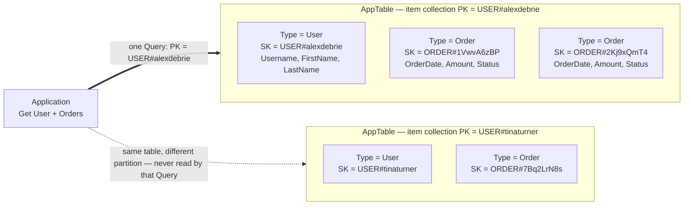

## Objective

Understand what single-table design in DynamoDB actually is — many entity types packed into one table, distinguished by overloaded `PK`/`SK` values rather than by separate tables — why it exists at all (there are no joins, so the only way to fetch heterogeneous related items in one round trip is to have pre-joined them into the same item collection), and, just as importantly, the book's own three named downsides and the two situations where it says the downsides win.

## Use Cases

- Explaining to a team coming from relational modeling why "one table per entity type" is the *wrong* default here, and why the table looks, in Forrest Brazeal's phrase quoted by the book, "more like machine code than a simple spreadsheet."
- Deciding, at the start of a greenfield service, whether to pay the single-table modeling tax at all — the book gives two explicit escape hatches, and a startup pre-product-market-fit is one of them.
- Diagnosing a DynamoDB-backed API whose p99 is dominated by serial round trips: fetch the parent, then fetch the children with the id you just learned. That waterfall is exactly what item collections exist to collapse.
- Reviewing a GraphQL + DynamoDB backend and recognizing that the resolver execution model already re-introduces the serial requests single-table design was meant to eliminate — so the modeling effort buys much less than it costs.
- Planning the analytics story for a DynamoDB service *before* the table is designed, because "unwinding the pretzel" back into normalized shape is work that has to move earlier in the project than teams expect.
- Justifying a deliberate multi-table ("Faux-SQL") design in a code review without it reading as ignorance of best practice — which the book insists is the only acceptable way to opt out: understand single-table design first, then decline it on purpose.

## Deep Dive

### What single-table design is, stated plainly

The book's chapter summary is one sentence: **"When modeling with DynamoDB, use as few tables as possible. Ideally, you can handle an entire application with a single table."** DeBrie names the obstacle up front — it is a psychological one, not a technical one: *"It has been ingrained deeply in our psyche that each type in our application gets its own table in the database. With DynamoDB, it's flipped."* The target is one table per application or per microservice.

So single-table design means a User item and an Order item and a SensorReading item all live in the same physical DynamoDB table, sharing one partition-key/sort-key space. The key attributes cannot be named after any one entity's identifier — a partition key that holds a username for one item and an order id for another can't be called `Username` — which is where the generic `PK`/`SK` convention comes from. The values are what carry the entity type, written as prefixed templates like `USER#alexdebrie` and `ORDER#<OrderId>`.

### Why it exists: the join that isn't there

The chapter arrives at single-table design by way of database history rather than by asserting it.

In a relational database you normalize: an e-commerce app gets a `Customers` table and an `Orders` table, each Order belongs to a Customer, and foreign keys act as pointers between them. To follow those pointers, SQL has joins — combining records from two or more tables **at read time**.

Joins are convenient and expensive: *"They require scanning large portions of multiple tables in your relational database, comparing different values, and returning a result set."* DynamoDB was built for use cases like the Amazon.com shopping cart, which *"can't tolerate the inconsistency and slowing performance of joins as a dataset scales."* And rather than trying to make joins scale, DynamoDB does something more radical — *"DynamoDB closely guards against any operations that won't scale, and there's not a great way to make relational joins scale. Rather than working to make joins scale better, DynamoDB sidesteps the problem by removing the ability to use joins at all."*

But you still need the *benefit* joins provided, which the book identifies precisely: **the ability to get multiple, heterogeneous items from your database in a single request.** If you keep the relational instinct and split entity types across tables, that benefit is gone and you have to reconstruct it in application code — *"they'll need to make multiple, serial requests to fetch both the Orders and the Customer record."* The cost is not CPU, it's network:

> "Network I/O is likely the slowest part of your application, but now you're making multiple network requests in a waterfall fashion, where one request provides data that is used for subsequent requests. As your application scales, this pattern gets slower and slower."

### The solution: pre-join your data into item collections

An **item collection** is *"all the items in a table or index that share a partition key."* The book's small illustration is a table of actors and the movies they played in — a composite primary key where the partition key is the actor's name and the sort key is the movie name, so the two Tom Hanks items (Cast Away and Toy Story) are in the same item collection because they share the partition key `Tom Hanks`.

That is the whole mechanism. `Query` reads multiple items sharing one partition key, so *"if you need to retrieve multiple heterogeneous items in a single request, you organize those items so that they are in the same item collection."* The book's e-commerce worked example (developed in full in Chapter 19) has an access pattern of *fetch the User record and the Order records* — so all Order records are deliberately placed in the same item collection as the User they belong to:



Read the diagram as two facts, not one. First, `PK` is **overloaded**: its value is a template per entity type, and here both the User item and its Order items resolve that template to the same string, which is precisely what puts them in one collection. `SK` is overloaded too — `USER#alexdebrie` for the metadata item, `ORDER#<OrderId>` for each order — so the sort key both disambiguates entity type and gives the orders a deterministic sort order within the collection. Second, the partition is the filter: a `Query` on `USER#alexdebrie` never touches Tina Turner's items, no records are read and discarded, and the request stays surgical regardless of how large the table grows.

The book's summary line: *"This is what single-table design is all about—tuning your table so that your access patterns can be handled with as few requests to DynamoDB as possible, ideally one."*

A convention that makes this survivable in practice comes one chapter later (Chapter 9.4): **add a `Type` attribute to every item** — a plain string like `User`, `Order`, `SensorReading`. The primary key prefixes already distinguish entity types, *"but it can be difficult to easily distinguish between this with a glance or when doing a filter expression."* DeBrie uses it for three things: orienting himself in the AWS console, filtering by entity type in the background ETL scans that migrations require, and finding the right items to move when re-normalizing an export for analytics. Note that this is a Chapter 9 *implementation* tip, not part of the Chapter 8 definition — but it is the attribute most single-table tables in the wild actually carry.

### The two lesser benefits, and the book's honesty about them

Beyond round-trip reduction, DeBrie lists two more and then deflates both:

- **Operational overhead.** Each table needs alarms and metrics. *"If you have one table with all items in it rather than eight separate tables, you reduce the number of alarms and metrics to watch."*
- **Cost.** With provisioned capacity you size RCUs/WCUs per table with a safety margin; one table lets a hot entity type borrow the buffer provisioned for the cold ones.

Then: *"While these two benefits are real, they're pretty marginal. The operations burden on DynamoDB is quite low, and the pricing will only save you a bit of money on the margins."* And the capacity argument evaporates entirely on the pricing mode most teams now pick by default — *"if you are using DynamoDB On-Demand pricing, you won't save any money by going to a multi-table design."* The main benefit is, and remains, the single request.

### The three downsides — the book's own list

Section 8.2 is titled "Downsides of a single-table design" and names three.

**1. The steep learning curve.** *"The biggest complaint I get from members of the community is around the difficulty of learning single-table design in DynamoDB. A single, over-loaded DynamoDB table looks really weird compared to the clean, normalized tables of your relational database. It's hard to unlearn all the lessons you've learned over years of relational data modeling."* DeBrie empathizes and then refuses the excuse: *"Software development is a continuous journey of learning, and you can't use the difficulty of learning new things as an excuse to use a new thing poorly."* If you want infinite scalability, a convenient connection model, and consistent performance, you pay in learning.

**2. The inflexibility of new access patterns.** This one he grades differently — *"This complaint has more validity."* Because you model access patterns first and shape item collections around them, *"your table design is narrowly tailored for the exact purpose for which it has been designed. If your access patterns change because you're adding new objects or accessing multiple objects in different ways, you may need to do an ETL process to scan every item in your table and update with new attributes."* His qualifier is real but modest: *"This process isn't impossible, but it does add friction to your development process"* and *"migrations aren't to be feared"* — Chapter 15 covers strategies, Chapter 22 implements them. Friction, not a wall.

**3. The difficulty of analytics.** DynamoDB is deliberately an OLTP database — *"high speed, high velocity data access where you're operating on a few records at a time"* — and *"DynamoDB is not good at OLAP queries. This is intentional."* Getting data out into a purpose-built analytics system is where single-table design bites: *"You've denormalized your data and twisted it into a pretzel that's designed to handle your exact use cases. Now you need to unwind that table and re-normalize it so that it's useful for analytics."* Hence the Brazeal quote — *"[A] well-optimized single-table DynamoDB layout looks more like machine code than a simple spreadsheet"* — and the scheduling consequence: *"Your data infrastructure work will need to be pushed forward in your development process to make sure you can reconstitute your table in an analytics-friendly way."*

### When *not* to use single-table design

Section 8.3 is the part the book calls "the more controversial part," and it does not hedge into meaninglessness. The generic answer is *"whenever the benefits don't outweigh the costs"*; the concrete one is **"whenever I need query flexibility and/or easier analytics more than I need blazing fast performance."** Two occasions where that is most likely:

**New applications that prioritize flexibility.** Serverless compute pushed a lot of teams onto DynamoDB because it fits Lambda so well — *"From provisioning to pricing to permissions to the connection model, DynamoDB is a perfect fit with serverless applications."* But DeBrie draws a sharp distinction: *"while DynamoDB works great with serverless, it was not built for serverless."* It was built for applications outscaling relational databases — *"And relational databases can scale pretty darn far!"* The diagnostic follows from that: *"If you're in the situation where you're out-scaling a relational database, you probably have a good sense of the access patterns you need. But if you're making a greenfield application at a startup, it's unlikely you absolutely require the scaling capabilities of DynamoDB to start, and you may not know how your application will evolve over time."* In that case he sanctions a **"Faux-SQL"** approach — DynamoDB used relationally, data normalized across multiple tables, accepting the serial round trips. The cost is quantified honestly: *"Not all applications need to have sub-30ms response times. If your application is fine with 100ms response times, the increased flexibility and easier analytics for early-stage use cases might be worth the slower performance."*

**GraphQL applications.** He pre-empts the objection — yes, GraphQL is an execution engine, not a query language, and yes it's database agnostic — and states the actual claim: *"I'm saying that because of the way GraphQL's execution works, you're losing most of the benefits of a single-table design while still inheriting all of the costs."* The mechanism is the resolver model. A query like

```graphql
query { User( id:112233 ){
    firstName
    lastName
    addresses
    orders {
      orderDate
      amount
      status
    }
  }
}
```

collapses the *client's* round trips to one — which is a genuine win, and structurally the same win single-table design gives you against the database. But inside the server, *"resolvers are essentially independent from each other."* The root resolver queries for User 112233; only once that resolves is the result handed to the Order resolver, which issues its own database requests. *"In this flow, our backend is making multiple, serial requests to DynamoDB to fulfill our access pattern. This is exactly what we're trying to avoid with single-table design!"* Conclusion: *"I just think it's a waste to spend time on a single-table design when using GraphQL with DynamoDB. Because GraphQL entities are resolved separately, I think it's fine to model each entity in a separate table. It will allow for more flexibility and make it easier for analytics purposes going forward."*

Both exceptions come with a fence around them, and it is worth quoting because it is what separates an informed opt-out from cargo-culting: *"these are exceptions, not general guidance… And even if you opt into a multi-table design, you should understand single-table design to know why it's not a good fit for your specific application."* The chapter closes the same way: *"I'm still a strong proponent of single-table design in DynamoDB in most use cases. And even if you don't think it's right for your situation, I still think you should learn and understand single-table design before opting out of it."*

### Book vs. today: the mechanism is unchanged; two of the three downsides got real relief

Nothing in the core argument has been invalidated — DynamoDB still has no joins, item collections are still the pre-join mechanism, and `Query` on a shared partition key is still the single-request primitive. What changed since April 2020 is the surrounding tooling, and it lands mostly on downsides 2 and 3.

> **The analytics downside is substantially smaller.** The book's third downside was written before DynamoDB had any first-class export path. Since then AWS added export to Amazon S3 (full, then incremental), and zero-ETL integrations to Amazon Redshift and Amazon OpenSearch Service. The *shape* problem the book describes is unchanged — items are still heterogeneous, and you still have to re-normalize them downstream, which is exactly what the `Type` attribute is for — but the plumbing to get the data out is no longer something you build and operate yourself. Read the downside today as "you still own a transformation step," not "you own a pipeline."

> **PartiQL is not the flexibility escape hatch it looks like.** PartiQL support arrived after the book, so the chapter never mentions it. It gives you SQL-shaped `SELECT`/`INSERT`/`UPDATE`/`DELETE`, but it adds **no joins** and changes none of the reasoning here: a `SELECT` still resolves to `GetItem`, `Query`, or `Scan` depending on whether the `WHERE` clause constrains the key, so a statement that ignores the partition key is a full table scan in SQL clothing. Downside 2 is untouched by it.

> **AWS's own guidance now frames this as an explicit choice rather than a best practice with exceptions.** AWS Prescriptive Guidance carries a dedicated "single-table vs. multi-table design" discussion that gives multi-table designs more credit than 2020-era community advice did — notably that on-demand capacity removes the cost argument (a point the book itself already concedes) and that separate tables can be simpler to reason about, secure, and evolve independently. This is not a reversal; it is the book's own section 8.3 promoted from "exception" to "documented alternative." The two situations DeBrie named remain the best-articulated version of when to take it — and his GraphQL point is quietly ratified by AWS's own GraphQL tooling, where the Amplify GraphQL transformer generates **one DynamoDB table per `@model`** by default rather than a single overloaded table.

> **Resolver batching softens the GraphQL argument without removing it.** AppSync batch resolvers and DataLoader-style batching collapse the N+1 fan-out *within* a level of the query, so the modern GraphQL-over-DynamoDB backend is not as request-happy as the book's diagram implies. But batching is per-type and per-level; it cannot fuse a parent lookup and its children into one `Query` the way a shared partition key does, because the child resolver still cannot run until the parent has resolved. The structural point — serial, level-by-level resolution — stands.

## Trade-offs

- **The learning curve is the downside the book argues away, and it is the one that costs teams the most.** DeBrie's response to it — you can't use the difficulty of learning new things as an excuse to use a new thing poorly — is fair as a personal ethic and weak as an engineering estimate. On a real team the cost is not one person's study time: it is slower code review, longer onboarding, a console view that actively misleads anyone debugging an incident, and a standing temptation for a new hire to "clean up" the table into one-per-entity. Treat it as a recurring cost on every future team member, not a one-time cost on the designer.
- **Inflexibility is the downside he grades as valid, and "migrations aren't to be feared" understates it at scale.** A new access pattern that your existing key attributes don't support is a scan-and-backfill ETL across every item in the table, written by you, run against live production data, with the new index unusable until it completes. On a small table that is an afternoon. On a hundred million items it is a project with a rollback plan. In SQL the same requirement is frequently one `CREATE INDEX` over a column that already exists. The asymmetry is real and it is the single best reason to take the two exceptions in 8.3 seriously.
- **"As few requests as possible, ideally one" is a latency optimization, and you should check that latency is what you're short of.** The book's own framing of the exception is the honest version: if 100ms is fine, the flexibility is worth more than sub-30ms. Many CRUD services genuinely are latency-insensitive relative to their development velocity, and paying the modeling tax to win 70ms nobody notices is a bad trade — while a shopping cart at Amazon scale is exactly the workload where it isn't.
- **The two marginal benefits are weaker now than when the book listed them.** Fewer alarms and shared capacity buffer were already called "pretty marginal," and on-demand pricing zeroes out the second one outright — which is the default most new tables pick. Don't put either in the justification column; if single-table design is right, it's right because of the round trips.
- **Single-table design concentrates blast radius as well as data.** One table means one set of IAM permissions, one throttling surface, one set of CloudWatch metrics where a runaway entity type's traffic is averaged in with everything else, and one restore granularity: point-in-time recovery restores the whole table, so you cannot roll back one entity type without rolling back all of them. Multi-table design gives per-entity isolation on all of those axes for free. The book's operational-overhead argument counts the alarms and not the blast radius.
- **The analytics cost moves work earlier in the project, which is when teams are least willing to do it.** "Your data infrastructure work will need to be pushed forward in your development process" is easy to nod at and hard to execute — the analytics requirement usually arrives from a stakeholder six months after launch, at which point the pretzel is already load-bearing. Managed export and zero-ETL have removed the pipeline-building work, not the re-normalization design work. Adding the `Type` attribute from day one is the cheapest insurance available here and there is no reason to skip it.
- **The GraphQL exception is stated more absolutely than the mechanism warrants — but erring toward multi-table there is still the right default.** "Losing most of the benefits while inheriting all of the costs" is true for the naive resolver-per-type implementation, and resolver batching plus deliberately shaped resolvers can recover some of the single-request benefit. But you'd be fighting the execution model to get it, and the flexibility and analytics advantages of per-entity tables point the same way. Notably, AWS's own GraphQL tooling defaults to a table per model, which is the strongest available endorsement of the book's call.
- **Opting out without understanding is the failure mode, not opting out.** The fence around 8.3 matters: "Faux-SQL" chosen deliberately, with the round-trip cost measured and accepted, is a defensible architecture. The same table layout arrived at by relational reflex is the failure DeBrie describes in Chapter 7 — a design worse than just using the relational database, because you paid DynamoDB's constraints and collected none of its benefits.

## Documentation Links

- [Alex DeBrie, "The DynamoDB Book", v1.0.1 (2020) — Chapter 8, "The What, Why, and When of Single-Table Design in DynamoDB", p. 150-169](https://www.dynamodbbook.com/) — doc
- [AWS Documentation — Best Practices for Designing and Using Partition Keys Effectively](https://docs.aws.amazon.com/amazondynamodb/latest/developerguide/bp-partition-key-design.html) — doc
- [AWS Documentation — Single-Table vs. Multi-Table Design in DynamoDB](https://docs.aws.amazon.com/prescriptive-guidance/latest/dynamodb-data-modeling/single-table-vs-multi-table.html) — doc
- [AWS Documentation — Best Practices for Managing Many-to-Many Relationships (adjacency list / item collections)](https://docs.aws.amazon.com/amazondynamodb/latest/developerguide/bp-adjacency-graphs.html) — doc
- [AWS Documentation — Querying Tables and Indexes (the Query API operation)](https://docs.aws.amazon.com/amazondynamodb/latest/developerguide/Query.html) — doc
- [AWS Documentation — Exporting DynamoDB Table Data to Amazon S3](https://docs.aws.amazon.com/amazondynamodb/latest/developerguide/S3DataExport.HowItWorks.html) — doc
- [AWS Documentation — PartiQL for DynamoDB](https://docs.aws.amazon.com/amazondynamodb/latest/developerguide/ql-reference.html) — doc
