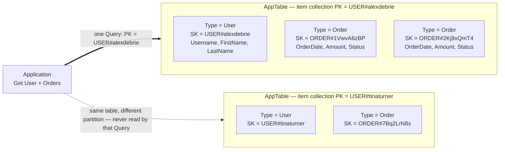

## Objective

Entender o que single-table design no DynamoDB de fato é (muitos tipos de entidade empacotados em uma tabela, distinguidos por valores sobrecarregados de `PK`/`SK`, em vez de tabelas separadas), por que existe de forma alguma (não há joins, então a única forma de buscar itens heterogêneos relacionados em uma única ida e volta é tê-los pré-juntado na mesma item collection), e, igualmente importante, as três desvantagens que o próprio livro nomeia e as duas situações em que ele diz que as desvantagens vencem.

## Use Cases

- Explicar a um time vindo de modelagem relacional por que "uma tabela por tipo de entidade" é o padrão *errado* aqui, e por que a tabela parece, na frase de Forrest Brazeal citada pelo livro, "mais com código de máquina do que uma planilha simples."
- Decidir, no início de um serviço greenfield, se vale a pena pagar o imposto de modelagem de single-table de forma alguma: o livro dá duas válvulas de escape explícitas, e uma startup pré-product-market-fit é uma delas.
- Diagnosticar uma API apoiada em DynamoDB cujo p99 é dominado por idas e voltas seriais: buscar o pai, depois buscar os filhos com o id que você acabou de aprender. Essa cascata é exatamente o que item collections existem para colapsar.
- Revisar um backend GraphQL + DynamoDB e reconhecer que o modelo de execução de resolver já reintroduz as requisições seriais que o single-table design pretendia eliminar, então o esforço de modelagem compra muito menos do que custa.
- Planejar a história de analytics para um serviço DynamoDB *antes* de a tabela ser desenhada, porque "desfazer o pretzel" de volta para uma forma normalizada é trabalho que precisa se mover mais cedo no projeto do que times esperam.
- Justificar um design deliberado multi-tabela ("Faux-SQL") em uma revisão de código sem que pareça ignorância de boa prática, que o livro insiste ser a única forma aceitável de não usar: entenda single-table design primeiro, depois o recuse de propósito.

## Deep Dive

### O que é single-table design, dito claramente

O resumo de capítulo do livro é uma frase: **"ao modelar com o DynamoDB, use o mínimo de tabelas possível. Idealmente, você consegue lidar com uma aplicação inteira com uma única tabela."** DeBrie nomeia o obstáculo antecipadamente: é psicológico, não técnico: *"está profundamente enraizado na nossa psique que cada tipo na nossa aplicação ganha sua própria tabela no banco de dados. Com o DynamoDB, isso se inverte."* O alvo é uma tabela por aplicação ou por microsserviço.

Então single-table design significa que um item User e um item Order e um item SensorReading todos vivem na mesma tabela física do DynamoDB, compartilhando um único espaço de partition-key/sort-key. Os atributos de chave não podem ser nomeados de acordo com o identificador de nenhuma entidade em particular: uma partition key que guarda um username para um item e um order id para outro não pode ser chamada de `Username`, daí a convenção genérica `PK`/`SK`. Os valores são o que carregam o tipo de entidade, escritos como templates prefixados, tipo `USER#alexdebrie` e `ORDER#<OrderId>`.

### Por que existe: o join que não está lá

O capítulo chega ao single-table design pela via da história de bancos de dados, em vez de apenas afirmá-lo.

Em um banco de dados relacional você normaliza: uma aplicação de e-commerce ganha uma tabela `Customers` e uma tabela `Orders`, cada Order pertence a um Customer, e chaves estrangeiras agem como ponteiros entre eles. Para seguir esses ponteiros, o SQL tem joins: combinando registros de duas ou mais tabelas **no momento da leitura**.

Joins são convenientes e caros: *"exigem varrer grandes porções de múltiplas tabelas no seu banco de dados relacional, comparando valores diferentes, e retornando um conjunto de resultados."* O DynamoDB foi construído para casos de uso como o carrinho de compras da Amazon.com, que *"não pode tolerar a inconsistência e a desaceleração de performance de joins conforme um conjunto de dados escala."* E em vez de tentar fazer joins escalarem, o DynamoDB faz algo mais radical: *"o DynamoDB se protege fortemente contra qualquer operação que não vá escalar, e não existe uma boa forma de fazer joins relacionais escalarem. Em vez de trabalhar para fazer joins escalarem melhor, o DynamoDB contorna o problema removendo completamente a capacidade de usar joins."*

Mas você ainda precisa do *benefício* que joins forneciam, que o livro identifica precisamente: **a capacidade de obter múltiplos itens heterogêneos do seu banco de dados em uma única requisição.** Se você mantém o instinto relacional e divide tipos de entidade entre tabelas, esse benefício desaparece e você precisa reconstruí-lo em código de aplicação: *"eles vão precisar fazer múltiplas requisições seriais para buscar tanto os Orders quanto o registro do Customer."* O custo não é CPU, é rede:

> "I/O de rede é provavelmente a parte mais lenta da sua aplicação, mas agora você está fazendo múltiplas requisições de rede em forma de cascata, onde uma requisição fornece dado que é usado para requisições subsequentes. Conforme sua aplicação escala, esse padrão fica cada vez mais lento."

### A solução: pré-junte seu dado em item collections

Uma **item collection** é *"todos os itens em uma tabela ou índice que compartilham uma partition key."* A pequena ilustração do livro é uma tabela de atores e os filmes em que atuaram: uma chave primária composta onde a partition key é o nome do ator e a sort key é o nome do filme, então os dois itens de Tom Hanks (Cast Away e Toy Story) estão na mesma item collection porque compartilham a partition key `Tom Hanks`.

Esse é o mecanismo inteiro. `Query` lê múltiplos itens compartilhando uma partition key, então *"se você precisa recuperar múltiplos itens heterogêneos em uma única requisição, você organiza esses itens de forma que estejam na mesma item collection."* O exemplo trabalhado de e-commerce do livro (desenvolvido por completo no Capítulo 19) tem um padrão de acesso de *buscar o registro do User e os registros de Order*: então todos os registros de Order são deliberadamente colocados na mesma item collection que o User a que pertencem:



Leia o diagrama como dois fatos, não um. Primeiro, `PK` é **sobrecarregado**: seu valor é um template por tipo de entidade, e aqui tanto o item User quanto seus itens Order resolvem esse template para a mesma string, que é precisamente o que os coloca em uma collection. `SK` também é sobrecarregado: `USER#alexdebrie` para o item de metadado, `ORDER#<OrderId>` para cada order, então a sort key tanto desambigua o tipo de entidade quanto dá aos orders uma ordem de classificação determinística dentro da collection. Segundo, a partição é o filtro: um `Query` em `USER#alexdebrie` nunca toca nos itens de Tina Turner, nenhum registro é lido e descartado, e a requisição permanece cirúrgica independentemente de quão grande a tabela cresça.

A frase resumo do livro: *"é isso que single-table design é sobre tudo: ajustar sua tabela para que seus padrões de acesso possam ser atendidos com o mínimo possível de requisições ao DynamoDB, idealmente uma."*

Uma convenção que torna isso sobrevivível na prática vem um capítulo depois (Capítulo 9.4): **adicione um atributo `Type` a todo item**: uma string simples como `User`, `Order`, `SensorReading`. Os prefixos de chave primária já distinguem tipos de entidade, *"mas pode ser difícil distinguir isso facilmente de relance ou ao fazer uma expressão de filtro."* DeBrie o usa para três coisas: se orientar no console da AWS, filtrar por tipo de entidade nos scans de ETL em segundo plano que migrações exigem, e encontrar os itens certos para mover ao renormalizar uma exportação para analytics. Repare que essa é uma dica de *implementação* do Capítulo 9, não parte da definição do Capítulo 8, mas é o atributo que a maioria das tabelas single-table na vida real de fato carrega.

### Os dois benefícios menores, e a honestidade do livro sobre eles

Além da redução de idas e voltas, DeBrie lista mais dois e então desinfla ambos:

- **Overhead operacional.** Cada tabela precisa de alarmes e métricas. *"Se você tem uma tabela com todos os itens nela, em vez de oito tabelas separadas, você reduz o número de alarmes e métricas para observar."*
- **Custo.** Com capacidade provisionada, você dimensiona RCUs/WCUs por tabela com uma margem de segurança; uma tabela permite que um tipo de entidade quente peça emprestado o buffer provisionado para os frios.

Então: *"embora esses dois benefícios sejam reais, eles são bem marginais. O fardo operacional no DynamoDB é bem baixo, e a precificação só vai te economizar um pouco de dinheiro nas margens."* E o argumento de capacidade evapora completamente no modo de precificação que a maioria dos times agora escolhe por padrão: *"se você está usando a precificação On-Demand do DynamoDB, você não vai economizar nenhum dinheiro indo para um design multi-tabela."* O benefício principal é, e continua sendo, a requisição única.

### As três desvantagens: a própria lista do livro

A Seção 8.2 se chama "Desvantagens de um design single-table" e nomeia três.

**1. A curva de aprendizado íngreme.** *"A maior reclamação que recebo de membros da comunidade é em torno da dificuldade de aprender single-table design no DynamoDB. Uma única tabela DynamoDB sobrecarregada parece muito estranha comparada às tabelas limpas e normalizadas do seu banco de dados relacional. É difícil desaprender todas as lições que você aprendeu ao longo de anos de modelagem de dados relacional."* DeBrie tem empatia e então recusa a desculpa: *"desenvolvimento de software é uma jornada contínua de aprendizado, e você não pode usar a dificuldade de aprender coisas novas como desculpa para usar uma coisa nova mal."* Se você quer escalabilidade infinita, um modelo de conexão conveniente, e performance consistente, você paga em aprendizado.

**2. A inflexibilidade de novos padrões de acesso.** Esta ele avalia diferente: *"essa reclamação tem mais validade."* Como você modela padrões de acesso primeiro e molda item collections em torno deles, *"o design da sua tabela é estreitamente talhado para o propósito exato para o qual foi desenhado. Se seus padrões de acesso mudam porque você está adicionando novos objetos ou acessando múltiplos objetos de formas diferentes, você pode precisar fazer um processo de ETL para varrer todo item na sua tabela e atualizar com novos atributos."* Sua ressalva é real, mas modesta: *"esse processo não é impossível, mas adiciona fricção ao seu processo de desenvolvimento"* e *"migrações não devem ser temidas"*: o Capítulo 15 cobre estratégias, o Capítulo 22 as implementa. Fricção, não uma parede.

**3. A dificuldade de analytics.** O DynamoDB é deliberadamente um banco de dados OLTP: *"acesso a dado de alta velocidade, alta vazão, onde você está operando em alguns registros de cada vez"*, e *"o DynamoDB não é bom em queries OLAP. Isso é intencional."* Tirar dado para um sistema de analytics feito sob medida é onde o single-table design morde: *"você desnormalizou seu dado e o torceu em um pretzel desenhado para lidar com seus casos de uso exatos. Agora você precisa desfazer aquela tabela e renormalizá-la para que seja útil para analytics."* Daí a citação de Brazeal: *"[um] layout DynamoDB single-table bem otimizado parece mais com código de máquina do que uma planilha simples"*, e a consequência de cronograma: *"seu trabalho de infraestrutura de dado vai precisar ser empurrado para mais cedo no seu processo de desenvolvimento, para garantir que você consiga reconstituir sua tabela de uma forma amigável a analytics."*

### Quando *não* usar single-table design

A Seção 8.3 é a parte que o livro chama de "a parte mais controversa", e ela não recua até a insignificância. A resposta genérica é *"sempre que os benefícios não superam os custos"*; a concreta é **"sempre que eu preciso de flexibilidade de query e/ou analytics mais fáceis mais do que preciso de performance extremamente rápida."** Duas ocasiões onde isso é mais provável:

**Aplicações novas que priorizam flexibilidade.** Computação serverless empurrou muitos times para o DynamoDB porque se encaixa tão bem com o Lambda: *"de provisionamento a precificação a permissões ao modelo de conexão, o DynamoDB é um encaixe perfeito com aplicações serverless."* Mas DeBrie traça uma distinção nítida: *"embora o DynamoDB funcione ótimo com serverless, ele não foi construído para serverless."* Foi construído para aplicações que superam a escala de bancos de dados relacionais: *"e bancos de dados relacionais conseguem escalar bem longe!"* O diagnóstico decorre disso: *"se você está na situação de superar a escala de um banco de dados relacional, você provavelmente tem um bom senso dos padrões de acesso de que precisa. Mas se você está fazendo uma aplicação greenfield em uma startup, é improvável que você absolutamente precise das capacidades de escalonamento do DynamoDB para começar, e você pode não saber como sua aplicação vai evoluir com o tempo."* Nesse caso ele sanciona uma abordagem **"Faux-SQL"**: DynamoDB usado relacionalmente, dado normalizado entre múltiplas tabelas, aceitando as idas e voltas seriais. O custo é quantificado honestamente: *"nem toda aplicação precisa ter tempos de resposta de sub-30ms. Se sua aplicação está bem com tempos de resposta de 100ms, a flexibilidade aumentada e analytics mais fáceis para casos de uso em estágio inicial podem valer a performance mais lenta."*

**Aplicações GraphQL.** Ele antecipa a objeção (sim, GraphQL é um motor de execução, não uma linguagem de query, e sim é agnóstico de banco de dados) e enuncia a afirmação real: *"estou dizendo que, por causa de como a execução do GraphQL funciona, você está perdendo a maioria dos benefícios de um single-table design enquanto ainda herda todos os custos."* O mecanismo é o modelo de resolver. Uma query como

```graphql
query { User( id:112233 ){
    firstName
    lastName
    addresses
    orders {
      orderDate
      amount
      status
    }
  }
}
```

colapsa as idas e voltas do *cliente* para uma, que é uma vitória genuína, e estruturalmente a mesma vitória que single-table design te dá contra o banco de dados. Mas dentro do servidor, *"resolvers são essencialmente independentes uns dos outros."* O resolver raiz consulta pelo User 112233; só depois que isso resolve o resultado é entregue ao resolver de Order, que emite suas próprias requisições ao banco de dados. *"Nesse fluxo, nosso backend está fazendo múltiplas requisições seriais ao DynamoDB para cumprir nosso padrão de acesso. Isso é exatamente o que estamos tentando evitar com single-table design!"* Conclusão: *"eu simplesmente acho que é um desperdício gastar tempo em um single-table design ao usar GraphQL com DynamoDB. Como entidades GraphQL são resolvidas separadamente, eu acho que tudo bem modelar cada entidade em uma tabela separada. Isso vai permitir mais flexibilidade e tornar mais fácil para propósitos de analytics adiante."*

Ambas as exceções vêm com uma cerca ao redor, e vale a pena citar porque é o que separa uma recusa informada de um cargo-culting: *"essas são exceções, não orientação geral… e mesmo que você opte por um design multi-tabela, você deveria entender single-table design para saber por que ele não é um bom encaixe para sua aplicação específica."* O capítulo fecha da mesma forma: *"eu ainda sou um forte proponente de single-table design no DynamoDB na maioria dos casos de uso. E mesmo que você não ache certo para sua situação, eu ainda acho que você deveria aprender e entender single-table design antes de optar por não usá-lo."*

### Book vs. today: o mecanismo permanece inalterado; dois dos três problemas ganharam alívio real

Nada no argumento central foi invalidado: o DynamoDB ainda não tem joins, item collections ainda são o mecanismo de pré-junção, e `Query` em uma partition key compartilhada ainda é a primitiva de requisição única. O que mudou desde abril de 2020 é o ferramental ao redor, e cai principalmente nas desvantagens 2 e 3.

> **A desvantagem de analytics é substancialmente menor.** A terceira desvantagem do livro foi escrita antes de o DynamoDB ter qualquer caminho de exportação de primeira classe. Desde então a AWS adicionou exportação para o Amazon S3 (completa, depois incremental), e integrações zero-ETL para o Amazon Redshift e o Amazon OpenSearch Service. O problema de *forma* que o livro descreve permanece inalterado: itens ainda são heterogêneos, e você ainda precisa renormalizá-los downstream, que é exatamente para que serve o atributo `Type`, mas a encanação para tirar o dado não é mais algo que você constrói e opera você mesmo. Leia a desvantagem hoje como "você ainda é dono de um passo de transformação", não "você é dono de um pipeline."

> **O PartiQL não é a válvula de escape de flexibilidade que parece.** O suporte a PartiQL chegou depois do livro, então o capítulo nunca o menciona. Ele te dá `SELECT`/`INSERT`/`UPDATE`/`DELETE` em forma de SQL, mas não adiciona **nenhum join** e não muda nada do raciocínio aqui: um `SELECT` ainda resolve para `GetItem`, `Query`, ou `Scan`, dependendo de se a cláusula `WHERE` restringe a chave, então uma declaração que ignora a partition key é uma varredura de tabela completa vestida de SQL. A desvantagem 2 não é tocada por ele.

> **A própria orientação da AWS agora enquadra isso como uma escolha explícita, em vez de uma boa prática com exceções.** O AWS Prescriptive Guidance carrega uma discussão dedicada de "single-table vs. multi-table design" que dá mais crédito a designs multi-tabela do que o conselho da comunidade da era 2020 dava, notavelmente que capacidade on-demand remove o argumento de custo (um ponto que o próprio livro já concede) e que tabelas separadas podem ser mais simples de raciocinar, proteger, e evoluir independentemente. Isso não é uma reversão; é a própria seção 8.3 do livro promovida de "exceção" para "alternativa documentada." As duas situações que DeBrie nomeou continuam sendo a versão mais bem articulada de quando adotá-la, e seu ponto sobre GraphQL é silenciosamente ratificado pelo próprio ferramental GraphQL da AWS, onde o transformador GraphQL do Amplify gera **uma tabela DynamoDB por `@model`** por padrão, em vez de uma única tabela sobrecarregada.

> **Batching de resolver suaviza o argumento GraphQL sem removê-lo.** Resolvers de batch do AppSync e batching estilo DataLoader colapsam o fan-out N+1 *dentro* de um nível da query, então o backend moderno GraphQL-sobre-DynamoDB não é tão ávido por requisições quanto o diagrama do livro sugere. Mas batching é por tipo e por nível; não consegue fundir uma busca de pai e seus filhos em um único `Query` da forma que uma partition key compartilhada faz, porque o resolver do filho ainda não pode rodar até que o pai tenha resolvido. O ponto estrutural (resolução serial, nível por nível) permanece.

## Trade-offs

- **A curva de aprendizado é a desvantagem que o livro argumenta embora, e é a que mais custa aos times.** A resposta de DeBrie a ela (você não pode usar a dificuldade de aprender coisas novas como desculpa para usar uma coisa nova mal) é justa como ética pessoal e fraca como estimativa de engenharia. Em um time real, o custo não é o tempo de estudo de uma pessoa: é revisão de código mais lenta, integração mais longa, uma visualização de console que ativamente engana qualquer um depurando um incidente, e uma tentação constante de um novo contratado "limpar" a tabela de volta para uma-por-entidade. Trate como um custo recorrente em todo futuro membro do time, não um custo único no designer.
- **Inflexibilidade é a desvantagem que ele avalia como válida, e "migrações não devem ser temidas" a subestima em escala.** Um novo padrão de acesso que seus atributos de chave existentes não suportam é um ETL de scan-e-backfill através de todo item na tabela, escrito por você, rodado contra dado de produção ao vivo, com o novo índice inutilizável até completar. Em uma tabela pequena isso é uma tarde. Em cem milhões de itens é um projeto com um plano de rollback. Em SQL a mesma exigência frequentemente é um único `CREATE INDEX` sobre uma coluna que já existe. A assimetria é real e é a melhor razão para levar as duas exceções da seção 8.3 a sério.
- **"O mínimo possível de requisições, idealmente uma" é uma otimização de latência, e você deveria checar se latência é do que você está carente.** O próprio enquadramento do livro da exceção é a versão honesta: se 100ms está bom, a flexibilidade vale mais do que sub-30ms. Muitos serviços CRUD genuinamente são insensíveis a latência em relação à sua velocidade de desenvolvimento, e pagar o imposto de modelagem para ganhar 70ms que ninguém percebe é uma má troca, enquanto um carrinho de compras em escala Amazon é exatamente a carga de trabalho onde não é.
- **Os dois benefícios marginais são mais fracos agora do que quando o livro os listou.** Menos alarmes e buffer de capacidade compartilhado já eram chamados de "bem marginais", e precificação on-demand zera o segundo completamente, que é o padrão que a maioria das tabelas novas escolhe. Não coloque nenhum dos dois na coluna de justificativa; se single-table design está certo, está certo por causa das idas e voltas.
- **Single-table design concentra raio de impacto tanto quanto dado.** Uma tabela significa um conjunto de permissões IAM, uma superfície de throttling, um conjunto de métricas CloudWatch onde o tráfego de um tipo de entidade descontrolado é diluído junto com tudo o mais, e uma granularidade de restauração: point-in-time recovery restaura a tabela inteira, então você não consegue reverter um tipo de entidade sem reverter todos eles. Design multi-tabela dá isolamento por entidade em todos esses eixos de graça. O argumento de overhead operacional do livro conta os alarmes e não o raio de impacto.
- **O custo de analytics move trabalho para mais cedo no projeto, que é quando times estão menos dispostos a fazê-lo.** "Seu trabalho de infraestrutura de dado vai precisar ser empurrado para mais cedo no seu processo de desenvolvimento" é fácil de concordar e difícil de executar: o requisito de analytics geralmente chega de um stakeholder seis meses depois do lançamento, ponto no qual o pretzel já é essencial. Exportação gerenciada e zero-ETL removeram o trabalho de construir pipeline, não o trabalho de design de renormalização. Adicionar o atributo `Type` desde o dia um é o seguro mais barato disponível aqui e não há razão para pulá-lo.
- **A exceção do GraphQL é enunciada de forma mais absoluta do que o mecanismo garante, mas errar em direção a multi-tabela ali ainda é o padrão certo.** "Perder a maioria dos benefícios enquanto herda todos os custos" é verdade para a implementação ingênua de resolver-por-tipo, e batching de resolver mais resolvers deliberadamente moldados podem recuperar parte do benefício de requisição única. Mas você estaria lutando contra o modelo de execução para conseguir isso, e as vantagens de flexibilidade e analytics de tabelas por entidade apontam na mesma direção. Notavelmente, o próprio ferramental GraphQL da AWS padroniza em uma tabela por modelo, que é o endosso mais forte disponível para a decisão do livro.
- **Optar por não usar sem entender é o modo de falha, não optar por não usar.** A cerca ao redor da seção 8.3 importa: "Faux-SQL" escolhido deliberadamente, com o custo de ida e volta medido e aceito, é uma arquitetura defensável. O mesmo layout de tabela alcançado por reflexo relacional é a falha que DeBrie descreve no Capítulo 7: um design pior do que simplesmente usar o banco de dados relacional, porque você pagou as restrições do DynamoDB e não coletou nenhum de seus benefícios.

## Documentation Links

- [Alex DeBrie, "The DynamoDB Book", v1.0.1 (2020), Chapter 8, "The What, Why, and When of Single-Table Design in DynamoDB", p. 150-169](https://www.dynamodbbook.com/) - doc
- [AWS Documentation, Best Practices for Designing and Using Partition Keys Effectively](https://docs.aws.amazon.com/amazondynamodb/latest/developerguide/bp-partition-key-design.html) - doc
- [AWS Documentation, Single-Table vs. Multi-Table Design in DynamoDB](https://docs.aws.amazon.com/prescriptive-guidance/latest/dynamodb-data-modeling/single-table-vs-multi-table.html) - doc
- [AWS Documentation, Best Practices for Managing Many-to-Many Relationships (adjacency list / item collections)](https://docs.aws.amazon.com/amazondynamodb/latest/developerguide/bp-adjacency-graphs.html) - doc
- [AWS Documentation, Querying Tables and Indexes (the Query API operation)](https://docs.aws.amazon.com/amazondynamodb/latest/developerguide/Query.html) - doc
- [AWS Documentation, Exporting DynamoDB Table Data to Amazon S3](https://docs.aws.amazon.com/amazondynamodb/latest/developerguide/S3DataExport.HowItWorks.html) - doc
- [AWS Documentation, PartiQL for DynamoDB](https://docs.aws.amazon.com/amazondynamodb/latest/developerguide/ql-reference.html) - doc
