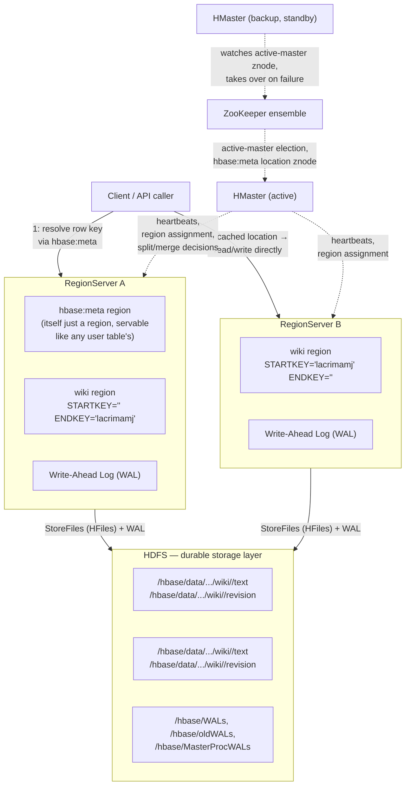
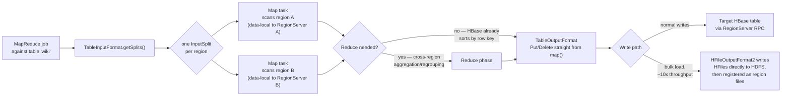

## Objective

Understand how a live HBase cluster is actually held together underneath the table abstraction: the **HMaster** coordinating cluster-wide bookkeeping, **RegionServers** each owning a set of **regions** (contiguous, non-overlapping slices of a table's row-key space), **HDFS** as the durable storage layer every RegionServer writes through, and **ZooKeeper** as the coordination service that lets every part of the cluster agree on who's in charge and where things live. The book frames the payoff plainly while watching a table grow in real time: "Because of its distributed architecture, HBase doesn't immediately know how many rows are in each table... [but] HBase's region-based storage architecture lends itself to fast distributed scanning." This concept is about that architecture — how a row key resolves to a region, a region to a server, and a scan to a set of parallel MapReduce map tasks — not about designing the row keys, column families, or schema themselves; that belongs to the sibling concept on HBase's data model and table administration.

## Use Cases

- Explaining why an HBase table that "feels" like one logical table is physically dozens or hundreds of independent files across a cluster: "the long-named subdirectory... represents an individual region," and each region lives in its own directory on HDFS, one subdirectory per column family underneath it.
- Diagnosing a slow row lookup by checking whether the client had to first resolve the row key against `hbase:meta` — "a special table whose sole purpose is to keep track of all the user tables and which region servers are responsible for serving the regions of those tables" — versus already having that location cached.
- Understanding what actually happens when a RegionServer crashes mid-write: the book's answer is the write-ahead log, not the HMaster — "the new stewards of those regions would look to the WAL to see what, if any, recovery steps are needed."
- Deciding whether to split a growing table's column families into a separate table, because "when you create a separate table, this has the advantage that the tables have separate regions, which in turn means that the cluster can more effectively split regions as necessary" — a decision that affects region distribution, distinct from the sibling concept's column-family-design angle on the same choice.
- Writing a batch analytics job — a link-graph extraction, a full-table transformation, a nightly aggregation — as a MapReduce job that reads an HBase table via `TableInputFormat` and either writes results back through `TableOutputFormat` or bulk-loads HFiles directly, rather than looping over a client-side `Scan` in application code.
- Deploying HBase on a managed Hadoop platform (the book uses AWS EMR) and understanding that HBase's regions/HDFS/ZooKeeper architecture is exactly what such a platform is provisioning underneath the managed veneer.
- Explaining why `count 'wiki'` on a multi-million-row table is a full table scan rather than a metadata lookup — HBase has no row-count index, so it "has to count them (by performing a table scan)," and that scan is the same operation a MapReduce job's map phase performs, just single-threaded.

## Deep Dive

### The four moving parts, and the job each one does

**RegionServers hold and serve the data.** A table's rows are kept in sorted order and cut into regions: "A region is a chunk of rows, identified by the starting key (inclusive) and ending key (exclusive). Regions never overlap, and each is assigned to a specific region server in the cluster." The book's own `du -h` trace makes this physical: after the standalone server's `wiki` table grew past a threshold, "the old region... is now gone and has been replaced by two new regions," each in its own directory, and "in a distributed environment these would be parceled across multiple region servers." Inside each region's directory sit subdirectories per column family — `text` and `revision` in the book's example — which is where the sibling concept's schema design decisions actually land on disk.

**HDFS is the storage layer underneath every region.** RegionServers don't own local disks the way a traditional database server does; they write StoreFiles (HFiles) and WALs into HDFS, which is why the book's disk-usage inspection happens at "the `data/default` directory in the `hbase.rootdir` location." This is also why HBase tolerates RegionServer failure without losing acknowledged writes — the data was never solely on that server's local disk to begin with.

**The write-ahead log is the durability mechanism, and it's per-RegionServer, not per-region.** "In HBase, logs are appended to the WAL before any edit operations (put and increment) are persisted to disk," because "the system does much better when I/O is buffered and written to disk in chunks." The book draws the direct line from WAL to recovery: "If the region server responsible for the affected region were to crash during this limbo period, HBase would use the WAL to determine which operations were successful and take corrective action. Without a WAL, a region server crash would mean that that not-yet-written data would be simply lost." This is also the performance lever the book's own import script exploits: `setWriteToWAL(false)` trades that durability guarantee for write throughput on data you can afford to reload, which is exactly the call the book makes for its rerunnable Wikipedia and link-extraction scripts.

**`hbase:meta` is the table that makes routing possible, and it's a table like any other.** "hbase:meta is a special table whose sole purpose is to keep track of all the user tables and which region servers are responsible for serving the regions of those tables." Critically, the book emphasizes that this catalog isn't special-cased infrastructure sitting outside HBase's own data model: "It turns out that the hbase:meta table can also be split into regions and served by region servers just like any other table would be." Scanning it directly shows the shape of a routing entry — `STARTKEY => '', ENDKEY => 'lacrimamj'` for one region and `STARTKEY => 'lacrimamj', ENDKEY => ''` for its sibling — with `STARTKEY` inclusive and `ENDKEY` exclusive, so a lookup for a row key does a range check against these boundaries to find its owning region and, from `info:server`, its owning RegionServer.

**HMaster assigns and reassigns; it does not sit on the read/write path.** "The assignment of regions to region servers, including hbase:meta regions, is handled by the master node, often referred to as HBaseMaster. The master server can also be a region server, performing both duties simultaneously." Its role is failure recovery and rebalancing, not query routing: "When a region server fails, the master server steps in and reassigns responsibility for regions previously assigned to the failed node," and recovery of the failed node's in-flight writes falls to the WAL, as above. The chain of authority itself has a failure plan too: "If the master server fails, responsibility defers to any of the other region servers that step up to become the master" — the book's stand-alone lab collapses HMaster and the single RegionServer into one process, which is why this election dance is invisible in Day 1 and Day 2 but becomes real once the cluster is distributed.

**ZooKeeper is the piece the book's lab setup hides but production clusters can't.** In the standalone exercises, HBase manages its own embedded ZooKeeper instance so none of this coordination is visible; in a real cluster, ZooKeeper is what a standby HMaster watches to know when to take over, and what stores the pointer to the region currently serving `hbase:meta` so any RegionServer or client can bootstrap its own view of the cluster without hardcoding a master address.

### Regions as the unit of both scale and MapReduce parallelism

The book's own scanning code — `wiki_table.getScanner(Scan.new)` iterating every row to extract wiki-links — is the same primitive a MapReduce job runs in parallel: "Because of its distributed architecture, HBase doesn't immediately know how many rows are in each table. To find out, it has to count them (by performing a table scan). Fortunately, HBase's region-based storage architecture lends itself to fast distributed scanning." A single-threaded JRuby scanner script and a MapReduce job differ mainly in how many of these scans run at once and where: HBase's `TableInputFormat` produces one InputSplit per region, so a MapReduce job's map task count tracks the table's region count, and each map task can run on the same physical node as the RegionServer hosting that region — the same data-locality trick HDFS gives ordinary MapReduce jobs, inherited automatically because regions are files on HDFS. `TableOutputFormat` writes results back as `Put`/`Delete` mutations issued through the normal client RPC path; a reduce phase is often skippable because HBase stores rows pre-sorted by row key, so a second sort adds cost without adding value. For genuinely large batch loads, bypassing per-row RPCs with a bulk load — writing HFiles directly via `HFileOutputFormat2` and registering them as region files — is the "order of magnitude" faster path, conceptually the batch-oriented sibling of the book's own `table.setAutoFlush(false)` / `flushCommits()` buffering trick for its Wikipedia importer, just operating at the HDFS-file level instead of the RPC-batching level.

The book's Day 3 introduces cloud deployment through AWS's Elastic MapReduce (EMR): "EMR is a managed Hadoop platform for AWS. It enables you to run a wide variety of servers in the Hadoop ecosystem — Hive, Pig, HBase, and many others — on EC2 without having to engage in a lot of the nitty-gritty details usually associated with managing those systems." EMR is provisioning tooling for exactly the architecture described above — a Hadoop cluster running HDFS underneath an HBase deployment — not a different integration mechanism from the MapReduce jobs above.

### Book vs. today

> **The architecture's core division of labor is unchanged.** Current HBase documentation still describes the same four roles: the Master handling region assignment and cluster operations, RegionServers "manag[ing] the data in its StoreFiles as directed by the HMaster," HDFS as the persistence layer under `hbase.rootdir`, and `hbase:meta` as the catalog table whose location is bootstrapped through ZooKeeper. Nothing in this concept's core mental model — row key resolves to region, region to RegionServer, RegionServer writes through HDFS with a WAL for crash recovery — has changed since the book's edition.

> **Region-split mechanics are more automatic and size-aware than the book's single example shows.** The book demonstrates a split happening but doesn't name the policy behind it. Current HBase defaults to `IncreasingToUpperBoundRegionSplitPolicy`, which splits a region once its largest store file crosses a size threshold that grows with the number of regions already on that RegionServer, up to a configured ceiling (`hbase.hregion.max.filesize`, commonly documented at 10 GB by default in current releases) — rather than a single constant-size threshold applied uniformly everywhere. Other pluggable policies (`KeyPrefixRegionSplitPolicy`, `DelimitedKeyPrefixRegionSplitPolicy`, `BusyRegionSplitPolicy`, `DisabledRegionSplitPolicy`) exist for workloads where automatic size-based splitting isn't the right fit — none of which the book covers, since its lab never runs long enough to need them.

> **Spark has become the dominant engine for new batch-analytics work over HBase, without replacing the MapReduce integration the book describes.** `TableInputFormat` and `TableOutputFormat` are still shipped, still documented, and still the right choice for MapReduce jobs specifically. But since the book's 2018 edition, the Apache HBase-Spark connector (now developed in the separate `apache/hbase-connectors` repository) has matured into the more commonly recommended path for new analytics work: it produces Spark DataFrames directly from HBase scans and pushes configuration to executors via `HBaseContext`, giving richer, in-memory, iterative processing where MapReduce's job-per-batch model is a worse fit. Teams building new pipelines today more often reach for Spark-on-HBase or, for SQL-shaped access, Apache Phoenix, than for hand-written MapReduce jobs — though bulk-loading via `HFileOutputFormat2` (MapReduce or Spark-driven) remains the standard high-throughput ingest path either way.

> **The project is actively maintained, not legacy.** Apache HBase shipped 2.5.13 and 2.6.4 in November 2025 and has beta releases toward a 3.0.0 major version underway, with over 100 committers — this is a live, current-generation option for wide-column workloads, not a book-only relic, even though the ecosystem's center of gravity for *new* batch analytics has shifted toward Spark.

## Trade-offs

- **Regions give HBase its horizontal scan performance, but the routing layer that makes them findable is itself a single point of coordination.** Every row lookup that isn't already cached client-side must resolve against `hbase:meta`, and `hbase:meta`'s own region location is bootstrapped through ZooKeeper — so a healthy scan-heavy workload depends on infrastructure ("small footprint, big blast radius") that mirrors the config-server trade-off in coordinator-based architectures generally: cheap to run, expensive to lose.
- **The WAL buys crash safety at a measurable write-latency cost, and the book's own scripts show teams routinely opting out.** Buffered, WAL-protected writes are the safe default; `setWriteToWAL(false)`, used in the book's link-extraction script, trades that safety for throughput specifically because the operation is idempotent and rerunnable. The right call depends entirely on whether the job can be replayed, not on a universal performance rule.
- **Splitting a table's column families across separate tables improves region distribution at the cost of losing shared timestamps and atomic multi-family writes.** The book chose one table for `wiki` (`text` + `revision`, sharing a timestamp per edit) and a separate `links` table for extracted graph data specifically because those two datasets have different access patterns and no shared-timestamp requirement — a genuinely different call than jamming everything into more column families on one table, and one that trades simplicity for better split/rebalance behavior.
- **MapReduce over HBase gets data locality almost for free, but only because parallelism is capped at the region count.** A table with few, large regions caps how many map tasks a job can usefully run concurrently, regardless of cluster size — which is why region count and size (governed by the split policy) is as much a MapReduce-throughput knob as it is a query-routing one, even though the two concerns are usually reasoned about separately.
- **Bulk-loading HFiles is dramatically faster than row-by-row `Put`s but forfeits the WAL's crash-safety story during the load itself.** The "order of magnitude" throughput gain the HBase docs describe for `HFileOutputFormat2` comes from skipping per-row RPC and WAL overhead entirely; a failed bulk-load job is simply rerun from source data, the same trade the book's own `setWriteToWAL(false)` makes at a smaller scale, just moved to the batch-ingest layer.
- **Choosing MapReduce over Spark for a batch job trades ecosystem momentum for simplicity and stability.** MapReduce's `TableInputFormat`/`TableOutputFormat` path is simpler to reason about and has changed little in years; Spark-on-HBase offers richer, faster, more composable analytics but adds a second cluster technology and connector version to keep aligned with the HBase release in use. Neither is "the current one" outright — it depends on whether the rest of the analytics stack is already Spark-based.

## Documentation Links

- [Luc Perkins, Eric Redmond, and Jim R. Wilson, "Seven Databases in Seven Weeks", 2nd Edition (Pragmatic Bookshelf, 2018) — Chapter 3, "HBase", Day 2: "Working with Big Data", p. 67-82](https://pragprog.com/titles/pwrdata2/seven-databases-in-seven-weeks-second-edition/) — doc
- [Apache HBase Reference Guide — Architecture (Regions, RegionServers, Master, ZooKeeper)](https://hbase.apache.org/book.html#architecture) — doc
- [Apache HBase Reference Guide — Catalog Tables (hbase:meta)](https://hbase.apache.org/docs/architecture/catalog-tables/) — doc
- [Apache HBase Reference Guide — HBase and MapReduce](https://hbase.apache.org/docs/mapreduce/) — doc
- [Apache HBase Reference Guide — HBase and Spark](https://hbase.apache.org/docs/spark/) — doc
- [Apache HBase-Connectors project (apache/hbase-connectors)](https://github.com/apache/hbase-connectors) — doc
- [Apache HBase Releases](https://github.com/apache/hbase/releases) — doc
