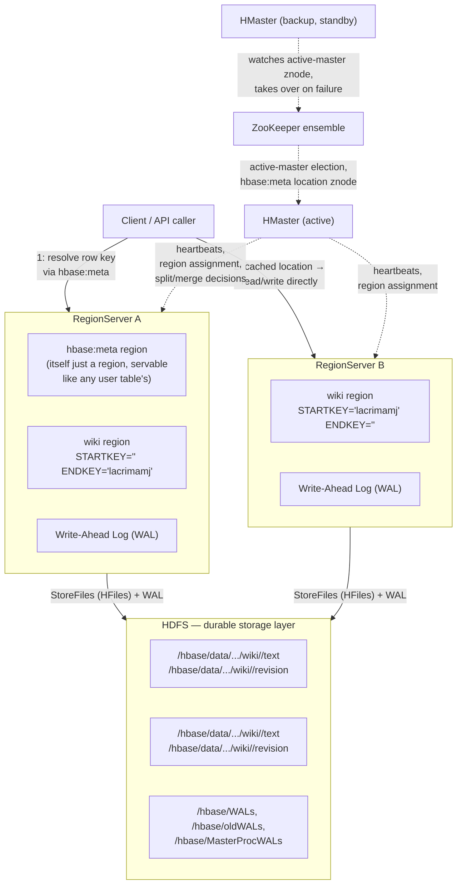
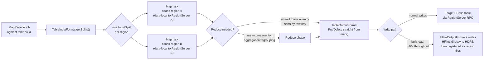

## Objective

Entender como um cluster HBase vivo de fato se mantém coeso por baixo da abstração de tabela: o **HMaster** coordenando a contabilidade de todo o cluster, **RegionServers** cada um possuindo um conjunto de **regions** (fatias contíguas, sem sobreposição, do espaço de row-key de uma tabela), **HDFS** como a camada de armazenamento durável através da qual todo RegionServer escreve, e **ZooKeeper** como o serviço de coordenação que permite que toda parte do cluster concorde sobre quem está no comando e onde as coisas vivem. O livro enquadra o ganho claramente enquanto observa uma tabela crescer em tempo real: "por causa de sua arquitetura distribuída, o HBase não sabe imediatamente quantas linhas há em cada tabela... [mas] a arquitetura de armazenamento baseada em region do HBase se presta a varredura distribuída rápida." Este conceito é sobre essa arquitetura (como uma row key resolve para uma region, uma region para um servidor, e uma varredura para um conjunto de map tasks paralelas do MapReduce), não sobre desenhar as próprias row keys, column families, ou schema; isso pertence ao conceito irmão sobre o modelo de dados e administração de tabela do HBase.

## Use Cases

- Explicar por que uma tabela HBase que "parece" uma tabela lógica é fisicamente dezenas ou centenas de arquivos independentes através de um cluster: "o subdiretório de nome longo... representa uma region individual", e cada region vive em seu próprio diretório no HDFS, um subdiretório por column family por baixo dele.
- Diagnosticar uma busca de linha lenta checando se o cliente precisou primeiro resolver a row key contra `hbase:meta`: "uma tabela especial cujo único propósito é rastrear todas as tabelas de usuário e quais region servers são responsáveis por servir as regions dessas tabelas", versus já ter aquela localização em cache.
- Entender o que de fato acontece quando um RegionServer cai no meio de uma escrita: a resposta do livro é o write-ahead log, não o HMaster: "os novos responsáveis por aquelas regions vão olhar para o WAL para ver quais, se algum, passos de recuperação são necessários."
- Decidir se divide as column families de uma tabela crescente em uma tabela separada, porque "quando você cria uma tabela separada, isso tem a vantagem de que as tabelas têm regions separadas, o que por sua vez significa que o cluster consegue dividir regions mais efetivamente conforme necessário": uma decisão que afeta distribuição de region, distinta do ângulo de design de column family do conceito irmão sobre a mesma escolha.
- Escrever um job de analytics em lote (uma extração de grafo de links, uma transformação de tabela completa, uma agregação noturna) como um job MapReduce que lê uma tabela HBase via `TableInputFormat` e ou escreve resultados de volta através de `TableOutputFormat` ou faz bulk-load de HFiles diretamente, em vez de fazer loop sobre um `Scan` do lado do cliente em código de aplicação.
- Implantar o HBase em uma plataforma Hadoop gerenciada (o livro usa AWS EMR) e entender que a arquitetura de regions/HDFS/ZooKeeper do HBase é exatamente o que tal plataforma está provisionando por baixo da fachada gerenciada.
- Explicar por que `count 'wiki'` em uma tabela de milhões de linhas é uma varredura de tabela completa, em vez de uma busca de metadado: o HBase não tem índice de contagem de linhas, então "precisa contá-las (realizando uma varredura de tabela)", e essa varredura é a mesma operação que a fase de map de um job MapReduce realiza, só que de thread única.

## Deep Dive

### As quatro peças móveis, e o trabalho que cada uma faz

**RegionServers guardam e servem o dado.** As linhas de uma tabela são mantidas em ordem ordenada e cortadas em regions: "uma region é um pedaço de linhas, identificado pela chave inicial (inclusiva) e chave final (exclusiva). Regions nunca se sobrepõem, e cada uma é atribuída a um region server específico no cluster." O próprio traço `du -h` do livro torna isso físico: depois que a tabela `wiki` do servidor standalone cresceu além de um limiar, "a region antiga... agora se foi e foi substituída por duas regions novas", cada uma em seu próprio diretório, e "em um ambiente distribuído essas seriam distribuídas entre múltiplos region servers." Dentro do diretório de cada region ficam subdiretórios por column family: `text` e `revision` no exemplo do livro, que é onde as decisões de design de schema do conceito irmão de fato aterrissam em disco.

**O HDFS é a camada de armazenamento por baixo de toda region.** RegionServers não possuem discos locais da forma que um servidor de banco de dados tradicional possui; eles escrevem StoreFiles (HFiles) e WALs no HDFS, que é por que a inspeção de uso de disco do livro acontece no "diretório `data/default` na localização `hbase.rootdir`." Isso também é por que o HBase tolera falha de RegionServer sem perder escritas confirmadas: o dado nunca esteve só no disco local daquele servidor, para começar.

**O write-ahead log é o mecanismo de durabilidade, e é por RegionServer, não por region.** "No HBase, logs são anexados ao WAL antes de qualquer operação de edição (put e increment) ser persistida em disco", porque "o sistema se sai muito melhor quando I/O é bufferizado e escrito em disco em pedaços." O livro traça a linha direta do WAL para a recuperação: "se o region server responsável pela region afetada caísse durante esse período de limbo, o HBase usaria o WAL para determinar quais operações foram bem-sucedidas e tomar ação corretiva. Sem um WAL, uma falha de region server significaria que aquele dado ainda não escrito seria simplesmente perdido." Essa também é a alavanca de performance que o próprio script de importação do livro explora: `setWriteToWAL(false)` troca essa garantia de durabilidade por throughput de escrita em dado que você pode se dar ao luxo de recarregar, que é exatamente a decisão que o livro toma para seus scripts reexecutáveis de Wikipedia e extração de link.

**`hbase:meta` é a tabela que torna roteamento possível, e é uma tabela como qualquer outra.** "hbase:meta é uma tabela especial cujo único propósito é rastrear todas as tabelas de usuário e quais region servers são responsáveis por servir as regions dessas tabelas." Criticamente, o livro enfatiza que esse catálogo não é infraestrutura tratada como caso especial, sentada fora do próprio modelo de dados do HBase: "acontece que a tabela hbase:meta também pode ser dividida em regions e servida por region servers, assim como qualquer outra tabela seria." Varrê-la diretamente mostra a forma de uma entrada de roteamento: `STARTKEY => '', ENDKEY => 'lacrimamj'` para uma region e `STARTKEY => 'lacrimamj', ENDKEY => ''` para sua irmã, com `STARTKEY` inclusivo e `ENDKEY` exclusivo, então uma busca por uma row key faz uma checagem de intervalo contra esses limites para encontrar sua region dona e, a partir de `info:server`, seu RegionServer dono.

**O HMaster atribui e reatribui; não fica no caminho de leitura/escrita.** "A atribuição de regions a region servers, incluindo regions hbase:meta, é tratada pelo nó master, frequentemente chamado de HBaseMaster. O servidor master também pode ser um region server, realizando ambas as funções simultaneamente." Seu papel é recuperação de falha e rebalanceamento, não roteamento de query: "quando um region server falha, o servidor master intervém e reatribui responsabilidade por regions previamente atribuídas ao nó falho", e a recuperação das escritas em andamento do nó falho recai sobre o WAL, como acima. A própria cadeia de autoridade também tem um plano de falha: "se o servidor master falha, a responsabilidade passa para qualquer um dos outros region servers que se apresentem para se tornar o master": o laboratório standalone do livro colapsa o HMaster e o único RegionServer em um processo, que é por que essa dança de eleição é invisível nos Dias 1 e 2, mas se torna real uma vez que o cluster é distribuído.

**O ZooKeeper é a peça que a configuração de laboratório do livro esconde, mas clusters de produção não conseguem.** Nos exercícios standalone, o HBase gerencia sua própria instância embutida de ZooKeeper, então nada dessa coordenação é visível; em um cluster real, o ZooKeeper é o que um HMaster em standby observa para saber quando assumir, e o que armazena o ponteiro para a region atualmente servindo `hbase:meta`, para que qualquer RegionServer ou cliente consiga inicializar sua própria visão do cluster sem fixar um endereço de master.

### Regions como a unidade tanto de escala quanto de paralelismo do MapReduce

O próprio código de varredura do livro (`wiki_table.getScanner(Scan.new)` iterando toda linha para extrair wiki-links) é a mesma primitiva que um job MapReduce roda em paralelo: "por causa de sua arquitetura distribuída, o HBase não sabe imediatamente quantas linhas há em cada tabela. Para descobrir, precisa contá-las (realizando uma varredura de tabela). Felizmente, a arquitetura de armazenamento baseada em region do HBase se presta a varredura distribuída rápida." Um script de scanner JRuby de thread única e um job MapReduce diferem principalmente em quantas dessas varreduras rodam de uma vez e onde: o `TableInputFormat` do HBase produz um InputSplit por region, então a contagem de map tasks de um job MapReduce acompanha a contagem de region da tabela, e cada map task pode rodar no mesmo nó físico que o RegionServer hospedando aquela region: o mesmo truque de localidade de dado que o HDFS dá a jobs MapReduce comuns, herdado automaticamente porque regions são arquivos no HDFS. O `TableOutputFormat` escreve resultados de volta como mutações `Put`/`Delete` emitidas através do caminho RPC de cliente normal; uma fase de reduce é frequentemente pulável porque o HBase armazena linhas pré-ordenadas por row key, então uma segunda ordenação adiciona custo sem adicionar valor. Para cargas em lote genuinamente grandes, contornar RPCs por linha com um bulk load (escrever HFiles diretamente via `HFileOutputFormat2` e registrá-los como arquivos de region) é o caminho "uma ordem de magnitude" mais rápido, conceitualmente o irmão orientado a lote do próprio truque de buffer `table.setAutoFlush(false)` / `flushCommits()` do livro para seu importador de Wikipedia, só operando no nível de arquivo do HDFS, em vez do nível de batching de RPC.

O Dia 3 do livro introduz implantação em nuvem através do Elastic MapReduce (EMR) da AWS: "o EMR é uma plataforma Hadoop gerenciada para a AWS. Permite rodar uma ampla variedade de servidores no ecossistema Hadoop (Hive, Pig, HBase, e muitos outros) no EC2 sem precisar se engajar em muitos dos detalhes minuciosos geralmente associados a gerenciar esses sistemas." O EMR é ferramental de provisionamento exatamente para a arquitetura descrita acima (um cluster Hadoop rodando HDFS por baixo de uma implantação HBase), não um mecanismo de integração diferente dos jobs MapReduce acima.

### Book vs. today

> **A divisão central de trabalho da arquitetura permanece inalterada.** A documentação atual do HBase ainda descreve os mesmos quatro papéis: o Master tratando atribuição de region e operações de cluster, RegionServers "gerenciando o dado em seus StoreFiles conforme direcionado pelo HMaster", HDFS como a camada de persistência sob `hbase.rootdir`, e `hbase:meta` como a tabela de catálogo cuja localização é inicializada através do ZooKeeper. Nada no modelo mental central deste conceito (row key resolve para region, region para RegionServer, RegionServer escreve através do HDFS com um WAL para recuperação de falha) mudou desde a edição do livro.

> **A mecânica de split de region é mais automática e sensível a tamanho do que o único exemplo do livro mostra.** O livro demonstra um split acontecendo, mas não nomeia a política por trás dele. O HBase atual tem como padrão o `IncreasingToUpperBoundRegionSplitPolicy`, que divide uma region uma vez que seu maior arquivo de store cruza um limiar de tamanho que cresce com o número de regions já naquele RegionServer, até um teto configurado (`hbase.hregion.max.filesize`, comumente documentado como 10 GB por padrão em versões atuais), em vez de um único limiar de tamanho constante aplicado uniformemente em todo lugar. Outras políticas plugáveis (`KeyPrefixRegionSplitPolicy`, `DelimitedKeyPrefixRegionSplitPolicy`, `BusyRegionSplitPolicy`, `DisabledRegionSplitPolicy`) existem para cargas de trabalho onde split automático baseado em tamanho não é o encaixe certo: nenhuma das quais o livro cobre, já que seu laboratório nunca roda tempo suficiente para precisar delas.

> **O Spark se tornou o motor dominante para novo trabalho de analytics em lote sobre o HBase, sem substituir a integração MapReduce que o livro descreve.** `TableInputFormat` e `TableOutputFormat` ainda são distribuídos, ainda documentados, e ainda a escolha certa para jobs MapReduce especificamente. Mas desde a edição de 2018 do livro, o conector Apache HBase-Spark (agora desenvolvido no repositório separado `apache/hbase-connectors`) amadureceu no caminho mais comumente recomendado para novo trabalho de analytics: ele produz DataFrames Spark diretamente de varreduras HBase e empurra configuração para executors via `HBaseContext`, dando processamento mais rico, em memória, iterativo, onde o modelo job-por-lote do MapReduce é um encaixe pior. Times construindo novos pipelines hoje mais frequentemente recorrem ao Spark-on-HBase ou, para acesso em forma de SQL, ao Apache Phoenix, do que a jobs MapReduce escritos à mão, embora bulk-loading via `HFileOutputFormat2` (conduzido por MapReduce ou Spark) permaneça o caminho de ingestão padrão de alto throughput de qualquer forma.

> **O projeto é ativamente mantido, não legado.** O Apache HBase lançou 2.5.13 e 2.6.4 em novembro de 2025 e tem lançamentos beta rumo a uma versão maior 3.0.0 em andamento, com mais de 100 committers: essa é uma opção viva, de geração atual, para cargas de trabalho wide-column, não uma relíquia só de livro, ainda que o centro de gravidade do ecossistema para *novo* analytics em lote tenha se deslocado em direção ao Spark.

## Trade-offs

- **Regions dão ao HBase sua performance de varredura horizontal, mas a camada de roteamento que as torna encontráveis é ela mesma um único ponto de coordenação.** Toda busca de linha que ainda não está em cache do lado do cliente precisa resolver contra `hbase:meta`, e a própria localização de region de `hbase:meta` é inicializada através do ZooKeeper: então uma carga de trabalho saudável, intensiva em varredura, depende de infraestrutura ("pegada pequena, raio de impacto grande") que espelha o trade-off de config-server em arquiteturas baseadas em coordenador de forma geral: barato de rodar, caro de perder.
- **O WAL compra segurança contra queda a um custo mensurável de latência de escrita, e os próprios scripts do livro mostram times rotineiramente optando por sair.** Escritas bufferizadas, protegidas por WAL, são o padrão seguro; `setWriteToWAL(false)`, usado no script de extração de link do livro, troca essa segurança por throughput especificamente porque a operação é idempotente e reexecutável. A decisão certa depende inteiramente de se o job pode ser reproduzido, não de uma regra universal de performance.
- **Dividir as column families de uma tabela entre tabelas separadas melhora a distribuição de region ao custo de perder timestamps compartilhados e escritas atômicas multi-família.** O livro escolheu uma tabela para `wiki` (`text` + `revision`, compartilhando um timestamp por edição) e uma tabela `links` separada para dado de grafo extraído, especificamente porque esses dois conjuntos de dados têm padrões de acesso diferentes e nenhuma exigência de timestamp compartilhado: uma decisão genuinamente diferente de enfiar tudo em mais column families em uma tabela, e uma que troca simplicidade por melhor comportamento de split/rebalance.
- **MapReduce sobre o HBase ganha localidade de dado quase de graça, mas só porque paralelismo é limitado à contagem de region.** Uma tabela com poucas regions grandes limita quantas map tasks um job consegue rodar concorrentemente de forma útil, independentemente do tamanho do cluster: que é por que contagem e tamanho de region (governados pela política de split) são tanto um botão de throughput de MapReduce quanto um de roteamento de query, ainda que as duas preocupações geralmente sejam raciocinadas separadamente.
- **Bulk-loading de HFiles é dramaticamente mais rápido do que `Put`s linha por linha, mas abre mão da história de segurança contra queda do WAL durante o próprio carregamento.** O ganho de throughput de "uma ordem de magnitude" que a documentação do HBase descreve para `HFileOutputFormat2` vem de pular RPC por linha e overhead de WAL completamente; um job de bulk-load que falha é simplesmente reexecutado a partir do dado de origem, a mesma troca que o próprio `setWriteToWAL(false)` do livro faz em uma escala menor, só movida para a camada de ingestão em lote.
- **Escolher MapReduce em vez de Spark para um job em lote troca momento de ecossistema por simplicidade e estabilidade.** O caminho `TableInputFormat`/`TableOutputFormat` do MapReduce é mais simples de raciocinar e mudou pouco em anos; o Spark-on-HBase oferece analytics mais rico, mais rápido, mais composável, mas adiciona uma segunda tecnologia de cluster e versão de conector para manter alinhada com a versão do HBase em uso. Nenhum é "o atual" completamente: depende de se o resto do stack de analytics já é baseado em Spark.

## Documentation Links

- [Luc Perkins, Eric Redmond, and Jim R. Wilson, "Seven Databases in Seven Weeks", 2nd Edition (Pragmatic Bookshelf, 2018), Chapter 3, "HBase", Day 2: "Working with Big Data", p. 67-82](https://pragprog.com/titles/pwrdata2/seven-databases-in-seven-weeks-second-edition/) - doc
- [Apache HBase Reference Guide, Architecture (Regions, RegionServers, Master, ZooKeeper)](https://hbase.apache.org/book.html#architecture) - doc
- [Apache HBase Reference Guide, Catalog Tables (hbase:meta)](https://hbase.apache.org/docs/architecture/catalog-tables/) - doc
- [Apache HBase Reference Guide, HBase and MapReduce](https://hbase.apache.org/docs/mapreduce/) - doc
- [Apache HBase Reference Guide, HBase and Spark](https://hbase.apache.org/docs/spark/) - doc
- [Apache HBase-Connectors project (apache/hbase-connectors)](https://github.com/apache/hbase-connectors) - doc
- [Apache HBase Releases](https://github.com/apache/hbase/releases) - doc
