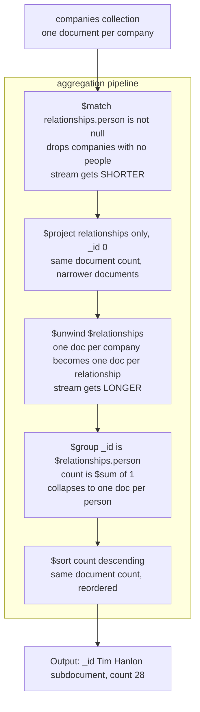

## Objective

Understand the MongoDB aggregation framework as what the book says it is — a Unix-style pipeline of stages, where every stage takes a stream of documents in and emits a stream of documents out — and learn the mechanics that make one pipeline fast and correct while another quietly produces wrong numbers: stage order, field-path expressions (`$field`) versus variable references (`$$var`), `$unwind`'s document multiplication, the difference between an accumulator in a `$project` stage and the same accumulator in a `$group` stage, how to construct a `$group` `_id`, and how to persist results with `$out` or `$merge`.

## Use Cases

- Replacing a `find` query that has grown a reporting requirement — the book's opening example is literally `db.companies.aggregate([{$match: {founded_year: 2004}}])`, which it points out "is equivalent to the following operation using find: `db.companies.find({founded_year: 2004})`" — and then extending it stage by stage with `$project`, `$limit`, `$sort`, and `$skip` until it does something `find` cannot.
- Answering "who appears most often across all of these documents" — the chapter's `relationships` example unwinds every person out of every company's `relationships` array, groups by the person subdocument, and counts with `$sum: 1`, yielding `Tim Hanlon` at `count: 28`.
- Computing per-document rollups without grouping at all: `largest_round: { $max: "$funding_rounds.raised_amount" }` inside a `$project` stage reaches into an array of embedded funding-round documents and returns one number per company (`{ "name": "Facebook", "largest_round": 1500000000 }`).
- Flattening an array field so downstream stages see one document per element — `{ $unwind: "$funding_rounds" }` turns one Facebook document into eleven `{name, amount, year}` documents, one per funding round.
- Building an on-demand materialized view: end the pipeline with `$merge` so the output collection is incrementally updated each time the pipeline runs, rather than recomputing a report from scratch on every request.
- Selecting a subset of an array *without* multiplying documents, using the `$filter` array expression — the book keeps only funding rounds where `raised_amount >= 100000000`, leaving Dropbox with exactly one qualifying round.

## Deep Dive

### Pipelines, stages, and tunables

The framing is explicit and worth taking literally: "The aggregation framework is based on the concept of a pipeline. With an aggregation pipeline we take input from a MongoDB collection and pass the documents from that collection through one or more stages, each of which performs a different operation on its inputs. Each stage takes as input whatever the stage before it produced as output. The inputs and outputs for all stages are documents — a stream of documents, if you will." And then, in case the mental model is still fuzzy: "If you're familiar with pipelines in a Linux shell, such as bash, this is a very similar idea."

An individual stage is described as "a data processing unit. It takes in a stream of input documents one at a time, processes each document one at a time, and produces an output stream of documents one at a time." Each stage exposes what the book calls **knobs, or tunables** — "operators that we can supply that will modify fields, perform arithmetic operations, reshape documents, or do some sort of accumulation task." A stage does a generic job; the tunables specialize it to your collection.

The third structural fact, flagged early because it drives most real pipelines: **the same stage type can appear multiple times.** "For example, we may want to perform an initial filter so that we don't have to pass the entire collection into our pipeline. Later, following some additional processing, we might then want to filter further, applying a different set of criteria." A pipeline is an array of documents, each of which "must stipulate a particular stage operator."

### Getting started with stages: familiar operations

The chapter deliberately starts with stages that map onto `find` — `$match`, `$project`, `$sort`, `$skip`, `$limit` — on a `companies` collection (name, `category_code`, `founded_year`, `description`, a `funding_rounds` array, an `ipo` subdocument). Add a projection and you get two stages:

```js
db.companies.aggregate([
  { $match: { founded_year: 2004 } },
  { $project: { _id: 0, name: 1, founded_year: 1 } }
])
```

"The match stage filters against the collection and passes the resulting documents to the project stage one at a time. The project stage then performs its operation, reshaping the documents, and passes the output out of the pipeline and back to us."

Then comes the chapter's first performance lesson, and it is about ordering. These two pipelines return identical results:

```js
// limit before project — five documents reach $project
db.companies.aggregate([
  { $match: { founded_year: 2004 } },
  { $limit: 5 },
  { $project: { _id: 0, name: 1 } }
])

// project before limit — hundreds of documents reach $project
db.companies.aggregate([
  { $match: { founded_year: 2004 } },
  { $project: { _id: 0, name: 1 } },
  { $limit: 5 }
])
```

"If we ran the project stage first and then the limit... we would get exactly the same results, but we'd have to pass hundreds of documents through the project stage before finally limiting the results to five." The rule the book states from this: "Regardless of what types of optimizations the MongoDB query planner might be capable of in a given release, you should always consider the efficiency of your aggregation pipeline. Ensure that you are limiting the number of documents that need to be passed on from one stage to another as you build your pipeline."

There is a correctness caveat attached: limiting second is fine only because "we're only interested in the first five documents that match our query, regardless of how they are sorted." If order matters, `$sort` has to come before `$limit` — and it changes the answer. Without the sort the first five names are `Digg, Facebook, AddThis, Veoh, Pando Networks`; with `{ $sort: { name: 1 } }` before `{ $limit: 5 }` they become `1915 Studios, 1Scan, 2GeeksinaLab, 2GeeksinaLab, 2threads`.

### The pipeline as a document stream

Here is the chapter's grouping example drawn as a pipeline, with each stage annotated by what it does to the *stream*, not just to individual documents. The pipeline finds the people who appear in the most company `relationships` entries:



Three of the five stages leave the document count alone and only reshape or reorder; `$unwind` multiplies it; `$group` collapses it. That is the whole skill — knowing which stages grow the stream and which shrink it, and arranging them so the expensive ones see the smallest stream.

The book uses this example to make a point about interpreting results, too: Tim Hanlon's `count: 28` means "Tim Hanlon appears 28 times in `relationships` documents throughout the companies in our collection," not that he is associated with 28 distinct companies — he could hold multiple titles at one company. "This example illustrates a very important point about aggregation pipelines: make sure you fully understand what it is you're working with as you do calculations, particularly when you're calculating aggregate values using accumulator expressions of some kind."

### Expressions

The chapter enumerates the classes of expression available inside stage tunables: **Boolean** (AND/OR/NOT), **set** expressions that treat arrays as sets (intersection, union, difference), **comparison** expressions for range filters, **arithmetic** (ceiling, floor, natural log, log, the four operations, square root), **string** (concatenation, substrings, case, text search), **array** expressions (filter, slice, ranges), **variable** expressions (literals, date parsing, conditionals), and **accumulators** (sums, descriptive statistics).

### `$project`: reshaping and promoting nested fields

Beyond include/exclude, `$project` promotes nested values to top-level fields using **field paths**:

```js
db.companies.aggregate([
  { $match: { "funding_rounds.investments.financial_org.permalink": "greylock" } },
  { $project: {
      _id: 0,
      name: 1,
      ipo: "$ipo.pub_year",
      valuation: "$ipo.valuation_amount",
      funders: "$funding_rounds.investments.financial_org.permalink"
  } }
]).pretty()
```

"The `$` character used to specify the values for `ipo`, `valuation`, and `funders` in our project stage indicates that the values should be interpreted as field paths and used to select the value that should be projected for each field."

The interesting part is `funders`, which comes back as an **array of arrays**: `[["accel-partners"], ["greylock", "meritech-capital-partners", "founders-fund", "sv-angel"], ...]`. "Our stage specifies that we want to project the `financial_org.permalink` value for each entry in the `investments` array, for every funding round. So, an array of arrays of funders' names is built up." Two nested arrays in the path, two levels of nesting in the output.

One hard limit worth remembering: "Just about the only thing we can't do from a project stage is change the data type for a value."

### `$unwind`, and the two-`$match` pattern

`$unwind` "allows us to produce output such that there is one output document for each element in a specified array field." The output documents are exact copies of the input except that the unwound field holds a single element instead of the array — "if there were 10 elements in the array, the unwind stage would produce 10 output documents."

Without it, projecting `amount: "$funding_rounds.raised_amount"` gives you parallel arrays per company (`"amount": [8500000, 2800000, 28700000, 5000000]`). Insert `{ $unwind: "$funding_rounds" }` before the projection and the same data arrives one row at a time: `{"name": "Digg", "amount": 8500000, "year": 2006}`, `{"name": "Digg", "amount": 2800000, "year": 2005}`, and so on.

Then the chapter walks into a genuinely subtle bug. The `$match` filters *companies* where Greylock participated in at least one round; after `$unwind`, the stream contains every round of every such company — including rounds Greylock had nothing to do with. The book shows Farecast rounds funded only by `madrona-venture-group` and `wrf-capital` sailing through. One fix would be to unwind first and match after, but "with unwind as the first stage, we would be doing a scan through the entire collection." The stated principle: "For efficiency, we want to match as early as possible in our pipeline. This enables the aggregation framework to make use of indexes, for example."

So the correct pipeline matches **twice** — before the unwind to shrink the collection scan, and again after to filter the exploded stream:

```js
db.companies.aggregate([
  { $match: { "funding_rounds.investments.financial_org.permalink": "greylock" } },
  { $unwind: "$funding_rounds" },
  { $match: { "funding_rounds.investments.financial_org.permalink": "greylock" } },
  { $project: {
      _id: 0,
      name: 1,
      individualFunder: "$funding_rounds.investments.person.permalink",
      fundingOrganization: "$funding_rounds.investments.financial_org.permalink",
      amount: "$funding_rounds.raised_amount",
      year: "$funding_rounds.funded_year"
  } }
])
```

This is the "repeated stages" idea from the introduction paying off: the first `$match` is an optimization, the second is a correctness requirement, and they happen to be the same predicate applied to two different streams.

### Array expressions: `$filter`, `$arrayElemAt`, `$slice`, `$size`

`$filter` selects a subset of array elements *without* unwinding, so the document count stays put:

```js
rounds: { $filter: {
  input: "$funding_rounds",
  as: "round",
  cond: { $gte: ["$$round.raised_amount", 100000000] }
} }
```

Three tunables: `input` (an array — here a field path), `as` (a name for the current element), and `cond`. The `$$` prefix is the distinguishing detail: "We use `$$` to reference a variable defined within the expression we're working in. The as clause defines a variable within our filter expression... This is to disambiguate a reference to a variable from a field path." One `$` means "field of the input document"; two mean "variable bound in this expression."

The rest of the array toolkit:

| Expression | What it does |
|---|---|
| `$arrayElemAt: ["$funding_rounds", 0]` | Element at a slot; arrays are 0-indexed |
| `$arrayElemAt: ["$funding_rounds", -1]` | Negative indexes count from the end, `-1` being the last — useful because "in many cases, the length of an array is not readily available" |
| `$slice: ["$funding_rounds", 1, 3]` | Three elements starting at index 1 — "we simply want some early ones but not the very first one" |
| `$size: "$funding_rounds"` | The number of elements in the array |

The chapter closes the section by noting the list "grows with each release" and pointing at the Aggregation Pipeline Quick Reference in the docs.

### Accumulators, and using them in `$project`

Accumulators are "essentially another type of expression, but we think about them in their own class because they calculate values from field values found in multiple documents." The set the book names: `$sum`, `$avg`, `$first`, `$last`, `$max`, `$min`, `$mergeObjects`, the array accumulators `$push` and `$addToSet` (`$addToSet` being "very similar to `$push` except that it ensures no duplicate values are included in the resulting array"), and sample/population standard deviation.

The historical note matters because it explains an asymmetry you will hit: "Prior to MongoDB 3.2, accumulators were available only in the group stage. MongoDB 3.2 introduced the ability to access a subset of accumulators within the project stage. The primary difference... is that in the project stage accumulators such as `$sum` and `$avg` must operate on arrays within a single document, whereas accumulators in the group stage... provide you with the ability to perform calculations on values across multiple documents."

So in a `$project` stage, an accumulator is an array reducer:

```js
db.companies.aggregate([
  { $match: { funding_rounds: { $exists: true, $ne: [] } } },
  { $project: {
      _id: 0,
      name: 1,
      largest_round: { $max: "$funding_rounds.raised_amount" },
      total_funding: { $sum: "$funding_rounds.raised_amount" }
  } }
])
```

Note the guard in the `$match`: `$exists: true` *and* `$ne: []`, because the accumulator needs an array-valued field with something in it.

### `$group` and the role of `_id`

`$group` "performs a function that is similar to the SQL `GROUP BY` command."

```js
db.companies.aggregate([
  { $group: {
      _id: { founded_year: "$founded_year" },
      average_number_of_employees: { $avg: "$number_of_employees" }
  } },
  { $sort: { average_number_of_employees: -1 } }
])
```

"Fundamental to the group stage is the `_id` field... We use this field to define what the group stage uses to organize the documents that it sees." The book then describes the running state explicitly: "Each time the group stage encounters a document with a specific founding year, it adds the value for `number_of_employees` from that document to a running sum... and adds one to a count of the number of documents seen so far for that year. Once all documents have passed through the group stage, it can then calculate the average."

The `_id` conventions, and they are conventions with a reason:

- **Label the grouping key.** `_id: { founded_year: "$founded_year" }` rather than `_id: "$founded_year"` — "if we don't label the group value, it's not explicit that we are grouping on the year in which the company was founded. In order to avoid confusion, it is a best practice to explicitly label values on which we group." The output then reads `{ "_id": { "founded_year": 1847 }, "average_number_of_employees": 405000 }`.
- **Compound keys are just multi-field documents.** `_id: { founded_year: "$founded_year", category_code: "$category_code" }`.
- **Field paths may reach into embedded documents.** `_id: { ipo_year: "$ipo.pub_year" }` groups by IPO year even though the year lives inside a subdocument.
- **A whole document can be the key.** `_id: "$relationships.person"` groups on a subdocument with three fields (`first_name`, `last_name`, `permalink`) — "This demonstrates that the group stage supports grouping on document values."

The summarizing rule: "make sure that in our output, the semantics of our `_id` value are clear."

### Group versus project

Some accumulators exist only in `$group`, and the reason is structural. `$push` accumulates across the stream:

```js
db.companies.aggregate([
  { $match: { funding_rounds: { $ne: [] } } },
  { $unwind: "$funding_rounds" },
  { $sort: { "funding_rounds.funded_year": 1,
             "funding_rounds.funded_month": 1,
             "funding_rounds.funded_day": 1 } },
  { $group: {
      _id: { company: "$name" },
      funding: { $push: { amount: "$funding_rounds.raised_amount",
                          year: "$funding_rounds.funded_year" } }
  } }
]).pretty()
```

Because the `$sort` ordered *all* funding rounds globally before grouping, each company's accumulated array comes out in chronological order — "pushing onto the end of the array guarantees that the funding amounts for each company are sorted in chronological order." (The book also notes this three-key sort "we can support... with a compound index.")

The rule: "`$push` expressions only work in group stages. This is because group stages are designed to take an input stream of documents and accumulate values by processing each document in turn. Project stages, on the other hand, work with each document in their input stream individually." The same applies to `$first` and `$last` — "A `$first` expression simply saves the first value that passes through the input stream for the stage. A `$last` expression simply tracks the values that pass through the group stage and hangs onto the last one." Both are only meaningful because the preceding `$sort` defined what "first" means.

`$sum: 1` gets a special mention: "A `$sum` expression like this simply serves to count the number of documents that it sees in each grouping."

The chapter's final pipeline chains `$group` into `$project` — group computes `first_round`, `last_round`, `num_rounds: { $sum: 1 }`, and `total_raised: { $sum: "$funding_rounds.raised_amount" }`; project then flattens those into a readable summary. The book is blunt that the projection is cosmetic: "all it is really doing is making the output prettier." Result for Tesla Motors: `num_rounds: 11`, `total_raised: 823000000`, first round `7500000` in 2004, last round `10000000` in 2012.

That is the practical division of labor: **`$group` reduces across documents, `$project` reshapes within a document.** Pick based on whether the value you want depends on other documents in the stream.

### Writing results to a collection: `$out` and `$merge`

"There are two specific stages, `$out` and `$merge`, that can write documents resulting from the aggregation pipeline to a collection. You can use only one of these two stages, and it must be the last stage of an aggregation pipeline."

`$merge` arrived in MongoDB 4.2 and "is the preferred stage for writing to a collection, if available." The book lists `$out`'s limitations precisely: "it can only write to the same database, it overwrites any existing collection if present, and it cannot write to a sharded collection." `$merge` can write to any database and collection, sharded or not, and when the target already exists it can "insert new documents, merge with existing documents, fail the operation, keep existing documents, or process all documents with a custom update."

The headline capability: "the real advantage of using `$merge` is that it can create on-demand materialized views, where the content of the output collection is incrementally updated when the pipeline is run." That is the difference between a nightly full recompute and a report that catches up cheaply.

> **Book vs. today: `$search` and `$vectorSearch` did not exist when this was written.** The 2019 text's stage vocabulary stops at the classic analytics stages — there is no mention of `$search` or `$vectorSearch` anywhere, because neither existed. Both do now, on MongoDB Atlas, and both are ordinary pipeline stages that plug into exactly the mechanism this chapter teaches: `$search` runs Atlas Search full-text queries (Lucene-backed) as the first stage of a pipeline, and `$vectorSearch` runs approximate-nearest-neighbor queries over embedding vectors for semantic and AI/RAG retrieval. The important continuity is that nothing about pipelines changed to accommodate them — they emit a document stream you then `$match`, `$group`, `$project`, and `$merge` like any other. Sibling concepts cover them properly; see the [Atlas Search `$search`](https://www.mongodb.com/docs/atlas/atlas-search/aggregation-stages/search/) and [`$vectorSearch`](https://www.mongodb.com/docs/atlas/atlas-vector-search/vector-search-stage/) references. Two smaller items also moved on: the `$merge`-versus-`$out` advice the book gives as conditional ("if available") is now simply the default recommendation, since 4.2 is long past end-of-life; and the accumulator list has kept growing, notably with the `$setWindowFields` stage (MongoDB 5.0) for running totals and moving averages, which the book's chapter has no equivalent for.

## Trade-offs

- **Stage order is the single biggest performance lever, and the planner will not save you.** The book's own framing — "regardless of what types of optimizations the MongoDB query planner might be capable of in a given release, you should always consider the efficiency of your aggregation pipeline" — is the right posture. `$match` and `$sort` placed first can use indexes and shrink the stream before anything expensive runs; the same stages placed after an `$unwind` or `$group` operate on a synthetic stream that no index covers. The `$limit`-before-`$project` versus `$project`-before-`$limit` pair produces identical output at very different cost.
- **But moving `$match` earlier can change the answer, not just the speed.** The Greylock example is the cautionary case: matching on `funding_rounds.investments...` before `$unwind` selects *companies*; the same predicate after `$unwind` selects *rounds*. Neither placement is wrong — they answer different questions — and the pipeline that is both fast and correct needs the predicate twice. Any time you relocate a `$match` across an `$unwind` or `$group` boundary, re-derive what the documents in the stream actually represent.
- **`$unwind` multiplies your document count, and the multiplier is data-dependent.** "If there were 10 elements in the array, the unwind stage would produce 10 output documents" — so a collection of 100,000 documents each holding a 500-element array becomes a 50-million-document stream for every stage downstream. When you only need a subset of the array, `$filter` (or `$slice`, or `$arrayElemAt`) keeps the document count flat and is dramatically cheaper; reach for `$unwind` only when downstream stages genuinely need one document per element, as `$group` does.
- **`$group` and blocking stages have a memory ceiling.** `$group` and `$sort` cannot stream — they must hold state until the input is exhausted — and each is capped at 100 MB of RAM per stage by default. Exceeding it errors out unless you pass `allowDiskUse: true`, which trades the error for spilling to disk and a substantial slowdown. (MongoDB 6.0 changed the default so most blocking stages spill automatically, but the memory-versus-disk trade did not go away; it just stopped announcing itself as a failure.) The design response is upstream: filter and project away unused fields *before* the grouping stage so less state accumulates.
- **Accumulators mean different things in `$project` and in `$group`, and the code looks identical.** `{ $sum: "$funding_rounds.raised_amount" }` in a `$project` stage totals one array within one document; the same expression in a `$group` stage totals a field across every document in the group. Confusing the two produces plausible-looking numbers at the wrong granularity — which is exactly the failure the book warns about with Tim Hanlon's `count: 28`, a number that is correct for the question "how many relationship entries" and wrong for "how many companies."
- **`$first`/`$last` are only as meaningful as the `$sort` in front of them.** They are stream-position accumulators, not semantic ones: "first" means "first document this stage saw." Without a deterministic preceding `$sort`, the result is arbitrary — and it may be *stably* arbitrary in testing and different in production once the collection grows or shards. The book always pairs them with an explicit multi-key sort.
- **Aggregation output is a snapshot, not a view.** A pipeline's results reflect the data as of the moment it ran; writing them with `$out` or `$merge` does not subscribe them to future changes. `$out` makes this obvious by overwriting the whole collection. `$merge` softens it into an incremental update — the "on-demand materialized view" — but something still has to *run* the pipeline; freshness comes from a scheduler or from change streams driving the refresh, not from the stage itself. Treat any aggregation-derived collection as a cache with an explicit invalidation story.
- **`$out` versus `$merge` is a real compatibility decision, not just a preference.** `$out` cannot write to another database, cannot target a sharded collection, and destroys the existing collection on every run — which is fine for a scratch table and disqualifying for anything a live application reads. `$merge` removes all three limits and adds the incremental-update behavior, at the cost of requiring you to choose a `whenMatched`/`whenNotMatched` policy, i.e. to think about what "already exists" should mean for your data.

## Documentation Links

- [Shannon Bradshaw, Eoin Brazil, and Kristina Chodorow, "MongoDB: The Definitive Guide", 3rd Edition (O'Reilly, 2020) — Chapter 7, "Introduction to the Aggregation Framework", p. 182-219](https://www.oreilly.com/library/view/mongodb-the-definitive/9781491954454/) — doc
- [MongoDB Documentation — Aggregation Pipeline](https://www.mongodb.com/docs/manual/core/aggregation-pipeline/) — doc
- [MongoDB Documentation — Aggregation Pipeline Stages](https://www.mongodb.com/docs/manual/reference/operator/aggregation-pipeline/) — doc
- [MongoDB Documentation — Aggregation Pipeline Optimization](https://www.mongodb.com/docs/manual/core/aggregation-pipeline-optimization/) — doc
- [MongoDB Documentation — Aggregation Pipeline Limits](https://www.mongodb.com/docs/manual/core/aggregation-pipeline-limits/) — doc
- [MongoDB Documentation — `$unwind` (aggregation)](https://www.mongodb.com/docs/manual/reference/operator/aggregation/unwind/) — doc
- [MongoDB Documentation — `$group` (aggregation)](https://www.mongodb.com/docs/manual/reference/operator/aggregation/group/) — doc
- [MongoDB Documentation — `$merge` (aggregation)](https://www.mongodb.com/docs/manual/reference/operator/aggregation/merge/) — doc
- [MongoDB Documentation — On-Demand Materialized Views](https://www.mongodb.com/docs/manual/core/materialized-views/) — doc
- [MongoDB Atlas Documentation — `$search` aggregation stage](https://www.mongodb.com/docs/atlas/atlas-search/aggregation-stages/search/) — doc
- [MongoDB Atlas Documentation — `$vectorSearch` aggregation stage](https://www.mongodb.com/docs/atlas/atlas-vector-search/vector-search-stage/) — doc
