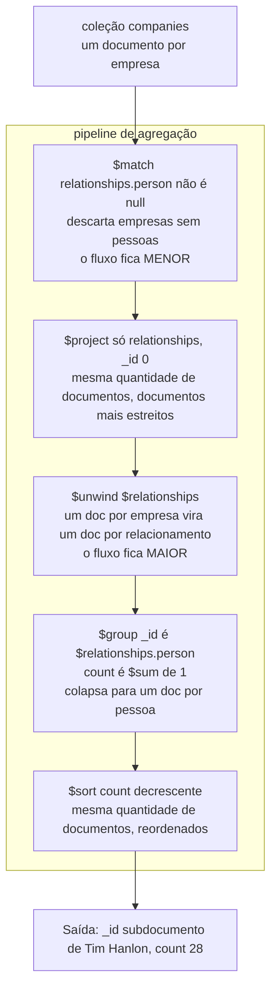

## Objective

Entender o framework de agregação do MongoDB como o livro diz que ele é (um pipeline de estágios no estilo Unix, em que todo estágio recebe um fluxo de documentos e emite um fluxo de documentos) e aprender a mecânica que faz um pipeline ser rápido e correto enquanto outro produz em silêncio números errados: a ordem dos estágios, expressões de caminho de campo (`$field`) versus referências a variáveis (`$$var`), a multiplicação de documentos do `$unwind`, a diferença entre um acumulador em um estágio `$project` e o mesmo acumulador em um estágio `$group`, como construir o `_id` de um `$group`, e como persistir os resultados com `$out` ou `$merge`.

## Use Cases

- Substituir uma consulta `find` que ganhou um requisito de relatório: o exemplo de abertura do livro é literalmente `db.companies.aggregate([{$match: {founded_year: 2004}}])`, que ele aponta "ser equivalente à seguinte operação com find: `db.companies.find({founded_year: 2004})`", e então estendê-lo estágio por estágio com `$project`, `$limit`, `$sort` e `$skip` até que ele faça algo que o `find` não consegue.
- Responder "quem aparece com mais frequência em todos estes documentos": o exemplo de `relationships` do capítulo desmonta (unwind) cada pessoa do array `relationships` de cada empresa, agrupa pelo subdocumento da pessoa e conta com `$sum: 1`, resultando em `Tim Hanlon` com `count: 28`.
- Calcular consolidados por documento sem agrupar nada: `largest_round: { $max: "$funding_rounds.raised_amount" }` dentro de um estágio `$project` alcança um array de documentos embutidos de rodadas de investimento e retorna um número por empresa (`{ "name": "Facebook", "largest_round": 1500000000 }`).
- Achatar um campo de array para que os estágios seguintes vejam um documento por elemento: `{ $unwind: "$funding_rounds" }` transforma um documento do Facebook em onze documentos `{name, amount, year}`, um por rodada de investimento.
- Construir uma view materializada sob demanda: terminar o pipeline com `$merge` para que a coleção de saída seja atualizada incrementalmente a cada execução do pipeline, em vez de recalcular um relatório do zero a cada requisição.
- Selecionar um subconjunto de um array *sem* multiplicar documentos, usando a expressão de array `$filter`: o livro mantém só as rodadas de investimento com `raised_amount >= 100000000`, deixando o Dropbox com exatamente uma rodada qualificada.

## Deep Dive

### Pipelines, estágios e ajustes

O enquadramento é explícito e vale ser levado ao pé da letra: "O framework de agregação é baseado no conceito de pipeline. Com um pipeline de agregação, pegamos a entrada de uma coleção do MongoDB e passamos os documentos dessa coleção por um ou mais estágios, cada um dos quais faz uma operação diferente sobre suas entradas. Cada estágio recebe como entrada o que o estágio anterior produziu como saída. As entradas e saídas de todos os estágios são documentos: um fluxo de documentos, por assim dizer." E então, caso o modelo mental ainda esteja nebuloso: "Se você conhece pipelines em um shell Linux, como o bash, esta é uma ideia muito parecida."

Um estágio individual é descrito como "uma unidade de processamento de dados. Ele recebe um fluxo de documentos de entrada, um por vez, processa cada documento, um por vez, e produz um fluxo de documentos de saída, um por vez." Cada estágio expõe o que o livro chama de **botões, ou ajustes (tunables)**: "operadores que podemos fornecer e que vão modificar campos, fazer operações aritméticas, remodelar documentos ou fazer algum tipo de tarefa de acumulação." Um estágio faz um trabalho genérico; os ajustes o especializam para a sua coleção.

O terceiro fato estrutural, sinalizado cedo porque ele guia a maioria dos pipelines reais: **o mesmo tipo de estágio pode aparecer várias vezes.** "Por exemplo, podemos querer fazer um filtro inicial para não precisar passar a coleção inteira para o pipeline. Mais adiante, depois de algum processamento adicional, podemos querer filtrar de novo, aplicando outro conjunto de critérios." Um pipeline é um array de documentos, cada um dos quais "precisa especificar um operador de estágio particular."

### Começando com os estágios: operações conhecidas

O capítulo começa deliberadamente com estágios que correspondem ao `find` (`$match`, `$project`, `$sort`, `$skip`, `$limit`) sobre uma coleção `companies` (name, `category_code`, `founded_year`, `description`, um array `funding_rounds`, um subdocumento `ipo`). Acrescente uma projeção e você tem dois estágios:

```js
db.companies.aggregate([
  { $match: { founded_year: 2004 } },
  { $project: { _id: 0, name: 1, founded_year: 1 } }
])
```

"O estágio match filtra a coleção e passa os documentos resultantes para o estágio project, um por vez. O estágio project então faz sua operação, remodelando os documentos, e passa a saída para fora do pipeline, de volta para nós."

Então vem a primeira lição de desempenho do capítulo, e ela é sobre ordem. Estes dois pipelines retornam resultados idênticos:

```js
// limit antes de project: cinco documentos chegam ao $project
db.companies.aggregate([
  { $match: { founded_year: 2004 } },
  { $limit: 5 },
  { $project: { _id: 0, name: 1 } }
])

// project antes de limit: centenas de documentos chegam ao $project
db.companies.aggregate([
  { $match: { founded_year: 2004 } },
  { $project: { _id: 0, name: 1 } },
  { $limit: 5 }
])
```

"Se rodássemos o estágio project primeiro e depois o limit... teríamos exatamente os mesmos resultados, mas precisaríamos passar centenas de documentos pelo estágio project antes de finalmente limitar os resultados a cinco." A regra que o livro enuncia a partir disso: "Independentemente dos tipos de otimização de que o planejador de consultas do MongoDB seja capaz em uma dada versão, você sempre deveria considerar a eficiência do seu pipeline de agregação. Garanta que está limitando o número de documentos que precisam passar de um estágio para o outro enquanto constrói o pipeline."

Há uma ressalva de corretude ligada a isso: limitar em segundo lugar só funciona porque "só estamos interessados nos primeiros cinco documentos que casam com a consulta, independentemente de como estão ordenados." Se a ordem importa, `$sort` precisa vir antes de `$limit`, e isso muda a resposta. Sem a ordenação, os cinco primeiros nomes são `Digg, Facebook, AddThis, Veoh, Pando Networks`; com `{ $sort: { name: 1 } }` antes de `{ $limit: 5 }`, eles passam a ser `1915 Studios, 1Scan, 2GeeksinaLab, 2GeeksinaLab, 2threads`.

### O pipeline como um fluxo de documentos

Eis o exemplo de agrupamento do capítulo desenhado como pipeline, com cada estágio anotado pelo que faz com o *fluxo*, não só com os documentos individuais. O pipeline encontra as pessoas que aparecem no maior número de entradas de `relationships` de empresas:



Três dos cinco estágios não mexem na quantidade de documentos e só remodelam ou reordenam; o `$unwind` a multiplica; o `$group` a colapsa. Essa é a habilidade inteira: saber quais estágios aumentam o fluxo e quais o encolhem, e arranjá-los para que os caros vejam o menor fluxo.

O livro usa este exemplo para fazer também um ponto sobre interpretar resultados: o `count: 28` de Tim Hanlon significa que "Tim Hanlon aparece 28 vezes em documentos `relationships` nas empresas da nossa coleção", não que ele esteja associado a 28 empresas distintas; ele pode ter vários cargos em uma mesma empresa. "Este exemplo ilustra um ponto muito importante sobre pipelines de agregação: garanta que você entende completamente com o que está trabalhando ao fazer cálculos, especialmente quando calcula valores agregados usando algum tipo de expressão acumuladora."

### Expressões

O capítulo enumera as classes de expressões disponíveis dentro dos ajustes dos estágios: **booleanas** (AND/OR/NOT), expressões de **conjunto** que tratam arrays como conjuntos (interseção, união, diferença), expressões de **comparação** para filtros de intervalo, **aritméticas** (teto, piso, logaritmo natural, log, as quatro operações, raiz quadrada), de **string** (concatenação, substrings, maiúsculas/minúsculas, busca de texto), expressões de **array** (filtrar, fatiar, intervalos), expressões de **variável** (literais, interpretação de datas, condicionais) e **acumuladores** (somas, estatísticas descritivas).

### `$project`: remodelando e promovendo campos aninhados

Além de incluir/excluir, o `$project` promove valores aninhados a campos de nível superior usando **caminhos de campo**:

```js
db.companies.aggregate([
  { $match: { "funding_rounds.investments.financial_org.permalink": "greylock" } },
  { $project: {
      _id: 0,
      name: 1,
      ipo: "$ipo.pub_year",
      valuation: "$ipo.valuation_amount",
      funders: "$funding_rounds.investments.financial_org.permalink"
  } }
]).pretty()
```

"O caractere `$` usado para especificar os valores de `ipo`, `valuation` e `funders` no estágio project indica que os valores devem ser interpretados como caminhos de campo e usados para selecionar o valor a ser projetado em cada campo."

A parte interessante é `funders`, que volta como um **array de arrays**: `[["accel-partners"], ["greylock", "meritech-capital-partners", "founders-fund", "sv-angel"], ...]`. "Nosso estágio especifica que queremos projetar o valor de `financial_org.permalink` para cada entrada do array `investments`, em toda rodada de investimento. Então um array de arrays de nomes de investidores é montado." Dois arrays aninhados no caminho, dois níveis de aninhamento na saída.

Um limite rígido que vale lembrar: "Praticamente a única coisa que não podemos fazer em um estágio project é mudar o tipo de dado de um valor."

### `$unwind`, e o padrão de dois `$match`

O `$unwind` "permite produzir uma saída com um documento de saída para cada elemento de um campo de array especificado." Os documentos de saída são cópias exatas da entrada, exceto que o campo desmontado guarda um único elemento em vez do array: "se houvesse 10 elementos no array, o estágio unwind produziria 10 documentos de saída."

Sem ele, projetar `amount: "$funding_rounds.raised_amount"` dá arrays paralelos por empresa (`"amount": [8500000, 2800000, 28700000, 5000000]`). Insira `{ $unwind: "$funding_rounds" }` antes da projeção e os mesmos dados chegam uma linha por vez: `{"name": "Digg", "amount": 8500000, "year": 2006}`, `{"name": "Digg", "amount": 2800000, "year": 2005}`, e assim por diante.

Então o capítulo entra em um bug genuinamente sutil. O `$match` filtra *empresas* em que a Greylock participou de pelo menos uma rodada; depois do `$unwind`, o fluxo contém todas as rodadas de cada uma dessas empresas, incluindo rodadas com as quais a Greylock não teve nada a ver. O livro mostra rodadas da Farecast financiadas só por `madrona-venture-group` e `wrf-capital` passando direto. Uma correção seria desmontar primeiro e casar depois, mas "com o unwind como primeiro estágio, estaríamos fazendo uma leitura da coleção inteira." O princípio enunciado: "Por eficiência, queremos casar o mais cedo possível no pipeline. Isso permite ao framework de agregação usar índices, por exemplo."

Então o pipeline correto casa **duas vezes**: antes do unwind, para encolher a leitura da coleção, e de novo depois, para filtrar o fluxo explodido:

```js
db.companies.aggregate([
  { $match: { "funding_rounds.investments.financial_org.permalink": "greylock" } },
  { $unwind: "$funding_rounds" },
  { $match: { "funding_rounds.investments.financial_org.permalink": "greylock" } },
  { $project: {
      _id: 0,
      name: 1,
      individualFunder: "$funding_rounds.investments.person.permalink",
      fundingOrganization: "$funding_rounds.investments.financial_org.permalink",
      amount: "$funding_rounds.raised_amount",
      year: "$funding_rounds.funded_year"
  } }
])
```

É a ideia de "estágios repetidos" da introdução dando resultado: o primeiro `$match` é uma otimização, o segundo é um requisito de corretude, e eles por acaso são o mesmo predicado aplicado a dois fluxos diferentes.

### Expressões de array: `$filter`, `$arrayElemAt`, `$slice`, `$size`

O `$filter` seleciona um subconjunto dos elementos de um array *sem* desmontá-lo, então a quantidade de documentos fica igual:

```js
rounds: { $filter: {
  input: "$funding_rounds",
  as: "round",
  cond: { $gte: ["$$round.raised_amount", 100000000] }
} }
```

Três ajustes: `input` (um array; aqui, um caminho de campo), `as` (um nome para o elemento atual) e `cond`. O prefixo `$$` é o detalhe que distingue: "Usamos `$$` para referenciar uma variável definida dentro da expressão em que estamos trabalhando. A cláusula as define uma variável dentro da nossa expressão de filtro... Isso serve para desfazer a ambiguidade entre a referência a uma variável e um caminho de campo." Um `$` significa "campo do documento de entrada"; dois significam "variável ligada nesta expressão."

O resto do kit de arrays:

| Expressão | O que faz |
|---|---|
| `$arrayElemAt: ["$funding_rounds", 0]` | O elemento em uma posição; arrays começam no índice 0 |
| `$arrayElemAt: ["$funding_rounds", -1]` | Índices negativos contam a partir do fim, sendo `-1` o último; útil porque "em muitos casos, o tamanho de um array não está prontamente disponível" |
| `$slice: ["$funding_rounds", 1, 3]` | Três elementos a partir do índice 1: "só queremos alguns dos primeiros, mas não o primeiro" |
| `$size: "$funding_rounds"` | O número de elementos do array |

O capítulo fecha a seção observando que a lista "cresce a cada versão" e apontando para o Aggregation Pipeline Quick Reference na documentação.

### Acumuladores, e usá-los no `$project`

Acumuladores são "essencialmente outro tipo de expressão, mas pensamos neles como uma classe própria porque calculam valores a partir de valores de campos encontrados em vários documentos." O conjunto que o livro cita: `$sum`, `$avg`, `$first`, `$last`, `$max`, `$min`, `$mergeObjects`, os acumuladores de array `$push` e `$addToSet` (sendo o `$addToSet` "muito parecido com o `$push`, exceto que garante que nenhum valor duplicado seja incluído no array resultante") e desvio padrão amostral/populacional.

A nota histórica importa porque explica uma assimetria com que você vai esbarrar: "Antes do MongoDB 3.2, os acumuladores só estavam disponíveis no estágio group. O MongoDB 3.2 introduziu a possibilidade de acessar um subconjunto de acumuladores no estágio project. A principal diferença... é que no estágio project acumuladores como `$sum` e `$avg` precisam operar sobre arrays dentro de um único documento, enquanto os acumuladores no estágio group... permitem fazer cálculos sobre valores de vários documentos."

Então, em um estágio `$project`, um acumulador é um redutor de array:

```js
db.companies.aggregate([
  { $match: { funding_rounds: { $exists: true, $ne: [] } } },
  { $project: {
      _id: 0,
      name: 1,
      largest_round: { $max: "$funding_rounds.raised_amount" },
      total_funding: { $sum: "$funding_rounds.raised_amount" }
  } }
])
```

Note a proteção no `$match`: `$exists: true` *e* `$ne: []`, porque o acumulador precisa de um campo com valor de array e algo dentro dele.

### `$group` e o papel do `_id`

O `$group` "faz uma função parecida com o comando `GROUP BY` do SQL."

```js
db.companies.aggregate([
  { $group: {
      _id: { founded_year: "$founded_year" },
      average_number_of_employees: { $avg: "$number_of_employees" }
  } },
  { $sort: { average_number_of_employees: -1 } }
])
```

"Fundamental para o estágio group é o campo `_id`... Usamos esse campo para definir o que o estágio group usa para organizar os documentos que vê." O livro então descreve explicitamente o estado acumulado: "Cada vez que o estágio group encontra um documento com um ano de fundação específico, ele soma o valor de `number_of_employees` desse documento a um total acumulado... e soma um à contagem de documentos vistos até agora para aquele ano. Quando todos os documentos passaram pelo estágio group, ele pode então calcular a média."

As convenções do `_id`, e são convenções com um motivo:

- **Rotule a chave de agrupamento.** `_id: { founded_year: "$founded_year" }` em vez de `_id: "$founded_year"`: "se não rotulamos o valor do grupo, não fica explícito que estamos agrupando pelo ano em que a empresa foi fundada. Para evitar confusão, a boa prática é rotular explicitamente os valores pelos quais agrupamos." A saída então fica `{ "_id": { "founded_year": 1847 }, "average_number_of_employees": 405000 }`.
- **Chaves compostas são só documentos com vários campos.** `_id: { founded_year: "$founded_year", category_code: "$category_code" }`.
- **Caminhos de campo podem alcançar documentos embutidos.** `_id: { ipo_year: "$ipo.pub_year" }` agrupa pelo ano do IPO, mesmo que o ano viva dentro de um subdocumento.
- **Um documento inteiro pode ser a chave.** `_id: "$relationships.person"` agrupa por um subdocumento com três campos (`first_name`, `last_name`, `permalink`): "Isto demonstra que o estágio group suporta agrupar por valores que são documentos."

A regra que resume: "garanta que, na nossa saída, a semântica do valor `_id` esteja clara."

### Group versus project

Alguns acumuladores só existem no `$group`, e o motivo é estrutural. O `$push` acumula ao longo do fluxo:

```js
db.companies.aggregate([
  { $match: { funding_rounds: { $ne: [] } } },
  { $unwind: "$funding_rounds" },
  { $sort: { "funding_rounds.funded_year": 1,
             "funding_rounds.funded_month": 1,
             "funding_rounds.funded_day": 1 } },
  { $group: {
      _id: { company: "$name" },
      funding: { $push: { amount: "$funding_rounds.raised_amount",
                          year: "$funding_rounds.funded_year" } }
  } }
]).pretty()
```

Como o `$sort` ordenou *todas* as rodadas de investimento globalmente antes do agrupamento, o array acumulado de cada empresa sai em ordem cronológica: "empilhar no fim do array garante que os valores de investimento de cada empresa fiquem ordenados cronologicamente." (O livro também observa que essa ordenação por três chaves "podemos suportar... com um índice composto.")

A regra: "expressões `$push` só funcionam em estágios group. Isso porque os estágios group são projetados para receber um fluxo de documentos de entrada e acumular valores processando cada documento por vez. Os estágios project, por outro lado, trabalham com cada documento do seu fluxo de entrada individualmente." O mesmo vale para `$first` e `$last`: "Uma expressão `$first` simplesmente guarda o primeiro valor que passa pelo fluxo de entrada do estágio. Uma expressão `$last` simplesmente acompanha os valores que passam pelo estágio group e fica com o último." Os dois só têm significado porque o `$sort` anterior definiu o que "primeiro" quer dizer.

O `$sum: 1` ganha uma menção especial: "Uma expressão `$sum` como esta simplesmente serve para contar o número de documentos que vê em cada grupo."

O pipeline final do capítulo encadeia `$group` com `$project`: o group calcula `first_round`, `last_round`, `num_rounds: { $sum: 1 }` e `total_raised: { $sum: "$funding_rounds.raised_amount" }`; o project então achata isso em um resumo legível. O livro é direto ao dizer que a projeção é cosmética: "tudo o que ela está realmente fazendo é deixar a saída mais bonita." Resultado para a Tesla Motors: `num_rounds: 11`, `total_raised: 823000000`, primeira rodada de `7500000` em 2004, última rodada de `10000000` em 2012.

Essa é a divisão prática de trabalho: **o `$group` reduz entre documentos, o `$project` remodela dentro de um documento.** Escolha com base em se o valor que você quer depende de outros documentos do fluxo.

### Escrevendo resultados em uma coleção: `$out` e `$merge`

"Há dois estágios específicos, `$out` e `$merge`, que podem escrever em uma coleção os documentos resultantes do pipeline de agregação. Você só pode usar um desses dois estágios, e ele precisa ser o último estágio do pipeline de agregação."

O `$merge` chegou no MongoDB 4.2 e "é o estágio preferido para escrever em uma coleção, se estiver disponível." O livro lista as limitações do `$out` com precisão: "ele só pode escrever no mesmo banco, sobrescreve qualquer coleção existente e não pode escrever em uma coleção shardeada." O `$merge` pode escrever em qualquer banco e coleção, shardeada ou não, e quando o destino já existe ele pode "inserir documentos novos, mesclar com documentos existentes, falhar a operação, manter os documentos existentes ou processar todos os documentos com um update customizado."

A capacidade principal: "a vantagem real de usar o `$merge` é que ele pode criar views materializadas sob demanda, em que o conteúdo da coleção de saída é atualizado incrementalmente quando o pipeline roda." Essa é a diferença entre um recálculo completo noturno e um relatório que se atualiza de forma barata.

> **Livro vs. hoje: `$search` e `$vectorSearch` não existiam quando isto foi escrito.** O vocabulário de estágios do texto de 2019 para nos estágios clássicos de análise: não há menção a `$search` ou `$vectorSearch` em lugar nenhum, porque nenhum dos dois existia. Os dois existem agora, no MongoDB Atlas, e os dois são estágios comuns de pipeline que se encaixam exatamente no mecanismo que este capítulo ensina: o `$search` roda consultas full-text do Atlas Search (apoiadas em Lucene) como primeiro estágio de um pipeline, e o `$vectorSearch` roda consultas aproximadas de vizinhos mais próximos sobre vetores de embedding para recuperação semântica e de IA/RAG. A continuidade importante é que nada nos pipelines mudou para acomodá-los: eles emitem um fluxo de documentos que você então passa por `$match`, `$group`, `$project` e `$merge` como qualquer outro. Conceitos irmãos os cobrem direito; veja as referências de [Atlas Search `$search`](https://www.mongodb.com/docs/atlas/atlas-search/aggregation-stages/search/) e [`$vectorSearch`](https://www.mongodb.com/docs/atlas/atlas-vector-search/vector-search-stage/). Dois itens menores também mudaram: o conselho de `$merge` versus `$out`, que o livro dá como condicional ("se estiver disponível"), agora é simplesmente a recomendação padrão, já que o 4.2 há muito passou do fim da vida útil; e a lista de acumuladores continuou crescendo, notavelmente com o estágio `$setWindowFields` (MongoDB 5.0) para totais acumulados e médias móveis, para o qual o capítulo do livro não tem equivalente.

## Trade-offs

- **A ordem dos estágios é a maior alavanca de desempenho, e o planejador não vai salvar você.** O próprio enquadramento do livro ("independentemente dos tipos de otimização de que o planejador de consultas do MongoDB seja capaz em uma dada versão, você sempre deveria considerar a eficiência do seu pipeline de agregação") é a postura certa. `$match` e `$sort` colocados primeiro podem usar índices e encolher o fluxo antes que qualquer coisa cara rode; os mesmos estágios colocados depois de um `$unwind` ou `$group` operam sobre um fluxo sintético que nenhum índice cobre. O par `$limit`-antes-de-`$project` versus `$project`-antes-de-`$limit` produz saída idêntica com custos muito diferentes.
- **Mas mover o `$match` para antes pode mudar a resposta, não só a velocidade.** O exemplo da Greylock é o caso de alerta: casar em `funding_rounds.investments...` antes do `$unwind` seleciona *empresas*; o mesmo predicado depois do `$unwind` seleciona *rodadas*. Nenhuma posição está errada (elas respondem perguntas diferentes), e o pipeline que é ao mesmo tempo rápido e correto precisa do predicado duas vezes. Toda vez que você mudar um `$match` de lugar atravessando uma fronteira de `$unwind` ou `$group`, deduza de novo o que os documentos do fluxo realmente representam.
- **O `$unwind` multiplica a quantidade de documentos, e o multiplicador depende dos dados.** "Se houvesse 10 elementos no array, o estágio unwind produziria 10 documentos de saída", então uma coleção de 100.000 documentos, cada um com um array de 500 elementos, vira um fluxo de 50 milhões de documentos para todo estágio seguinte. Quando você só precisa de um subconjunto do array, `$filter` (ou `$slice`, ou `$arrayElemAt`) mantém a quantidade de documentos estável e é dramaticamente mais barato; use `$unwind` só quando os estágios seguintes realmente precisam de um documento por elemento, como o `$group` precisa.
- **O `$group` e os estágios bloqueantes têm um teto de memória.** `$group` e `$sort` não conseguem processar em fluxo (precisam guardar estado até a entrada acabar), e cada um é limitado por padrão a 100 MB de RAM por estágio. Passar disso dá erro, a menos que você passe `allowDiskUse: true`, que troca o erro por gravação em disco e uma lentidão considerável. (O MongoDB 6.0 mudou o padrão para que a maioria dos estágios bloqueantes grave em disco automaticamente, mas a troca entre memória e disco não sumiu; ela só deixou de se anunciar como falha.) A resposta de design está antes: filtre e projete fora os campos não usados *antes* do estágio de agrupamento, para que menos estado se acumule.
- **Acumuladores significam coisas diferentes no `$project` e no `$group`, e o código parece idêntico.** `{ $sum: "$funding_rounds.raised_amount" }` em um estágio `$project` totaliza um array dentro de um documento; a mesma expressão em um estágio `$group` totaliza um campo em todos os documentos do grupo. Confundir os dois produz números de aparência plausível na granularidade errada, que é exatamente a falha sobre a qual o livro alerta com o `count: 28` de Tim Hanlon, um número correto para a pergunta "quantas entradas de relacionamento" e errado para "quantas empresas."
- **`$first`/`$last` só têm o significado do `$sort` que vem antes deles.** Eles são acumuladores de posição no fluxo, não semânticos: "primeiro" significa "o primeiro documento que este estágio viu." Sem um `$sort` anterior determinístico, o resultado é arbitrário, e pode ser arbitrário de forma *estável* nos testes e diferente em produção quando a coleção crescer ou for shardeada. O livro sempre os combina com uma ordenação explícita por várias chaves.
- **A saída de uma agregação é um retrato, não uma view.** Os resultados de um pipeline refletem os dados no momento em que ele rodou; gravá-los com `$out` ou `$merge` não os inscreve em mudanças futuras. O `$out` deixa isso óbvio ao sobrescrever a coleção inteira. O `$merge` suaviza isso em uma atualização incremental (a "view materializada sob demanda"), mas algo ainda precisa *rodar* o pipeline; a atualização vem de um agendador ou de change streams disparando a renovação, não do estágio em si. Trate qualquer coleção derivada de agregação como um cache com uma história explícita de invalidação.
- **`$out` versus `$merge` é uma decisão real de compatibilidade, não só uma preferência.** O `$out` não pode escrever em outro banco, não pode mirar uma coleção shardeada e destrói a coleção existente a cada execução, o que é aceitável para uma tabela temporária e desqualificante para qualquer coisa que uma aplicação ativa leia. O `$merge` remove os três limites e acrescenta o comportamento de atualização incremental, ao custo de exigir que você escolha uma política de `whenMatched`/`whenNotMatched`, isto é, que pense no que "já existe" deveria significar para os seus dados.

## Documentation Links

- [Shannon Bradshaw, Eoin Brazil e Kristina Chodorow, "MongoDB: The Definitive Guide", 3ª edição (O'Reilly, 2020): Capítulo 7, "Introduction to the Aggregation Framework", p. 182-219](https://www.oreilly.com/library/view/mongodb-the-definitive/9781491954454/): doc
- [MongoDB Documentation: Aggregation Pipeline](https://www.mongodb.com/docs/manual/core/aggregation-pipeline/): doc
- [MongoDB Documentation: Aggregation Pipeline Stages](https://www.mongodb.com/docs/manual/reference/operator/aggregation-pipeline/): doc
- [MongoDB Documentation: Aggregation Pipeline Optimization](https://www.mongodb.com/docs/manual/core/aggregation-pipeline-optimization/): doc
- [MongoDB Documentation: Aggregation Pipeline Limits](https://www.mongodb.com/docs/manual/core/aggregation-pipeline-limits/): doc
- [MongoDB Documentation: `$unwind` (aggregation)](https://www.mongodb.com/docs/manual/reference/operator/aggregation/unwind/): doc
- [MongoDB Documentation: `$group` (aggregation)](https://www.mongodb.com/docs/manual/reference/operator/aggregation/group/): doc
- [MongoDB Documentation: `$merge` (aggregation)](https://www.mongodb.com/docs/manual/reference/operator/aggregation/merge/): doc
- [MongoDB Documentation: On-Demand Materialized Views](https://www.mongodb.com/docs/manual/core/materialized-views/): doc
- [MongoDB Atlas Documentation: `$search` aggregation stage](https://www.mongodb.com/docs/atlas/atlas-search/aggregation-stages/search/): doc
- [MongoDB Atlas Documentation: `$vectorSearch` aggregation stage](https://www.mongodb.com/docs/atlas/atlas-vector-search/vector-search-stage/): doc
