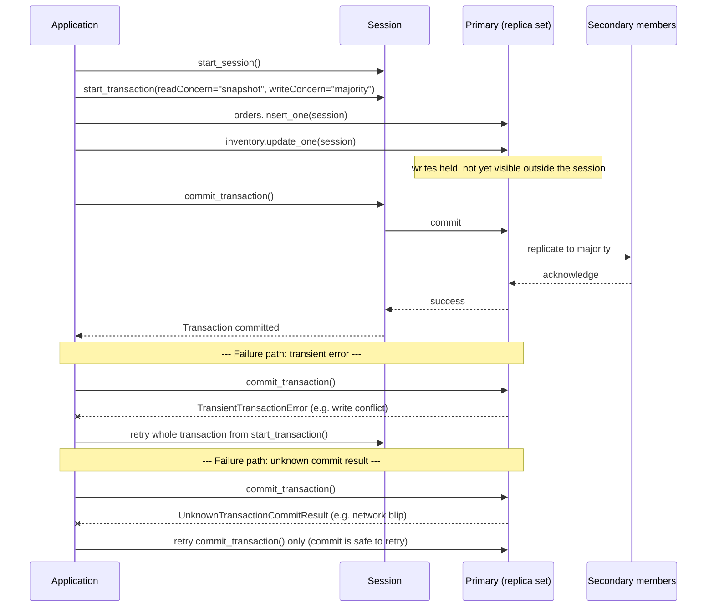

## Objective

Learn what the book calls the escape hatch: multi-document ACID transactions across a replica set (and, since MongoDB 4.2, across a sharded cluster). Cover what ACID means in MongoDB's own terms, the two APIs for running a transaction (core versus callback), the concrete limits that bound how long a transaction may run and how long it will wait for locks, and — the part worth reading twice — the chapter's own honest admission that this feature exists because the document model's usual answer, single-document atomicity, sometimes is not enough, and that transactions are meant to be used sparingly rather than as a default tool for consistency.

## Use Cases

- An e-commerce checkout that must insert an order **and** decrement inventory in the same logical unit — two documents, two collections, one all-or-nothing operation. This is the book's own worked example.
- Any workflow where a partial write would leave the database in a state the application cannot recover from cleanly — moving money between two account documents, transferring a record's ownership across two collections, or any operation the book frames as "never partially completed."
- Migrating every document in a collection to a new schema shape in one operation, where a mid-migration crash must leave the *old* schema intact rather than a mix of old and new documents.
- Recognizing when a transaction is the wrong tool: if the operation can be expressed as a single-document update (arrays, embedded subdocuments, the Extended Reference pattern), a transaction adds latency and lock contention for a guarantee the document model already gives you for free.

## Deep Dive

### What ACID means here

The book defines the four properties directly, and they map onto MongoDB's transaction API exactly as they would in a relational database:

- **Atomicity** — all operations inside a transaction are applied, or none are. It either commits or aborts; there is no partial state.
- **Consistency** — a successful transaction moves the database from one consistent state to the next.
- **Isolation** — concurrent transactions never see each other's partial results; running several transactions in parallel produces the same outcome as running them one after another.
- **Durability** — once a transaction commits, the result survives a system failure.

The book is explicit that MongoDB is "a distributed database with ACID compliant transactions across replica sets and/or across shards," and that the network layer is what makes this hard: single-node ACID is a solved problem, but coordinating atomicity and isolation across replica set members — and across shards, each with its own primary — needed new infrastructure. That infrastructure is logical sessions and causal consistency, added in MongoDB 3.6 specifically as the foundation transactions were built on top of in 4.0/4.2.

Both transaction APIs require a session up front, and every operation inside the transaction must pass that session explicitly:

```javascript
with client.start_session() as session:
    with session.start_transaction(
            read_concern=ReadConcern("snapshot"),
            write_concern=WriteConcern(w="majority")):
        orders.insert_one({"sku": "abc123", "qty": 100}, session=session)
        inventory.update_one(
            {"sku": "abc123", "qty": {"$gte": 100}},
            {"$inc": {"qty": -100}}, session=session)
        session.commit_transaction()
```

### Core API versus callback API

The book presents two ways to drive a transaction and is unambiguous about which one to prefer.

The **core API** looks like a relational transaction — explicit `start_transaction` and `commit_transaction` calls — but it hands the developer every piece of error handling. Two specific error labels have to be handled by hand: `TransientTransactionError` (retry the whole transaction function) and `UnknownTransactionCommitResult` (retry just the commit). The book's own example spends roughly 40 lines of Python building `commit_with_retry` and `run_transaction_with_retry` wrappers before the transaction logic even runs.

The **callback API** — `with_transaction()` — wraps starting the transaction, running the supplied callback, and committing (or aborting on error) into a single call, and it *includes* the retry logic for both error labels automatically. The book recommends it plainly: the complexity and extra code the core API demands are "the main reasons to recommend the callback API over the core API."

Both APIs share a hard restriction worth calling out on its own: a transaction can only perform CRUD operations on **existing** collections and databases. Create, drop, and index operations are not permitted inside a transaction — a collection referenced for the first time inside a transaction must be created beforehand, outside of it.

### The commit sequence and what happens when it fails

The sequence below follows the book's e-commerce example — insert an order, decrement inventory — through a successful commit, then shows the two ways a transaction can fail and what the driver's retry logic (in the callback API) does about each:



The distinction between the two failure paths is the whole reason the two error labels exist separately: a `TransientTransactionError` means the transaction itself never got to attempt commit and must be replayed from the beginning; an `UnknownTransactionCommitResult` means the commit was sent but its outcome is unknown — so only the *commit* is retried, using the write concern already set at `start_transaction()`, rather than replaying the writes and risking applying them twice.

### Tuning the limits

The book covers two categories of limits, and both have concrete defaults worth memorizing because they are easy to hit by accident.

**Timing limits.**

- `transactionLifetimeLimitSeconds` — the maximum runtime of a transaction, default under one minute. A background cleanup process aborts expired transactions, running once every 60 seconds or every `transactionLifetimeLimitSeconds`/2, whichever is lower. In a sharded cluster this parameter must be set identically on every shard's replica set members. The book's recommended practice is to set an explicit `maxTimeMS` on `commitTransaction` rather than relying on the server-wide default — if you don't, `transactionLifetimeLimitSeconds` is used instead, and if your `maxTimeMS` would exceed it, the server-wide limit wins anyway.
- `maxTransactionLockRequestTimeoutMillis` — how long a transaction waits to acquire the locks its operations need, default **5 milliseconds**. This is short enough that transactions competing with heavy concurrent write traffic can abort routinely just from lock contention, not from any application bug. Setting it to `0` means abort immediately if locks aren't free right now; `-1` defers to the operation's own `maxTimeMS`; any positive number is a wait window in the given unit.

**Oplog and document size limits.** A transaction generates as many oplog entries as its writes require, but each individual oplog entry is still bound by the same **16 MB** BSON document size limit as any other document. A transaction that touches enough data to need an oplog entry larger than 16 MB will fail — this is the same ceiling that governs ordinary document size, just applied per oplog entry rather than per collection document.

### Book vs today

> **The 60-second default and the 5 ms lock-timeout default are unchanged.** Current MongoDB documentation (checked against the Transactions and Production Considerations pages) still lists `transactionLifetimeLimitSeconds` defaulting to 60 seconds and `maxTransactionLockRequestTimeoutMillis` defaulting to 5 ms, with the same abort-on-expiry behavior the book describes. Nothing here has moved since the 3rd edition (2019).

> **Sharded-cluster transactions have matured operationally, not just in raw availability.** The book already states MongoDB supports transactions "across multiple operations, collections, databases, documents, and shards" as of 4.2, but frames sharded transactions as the newer, more fragile case. Current documentation adds sharded-cluster-specific production guidance the book doesn't cover in this chapter: transactions can error out if a chunk migration interleaves with the transaction's commit, transactions cannot change a shard key on a replica set that has an arbiter, and a shard with `writeConcernMajorityJournalDefault` set to `false` cannot run transactions at all. None of this contradicts the book — it is the kind of operational detail that only accumulates once a feature has years of production use behind it, and it's worth knowing before treating a sharded transaction as a drop-in replacement for a replica-set one.

> **The oplog's old aggregate size ceiling is gone; the per-entry 16 MB limit is not.** Early transaction documentation (contemporaneous with the book) described a total 16 MB cap across all of a transaction's oplog entries combined. That aggregate ceiling has since been removed — a transaction can generate as many oplog entries as its writes require — but each individual entry remains capped at 16 MB, the same limit that bounds any single BSON document. This is a genuine easing, not a correction of the book, and it matters mainly for transactions that touch many documents rather than a few large ones.

## Trade-offs

- **Multi-document transactions exist because the document model's default isn't always enough — and the book wants you to notice that "isn't always" is doing the work.** Single-document atomicity is free and automatic in MongoDB; multi-document transactions require an explicit session, explicit commit/abort handling, and pay a real coordination cost across replica set members (and shards). The chapter's closing line is the clearest statement of intent in the whole topic: "Transactions provide a useful feature in MongoDB to ensure consistency, but they should be used with the rich document model... Transactions are a powerful feature, best used sparingly in your applications." Reaching for a transaction before checking whether the schema-design patterns chapter's embedding advice would have made the transaction unnecessary is treating the escape hatch as the front door.
- **The callback API trades a small amount of control for correctness you'd otherwise have to write yourself.** The core API's explicit `start_transaction`/`commit_transaction` calls look more familiar coming from a relational background, but the book's own side-by-side example shows the callback API doing in a few lines what the core API needs two custom retry wrappers to do safely. The cost of the callback API is less visibility into exactly when a retry happens; the cost of the core API is that *you* are the one who has to get `TransientTransactionError` and `UnknownTransactionCommitResult` handling right, and getting it wrong silently reintroduces the exact partial-failure risk the transaction was supposed to prevent.
- **The 5 ms lock-timeout default optimizes for failing fast over trying hard.** A transaction competing with other writers for the same document can abort on lock contention alone, well before any real conflict in the data. Raising `maxTransactionLockRequestTimeoutMillis` buys patience at the cost of transactions (and the connections running them) sitting blocked longer under contention — there is no setting that makes a transaction both patient and cheap under heavy concurrent writes to the same documents.
- **Restricting transactions to existing collections is a small constraint with an easy-to-miss failure mode.** Because create/drop/index operations aren't permitted inside a transaction, a schema that lazily creates collections on first write — a common pattern outside of transactions — breaks the first time that first write happens inside one. The fix (create the collection ahead of time) is trivial once known, but it's exactly the kind of thing that only surfaces the first time a genuinely new collection needs a transactional write in production.
- **A transaction's atomicity is bounded by its lifetime limit, which turns "correctness" into "correctness within about a minute."** The default `transactionLifetimeLimitSeconds` means a transaction that legitimately needs to touch a lot of data, wait on an external call, or simply run during a slow period can be aborted by the cleanup process for taking too long — not because anything about the data was wrong. This pushes toward keeping transactions short and their scope narrow, which is a real design constraint, not just a tuning knob to raise and forget.

## Documentation Links

- [Shannon Bradshaw, Eoin Brazil, and Kristina Chodorow, "MongoDB: The Definitive Guide", 3rd Edition (O'Reilly, 2020) — Chapter 8, "Transactions", p. 199-206](https://www.oreilly.com/library/view/mongodb-the-definitive/9781491954454/) — doc
- [MongoDB Documentation — Transactions](https://www.mongodb.com/docs/manual/core/transactions/) — doc
- [MongoDB Documentation — Production Considerations (Transactions)](https://www.mongodb.com/docs/manual/core/transactions-production-consideration/) — doc
- [MongoDB Documentation — Production Considerations (Sharded Clusters)](https://www.mongodb.com/docs/manual/core/transactions-sharded-clusters/) — doc
- [MongoDB Documentation — Limits and Thresholds (16 MB BSON document size)](https://www.mongodb.com/docs/manual/reference/limits/) — doc
- [MongoDB Documentation — Driver Compatibility Reference](https://www.mongodb.com/docs/drivers/) — doc
- [MongoDB Documentation — Read Concern](https://www.mongodb.com/docs/manual/reference/read-concern/) — doc
- [MongoDB Documentation — Write Concern](https://www.mongodb.com/docs/manual/reference/write-concern/) — doc
