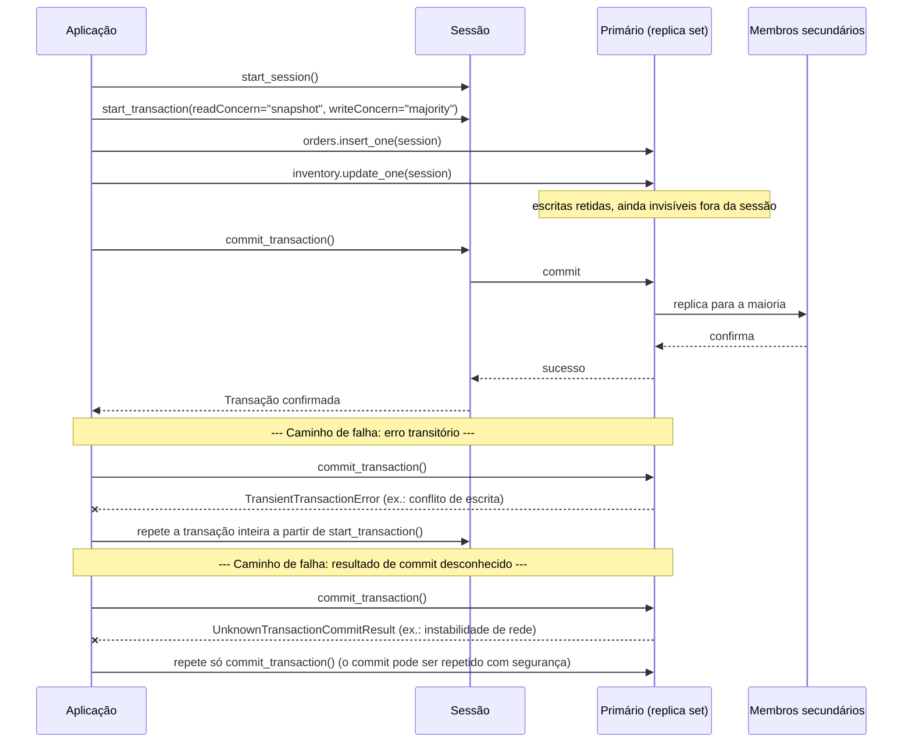

## Objective

Aprender o que o livro chama de válvula de escape: transações ACID multidocumento em um replica set (e, desde o MongoDB 4.2, em um cluster shardeado). Cobrir o que ACID significa nos termos do próprio MongoDB, as duas APIs para rodar uma transação (core versus callback), os limites concretos de quanto tempo uma transação pode rodar e de quanto tempo ela espera por locks, e, a parte que vale ler duas vezes, a admissão honesta do próprio capítulo de que este recurso existe porque a resposta habitual do modelo de documentos, a atomicidade de documento único, às vezes não basta, e de que transações devem ser usadas com moderação, e não como ferramenta padrão de consistência.

## Use Cases

- Um checkout de e-commerce que precisa inserir um pedido **e** decrementar o estoque na mesma unidade lógica: dois documentos, duas coleções, uma operação tudo ou nada. Este é o próprio exemplo resolvido do livro.
- Qualquer fluxo em que uma escrita parcial deixaria o banco em um estado do qual a aplicação não consegue se recuperar de forma limpa: mover dinheiro entre dois documentos de conta, transferir a posse de um registro entre duas coleções, ou qualquer operação que o livro descreve como "nunca concluída parcialmente."
- Migrar todos os documentos de uma coleção para um novo formato de schema em uma operação, em que uma queda no meio da migração precisa deixar o schema *antigo* intacto, e não uma mistura de documentos antigos e novos.
- Reconhecer quando uma transação é a ferramenta errada: se a operação pode ser expressa como um update de documento único (arrays, subdocumentos embutidos, o padrão Extended Reference), uma transação acrescenta latência e disputa por locks para uma garantia que o modelo de documentos já dá de graça.

## Deep Dive

### O que ACID significa aqui

O livro define as quatro propriedades diretamente, e elas se aplicam à API de transações do MongoDB exatamente como se aplicariam a um banco relacional:

- **Atomicidade**: todas as operações dentro de uma transação são aplicadas, ou nenhuma é. Ela faz commit ou aborta; não há estado parcial.
- **Consistência**: uma transação bem-sucedida leva o banco de um estado consistente para o próximo.
- **Isolamento**: transações concorrentes nunca veem os resultados parciais umas das outras; rodar várias transações em paralelo produz o mesmo resultado que rodá-las uma depois da outra.
- **Durabilidade**: depois que uma transação faz commit, o resultado sobrevive a uma falha do sistema.

O livro é explícito ao dizer que o MongoDB é "um banco de dados distribuído com transações compatíveis com ACID em replica sets e/ou entre shards", e que a camada de rede é o que torna isso difícil: ACID em um único nó é um problema resolvido, mas coordenar atomicidade e isolamento entre membros de um replica set, e entre shards, cada um com seu próprio primário, exigiu infraestrutura nova. Essa infraestrutura são as sessões lógicas e a consistência causal, adicionadas no MongoDB 3.6 especificamente como a base sobre a qual as transações foram construídas na 4.0/4.2.

As duas APIs de transação exigem uma sessão desde o início, e toda operação dentro da transação precisa receber essa sessão explicitamente:

```javascript
with client.start_session() as session:
    with session.start_transaction(
            read_concern=ReadConcern("snapshot"),
            write_concern=WriteConcern(w="majority")):
        orders.insert_one({"sku": "abc123", "qty": 100}, session=session)
        inventory.update_one(
            {"sku": "abc123", "qty": {"$gte": 100}},
            {"$inc": {"qty": -100}}, session=session)
        session.commit_transaction()
```

### API core versus API de callback

O livro apresenta duas formas de conduzir uma transação e é inequívoco sobre qual preferir.

A **API core** se parece com uma transação relacional (chamadas explícitas a `start_transaction` e `commit_transaction`), mas entrega ao desenvolvedor todo o tratamento de erros. Dois rótulos de erro específicos precisam ser tratados à mão: `TransientTransactionError` (repetir a função de transação inteira) e `UnknownTransactionCommitResult` (repetir só o commit). O próprio exemplo do livro gasta cerca de 40 linhas de Python construindo os wrappers `commit_with_retry` e `run_transaction_with_retry` antes de a lógica da transação sequer rodar.

A **API de callback** (`with_transaction()`) encapsula em uma única chamada o início da transação, a execução do callback fornecido e o commit (ou o abort em caso de erro), e ela *inclui* automaticamente a lógica de nova tentativa para os dois rótulos de erro. O livro a recomenda sem rodeios: a complexidade e o código extra que a API core exige são "os principais motivos para recomendar a API de callback em vez da API core."

As duas APIs compartilham uma restrição rígida que vale destacar: uma transação só pode fazer operações CRUD em coleções e bancos **existentes**. Operações de criação, drop e índice não são permitidas dentro de uma transação; uma coleção referenciada pela primeira vez dentro de uma transação precisa ser criada antes, fora dela.

### A sequência de commit e o que acontece quando ela falha

A sequência abaixo segue o exemplo de e-commerce do livro (inserir um pedido, decrementar o estoque) até um commit bem-sucedido, e então mostra as duas formas como uma transação pode falhar e o que a lógica de nova tentativa do driver (na API de callback) faz em cada uma:



A distinção entre os dois caminhos de falha é todo o motivo de os dois rótulos de erro existirem separadamente: um `TransientTransactionError` significa que a transação nem chegou a tentar o commit e precisa ser reexecutada desde o início; um `UnknownTransactionCommitResult` significa que o commit foi enviado, mas seu resultado é desconhecido, então só o *commit* é repetido, usando o write concern já definido em `start_transaction()`, em vez de reexecutar as escritas e arriscar aplicá-las duas vezes.

### Ajustando os limites

O livro cobre duas categorias de limites, e as duas têm padrões concretos que vale memorizar, porque é fácil atingi-los por acidente.

**Limites de tempo.**

- `transactionLifetimeLimitSeconds`: o tempo máximo de execução de uma transação, com padrão de menos de um minuto. Um processo de limpeza em segundo plano aborta transações expiradas, rodando a cada 60 segundos ou a cada `transactionLifetimeLimitSeconds`/2, o que for menor. Em um cluster shardeado esse parâmetro precisa ser definido de forma idêntica em todos os membros do replica set de cada shard. A prática recomendada pelo livro é definir um `maxTimeMS` explícito no `commitTransaction` em vez de depender do padrão do servidor; se você não fizer isso, `transactionLifetimeLimitSeconds` é usado no lugar, e se o seu `maxTimeMS` passar dele, o limite do servidor vence de qualquer jeito.
- `maxTransactionLockRequestTimeoutMillis`: quanto tempo uma transação espera para adquirir os locks de que suas operações precisam, com padrão de **5 milissegundos**. Isso é curto o bastante para que transações competindo com muito tráfego de escrita concorrente sejam abortadas rotineiramente só por disputa de locks, sem nenhum bug na aplicação. Definir `0` significa abortar imediatamente se os locks não estiverem livres agora; `-1` delega ao `maxTimeMS` da própria operação; qualquer número positivo é uma janela de espera na unidade indicada.

**Limites de oplog e de tamanho de documento.** Uma transação gera tantas entradas de oplog quanto suas escritas exigem, mas cada entrada de oplog individual continua limitada ao mesmo limite de **16 MB** de documento BSON que qualquer outro documento. Uma transação que toque dados suficientes para precisar de uma entrada de oplog maior que 16 MB vai falhar; é o mesmo teto que governa o tamanho comum de documento, só que aplicado por entrada de oplog em vez de por documento de coleção.

### Livro vs hoje

> **Os padrões de 60 segundos e de 5 ms de timeout de lock não mudaram.** A documentação atual do MongoDB (conferida nas páginas Transactions e Production Considerations) ainda lista `transactionLifetimeLimitSeconds` com padrão de 60 segundos e `maxTransactionLockRequestTimeoutMillis` com padrão de 5 ms, com o mesmo comportamento de abortar ao expirar que o livro descreve. Nada aqui mudou desde a 3ª edição (2019).

> **As transações em clusters shardeados amadureceram operacionalmente, não só em disponibilidade bruta.** O livro já afirma que o MongoDB suporta transações "entre várias operações, coleções, bancos, documentos e shards" a partir da 4.2, mas trata as transações shardeadas como o caso mais novo e mais frágil. A documentação atual acrescenta orientações de produção específicas para clusters shardeados que o livro não cobre neste capítulo: transações podem dar erro se uma migração de chunk se intercalar com o commit da transação, transações não podem mudar uma shard key em um replica set que tem um arbiter, e um shard com `writeConcernMajorityJournalDefault` definido como `false` não pode rodar transações. Nada disso contradiz o livro: é o tipo de detalhe operacional que só se acumula quando um recurso tem anos de uso em produção, e vale conhecê-lo antes de tratar uma transação shardeada como substituta direta de uma transação de replica set.

> **O antigo teto agregado de tamanho do oplog sumiu; o limite de 16 MB por entrada, não.** A documentação inicial de transações (contemporânea ao livro) descrevia um limite total de 16 MB somando todas as entradas de oplog de uma transação. Esse teto agregado foi removido desde então (uma transação pode gerar tantas entradas de oplog quanto suas escritas exigirem), mas cada entrada individual continua limitada a 16 MB, o mesmo limite que restringe qualquer documento BSON. É um afrouxamento real, não uma correção do livro, e importa principalmente para transações que tocam muitos documentos, e não alguns poucos documentos grandes.

## Trade-offs

- **Transações multidocumento existem porque o padrão do modelo de documentos nem sempre basta, e o livro quer que você perceba que é o "nem sempre" que está fazendo o trabalho.** A atomicidade de documento único é gratuita e automática no MongoDB; transações multidocumento exigem uma sessão explícita, tratamento explícito de commit/abort, e pagam um custo real de coordenação entre membros do replica set (e shards). A frase final do capítulo é a declaração de intenção mais clara de todo o tópico: "Transações oferecem um recurso útil no MongoDB para garantir consistência, mas deveriam ser usadas com o rico modelo de documentos... Transações são um recurso poderoso, mais bem usado com moderação nas suas aplicações." Recorrer a uma transação antes de verificar se o conselho de embutir do capítulo de padrões de design de schema a teria tornado desnecessária é tratar a válvula de escape como a porta da frente.
- **A API de callback troca um pouco de controle por uma corretude que você teria que escrever por conta própria.** As chamadas explícitas `start_transaction`/`commit_transaction` da API core parecem mais familiares para quem vem do mundo relacional, mas o próprio exemplo lado a lado do livro mostra a API de callback fazendo em poucas linhas o que a API core precisa de dois wrappers de nova tentativa customizados para fazer com segurança. O custo da API de callback é menos visibilidade sobre exatamente quando uma nova tentativa acontece; o custo da API core é que *você* é quem precisa acertar o tratamento de `TransientTransactionError` e `UnknownTransactionCommitResult`, e errar isso reintroduz em silêncio exatamente o risco de falha parcial que a transação deveria evitar.
- **O padrão de 5 ms de timeout de lock otimiza para falhar rápido em vez de se esforçar.** Uma transação competindo com outros escritores pelo mesmo documento pode ser abortada só por disputa de lock, bem antes de qualquer conflito real nos dados. Aumentar `maxTransactionLockRequestTimeoutMillis` compra paciência ao custo de transações (e as conexões que as rodam) ficarem bloqueadas por mais tempo sob disputa; não existe configuração que torne uma transação ao mesmo tempo paciente e barata sob muitas escritas concorrentes nos mesmos documentos.
- **Restringir transações a coleções existentes é uma limitação pequena com um modo de falha fácil de não perceber.** Como operações de criar/apagar/indexar não são permitidas dentro de uma transação, um schema que cria coleções de forma preguiçosa na primeira escrita (um padrão comum fora de transações) quebra na primeira vez em que essa primeira escrita acontece dentro de uma. A correção (criar a coleção antes) é trivial depois que você sabe, mas é exatamente o tipo de coisa que só aparece na primeira vez em que uma coleção realmente nova precisa de uma escrita transacional em produção.
- **A atomicidade de uma transação é limitada pela sua vida útil, o que transforma "corretude" em "corretude dentro de cerca de um minuto".** O padrão de `transactionLifetimeLimitSeconds` significa que uma transação que legitimamente precisa tocar muitos dados, esperar uma chamada externa ou simplesmente rodar durante um período lento pode ser abortada pelo processo de limpeza por demorar demais, não porque algo nos dados estivesse errado. Isso empurra para manter as transações curtas e com escopo estreito, o que é uma restrição de design real, não só um botão de ajuste para aumentar e esquecer.

## Documentation Links

- [Shannon Bradshaw, Eoin Brazil e Kristina Chodorow, "MongoDB: The Definitive Guide", 3ª edição (O'Reilly, 2020): Capítulo 8, "Transactions", p. 199-206](https://www.oreilly.com/library/view/mongodb-the-definitive/9781491954454/): doc
- [MongoDB Documentation: Transactions](https://www.mongodb.com/docs/manual/core/transactions/): doc
- [MongoDB Documentation: Production Considerations (Transactions)](https://www.mongodb.com/docs/manual/core/transactions-production-consideration/): doc
- [MongoDB Documentation: Production Considerations (Sharded Clusters)](https://www.mongodb.com/docs/manual/core/transactions-sharded-clusters/): doc
- [MongoDB Documentation: Limits and Thresholds (16 MB BSON document size)](https://www.mongodb.com/docs/manual/reference/limits/): doc
- [MongoDB Documentation: Driver Compatibility Reference](https://www.mongodb.com/docs/drivers/): doc
- [MongoDB Documentation: Read Concern](https://www.mongodb.com/docs/manual/reference/read-concern/): doc
- [MongoDB Documentation: Write Concern](https://www.mongodb.com/docs/manual/reference/write-concern/): doc
