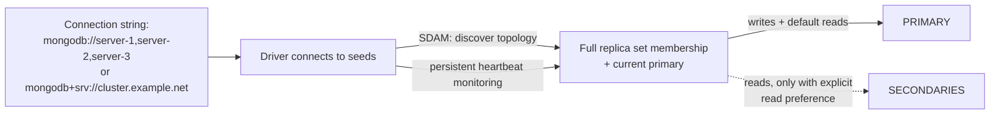
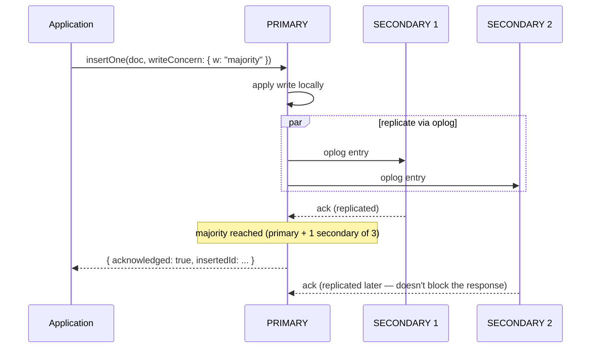

## Objective

Understand how an application driver actually *uses* a replica set day to day — not how the cluster elects a primary internally (that's the companion concept, "MongoDB Replica Sets: Topology, Elections, and Member Configuration"), but the two knobs the driver hands your code once the cluster is up: **write concern**, which decides how many nodes must acknowledge a write before your application is told it succeeded, and **read preference**, which decides which member — primary or secondary — answers a given read. The book frames the driver's default behavior plainly: "by default, drivers will connect to the primary and route all traffic to it. Your application can perform reads and writes as though it were talking to a standalone server while your replica set quietly keeps hot standbys ready in the background." Everything in this concept is about what happens when you deliberately step away from that default — and why you usually shouldn't.

## Use Cases

- Building a connection string that lists multiple seed members (`"mongodb://server-1:27017,server-2:27017,server-3:27017"`) or, better, a DNS seedlist (`mongodb+srv://`) so the driver can discover the rest of the set and survive a seed host being retired without touching client config.
- Setting `writeConcern: { w: "majority" }` on a financial or inventory write so the application only reports success once the write is durable across a failover, not just accepted by a primary that might crash a second later.
- Choosing `primaryPreferred` for a dashboard that should keep answering reads (with slightly stale data) during a brief primary election, instead of erroring out the way the default `primary` read preference does.
- Recognizing, mid-incident, that a "the write succeeded but I can't read it back" bug is a `secondary`/`secondaryPreferred` read racing ahead of replication, not data loss — the book calls this out directly as a reason not to read from secondaries for read-your-own-writes workloads.
- Deciding whether a transient network error during a write is safe to retry — and knowing modern drivers already do this for you via retryable writes, so you don't have to hand-roll a retry loop that might double-apply a non-idempotent operation.

## Deep Dive

### Connecting: seed lists, not a single address

A driver doesn't connect to "the replica set" as an entity — it connects to a **seed list**: one or more member addresses passed to `MongoClient` (or your driver's equivalent). "You do not need to list all members in the seed list (although you can). When the driver connects to the seeds, it will discover the other members from them." Once connected, "all MongoDB drivers adhere to the server discovery and monitoring (SDAM) spec. They persistently monitor the topology of your replica set to detect any changes in your application's ability to reach all members of the set. In addition, the drivers monitor the set to maintain information on which member is the primary." This is the connectivity half of the story whose election mechanics — heartbeats every two seconds, majority-based voting — are the subject of the sibling topology concept; SDAM is simply the driver-side observer of that process.

The book also recommends the **DNS Seedlist Connection format** (`mongodb+srv://`) over a plain address list: "the advantage to using DNS is that servers hosting your MongoDB replica set members can be changed in rotation without needing to reconfigure the clients (specifically, their connection strings)." Current MongoDB documentation goes further than the book's mild recommendation — it now states the SRV form should be used "when possible" over the standard form, precisely because it needs only one seed host and supports server rotation with zero client-side changes.



### Failover from the driver's point of view

The driver's job during a failover is narrow and deliberately unglamorous: "if a primary goes down, the driver will automatically find the new primary (once one is elected) and will route requests to it as soon as possible. However, while there is no reachable primary, your application will be unable to perform writes... By default, the driver will not service any requests—read or write—during this period." No driver tries to hide the gap entirely, and the book explains why with a concrete distributed-systems problem: when a write fails because the primary went down mid-operation, the driver genuinely cannot tell whether the primary applied the write before it crashed.

The book's resolution is the **retry-at-most-once** strategy, reasoned out from the three possible error types (transient network error, persistent outage, rejected command): don't retry and you undercount transient failures; retry unboundedly and you risk overcounting or wasting cycles on a permanent outage; retry exactly once, and pair it with idempotent operations, and you get the best outcome across all three cases. This is exactly what **retryable writes** (introduced in MongoDB 3.6) automate: "the server maintains a unique identifier for each write operation and can therefore determine when the driver is attempting to retry a command that already succeeded. Rather than apply the write again, it will simply return a message indicating the write succeeded." As covered in Book vs. today below, this is no longer an opt-in feature you enable — modern drivers turn it on by default.

### Write concern: how many nodes must ack before you're told "done"

By default, a write only has to reach the primary to be acknowledged — but as the book puts it, "if a primary of a set goes down and the newly elected primary... did not replicate the very last writes to the former primary, those writes will be rolled back when the former primary comes back up." (The rollback mechanics themselves — scanning the oplog, writing `.bson` rollback files — belong to the sibling topology concept; here what matters is that write concern is the tool that prevents your application from ever seeing a false "success" for a write that's about to be rolled back.)

`writeConcern` is passed alongside the write itself:

```js
db.products.insertOne(
    { "_id": 10, "item": "envelopes", "qty": 100, type: "Self-Sealing" },
    { writeConcern: { "w": "majority", "wtimeout": 100 } }
);
```

"The server will not respond until this write operation has replicated to a majority of the members of the replica set. Only then will our application receive acknowledgment that this write succeeded." If replication doesn't finish inside `wtimeout`, the server returns a `WriteConcernError` — the write itself isn't undone, but the application is told explicitly that it can't yet count on durability. The book is direct about why `"majority"` specifically is the safe default to reach for: "write concern majority and the replica set election protocol ensure that in the event of a primary election, only secondaries that are up to date with acknowledged writes can be elected primary. In this way, we guarantee that rollback will not happen."



Beyond `"majority"`, `w` also accepts a raw number: `{ "w": 2 }` waits for the primary plus one secondary — "the `w` value includes the primary," so to reach *n* secondaries you set `w` to *n+1*. The book flags the obvious downside: "you have to change your application if your replica set configuration changes," which is exactly the coupling `"majority"` avoids.

For requirements more specific than a plain majority — "make sure that a write makes it to at least one server in each data center" — the book walks through tagging members (`config.members[0].tags = {"dc": "us-east"}`) and defining a named rule in `config.settings.getLastErrorModes = [{"eachDC": {"dc": 2}}]`, then writing with `{ "w": "eachDC" }`. This still works in current MongoDB exactly as described — the field name and syntax are unchanged — but the book's own closing judgment on it holds just as well today: "rules are immensely powerful ways to configure replication, although they are complex to understand and set up. Unless you have fairly involved replication requirements, you should be perfectly safe sticking with `"w": "majority"`."

### Read preference: routing reads away from the primary

Read preference is the read-side counterpart to write concern's write-side guarantee, and the book's default stance is blunt: "sending read requests to secondaries is generally a bad idea... you should generally send all traffic to the primary." Two separate risks justify that stance:

- **Consistency.** "Client libraries cannot tell how up to date a secondary is, so clients will cheerfully send queries to secondaries that are far behind." An application that writes a document and immediately reads it back can miss its own write entirely if that read lands on a lagging secondary — "clients can issue requests faster than replication can copy operations."
- **Load.** Using secondaries to absorb read traffic looks fine until one member goes down: "each of the remaining members are handling 100% of their possible load," which can overload the survivors, slow replication, and cascade into exactly the failure the extra capacity was meant to prevent. The book's recommendation for genuine read scaling is sharding, not secondary reads.

That said, the book lists the real read preference modes and when each earns its keep:

| Mode | Behavior |
|---|---|
| `primary` (default) | Always the primary; errors out if none is reachable. |
| `primaryPreferred` | Primary when available, falls back to a secondary during a primary-less window — "a temporary read-only mode when your set loses a primary." |
| `secondary` | Always a secondary; errors out if none is available. For workloads that "do not care about stale data and want to use the primary for writes only." |
| `secondaryPreferred` | Secondary when available, falls back to the primary otherwise. |
| `nearest` | Lowest measured ping time, primary or secondary treated equivalently — for latency-sensitive reads across data centers, with the explicit caveat that low-latency *writes* still require sharding, since "replica sets only allow writes to one location." |

These five modes are unchanged in current MongoDB — see Book vs. today. The book's closing advice is to combine modes deliberately rather than pick one globally: primary for reads that must be current, `primaryPreferred` for reads that can tolerate brief staleness during failover, `nearest` for reads where latency matters more than freshness.

### Book vs. today

> **The default write concern changed from `w: 1` to `w: "majority"` in MongoDB 5.0.** The book's examples pass `writeConcern: { "w": "majority" }` explicitly, which was necessary advice at the time — under MongoDB 2019/2020-era defaults, an unqualified write only needed the primary's acknowledgment. Since MongoDB 5.0, replica sets and sharded clusters default to `w: "majority"` automatically, so the durability guarantee the book spends this whole chapter earning is now the out-of-the-box behavior for most deployments. The one carve-out: if the set has a data-bearing member count that doesn't exceed the voting majority (the classic case being a primary-secondary-arbiter set where one data node is down), the implicit default falls back to `w: 1` — a direct descendant of the PSA cache-pressure trap the sibling topology concept already flags.
>
> **Retryable writes are enabled by default in modern drivers, not opt-in.** The book describes retryable writes as a MongoDB 3.6 feature you turn on and directs readers to "see your driver's documentation for details on how to use this option." Current drivers compatible with MongoDB 4.2+ enable `retryWrites=true` by default; you now have to explicitly set `retryWrites=false` to get the pre-3.6 behavior the book was written to move readers away from. The scope is unchanged from what the book implies: single-document operations and `findAndModify` are retryable; `updateMany`/`deleteMany` and writes inside a multi-document transaction are not.
>
> **The five read preference modes are exactly what the book documents — nothing added, nothing removed.** `primary`, `primaryPreferred`, `secondary`, `secondaryPreferred`, and `nearest` remain the complete list in current driver and server documentation, with `maxStalenessSeconds` and tag-set filtering layered on as refinements to the same five modes rather than new modes.
>
> **DNS seedlist connection strings (`mongodb+srv://`) went from "recommended" to the primary documented path.** The book presents `mongodb+srv://` as a resilience upgrade over listing every seed host. Current MongoDB documentation is more assertive: it now states outright to "use SRV connection strings when possible" over the standard form, for the same seed-rotation reason the book gives.
>
> **`getLastErrorModes` and custom write-concern tags are unchanged.** The syntax the book walks through — `members[n].tags` plus `settings.getLastErrorModes` in the replica set config — matches current MongoDB documentation field-for-field. This is one corner of the chapter where nothing has moved.

## Trade-offs

- **`w: "majority"` buys durability against rollback at the cost of write latency.** Every write now waits on a round trip to at least one secondary instead of returning the instant the primary applies it. That the current default absorbs this cost automatically (see Book vs. today) doesn't remove the cost — it just means a team that actually wants `w: 1`'s speed for genuinely disposable writes (ephemeral caches, best-effort telemetry) has to opt out explicitly rather than opt in, which is easy to overlook during a performance review.
- **A numeric `w` is precise but brittle; `"majority"` is durable but opaque.** `{ "w": 2 }` gives an exact guarantee for a known topology, but the book's own warning holds: it silently stops meaning what you intended the moment the set is reconfigured to more or fewer members. `"majority"` self-adjusts to whatever the current voting majority is, at the cost of not being able to reason about "which specific members acknowledged this" from the number alone.
- **Reading from secondaries trades consistency and topology risk for latency and (limited) failover tolerance.** `nearest` and `secondaryPreferred` can meaningfully cut read latency or keep an application answering during a primary election, but every mode except plain `primary` accepts arbitrarily stale reads, and using secondaries to shed load specifically (rather than for staleness-tolerant use cases) is the load-distribution anti-pattern the book warns creates a death spiral the moment one member goes down.
- **Custom write-concern rules (`getLastErrorModes`) express real topology requirements precisely, at real setup and cognitive cost.** Tagging members and defining named rules like `"eachDC"` lets you encode "at least one copy per data center" exactly — but it's config that has to be kept in sync with the physical topology by hand, and the book's own closing recommendation is to reach for it only when a plain `"majority"` genuinely isn't enough.
- **Retryable writes remove a whole class of hand-rolled retry bugs, but only for idempotent single-document operations.** Defaulting it on (current drivers) is a net safety win, but it doesn't cover `updateMany`, `deleteMany`, or in-transaction writes — an application that assumes "retryable writes are on, so all my writes are safe to retry" for those operation types is exposed to exactly the double-apply risk the book's retry-strategy reasoning was built to avoid.

## Documentation Links

- [Shannon Bradshaw, Eoin Brazil, and Kristina Chodorow, "MongoDB: The Definitive Guide", 3rd Edition (O'Reilly, 2020) — Chapter 12, "Connecting to a Replica Set from Your Application", p. 261-270](https://www.oreilly.com/library/view/mongodb-the-definitive/9781491954454/) — doc
- [MongoDB Documentation — Write Concern](https://www.mongodb.com/docs/manual/reference/write-concern/) — doc
- [MongoDB Documentation — Default MongoDB Read Concerns/Write Concerns](https://www.mongodb.com/docs/manual/reference/mongodb-defaults/) — doc
- [MongoDB Documentation — Read Preference](https://www.mongodb.com/docs/manual/core/read-preference/) — doc
- [MongoDB Documentation — Retryable Writes](https://www.mongodb.com/docs/manual/core/retryable-writes/) — doc
- [MongoDB Documentation — Connection String URI Format](https://www.mongodb.com/docs/manual/reference/connection-string/) — doc
- [MongoDB Documentation — Replica Set Configuration Reference](https://www.mongodb.com/docs/manual/reference/replica-configuration/) — doc
- [MongoDB Documentation — Configure Replica Set Tag Sets](https://www.mongodb.com/docs/manual/tutorial/configure-replica-set-tag-sets/) — doc
