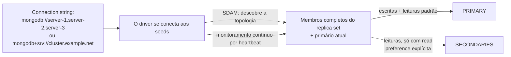
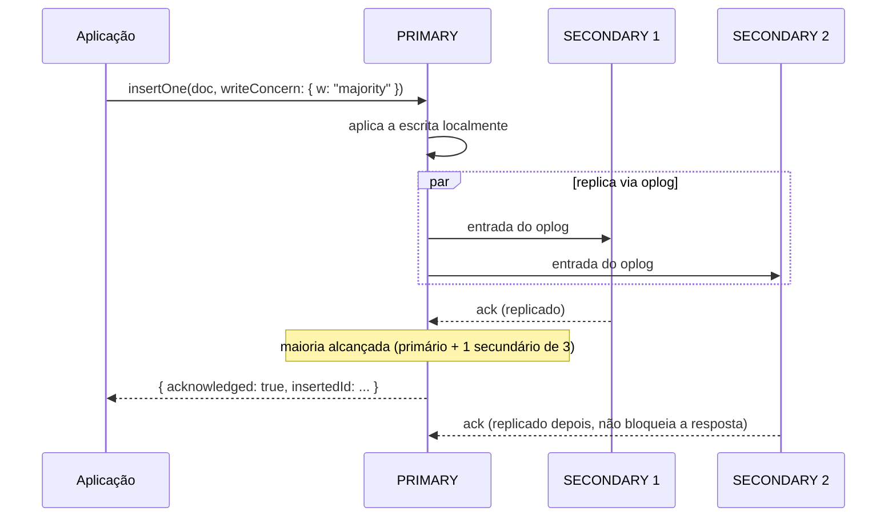

## Objective

Entender como o driver de uma aplicação realmente *usa* um replica set no dia a dia: não como o cluster elege um primário internamente (esse é o conceito companheiro, "MongoDB Replica Sets: Topology, Elections, and Member Configuration"), mas os dois botões que o driver entrega ao seu código quando o cluster está no ar: **write concern**, que decide quantos nós precisam confirmar uma escrita antes que sua aplicação seja informada de que ela deu certo, e **read preference**, que decide qual membro (primário ou secundário) responde a uma dada leitura. O livro enquadra o comportamento padrão do driver sem rodeios: "por padrão, os drivers se conectam ao primário e roteiam todo o tráfego para ele. Sua aplicação pode fazer leituras e escritas como se estivesse falando com um servidor isolado, enquanto seu replica set mantém em silêncio standbys prontos em segundo plano." Tudo neste conceito trata do que acontece quando você deliberadamente se afasta desse padrão, e de por que normalmente não deveria.

## Use Cases

- Montar uma connection string que lista vários membros seed (`"mongodb://server-1:27017,server-2:27017,server-3:27017"`) ou, melhor, um DNS seedlist (`mongodb+srv://`), para que o driver possa descobrir o resto do conjunto e sobreviver à aposentadoria de um host seed sem mexer na configuração do cliente.
- Definir `writeConcern: { w: "majority" }` em uma escrita financeira ou de estoque, para que a aplicação só reporte sucesso quando a escrita for durável através de um failover, e não apenas aceita por um primário que pode cair um segundo depois.
- Escolher `primaryPreferred` para um dashboard que deveria continuar respondendo leituras (com dados um pouco desatualizados) durante uma breve eleição de primário, em vez de dar erro como a read preference padrão `primary` faz.
- Reconhecer, no meio de um incidente, que um bug de "a escrita deu certo, mas não consigo lê-la de volta" é uma leitura `secondary`/`secondaryPreferred` correndo à frente da replicação, e não perda de dados; o livro aponta isso diretamente como motivo para não ler de secundários em cargas de ler as próprias escritas.
- Decidir se é seguro repetir uma escrita depois de um erro de rede transitório, e saber que os drivers modernos já fazem isso por você via retryable writes, para que você não precise montar à mão um loop de nova tentativa que pode aplicar duas vezes uma operação não idempotente.

## Deep Dive

### Conectando: seed lists, não um endereço único

Um driver não se conecta ao "replica set" como entidade: ele se conecta a uma **seed list**, um ou mais endereços de membros passados ao `MongoClient` (ou ao equivalente do seu driver). "Você não precisa listar todos os membros na seed list (embora possa). Quando o driver se conecta aos seeds, ele descobre os outros membros a partir deles." Depois de conectados, "todos os drivers do MongoDB seguem a especificação de descoberta e monitoramento de servidores (SDAM). Eles monitoram continuamente a topologia do seu replica set para detectar qualquer mudança na capacidade da sua aplicação de alcançar todos os membros do conjunto. Além disso, os drivers monitoram o conjunto para manter a informação de qual membro é o primário." Esta é a metade de conectividade da história cuja mecânica de eleição (heartbeats a cada dois segundos, votação por maioria) é assunto do conceito irmão de topologia; o SDAM é simplesmente o observador desse processo do lado do driver.

O livro também recomenda o **formato de conexão DNS Seedlist** (`mongodb+srv://`) em vez de uma lista simples de endereços: "a vantagem de usar DNS é que os servidores que hospedam os membros do seu replica set podem ser trocados em rodízio sem precisar reconfigurar os clientes (especificamente, suas connection strings)." A documentação atual do MongoDB vai além da recomendação branda do livro: ela agora afirma que a forma SRV deveria ser usada "sempre que possível" em vez da forma padrão, justamente porque precisa de só um host seed e suporta o rodízio de servidores sem nenhuma mudança no lado do cliente.



### Failover do ponto de vista do driver

O trabalho do driver durante um failover é estreito e deliberadamente sem glamour: "se um primário cair, o driver vai encontrar automaticamente o novo primário (quando um for eleito) e vai rotear as requisições para ele o mais rápido possível. Porém, enquanto não houver primário alcançável, sua aplicação não vai conseguir fazer escritas... Por padrão, o driver não vai atender nenhuma requisição, de leitura ou escrita, durante esse período." Nenhum driver tenta esconder a lacuna por completo, e o livro explica por que com um problema concreto de sistemas distribuídos: quando uma escrita falha porque o primário caiu no meio da operação, o driver genuinamente não consegue saber se o primário aplicou a escrita antes de cair.

A resolução do livro é a estratégia de **tentar de novo no máximo uma vez**, deduzida a partir dos três tipos possíveis de erro (erro de rede transitório, indisponibilidade persistente, comando rejeitado): não tentar de novo subestima as falhas transitórias; tentar de novo sem limite arrisca contar em dobro ou desperdiçar ciclos em uma indisponibilidade permanente; tentar de novo exatamente uma vez, combinado com operações idempotentes, dá o melhor resultado nos três casos. É exatamente isso que as **retryable writes** (introduzidas no MongoDB 3.6) automatizam: "o servidor mantém um identificador único para cada operação de escrita e, por isso, consegue determinar quando o driver está tentando repetir um comando que já teve sucesso. Em vez de aplicar a escrita de novo, ele simplesmente retorna uma mensagem indicando que a escrita deu certo." Como coberto em Livro vs. hoje abaixo, isto deixou de ser um recurso que você ativa: os drivers modernos o ligam por padrão.

### Write concern: quantos nós precisam confirmar antes de você ouvir "pronto"

Por padrão, uma escrita só precisa chegar ao primário para ser confirmada, mas, como o livro diz, "se o primário de um conjunto cair e o primário recém-eleito... não tiver replicado as últimas escritas do primário anterior, essas escritas serão revertidas quando o primário anterior voltar." (A mecânica do rollback em si, percorrer o oplog e gravar arquivos `.bson` de rollback, pertence ao conceito irmão de topologia; aqui o que importa é que o write concern é a ferramenta que impede sua aplicação de ver um falso "sucesso" para uma escrita prestes a ser revertida.)

O `writeConcern` é passado junto com a própria escrita:

```js
db.products.insertOne(
    { "_id": 10, "item": "envelopes", "qty": 100, type: "Self-Sealing" },
    { writeConcern: { "w": "majority", "wtimeout": 100 } }
);
```

"O servidor não vai responder até que esta operação de escrita tenha sido replicada para a maioria dos membros do replica set. Só então nossa aplicação vai receber a confirmação de que a escrita deu certo." Se a replicação não terminar dentro do `wtimeout`, o servidor retorna um `WriteConcernError`: a escrita em si não é desfeita, mas a aplicação é informada explicitamente de que ainda não pode contar com a durabilidade. O livro é direto sobre por que `"majority"`, especificamente, é o padrão seguro a escolher: "o write concern majority e o protocolo de eleição do replica set garantem que, no caso de uma eleição de primário, só secundários atualizados com as escritas confirmadas possam ser eleitos primário. Desta forma, garantimos que o rollback não vai acontecer."



Além de `"majority"`, o `w` também aceita um número puro: `{ "w": 2 }` espera o primário mais um secundário; "o valor de `w` inclui o primário", então para alcançar *n* secundários você define `w` como *n+1*. O livro aponta a desvantagem óbvia: "você precisa mudar sua aplicação se a configuração do replica set mudar", que é exatamente o acoplamento que `"majority"` evita.

Para requisitos mais específicos que uma maioria simples ("garanta que uma escrita chegue a pelo menos um servidor em cada data center"), o livro percorre a marcação de membros com tags (`config.members[0].tags = {"dc": "us-east"}`) e a definição de uma regra nomeada em `config.settings.getLastErrorModes = [{"eachDC": {"dc": 2}}]`, escrevendo então com `{ "w": "eachDC" }`. Isso ainda funciona no MongoDB atual exatamente como descrito (o nome do campo e a sintaxe não mudaram), e o julgamento final do próprio livro sobre isso vale igualmente hoje: "regras são formas imensamente poderosas de configurar a replicação, embora sejam complexas de entender e montar. A menos que você tenha requisitos de replicação bem complicados, deveria ficar perfeitamente seguro usando `"w": "majority"`."

### Read preference: roteando leituras para longe do primário

A read preference é a contraparte no lado da leitura da garantia que o write concern dá no lado da escrita, e a postura padrão do livro é direta: "mandar requisições de leitura para secundários em geral é uma má ideia... você deveria em geral mandar todo o tráfego para o primário." Dois riscos separados justificam essa postura:

- **Consistência.** "As bibliotecas cliente não conseguem saber quão atualizado um secundário está, então os clientes vão mandar alegremente consultas para secundários muito atrasados." Uma aplicação que escreve um documento e o lê de volta imediatamente pode perder a própria escrita por completo se essa leitura cair em um secundário atrasado: "os clientes conseguem emitir requisições mais rápido do que a replicação consegue copiar operações."
- **Carga.** Usar secundários para absorver tráfego de leitura parece ótimo até um membro cair: "cada um dos membros restantes passa a lidar com 100% da sua carga possível", o que pode sobrecarregar os sobreviventes, desacelerar a replicação e cascatear exatamente na falha que a capacidade extra deveria evitar. A recomendação do livro para escalar leituras de verdade é sharding, não leituras em secundários.

Dito isso, o livro lista os modos reais de read preference e quando cada um se justifica:

| Modo | Comportamento |
|---|---|
| `primary` (padrão) | Sempre o primário; dá erro se nenhum estiver alcançável. |
| `primaryPreferred` | O primário quando disponível; recorre a um secundário durante uma janela sem primário, "um modo somente leitura temporário quando seu conjunto perde o primário." |
| `secondary` | Sempre um secundário; dá erro se nenhum estiver disponível. Para cargas que "não se importam com dados desatualizados e querem usar o primário só para escritas." |
| `secondaryPreferred` | Um secundário quando disponível; recorre ao primário caso contrário. |
| `nearest` | O menor tempo de ping medido, tratando primário e secundário como equivalentes; para leituras sensíveis a latência entre data centers, com a ressalva explícita de que escritas de baixa latência ainda exigem sharding, já que "replica sets só permitem escritas em um local." |

Esses cinco modos não mudaram no MongoDB atual; veja Livro vs. hoje. O conselho final do livro é combinar os modos deliberadamente em vez de escolher um globalmente: primário para leituras que precisam estar atualizadas, `primaryPreferred` para leituras que toleram um breve atraso durante o failover, `nearest` para leituras em que a latência importa mais que a atualidade.

### Livro vs. hoje

> **O write concern padrão mudou de `w: 1` para `w: "majority"` no MongoDB 5.0.** Os exemplos do livro passam `writeConcern: { "w": "majority" }` explicitamente, o que era um conselho necessário na época: com os padrões do MongoDB de 2019/2020, uma escrita sem qualificação só precisava da confirmação do primário. Desde o MongoDB 5.0, replica sets e clusters shardeados usam `w: "majority"` automaticamente por padrão, então a garantia de durabilidade que o livro passa o capítulo inteiro conquistando agora é o comportamento de fábrica para a maioria das implantações. A única exceção: se o conjunto tiver uma quantidade de membros com dados que não passe da maioria votante (o caso clássico é um conjunto primário-secundário-arbiter com um nó de dados fora do ar), o padrão implícito volta para `w: 1`, um descendente direto da armadilha de pressão de cache em PSA que o conceito irmão de topologia já aponta.
>
> **Retryable writes vêm ligadas por padrão nos drivers modernos, não são opcionais.** O livro descreve as retryable writes como um recurso do MongoDB 3.6 que você liga e manda os leitores "consultar a documentação do seu driver para detalhes de como usar essa opção." Os drivers atuais compatíveis com MongoDB 4.2+ ligam `retryWrites=true` por padrão; agora você precisa definir explicitamente `retryWrites=false` para ter o comportamento anterior ao 3.6 do qual o livro foi escrito para afastar os leitores. O escopo não mudou em relação ao que o livro dá a entender: operações de documento único e `findAndModify` podem ser repetidas; `updateMany`/`deleteMany` e escritas dentro de uma transação multidocumento não.
>
> **Os cinco modos de read preference são exatamente os que o livro documenta: nada foi acrescentado, nada foi removido.** `primary`, `primaryPreferred`, `secondary`, `secondaryPreferred` e `nearest` continuam sendo a lista completa na documentação atual de drivers e do servidor, com `maxStalenessSeconds` e filtragem por tag sets acrescentados como refinamentos dos mesmos cinco modos, não como modos novos.
>
> **As connection strings de DNS seedlist (`mongodb+srv://`) passaram de "recomendadas" a caminho principal documentado.** O livro apresenta `mongodb+srv://` como uma melhoria de resiliência em relação a listar todos os hosts seed. A documentação atual do MongoDB é mais assertiva: ela agora diz com todas as letras para "usar connection strings SRV sempre que possível" em vez da forma padrão, pelo mesmo motivo de rodízio de seeds que o livro dá.
>
> **`getLastErrorModes` e as tags de write concern customizadas não mudaram.** A sintaxe que o livro percorre (`members[n].tags` mais `settings.getLastErrorModes` na configuração do replica set) bate campo a campo com a documentação atual do MongoDB. Este é um canto do capítulo em que nada mudou.

## Trade-offs

- **`w: "majority"` compra durabilidade contra rollback ao custo de latência de escrita.** Toda escrita agora espera uma ida e volta até pelo menos um secundário, em vez de retornar no instante em que o primário a aplica. O fato de o padrão atual absorver esse custo automaticamente (veja Livro vs. hoje) não remove o custo: só significa que um time que realmente quer a velocidade do `w: 1` para escritas genuinamente descartáveis (caches efêmeros, telemetria de melhor esforço) precisa desligá-lo explicitamente em vez de ligá-lo, algo fácil de não perceber durante uma revisão de desempenho.
- **Um `w` numérico é preciso, mas frágil; `"majority"` é durável, mas opaco.** `{ "w": 2 }` dá uma garantia exata para uma topologia conhecida, mas o aviso do próprio livro vale: ele deixa de significar em silêncio o que você pretendia no momento em que o conjunto é reconfigurado com mais ou menos membros. `"majority"` se ajusta sozinho à maioria votante atual, ao custo de não permitir raciocinar, só pelo número, sobre "quais membros específicos confirmaram isto."
- **Ler de secundários troca consistência e risco de topologia por latência e tolerância (limitada) a failover.** `nearest` e `secondaryPreferred` podem reduzir de forma significativa a latência de leitura ou manter uma aplicação respondendo durante uma eleição de primário, mas todo modo exceto o simples `primary` aceita leituras arbitrariamente desatualizadas, e usar secundários especificamente para aliviar carga (em vez de para casos que toleram dados desatualizados) é o antipadrão de distribuição de carga que o livro alerta criar uma espiral de morte no momento em que um membro cai.
- **Regras customizadas de write concern (`getLastErrorModes`) expressam requisitos reais de topologia com precisão, a um custo real de configuração e cognitivo.** Marcar membros com tags e definir regras nomeadas como `"eachDC"` permite codificar exatamente "pelo menos uma cópia por data center", mas é uma configuração que precisa ser mantida em sincronia à mão com a topologia física, e a própria recomendação final do livro é recorrer a ela só quando um simples `"majority"` realmente não basta.
- **Retryable writes eliminam uma classe inteira de bugs de nova tentativa feitos à mão, mas só para operações idempotentes de documento único.** Deixá-las ligadas por padrão (drivers atuais) é um ganho líquido de segurança, mas elas não cobrem `updateMany`, `deleteMany` nem escritas dentro de transações; uma aplicação que presume que "retryable writes estão ligadas, então todas as minhas escritas são seguras para repetir" para esses tipos de operação fica exposta exatamente ao risco de aplicar duas vezes que o raciocínio do livro sobre estratégia de nova tentativa foi construído para evitar.

## Documentation Links

- [Shannon Bradshaw, Eoin Brazil e Kristina Chodorow, "MongoDB: The Definitive Guide", 3ª edição (O'Reilly, 2020): Capítulo 12, "Connecting to a Replica Set from Your Application", p. 261-270](https://www.oreilly.com/library/view/mongodb-the-definitive/9781491954454/): doc
- [MongoDB Documentation: Write Concern](https://www.mongodb.com/docs/manual/reference/write-concern/): doc
- [MongoDB Documentation: Default MongoDB Read Concerns/Write Concerns](https://www.mongodb.com/docs/manual/reference/mongodb-defaults/): doc
- [MongoDB Documentation: Read Preference](https://www.mongodb.com/docs/manual/core/read-preference/): doc
- [MongoDB Documentation: Retryable Writes](https://www.mongodb.com/docs/manual/core/retryable-writes/): doc
- [MongoDB Documentation: Connection String URI Format](https://www.mongodb.com/docs/manual/reference/connection-string/): doc
- [MongoDB Documentation: Replica Set Configuration Reference](https://www.mongodb.com/docs/manual/reference/replica-configuration/): doc
- [MongoDB Documentation: Configure Replica Set Tag Sets](https://www.mongodb.com/docs/manual/tutorial/configure-replica-set-tag-sets/): doc
