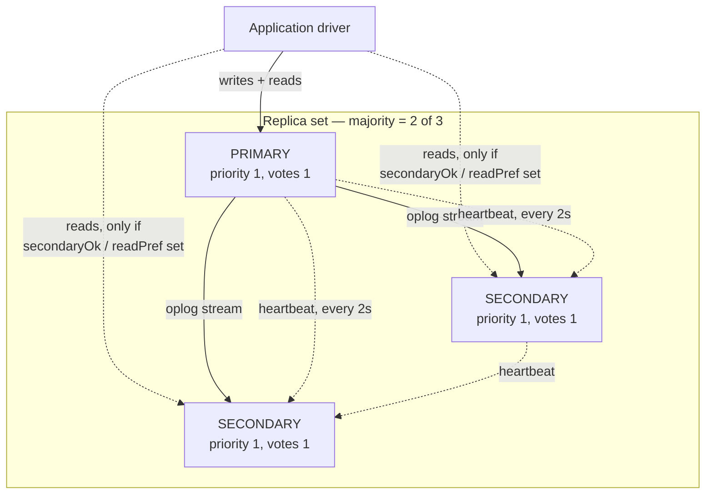
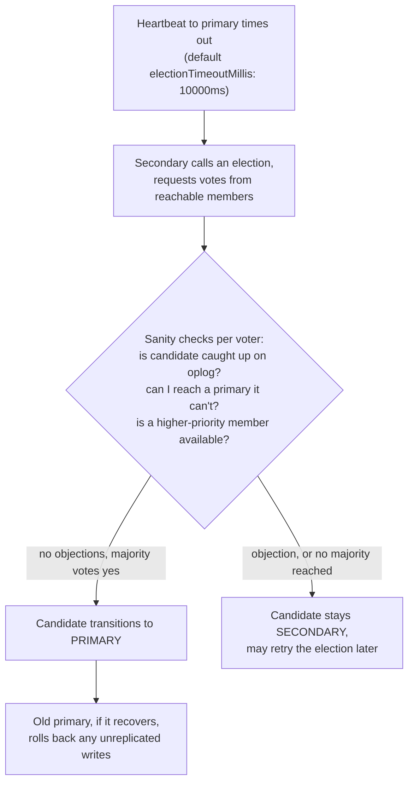

## Objective

Understand what a MongoDB replica set actually is — a primary taking writes plus secondaries replicating an oplog of every operation — and how it survives a primary failure without a human in the loop: a secondary notices it can't reach the primary, calls an election, and a **majority** of the set's votes decides who becomes primary next. The book frames replication plainly: it "is a way of keeping identical copies of your data on multiple servers and is recommended for all production deployments," and the mechanics of that promise — majorities, heartbeats, priority, oplogs, rollbacks — are what separate a replica set that fails over cleanly from one that goes primary-less or silently loses writes.

## Use Cases

- Reading `rs.status()` or `hello()` output during an incident to work out, in the moment, which member is primary, who's lagging, and whether the set can even reach a majority right now.
- Laying out members across two data centers so that a network partition — which "looks identical to servers on the other side of the partition going down" — always leaves the majority, and therefore the primary, on the side you actually want it on.
- Deciding whether a given member should be a normal voting secondary, a `priority: 0` passive member, a `hidden` member kept off client reads, or an arbiter — and knowing arbiters are a last resort, not a default.
- Sizing the oplog so a secondary that falls behind (a slow batch job, planned downtime) still has a two-to-three-day window to catch up before it goes stale and needs a full resync.
- Explaining, after a failover, why the new primary is missing writes the old primary accepted seconds before it went down — this is a rollback, not data corruption, and the book's mechanics for it explain exactly what happened and how to recover the rolled-back operations.

## Deep Dive

### What a replica set actually is

A replica set is "a group of servers with one primary, the server taking writes, and multiple secondaries, servers that keep copies of the primary's data. If the primary crashes, the secondaries can elect a new primary from amongst themselves." Every member of the set must be able to reach every other member (including itself) — replica sets are a fully connected mesh, not a hub-and-spoke topology.

Two rules the book states as flatly as anything in the chapter: **clients cannot write to secondaries**, and **clients cannot read from secondaries by default** — a secondary will answer a read with `"not master and slaveOk=false"` unless the driver explicitly opts in, because "secondaries may fall behind the primary (or lag) and not have the most current writes." That opt-in exists specifically so an application doesn't accidentally read stale data by connecting to whichever node happens to answer first.

MongoDB deliberately supports only a **single primary**, and the book explains the trade-off directly: with two primaries you'd need to resolve conflicting writes (an update on one primary, a delete on the other), and the only two general strategies — manual reconciliation or the system arbitrarily picking a winner — are both bad models for developers to code against, "seeing as you can't be sure that the data you've written won't change out from under you." Single-primary "makes development easier but can result in periods when the replica set is read-only" — that read-only window during an election is the price paid for never having to reconcile a split-brain write conflict.

### Syncing: the oplog is the whole mechanism

Replication works by the primary keeping an **oplog** — a capped collection in the `local` database logging every write it performs — which every secondary tails and replays. Each secondary keeps its own copy of the oplog as it replicates, which is what lets any member sync from any other member, not just from the primary directly.

Oplog operations are **idempotent by design**: "replaying oplog ops multiple times yields the same result as replaying them once," which is what makes a secondary restarting mid-replication or catching a full oplog batch twice a non-event instead of a corruption risk. A single multi-document operation gets exploded into one oplog entry per document — removing a million documents becomes a million oplog entries — so bulk deletes and multi-updates can fill an oplog far faster than the raw write volume would suggest.

A member joining fresh does an **initial sync**: clone every database except `local`, then replay the oplog to catch up to whatever happened during the clone. The book's warning here is worth quoting exactly, since it's a data-loss trap for anyone who initial-syncs onto the wrong node: "Only do an initial sync for a member if you do not want the data in your data directory or have moved it elsewhere, as mongod's first action is to delete it all."

If a secondary falls too far behind that its next needed oplog entry has already been overwritten on the sync source, it goes **stale** and must fully resync (or restore from backup) — there's no partial recovery. The book's rule of thumb: size the oplog to cover **two to three days** of normal write volume, since disk is cheap and an underused oplog barely touches RAM, but a too-small one turns any extended downtime into a mandatory resync.

### Majority: the concept everything else is built on

The book states the design principle at the center of the whole chapter: "replica sets are all about majorities: you need a majority of members to elect a primary, a primary can only stay primary as long as it can reach a majority, and a write is safe when it's been replicated to a majority." Majority means strictly more than half the **configured** member count — not half of whoever happens to be reachable right now:

| Members in the set | Majority needed |
|---|---|
| 1 | 1 |
| 2 | 2 |
| 3 | 2 |
| 4 | 3 |
| 5 | 3 |
| 6 | 4 |
| 7 | 4 |

That distinction — configured count, not currently-up count — is what makes a five-member set with three members down correctly refuse to elect a primary among the surviving two, even though "many users find this frustrating." The book's justification is a scenario every operator eventually hits: from the perspective of the two reachable members, three servers being down and a network partition that merely isolates them from three healthy servers look **identical**. If the two-member minority were allowed to elect a primary, a partition would produce two primaries simultaneously accepting writes on both sides — the exact split-brain majority quorum exists to prevent.

This makes deployment topology a majority-arithmetic problem as much as a hardware one. The book gives two concrete patterns for spreading a set across two data centers:

1. **A majority of the set in one data center.** Whichever site holds the majority always keeps a primary as long as it's healthy, but the minority site can never elect on its own if the majority site goes fully dark.
2. **An equal split plus a tie-breaking member in a third location.** Either "real" site can usually see a majority, at the cost of operating three physical locations instead of two.

### How elections actually work

A secondary that can't reach a primary sends every member it *can* reach a request to be elected. Those members run sanity checks before voting: can they reach a primary this candidate can't see? Is the candidate caught up on replication? Is a higher-priority member available that should win instead? A candidate only gets a vote if none of those objections apply, and it only becomes primary if it collects votes from a **majority of the set** — not a majority of respondents, the whole configured set.

Failover speed depends entirely on network health: heartbeats fire every **two seconds**, so a dead primary is noticed within roughly that window, and the election itself "should only take a few milliseconds" once triggered — but an election caused by network flakiness or overloaded members answering slowly "might take more time — even up to a few minutes."

Since version 3.2, elections run on **replication protocol version 1**, which the book describes as "RAFT-like" — based on the Raft consensus algorithm, adapted to MongoDB-specific concepts like arbiters, priority, and write concern. The concrete payoff over the pre-3.2 protocol: faster failover, faster detection of a false-primary situation, and **term IDs that prevent double voting** — a member can't cast two conflicting votes for the same election round.

Priority shapes *which* eligible secondary tends to win without ever forcing an outcome the data doesn't support: "the highest-priority member will always be elected primary (so long as it can reach a majority of the set and has the most up-to-date data)," but "setting priorities will never cause your set to go primary-less. It will also never cause a member that is behind to become primary." A higher-priority secondary that's behind loses to a lower-priority one that's caught up — priority breaks ties among equally-caught-up candidates, it doesn't override the up-to-date requirement.

### Rollbacks: the cost of a majority-based promotion

If a primary accepts a write and goes down before that write replicates anywhere, and a new primary gets elected off the surviving majority, that write is simply gone from the set's future — and when the old primary rejoins, it has to **roll back** its own unreplicated operations to rejoin cleanly. The mechanism: the rejoining member scans back through its oplog for the last operation both sides agree on, writes its own version of every document touched by the ops after that point to `.bson` files in a rollback directory, and then re-syncs those documents from the current primary. Rolled-back data isn't deleted from disk — it's parked in files an operator can `mongorestore` into a staging collection and manually reconcile back in, which is real recovery work, not a silent loss.

Versions before 4.0 could refuse a rollback outright if it exceeded 300 MB or about 30 minutes of operations, forcing a full resync instead — the book notes this ceiling was removed in 4.0, so rollback now always completes, however large. The practical defense is the same either way: keep secondaries close to caught up, because the classic rollback trigger is a lagging secondary getting promoted after the primary dies, inheriting a gap the old primary's unreplicated writes fall straight into.

### Member configuration knobs

Every member subdocument in the replica set config can diverge from uniform defaults:

- **`priority`** (0–100, default 1) — how strongly a member wants to become primary. `priority: 0` makes a member a **passive member**: eligible to vote, never eligible to be elected. Only the *relative* ordering of priorities matters, not their absolute values.
- **`hidden`** — removes a member from the `hosts` list that `hello()`/`isMaster()` returns to clients, so drivers never route reads to it, without removing it from `rs.status()` or replication. A hidden member requires `priority: 0` — there is no such thing as a hidden primary.
- **`votes`** — whether a member counts toward the majority calculation at all. The book is blunt that this is "almost always not what you want to do and causes a lot of rollbacks" when misused; manipulating vote counts outside the 50-member/7-voting-member ceiling (see Book vs. today) is a specialist tool, not a knob to reach for casually.
- **`secondaryDelaySecs`** (`slaveDelay` in the book's edition — see Book vs. today) — holds a member deliberately behind the primary by a configured number of seconds, giving a delayed member a rewindable copy of recent history.
- **`buildIndexes: false`** — skips building indexes on that member entirely, useful for a pure backup/batch-job node. This is **permanent**: converting a non-index-building member back to normal requires removing it and resyncing from scratch. Like `hidden`, it requires `priority: 0`.
- **Arbiters** — a special member type that holds no data and is never used by clients; its only role is casting a vote. The book's overall stance is direct: "in general, deployments without arbiters are preferable," and useful only for cost-constrained small deployments that don't want a third full data copy, or as a tiebreaker in an even-sized set. Critically, at most **one** arbiter ever helps — adding one to an already-odd-sized set raises the majority bar (a 3-member set needs 2 of 3 up; add one arbiter and a 4-member set needs 3 of 4) and can make elections *slower*, not faster, since an even count of data-bearing-plus-arbiter members can itself produce ties.

The book flags a specific operational trap with **primary-secondary-arbiter (PSA)** three-member sets and PSA-shaped shards: with `"majority"` read concern enabled, storage cache pressure builds if either data-bearing node goes down, since the arbiter can't help absorb the load. Its fix — replace the arbiter with a real data-bearing member where possible, or disable `"majority"` read concern on the deployment — is exactly the guidance current MongoDB documentation still gives, discussed below.

### Book vs. today

> **The 50-member / 7-voting-member ceiling is unchanged.** A replica set can still have up to 50 total members, with a hard cap of 7 voting members — members beyond that need `votes: 0` to stay non-voting. `electionTimeoutMillis` defaults to 10000ms and `heartbeatIntervalMillis` to 2000ms, matching the values the book's example config shows. None of the core numbers this chapter relies on have moved.

> **PSA is now actively discouraged, not just cautioned against.** The book already recommends against arbiters "in general" and flags the majority-read-concern cache-pressure issue for PSA sets. Current MongoDB documentation goes further: it explicitly warns that PSA shards in a sharded cluster can lose availability if a data-bearing secondary goes down, since `w: majority` writes can't complete without a real data-bearing quorum, and MongoDB 5.3+ disables configuring **multiple** arbiters in one set by default specifically to avoid the data-consistency and rollback risk the book already warns about for a single misused vote count.

> **`slaveDelay` was renamed `secondaryDelaySecs` in MongoDB 5.0**, and it's not backward compatible — the field this chapter's `rs.config()` output shows as `"slaveDelay" : NumberLong(0)` is the pre-5.0 name for exactly the delayed-member setting described above.

> **`isMaster()`/`db.isMaster()` and `setSlaveOk()` are deprecated**, replaced by `hello()`/`db.hello()` and `setReadPref()` respectively since MongoDB 5.0. The book already flags `isMaster` as legacy terminology predating replica sets ("it still calls the primary a 'master'"); today it's not just old terminology but a deprecated command drivers are steered away from. The underlying concepts — check who's primary, opt in to reading from a secondary — are identical under the new names.

## Trade-offs

- **Single-primary avoids write conflicts entirely, at the cost of a real availability window.** No dual-primary conflict resolution to build or reason about, but a failed election, or an election that takes "up to a few minutes" under network stress, is a genuine read-only (or fully unavailable-for-writes) period. Applications that can't tolerate any write pause need to design around that window explicitly — retries with backoff, queuing — rather than assume failover is instantaneous.
- **Majority-based quorum prevents split-brain but means "more nodes down" isn't always "worse" and "more nodes up" isn't always "better" — placement is what matters.** A five-member set with three down is unavailable for writes even though two healthy nodes remain, precisely because majority is computed against the configured count, not the reachable count. Getting this right is a topology-design problem (which data center gets the majority) as much as a redundancy-count problem.
- **Arbiters buy vote-majority cheaply and quietly remove a full data copy from your recovery options.** An arbiter costs almost nothing to run and breaks ties, but the book's own example makes the real cost concrete: in a two-data-node-plus-arbiter set, losing one data node leaves the surviving primary as the sole remaining full copy of your data while also serving live application traffic — there's no secondary to bootstrap a replacement from without stressing the one node still doing real work. Three real data-bearing nodes trade that risk for the cost of a third full copy.
- **The oplog's idempotency and rollback mechanism make failover safe rather than lossless.** Nothing about elections prevents an accepted-but-unreplicated write from disappearing when its primary crashes before replicating it — that's rollback, not a bug. The trade is explicit: a bigger oplog (two to three days' coverage, per the book's rule of thumb) buys a wider window to avoid staleness and reduces how often a lagging secondary becomes the rollback-triggering new primary, at the cost of more disk given to something that's rarely read end-to-end.
- **Hidden and `buildIndexes: false` members isolate load at the cost of being one-way doors.** Hiding a member is fully reversible (flip `hidden` back to `false`); disabling index builds is not — reversing it means removing the member and resyncing from scratch. Reach for `buildIndexes: false` only for members that are genuinely never going to need to serve reads or become a normal secondary later.

## Documentation Links

- [Shannon Bradshaw, Eoin Brazil, and Kristina Chodorow, "MongoDB: The Definitive Guide", 3rd Edition (O'Reilly, 2020) — Chapter 10-11, "Setting Up a Replica Set" and "Components of a Replica Set", p. 227-259](https://www.oreilly.com/library/view/mongodb-the-definitive/9781491954454/) — doc
- [MongoDB Documentation — Replica Sets](https://www.mongodb.com/docs/manual/replication/) — doc
- [MongoDB Documentation — Replica Set Elections](https://www.mongodb.com/docs/manual/core/replica-set-elections/) — doc
- [MongoDB Documentation — Replica Set Members](https://www.mongodb.com/docs/manual/core/replica-set-members/) — doc
- [MongoDB Documentation — Replica Set Arbiter](https://www.mongodb.com/docs/manual/core/replica-set-arbiter/) — doc
- [MongoDB Documentation — Delayed Replica Set Members](https://www.mongodb.com/docs/manual/core/replica-set-delayed-member/) — doc
- [MongoDB Documentation — Replica Set Rollbacks](https://www.mongodb.com/docs/manual/core/replica-set-rollbacks/) — doc
- [MongoDB Documentation — Replica Set Limits](https://www.mongodb.com/docs/manual/reference/limits/#replica-sets) — doc
- [MongoDB Documentation — Replica Set Configuration Reference](https://www.mongodb.com/docs/manual/reference/replica-configuration/) — doc
