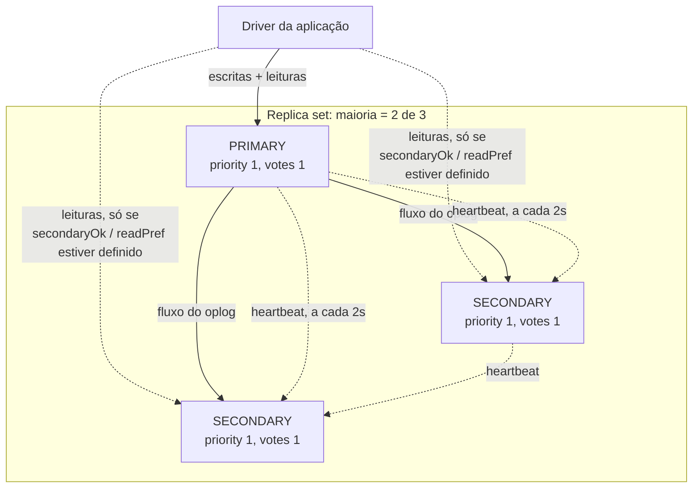
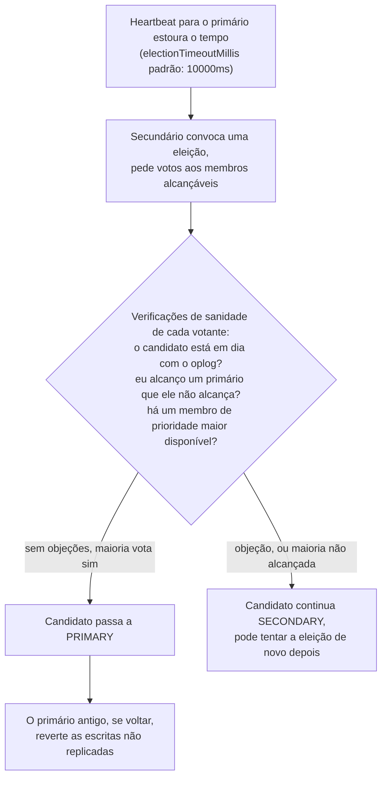

## Objective

Entender o que um replica set do MongoDB realmente é (um primário recebendo escritas mais secundários replicando um oplog de toda operação) e como ele sobrevive à falha de um primário sem um humano no circuito: um secundário percebe que não alcança o primário, convoca uma eleição, e uma **maioria** dos votos do conjunto decide quem será o próximo primário. O livro enquadra a replicação sem rodeios: ela "é uma forma de manter cópias idênticas dos seus dados em vários servidores e é recomendada para todas as implantações de produção", e a mecânica por trás dessa promessa (maiorias, heartbeats, prioridade, oplogs, rollbacks) é o que separa um replica set que faz failover de forma limpa de um que fica sem primário ou perde escritas em silêncio.

## Use Cases

- Ler a saída de `rs.status()` ou `hello()` durante um incidente para descobrir, na hora, qual membro é o primário, quem está atrasado e se o conjunto consegue sequer alcançar uma maioria agora.
- Distribuir os membros entre dois data centers de modo que uma partição de rede (que "parece idêntica, para os servidores, a uma queda dos servidores do outro lado da partição") sempre deixe a maioria, e portanto o primário, do lado em que você realmente o quer.
- Decidir se um dado membro deveria ser um secundário votante normal, um membro passivo com `priority: 0`, um membro `hidden` fora das leituras dos clientes ou um arbiter, e saber que arbiters são um último recurso, não um padrão.
- Dimensionar o oplog para que um secundário que fique para trás (um job batch lento, um downtime planejado) ainda tenha uma janela de dois a três dias para alcançar antes de ficar desatualizado e precisar de uma ressincronização completa.
- Explicar, depois de um failover, por que o novo primário não tem escritas que o primário antigo aceitou segundos antes de cair: isso é um rollback, não corrupção de dados, e a mecânica do livro para ele explica exatamente o que aconteceu e como recuperar as operações revertidas.

## Deep Dive

### O que um replica set realmente é

Um replica set é "um grupo de servidores com um primário, o servidor que recebe as escritas, e vários secundários, servidores que mantêm cópias dos dados do primário. Se o primário cair, os secundários podem eleger um novo primário entre si." Todo membro do conjunto precisa conseguir alcançar todos os outros membros (incluindo ele mesmo): replica sets são uma malha totalmente conectada, não uma topologia hub-and-spoke.

Duas regras que o livro afirma de forma tão categórica quanto qualquer coisa no capítulo: **clientes não podem escrever em secundários**, e **clientes não podem ler de secundários por padrão**. Um secundário responde a uma leitura com `"not master and slaveOk=false"` a menos que o driver opte explicitamente por isso, porque "secundários podem ficar para trás do primário (ou atrasar) e não ter as escritas mais recentes." Essa opção existe justamente para que uma aplicação não leia dados desatualizados por acidente ao se conectar ao nó que por acaso responder primeiro.

O MongoDB suporta deliberadamente apenas **um primário**, e o livro explica a troca diretamente: com dois primários você precisaria resolver escritas conflitantes (um update em um primário, um delete no outro), e as duas únicas estratégias gerais (reconciliação manual ou o sistema escolher arbitrariamente um vencedor) são modelos ruins para os desenvolvedores programarem contra, "já que você não pode ter certeza de que os dados que escreveu não vão mudar sem você saber." Um único primário "facilita o desenvolvimento, mas pode resultar em períodos em que o replica set fica somente leitura"; essa janela somente leitura durante uma eleição é o preço pago por nunca precisar reconciliar um conflito de escrita de split-brain.

### Sincronização: o oplog é o mecanismo inteiro

A replicação funciona porque o primário mantém um **oplog** (uma capped collection no banco `local` que registra toda escrita que ele faz), que todo secundário acompanha e reexecuta. Cada secundário mantém sua própria cópia do oplog enquanto replica, e é isso que permite a qualquer membro sincronizar a partir de qualquer outro, não só diretamente do primário.

As operações do oplog são **idempotentes por design**: "reexecutar operações do oplog várias vezes produz o mesmo resultado que reexecutá-las uma vez", e é isso que faz um secundário que reinicia no meio da replicação, ou que recebe um lote completo do oplog duas vezes, ser um não-evento em vez de um risco de corrupção. Uma única operação sobre vários documentos é explodida em uma entrada de oplog por documento (remover um milhão de documentos vira um milhão de entradas de oplog), então deletes em massa e multi-updates podem encher um oplog muito mais rápido do que o volume bruto de escrita sugeriria.

Um membro novo faz uma **sincronização inicial**: clona todos os bancos exceto `local` e depois reexecuta o oplog para alcançar o que aconteceu durante o clone. O aviso do livro aqui vale ser citado exatamente, já que é uma armadilha de perda de dados para quem faz a sincronização inicial no nó errado: "Só faça uma sincronização inicial em um membro se você não quiser os dados no seu diretório de dados ou se os tiver movido para outro lugar, já que a primeira ação do mongod é apagar tudo."

Se um secundário fica tão para trás que a próxima entrada de oplog de que ele precisa já foi sobrescrita na fonte de sincronização, ele fica **desatualizado (stale)** e precisa ressincronizar por completo (ou restaurar de um backup); não há recuperação parcial. A regra prática do livro: dimensione o oplog para cobrir **dois a três dias** de volume normal de escrita, já que disco é barato e um oplog pouco usado mal toca a RAM, mas um oplog pequeno demais transforma qualquer downtime prolongado em uma ressincronização obrigatória.

### Maioria: o conceito sobre o qual todo o resto é construído

O livro afirma o princípio de design no centro do capítulo inteiro: "replica sets giram em torno de maiorias: você precisa de uma maioria dos membros para eleger um primário, um primário só continua primário enquanto alcança uma maioria, e uma escrita está segura quando foi replicada para uma maioria." Maioria significa estritamente mais da metade do número **configurado** de membros, não metade de quem por acaso está alcançável agora:

| Membros no conjunto | Maioria necessária |
|---|---|
| 1 | 1 |
| 2 | 2 |
| 3 | 2 |
| 4 | 3 |
| 5 | 3 |
| 6 | 4 |
| 7 | 4 |

Essa distinção (número configurado, não número no ar) é o que faz um conjunto de cinco membros com três fora do ar se recusar corretamente a eleger um primário entre os dois sobreviventes, mesmo que "muitos usuários achem isso frustrante." A justificativa do livro é um cenário que todo operador acaba encontrando: da perspectiva dos dois membros alcançáveis, três servidores caídos e uma partição de rede que apenas os isola de três servidores saudáveis parecem **idênticos**. Se a minoria de dois membros pudesse eleger um primário, uma partição produziria dois primários aceitando escritas ao mesmo tempo nos dois lados, exatamente o split-brain que o quórum por maioria existe para impedir.

Isso torna a topologia da implantação um problema de aritmética de maioria tanto quanto de hardware. O livro dá dois padrões concretos para espalhar um conjunto entre dois data centers:

1. **A maioria do conjunto em um data center.** O site que tem a maioria sempre mantém um primário enquanto estiver saudável, mas o site minoritário nunca consegue eleger sozinho se o site majoritário cair por completo.
2. **Uma divisão igual mais um membro de desempate em um terceiro local.** Qualquer um dos dois sites "reais" normalmente consegue ver uma maioria, ao custo de operar três locais físicos em vez de dois.

### Como as eleições realmente funcionam

Um secundário que não alcança um primário envia a todo membro que *consegue* alcançar um pedido para ser eleito. Esses membros fazem verificações de sanidade antes de votar: eles alcançam um primário que esse candidato não vê? O candidato está em dia com a replicação? Há um membro de prioridade maior disponível que deveria vencer? Um candidato só recebe um voto se nenhuma dessas objeções se aplicar, e só vira primário se reunir votos de uma **maioria do conjunto**, não uma maioria de quem respondeu, mas do conjunto configurado inteiro.

A velocidade do failover depende inteiramente da saúde da rede: os heartbeats disparam a cada **dois segundos**, então um primário morto é percebido aproximadamente nessa janela, e a eleição em si "deveria levar só alguns milissegundos" depois de disparada, mas uma eleição causada por instabilidade de rede ou por membros sobrecarregados respondendo devagar "pode levar mais tempo, até alguns minutos."

Desde a versão 3.2, as eleições rodam sobre o **protocolo de replicação versão 1**, que o livro descreve como "parecido com o RAFT": baseado no algoritmo de consenso Raft, adaptado a conceitos específicos do MongoDB como arbiters, prioridade e write concern. O ganho concreto sobre o protocolo anterior ao 3.2: failover mais rápido, detecção mais rápida de uma situação de falso primário e **IDs de mandato (term IDs) que impedem voto duplo**: um membro não pode dar dois votos conflitantes na mesma rodada de eleição.

A prioridade define *qual* secundário elegível tende a vencer, sem nunca forçar um resultado que os dados não sustentam: "o membro de maior prioridade sempre será eleito primário (desde que alcance uma maioria do conjunto e tenha os dados mais atualizados)", mas "definir prioridades nunca vai deixar seu conjunto sem primário. Também nunca vai fazer um membro atrasado virar primário." Um secundário de prioridade maior que está atrasado perde para um de prioridade menor que está em dia: a prioridade desempata entre candidatos igualmente em dia, não se sobrepõe à exigência de estar atualizado.

### Rollbacks: o custo de uma promoção baseada em maioria

Se um primário aceita uma escrita e cai antes que ela seja replicada para qualquer lugar, e um novo primário é eleito a partir da maioria sobrevivente, essa escrita simplesmente some do futuro do conjunto, e quando o primário antigo volta, ele precisa fazer **rollback** das suas próprias operações não replicadas para voltar ao conjunto de forma limpa. O mecanismo: o membro que volta percorre seu oplog para trás até a última operação em que os dois lados concordam, grava sua própria versão de todo documento tocado pelas operações depois desse ponto em arquivos `.bson` em um diretório de rollback, e então ressincroniza esses documentos a partir do primário atual. Os dados revertidos não são apagados do disco: ficam guardados em arquivos que um operador pode carregar com `mongorestore` em uma coleção de staging e reconciliar manualmente, o que é trabalho de recuperação de verdade, não uma perda silenciosa.

Versões anteriores à 4.0 podiam se recusar a fazer um rollback que passasse de 300 MB ou cerca de 30 minutos de operações, forçando uma ressincronização completa; o livro observa que esse teto foi removido na 4.0, então o rollback agora sempre termina, por maior que seja. A defesa prática é a mesma em qualquer caso: mantenha os secundários perto de estar em dia, porque o gatilho clássico de rollback é um secundário atrasado ser promovido depois que o primário morre, herdando uma lacuna em que as escritas não replicadas do primário antigo caem direto.

### Ajustes de configuração dos membros

Todo subdocumento de membro na configuração do replica set pode divergir dos padrões uniformes:

- **`priority`** (0-100, padrão 1): o quanto um membro quer virar primário. `priority: 0` torna o membro um **membro passivo**: pode votar, nunca pode ser eleito. Só a ordem *relativa* das prioridades importa, não seus valores absolutos.
- **`hidden`**: remove um membro da lista `hosts` que `hello()`/`isMaster()` retorna aos clientes, para que os drivers nunca roteiem leituras para ele, sem tirá-lo do `rs.status()` nem da replicação. Um membro oculto exige `priority: 0`; não existe primário oculto.
- **`votes`**: se um membro conta ou não no cálculo da maioria. O livro é direto ao dizer que isso "quase nunca é o que você quer e causa muitos rollbacks" quando mal usado; manipular a contagem de votos fora do teto de 50 membros/7 membros votantes (veja Livro vs. hoje) é uma ferramenta de especialista, não um ajuste para usar casualmente.
- **`secondaryDelaySecs`** (`slaveDelay` na edição do livro; veja Livro vs. hoje): mantém um membro deliberadamente atrás do primário por um número configurado de segundos, dando a esse membro atrasado uma cópia "rebobinável" do histórico recente.
- **`buildIndexes: false`**: pula por completo a criação de índices naquele membro, útil para um nó puramente de backup ou de jobs batch. Isso é **permanente**: converter um membro que não cria índices de volta para normal exige removê-lo e ressincronizá-lo do zero. Assim como `hidden`, exige `priority: 0`.
- **Arbiters**: um tipo especial de membro que não guarda dados e nunca é usado pelos clientes; seu único papel é votar. A postura geral do livro é direta: "em geral, implantações sem arbiters são preferíveis", úteis apenas para implantações pequenas com custo limitado que não querem uma terceira cópia completa dos dados, ou como desempate em um conjunto de tamanho par. Crucialmente, no máximo **um** arbiter ajuda: adicionar um a um conjunto já ímpar eleva a barra da maioria (um conjunto de 3 membros precisa de 2 de 3 no ar; adicione um arbiter e um conjunto de 4 membros precisa de 3 de 4) e pode deixar as eleições *mais lentas*, não mais rápidas, já que um número par de membros com dados mais arbiters pode, ele mesmo, produzir empates.

O livro aponta uma armadilha operacional específica em conjuntos de três membros **primário-secundário-arbiter (PSA)** e em shards com formato PSA: com read concern `"majority"` habilitado, a pressão sobre o cache de armazenamento aumenta se qualquer um dos nós com dados cair, já que o arbiter não pode ajudar a absorver a carga. A correção dele (substituir o arbiter por um membro de verdade, com dados, sempre que possível, ou desabilitar o read concern `"majority"` na implantação) é exatamente a orientação que a documentação atual do MongoDB ainda dá, discutida abaixo.

### Livro vs. hoje

> **O teto de 50 membros / 7 membros votantes não mudou.** Um replica set ainda pode ter até 50 membros no total, com um limite rígido de 7 membros votantes; membros além disso precisam de `votes: 0` para ficar sem voto. `electionTimeoutMillis` tem padrão de 10000ms e `heartbeatIntervalMillis` de 2000ms, iguais aos valores que a configuração de exemplo do livro mostra. Nenhum dos números centrais em que este capítulo se apoia mudou.

> **PSA agora é ativamente desencorajado, não só desaconselhado.** O livro já recomenda contra arbiters "em geral" e aponta o problema de pressão de cache com read concern majority em conjuntos PSA. A documentação atual do MongoDB vai além: ela avisa explicitamente que shards PSA em um cluster shardeado podem perder disponibilidade se um secundário com dados cair, já que escritas `w: majority` não conseguem terminar sem um quórum real de membros com dados, e o MongoDB 5.3+ desabilita por padrão a configuração de **vários** arbiters em um conjunto, justamente para evitar o risco de consistência de dados e de rollback que o livro já aponta para uma única contagem de votos mal usada.

> **`slaveDelay` foi renomeado para `secondaryDelaySecs` no MongoDB 5.0**, e a mudança não é retrocompatível: o campo que a saída de `rs.config()` deste capítulo mostra como `"slaveDelay" : NumberLong(0)` é o nome anterior ao 5.0 exatamente para a configuração de membro atrasado descrita acima.

> **`isMaster()`/`db.isMaster()` e `setSlaveOk()` estão descontinuados**, substituídos por `hello()`/`db.hello()` e `setReadPref()`, respectivamente, desde o MongoDB 5.0. O livro já marca `isMaster` como terminologia legada anterior aos replica sets ("ainda chama o primário de 'master'"); hoje não é só terminologia antiga, mas um comando descontinuado do qual os drivers são afastados. Os conceitos por trás (verificar quem é o primário, optar por ler de um secundário) são idênticos sob os novos nomes.

## Trade-offs

- **Um único primário evita conflitos de escrita por completo, ao custo de uma janela real de indisponibilidade.** Não há resolução de conflitos entre dois primários para construir ou entender, mas uma eleição que falha, ou que leva "até alguns minutos" sob estresse de rede, é um período real somente leitura (ou totalmente indisponível para escritas). Aplicações que não toleram nenhuma pausa de escrita precisam ser desenhadas explicitamente em torno dessa janela (retentativas com backoff, filas), em vez de presumir que o failover é instantâneo.
- **O quórum por maioria impede split-brain, mas significa que "mais nós fora" nem sempre é "pior" e "mais nós no ar" nem sempre é "melhor": o posicionamento é o que importa.** Um conjunto de cinco membros com três fora fica indisponível para escritas mesmo com dois nós saudáveis, justamente porque a maioria é calculada sobre o número configurado, não sobre o alcançável. Acertar isso é um problema de desenho de topologia (qual data center fica com a maioria) tanto quanto de quantidade de redundância.
- **Arbiters compram a maioria de votos barato e tiram em silêncio uma cópia completa dos dados das suas opções de recuperação.** Um arbiter quase não custa nada para rodar e desempata, mas o próprio exemplo do livro torna o custo real concreto: em um conjunto com dois nós de dados mais um arbiter, perder um nó de dados deixa o primário sobrevivente como a única cópia completa restante dos seus dados enquanto ainda atende o tráfego da aplicação, sem secundário a partir do qual montar um substituto sem estressar o único nó que ainda faz trabalho real. Três nós de dados de verdade trocam esse risco pelo custo de uma terceira cópia completa.
- **A idempotência do oplog e o mecanismo de rollback tornam o failover seguro, não sem perdas.** Nada nas eleições impede que uma escrita aceita mas não replicada desapareça quando seu primário cai antes de replicá-la: isso é rollback, não um bug. A troca é explícita: um oplog maior (cobertura de dois a três dias, segundo a regra prática do livro) compra uma janela maior para evitar ficar desatualizado e reduz a frequência com que um secundário atrasado vira o novo primário que dispara um rollback, ao custo de mais disco dedicado a algo que raramente é lido de ponta a ponta.
- **Membros `hidden` e com `buildIndexes: false` isolam carga ao custo de serem portas de mão única.** Ocultar um membro é totalmente reversível (volte `hidden` para `false`); desabilitar a criação de índices não é: revertê-la significa remover o membro e ressincronizá-lo do zero. Use `buildIndexes: false` só para membros que de fato nunca vão precisar atender leituras ou virar um secundário normal depois.

## Documentation Links

- [Shannon Bradshaw, Eoin Brazil e Kristina Chodorow, "MongoDB: The Definitive Guide", 3ª edição (O'Reilly, 2020): Capítulos 10-11, "Setting Up a Replica Set" e "Components of a Replica Set", p. 227-259](https://www.oreilly.com/library/view/mongodb-the-definitive/9781491954454/): doc
- [MongoDB Documentation: Replica Sets](https://www.mongodb.com/docs/manual/replication/): doc
- [MongoDB Documentation: Replica Set Elections](https://www.mongodb.com/docs/manual/core/replica-set-elections/): doc
- [MongoDB Documentation: Replica Set Members](https://www.mongodb.com/docs/manual/core/replica-set-members/): doc
- [MongoDB Documentation: Replica Set Arbiter](https://www.mongodb.com/docs/manual/core/replica-set-arbiter/): doc
- [MongoDB Documentation: Delayed Replica Set Members](https://www.mongodb.com/docs/manual/core/replica-set-delayed-member/): doc
- [MongoDB Documentation: Replica Set Rollbacks](https://www.mongodb.com/docs/manual/core/replica-set-rollbacks/): doc
- [MongoDB Documentation: Replica Set Limits](https://www.mongodb.com/docs/manual/reference/limits/#replica-sets): doc
- [MongoDB Documentation: Replica Set Configuration Reference](https://www.mongodb.com/docs/manual/reference/replica-configuration/): doc
