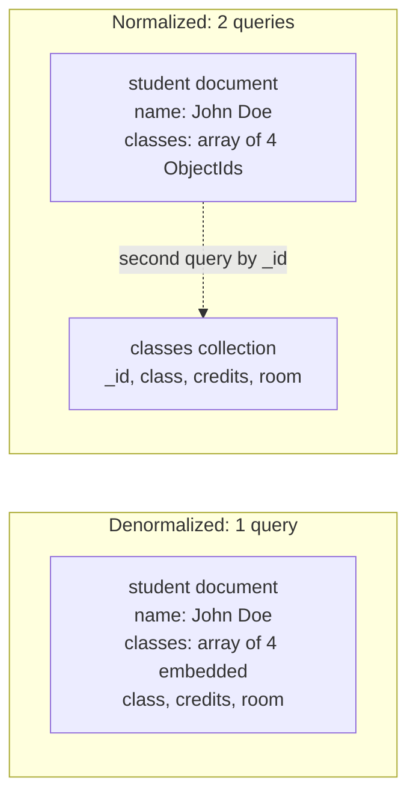

## Objective

Learn how the book turns "documents are flexible" into an actual design method: represent the data the way the application wants to see it, which means understanding your queries *before* modeling the schema. That covers the four things you have to establish up front (constraints, access patterns, relation types, cardinality), the catalogue of named schema-design patterns MongoDB treats as reusable building blocks, the normalization/denormalization spectrum walked through one worked example, the social-graph problem the book calls "Friends, Followers, and Other Inconveniences," and the chapter's closing honesty about when a relational database is simply the right answer.

## Use Cases

- Starting a new MongoDB schema and needing an order of operations: quantify the read and write workload, find the most common queries, and design so that data queried together lives in the same document — rather than translating an ER diagram into collections.
- Deciding whether a user's `friends`, `recentActivity`, or `accountPreferences` should be embedded, referenced, or split into a third collection — the chapter answers all three of these specific fields explicitly.
- Recognizing a schema problem as a *named* pattern with a known shape: time-series readings piling up one document per data point (Bucket), a product that needs 400,000 reviews when the page shows 10 (Subset), an order page doing three lookups to render a shipping address (Extended Reference), a celebrity account overflowing its followers array (Outlier).
- Designing the "delete old data" story for a logs or events collection, choosing among capped collections, TTL collections, and one-collection-per-month with a drop.
- Explaining to a team why a document that was inserted in one thread appears missing when checked from another — MongoDB's per-connection request queue plus driver connection pooling.
- Planning a schema migration that has to tolerate documents in several shapes at once, and picking between "support every old version forever," a `version` field, and a one-shot migration of every document.
- Making the honest call, at architecture time, that this particular workload should not be on MongoDB at all.

## Deep Dive

### The four things to establish before writing a schema

The chapter's framing is that unlike a relational database, "you first need to understand your queries and data access patterns before modeling your schema." Four inputs:

**Constraints.** Database and hardware limits, plus MongoDB specifics the book names directly: the maximum document size of **16 MB**, that *full* documents get read and written from disk, that an update **rewrites the whole document**, and that atomic updates are at the **document level**. Every one of those has schema consequences — a 15 MB document is expensive to touch even to change one field.

**Access patterns of queries and writes.** Identify and quantify the workload — reads *and* writes. Once you know when queries run and how frequently, you know the most common ones, and those are the queries the schema is designed for. Then: minimize the number of queries, and ensure data queried together is stored in the same document. The corollaries are equally concrete — data *not* used in those queries goes in a different collection, infrequently used data goes in a different collection, and it is worth separating **dynamic (read/write)** data from **static (mostly read)** data.

**Relation types.** Which data is related in terms of the application's needs. The useful questions are operational: how can you reference documents *without* performing additional queries, and how many documents get updated when a relationship changes. Also whether the structure is easy to query — nested arrays (arrays in arrays) model certain relationships but complicate access.

**Cardinality.** One-to-one, one-to-many, many-to-many, one-to-millions, many-to-billions. Beyond the raw shape, two follow-up questions decide the design: is the object on the many/millions side accessed **separately**, or only in the context of its parent? And what is the **ratio of updates to reads** for that field?

### The pattern catalogue

The book's position is that schema design directly affects application performance, that common problems have known solutions, and that best practice is to **combine several patterns**, not pick one. The twelve it lists:

| Pattern | Applies when | What it does |
|---|---|---|
| **Polymorphic** | All documents in a collection are similar but not identical | Identify the common fields that support the common queries; track a discriminating field so application code can branch. Simple queries over one collection of not-quite-identical documents |
| **Attribute** | A subset of fields share common features you sort or query on, or the sort fields exist only in some documents | Reshape into an array of key/value pairs and index the array elements; qualifiers become extra fields on the pairs. Fewer indexes, simpler queries |
| **Bucket** | Time-series data captured as a stream | Group a time range into one document (e.g. a one-hour bucket holding an array of readings, with start and end times) instead of a document per data point |
| **Outlier** | A handful of documents fall outside the normal pattern — influencers, bestsellers | A flag marks the document as an outlier; overflow goes into one or more documents referring back via `_id`, and application code makes the extra queries |
| **Computed** | Data is computed frequently, read-intensive access | Do the calculation in the background and update the main document periodically — a valid approximation without recomputing per query. Big CPU saving at high read-to-write ratios |
| **Subset** | Working set exceeds available RAM because documents carry a lot of unused information | Split frequently and infrequently used data into two collections — e.g. the 10 most recent product reviews in the main collection, older ones in a second collection queried only on demand |
| **Extended Reference** | Many logical entities in their own collections that you need to gather for one function | Duplicate the frequently accessed fields into the referencing document — an order carrying the customer's name and shipping address. Trades duplication for fewer queries |
| **Approximation** | Expensive calculations where exact precision is not required | A like counter or page-view counter — 999,535 versus 1,000,000 does not matter. Update after every 100 views instead of every view, cutting writes dramatically |
| **Tree** | Lots of queries over primarily hierarchical data | Store the hierarchy in an array in the same document. The book's example: "Hard Drive" under "Storage" under "Computer Parts" under "Electronics" — one array field holds the whole hierarchy (multikey-indexable), another holds the immediate category |
| **Preallocation** | Legacy of the MMAP storage engine, still occasionally useful | Create the empty structure up front and populate later — e.g. a reservation system's two-dimensional resources-by-days grid |
| **Document Versioning** | You need to retain older revisions | A version field on each document in the main collection plus a separate collection holding all revisions. Assumes a limited number of revisions, not many documents needing versioning, and queries mostly against the current version |

The book points at MongoDB University's free **M320 Data Modeling** course and MongoDB's "Building with Patterns" blog series as the reference material for these.

### Normalization versus denormalization

The definitions the book uses:

- **Normalization** — dividing data into multiple collections with references between them. Each piece of data lives in one collection; many documents may reference it, so changing it means updating **one** document. The Aggregation Framework offers joins via `$lookup`, a **left outer join** that adds a new array field to each matched document with the details of the matching document from the source collection, available to the next pipeline stage.
- **Denormalization** — embedding all the data in a single document. Many documents hold copies, so multiple documents need updating when the information changes, but all related data is fetched with a **single query**.

The compressed rule: *normalizing makes writes faster and denormalizing makes reads faster.*

### The worked example: students and classes

The chapter walks one relationship through four representations, and the query count is the point.

**1. A join table (`studentClasses`) — three round trips.**

```javascript
> db.studentClasses.findOne({"studentId" : id})
{
    "_id" : ObjectId("512512c1d86041c7dca81915"),
    "studentId" : ObjectId("512512a5d86041c7dca81914"),
    "classes" : [
        ObjectId("512512ced86041c7dca81916"),
        ObjectId("512512dcd86041c7dca81917"),
        ObjectId("512512e6d86041c7dca81918"),
        ObjectId("512512f0d86041c7dca81919")
    ]
}
```

Putting the class ids in an array is "a bit more MongoDB-ish" than one row per pair, but finding a student's classes means querying `students`, then `studentClasses` for the course ids, then `classes` for the details — **three trips to the server**. The book's verdict: generally not how you structure data in MongoDB, *unless* classes and students change constantly and reads do not need to be fast.

**2. References embedded in the student — two round trips.**

```javascript
{
    "_id" : ObjectId("512512a5d86041c7dca81914"),
    "name" : "John Doe",
    "classes" : [
        ObjectId("512512ced86041c7dca81916"),
        ObjectId("512512dcd86041c7dca81917"),
        ObjectId("512512e6d86041c7dca81918"),
        ObjectId("512512f0d86041c7dca81919")
    ]
}
```

One dereferencing query removed. Described as a fairly popular structure for data that "does not need to be instantly accessible and changes, but not constantly."

**3. Full denormalization — one round trip.**

```javascript
{
    "_id" : ObjectId("512512a5d86041c7dca81914"),
    "name" : "John Doe",
    "classes" : [
        {"class" : "Trigonometry",         "credits" : 3, "room" : "204"},
        {"class" : "Physics",              "credits" : 3, "room" : "159"},
        {"class" : "Women in Literature",  "credits" : 3, "room" : "14b"},
        {"class" : "AP European History",  "credits" : 4, "room" : "321"}
    ]
}
```

One query for everything. The downsides are named plainly: more space, harder to keep in sync. The book's own example of the bill — if Physics turns out to be worth four credits and not three, **every student in the physics class** needs their document updated, instead of updating one central "Physics" document.

**4. Extended Reference — the hybrid.**

```javascript
{
    "_id" : ObjectId("512512a5d86041c7dca81914"),
    "name" : "John Doe",
    "classes" : [
        {"_id" : ObjectId("512512ced86041c7dca81916"), "class" : "Trigonometry"},
        {"_id" : ObjectId("512512dcd86041c7dca81917"), "class" : "Physics"},
        {"_id" : ObjectId("512512e6d86041c7dca81918"), "class" : "Women in Literature"},
        {"_id" : ObjectId("512512f0d86041c7dca81919"), "class" : "AP European History"}
    ]
}
```

An array of subdocuments carrying the frequently used fields plus a reference for the rest. The book likes it for a reason that is about the *future*, not the present: how much you embed can change over time as requirements change — need more on the page, embed more.



### The embed-or-reference rules

The chapter's guidance, in the order it gives it:

- **Change frequency versus read frequency.** Updated regularly? Normalize. Changes infrequently? "There is little benefit to optimizing the update process at the expense of every read your application performs." The book's counterexample to the textbook: storing a user's address in a separate collection is the classic normalization exercise, but *people's addresses rarely change*, so do not penalize every read on the off chance someone moved — embed the address in the user document.
- **If you embed and you update, build the retry path.** Set up a cron job to ensure updates actually propagated to every document: a multi-update where the server crashes partway through leaves you needing to detect that and retry. On retry safety, the book is precise: `$set` is **idempotent**, `$inc` is **not**. For non-idempotent operators, split the operation into two individually idempotent ones — include a unique pending token in the first, and have the second use both a unique key and that pending token, which makes each `updateOne` idempotent.
- **Unbounded growth means reference.** "To some extent, the more information you are generating, the less of it you should embed." If the content or number of embedded fields grows without bound, reference it. Comment trees and activity lists get their own documents. Or apply the Subset pattern and keep only the most recent items inline.
- **Fields should be integral to the document.** If a field is almost always excluded from your query results, that is a good sign it belongs in another collection.

Table 9-1, the chapter's summary:

| Embedding is better for... | References are better for... |
|---|---|
| Small subdocuments | Large subdocuments |
| Data that does not change regularly | Volatile data |
| When eventual consistency is acceptable | When immediate consistency is necessary |
| Documents that grow by a small amount | Documents that grow by a large amount |
| Data you will often need a second query to fetch | Data you will often exclude from the results |
| Fast reads | Fast writes |

Applied to a `users` collection, field by field: **account preferences** are only relevant to this user and are exposed with the rest of the user information — embed. **Recent activity** depends on how much it grows and changes; a fixed-size field such as the last 10 things can be embedded, or use the Subset pattern. **Friends** should generally *not* be embedded, or at least not fully. **All the content this user has produced** should not be embedded.

### Cardinality, and splitting "many" into "many" and "few"

Cardinality here is "how many references a collection has to another collection." The blog example gives all three standard shapes: a post has a title (one-to-one), an author has many posts (one-to-many), posts have many tags and tags refer to many posts (many-to-many).

The MongoDB-specific refinement is subdividing "many" into **many** and **few**:

- authors to posts can be **one-to-few** — each author only writes a few posts
- blog posts to tags is **many-to-few** — many more posts than tags
- blog posts to comments is **one-to-many** — each post has many comments

The payoff is a direct rule: **"few" relationships work better with embedding, "many" relationships work better as references.**

### Friends, followers, and other inconveniences

The section opens with the book's own joke — *"Keep your friends close and your enemies embedded"* — and then does the useful reduction: following, friending, and favoriting all simplify to a **publication/subscription system**, one user subscribing to notifications from another. That leaves exactly two operations that must be efficient: **storing subscribers** and **notifying all interested parties of an event**. Three implementations, each with a mirror-image weakness.

**Option 1 — producer in the subscriber's document (`following`).**

```javascript
{
    "_id" : ObjectId("51250a5cd86041c7dca8190f"),
    "username" : "batman",
    "email" : "batman@waynetech.com",
    "following" : [
        ObjectId("51250a72d86041c7dca81910"),
        ObjectId("51250a7ed86041c7dca81936")
    ]
}
```

Finding everything a user might be interested in is one query:

```javascript
db.activities.find({"user" : {"$in" : user["following"]}})
```

The weakness: to find everyone interested in a newly published activity, you have to query the `following` field **across all users**.

**Option 2 — followers appended to the producer's document (`followers`).**

```javascript
{
    "_id" : ObjectId("51250a7ed86041c7dca81936"),
    "username" : "joker",
    "email" : "joker@mailinator.com",
    "followers" : [
        ObjectId("512510e8d86041c7dca81912"),
        ObjectId("51250a5cd86041c7dca8190f"),
        ObjectId("512510ffd86041c7dca81910")
    ]
}
```

Now when this user does something, everyone to notify is right there. The weakness is exactly the opposite: finding everyone a given user follows means querying the whole `users` collection.

Both share a further cost: user documents get **larger and more volatile**, and the field usually is not even needed in the response — "how often do you want to list every follower?"

**Option 3 — subscriptions in their own collection.** Documents mapping publisher to subscribers:

```javascript
{
    "_id" : ObjectId("51250a7ed86041c7dca81936"), // followee's "_id"
    "followers" : [
        ObjectId("512510e8d86041c7dca81912"),
        ObjectId("51250a5cd86041c7dca8190f"),
        ObjectId("512510ffd86041c7dca81910")
    ]
}
```

The book's honest caveat: "Normalizing this far is often overkill, but it can be useful for an extremely volatile field that often isn't returned with the rest of the document" — and `followers` is a sensible candidate. It keeps user documents svelte at the cost of an extra query.

**The Wil Wheaton effect.** Whichever strategy you pick, embedding only works for a **limited** number of subdocuments or references. Celebrity users overflow any document you store followers in. The compensation is the Outlier pattern plus a *continuation* document — a `"tbc"` ("to be continued") array of ids pointing at further documents that each hold more followers:

```javascript
> db.users.find({"username" : "wil"})
{
    "_id" : ObjectId("51252871d86041c7dca8191a"),
    "username" : "wil",
    "email" : "wil@example.com",
    "tbc" : [
        ObjectId("512528ced86041c7dca8191e"),
        ObjectId("5126510dd86041c7dca81924")
    ],
    "followers" : [ ObjectId("512528a0d86041c7dca8191b"), ... ]
}
{
    "_id" : ObjectId("512528ced86041c7dca8191e"),
    "followers" : [ ObjectId("512528f1d86041c7dca8191f"), ... ]
}
```

Then you add application logic to fetch the documents in the `tbc` array. Note what that means: the overflow is invisible to the database, and correctness now depends on every read path remembering to follow `tbc`.

### Optimizations for data manipulation

Find the bottleneck first by evaluating read *and* write performance. Then the two directions pull against each other:

- **Optimizing reads** — correct indexes, and returning as much information as possible in a single document.
- **Optimizing writes** — minimizing the number of indexes, and making updates as efficient as possible.

The nuance worth keeping: factor in not only the relative importance of reads versus writes but their **proportions**. "If writes are more important but you're doing a thousand reads to every write, you may still want to optimize reads first."

### Removing old data

Three options, in the book's order of increasing capability and complexity:

1. **Capped collection.** Easiest — set it large and let old data fall off the end. But capped collections restrict which operations you can perform, and they are **vulnerable to traffic spikes**: a burst temporarily shortens the time window they hold.
2. **TTL collection.** Finer-grained control over *when* documents are removed. But it "may not be fast enough for collections with a very high write volume," because it removes documents by traversing the TTL index the same way a user-requested remove would. If it can keep up, it is probably the easiest solution to implement.
3. **Multiple collections, one per time period.** One collection per month: on rollover the application starts writing to this month's empty collection and searches both the current and previous months; drop collections older than, say, six months. This "can keep up with nearly any volume of traffic," at the cost of dynamic collection or database names and possibly querying multiple databases.

### Planning out databases and collections

Documents with a similar schema generally belong in the same collection. Because MongoDB "generally disallows combining data from multiple collections," documents that need to be **queried or aggregated together** are candidates for one big collection even if their shapes differ — or you use the `$merge` stage when they are in separate collections or databases.

For collections, the big issues are **locking** (a read/write lock per document) and **storage**. A high-write workload may need multiple physical volumes to reduce I/O bottlenecks, and `--directoryperdb` puts each database in its own directory so databases can be mounted on different volumes. That leads to the design rule: keep items within a database of similar "quality" — similar access pattern, similar traffic level.

The book's worked split is by *value*, not by shape: a logging component producing a huge amount of not-very-valuable data, a `users` collection plus user-generated content that must be safe, and a high-traffic near-append-only social activities collection used for notifications, of middling importance. That is three databases — **logs**, **activities**, **users**. The observation that makes it pay: your highest-value data is usually also the data you have the least of, so you may not afford an SSD for the whole dataset but you can afford one for `users`, or run RAID10 for `users` and RAID0 for `logs` and `activities`.

Two operational caveats: there were limitations to using multiple databases before MongoDB **4.2** and its `$merge` operator, which lets an aggregation write results into a different database and collection; and `renameCollection` is **slower** when moving a collection across databases, because it has to copy every document.

### Managing consistency

Start from the question: how consistent do this application's reads need to be? MongoDB spans "always being able to read your own writes" to "reading data of unknown oldness." A yearly activity report may tolerate data correct to the last couple of days; real-time trading needs the latest writes immediately.

The mechanism underneath is a **per-connection request queue**. A client request goes to the end of its connection's queue, and subsequent requests on that connection run after it. So a **single connection has a consistent view of the database and can always read its own writes** — but two shells are two connections, and an insert in one may not be visible to a query in the other. The book names the exact symptom developers hit: insert data in one thread, check it in another, and "for a moment or two, it looks like the data was not inserted, and then it suddenly appears."

This matters especially with the Ruby, Python, and Java drivers, because all three use **connection pooling** — multiple connections with requests distributed across them. They all provide mechanisms to guarantee a series of requests is processed by a single connection; the details live in MongoDB's Connection Monitoring and Pooling driver specification.

Reading from replica-set **secondaries** makes it worse: secondaries lag, so reads can be seconds, minutes, or hours old. The easiest fix if you care about staleness is to send all reads to the primary. Otherwise MongoDB offers `readConcern` — five levels, `"local"`, `"available"`, `"majority"`, `"linearizable"`, `"snapshot"` — combinable with `writeConcern` to control the guarantees your application gets. To avoid read staleness, `"majority"` returns only durable data acknowledged by a majority of members that will not be rolled back; `"linearizable"` returns data reflecting all successful majority-acknowledged writes completed before the read started, and MongoDB may **wait for concurrently executing writes to finish** before returning. The chapter cites the MongoDB engineers' PVLDB 2019 paper "Tunable Consistency in MongoDB" for the full model.

### Migrating schemas

Whatever method you choose, **carefully document each schema your application has used**, and consider whether the Document Versioning pattern applies. Three approaches:

1. **Let the schema evolve, support all old versions.** Accept the existence or nonexistence of fields, handle multiple possible field types gracefully. This gets messy with *conflicting* versions — one requires a `"mobile"` field, another requires its absence plus a different field, a third treats `"mobile"` as optional. "Keeping track of these shifting requirements can gradually turn your code into spaghetti."
2. **A `"version"` (or `"v"`) field per document.** More rigorous: a document must be valid for *some* version of the schema, if not the current one. You still have to support old versions.
3. **Migrate all the data.** "Generally this is not a good idea: MongoDB allows you to have a dynamic schema in order to avoid migrates because they put a lot of pressure on your system." If you do it, you must ensure every document was successfully updated — transactions support this kind of migration, and if MongoDB crashes mid-transaction the older schema is retained.

### Managing schemas

Schema **validation** arrived in MongoDB **3.2**, validating during updates and insertions. **3.6** added JSON Schema validation via the `$jsonSchema` operator, "which is now the recommended method for all schema validation in MongoDB." The book notes MongoDB supported **draft 4** of JSON Schema at the time of writing and tells you to check the docs for current status.

Three mechanics that matter in practice:

- Validation **does not check existing documents** until they are modified, and it is configured **per collection**.
- Add it to an existing collection with the `collMod` command plus the `validator` option; add it to a new collection via the `validator` option on `db.createCollection()`.
- `validationLevel` controls how strictly rules apply to existing documents during an update; `validationAction` decides between an **error plus rejection** and a **warning that allows the illegal document through**.

### When Not to Use MongoDB

This is the chapter's closing section and it is short, blunt, and worth reading exactly as written — the book's own framing is that MongoDB "is a general-purpose database that works well for most applications" but "isn't good at everything." Two reasons to avoid it:

- **Joining many different types of data across many different dimensions** is something relational databases are fantastic at. MongoDB "isn't supposed to do this well and most likely never will." Note the strength of that: not "not yet," not "use `$lookup`" — it is a statement that this is outside the design intent, permanently.
- **Tool support.** "One of the big (if, hopefully, temporary) reasons to use a relational database over MongoDB is if you're using tools that don't support it." From SQLAlchemy to WordPress, thousands of tools were never built to support MongoDB. The pool is growing, but "its ecosystem is hardly the size of relational databases' yet." The book flags this one as *hopefully temporary*, unlike the join limitation.

If your workload is multi-dimensional ad-hoc analytical joining, the authors of the MongoDB book are telling you to use something else. That is the single most useful sentence in the chapter for architecture decisions.

### Book vs. today

> **Time-series collections largely replace the hand-rolled Bucket pattern.** The book describes bucketing time-series data into one document per time range as something you implement yourself. MongoDB **5.0** added native **time series collections**, which do the bucketing internally, with automatic clustering and columnar-style storage. The pattern's *reasoning* is unchanged and still worth understanding — it explains why the native feature exists — but on a modern deployment you should reach for the built-in collection type rather than writing bucket documents by hand.

> **"MongoDB generally disallows combining data from multiple collections" softened in 4.4.** The book was written before `$unionWith` (MongoDB 4.4), which lets one aggregation pipeline combine documents from two collections, and before later `$lookup` improvements (including targeting sharded collections). This is a capability addition, not a correction: the planning advice — put documents you aggregate together in one collection — remains the performance-motivated default, and the chapter's own "when not to use MongoDB" point about many-dimensional joins still stands.

> **The Preallocation pattern's original rationale is gone.** The book already flags it as "primarily used with the MMAP storage engine." MMAPv1 was **removed in MongoDB 4.2**; WiredTiger is the only storage engine. The pattern survives only as a data-modeling convenience (the reservation grid), not as a performance workaround.

> **The 16 MB document limit and the five `readConcern` levels are unchanged.** Worth stating explicitly because so much else in this chapter has moved: current MongoDB still caps a BSON document at 16 MB (with a nesting depth limit of 100 levels), and `readConcern` still has exactly the five levels the book lists. `$jsonSchema` is still the recommended validation mechanism, still based on a draft-4 subset with MongoDB-specific extensions such as `bsonType`.

> **`--directoryperdb` still exists, but the storage-tiering advice is dated in practice.** The option is still supported, and the "keep data of similar value in the same database" reasoning is sound. But the concrete recommendation — RAID10 for `users`, RAID0 for `logs`, an SSD you can only afford for part of the dataset — reflects 2019 self-managed hardware economics. On a managed deployment or cloud block storage, the same intent is expressed through separate clusters, storage tiers, or archiving rather than per-database mount points.

## Trade-offs

- **Embedding buys one round trip and sells you a rewrite of the whole document.** The denormalized student document answers the page in a single query, which is the entire point. But the book's own constraint list is what makes this a trade rather than a free win: an update **rewrites the whole document**, and full documents are read and written from disk. A large embedded array means every touch of any field pays for the whole thing. And the ceiling is hard — **16 MB** — so any array that can grow without bound is a schema bug with a delayed fuse, not a design. The book's rule is unambiguous on this: unbounded content gets referenced, and comment trees and activity lists get their own documents.
- **Referencing avoids both of those and puts the join in your application.** No document-size ceiling, no rewrite amplification, volatile data updated in one place. The cost is round trips you count by hand — the join-table version of students-and-classes is *three* server trips for one screen. `$lookup` exists and is a real left outer join, but it does not make MongoDB relational: the book's own closing section says joining many types of data across many dimensions is something MongoDB "isn't supposed to do well and most likely never will." Treating `$lookup` as a general substitute for a relational query planner is arguing with the design, not using it.
- **Denormalizing for read speed means you now own the data-integrity story.** The Physics-credits example is the whole problem in one line: one logical change, N document updates, and no transaction boundary implied by the schema. The book's mitigations are all *your* code — a cron job to verify propagation after a partial multi-update, awareness that `$set` is idempotent while `$inc` is not, and the pending-token trick to make a non-idempotent increment safely retryable. None of that exists in a normalized schema, where correcting the credits is one write. The question is not "which is better" but "which failure mode can your team operate."
- **The Extended Reference hybrid is the best default and still not free.** Embedding the frequently-read fields and referencing the rest gets one query for the common path and correct data for the rare path, and the amount embedded can be tuned as requirements change. But the duplicated fields are still duplicated: the customer's shipping address copied onto every order is *correct* to copy (an order should record the address at order time) while a product name copied onto every order line is a synchronization job someone has to remember exists. The pattern moves the decision from "embed or reference" to "which fields," which is a better question but not an easier one.
- **The social-graph options are three shapes of the same asymmetry.** `following` on the subscriber makes "what should I see" one query and "who cares about this event" a full-collection scan. `followers` on the producer inverts it exactly. A separate subscriptions collection fixes both and costs an extra query plus, in the book's own words, is "often overkill." There is no shape that makes both directions cheap, which is why the section is called "inconveniences." And every embedded option carries the Wil Wheaton problem: the fix is a `tbc` continuation array whose correctness lives entirely in application code that must never forget to follow it.
- **Schema flexibility is a feature until a bug uses it.** Trying many models cheaply and avoiding migrations is genuine leverage — the book explicitly says dynamic schemas exist so you can avoid migrations, which "put a lot of pressure on your system." The flip side is that nothing rejects a malformed write. A typo'd field name, a number stored as a string, a required field silently absent: all valid documents. `$jsonSchema` validation is the answer, but note its shape — **opt-in per collection**, and it **does not check existing documents until they are modified**. So it protects you going forward from the moment you attach it, and does nothing about whatever is already on disk unless you deliberately choose a `validationLevel` and backfill. `validationAction` can even be set to warn-and-allow, which is useful during rollout and a silent hole if you forget to tighten it.
- **Migration strategy is a choice between messy code and risky writes.** Supporting every historical shape in application code works and turns into spaghetti once versions *conflict* — the book's `"mobile"` example is required, forbidden, and optional across three versions. A `"version"` field makes the mess explicit and legible but does not reduce the number of code paths. Migrating everything is the only option that actually deletes old shapes, and it is the one the book says is "generally not a good idea." Transactions make it survivable, not cheap.
- **Consistency is per-connection, and connection pooling hides that from you.** A single connection always reads its own writes, which is a strong and useful guarantee — right up to the point where the Java, Python, or Ruby driver distributes your two requests across two pooled connections and the document you just inserted is not there yet. This is a correctness trap that only appears under concurrency, exactly where it is hardest to reproduce. Secondary reads amplify it into staleness measured in minutes. `readConcern: "majority"` and `"linearizable"` buy back guarantees with latency — `"linearizable"` may block waiting for in-flight writes to finish — so the honest framing is that MongoDB gives you a dial, not a default that is right for you.
- **Removing old data: each option trades throughput ceiling against operational complexity.** Capped collections are the easiest and the least controllable, and a traffic spike silently shortens your retention window — the retention guarantee is in bytes, not time. TTL indexes give you a time-based guarantee and delete documents the same expensive way a user `remove` would, so a high write volume can outrun the deleter with no alarm beyond a growing collection. Collection-per-month keeps up with nearly any volume because dropping a collection is cheap, and pushes dynamic collection names and multi-collection queries into your application forever. The order of these three is complexity increasing exactly as the throughput ceiling rises.

## Documentation Links

- [Shannon Bradshaw, Eoin Brazil, and Kristina Chodorow, "MongoDB: The Definitive Guide", 3rd Edition (O'Reilly, 2020) — Chapter 9, "Application Design", p. 228-245](https://www.oreilly.com/library/view/mongodb-the-definitive/9781491954454/) — doc
- [MongoDB Documentation — Data Modeling Introduction](https://www.mongodb.com/docs/manual/core/data-modeling-introduction/) — doc
- [MongoDB Documentation — Model One-to-Many Relationships with Embedded Documents](https://www.mongodb.com/docs/manual/tutorial/model-embedded-one-to-many-relationships-between-documents/) — doc
- [MongoDB Documentation — Model One-to-Many Relationships with Document References](https://www.mongodb.com/docs/manual/tutorial/model-referenced-one-to-many-relationships-between-documents/) — doc
- [MongoDB Documentation — Schema Validation](https://www.mongodb.com/docs/manual/core/schema-validation/) — doc
- [MongoDB Documentation — Time Series Collections](https://www.mongodb.com/docs/manual/core/timeseries-collections/) — doc
- [MongoDB Documentation — TTL Indexes](https://www.mongodb.com/docs/manual/core/index-ttl/) — doc
- [MongoDB Documentation — Capped Collections](https://www.mongodb.com/docs/manual/core/capped-collections/) — doc
- [MongoDB Documentation — Read Concern](https://www.mongodb.com/docs/manual/reference/read-concern/) — doc
- [MongoDB Documentation — $lookup (aggregation)](https://www.mongodb.com/docs/manual/reference/operator/aggregation/lookup/) — doc
- [MongoDB Documentation — $unionWith (aggregation)](https://www.mongodb.com/docs/manual/reference/operator/aggregation/unionWith/) — doc
- [MongoDB Documentation — Limits and Thresholds (16 MB BSON document size)](https://www.mongodb.com/docs/manual/reference/limits/) — doc
- [MongoDB Blog — Building with Patterns: A Summary](https://www.mongodb.com/blog/post/building-with-patterns-a-summary) — doc
- [MongoDB Drivers — Connection Monitoring and Pooling specification](https://github.com/mongodb/specifications/blob/master/source/connection-monitoring-and-pooling/connection-monitoring-and-pooling.md) — doc
