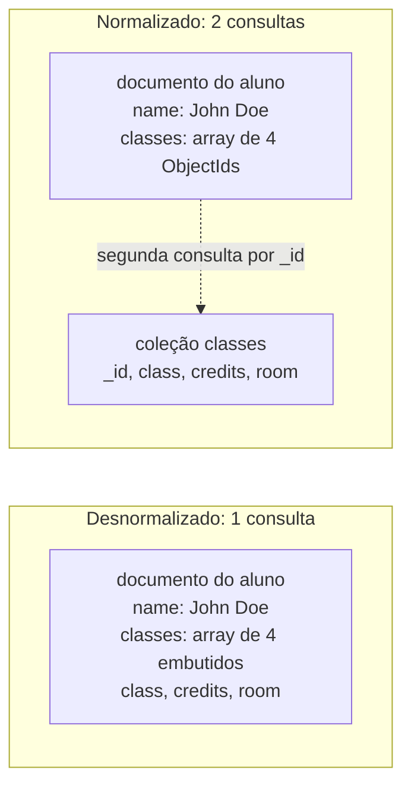

## Objective

Aprender como o livro transforma "documentos são flexíveis" em um método de design de verdade: representar os dados do jeito que a aplicação quer vê-los, o que significa entender suas consultas *antes* de modelar o schema. Isso cobre as quatro coisas que você precisa estabelecer de início (restrições, padrões de acesso, tipos de relação, cardinalidade), o catálogo de padrões de design de schema nomeados que o MongoDB trata como blocos de construção reutilizáveis, o espectro entre normalização e desnormalização percorrido em um exemplo resolvido, o problema do grafo social que o livro chama de "Friends, Followers, and Other Inconveniences", e a honestidade final do capítulo sobre quando um banco relacional é simplesmente a resposta certa.

## Use Cases

- Começar um schema novo no MongoDB e precisar de uma ordem de operações: quantificar a carga de leitura e escrita, encontrar as consultas mais comuns e projetar para que dados consultados juntos vivam no mesmo documento, em vez de traduzir um diagrama ER em coleções.
- Decidir se `friends`, `recentActivity` ou `accountPreferences` de um usuário deveriam ser embutidos, referenciados ou separados em uma terceira coleção; o capítulo responde explicitamente para esses três campos específicos.
- Reconhecer um problema de schema como um padrão *nomeado*, com uma forma conhecida: leituras de série temporal se acumulando com um documento por ponto (Bucket), um produto que precisa de 400.000 avaliações quando a página mostra 10 (Subset), uma página de pedido fazendo três buscas para renderizar um endereço de entrega (Extended Reference), uma conta de celebridade transbordando seu array de seguidores (Outlier).
- Desenhar a história de "apagar dados antigos" para uma coleção de logs ou eventos, escolhendo entre capped collections, coleções com TTL e uma coleção por mês com drop.
- Explicar a um time por que um documento inserido em uma thread parece não existir quando verificado a partir de outra: a fila de requisições por conexão do MongoDB somada ao pool de conexões do driver.
- Planejar uma migração de schema que precisa tolerar documentos em várias formas ao mesmo tempo, escolhendo entre "suportar toda versão antiga para sempre", um campo `version` e uma migração única de todos os documentos.
- Tomar a decisão honesta, no momento da arquitetura, de que esta carga de trabalho específica não deveria estar no MongoDB.

## Deep Dive

### As quatro coisas a estabelecer antes de escrever um schema

O enquadramento do capítulo é que, diferente de um banco relacional, "você primeiro precisa entender suas consultas e padrões de acesso a dados antes de modelar seu schema." Quatro entradas:

**Restrições.** Limites do banco e do hardware, mais especificidades do MongoDB que o livro nomeia diretamente: o tamanho máximo de documento de **16 MB**, o fato de documentos *inteiros* serem lidos e escritos do disco, o fato de um update **reescrever o documento inteiro**, e o fato de updates atômicos serem em **nível de documento**. Cada uma dessas tem consequências de schema: um documento de 15 MB é caro de tocar mesmo para mudar um campo.

**Padrões de acesso de consultas e escritas.** Identifique e quantifique a carga de trabalho, leituras *e* escritas. Quando você sabe quando as consultas rodam e com que frequência, sabe quais são as mais comuns, e são essas as consultas para as quais o schema é projetado. Então: minimize o número de consultas e garanta que dados consultados juntos fiquem no mesmo documento. Os corolários são igualmente concretos: dados *não* usados nessas consultas vão para outra coleção, dados pouco usados vão para outra coleção, e vale separar dados **dinâmicos (leitura/escrita)** de dados **estáticos (majoritariamente leitura)**.

**Tipos de relação.** Quais dados se relacionam em termos das necessidades da aplicação. As perguntas úteis são operacionais: como referenciar documentos *sem* fazer consultas adicionais, e quantos documentos são atualizados quando uma relação muda. E também se a estrutura é fácil de consultar: arrays aninhados (arrays dentro de arrays) modelam certas relações, mas complicam o acesso.

**Cardinalidade.** Um para um, um para muitos, muitos para muitos, um para milhões, muitos para bilhões. Além da forma bruta, duas perguntas de acompanhamento decidem o design: o objeto do lado "muitos/milhões" é acessado **separadamente**, ou só no contexto do pai? E qual é a **proporção de updates para leituras** daquele campo?

### O catálogo de padrões

A posição do livro é que o design de schema afeta diretamente o desempenho da aplicação, que problemas comuns têm soluções conhecidas e que a boa prática é **combinar vários padrões**, não escolher um. Os doze que ele lista:

| Padrão | Quando se aplica | O que faz |
|---|---|---|
| **Polymorphic** | Todos os documentos de uma coleção são parecidos, mas não idênticos | Identifica os campos comuns que suportam as consultas comuns; acompanha um campo discriminador para que o código da aplicação possa ramificar. Consultas simples sobre uma coleção de documentos quase idênticos |
| **Attribute** | Um subconjunto de campos compartilha características comuns pelas quais você ordena ou consulta, ou os campos de ordenação existem só em alguns documentos | Remodela em um array de pares chave/valor e indexa os elementos do array; qualificadores viram campos extras nos pares. Menos índices, consultas mais simples |
| **Bucket** | Dados de série temporal capturados como fluxo | Agrupa um intervalo de tempo em um documento (por exemplo, um bucket de uma hora com um array de leituras, com hora de início e de fim) em vez de um documento por ponto |
| **Outlier** | Alguns poucos documentos fogem do padrão normal: influenciadores, best-sellers | Uma flag marca o documento como outlier; o excedente vai para um ou mais documentos que apontam de volta via `_id`, e o código da aplicação faz as consultas extras |
| **Computed** | Dados calculados com frequência, acesso intenso de leitura | Faz o cálculo em segundo plano e atualiza o documento principal periodicamente: uma aproximação válida sem recalcular a cada consulta. Grande economia de CPU com alta proporção de leituras para escritas |
| **Subset** | O working set excede a RAM disponível porque os documentos carregam muita informação não usada | Separa os dados usados com frequência dos pouco usados em duas coleções; por exemplo, as 10 avaliações de produto mais recentes na coleção principal e as mais antigas em uma segunda coleção, consultada só sob demanda |
| **Extended Reference** | Muitas entidades lógicas em coleções próprias que você precisa reunir para uma função | Duplica os campos acessados com frequência no documento que referencia: um pedido carregando o nome e o endereço de entrega do cliente. Troca duplicação por menos consultas |
| **Approximation** | Cálculos caros em que a precisão exata não é necessária | Um contador de curtidas ou de visualizações: 999.535 contra 1.000.000 não importa. Atualiza a cada 100 visualizações em vez de a cada uma, reduzindo drasticamente as escritas |
| **Tree** | Muitas consultas sobre dados principalmente hierárquicos | Guarda a hierarquia em um array no mesmo documento. O exemplo do livro: "Hard Drive" sob "Storage" sob "Computer Parts" sob "Electronics"; um campo de array guarda a hierarquia inteira (indexável como multikey), outro guarda a categoria imediata |
| **Preallocation** | Legado do storage engine MMAP, ainda útil de vez em quando | Cria a estrutura vazia de antemão e popula depois; por exemplo, a grade bidimensional de recursos por dias de um sistema de reservas |
| **Document Versioning** | Você precisa manter revisões antigas | Um campo de versão em cada documento da coleção principal mais uma coleção separada com todas as revisões. Pressupõe um número limitado de revisões, poucos documentos precisando de versionamento e consultas majoritariamente na versão atual |

O livro aponta o curso gratuito **M320 Data Modeling** da MongoDB University e a série de posts "Building with Patterns" do MongoDB como material de referência para esses padrões.

### Normalização versus desnormalização

As definições que o livro usa:

- **Normalização**: dividir os dados em várias coleções com referências entre elas. Cada dado vive em uma coleção; muitos documentos podem referenciá-lo, então mudá-lo significa atualizar **um** documento. O Aggregation Framework oferece joins via `$lookup`, um **left outer join** que adiciona um novo campo de array a cada documento casado, com os detalhes do documento correspondente na coleção de origem, disponível para o próximo estágio do pipeline.
- **Desnormalização**: embutir todos os dados em um único documento. Muitos documentos guardam cópias, então vários documentos precisam ser atualizados quando a informação muda, mas todos os dados relacionados são buscados com **uma única consulta**.

A regra resumida: *normalizar deixa as escritas mais rápidas e desnormalizar deixa as leituras mais rápidas.*

### O exemplo resolvido: alunos e turmas

O capítulo percorre uma relação em quatro representações, e a contagem de consultas é o ponto.

**1. Uma tabela de junção (`studentClasses`): três idas ao servidor.**

```javascript
> db.studentClasses.findOne({"studentId" : id})
{
    "_id" : ObjectId("512512c1d86041c7dca81915"),
    "studentId" : ObjectId("512512a5d86041c7dca81914"),
    "classes" : [
        ObjectId("512512ced86041c7dca81916"),
        ObjectId("512512dcd86041c7dca81917"),
        ObjectId("512512e6d86041c7dca81918"),
        ObjectId("512512f0d86041c7dca81919")
    ]
}
```

Colocar os ids das turmas em um array é "um pouco mais no estilo MongoDB" que uma linha por par, mas encontrar as turmas de um aluno significa consultar `students`, depois `studentClasses` para os ids dos cursos, depois `classes` para os detalhes: **três idas ao servidor**. O veredito do livro: em geral não é assim que se estruturam dados no MongoDB, *a menos que* turmas e alunos mudem o tempo todo e as leituras não precisem ser rápidas.

**2. Referências embutidas no aluno: duas idas ao servidor.**

```javascript
{
    "_id" : ObjectId("512512a5d86041c7dca81914"),
    "name" : "John Doe",
    "classes" : [
        ObjectId("512512ced86041c7dca81916"),
        ObjectId("512512dcd86041c7dca81917"),
        ObjectId("512512e6d86041c7dca81918"),
        ObjectId("512512f0d86041c7dca81919")
    ]
}
```

Uma consulta de desreferenciação a menos. Descrita como uma estrutura bastante popular para dados que "não precisam estar acessíveis instantaneamente e mudam, mas não o tempo todo."

**3. Desnormalização completa: uma ida ao servidor.**

```javascript
{
    "_id" : ObjectId("512512a5d86041c7dca81914"),
    "name" : "John Doe",
    "classes" : [
        {"class" : "Trigonometry",         "credits" : 3, "room" : "204"},
        {"class" : "Physics",              "credits" : 3, "room" : "159"},
        {"class" : "Women in Literature",  "credits" : 3, "room" : "14b"},
        {"class" : "AP European History",  "credits" : 4, "room" : "321"}
    ]
}
```

Uma consulta para tudo. As desvantagens são ditas com clareza: mais espaço, mais difícil de manter sincronizado. O próprio exemplo do livro para a conta: se Física passar a valer quatro créditos e não três, **todo aluno da turma de física** precisa ter seu documento atualizado, em vez de atualizar um documento central "Physics".

**4. Extended Reference: o híbrido.**

```javascript
{
    "_id" : ObjectId("512512a5d86041c7dca81914"),
    "name" : "John Doe",
    "classes" : [
        {"_id" : ObjectId("512512ced86041c7dca81916"), "class" : "Trigonometry"},
        {"_id" : ObjectId("512512dcd86041c7dca81917"), "class" : "Physics"},
        {"_id" : ObjectId("512512e6d86041c7dca81918"), "class" : "Women in Literature"},
        {"_id" : ObjectId("512512f0d86041c7dca81919"), "class" : "AP European History"}
    ]
}
```

Um array de subdocumentos com os campos usados com frequência mais uma referência para o resto. O livro gosta dele por um motivo que diz respeito ao *futuro*, não ao presente: o quanto você embute pode mudar com o tempo à medida que os requisitos mudam; se precisar de mais na página, embuta mais.



### As regras de embutir ou referenciar

A orientação do capítulo, na ordem em que ele a dá:

- **Frequência de mudança versus frequência de leitura.** Atualizado com regularidade? Normalize. Muda raramente? "Há pouco benefício em otimizar o processo de update às custas de toda leitura que sua aplicação faz." O contraexemplo do livro ao manual: guardar o endereço de um usuário em uma coleção separada é o exercício clássico de normalização, mas *os endereços das pessoas raramente mudam*, então não penalize toda leitura pela chance de alguém ter se mudado; embuta o endereço no documento do usuário.
- **Se você embute e atualiza, construa o caminho de nova tentativa.** Configure um cron job para garantir que os updates de fato se propagaram a todos os documentos: um multi-update em que o servidor cai no meio deixa você precisando detectar isso e tentar de novo. Sobre segurança na nova tentativa, o livro é preciso: `$set` é **idempotente**, `$inc` **não é**. Para operadores não idempotentes, divida a operação em duas operações idempotentes individualmente: inclua um token pendente único na primeira, e faça a segunda usar tanto uma chave única quanto esse token pendente, o que torna cada `updateOne` idempotente.
- **Crescimento ilimitado significa referenciar.** "Até certo ponto, quanto mais informação você gera, menos dela deveria embutir." Se o conteúdo ou o número de campos embutidos cresce sem limite, referencie. Árvores de comentários e listas de atividade ganham documentos próprios. Ou aplique o padrão Subset e mantenha só os itens mais recentes no documento.
- **Os campos deveriam ser parte integral do documento.** Se um campo é quase sempre excluído dos resultados das suas consultas, é um bom sinal de que ele pertence a outra coleção.

A Tabela 9-1, o resumo do capítulo:

| Embutir é melhor para... | Referências são melhores para... |
|---|---|
| Subdocumentos pequenos | Subdocumentos grandes |
| Dados que não mudam com regularidade | Dados voláteis |
| Quando consistência eventual é aceitável | Quando consistência imediata é necessária |
| Documentos que crescem pouco | Documentos que crescem muito |
| Dados que muitas vezes exigiriam uma segunda consulta para buscar | Dados que você muitas vezes exclui dos resultados |
| Leituras rápidas | Escritas rápidas |

Aplicado a uma coleção `users`, campo a campo: as **preferências da conta** só interessam a este usuário e são expostas junto com o resto da informação dele: embuta. A **atividade recente** depende de quanto ela cresce e muda; um campo de tamanho fixo, como as últimas 10 coisas, pode ser embutido, ou use o padrão Subset. **Amigos** em geral *não* deveriam ser embutidos, ou pelo menos não por completo. **Todo o conteúdo que este usuário produziu** não deveria ser embutido.

### Cardinalidade, e dividir "muitos" em "muitos" e "poucos"

Cardinalidade aqui é "quantas referências uma coleção tem para outra coleção." O exemplo do blog dá as três formas padrão: um post tem um título (um para um), um autor tem muitos posts (um para muitos), posts têm muitas tags e tags se referem a muitos posts (muitos para muitos).

O refinamento específico do MongoDB é subdividir "muitos" em **muitos** e **poucos**:

- autores para posts pode ser **um para poucos**: cada autor escreve só alguns posts
- posts do blog para tags é **muitos para poucos**: há muito mais posts que tags
- posts do blog para comentários é **um para muitos**: cada post tem muitos comentários

O ganho é uma regra direta: **relações de "poucos" funcionam melhor embutidas, relações de "muitos" funcionam melhor como referências.**

### Amigos, seguidores e outras inconveniências

A seção abre com a piada do próprio livro (*"Mantenha seus amigos por perto e seus inimigos embutidos"*) e então faz a redução útil: seguir, adicionar como amigo e favoritar se simplificam todos em um **sistema de publicação/assinatura**, um usuário assinando as notificações de outro. Isso deixa exatamente duas operações que precisam ser eficientes: **armazenar os assinantes** e **notificar todos os interessados sobre um evento**. Três implementações, cada uma com uma fraqueza espelhada.

**Opção 1: o produtor no documento do assinante (`following`).**

```javascript
{
    "_id" : ObjectId("51250a5cd86041c7dca8190f"),
    "username" : "batman",
    "email" : "batman@waynetech.com",
    "following" : [
        ObjectId("51250a72d86041c7dca81910"),
        ObjectId("51250a7ed86041c7dca81936")
    ]
}
```

Encontrar tudo o que pode interessar a um usuário é uma consulta:

```javascript
db.activities.find({"user" : {"$in" : user["following"]}})
```

A fraqueza: para encontrar todos os interessados em uma atividade recém-publicada, você precisa consultar o campo `following` **de todos os usuários**.

**Opção 2: seguidores acrescentados ao documento do produtor (`followers`).**

```javascript
{
    "_id" : ObjectId("51250a7ed86041c7dca81936"),
    "username" : "joker",
    "email" : "joker@mailinator.com",
    "followers" : [
        ObjectId("512510e8d86041c7dca81912"),
        ObjectId("51250a5cd86041c7dca8190f"),
        ObjectId("512510ffd86041c7dca81910")
    ]
}
```

Agora, quando este usuário faz algo, todos que precisam ser notificados estão ali. A fraqueza é exatamente a oposta: encontrar todos que um dado usuário segue significa consultar a coleção `users` inteira.

As duas compartilham um custo adicional: os documentos de usuário ficam **maiores e mais voláteis**, e o campo normalmente nem é necessário na resposta; "com que frequência você quer listar todos os seguidores?"

**Opção 3: assinaturas em uma coleção própria.** Documentos mapeando o publicador para seus assinantes:

```javascript
{
    "_id" : ObjectId("51250a7ed86041c7dca81936"), // "_id" de quem é seguido
    "followers" : [
        ObjectId("512510e8d86041c7dca81912"),
        ObjectId("51250a5cd86041c7dca8190f"),
        ObjectId("512510ffd86041c7dca81910")
    ]
}
```

A ressalva honesta do livro: "Normalizar até este ponto muitas vezes é exagero, mas pode ser útil para um campo extremamente volátil que muitas vezes não é retornado com o resto do documento", e `followers` é um candidato sensato. Isso mantém os documentos de usuário enxutos ao custo de uma consulta extra.

**O efeito Wil Wheaton.** Qualquer que seja a estratégia, embutir só funciona para um número **limitado** de subdocumentos ou referências. Usuários celebridades transbordam qualquer documento em que você guarde seguidores. A compensação é o padrão Outlier mais um documento de *continuação*: um array `"tbc"` ("to be continued") de ids apontando para outros documentos, cada um com mais seguidores:

```javascript
> db.users.find({"username" : "wil"})
{
    "_id" : ObjectId("51252871d86041c7dca8191a"),
    "username" : "wil",
    "email" : "wil@example.com",
    "tbc" : [
        ObjectId("512528ced86041c7dca8191e"),
        ObjectId("5126510dd86041c7dca81924")
    ],
    "followers" : [ ObjectId("512528a0d86041c7dca8191b"), ... ]
}
{
    "_id" : ObjectId("512528ced86041c7dca8191e"),
    "followers" : [ ObjectId("512528f1d86041c7dca8191f"), ... ]
}
```

Depois você acrescenta lógica de aplicação para buscar os documentos do array `tbc`. Note o que isso significa: o excedente é invisível para o banco, e a corretude agora depende de todo caminho de leitura lembrar de seguir o `tbc`.

### Otimizações para manipulação de dados

Encontre o gargalo primeiro avaliando o desempenho de leitura *e* de escrita. Então as duas direções puxam uma contra a outra:

- **Otimizar leituras**: os índices corretos, e retornar o máximo possível de informação em um único documento.
- **Otimizar escritas**: minimizar o número de índices, e tornar os updates o mais eficientes possível.

A nuance que vale guardar: leve em conta não só a importância relativa de leituras versus escritas, mas suas **proporções**. "Se as escritas são mais importantes, mas você faz mil leituras para cada escrita, talvez ainda queira otimizar as leituras primeiro."

### Removendo dados antigos

Três opções, na ordem do livro, de capacidade e complexidade crescentes:

1. **Capped collection.** A mais fácil: defina um tamanho grande e deixe os dados antigos caírem pelo fim. Mas capped collections restringem as operações que você pode fazer e são **vulneráveis a picos de tráfego**: uma rajada encurta temporariamente a janela de tempo que elas guardam.
2. **Coleção com TTL.** Controle mais fino sobre *quando* os documentos são removidos. Mas ela "pode não ser rápida o suficiente para coleções com volume de escrita muito alto", porque remove documentos percorrendo o índice TTL do mesmo jeito que um remove pedido pelo usuário faria. Se ela der conta, provavelmente é a solução mais fácil de implementar.
3. **Várias coleções, uma por período.** Uma coleção por mês: na virada, a aplicação começa a escrever na coleção vazia deste mês e busca tanto no mês atual quanto no anterior; apague coleções com mais de, digamos, seis meses. Isso "consegue acompanhar praticamente qualquer volume de tráfego", ao custo de nomes dinâmicos de coleção ou de banco e, possivelmente, de consultar vários bancos.

### Planejando bancos e coleções

Documentos com schema parecido em geral pertencem à mesma coleção. Como o MongoDB "em geral não permite combinar dados de várias coleções", documentos que precisam ser **consultados ou agregados juntos** são candidatos a uma única coleção grande, mesmo que suas formas difiram, ou você usa o estágio `$merge` quando eles estão em coleções ou bancos separados.

Para coleções, as grandes questões são **lock** (um lock de leitura/escrita por documento) e **armazenamento**. Uma carga com muita escrita pode precisar de vários volumes físicos para reduzir gargalos de E/S, e `--directoryperdb` coloca cada banco em seu próprio diretório, para que os bancos possam ser montados em volumes diferentes. Isso leva à regra de design: mantenha em um banco itens de "qualidade" parecida, com padrão de acesso e nível de tráfego parecidos.

A divisão resolvida do livro é por *valor*, não por forma: um componente de logs que produz uma quantidade enorme de dados de pouco valor, uma coleção `users` mais o conteúdo gerado pelos usuários que precisa estar seguro, e uma coleção de atividades sociais de alto tráfego, quase só de acréscimos, usada para notificações, de importância intermediária. São três bancos: **logs**, **activities**, **users**. A observação que faz isso compensar: seus dados de maior valor normalmente também são os dados que você tem em menor quantidade, então talvez você não possa pagar um SSD para o dataset inteiro, mas pode pagar um para `users`, ou rodar RAID10 para `users` e RAID0 para `logs` e `activities`.

Duas ressalvas operacionais: havia limitações para usar vários bancos antes do MongoDB **4.2** e seu operador `$merge`, que permite a uma agregação escrever resultados em outro banco e coleção; e `renameCollection` é **mais lento** ao mover uma coleção entre bancos, porque precisa copiar todos os documentos.

### Gerenciando a consistência

Comece pela pergunta: quão consistentes precisam ser as leituras desta aplicação? O MongoDB vai de "sempre conseguir ler suas próprias escritas" a "ler dados de idade desconhecida." Um relatório anual de atividades pode tolerar dados corretos até uns dois dias atrás; negociação em tempo real precisa das escritas mais recentes imediatamente.

O mecanismo por baixo é uma **fila de requisições por conexão**. Uma requisição do cliente vai para o fim da fila da sua conexão, e as requisições seguintes nessa conexão rodam depois dela. Então **uma única conexão tem uma visão consistente do banco e sempre consegue ler suas próprias escritas**, mas dois shells são duas conexões, e um insert em um pode não ser visível para uma consulta no outro. O livro nomeia o sintoma exato que os desenvolvedores encontram: inserir dados em uma thread, verificá-los em outra e "por um ou dois momentos, parece que os dados não foram inseridos, e então eles aparecem de repente."

Isso importa especialmente com os drivers de Ruby, Python e Java, porque os três usam **pool de conexões**: várias conexões, com as requisições distribuídas entre elas. Todos oferecem mecanismos para garantir que uma série de requisições seja processada por uma única conexão; os detalhes estão na especificação de drivers Connection Monitoring and Pooling do MongoDB.

Ler dos **secundários** de um replica set piora as coisas: os secundários ficam para trás, então as leituras podem ter segundos, minutos ou horas de atraso. A correção mais fácil, se você se importa com dados desatualizados, é mandar todas as leituras para o primário. Caso contrário, o MongoDB oferece `readConcern`, com cinco níveis (`"local"`, `"available"`, `"majority"`, `"linearizable"`, `"snapshot"`), combináveis com `writeConcern` para controlar as garantias que sua aplicação recebe. Para evitar leituras desatualizadas, `"majority"` retorna apenas dados duráveis, confirmados por uma maioria dos membros, que não serão revertidos; `"linearizable"` retorna dados que refletem todas as escritas bem-sucedidas confirmadas pela maioria que terminaram antes de a leitura começar, e o MongoDB pode **esperar as escritas em execução concorrente terminarem** antes de retornar. O capítulo cita o artigo do PVLDB 2019 dos engenheiros do MongoDB, "Tunable Consistency in MongoDB", para o modelo completo.

### Migrando schemas

Qualquer que seja o método escolhido, **documente com cuidado cada schema que sua aplicação já usou**, e considere se o padrão Document Versioning se aplica. Três abordagens:

1. **Deixar o schema evoluir e suportar todas as versões antigas.** Aceitar a existência ou não de campos e lidar graciosamente com vários tipos possíveis de campo. Isso fica bagunçado com versões *conflitantes*: uma exige um campo `"mobile"`, outra exige sua ausência mais um campo diferente, uma terceira trata `"mobile"` como opcional. "Acompanhar esses requisitos que mudam pode, aos poucos, transformar seu código em espaguete."
2. **Um campo `"version"` (ou `"v"`) por documento.** Mais rigoroso: um documento precisa ser válido para *alguma* versão do schema, ainda que não a atual. Você ainda precisa suportar as versões antigas.
3. **Migrar todos os dados.** "Em geral isso não é uma boa ideia: o MongoDB permite um schema dinâmico justamente para evitar migrações, porque elas colocam muita pressão no sistema." Se fizer, precisa garantir que todo documento foi atualizado com sucesso; transações suportam esse tipo de migração, e se o MongoDB cair no meio de uma transação, o schema antigo é mantido.

### Gerenciando schemas

A **validação** de schema chegou no MongoDB **3.2**, validando durante updates e inserções. O **3.6** adicionou validação por JSON Schema via o operador `$jsonSchema`, "que agora é o método recomendado para toda validação de schema no MongoDB." O livro observa que o MongoDB suportava o **draft 4** do JSON Schema na época em que foi escrito e manda conferir a documentação para o status atual.

Três mecânicas que importam na prática:

- A validação **não verifica documentos existentes** até que eles sejam modificados, e é configurada **por coleção**.
- Adicione-a a uma coleção existente com o comando `collMod` mais a opção `validator`; adicione-a a uma coleção nova pela opção `validator` de `db.createCollection()`.
- `validationLevel` controla o quão rigorosamente as regras se aplicam a documentos existentes durante um update; `validationAction` decide entre **erro com rejeição** e **um aviso que deixa o documento inválido passar**.

### Quando não usar o MongoDB

Esta é a seção final do capítulo, e ela é curta, direta e vale ser lida exatamente como está escrita; o próprio enquadramento do livro é que o MongoDB "é um banco de propósito geral que funciona bem para a maioria das aplicações", mas "não é bom em tudo." Dois motivos para evitá-lo:

- **Fazer join de muitos tipos diferentes de dados por muitas dimensões diferentes** é algo em que bancos relacionais são fantásticos. O MongoDB "não foi feito para fazer isso bem e provavelmente nunca fará." Note a força disso: não é "ainda não", não é "use `$lookup`"; é uma afirmação de que isso está fora da intenção do design, de forma permanente.
- **Suporte de ferramentas.** "Um dos grandes motivos (esperamos que temporário) para usar um banco relacional em vez do MongoDB é se você usa ferramentas que não o suportam." Do SQLAlchemy ao WordPress, milhares de ferramentas nunca foram feitas para suportar o MongoDB. O conjunto está crescendo, mas "seu ecossistema ainda nem chega perto do tamanho do ecossistema dos bancos relacionais." O livro marca este motivo como *esperançosamente temporário*, diferente da limitação dos joins.

Se a sua carga é de joins analíticos ad hoc em várias dimensões, os autores do livro de MongoDB estão dizendo para você usar outra coisa. Essa é a frase mais útil do capítulo para decisões de arquitetura.

### Livro vs. hoje

> **Coleções de séries temporais substituem em grande parte o padrão Bucket feito à mão.** O livro descreve agrupar dados de série temporal em um documento por intervalo de tempo como algo que você mesmo implementa. O MongoDB **5.0** adicionou **coleções de séries temporais** nativas, que fazem o agrupamento internamente, com clustering automático e armazenamento em estilo colunar. O *raciocínio* do padrão não mudou e ainda vale entender (ele explica por que o recurso nativo existe), mas em uma implantação moderna você deveria usar o tipo de coleção embutido em vez de escrever documentos de bucket à mão.

> **"O MongoDB em geral não permite combinar dados de várias coleções" ficou mais brando no 4.4.** O livro foi escrito antes do `$unionWith` (MongoDB 4.4), que permite a um pipeline de agregação combinar documentos de duas coleções, e antes de melhorias posteriores no `$lookup` (incluindo mirar coleções shardeadas). É uma adição de capacidade, não uma correção: o conselho de planejamento (colocar em uma coleção os documentos que você agrega juntos) continua sendo o padrão motivado por desempenho, e o ponto do próprio capítulo sobre "quando não usar o MongoDB" para joins em muitas dimensões continua valendo.

> **A justificativa original do padrão Preallocation sumiu.** O livro já o marca como "usado principalmente com o storage engine MMAP." O MMAPv1 foi **removido no MongoDB 4.2**; o WiredTiger é o único storage engine. O padrão sobrevive só como conveniência de modelagem (a grade de reservas), não como contorno de desempenho.

> **O limite de 16 MB por documento e os cinco níveis de `readConcern` não mudaram.** Vale dizer isso explicitamente porque tanto mais neste capítulo mudou: o MongoDB atual ainda limita um documento BSON a 16 MB (com limite de 100 níveis de aninhamento), e `readConcern` ainda tem exatamente os cinco níveis que o livro lista. `$jsonSchema` continua sendo o mecanismo de validação recomendado, ainda baseado em um subconjunto do draft 4 com extensões específicas do MongoDB, como `bsonType`.

> **`--directoryperdb` ainda existe, mas o conselho de camadas de armazenamento está datado na prática.** A opção continua suportada, e o raciocínio de "manter dados de valor parecido no mesmo banco" é sólido. Mas a recomendação concreta (RAID10 para `users`, RAID0 para `logs`, um SSD que você só pode pagar para parte do dataset) reflete a economia de hardware autogerenciado de 2019. Em uma implantação gerenciada ou com armazenamento em bloco na nuvem, a mesma intenção se expressa com clusters separados, tiers de armazenamento ou arquivamento, em vez de pontos de montagem por banco.

## Trade-offs

- **Embutir compra uma ida ao servidor e vende a você a reescrita do documento inteiro.** O documento desnormalizado do aluno atende a página com uma única consulta, e esse é todo o ponto. Mas é a própria lista de restrições do livro que torna isso uma troca, e não uma vitória de graça: um update **reescreve o documento inteiro**, e documentos inteiros são lidos e escritos do disco. Um array embutido grande significa que cada toque em qualquer campo paga pelo todo. E o teto é rígido, **16 MB**, então qualquer array que possa crescer sem limite é um bug de schema com pavio longo, não um design. A regra do livro é inequívoca nisso: conteúdo ilimitado é referenciado, e árvores de comentários e listas de atividade ganham documentos próprios.
- **Referenciar evita as duas coisas e coloca o join na sua aplicação.** Sem teto de tamanho de documento, sem amplificação de reescrita, dados voláteis atualizados em um lugar. O custo são idas ao servidor que você conta à mão: a versão com tabela de junção de alunos e turmas são *três* idas para uma tela. `$lookup` existe e é um left outer join de verdade, mas não torna o MongoDB relacional: a própria seção final do livro diz que fazer join de muitos tipos de dados em muitas dimensões é algo que o MongoDB "não foi feito para fazer bem e provavelmente nunca fará." Tratar `$lookup` como substituto geral para um planejador de consultas relacional é discutir com o design, não usá-lo.
- **Desnormalizar por velocidade de leitura significa que agora a integridade dos dados é responsabilidade sua.** O exemplo dos créditos de Física é o problema inteiro em uma linha: uma mudança lógica, N updates de documentos, e nenhuma fronteira de transação implícita no schema. As mitigações do livro são todas código *seu*: um cron job para verificar a propagação depois de um multi-update parcial, a consciência de que `$set` é idempotente enquanto `$inc` não é, e o truque do token pendente para tornar um incremento não idempotente seguro para nova tentativa. Nada disso existe em um schema normalizado, em que corrigir os créditos é uma escrita. A pergunta não é "qual é melhor", mas "qual modo de falha seu time consegue operar."
- **O híbrido Extended Reference é o melhor padrão e ainda assim não é de graça.** Embutir os campos lidos com frequência e referenciar o resto dá uma consulta para o caminho comum e dados corretos para o caminho raro, e a quantidade embutida pode ser ajustada à medida que os requisitos mudam. Mas os campos duplicados continuam duplicados: o endereço de entrega do cliente copiado em cada pedido é *correto* de copiar (um pedido deveria registrar o endereço do momento do pedido), enquanto o nome de um produto copiado em cada linha de pedido é um job de sincronização cuja existência alguém precisa lembrar. O padrão move a decisão de "embutir ou referenciar" para "quais campos", uma pergunta melhor, mas não mais fácil.
- **As opções de grafo social são três formas da mesma assimetria.** `following` no assinante faz de "o que eu devo ver" uma consulta e de "quem se importa com este evento" uma leitura da coleção inteira. `followers` no produtor inverte isso exatamente. Uma coleção separada de assinaturas resolve os dois lados e custa uma consulta extra, além de ser, nas palavras do próprio livro, "muitas vezes exagero". Não há forma que barateie as duas direções, e é por isso que a seção se chama "inconveniências". E toda opção embutida carrega o problema Wil Wheaton: a correção é um array de continuação `tbc` cuja corretude vive inteiramente em código de aplicação que nunca pode esquecer de segui-lo.
- **A flexibilidade de schema é um recurso até um bug usá-la.** Experimentar muitos modelos com baixo custo e evitar migrações é uma alavanca real; o livro diz explicitamente que schemas dinâmicos existem para você evitar migrações, que "colocam muita pressão no sistema." O outro lado é que nada rejeita uma escrita malformada. Um nome de campo com erro de digitação, um número guardado como string, um campo obrigatório ausente em silêncio: todos são documentos válidos. A validação `$jsonSchema` é a resposta, mas note sua forma: **opcional, por coleção**, e ela **não verifica documentos existentes até que sejam modificados**. Então ela protege você daqui para a frente a partir do momento em que é anexada, e não faz nada sobre o que já está no disco, a menos que você escolha deliberadamente um `validationLevel` e faça um backfill. `validationAction` pode até ser configurado para avisar e deixar passar, o que é útil durante a implantação e um buraco silencioso se você esquecer de apertá-lo.
- **A estratégia de migração é uma escolha entre código bagunçado e escritas arriscadas.** Suportar toda forma histórica no código da aplicação funciona e vira espaguete quando as versões *conflitam*; o exemplo `"mobile"` do livro é obrigatório, proibido e opcional em três versões. Um campo `"version"` deixa a bagunça explícita e legível, mas não reduz o número de caminhos de código. Migrar tudo é a única opção que de fato apaga as formas antigas, e é a que o livro diz que "em geral não é uma boa ideia." Transações tornam isso sobrevivível, não barato.
- **A consistência é por conexão, e o pool de conexões esconde isso de você.** Uma única conexão sempre lê suas próprias escritas, uma garantia forte e útil, até o ponto em que o driver de Java, Python ou Ruby distribui suas duas requisições por duas conexões do pool e o documento que você acabou de inserir ainda não está lá. É uma armadilha de corretude que só aparece sob concorrência, exatamente onde é mais difícil de reproduzir. Leituras em secundários a ampliam para dados desatualizados medidos em minutos. `readConcern: "majority"` e `"linearizable"` recompram garantias com latência (`"linearizable"` pode bloquear esperando escritas em andamento terminarem), então o enquadramento honesto é que o MongoDB dá a você um botão de ajuste, não um padrão que esteja certo para você.
- **Remover dados antigos: cada opção troca teto de throughput por complexidade operacional.** Capped collections são as mais fáceis e as menos controláveis, e um pico de tráfego encurta em silêncio sua janela de retenção: a garantia de retenção é em bytes, não em tempo. Índices TTL dão uma garantia baseada em tempo e apagam documentos do mesmo jeito caro que um `remove` do usuário faria, então um volume alto de escrita pode ultrapassar o apagador sem nenhum alarme além de uma coleção que cresce. Uma coleção por mês acompanha praticamente qualquer volume, porque apagar uma coleção é barato, e empurra para sempre nomes dinâmicos de coleção e consultas em várias coleções para dentro da sua aplicação. A ordem dessas três é de complexidade crescente exatamente à medida que o teto de throughput sobe.

## Documentation Links

- [Shannon Bradshaw, Eoin Brazil e Kristina Chodorow, "MongoDB: The Definitive Guide", 3ª edição (O'Reilly, 2020): Capítulo 9, "Application Design", p. 228-245](https://www.oreilly.com/library/view/mongodb-the-definitive/9781491954454/): doc
- [MongoDB Documentation: Data Modeling Introduction](https://www.mongodb.com/docs/manual/core/data-modeling-introduction/): doc
- [MongoDB Documentation: Model One-to-Many Relationships with Embedded Documents](https://www.mongodb.com/docs/manual/tutorial/model-embedded-one-to-many-relationships-between-documents/): doc
- [MongoDB Documentation: Model One-to-Many Relationships with Document References](https://www.mongodb.com/docs/manual/tutorial/model-referenced-one-to-many-relationships-between-documents/): doc
- [MongoDB Documentation: Schema Validation](https://www.mongodb.com/docs/manual/core/schema-validation/): doc
- [MongoDB Documentation: Time Series Collections](https://www.mongodb.com/docs/manual/core/timeseries-collections/): doc
- [MongoDB Documentation: TTL Indexes](https://www.mongodb.com/docs/manual/core/index-ttl/): doc
- [MongoDB Documentation: Capped Collections](https://www.mongodb.com/docs/manual/core/capped-collections/): doc
- [MongoDB Documentation: Read Concern](https://www.mongodb.com/docs/manual/reference/read-concern/): doc
- [MongoDB Documentation: $lookup (aggregation)](https://www.mongodb.com/docs/manual/reference/operator/aggregation/lookup/): doc
- [MongoDB Documentation: $unionWith (aggregation)](https://www.mongodb.com/docs/manual/reference/operator/aggregation/unionWith/): doc
- [MongoDB Documentation: Limits and Thresholds (16 MB BSON document size)](https://www.mongodb.com/docs/manual/reference/limits/): doc
- [MongoDB Blog: Building with Patterns: A Summary](https://www.mongodb.com/blog/post/building-with-patterns-a-summary): doc
- [MongoDB Drivers: Connection Monitoring and Pooling specification](https://github.com/mongodb/specifications/blob/master/source/connection-monitoring-and-pooling/connection-monitoring-and-pooling.md): doc
