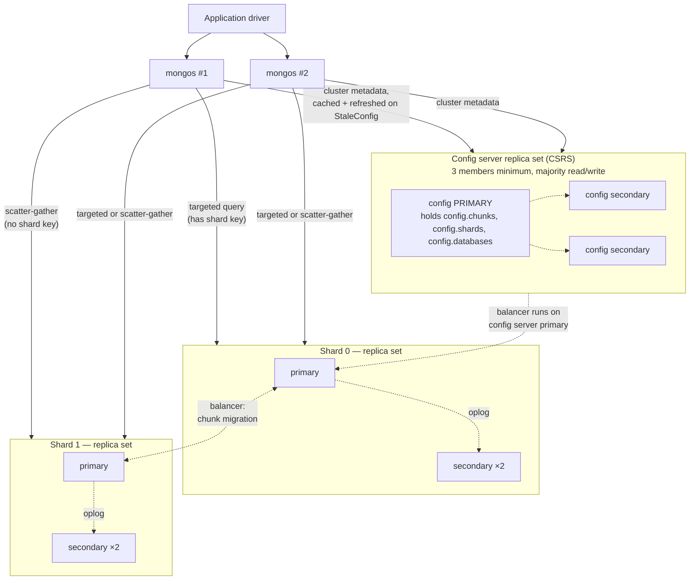
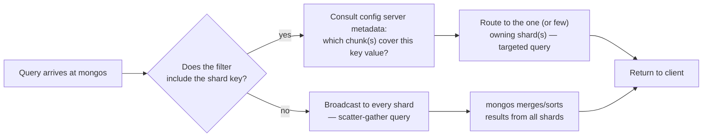

## Objective

Understand the three moving parts of a MongoDB sharded cluster — the query-routing `mongos` layer, the config server replica set that holds the cluster's metadata, and the shards themselves (each a replica set holding a slice of the data) — and how a single client query travels through that topology to land on the right machine, or the wrong number of machines. The book states the goal of the whole architecture in one line: "One of the goals of sharding is to make a cluster of 2, 3, 10, or even hundreds of shards look like a single machine to your application." This concept is about the topology that makes that illusion work — the routing, the metadata store, the chunk-splitting and balancing machinery — not about which field to shard on; that decision, and its consequences, belong to the sibling concept on choosing a shard key.

## Use Cases

- Standing up a new sharded cluster and needing to know the startup order — config servers first, then `mongos`, then shards — because "the config servers must be started before any of the mongos processes, as mongos pulls its configuration from them."
- Debugging a `mongos` log full of "unable to setShardVersion" errors during normal operation, and recognizing it as the expected side effect of a chunk migration in progress rather than a fault.
- Explaining to a team why a query that omits the shard key is slow at scale: it becomes a scatter-gather (broadcast) query that every shard must execute, versus a targeted query that `mongos` routes to a single shard.
- Sizing a config server replica set for production and understanding why it must be a real, dedicated replica set with journaling enabled on durable storage — "if all of your config servers are lost, you must dig through the data on your shards to figure out which data is where."
- Deciding how many `mongos` routers to run: enough for high availability and to sit close to the shards, but not so many that they overload the config servers with metadata refresh traffic.
- Diagnosing a "split storm" — a shard hammering the config servers with repeated failed chunk-split attempts — and tracing it back to an unreachable or unhealthy config server replica set.
- Converting an existing standalone replica set into a cluster's first shard, and understanding why every shard, since MongoDB 3.6, must itself be a replica set rather than a single `mongod`.

## Deep Dive

### The three components, and what each one does (and doesn't) do

A sharded cluster has exactly three kinds of process, and the book is precise about drawing the line between replication and sharding before describing either one: "Many people are confused about the difference between replication and sharding. Remember that replication creates an exact copy of your data on multiple servers, so every server is a mirror image of every other server. Conversely, every shard contains a different subset of data." Sharding and replication are not alternatives — a production shard *is* a replica set, so the cluster is sharded across machines and replicated within each machine group at the same time.

**`mongos` — the router.** It "keeps a 'table of contents' that tells it which shard contains which data. Applications can connect to this router and issue requests normally... The router, knowing what data is on which shard, is able to forward the requests to the appropriate shard(s). If there are responses to a request the router collects them and, if necessary, merges them, and sends them back to the application." Critically, `mongos` is stateless with respect to your data: "it does not need a data directory (mongos holds no data itself; it loads the cluster configuration from the config servers on startup)." That statelessness is what makes it disposable — restart one, add ten more, and nothing about the cluster's data changes. The book's operational guidance is to keep the router tier deliberately small: "you should start a small number of mongos processes and locate them as close to all the shards as possible... The minimal setup is at least two mongos processes to ensure high availability. It is possible to run tens or hundreds of mongos processes but this causes resource contention on the config servers. The recommended approach is to provide a small pool of routers."

**Config servers — the brains.** "Config servers are the brains of your cluster: they hold all of the metadata about which servers hold what data. Thus, they must be set up first, and the data they hold is extremely important: make sure that they are running with journaling enabled and that their data is stored on nonephemeral drives." A config server started with `--configsvr` is deliberately restricted — "clients (i.e., other cluster components) cannot write data to any database other than config or admin" — and everything it stores is metadata, not application data: which replica sets host which shards, which collections are sharded and by what key, and which shard owns which chunk. "MongoDB writes data to the config database when the metadata changes, such as after a chunk migration or a chunk split." Since the metadata is small, the resource profile is unusual for a database tier: "In terms of provisioning, config servers should be provisioned adequately in terms of networking and CPU resources. They only hold a table of contents of the data in the cluster so the storage resources required are minimal." Every read and write to the config servers uses the strongest consistency levels MongoDB offers — "MongoDB uses a writeConcern level of `majority`... [and] a readConcern level of `majority`" — specifically "to ensure sharded cluster metadata will not be committed to the config server replica set until it can't be rolled back," and "to ensure all mongos routers have a consistent view of how data is organized in a sharded cluster." Every `mongos` in the cluster is reading from the same source of truth, so they can never disagree about where a document lives.

**Shards — where the data actually lives.** Since MongoDB 3.4, every shard must itself be a replica set: "Beginning with MongoDB 3.4, for sharded clusters, mongod instances for shards must be configured with the `--shardsvr` option." And since 3.6, no exceptions: "Prior to MongoDB 3.6 it was possible to create a standalone mongod as a shard. This is no longer an option in versions of MongoDB later than 3.6. All shards must be replica sets." That closes off the one topology where a single hardware failure could take an entire shard of data offline with no automatic failover.

### How a query actually gets routed

The client never talks to a shard directly — it always goes through `mongos`, and "as far as the application knows, it's connected to a standalone mongod." What `mongos` does next depends entirely on whether the query includes the shard key. The book runs both cases through `explain()` on the same cluster: a query on the shard key produces a `"SINGLE_SHARD"` winning plan naming exactly one shard, while a query without it produces `"SHARD_MERGE"` naming every shard in the cluster. The book names the two categories directly: "Queries that contain the shard key and can be sent to a single shard or a subset of shards are called **targeted queries**. Queries that must be sent to all shards are called **scatter-gather (broadcast) queries**: mongos scatters the query to all the shards and then gathers up the results." A targeted query costs roughly what a query against a single replica set would cost. A scatter-gather query costs a round trip to every shard plus a merge step at `mongos` — the more shards you add, the more expensive every un-targeted query becomes, even though total throughput for targeted queries keeps scaling.

### Chunks: how the metadata stays small

`mongos` never tracks individual documents — that "becomes unwieldy for collections with millions or billions of documents." Instead it tracks **chunks**, contiguous ranges of the shard key, each of which "always lives on a single shard, so MongoDB can keep a small table of chunks mapped to shards." A newly sharded collection is one chunk spanning `$minKey` to `$maxKey`; as it grows, a shard's primary `mongod` notices a chunk crossing a size threshold and splits it into two, updating the config servers with the new boundary. When the resulting top chunk keeps growing on one shard, the balancer is asked to migrate it elsewhere — the mechanism the sibling concept covers in depth for the ascending-key hotspot case.

If a config server is unreachable when a shard tries to record a split, the split simply fails and is retried on the next write, which the book names precisely: "this process of mongod repeatedly attempting to split a chunk and being unable to is called a **split storm**... The only way to prevent split storms is to ensure that your config servers are up and healthy as much of the time as possible." That single sentence is why config server availability is load-bearing for the whole cluster's write path, not just for query routing.

### The balancer, and why migrations are invisible to the application

"The balancer is responsible for migrating data. It regularly checks for imbalances between shards and, if it finds an imbalance, will begin migrating chunks." Since MongoDB 3.4, it runs as "a background process on the primary member of the config server replica set" rather than being taken on ad hoc by whichever `mongos` happened to notice the imbalance in earlier versions. Concurrency is deliberately capped: "the number of concurrent migrations increased to one migration per shard with a maximum number of concurrent migrations being half the total number of shards" — a cluster doesn't try to rebalance everything simultaneously and starve itself of I/O.

The migration itself is designed so the application never has to know it happened: "An application using the cluster does not need be aware that the data is moving: all reads and writes are routed to the old chunk until the move is complete. Once the metadata is updated, any mongos process attempting to access the data in the old location will get an error. These errors should not be visible to the client: the mongos will silently handle the error and retry the operation on the new shard." That retry is the source of the "unable to setShardVersion" messages operators see in `mongos` logs — a `mongos` with a stale view of the chunk table, correcting itself automatically. If it can't correct itself because the config servers are down, the error does surface to the client — one more reason config server health sits underneath every guarantee this architecture makes.

### Book vs. today

> **Config server replica set requirements are unchanged in substance, and current documentation states additional restrictions the book doesn't spell out.** The book's "at least three members, journaling enabled, nonephemeral storage" still matches current guidance. Current MongoDB docs additionally require the config server replica set to have **zero arbiters**, **no delayed members**, and **no non-index-building members** — restrictions the book doesn't call out explicitly for config servers (it does discuss arbiters and delayed members as general replica set tools elsewhere), but which follow naturally from the config servers' job: every member must be able to serve a fully consistent, immediately queryable copy of the metadata.

> **Chunk size defaults and the balancer's decision rule both changed, starting in MongoDB 6.0.** The book's default chunk size at the time of writing was 64 MB (its own single-machine demo explicitly overrides it to 1 MB to keep the example fast: "The chunksize option is covered in Chapter 17. For now, simply set it to 1"). Current MongoDB defaults to a **128 MB** range/chunk size. More importantly, the balancing *decision* itself moved: the book describes migration as reacting to "an uneven number of chunks," but current docs define balance purely in terms of **data size**: "A collection is considered balanced if the difference in data between shards... is less than three times the configured range size" — at the default size, shards must differ by at least 384 MB of data for that collection before a migration triggers. Chunk *count* is no longer the balancer's signal.

> **Auto-splitting on the shard primary, as the book describes it, is no longer how splits happen.** The book's mechanism — "each shard primary mongod tracks their current chunks and, once they reach a certain threshold, checks if the chunk needs to be split" independently of any migration — described the pre-6.0 architecture. Since 6.0, automatic chunk splitting driven by a background threshold check was removed; chunks are now split only as a byproduct of migration, and balancing decisions are driven by the data-size comparison above rather than by chunk counts crossing a split threshold. The consequence the book warns about — an ascending shard key concentrating all writes on one shard's top chunk — is unaffected by this change; only the bookkeeping mechanism that used to create new chunks proactively has moved.

> **A fourth deployment shape now exists: the config shard.** Starting in MongoDB 8.0, the config server replica set can optionally also hold application data as a real shard (`sh.isConfigShardEnabled()`), collapsing the config-server-only role the book describes into a smaller total node count for modest clusters. This doesn't change anything about how `mongos` routes queries or how chunks migrate; it changes only how many physical replica sets a minimal cluster needs to stand up.

> **Concurrent migration limits, "no standalone mongod shards," and the mongos-holds-no-data description are all still accurate as the book states them.** The `n/2`-shards concurrent-migration cap the book attributes to 3.4+ is current documented behavior, and the requirement that every shard be a replica set (no bare `mongod` shards since 3.6) — already framed by the book as a hard version cutoff — remains true today with no further change.

## Trade-offs

- **The illusion of a single server costs an extra network hop and a metadata dependency on every query.** Routing through `mongos` is what lets "an application... ignore the fact that it isn't talking to a standalone MongoDB server," but every query now depends on `mongos` having current shard-metadata, which in turn depends on the config servers being reachable. A healthy cluster hides this completely; an unhealthy config server tier turns an ordinary query into a `StaleConfig`-driven retry loop or, in the worst case, a client-visible error.
- **Targeted vs. scatter-gather is the single biggest lever on scalability, and it's decided entirely by whether the shard key is in the filter.** A targeted query's cost is roughly independent of cluster size — more shards just means more capacity. A scatter-gather query's cost grows with the number of shards, because `mongos` must visit and merge results from every one of them. This is why the shard key decision (covered in the sibling concept) is inseparable from the topology decision covered here: the architecture only delivers linear scaling for the query patterns the shard key actually targets.
- **Config servers trade a tiny resource footprint for an outsized blast radius.** They "only hold a table of contents," so storage and compute needs are minimal — but losing them means losing the map to every document in the cluster: "you must dig through the data on your shards to figure out which data is where. This is possible, but slow and unpleasant." The correct response to that asymmetry is operational, not architectural: frequent backups and treating config server health as a first-class alerting concern even though its resource usage looks trivial next to the shards.
- **A small `mongos` pool is a deliberate trade against config server load, not an oversight.** Running more routers looks like free horizontal scaling for the routing tier, but every `mongos` independently polls the config servers for metadata; past a modest count, more routers cause "resource contention on the config servers" rather than more throughput. The book's guidance — a small pool, placed close to the shards — treats `mongos` count as a tuning knob bounded from above, not a dial to turn freely.
- **Invisible migrations protect the application at the cost of transient latency and log noise during rebalancing.** The design goal — reads and writes keep working against the old chunk location until the move completes, and `mongos` silently retries against the new one — means correctness is preserved automatically. But "unable to setShardVersion" messages and the extra retry round trip are the visible cost of that guarantee, and a cluster mid-migration is genuinely doing more work per request than a settled one, even though nothing about the request's result changes.
- **Requiring every shard to be a replica set removes an entire failure mode at the cost of running strictly more processes.** Before 3.6, a lone `mongod` shard was possible and was a single point of failure for its slice of the data; today every shard carries the same replication machinery (and rollback/election behavior) the sibling replica-set concept describes. A minimal production cluster is therefore at least: 2 `mongos` + 3 config servers + (3 × number of shards) `mongod` processes — more moving parts than the book's own quick single-machine `ShardingTest` demo suggests, which is exactly why the book insists "you should be comfortable with standalone servers and replica sets before attempting to deploy or use a sharded cluster."

## Documentation Links

- [Shannon Bradshaw, Eoin Brazil, and Kristina Chodorow, "MongoDB: The Definitive Guide", 3rd Edition (O'Reilly, 2020) — Chapter 14-15, "Introduction to Sharding" and "Configuring Sharding", p. 289-317](https://www.oreilly.com/library/view/mongodb-the-definitive/9781491954454/) — doc
- [MongoDB Documentation — Sharded Cluster Components](https://www.mongodb.com/docs/manual/core/sharded-cluster-components/) — doc
- [MongoDB Documentation — Config Servers](https://www.mongodb.com/docs/manual/core/sharded-cluster-config-servers/) — doc
- [MongoDB Documentation — Sharded Cluster Query Routing (mongos)](https://www.mongodb.com/docs/manual/core/sharded-cluster-query-router/) — doc
- [MongoDB Documentation — Sharded Cluster Balancer](https://www.mongodb.com/docs/manual/core/sharding-balancer-administration/) — doc
- [MongoDB Documentation — Data Partitioning with Chunks](https://www.mongodb.com/docs/manual/core/sharding-data-partitioning/) — doc
- [MongoDB Documentation — Modify Range Size in a Sharded Cluster](https://www.mongodb.com/docs/manual/tutorial/modify-chunk-size-in-sharded-cluster/) — doc
- [MongoDB Documentation — Convert a Replica Set to a Sharded Cluster](https://www.mongodb.com/docs/manual/tutorial/convert-replica-set-to-replicated-shard-cluster/) — doc
